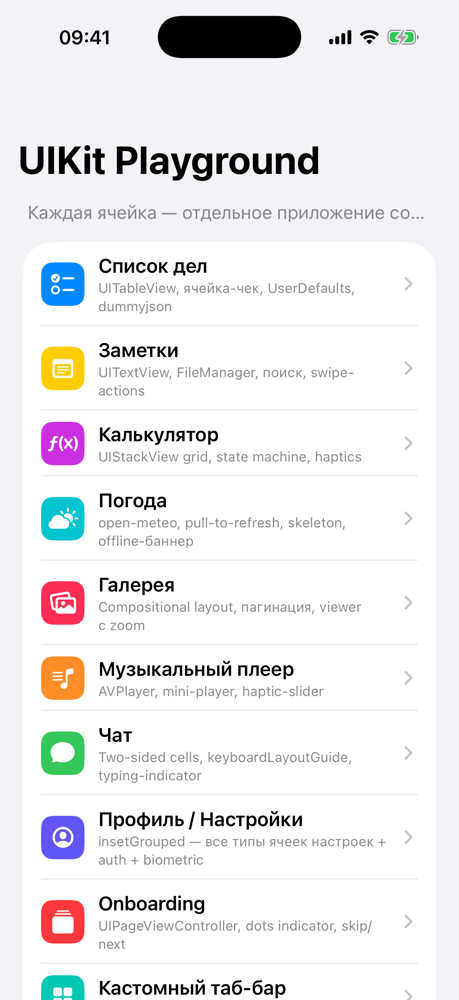

# Введение

{width=45%}

Эта книга — практикум по UIKit. Не словарь, не пересказ Apple Docs.
Здесь мы собираем **10 полноценных мини-приложений** в одном Xcode-проекте
и попутно разбираем все паттерны, которые встречаются в реальном
production-коде.

Каждое mini-app — от пустой папки в Xcode до экрана, который не стыдно
показать на собеседовании. Со splash, onboarding (где уместно),
permission primer, pull-to-refresh, skeleton'ом, photo viewer'ом,
haptics — всем, что отличает «учебный пример» от настоящего приложения.

## Чем эта книга отличается

Есть [`ShopApp-Book-Beginner`](https://github.com/sirserik/alma-shop-ios-book-prod/tree/shopapp-beginner)
— линейная история «строим один e-commerce от Hello World до App Store».
Прочитал главу 14, перешёл к главе 15. Каждая опирается на предыдущие.

Эта книга — **каталог-практикум**. Mini-приложения **независимы**: можно
взять «Список дел», потом «Галерею», потом «Чат» — без потери смысла.
**UI Cookbook** (часть IV) — справочник: пришёл за конкретным паттерном
(например, «как сделать pull-to-refresh с кастомным сообщением») —
прочитал, забрал в свой проект.

## Кому подойдёт

- **Junior**, который сделал хотя бы один экран в UIKit и хочет двигаться
  дальше — узнать про splash, onboarding, лицензионные экраны, тёмную тему,
  haptics.
- **Middle**, который пишет давно, но хочет освежить «как делается X в
  2026 году» — здесь все паттерны на актуальных API (iOS 15+, Xcode 26+).
- **Кто-то** возвращающийся в UIKit после SwiftUI — увидит современный
  UIKit-стиль с `@MainActor`, async/await, без legacy completion-handler'ов.

**Кому не подойдёт**: тем, кто открыл Xcode впервые и хочет научиться
писать `if`-ы. Для них — `ShopApp-Book-Beginner`.

## Что мы построим — учебный проект `beginner-testing-app`

Один Xcode-проект, который ведёт себя как **playground**: на главном
экране — список мини-приложений, тап → запускается выбранное, как будто
это отдельное приложение из App Store. Со своим splash, своим
brand-цветом, своей логикой. Встряхнул телефон (Cmd+Ctrl+Z в симуляторе)
— вернулся в список.

Это не один монолит. Это **полигон**, где каждое mini-app живёт в своей
папке (`Apps/Todo/`, `Apps/Notes/`, `Apps/Gallery/`…), а общий boot-слой
(splash, lifecycle, regroup) — в `App/`. Дизайн-токены (отступы, цвета,
шрифты) — в `Common/`.

Структура проекта:

```
beginner-testing-app/
├── App/                       ← общий boot-слой
│   ├── AppManifest.swift      ← конфиг одного mini-app
│   ├── AppRegistry.swift      ← реестр всех mini-apps
│   ├── PlaygroundWindow.swift ← UIWindow подкласс с shake-detect
│   ├── BootCoordinator.swift  ← оркестратор гейтов
│   ├── AnimatedSplashViewController.swift
│   └── AppListViewController.swift
├── Common/
│   ├── DesignSystem.swift     ← Spacing, Radius, Palette, Typography
│   └── Layout.swift           ← Auto Layout helpers
├── Apps/
│   ├── Todo/
│   │   ├── Models/
│   │   │   ├── Todo.swift
│   │   │   ├── TodoStorage.swift
│   │   │   └── TodoAPI.swift  ← dummyjson seed
│   │   └── UI/
│   │       ├── TodoListViewController.swift
│   │       ├── TodoCell.swift
│   │       └── TodoEditorViewController.swift
│   ├── Notes/
│   ├── Calculator/
│   ├── Weather/
│   └── …
└── Resources/
    └── Assets.xcassets
```

В книге мы пройдём через каждый из этих файлов и поймём, **зачем он там
именно такой**.

## Стек, на котором пишем

- **Swift 5/6 hybrid** — Xcode 26 ставит `SWIFT_DEFAULT_ACTOR_ISOLATION =
  MainActor` по умолчанию. Это значит весь UIKit-код **автоматически**
  изолирован на main, и компилятор не даёт сделать race condition.
- **UIKit** + **Storyboard для одной вещи — LaunchScreen** (Apple требует).
  Всё остальное — кодом.
- **iOS 15.0+** как deployment target. Свежие API (`@Observable`,
  `UISheetPresentationController` с `.custom` detents) помечаем `@available`.
- **Никакого SwiftUI**. Это книга про UIKit. SwiftUI — отдельный мир.

## Как читать

- **Часть I. Фундамент** — читай **по порядку**. Это base, от которого
  отталкиваются все mini-apps.
- **Часть II. Launch-гейты** — тоже по порядку, но можно прыгать через
  гейты, которые тебе не нужны (например, age gate почти никому не
  актуален).
- **Часть III. Mini-приложения** — **выбирай**. Не нужно читать все
  подряд. Берёшь то, что хочешь сделать.
- **Часть IV. UI Cookbook** — **справочник**. Открываешь, когда нужен
  конкретный паттерн.
- **Часть V. Production checklist** — перед первым релизом в App Store.

## Условные обозначения

> 💡 **Идея главы.** Самое важное — в цитатах с лампочкой.

```swift
let example = "это код, который можно (и нужно) набрать"
```

🛠 **Упражнение.** Маленькое задание. Делай **до того**, как читать дальше.

📋 **Что мы выучили.** Краткий список фактов в конце главы.

🚧 **WIP** — раздел в работе, готов на момент написания, но может
дополниться.

## Спасибо

Эта книга — продолжение работы над `ShopApp-Book-Beginner`. Если ты
читаешь её — спасибо. Если найдёшь опечатку или непонятное место —
открой issue в репо книги.

Поехали.

→ [Глава 1. LaunchScreen vs AnimatedSplash — два экрана, оба «splash»](./01-launch-screen-vs-splash.md)
