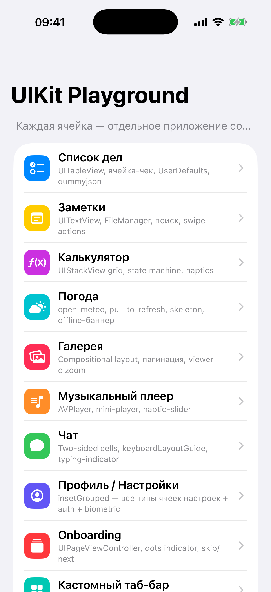

# Введение

{width=45%}

Эта книга — практикум по UIKit. Не словарь и не пересказ документации
Apple. Мы собираем в одном Xcode-проекте десять мини-приложений и по
дороге разбираем приёмы, из которых состоит настоящее приложение из
App Store, а не учебный пример «одна кнопка, один лейбл».

Каждое мини-приложение (дальше — **mini-app**) проходит путь от пустой
папки до экрана, который не стыдно показать на собеседовании. Вокруг
него — всё то, что обычно остаётся за кадром в учебниках:

- **splash** — заставка, которую приложение показывает само, пока
  готовится к работе (глава 1);
- **onboarding** — несколько вводных экранов при первом запуске: «вот
  что умеет приложение» (глава 6);
- **permission primer** — наш собственный экран-подводка, который
  объясняет, *зачем* нужно разрешение, ещё до системного вопроса «Разрешить
  доступ к геопозиции?» (глава 7);
- **pull-to-refresh** — «потяни список вниз, чтобы обновить»;
- **skeleton** — серые плашки-заготовки на месте будущего контента,
  пока данные грузятся;
- **photo viewer** — просмотр фото на весь экран с увеличением
  пальцами;
- **haptics** — лёгкие вибро-отклики на действия (тот самый «щелчок»
  при переключении тумблера).

## Чем эта книга отличается

У автора есть и другая книга — «ShopApp Beginner»: линейная история
«строим один интернет-магазин от Hello World до App Store». Там глава 15
опирается на главу 14, и читать её вразбивку не получится.

Эта книга — **каталог-практикум**. Мини-приложения **независимы**: можно
взять «Список дел», потом «Галерею», потом «Чат», и ничего не
потеряется. **UI Cookbook** (часть IV) — справочник: пришёл за
конкретным приёмом (например, «как сделать pull-to-refresh со своим
текстом»), прочитал, забрал в свой проект.

Общее у всех мини-приложений одно — **фундамент** из части I. Это
каркас playground'а: лаунчер, окно, координатор запуска. Его мы
строим один раз, в главах 1–5, и дальше на нём держится всё остальное.

## Кому подойдёт

- **Junior**, который сделал хотя бы один экран на UIKit и хочет
  двигаться дальше: splash, onboarding, экраны разрешений, тёмная тема,
  haptics.
- **Middle**, который пишет давно, но хочет освежить «как делается X в
  2026 году»: здесь всё на актуальных API (iOS 15+, Xcode 26).
- **Тот, кто возвращается в UIKit после SwiftUI**: увидит современный
  UIKit-стиль — `@MainActor`, async/await, без старых вложенных
  completion handler'ов (функций обратного вызова, которые передают в
  метод, чтобы он «позвонил», когда закончит).

**Кому не подойдёт:** тем, кто открыл Xcode впервые. Что такое класс,
опционал или замыкание, здесь не объясняем — книга предполагает, что
Swift ты уже знаешь. Зато каждый термин iOS и UIKit (сцена, окно,
view controller, Auto Layout и так далее) объясняем простыми словами
там, где он встречается впервые.

## Что мы построим — учебный проект `UIKitPlayground`

Один Xcode-проект, который ведёт себя как **playground** (песочница): на
главном экране — список мини-приложений. Этот экран мы называем
**лаунчером** — он «запускает» остальные, как рабочий стол iPhone
запускает приложения. Тап по строке — и выбранное mini-app стартует
так, будто это отдельное приложение из App Store: со своим splash,
своим фирменным цветом, своими экранами запуска. Встряхнул телефон
(в симуляторе — ⌃⌘Z) — вернулся в лаунчер.

Экраны, через которые mini-app проходит до основного экрана
(onboarding, вход в аккаунт, проверка возраста и т. п.), мы называем
**гейтами** (от англ. *gate* — ворота, проходная): пользователь
проходит их по очереди, как турникеты на входе в офис. Основной экран,
ради которого mini-app существует, — **main**.

Это не монолит, а **полигон**. Каждое mini-app живёт в своей папке
(`Apps/Todo/`, `Apps/Notes/`…), общий слой запуска — в `App/`, общие
цвета и отступы — в `Common/`.

Вот что лежит в проекте после части I (фундамента):

```
UIKitPlayground/
├── App/                                ← фундамент (главы 1–5)
│   ├── AppDelegate.swift               ← события процесса (глава 5)
│   ├── SceneDelegate.swift             ← создаёт окно и лаунчер (глава 5)
│   ├── PlaygroundWindow.swift          ← окно, которое ловит встряхивание (глава 3)
│   ├── AppManifest.swift               ← описание одного mini-app (глава 2)
│   ├── AppRegistry.swift               ← список всех mini-app (глава 2)
│   ├── PlaceholderViewController.swift ← заглушка «ещё не готово» (глава 2)
│   ├── AnimatedSplashViewController.swift ← наш splash (глава 1)
│   ├── BootCoordinator.swift           ← ведёт mini-app через гейты (глава 4)
│   └── AppListViewController.swift     ← лаунчер (глава 4)
├── Common/
│   └── DesignSystem.swift              ← общие цвета и отступы (глава 5)
├── Resources/
│   ├── Assets.xcassets
│   └── Base.lproj/LaunchScreen.storyboard  ← системная заставка (глава 1)
└── Info.plist
```

Дальше проект растёт так. Часть II добавляет гейты — по файлу-два на
главу (где их держать, решаешь сам; удобно завести папку `Gates/`) — и
вписывает их в `BootCoordinator`. Часть III добавляет папки
`Apps/<Имя>/` и в `AppRegistry` меняет заглушку «СКОРО» на настоящее
mini-app. Например, «Список дел» из главы 12 выглядит так:

```
Apps/Todo/
├── Models/   Todo.swift, TodoStorage.swift, TodoAPI.swift
└── UI/       TodoListViewController.swift, TodoCell.swift, …
```

Каждый файл фундамента в книге приведён **целиком**, так что проект
собирается и запускается уже после главы 5 — с лаунчером, splash'ем и
заглушками на месте будущих мини-приложений.

## 0.1 Создаём проект в Xcode 26

Эти шаги нужны один раз, до главы 1. Они выглядят скучно, но от них
зависит, в каком **режиме языка** будет собираться весь код книги, —
поэтому разберём их подробно.

**Шаг 1. Шаблон.** File → New → Project → iOS → **App**. В окне
параметров:

- Product Name: `UIKitPlayground`;
- **Interface: Storyboard** (по умолчанию стоит SwiftUI — поменяй!);
- Language: Swift;
- Testing System: None (тесты в этой книге не пишем).

Шаблон Xcode 26.5 с такими параметрами создаёт:

- `AppDelegate.swift` и `SceneDelegate.swift` — делегаты приложения и
  сцены (что это, разберём в главе 5);
- `ViewController.swift` и `Main.storyboard` — стартовый экран,
  нарисованный в Interface Builder;
- `LaunchScreen.storyboard` — системная заставка (глава 1);
- `Assets.xcassets` — каталог картинок и цветов;
- `Info.plist` — файл настроек приложения, который iOS читает до
  запуска твоего кода (подробнее — в главе 5).

**Шаг 2. Убираем `Main.storyboard`.** В этой книге все экраны создаются
кодом, а storyboard остаётся только для `LaunchScreen`. Поэтому:

1. Удали `ViewController.swift` и `Main.storyboard` (Move to Trash).
2. Открой `Info.plist` → Application Scene Manifest → Scene
   Configuration → Application Session Role → Item 0 и удали строку
   **Storyboard Name** (ключ `UISceneStoryboardFile`). Строку
   **Delegate Class Name** оставь — по ней iOS найдёт наш
   `SceneDelegate`.
3. Target → Build Settings, найди поиском `UIMainStoryboardFile`
   (в списке — «UIKit Main Storyboard File Base Name») и удали
   значение `Main`.

Если пропустить шаг 2.2 или 2.3, iOS при запуске попробует загрузить
`Main.storyboard`, не найдёт его и приложение упадёт с ошибкой
«Could not find a storyboard named 'Main'».

**Шаг 3. Минимальная версия iOS.** Шаблон ставит минимальную версию,
равную самой свежей (в Xcode 26.5 — iOS 26.5). Книга рассчитана на
**iOS 15.0**: Target → General → Minimum Deployments → iOS **15.0**.
Эта настройка называется **deployment target** — самая старая версия
iOS, на которую можно установить приложение. Всё, что появилось в iOS
позже 15-й, в книге помечено `@available` или обёрнуто в
`if #available(...)`.

**Шаг 4. Режим языка.** Target → Build Settings, раздел **Swift
Compiler – Language** / **Swift Compiler – Concurrency**. Вот что там
ставит шаблон Xcode 26.5 и что ставим мы:

| Настройка (ключ) | Шаблон Xcode 26.5 | В этой книге |
|---|---|---|
| Swift Language Version (`SWIFT_VERSION`) | Swift 5 | **Swift 6** |
| Default Actor Isolation (`SWIFT_DEFAULT_ACTOR_ISOLATION`) | MainActor | MainActor |
| Approachable Concurrency (`SWIFT_APPROACHABLE_CONCURRENCY`) | Yes | Yes |

Меняем одно: **Swift Language Version → Swift 6**. Две остальные
настройки шаблон уже выставил так, как нам нужно.

## 0.2 Что значат эти три настройки

Все три — про **конкурентность**, то есть про код, который может
выполняться одновременно в разных потоках. Разберём на бытовом примере.

**Главный поток** (main thread) — это единственный «сотрудник», которому
разрешено трогать интерфейс: менять текст лейбла, двигать кнопку,
показывать экран. Если интерфейс поменяет кто-то другой (фоновый поток,
который, скажем, скачивал картинку), приложение может отрисовать мусор
или упасть — причём не всегда, а раз в сто запусков. Такая ошибка
называется **гонкой данных** (data race), и ловить её отладчиком —
мучение.

**Актор** (actor) — объект, у которого есть «своя очередь»: к его
данным обращаются строго по одному. **`MainActor`** — особый актор,
чья «очередь» — это и есть главный поток. Пометка `@MainActor` на
классе или функции значит: «этот код выполняется только на главном
потоке». Весь UIKit (`UIView`, `UIViewController`, `UILabel`…) Apple
уже пометила `@MainActor`.

**Default Actor Isolation = MainActor.** Обычно код без пометок ни к
какому актору не привязан (*nonisolated*), и компилятор не знает, на
каком потоке он окажется. С этой настройкой всё, что ты объявил в
модуле без явной пометки — свои классы, структуры, функции, —
считается `@MainActor`. Раз по умолчанию всё на главном потоке, гонки
«обновил лейбл из фона» просто негде взяться. Если какой-то код нужно
выполнять вне главного потока, его явно помечают `nonisolated` — это
разберём в главе 5.

**Swift Language Version = Swift 6.** В режиме Swift 5 почти все
нарушения правил конкурентности — только **предупреждения**: проект
соберётся, даже если ты трогаешь интерфейс из фона. В режиме Swift 6
большинство таких нарушений — **ошибки**, и проект не соберётся, пока
их не исправишь. Мы выбираем строгий режим: пусть компилятор ловит
ошибки до запуска, а не пользователь — после.

**Approachable Concurrency = Yes** («доступная конкурентность»)
включает набор послаблений, которые делают правила Swift 6
предсказуемее. Главное для нас: асинхронная функция без пометок
выполняется там же, где её вызвали, а не «где-то в фоне». Вызвал её с
главного потока — она и работает на главном, пока сама явно не уйдёт
в фон.

> **В каком режиме код этой книги.** Все листинги проверены
> компилятором Swift 6.3 (Xcode 26.5) в режиме **Swift 6** с **Default
> Actor Isolation = MainActor** и **Approachable Concurrency = Yes**, с
> минимальной версией **iOS 15.0**. Если оставить шаблонный Swift 5,
> код тоже соберётся, но часть ошибок, о которых говорит книга,
> превратится в предупреждения — и их легко пропустить.

## Стек, на котором пишем

- **Swift 6** в режиме, описанном выше (Swift 6 + MainActor по
  умолчанию + Approachable Concurrency).
- **UIKit**, экраны — **кодом**. Storyboard используется ровно для одной
  вещи — `LaunchScreen`: системная заставка, которую iOS показывает до
  запуска нашего кода, не умеет исполнять Swift (подробно — в главе 1).
- **Auto Layout** — система правил, по которым UIKit сам вычисляет
  размеры и положение элементов («лейбл на 20 точек ниже иконки, по
  центру экрана»). Каждое такое правило называется **constraint**
  (ограничение). В коде книги ты увидишь их постоянно — начиная с
  главы 1.
- **iOS 15.0+** как минимальная версия. Более свежие API помечаем
  `@available`.
- **Никакого SwiftUI**. Это книга про UIKit.

## Как читать

- **Часть I. Фундамент** (главы 1–5) — читай **по порядку**. Вместе
  они дают работающий каркас, на котором держится всё остальное.
- **Часть II. Launch-гейты** (главы 6–11) — тоже по порядку, но гейты,
  которые тебе не нужны, можно пропускать (например, проверка возраста
  нужна немногим).
- **Часть III. Мини-приложения** (главы 12–22) — **выбирай**. Не нужно
  читать все подряд: берёшь то, что хочешь сделать. Десять mini-app и
  в конце — тур «Anatomy» по всем гейтам.
- **Часть IV. UI Cookbook** (главы 23–37) — **справочник**. Открываешь,
  когда нужен конкретный приём.
- **Часть V. Production checklist** (главы 38–43) — перед первым
  релизом в App Store: скриншоты, приватность, удаление аккаунта, пуши и
  ссылки, виджеты, аудит доступности.
- **Приложение. Словарь терминов** — все термины книги с короткими
  определениями и номером главы, где термин разобран подробно. Встретил
  незнакомое слово в середине книги — загляни туда.

## Условные обозначения

> **Идея.** Самое важное вынесено в такие цитаты-врезки.

```swift
let example = "это код, который можно (и нужно) набрать"
```

**Упражнение 1.1.** Маленькое задание: первое число — номер главы,
второе — номер задания в ней. Делай его **до того**, как читать
дальше. Ответы и решения — в конце главы, в разделе «Ответы к
упражнениям». В методической части V задания без номеров, но ответы к
ним лежат там же.

**Что мы выучили** — краткий список фактов в конце каждой главы.

**Apple Developer Documentation** — в самом конце главы: ссылки на
первоисточники по всему, что в ней встретилось.

## Спасибо

Если ты читаешь эту книгу — спасибо. Нашёл опечатку или непонятное
место — открой issue в репозитории книги
[sirserik/uikit-playground-book](https://github.com/sirserik/uikit-playground-book).

Поехали.

## Apple Developer Documentation

- [The Swift Programming Language](https://docs.swift.org/swift-book/) — официальный справочник по языку. Книга предполагает, что базовые конструкции отсюда уже знакомы.
- [Concurrency — Swift Book](https://docs.swift.org/swift-book/documentation/the-swift-programming-language/concurrency) — акторы, `async`/`await`, изоляция: то, что стоит за настройками из раздела 0.2.
- [UIKit](https://developer.apple.com/documentation/uikit) — каталог фреймворка, на котором построены все mini-app.
- [Human Interface Guidelines](https://developer.apple.com/design/human-interface-guidelines) — продуктовые правила Apple. На них опираемся, когда обсуждаем UX-решения (splash, onboarding, permission primer).
- [Xcode](https://developer.apple.com/documentation/xcode) — справочник по самой IDE, настройкам сборки и схемам.

→ [Глава 1. LaunchScreen vs AnimatedSplash — два экрана, оба «splash»](./01-launch-screen-vs-splash.md)
