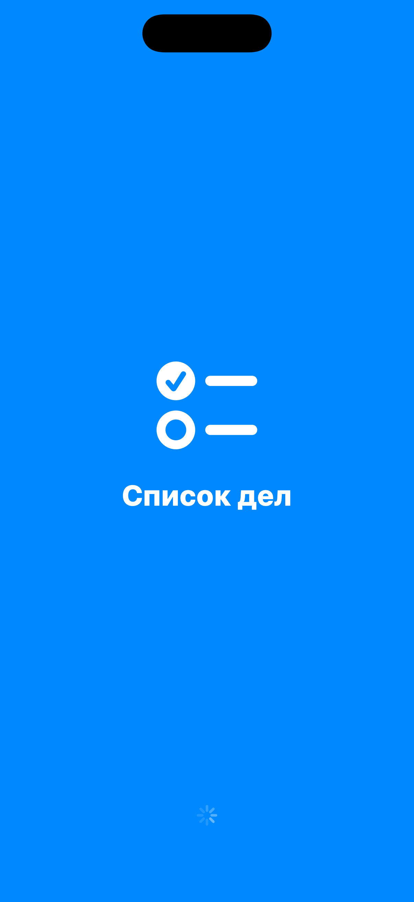

# Глава 1. LaunchScreen vs AnimatedSplash — два экрана, оба «splash»

{width=45%}

Когда пользователь тапает иконку приложения в спрингборде, между этим
моментом и первым работающим экраном проходит две стадии. На первой —
система iOS показывает картинку, которую ты задал заранее. На второй —
уже твоё приложение что-то рисует своим кодом.

Эти две стадии часто путают и называют общим словом «splash». Но это
разные механизмы, и решают они разные задачи.

В этой главе разбираем оба, и заодно понимаем, почему в нашем
playground'е лежит и `LaunchScreen.storyboard`, и
`AnimatedSplashViewController.swift`.

## 1.1 Что происходит между тапом и первым экраном

Жизненный цикл запуска выглядит примерно так:

```
[user тап по иконке]
        │
        ▼
[iOS показывает LaunchScreen]   ← статичная картинка, ~0.1–0.5 секунды
        │
        ▼
[процесс приложения запустился]
        │
        ▼
[наш код берёт управление]      ← здесь начинается AnimatedSplash
```

Между «тап» и «процесс запустился» проходит время, которое ты не
контролируешь. Размер процесса, прогрев Swift runtime, фреймворки,
ленивые инициализации — всё это занимает миллисекунды до секунды-двух
на холодном старте. **И в это время твой код ещё не работает.**

Что-то всё равно надо показать пользователю. Поэтому iOS показывает
картинку, которую ты ей дал заранее в виде storyboard'а. Эта картинка и
есть `LaunchScreen`.

> 💡 **Идея.** `LaunchScreen` — это **картинка для системы**, чтобы пока
> ты не успел загрузиться, экран не был пустым. `AnimatedSplash` — это
> уже **твой код**, которому можно показать анимацию, дёрнуть API,
> проверить токен.

## 1.2 LaunchScreen — почему storyboard и почему без кода

Когда iOS показывает `LaunchScreen`, твой `UIApplication` ещё не
существует. Нет `viewDidLoad`, нет `init`, нет ни одной твоей строчки
Swift. Поэтому Apple взяла единственный формат, который умеет
рендериться **из коробки, без исполнения кода** — InterfaceBuilder
storyboard.

Apple специально оставила в `LaunchScreen.storyboard` только
ограниченный набор возможностей:

- системные SF Symbol'ы;
- лейблы, картинки, простые view;
- Auto Layout;
- цвета из Asset Catalog.

И **запретила** всё, что требует runtime:

- кастомные классы;
- `@IBDesignable`;
- Storyboard reference на другие storyboard'ы;
- картинки из xcassets, которым нужен слайсинг по `traitCollection`.

Вот наш `LaunchScreen.storyboard` (в `Base.lproj/`). Если открыть его в
Xcode, увидим три элемента:

- SF Symbol `square.grid.2x2.fill` — иконка по центру;
- лейбл «UIKit Playground» — название;
- лейбл «Учебные мини-приложения» — подзаголовок.

Никакого кода. Apple показывает эту картинку **сама**, до того как твой
процесс готов.

> 🛠 **Упражнение.** Открой `Base.lproj/LaunchScreen.storyboard` в Xcode
> (двойной клик в Project Navigator). Поменяй текст подзаголовка на
> что-то своё — например, «Тренируемся писать iOS». Запусти приложение
> на симуляторе и обрати внимание на первую секунду после тапа по
> иконке — увидишь свой текст, **до** того как сработает наш splash с
> анимацией.

## 1.3 AnimatedSplash — это уже твой VC

Когда `UIApplication` запустился и `SceneDelegate` поставил root
view controller'у, можно показать **второй** splash — уже своими
руками. У него три задачи:

1. **Дотянуть восприятие.** LaunchScreen — статика. Без анимации
   приложение ощущается как «программа», а не как продукт.
   Анимированный splash добавляет «вот, я готовлюсь».
2. **Дать тебе время.** Пока крутится анимация, можно асинхронно
   проверить токен, дёрнуть config с сервера, инициализировать кеш.
3. **Брендировать.** В нашем playground'е splash меняет цвет в
   зависимости от mini-app — для Todo он синий, для Калькулятора
   фиолетовый, для Чата зелёный. LaunchScreen один на всё приложение,
   а splash — на каждый mini-app свой.

Файл: `App/AnimatedSplashViewController.swift`.

Сначала — конструктор:

```swift
final class AnimatedSplashViewController: UIViewController {

    private let manifest: AppManifest
    private let onFinish: () -> Void

    init(manifest: AppManifest, onFinish: @escaping () -> Void) {
        self.manifest = manifest
        self.onFinish = onFinish
        super.init(nibName: nil, bundle: nil)
    }
    required init?(coder: NSCoder) { fatalError() }
```

Splash получает `manifest` — описание mini-app (имя, иконка, цвет — мы
разберём `AppManifest` в Главе 3). И callback `onFinish`, который зовём,
когда анимация закончилась. Сам splash не знает, что будет дальше — это
решает координатор сверху.

`required init?(coder:)` пишем с `fatalError()` потому что VC создаём
только из кода, не из storyboard'а. Если кто-то попробует —
сразу видно что что-то не так.

Дальше — `viewDidLoad`:

```swift
override func viewDidLoad() {
    super.viewDidLoad()
    view.backgroundColor = manifest.brandColor
    setupLayout()
}
```

Цвет фона берём из манифеста — `brandColor`. Никакой `UIColor.systemBlue`
жёстко в коде, иначе все mini-apps выглядели бы одинаково.

В `setupLayout()` строим иерархию: иконка по центру, под ней название,
снизу `UIActivityIndicatorView`. Иконка и заголовок изначально
**невидимы** — `alpha = 0`, и иконка ещё уменьшена через `transform`:

```swift
iconView.alpha = 0
iconView.transform = CGAffineTransform(scaleX: 0.6, y: 0.6)
```

Это нужно, чтобы был эффект «появления». В `viewDidAppear` мы запустим
анимацию, которая вернёт `alpha` к `1.0` и `transform` к `.identity`.

> 💡 **Когда запускать анимацию: `viewDidLoad` или `viewDidAppear`?**
> Только `viewDidAppear`. В `viewDidLoad` view ещё не на экране, и если
> начать анимировать там, первый кадр не успеет отрендериться, и
> пользователь увидит «скачок» вместо плавного появления. Эту ошибку
> совершают все — и я в том числе делал её раз пять.

## 1.4 Анимация — последовательная и пружинная

Метод `runAnimation()`. Он запускает три анимации с разной задержкой,
чтобы элементы появлялись по очереди — сначала иконка, потом название,
потом индикатор. Получается эффект «контролируемого появления».

Иконка:

```swift
UIView.animate(withDuration: 0.5,
               delay: 0.05,
               usingSpringWithDamping: 0.65,
               initialSpringVelocity: 0.4,
               options: [.curveEaseOut]) {
    self.iconView.alpha = 1.0
    self.iconView.transform = .identity
}
```

Два важных параметра — `usingSpringWithDamping` и
`initialSpringVelocity`. Это **пружина**: вместо линейного увеличения
иконка немного перескакивает финальный размер и возвращается. Эффект
лёгкого «бэмц», как когда падает мяч на ровную поверхность.

- `damping` 0.65 — чем меньше число, тем сильнее «прыгает». 1.0 — без
  пружины. 0.5 — заметный отскок. Я обычно беру 0.55–0.7.
- `velocity` 0.4 — начальная скорость. 0 — стартует с нуля, 1+ —
  «выстреливает».

Если хочешь поэкспериментировать — поменяй на `damping: 0.3`. Увидишь
как иконка прыгает несколько раз. Слишком игриво для splash, но
полезно для контроля.

Заголовок и индикатор — обычный fade-in, без пружины:

```swift
UIView.animate(withDuration: 0.4, delay: 0.35, options: [.curveEaseOut]) {
    self.titleLabel.alpha = 1.0
}
UIView.animate(withDuration: 0.3, delay: 0.7, options: [.curveEaseOut]) {
    self.activityIndicator.alpha = 1.0
}
```

Задержки 0.05 → 0.35 → 0.7 секунды дают **stagger** — элементы появляются
друг за другом, не одновременно. Это базовый трюк продуктовой анимации.

И в конце:

```swift
DispatchQueue.main.asyncAfter(deadline: .now() + manifest.splashDuration) { [weak self] in
    guard let self else { return }
    UIView.animate(withDuration: 0.25, animations: {
        self.activityIndicator.alpha = 0
    }, completion: { _ in
        self.onFinish()
    })
}
```

Через `manifest.splashDuration` секунд (по умолчанию 1.4) скрываем
индикатор и зовём `onFinish` — координатор переключит root на
очередной гейт.

`[weak self]` — обязательно. Если пользователь успеет уйти в лаунчер
(shake-жест) до конца таймера, `self` уже не существует. Без `weak`
получили бы retain-cycle через `DispatchQueue`.

> 🛠 **Упражнение.** В `AnimatedSplashViewController.swift` найди
> `runAnimation()`. Поменяй `damping: 0.65` на `0.4` и снова на `0.95`.
> Запусти любое mini-app (например, Калькулятор — фиолетовый splash).
> Почувствуй разницу между «отчётливой пружиной» и «почти без неё».

## 1.5 Бытовая аналогия

`LaunchScreen` — это **обложка журнала на витрине киоска**. Её ты
готовишь заранее, типография печатает, ничего динамического. Покупатель
видит её, пока идёт к кассе.

`AnimatedSplash` — это **первая страница журнала**. Её ты можешь
оформить как хочешь: иллюстрация, оглавление, цитата дня. Покупатель
открывает журнал и видит её первой, перед тем как идти к контенту.

Обе нужны, и обе работают вместе. Без обложки журнал был бы пачкой
бумаги. Без первой страницы — резким переходом в текст.

## 1.6 Почему оба, а не только AnimatedSplash

Резонный вопрос: если у нас есть свой VC с анимацией, зачем вообще
LaunchScreen? Нельзя ли убрать storyboard и обойтись одним?

Нельзя. Точнее, можно, но получишь две проблемы:

**Первая.** Apple **требует** наличие LaunchScreen.storyboard (или
LaunchImage в xcassets для legacy-режима). Без него App Store не примет
билд, а на устройстве твой LaunchScreen будет чёрным или белым
прямоугольником в зависимости от темы. Это видно невооружённым глазом —
выглядит как баг.

**Вторая.** Между «тап по иконке» и «у нас сработал viewDidLoad»
проходит время, которого нет у твоего кода. Холодный старт на старом
iPhone — до 2 секунд. Если в это время на экране ничего нет — UX
ломается. AnimatedSplash не может «прикрыть» эту фазу, потому что его
VC ещё не существует.

> 💡 **Итог.** LaunchScreen — для системы, ты на него не влияешь после
> компиляции. AnimatedSplash — для пользователя, ты решаешь когда он
> закончится и что показать дальше.

## 1.7 Кто решает, когда AnimatedSplash закончился

Это **не** ответственность самого `AnimatedSplashViewController`. Он
знает только «прошло `splashDuration` секунд → зови `onFinish`». А что
делать дальше — решает координатор сверху.

В нашем playground'е это `BootCoordinator`. В коде это выглядит так:

```swift
private func showSplash() {
    let splash = AnimatedSplashViewController(manifest: manifest) { [weak self] in
        self?.proceedAfterSplash()
    }
    setRoot(splash, animated: false)
}
```

Координатор передаёт splash'у callback, и когда splash зовёт его, идёт
дальше — к onboarding, permission primer, auth и так далее. Splash сам
**ничего не знает** про существование этих экранов.

Эту схему — координатор владеет цепочкой, экраны зовут callback — мы
разберём подробно в Главе 4. Сейчас важно одно: **splash должен быть
тупой**. Он умеет показать анимацию и сообщить «я закончил». Что
дальше — не его проблема.

## 📋 Что мы выучили

- `LaunchScreen.storyboard` — статическая картинка для **системы**,
  показывается пока процесс твоего приложения запускается. Без кода,
  без runtime.
- `AnimatedSplashViewController` — это уже твой VC. Запускается после
  того, как `SceneDelegate` поставил root. Может анимировать, делать
  сетевые запросы, что угодно.
- Оба нужны: без LaunchScreen Apple не пропустит билд, без
  AnimatedSplash переход от иконки к main-экрану выглядит резко.
- Анимацию запускаем в `viewDidAppear`, не в `viewDidLoad`.
- Spring-анимация (`usingSpringWithDamping`) даёт эффект «бэмц», но
  только если `damping < 1.0`.
- Stagger — задержки между элементами 0.1–0.4 секунды — делает
  появление элементов более продуктовым.
- Splash сам не знает, что идёт после него. Решает координатор.

## Apple Developer Documentation

- [Launching — Human Interface Guidelines](https://developer.apple.com/design/human-interface-guidelines/launching) — что Apple ожидает от первой секунды запуска и почему splash-экран не должен «развлекать».
- [`UILaunchStoryboardName`](https://developer.apple.com/documentation/bundleresources/information_property_list/uilaunchstoryboardname) — ключ Info.plist, который указывает iOS на наш `LaunchScreen.storyboard`.
- [`UIViewController`](https://developer.apple.com/documentation/uikit/uiviewcontroller) — базовый класс для `AnimatedSplashViewController`; смотри жизненный цикл `viewDidLoad` / `viewDidAppear`.
- [`UIView.animate(withDuration:delay:usingSpringWithDamping:initialSpringVelocity:options:animations:)`](https://developer.apple.com/documentation/uikit/uiview/1622594-animate) — точная сигнатура spring-анимации, которую мы используем в `runAnimation()`.
- [Closures — Swift Book](https://docs.swift.org/swift-book/documentation/the-swift-programming-language/closures) — как работают capture lists и почему `[weak self]` обязателен в `DispatchQueue.main.asyncAfter`.

→ [Глава 2. AppManifest — конфиг одного mini-app](./02-app-manifest.md)
