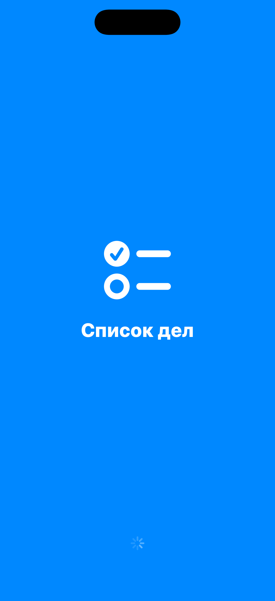

# Глава 1. LaunchScreen vs AnimatedSplash — два экрана, оба «splash»

{width=45%}

Когда пользователь тапает иконку приложения на домашнем экране, между
этим моментом и первым рабочим экраном проходят две стадии. На первой
система iOS показывает картинку, которую ты подготовил заранее. На
второй уже твоё приложение рисует что-то своим кодом.

Обе стадии часто называют одним словом **splash** (англ. «всплеск»,
здесь — заставка). Но это разные механизмы, и задачи у них разные. В
этой главе разбираем оба и заодно понимаем, почему в нашем playground'е
лежат и `LaunchScreen.storyboard`, и `AnimatedSplashViewController.swift`.

Два слова, которые встретятся сразу.

**View controller** (VC) — объект, который управляет одним экраном:
создаёт его содержимое, реагирует на появление и исчезновение экрана,
на нажатия. Все экраны в UIKit — наследники `UIViewController`.
Аналогия: экран — комната, view controller — её хозяин, который
расставляет мебель и открывает дверь гостям.

**Storyboard** — файл Xcode, в котором экраны не пишут кодом, а рисуют
мышкой в редакторе Interface Builder. В этой книге storyboard нужен
ровно для одного экрана — `LaunchScreen`.

## 1.1 Что происходит между тапом и первым экраном

Упрощённо запуск выглядит так:

```
[тап по иконке]
        │
        ▼
[iOS показывает LaunchScreen]   ← статичная картинка, на неё уходят доли секунды
        │
        ▼
[процесс приложения запустился]
        │
        ▼
[наш код получил управление]    ← здесь начинается AnimatedSplash
```

Между «тапнул» и «процесс запустился» проходит время, которым ты не
управляешь: система загружает исполняемый файл и фреймворки, готовит
среду выполнения Swift. На свежем устройстве это обычно десятые доли
секунды, на старом при **холодном старте** (приложения нет в памяти,
его запускают с нуля) может доходить до секунды-двух. И всё это время
твой код ещё не работает.

Что-то показать всё равно надо. Поэтому iOS показывает картинку,
которую ты описал заранее. Это и есть **launch screen** — экран
запуска.

> **Идея.** `LaunchScreen` — **картинка для системы**: чтобы, пока
> приложение не загрузилось, экран не был пустым. `AnimatedSplash` —
> уже **твой код**: в нём можно показать анимацию, сходить в сеть,
> проверить токен входа.

## 1.2 LaunchScreen — почему storyboard и почему без кода

Когда iOS показывает launch screen, ни одна строчка твоего Swift ещё
не выполнилась: нет ни `viewDidLoad`, ни `init`. Поэтому launch screen
описывают так, чтобы система могла нарисовать его **сама, без
исполнения кода**. Способов два:

1. **Storyboard** — файл `LaunchScreen.storyboard`. Его создаёт шаблон
   Xcode, и имя файла записано в настройку `UILaunchStoryboardName`
   (в Build Settings она видна как «Launch Screen Interface File Base
   Name»).
2. **Ключ `UILaunchScreen` в `Info.plist`** (с iOS 14) — вообще без
   storyboard: указываешь цвет фона, картинку, наличие панели
   навигации, и система собирает экран сама.

Мы остаёмся на storyboard: его создал шаблон, и в нём видно, что
получится. Но помни, что второй способ существует: «Apple требует
именно storyboard» — не совсем так. С 2020 года App Store требует,
чтобы launch screen был задан одним из этих двух способов, а не
старыми картинками `LaunchImage`.

У launch storyboard строгие ограничения. Документация Apple
(«Specifying your app's launch screen») перечисляет их так:

- только стандартные классы UIKit (`UIView`, `UIImageView`, `UILabel`…);
- один корневой view или view controller;
- никаких связей с кодом — ни `@IBOutlet`, ни `@IBAction`;
- никаких своих классов (`class MyView: UIView` сюда не подставить);
- никаких runtime-атрибутов (значений, которые Interface Builder
  присваивает свойствам при загрузке);
- никаких устаревших view вроде `UIWebView`.

Отсюда же ещё одна особенность, о которую спотыкаются все: iOS
**кэширует** launch screen — делает с него снимок и дальше показывает
снимок. Поменял storyboard, запустил — а на экране старая картинка.
Лечится удалением приложения с симулятора (долгое нажатие на иконку →
Удалить приложение) и повторным запуском.

### Каким должен быть launch screen

Здесь важно не путать launch screen с заставкой. Human Interface
Guidelines (HIG — продуктовые правила Apple, раздел «Launching»)
говорят прямо:

- launch screen должен быть **почти копией первого экрана**
  приложения, чтобы переход был незаметен и казалось, что приложение
  открылось мгновенно;
- **без текста**: launch screen статичен, и текст на нём не будет
  переведён на язык пользователя;
- **без рекламы и логотипов**: это не место для брендинга. Если нужна
  заставка с логотипом — делай её отдельным экраном уже в коде.

Наш первый экран — лаунчер: список на сером «сгруппированном» фоне
(его разберём в главе 4). Поэтому наш `LaunchScreen.storyboard` —
пустой view с фоном **System Grouped Background Color**. Это
системный цвет: светло-серый в светлой теме и почти чёрный в тёмной, и
iOS сама берёт нужный вариант.

Как это сделать: открой `LaunchScreen.storyboard` (он в группе
`Base.lproj` или в корне проекта, зависит от версии шаблона), выдели
**View** в списке слева, справа в Attributes Inspector (иконка
ползунков) у **Background** выбери **System Grouped Background
Color**. Больше ничего на экран не ставим.

А логотип, название и анимация будут в **нашем** splash — уже кодом.

**Упражнение 1.1.** Поставь в `LaunchScreen.storyboard` фон **System
Red Color** и запусти приложение. Что увидишь в первую долю секунды?
Потом верни серый фон и запусти снова. Если красный не исчез — почему,
и как это исправить?

## 1.3 AnimatedSplash — это уже твой view controller

Когда процесс запустился и `SceneDelegate` (объект, который готовит
окно приложения, — разберём в главе 5) поставил первый экран, можно
показать **второй** splash, уже своими руками. У него три задачи:

1. **Создать ощущение продукта.** Launch screen статичен. Короткая
   анимация говорит «сейчас всё будет».
2. **Дать время.** Пока идёт анимация, можно асинхронно проверить токен,
   скачать настройки с сервера, прогреть кэш.
3. **Брендировать.** В нашем playground'е splash окрашен в фирменный
   цвет mini-app: у «Списка дел» он синий, у «Заметок» жёлтый, у «Чата»
   зелёный. Launch screen один на всё приложение, splash у каждого
   mini-app свой.

Файл: `App/AnimatedSplashViewController.swift`. Разберём его целиком,
по частям.

### Свойства и конструктор

```swift
import UIKit

/// Второй, «наш» splash: анимация в цвете mini-app, потом onFinish.
final class AnimatedSplashViewController: UIViewController {

    private let manifest: AppManifest
    private let onFinish: () -> Void

    private let iconView = UIImageView()
    private let titleLabel = UILabel()
    private let activityIndicator = UIActivityIndicatorView(style: .large)
    private var didStartAnimation = false

    init(manifest: AppManifest, onFinish: @escaping () -> Void) {
        self.manifest = manifest
        self.onFinish = onFinish
        super.init(nibName: nil, bundle: nil)
    }

    required init?(coder: NSCoder) {
        fatalError("init(coder:) не используется: экран создаётся только кодом")
    }
```

Splash получает `manifest` — описание mini-app: имя, иконку, цвет,
длительность заставки. Подробно `AppManifest` разберём в главе 2, пока
достаточно знать, что это структура с этими полями.

Второй параметр — `onFinish`, **callback** (функция обратного вызова):
замыкание, которое splash вызовет, когда закончит. Сам splash не знает,
что будет дальше, — это решает координатор (глава 4). Аналогия: ты
отдаёшь курьеру посылку и номер телефона — «позвони, когда доставишь».
Что ты сделаешь после звонка, курьера не касается.

Три UI-элемента создаём сразу, в объявлении свойств: иконку
(`UIImageView`), название (`UILabel`) и `UIActivityIndicatorView` —
системный крутящийся индикатор загрузки, стиль `.large` — крупный.

`didStartAnimation` — флажок «анимацию уже запускали». Зачем он, станет
понятно в разделе про `viewDidAppear`.

`super.init(nibName: nil, bundle: nil)` — так создаётся view
controller без storyboard и без xib-файла: «интерфейс я соберу кодом
сам».

`required init?(coder:)` UIKit требует у каждого наследника
`UIViewController`: этим инициализатором экран создаётся из
storyboard. Мы экран из storyboard не создаём, поэтому тело — просто
`fatalError` с объяснением. Если когда-нибудь кто-то попробует — сразу
увидит понятное сообщение, а не загадочный сбой.

### viewDidLoad — один раз, когда view создан

```swift
    override func viewDidLoad() {
        super.viewDidLoad()
        view.backgroundColor = manifest.brandColor
        setupLayout()
    }
```

`viewDidLoad` UIKit вызывает один раз — когда корневой view экрана
создан, но ещё **не показан**. Здесь собирают интерфейс.

Цвет фона берём из манифеста — `brandColor`. Никакого жёстко
прописанного `.systemBlue`, иначе все mini-app выглядели бы одинаково.

### setupLayout — элементы и Auto Layout

```swift
    private func setupLayout() {
        let config = UIImage.SymbolConfiguration(pointSize: 80, weight: .semibold)
        iconView.image = UIImage(systemName: manifest.symbolName, withConfiguration: config)
        iconView.tintColor = .white
        iconView.contentMode = .scaleAspectFit

        titleLabel.text = manifest.name
        titleLabel.textColor = .white
        titleLabel.font = .preferredFont(forTextStyle: .title1)
        titleLabel.adjustsFontForContentSizeCategory = true
        titleLabel.textAlignment = .center
        titleLabel.numberOfLines = 0

        activityIndicator.color = .white
        activityIndicator.startAnimating()
```

Иконка — это **SF Symbol**: одна из нескольких тысяч векторных иконок
Apple, встроенных в систему. Их берут по имени —
`UIImage(systemName: "checklist")`. `SymbolConfiguration(pointSize: 80)`
задаёт размер: символ рисуется как буква шрифта кеглем 80 точек.

**Точка** (point, pt) — единица размеров в UIKit. Это не пиксель: на
iPhone с экраном «@3x» одна точка — это 3×3 = 9 физических пикселей,
на «@2x» — 2×2 = 4. Ты пишешь размеры в точках, а система сама
пересчитывает их в пиксели конкретного экрана.

`tintColor = .white` — SF Symbol по умолчанию одноцветный и
перекрашивается в `tintColor`.

У лейбла шрифт `preferredFont(forTextStyle: .title1)` — это не
фиксированный размер, а **текстовый стиль**. Он подстраивается под
**Dynamic Type** — настройку «Размер текста» в iOS (Настройки → Экран
и яркость → Размер текста). Если человек плохо видит и поставил крупный
текст, заголовок тоже станет крупнее. `adjustsFontForContentSizeCategory
= true` велит лейблу обновиться сразу, если настройку поменяли, пока
экран открыт. `numberOfLines = 0` — «сколько угодно строк»: длинное
имя при крупном шрифте перенесётся, а не обрежется многоточием.

`startAnimating()` запускает вращение индикатора. Пока он прозрачный,
вращение не видно, — покажем его позже анимацией.

Дальше — расстановка элементов:

```swift
        for subview in [iconView, titleLabel, activityIndicator] {
            subview.translatesAutoresizingMaskIntoConstraints = false
            view.addSubview(subview)
        }

        NSLayoutConstraint.activate([
            iconView.centerXAnchor.constraint(equalTo: view.centerXAnchor),
            iconView.centerYAnchor.constraint(equalTo: view.centerYAnchor, constant: -40),

            titleLabel.topAnchor.constraint(equalTo: iconView.bottomAnchor, constant: 20),
            titleLabel.leadingAnchor.constraint(equalTo: view.layoutMarginsGuide.leadingAnchor),
            titleLabel.trailingAnchor.constraint(equalTo: view.layoutMarginsGuide.trailingAnchor),

            activityIndicator.centerXAnchor.constraint(equalTo: view.centerXAnchor),
            activityIndicator.bottomAnchor.constraint(
                equalTo: view.safeAreaLayoutGuide.bottomAnchor, constant: -48),
        ])
```

Это **Auto Layout** — система, в которой ты не задаёшь координаты
вручную («иконка в точке x = 156, y = 380»), а описываешь правила:
«иконка по центру по горизонтали, на 40 точек выше центра по
вертикали». Каждое правило — **constraint** (ограничение). По этим
правилам UIKit сам вычисляет координаты — на любом iPhone, iPad, в
любой ориентации.

Прочитаем правила словами:

- иконка: центр по горизонтали = центру экрана; центр по вертикали на
  40 точек выше центра экрана (`constant: -40` — вверх, потому что ось
  y в UIKit растёт **вниз**);
- заголовок: верх на 20 точек ниже низа иконки; левый и правый края
  прижаты к полям экрана;
- индикатор: по центру по горизонтали; низ на 48 точек выше нижней
  границы safe area.

Два понятия отсюда:

- **Layout margins** (`layoutMarginsGuide`) — стандартные поля по
  краям view. На iPhone в портретной ориентации это обычно 16 или 20
  точек слева и справа. Текст, прижатый к полям, не липнет к краю
  экрана.
- **Safe area** (`safeAreaLayoutGuide`) — часть экрана, которую ничего
  не перекрывает: ни «чёлка» или Dynamic Island сверху, ни полоска
  «домой» (home indicator) снизу. Привязываем индикатор к safe area,
  иначе на iPhone без кнопки «Домой» он залез бы под полоску.

`translatesAutoresizingMaskIntoConstraints = false` — обязательная
строка для каждого view, которое расставляешь через constraints в
коде. По умолчанию (`true`) UIKit сам создаёт для view constraints из
его `frame` (прямоугольника с координатами). Эти автоматические
правила столкнутся с твоими, и в консоли появится длинное сообщение
«Unable to simultaneously satisfy constraints» — конфликт правил.
Забыть эту строку — самая частая ошибка при вёрстке кодом.

`NSLayoutConstraint.activate([...])` включает все правила разом — это
быстрее, чем включать по одному.

Последний кусок `setupLayout` — стартовое состояние для анимации:

```swift
        // Стартовое состояние: всё прозрачное, иконка уменьшена до 60%.
        iconView.alpha = 0
        iconView.transform = CGAffineTransform(scaleX: 0.6, y: 0.6)
        titleLabel.alpha = 0
        activityIndicator.alpha = 0
    }
```

`alpha` — непрозрачность: 0 — полностью прозрачный, 1 — полностью
видимый, 0.5 — наполовину.

`transform` — геометрическое преобразование view поверх его обычного
положения: масштаб, поворот, сдвиг. `CGAffineTransform(scaleX: 0.6,
y: 0.6)` — масштаб 0.6 по обеим осям, то есть иконка рисуется
размером **60% от обычного**. Для иконки 80×80 точек это 48×48 точек.
Constraints при этом не меняются: transform — это «как нарисовать»,
а не «где стоять», поэтому соседей иконка не толкает.

Анимация потом вернёт `alpha` к 1, а `transform` — к `.identity`
(«без преобразования», обычный размер, 100%).

### viewDidAppear — когда запускать анимацию

```swift
    override func viewDidAppear(_ animated: Bool) {
        super.viewDidAppear(animated)
        guard !didStartAnimation else { return }
        didStartAnimation = true
        runAnimation()
    }
```

`viewDidAppear` UIKit вызывает, когда экран **уже на экране**. Это
надёжное место для анимации появления: пользователь увидит её с первого
кадра.

Почему не `viewDidLoad`? В `viewDidLoad` экран ещё не показан. Если
запустить анимацию там, её начало может уйти «в пустоту» — пока экран
добирается до окна, часть анимации уже проиграется, и появление
получится рваным.

Флажок `didStartAnimation` нужен, потому что `viewDidAppear`, в отличие
от `viewDidLoad`, может вызваться **несколько раз**: например, если
поверх splash показали модальный экран и закрыли его. Без флажка
анимация и таймер запустились бы заново, и `onFinish` вызвался бы
дважды.

Коротко о **жизненном цикле** экрана (подробно — в главе 5): это
порядок, в котором UIKit вызывает методы view controller'а. Для одного
показа он такой: `viewDidLoad` (один раз) → `viewWillAppear` (сейчас
появится) → `viewDidAppear` (появился) → … → `viewWillDisappear` →
`viewDidDisappear`.

## 1.4 Анимация — по очереди и с пружиной

Метод `runAnimation()` запускает три анимации с разной задержкой, чтобы
элементы появлялись по очереди: сначала иконка, потом название, потом
индикатор.

Иконка:

```swift
    private func runAnimation() {
        UIView.animate(withDuration: 0.5,
                       delay: 0.05,
                       usingSpringWithDamping: 0.65,
                       initialSpringVelocity: 0.4,
                       options: []) {
            self.iconView.alpha = 1.0
            self.iconView.transform = .identity
        }
```

`UIView.animate` работает так: ты в замыкании пишешь, каким view
должен **стать** (прозрачность 1, обычный размер), а UIKit плавно
проводит его из текущего состояния в новое за `withDuration` секунд —
здесь за полсекунды. `delay: 0.05` — подождать 0.05 секунды (пять
сотых) перед стартом.

Главное здесь — **пружина**: `usingSpringWithDamping` и
`initialSpringVelocity`. Иконка не просто растёт с 60% до 100%, а чуть
**перелетает** 100%, становится на мгновение крупнее и возвращается
назад — как мячик на резинке.

- **`damping` (затухание) 0.65.** Число от 0 до 1: насколько быстро
  гасятся колебания. При 1.0 пружины нет вовсе — иконка плавно
  подъезжает к 100% и останавливается. Чем меньше число, тем сильнее
  перелёт и тем больше «качаний». 0.65 — заметный, но один короткий
  перелёт: чуть перелетит и вернётся. 0.3 — иконка качнётся туда-сюда
  несколько раз. Для заставки обычно берут 0.6–0.8.
- **`velocity` (начальная скорость) 0.4.** С какой скоростью иконка
  «стартует». Единица здесь относительная: 1 означает «с такой
  скоростью, чтобы пройти весь путь анимации за одну секунду». Наш путь
  — от 60% до 100% размера, то есть 40 процентных пунктов; 0.4 — это
  старт со скоростью 0.4 × 40 = 16 пунктов в секунду, мягкий толчок.
  0 — старт с места, 2–3 — резкий «выстрел».

`options: []` — никаких дополнительных опций. Кривую разгона и
торможения у пружинной анимации задаёт сама пружина, поэтому кривые
вроде `.curveEaseOut` здесь не нужны.

Заголовок и индикатор появляются обычным плавным проявлением
(**fade-in**), без пружины:

```swift
        UIView.animate(withDuration: 0.4, delay: 0.35, options: [.curveEaseOut]) {
            self.titleLabel.alpha = 1.0
        }
        UIView.animate(withDuration: 0.3, delay: 0.7, options: [.curveEaseOut]) {
            self.activityIndicator.alpha = 1.0
        }
```

`.curveEaseOut` — **кривая замедления**: анимация стартует быстро и
тормозит к концу, как машина, которая подъезжает к светофору. Для
появления это выглядит естественнее, чем равномерное (линейное)
изменение: элемент «выплывает» и мягко встаёт на место. Бывает и
обратная кривая — `.curveEaseIn`, разгон с места, и `.curveEaseInOut`
— разгон, потом торможение.

Задержки 0.05 → 0.35 → 0.7 секунды дают **stagger** (англ. «вразнобой»)
— элементы появляются друг за другом, а не одновременно. Вот
расписание в секундах от запуска `runAnimation()`:

| Элемент | Начало | Конец |
|---|---|---|
| иконка (пружина) | 0.05 | 0.55 |
| заголовок | 0.35 | 0.75 |
| индикатор | 0.70 | 1.00 |

Анимации перекрываются: заголовок начинает проявляться, пока иконка
ещё «качается». Так появление выглядит цельным, а не как три отдельных
шага.

И завершение:

```swift
        DispatchQueue.main.asyncAfter(deadline: .now() + manifest.splashDuration) { [weak self] in
            guard let self else { return }
            UIView.animate(withDuration: 0.25, animations: {
                self.activityIndicator.alpha = 0
            }, completion: { _ in
                self.onFinish()
            })
        }
    }
}
```

`DispatchQueue.main.asyncAfter` — «выполни этот код на главном потоке
через столько-то секунд». Через `manifest.splashDuration` секунд (по
умолчанию 1.4) прячем индикатор за четверть секунды (0.25) и в
`completion` — замыкании, которое UIKit вызывает по окончании анимации,
— зовём `onFinish`. Итого splash живёт на экране около 1.4 + 0.25 ≈
1.65 секунды.

Про `[weak self]`. Это **список захвата**: замыкание держит splash не
сильной, а слабой ссылкой. Сильной ссылки тут было бы достаточно,
чтобы не случилось утечки памяти: очередь держит замыкание, замыкание
держит splash, но splash не держит ни очередь, ни замыкание, так что
цикла нет — через 1.4 секунды замыкание выполнится, отпустит splash, и
всё освободится. Но с сильной ссылкой splash прожил бы эти 1.4 секунды
**обязательно**, даже если пользователь уже встряхнул телефон и ушёл в
лаунчер, и потом ещё и вызвал бы `onFinish` для mini-app, которого на
экране уже нет. Со `[weak self]` всё проще: если splash уже никому не
нужен и освобождён, `self` будет `nil`, и `guard` тихо выходит.

**Упражнение 1.2.** В `runAnimation()` поменяй `usingSpringWithDamping:
0.65` на `0.3`, запусти любое mini-app и посмотри на иконку. Потом
поставь `1.0`. Опиши словами разницу между тремя вариантами.

**Упражнение 1.3.** Запусти «Заметки» — splash у них жёлтый
(`.systemYellow`), а текст белый. Прочитать название трудно. Напиши
расширение `UIColor` со свойством `readableForeground`, которое для
светлого цвета возвращает `.black`, а для тёмного — `.white`, и
используй его в `setupLayout()` для заголовка, иконки и индикатора.

## 1.5 Бытовая аналогия

`LaunchScreen` — это **витрина магазина до открытия**. Её оформили
заранее, и она не меняется: подходишь к двери, видишь зал через
стекло. Хорошая витрина показывает то, что внутри, — поэтому, когда
дверь открывается, ты не удивлён.

`AnimatedSplash` — это **продавец, который встречает тебя у входа**:
«Здравствуйте, сейчас всё покажу». Он уже живой, может что-то сказать
и сделать, пока в подсобке готовят твой заказ.

Витрина нужна всегда: без неё закрытый магазин выглядит заброшенным.
Встречающий — по желанию, но с ним вход приятнее.

## 1.6 Почему оба, а не только AnimatedSplash

Резонный вопрос: если у нас есть свой экран с анимацией, зачем
launch screen? Нельзя ли удалить storyboard и обойтись одним?

Нельзя, по двум причинам.

**Первая — техническая.** Приложение без launch screen (без
storyboard и без ключа `UILaunchScreen`) iOS считает старым, созданным
до появления экранов разных размеров, и запускает в **режиме
совместимости**: интерфейс рисуется в маленьком окне размером со
старый iPhone, с чёрными полосами вокруг. Такое приложение и App Store
не примет — с 2020 года launch screen обязателен.

**Вторая — про ощущения.** Пока процесс запускается, твоего кода ещё
нет, и AnimatedSplash эту фазу прикрыть не может: его view controller
ещё не существует. Экран в это время покажет либо launch screen, либо
ничего.

> **Итог.** `LaunchScreen` — для системы: ты задаёшь его заранее и
> после сборки на него не влияешь. Он должен быть похож на первый
> экран. `AnimatedSplash` — для пользователя: ты решаешь, что в нём
> показать и когда он закончится.

## 1.7 Кто решает, когда AnimatedSplash закончился

Это **не** забота самого `AnimatedSplashViewController`. Он знает
только «прошло `splashDuration` секунд → вызови `onFinish`». Что
делать дальше, решает объект уровнем выше.

В нашем playground'е это `BootCoordinator` (глава 4). Вот как он
создаёт splash:

```swift
private func showSplash() {
    let splash = AnimatedSplashViewController(manifest: manifest) { [weak self] in
        self?.proceedAfterSplash()
    }
    setRoot(splash, animated: false)
}
```

Координатор передаёт splash'у callback. Когда splash его вызовет,
координатор пойдёт дальше — к onboarding, экрану разрешений, входу в
аккаунт и так далее. Splash **ничего не знает** про эти экраны.

Эту схему — «координатор владеет цепочкой, экраны зовут callback» —
подробно разберём в главе 4. Сейчас важно одно: **splash должен быть
простым**. Он умеет показать анимацию и сообщить «я закончил». Что
дальше — не его забота.

## Ответы к упражнениям

**1.1.** В первую долю секунды после тапа экран будет красным — это
launch screen, — а потом появится лаунчер. Если после возврата серого
фона красный не исчез, дело в кэше: iOS показывает сохранённый снимок
старого launch screen. Удали приложение с симулятора и запусти заново;
если и это не помогло — перезапусти симулятор (Device → Restart).

**1.2.** При `0.3` иконка заметно перелетает 100%, возвращается, снова
чуть перелетает — качается несколько раз. При `0.65` — один короткий
перелёт. При `1.0` перелёта нет: иконка плавно дорастает до 100% и
останавливается.

**1.3.** Яркость цвета удобно оценить по формуле, которой пользуются в
телевидении: зелёный вносит в воспринимаемую яркость больше всего,
синий — меньше всего. Каждый канал цвета — число от 0 до 1; берём 30%
красного, 59% зелёного и 11% синего и складываем:

```swift
import UIKit

extension UIColor {
    /// Чёрный или белый — что лучше читается поверх этого цвета.
    var readableForeground: UIColor {
        var red: CGFloat = 0, green: CGFloat = 0, blue: CGFloat = 0, alpha: CGFloat = 0
        getRed(&red, green: &green, blue: &blue, alpha: &alpha)
        let brightness = 0.299 * red + 0.587 * green + 0.114 * blue
        return brightness > 0.6 ? .black : .white
    }
}
```

Проверим на числах. `systemYellow` в светлой теме — это примерно
красный 1.0, зелёный 0.8, синий 0.0. Яркость: 0.299 × 1.0 + 0.587 ×
0.8 + 0.114 × 0 ≈ 0.77 — больше 0.6, значит текст чёрный.
`systemBlue` — примерно 0.0, 0.48, 1.0: яркость ≈ 0.40, текст белый.

В `setupLayout()` вместо `.white` пиши
`manifest.brandColor.readableForeground` — для `iconView.tintColor`,
`titleLabel.textColor` и `activityIndicator.color`.

Порог 0.6 подобран на глаз. Точная проверка читаемости — коэффициент
контраста из стандарта доступности WCAG, о нём подробно в главе 34,
раздел 34.7.

## Что мы выучили

- **Launch screen** — статичная картинка для **системы**, её iOS
  показывает, пока запускается процесс. Задаётся storyboard'ом или
  ключом `UILaunchScreen` в `Info.plist`, без кода и своих классов.
  iOS кэширует её снимок.
- По HIG launch screen должен быть **похож на первый экран**, без
  текста и логотипов. Логотип и анимация — в своём splash.
- Без launch screen приложение запускается в режиме совместимости, и
  App Store его не примет.
- `AnimatedSplashViewController` — обычный view controller. Он
  появляется после того, как `SceneDelegate` поставил первый экран, и
  может анимировать, ходить в сеть — что угодно.
- Интерфейс собираем в `viewDidLoad`, анимацию появления запускаем в
  `viewDidAppear` и защищаем флажком от повторного запуска.
- Auto Layout: правила-constraints вместо координат; у каждого view
  из кода — `translatesAutoresizingMaskIntoConstraints = false`.
- Пружина (`usingSpringWithDamping`): чем меньше damping, тем сильнее
  перелёт; при 1.0 пружины нет. Stagger — задержки между элементами.
- `[weak self]` в отложенном замыкании не даёт splash'у жить дольше
  нужного и звать `onFinish` для закрытого экрана.
- Splash сам не знает, что идёт после него. Решает координатор.

## Apple Developer Documentation

- [Specifying your app's launch screen](https://developer.apple.com/documentation/xcode/specifying-your-apps-launch-screen) — два способа задать launch screen и список ограничений launch storyboard.
- [Launching — Human Interface Guidelines](https://developer.apple.com/design/human-interface-guidelines/launching) — каким должен быть launch screen и чем он отличается от splash.
- [`UILaunchStoryboardName`](https://developer.apple.com/documentation/bundleresources/information_property_list/uilaunchstoryboardname) и [`UILaunchScreen`](https://developer.apple.com/documentation/bundleresources/information-property-list/uilaunchscreen) — ключи `Info.plist` для storyboard и для экрана без storyboard.
- [`UIViewController`](https://developer.apple.com/documentation/uikit/uiviewcontroller) — базовый класс `AnimatedSplashViewController`; методы `viewDidLoad` / `viewDidAppear`.
- [`UIView.animate(withDuration:delay:usingSpringWithDamping:initialSpringVelocity:options:animations:)`](https://developer.apple.com/documentation/uikit/uiview/1622594-animate) — пружинная анимация из `runAnimation()`.
- [`NSLayoutConstraint`](https://developer.apple.com/documentation/uikit/nslayoutconstraint) — constraints Auto Layout.
- [`UIImage.SymbolConfiguration`](https://developer.apple.com/documentation/uikit/uiimage/symbolconfiguration) — размер и толщина SF Symbol.
- [Closures — Swift Book](https://docs.swift.org/swift-book/documentation/the-swift-programming-language/closures) — списки захвата и `[weak self]`.

→ [Глава 2. AppManifest — конфиг одного mini-app](./02-app-manifest.md)
