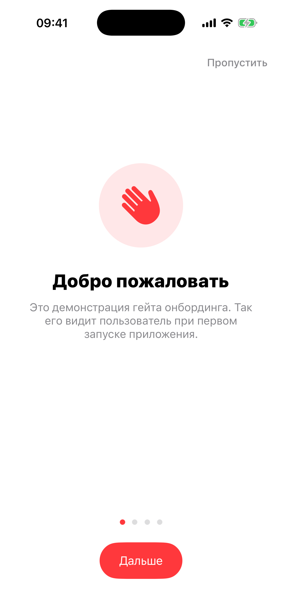

# Глава 6. Onboarding — UIPageViewController с dots indicator

{width=45%}

С Части II начинаются **гейты запуска**. Onboarding — самый
безобидный: показывается **один раз** при первом запуске mini-app
и больше никогда не появляется. Цель — за 3–4 экрана объяснить
пользователю, что он сейчас увидит, и куда мы планируем попросить у
него разрешения.

В этой главе делаем гейт целиком: контейнер с `UIPageViewController`,
dots indicator, кнопки Skip / Next / Готово, и per-manifest флаг «уже
видел» в `UserDefaults`.

## 6.1 Что показывать на этих экранах

Хороший onboarding отвечает на три вопроса пользователя:

1. **Что это за приложение?** Одно предложение, не три.
2. **Чем оно мне полезно?** Конкретно, без маркетинговой ваты.
3. **Что от меня потребуется?** Особенно — какие разрешения мы
   попросим (геолокация, фото, нотификации). Если пользователь увидит
   объяснение до системного диалога, он скажет «Разрешить» гораздо
   охотнее.

Хороший onboarding **не** делает: не запрашивает email перед тем как
пользователь увидел продукт, не заставляет регистрироваться, не
рассказывает «о нашей миссии».

Наш демо-onboarding в playground'е — для mini-app `Onboarding` (это
не настоящее приложение, а демонстрация механики). 4 страницы:

```swift
onboardingPages: [
    OnboardingPage(symbolName: "hand.wave.fill",
                   title: "Добро пожаловать",
                   body: "Это демонстрация гейта онбординга..."),
    OnboardingPage(symbolName: "bolt.fill",
                   title: "Расскажи о ключевых фишках",
                   body: "На таких страницах обычно перечисляют 2-3 главные..."),
    OnboardingPage(symbolName: "lock.shield.fill",
                   title: "Подготовь к разрешениям",
                   body: "..."),
    OnboardingPage(symbolName: "checkmark.seal.fill",
                   title: "Поехали",
                   body: "Нажми «Поехали» — ты увидишь main-экран..."),
]
```

Каждая страница — иконка из SF Symbols, заголовок и тело. Просто и
read-as-template для любого реального приложения.

## 6.2 UIPageViewController vs альтернативы

Три варианта реализации горизонтального onboarding'а:

- **UIScrollView** с `isPagingEnabled = true` — низкоуровневый. Гибкий,
  но всё вручную: запихать VC'ы как subview, считать `contentOffset`
  чтобы понимать текущую страницу.
- **UICollectionView** с paging-flow-layout — тоже работает. Удобен
  если страниц **много** (десятки), потому что переиспользует ячейки.
  Для 3–4 страниц overkill.
- **UIPageViewController** — высокоуровневый контейнер. Apple
  специально под этот сценарий. DataSource даёт «предыдущий» и
  «следующий» VC, контейнер сам рисует свайп.

Мы берём третий. Кода меньше, ошибиться сложно.

> 💡 **Идея.** `UIPageViewController` — это **контейнер**, как
> `UINavigationController`. У него есть `dataSource` и `delegate`.
> Через `dataSource` он спрашивает «какой VC показать слева/справа
> от текущего?». Ты возвращаешь готовый VC или `nil` (если страниц
> больше нет).

## 6.3 Параметры контейнера

В `init` `UIPageViewController` берёт два аргумента:

```swift
private let pageController = UIPageViewController(
    transitionStyle: .scroll,
    navigationOrientation: .horizontal
)
```

- `transitionStyle: .scroll` — свайп с inerсией. Альтернатива —
  `.pageCurl`, страница «отлистывается» как в книге. Для приложений
  скевоморфно и устаревший.
- `navigationOrientation: .horizontal` — листать пальцем влево-вправо.
  `.vertical` — вверх-вниз; иногда используют для Story-подобных
  интерфейсов.

После создания `UIPageViewController` нужно встроить как child VC:

```swift
private func embedPageController() {
    addChild(pageController)
    view.insertSubview(pageController.view, at: 0)
    pageController.didMove(toParent: self)
    pageController.dataSource = self
    pageController.delegate = self
    // ... констрейнты ...
}
```

Три шага встраивания child VC — это **стандартный паттерн UIKit**
(описан в Apple docs «UIViewController container view controller»):

1. `addChild(child)` — заявляешь о парентстве.
2. Кладёшь `child.view` куда нужно.
3. `child.didMove(toParent: self)` — сообщаешь child'у что он встроен,
   чтобы он мог обновить свои внутренние lifecycle-методы.

Шаги 1 и 3 нельзя опускать — иначе появятся странные баги: child VC
не получит `viewWillAppear`, или `safeAreaInsets` не подтянутся.

`insertSubview(_:at: 0)` — кладём view контейнера **под** наши кнопки
(Skip, Next) и dots indicator. Кнопки рисуются поверх.

## 6.4 DataSource — два метода

`UIPageViewController` спрашивает только это:

```swift
func pageViewController(_ pageViewController: UIPageViewController,
                        viewControllerBefore viewController: UIViewController) -> UIViewController? {
    guard let current = viewController as? OnboardingPageViewController else { return nil }
    return makePage(at: current.index - 1)
}

func pageViewController(_ pageViewController: UIPageViewController,
                        viewControllerAfter viewController: UIViewController) -> UIViewController? {
    guard let current = viewController as? OnboardingPageViewController else { return nil }
    return makePage(at: current.index + 1)
}
```

Чтобы реализовать оба метода, контейнеру нужно знать **номер
страницы** для каждого VC. Хранить его в `tag` view'а? Можно, но
грязно. Лучше — отдельный класс `OnboardingPageViewController` со
свойством `index`:

```swift
private final class OnboardingPageViewController: UIViewController {
    let index: Int
    private let page: OnboardingPage
    // ...
}
```

Тогда `dataSource` приводит входной VC к этому типу через `as?`,
читает `index`, и возвращает соседнюю страницу через `makePage(at:)`.
Если index < 0 или index >= pages.count — `makePage` возвращает `nil`,
и контейнер понимает «дальше листать некуда».

`makePage(at:)` — фабрика:

```swift
private func makePage(at index: Int) -> UIViewController? {
    guard pages.indices.contains(index) else { return nil }
    let page = pages[index]
    return OnboardingPageViewController(
        page: page,
        brandColor: manifest.brandColor,
        index: index
    )
}
```

Каждый запрос — **новый** VC. Контейнер сам деаллоцирует старый, когда
страница уехала из видимости. Кеширование тут не нужно — страниц мало,
и каждая лёгкая.

## 6.5 PageControl и синхронизация с свайпом

Точечный индикатор внизу:

```swift
pageControl.numberOfPages = pages.count
pageControl.currentPage = 0
pageControl.currentPageIndicatorTintColor = manifest.brandColor
pageControl.pageIndicatorTintColor = .quaternaryLabel
pageControl.addTarget(self, action: #selector(pageControlChanged), for: .valueChanged)
```

`UIPageControl` сам по себе — кликабельный. Тап по правой стороне
точек двигает `currentPage` на +1, по левой — на -1. iOS 14+
поддерживает **prefersInteractive** и появляется continuous slider при
зажатии. Мы используем стандартное поведение.

Синхронизация двунаправленная:

- **Свайп пальцем → точки**. Делегат сообщает «закончилась анимация
  свайпа», мы читаем текущий VC и обновляем `pageControl.currentPage`:

  ```swift
  func pageViewController(_ pageViewController: UIPageViewController,
                          didFinishAnimating finished: Bool,
                          previousViewControllers: [UIViewController],
                          transitionCompleted completed: Bool) {
      guard completed,
            let current = pageController.viewControllers?.first as? OnboardingPageViewController else { return }
      currentIndex = current.index
      pageControl.currentPage = current.index
      updateNextButtonTitle()
  }
  ```

- **Тап по точкам → свайп**. Когда пользователь тапает PageControl,
  iOS сам обновляет `currentPage` и шлёт `.valueChanged`. Мы ловим и
  явно вызываем `showPage(at:direction:animated:)`:

  ```swift
  @objc private func pageControlChanged() {
      let target = pageControl.currentPage
      guard target != currentIndex else { return }
      let direction: UIPageViewController.NavigationDirection =
          target > currentIndex ? .forward : .reverse
      showPage(at: target, direction: direction, animated: true)
  }
  ```

`transitionCompleted` в первом методе — важно. Если пользователь
начал свайп, но передумал и отпустил — `didFinishAnimating` всё равно
вызовется, но `completed = false`. Без проверки мы бы апдейтнули
`currentPage` неправильно.

## 6.6 Кнопки Skip и Next

```swift
@objc private func skipTapped() {
    finish()
}

@objc private func nextTapped() {
    if currentIndex < pages.count - 1 {
        showPage(at: currentIndex + 1, direction: .forward, animated: true)
    } else {
        finish()
    }
}
```

`Skip` пропускает онбординг целиком — сразу `finish()`.

`Next` ведёт себя по-разному в зависимости от страницы. Если есть
куда дальше — листает. Если страница последняя — `finish()`.

Это отражается на UI кнопок:

```swift
private func updateNextButtonTitle() {
    let isLast = currentIndex == pages.count - 1
    var config = nextButton.configuration
    config?.title = isLast ? "Поехали" : "Дальше"
    nextButton.configuration = config
    skipButton.isHidden = isLast
}
```

На последней странице кнопка называется «Поехали» (call-to-action), и
«Пропустить» прячется (уже неактуально). Маленькая, но важная деталь —
без неё на последней странице рядом стоят «Дальше» и «Пропустить», что
сбивает с толку.

## 6.7 «Уже видел» — флаг в UserDefaults

Гейт показывается только при первом запуске mini-app. Дальше — никогда.

Реализация — три статических метода:

```swift
static func key(for manifest: AppManifest) -> String {
    "onboarding.seen.\(manifest.id)"
}

static func shouldShow(for manifest: AppManifest) -> Bool {
    guard manifest.hasOnboarding,
          !manifest.onboardingPages.isEmpty else { return false }
    return !UserDefaults.standard.bool(forKey: key(for: manifest))
}

private func markSeen() {
    UserDefaults.standard.set(true, forKey: Self.key(for: manifest))
}
```

`key(for:)` — uникальный ключ **на каждое mini-app**:
`onboarding.seen.todo`, `onboarding.seen.notes`. Если бы был один общий
ключ, пройдя онбординг Todo, мы бы потеряли возможность увидеть
онбординг Notes.

`shouldShow(for:)` — статический, потому что **координатор не может
создать сам контроллер** просто чтобы проверить «нужно ли показывать».
Создание VC — дорого (view'ы, констрейнты), а нам нужно только
прочитать flag. Делаем decision-логику статической, VC создаётся
только если decision был положительный.

Это паттерн повторяется во всех гейтах: у каждого есть свой
`shouldShow(for: AppManifest) -> Bool`. Coordinator зовёт их по
очереди, ничего не зная о внутренностях.

`markSeen()` вызываем в `finish()` — то есть и при «Skip», и при
дохождении до последней страницы. Оба случая считаем за «пользователь
видел онбординг».

> 💡 **Reset для разработки.** Чтобы протестировать онбординг
> повторно, можно вручную удалить ключ:
> ```swift
> OnboardingViewController.reset(for: manifest)
> ```
> В `Apps/Onboarding/OnboardingDemoViewController.swift` есть кнопка
> «Сбросить онбординг» — она вызывает `reset(for:)` и возвращает в
> лаунчер. Зайдёшь снова — увидишь онбординг заново.

## 6.8 Бытовая аналогия

Onboarding — **инструктаж в начале экскурсии**. Гид собрал группу,
сказал три ключевые вещи: «маршрут такой, фотографировать здесь
можно, без вспышки». После этого инструктаж не повторяется — все знают.

Если бы каждый раз перед заходом в музей вам пересказывали правила —
было бы невыносимо. Но **один раз** — обязательно, иначе люди не
поймут где можно фотографировать.

То же с приложением. Один раз — да. Каждый раз — нет.

## 6.9 Edge case: коротный онбординг

Если у `manifest.onboardingPages.count == 1` — одна страница. Что
показывать?

- PageControl с одной точкой выглядит странно (точка одна, на неё
  никто не реагирует).
- Свайп вправо/влево не работает (соседних страниц нет).
- Кнопка сразу «Поехали».

Решение: либо запрещаем onboarding с одной страницей (проверка
`manifest.onboardingPages.count >= 2` в `shouldShow`), либо прячем
`pageControl` когда страниц меньше двух:

```swift
pageControl.isHidden = pages.count < 2
```

В нашей реализации онбординг разрешён с одной страницей, но это
edge case. В production обычно требуют минимум 2–3 страницы — иначе
зачем городить контейнер.

> 🛠 **Упражнение.** В `AppRegistry.swift` найди манифест Onboarding
> mini-app. Уменьши массив `onboardingPages` до одной страницы.
> Запусти Onboarding mini-app — увидишь PageControl с одной точкой.
> Решительно: либо реализуй скрытие PageControl при `count < 2`, либо
> добавь в `shouldShow` проверку `pages.count >= 2`.

## 6.10 Что мы могли бы добавить

Production-онбординги часто содержат:

- **Video/Lottie** вместо SF Symbol. Анимированная иллюстрация
  выглядит дороже статичной иконки.
- **Per-page deep link** — на третьей странице сразу запросить
  разрешение, а не на следующем экране.
- **A/B-тестирование** контента — разный текст для разных групп
  пользователей. Делается через remote config.
- **Trigger по событию** — onboarding не только при первом запуске, а
  и после крупного обновления, чтобы рассказать про новый фичур.

Всё это — поверх той же базы, что мы построили. UIPageViewController +
flag «видел» + кнопки skip/next.

## 📋 Что мы выучили

- Onboarding — гейт **разово**. Один раз при первом запуске.
  Дальше — никогда.
- `UIPageViewController(transitionStyle: .scroll,
  navigationOrientation: .horizontal)` — стандартный контейнер для
  горизонтальных пейджеров.
- DataSource даёт «соседние» VC через `viewControllerBefore` и
  `viewControllerAfter`. Для каждого VC нужен `index` — храним в
  свойстве отдельного класса страницы.
- Встраивание child VC: `addChild` → `view.addSubview` →
  `didMove(toParent:)`. Все три шага обязательны.
- PageControl ↔ свайп синхронизируются вручную: пользовательский
  свайп через `didFinishAnimating` обновляет `currentPage`, тап по
  PageControl через `.valueChanged` зовёт `setViewControllers(...)`.
- Кнопка Next меняет название на последней странице на «Поехали»;
  Skip там же прячется.
- `shouldShow(for:) -> Bool` — статический метод гейта.
  Координатор зовёт его без создания VC.
- Флаг «видел» — per-manifest в UserDefaults
  (`"onboarding.seen.\(manifest.id)"`).

→ [Глава 7. Permission primer — объяснение перед системным диалогом](./11-permission-primer.md)
