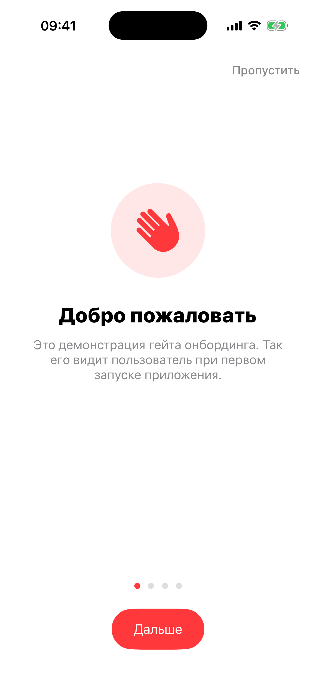

# Глава 6. Onboarding — UIPageViewController с dots indicator

{width=45%}

С Части II начинаются **гейты запуска**. Гейт (от англ. *gate* —
«ворота», «проход с проверкой») — экран, через который пользователь
проходит по пути к главному экрану mini-app. Каждый гейт что-то
проверяет или спрашивает: видел ли человек вводный тур, дал ли
разрешение, вошёл ли в аккаунт. Кто за кем идёт, решает
`BootCoordinator` из главы 4.

Onboarding (по-русски — вводный тур, «знакомство с приложением») —
самый безобидный из гейтов. Он показывается **один раз** при первом
запуске mini-app и больше не появляется. Цель — за 3–4 экрана
объяснить, что человек сейчас увидит и какие разрешения приложение
попросит.

В этой главе делаем гейт целиком: контейнер `UIPageViewController`,
индикатор-точки, кнопки «Пропустить» / «Дальше» / «Поехали» и флаг
«уже видел» в `UserDefaults`, отдельный для каждого mini-app. В конце
главы (раздел 6.11) лежит полный файл экрана — его можно скопировать в
проект и запустить.

> **Режим компилятора.** Весь код этой части проверен в том режиме,
> который описан во введении: iOS 15 как минимальная версия, язык
> Swift 6, **Approachable Concurrency** и **Default Actor Isolation =
> MainActor**. Последняя настройка значит, что каждый класс и функция без явной пометки считаются
> работающими на главном потоке. Поэтому в листингах UIKit-классов нет
> `@MainActor` — он подразумевается.

## 6.1 Что показывать на этих экранах

Хороший onboarding отвечает на три вопроса пользователя:

1. **Что это за приложение?** Одно предложение, не три.
2. **Чем оно мне полезно?** Конкретно, без маркетинговой ваты.
3. **Что от меня потребуется?** Особенно — какие разрешения мы
   попросим (геолокация, фото, уведомления). Когда человек заранее
   понимает, зачем приложению доступ, системный запрос не застаёт
   его врасплох.

Хороший onboarding **не** делает: не требует email до того, как
человек увидел продукт, не заставляет регистрироваться, не
рассказывает «о нашей миссии».

Apple в Human Interface Guidelines (HIG — сборник правил оформления
интерфейсов от Apple) формулирует похожие правила. Вводный тур должен
быть коротким и, по возможности, необязательным. Если человек его
пропустил, при новых запусках тур не показывают, но дают найти
его позже — например, пунктом «Показать обучение» в настройках. И ещё:
тур объясняет **твоё** приложение, а не то, как пользоваться iPhone.

Демо-onboarding в playground'е повесим на «Список дел» (id `todo` —
отсюда ключ `onboarding.seen.todo` из главы 2). В его манифесте в
`AppRegistry` включаем `hasOnboarding: true` и перечисляем четыре
страницы (заглушку «СКОРО» правят так же, как Чат в упражнении 2.3:
`todo.hasOnboarding = true`, `todo.onboardingPages = [...]`). Тексты
страниц — демонстрация механики, а не рассказ о настоящем приложении:

```swift
onboardingPages: [
    OnboardingPage(symbolName: "hand.wave.fill",
                   title: "Добро пожаловать",
                   body: "Это демонстрация гейта онбординга..."),
    OnboardingPage(symbolName: "bolt.fill",
                   title: "Расскажи о ключевых фишках",
                   body: "На таких страницах обычно перечисляют 2-3 главные..."),
    OnboardingPage(symbolName: "lock.shield.fill",
                   title: "Подготовь к разрешениям",
                   body: "..."),
    OnboardingPage(symbolName: "checkmark.seal.fill",
                   title: "Поехали",
                   body: "Нажми «Поехали» — ты увидишь main-экран..."),
]
```

Каждая страница — это иконка, заголовок и текст. Иконка берётся из
**SF Symbols** — встроенной в iOS библиотеки из нескольких тысяч
значков. Их не нужно добавлять в проект картинками: пишешь имя
(`"bolt.fill"` — молния) и получаешь векторную иконку, которая
масштабируется вместе с размером шрифта. Имена удобно искать в
бесплатном приложении SF Symbols с сайта Apple.

Сам тип страницы — обычная структура с тремя строками:

```swift
struct OnboardingPage {
    let symbolName: String
    let title: String
    let body: String
}
```

Шаблон годится для любого реального приложения: заменил тексты и
иконки — получил свой тур.

## 6.2 UIPageViewController vs альтернативы

Горизонтальное листание страниц в UIKit можно сделать тремя способами:

- **UIScrollView** с `isPagingEnabled = true`. Прокрутка сама
  «защёлкивается» на границах страниц, но всё остальное — вручную:
  раскладывать страницы, по `contentOffset` (насколько сдвинуто
  содержимое) вычислять номер текущей. Например, ширина экрана 390
  точек, сдвиг 780 — значит, открыта третья страница (780 / 390 = 2,
  счёт с нуля).
- **UICollectionView** с горизонтальной раскладкой и постраничной
  прокруткой. Удобен, если страниц **много** (десятки): коллекция
  переиспользует ячейки и держит в памяти только видимые. Для 3–4
  страниц это лишняя сложность.
- **UIPageViewController** — готовый контейнер, который Apple сделала
  именно для листания страниц. Ты отдаёшь ему «предыдущую» и
  «соседнюю справа» страницу, он сам рисует свайп и анимацию.

Мы берём третий: кода меньше, ошибиться сложнее.

> **Контейнер, data source, delegate.** `UIPageViewController` — это
> **контейнер**: view controller, который показывает внутри себя
> другие view controller'ы, как `UINavigationController` показывает
> стопку экранов. Данные он получает через **data source** (источник
> данных) — объект, который отвечает на вопрос «какой экран слева или
> справа от текущего?». О событиях («листание закончилось») он
> сообщает **делегату** — объекту, которому поручено реагировать.
> Оба — просто ссылки на объекты, реализующие нужный протокол. У нас
> обе роли играет сам экран онбординга.

## 6.3 Параметры контейнера

Инициализатор `UIPageViewController` берёт два главных аргумента:

```swift
private let pageController = UIPageViewController(
    transitionStyle: .scroll,
    navigationOrientation: .horizontal
)
```

- `transitionStyle: .scroll` — страницы едут вбок, как в галерее
  фото. Альтернатива `.pageCurl` — страница загибается, как лист
  бумажной книги. Выглядит старомодно, в современных приложениях
  почти не встречается.
- `navigationOrientation: .horizontal` — листать влево-вправо.
  `.vertical` — вверх-вниз; так иногда делают ленты в духе «историй».

Контейнер нужно встроить в наш экран как **дочерний view
controller** (child). Это отдельный механизм UIKit: родитель не
просто кладёт чужую view к себе, а берёт на себя ответственность за
дочерний контроллер целиком.

```swift
private func embedPageController() {
    addChild(pageController)
    view.insertSubview(pageController.view, at: 0)
    pageController.view.translatesAutoresizingMaskIntoConstraints = false
    NSLayoutConstraint.activate([
        pageController.view.topAnchor.constraint(equalTo: view.topAnchor),
        pageController.view.leadingAnchor.constraint(equalTo: view.leadingAnchor),
        pageController.view.trailingAnchor.constraint(equalTo: view.trailingAnchor),
        pageController.view.bottomAnchor.constraint(equalTo: view.bottomAnchor),
    ])
    pageController.didMove(toParent: self)
    pageController.dataSource = self
    pageController.delegate = self
}
```

Встраивание — три шага, это стандартный порядок из документации
Apple про контейнерные view controller'ы:

1. `addChild(pageController)` — объявляем: «это мой дочерний
   контроллер». UIKit запоминает связь родитель → ребёнок.
2. Кладём `pageController.view` в свою иерархию и растягиваем на весь
   экран **констрейнтами**. Констрейнт (constraint) — правило
   раскладки Auto Layout вида «верхний край этой view равен верхнему
   краю той». Четыре правила «край к краю» делают дочернюю view ровно
   размером с экран. Строка `translatesAutoresizingMaskIntoConstraints
   = false` выключает старый механизм автоматической раскладки,
   иначе его правила конфликтуют с нашими.
3. `pageController.didMove(toParent: self)` — сообщаем ребёнку, что
   встраивание закончено.

Первый и третий шаги нельзя пропускать. Без них дочерний контроллер
не получает вызовы жизненного цикла (`viewWillAppear`,
`viewDidAppear` — методы, которые UIKit зовёт при появлении и
исчезновении экрана) и неправильно узнаёт свою safe area — область
экрана, не закрытую чёлкой, статус-баром и полоской «домой» внизу.

`insertSubview(_:at: 0)` кладёт страницы **под** всё остальное:
индекс 0 — самый нижний слой. Кнопки и точки мы добавим позже, и они
окажутся сверху.

## 6.4 DataSource — два метода

`UIPageViewController` спрашивает у data source ровно две вещи:

```swift
func pageViewController(_ pageViewController: UIPageViewController,
                        viewControllerBefore viewController: UIViewController) -> UIViewController? {
    guard let current = viewController as? OnboardingPageViewController else { return nil }
    return makePage(at: current.index - 1)
}

func pageViewController(_ pageViewController: UIPageViewController,
                        viewControllerAfter viewController: UIViewController) -> UIViewController? {
    guard let current = viewController as? OnboardingPageViewController else { return nil }
    return makePage(at: current.index + 1)
}
```

Контейнер передаёт текущую страницу и спрашивает соседнюю. Чтобы
ответить, нужно знать **номер** текущей страницы. Можно было бы
прятать номер в `view.tag`, но это неочевидно для читающего код.
Надёжнее — отдельный класс страницы со свойством `index`:

```swift
private final class OnboardingPageViewController: UIViewController {
    let index: Int
    private let page: OnboardingPage
    private let brandColor: UIColor
    // ...
}
```

`dataSource` приводит пришедший контроллер к этому типу через `as?`,
читает `index` и строит соседа через `makePage(at:)`. Если сосед за
пределами массива, `makePage` возвращает `nil`, и контейнер понимает:
дальше листать некуда. На первой странице свайп вправо просто
пружинит и возвращается, на последней — то же с другой стороны.

`makePage(at:)` — фабрика страниц:

```swift
private func makePage(at index: Int) -> UIViewController? {
    guard pages.indices.contains(index) else { return nil }
    let page = pages[index]
    return OnboardingPageViewController(
        page: page,
        brandColor: manifest.brandColor,
        index: index
    )
}
```

`pages.indices.contains(index)` — безопасная проверка «такой номер в
массиве есть». Для четырёх страниц `indices` — это диапазон 0...3,
поэтому `-1` и `4` отсекаются, и до обращения `pages[index]`
(которое на неверном индексе уронило бы приложение) дело не доходит.

Каждый запрос создаёт **новый** контроллер страницы. Контейнер держит
у себя текущую страницу и, возможно, соседние, а ушедшие из вида
освобождает сам. Кешировать страницы вручную не нужно: их мало, и
каждая лёгкая.

## 6.5 PageControl и синхронизация со свайпом

Точки внизу — это `UIPageControl`:

```swift
pageControl.numberOfPages = pages.count
pageControl.currentPage = 0
pageControl.currentPageIndicatorTintColor = manifest.brandColor
pageControl.pageIndicatorTintColor = .quaternaryLabel
pageControl.hidesForSinglePage = true
pageControl.addTarget(self, action: #selector(pageControlChanged), for: .valueChanged)
```

Разбор по строкам:

- `numberOfPages` — сколько точек рисовать; `currentPage` — какая
  подсвечена.
- `currentPageIndicatorTintColor` — цвет активной точки, у нас это
  фирменный цвет mini-app из манифеста.
- `pageIndicatorTintColor = .quaternaryLabel` — неактивные точки.
  `.quaternaryLabel` — системный «очень бледный» цвет текста; он сам
  подстраивается под светлую и тёмную тему.
- `hidesForSinglePage = true` — если страница одна, точки прячутся
  (вернёмся к этому в 6.9).
- `addTarget(_:action:for: .valueChanged)` — подписка на событие
  «пользователь сменил страницу через точки».

`UIPageControl` сам по себе интерактивный. Тап справа от активной
точки переключает на страницу вперёд, слева — назад. С iOS 14 по
точкам можно ещё и вести пальцем, листая страницы подряд; это
поведение включено по умолчанию и управляется свойством
`allowsContinuousInteraction`. Мы его не трогаем.

Синхронизация точек и страниц идёт в обе стороны.

**Свайп пальцем → точки.** Когда листание закончилось, контейнер
зовёт метод делегата. Мы читаем, какая страница теперь на экране, и
двигаем точку:

```swift
func pageViewController(_ pageViewController: UIPageViewController,
                        didFinishAnimating finished: Bool,
                        previousViewControllers: [UIViewController],
                        transitionCompleted completed: Bool) {
    guard completed,
          let current = pageController.viewControllers?.first as? OnboardingPageViewController
    else { return }
    currentIndex = current.index
    pageControl.currentPage = current.index
    updateNextButtonTitle()
}
```

Проверка `completed` здесь обязательна. Если пользователь начал свайп,
передумал и отпустил палец, метод всё равно вызовется, но с
`completed == false`: страница осталась прежней. Без проверки точка
убежала бы на соседнюю страницу, а на экране осталась бы старая.

`pageController.viewControllers?.first` — контейнер хранит массив
показанных страниц; в режиме `.scroll` на экране всегда одна, поэтому
берём первую.

**Тап по точкам → страница.** При тапе `UIPageControl` сначала сам
меняет `currentPage`, потом шлёт `.valueChanged`. Мы ловим событие и
листаем контейнер:

```swift
@objc private func pageControlChanged() {
    let target = pageControl.currentPage
    guard target != currentIndex else { return }
    let direction: UIPageViewController.NavigationDirection =
        target > currentIndex ? .forward : .reverse
    showPage(at: target, direction: direction, animated: true)
}
```

Направление анимации зависит от того, куда листаем: номер больше
текущего — едем вперёд (`.forward`), меньше — назад (`.reverse`).

Сам переход делает общий метод `showPage`:

```swift
private func showPage(at index: Int,
                      direction: UIPageViewController.NavigationDirection,
                      animated: Bool) {
    guard let page = makePage(at: index) else { return }
    pageController.setViewControllers([page], direction: direction, animated: animated)
    currentIndex = index
    pageControl.currentPage = index
    updateNextButtonTitle()
}
```

`setViewControllers(_:direction:animated:)` — способ программно
поставить в контейнер нужную страницу. Сразу после этого обновляем
`currentIndex`, точки и заголовок кнопки. Метод
`didFinishAnimating` при программной смене **не** вызывается — он
только для жестов пальцем, поэтому состояние обновляем здесь сами.

## 6.6 Кнопки «Пропустить» и «Дальше»

```swift
@objc private func skipTapped() {
    finish()
}

@objc private func nextTapped() {
    if currentIndex < pages.count - 1 {
        showPage(at: currentIndex + 1, direction: .forward, animated: true)
    } else {
        finish()
    }
}
```

«Пропустить» закрывает онбординг целиком — сразу `finish()`.

«Дальше» ведёт себя по-разному. Если впереди есть страницы — листает.
Если страница последняя (`currentIndex` равен `pages.count - 1`,
то есть 3 при четырёх страницах) — завершает тур.

Это отражается на подписях кнопок:

```swift
private func updateNextButtonTitle() {
    let isLast = currentIndex == pages.count - 1
    var config = nextButton.configuration
    config?.title = isLast ? "Поехали" : "Дальше"
    nextButton.configuration = config
    skipButton.isHidden = isLast
}
```

`UIButton.Configuration` (iOS 15+) — современный способ описать
кнопку целиком: текст, цвета, скругление, отступы. Конфигурацию нельзя
поправить «на месте»: копируем её в переменную, меняем заголовок и
присваиваем обратно — кнопка перерисуется.

На последней странице кнопка называется «Поехали» (призыв к действию),
а «Пропустить» прячется: пропускать уже нечего. Мелочь, но без неё на
последней странице рядом стоят «Дальше» и «Пропустить», и непонятно,
чем они отличаются.

## 6.7 «Уже видел» — флаг в UserDefaults

Гейт показывается только при первом запуске mini-app. Где хранить
отметку «уже видел»? В `UserDefaults` — простом хранилище настроек
«ключ → значение», которое iOS сохраняет в файл внутри **песочницы**
приложения. Песочница (sandbox) — личная папка приложения на
устройстве: другие приложения в неё заглянуть не могут, а при
удалении приложения она стирается вместе со всеми настройками.
Для булевых флагов вроде нашего `UserDefaults` подходит идеально.
Для паролей и токенов — нет, про это глава 8.

Реализация — несколько статических методов и один обычный:

```swift
static func key(for manifest: AppManifest) -> String {
    "onboarding.seen.\(manifest.id)"
}

static func shouldShow(for manifest: AppManifest) -> Bool {
    guard manifest.hasOnboarding,
          !manifest.onboardingPages.isEmpty else { return false }
    return !UserDefaults.standard.bool(forKey: key(for: manifest))
}

static func reset(for manifest: AppManifest) {
    UserDefaults.standard.removeObject(forKey: key(for: manifest))
}

private func markSeen() {
    UserDefaults.standard.set(true, forKey: Self.key(for: manifest))
}
```

`key(for:)` строит ключ **для каждого mini-app свой**:
`onboarding.seen.todo`, `onboarding.seen.notes`. Будь ключ общим,
пройдя тур в Todo, человек никогда не увидел бы тур Notes.

`shouldShow(for:)` читает флаг. `UserDefaults.bool(forKey:)` для
несуществующего ключа возвращает `false`, поэтому при первом запуске
«не видел» получается само собой, без отдельной проверки.

`shouldShow(for:)` сделан **статическим**, чтобы координатор мог
спросить «нужно ли показывать?», не создавая сам экран. Создавать
контроллер ради одной проверки расточительно: пришлось бы собирать
кнопки, констрейнты, контейнер — и выбросить. Решение принимается
статическим методом, а экран создаётся, только если ответ «да».

Этот приём повторяется во всех гейтах книги: у каждого есть
`shouldShow(for: AppManifest) -> Bool`. Координатор зовёт их по
очереди и ничего не знает об их устройстве.

`markSeen()` вызывается внутри `finish()` — и при «Пропустить», и при
«Поехали»:

```swift
private func finish() {
    markSeen()
    onFinish()
}
```

Оба случая считаем как «пользователь видел онбординг». `onFinish` —
замыкание, которое передал координатор; через него гейт говорит
«я закончил, веди дальше» (см. главу 4).

`reset(for:)` удаляет ключ. Он нужен в двух местах: разработчику —
чтобы увидеть тур заново, не переустанавливая приложение, и
пользователю — если в настройках mini-app есть пункт «Показать
обучение ещё раз», как советует HIG. Такой пункт вызывает
`OnboardingViewController.reset(for: manifest)` и возвращает в
лаунчер; при новом входе тур покажется снова.

## 6.8 Бытовая аналогия

Onboarding — **инструктаж в начале экскурсии**. Гид собрал группу и
сказал три главные вещи: «маршрут такой, фотографировать можно, без
вспышки». Дальше инструктаж не повторяется — все знают правила.

Если бы перед каждым залом музея правила пересказывали заново, это
было бы невыносимо. Но **один раз** — нужно, иначе люди не поймут,
где можно фотографировать. А если кто-то прослушал, он может
подойти к гиду и спросить ещё раз — это наш пункт «Показать
обучение».

## 6.9 Краевой случай: одна страница

Что если в манифесте `onboardingPages.count == 1`?

- Одна точка в индикаторе выглядит странно: на неё нечего нажимать.
- Свайп не работает: соседних страниц нет.
- Кнопка сразу называется «Поехали».

Точки решает одна строка, которую мы уже поставили в 6.5:

```swift
pageControl.hidesForSinglePage = true
```

У `UIPageControl` это встроенное свойство: при `numberOfPages == 1`
контрол прячется сам. Второй вариант — вообще запретить тур из одной
страницы: добавить в `shouldShow` условие
`manifest.onboardingPages.count >= 2`. Тогда одностраничный
«онбординг» лучше сделать обычным экраном или всплывающей подсказкой.

**Упражнение 6.1.** В `AppRegistry.swift` (глава 2) найди манифест
«Списка дел» и уменьши массив `onboardingPages` до одной
страницы. Запусти mini-app и убедись, что точек нет, свайп
пружинит, а кнопка называется «Поехали». Затем закомментируй
`hidesForSinglePage = true` и посмотри на разницу. Какой вариант
выберешь ты — спрятать точки или запретить тур из одной страницы в
`shouldShow`? Реши и реализуй. Ответ — в конце главы.

## 6.10 Что можно добавить

Production-онбординги часто содержат:

- **Видео или анимацию** вместо SF Symbol. Анимированная иллюстрация
  (например, через библиотеку Lottie) выглядит живее статичной иконки.
- **Запрос разрешения прямо со страницы.** На странице «Подготовь к
  разрешениям» можно сразу показать системный запрос. HIG прямо
  предлагает так делать, если приложение без разрешения не работает.
  Как правильно оформить такой экран, разберём в главе 7.
- **A/B-тестирование** контента — разный текст для разных групп
  пользователей, чтобы сравнить, какой лучше. Тексты тогда приходят
  с сервера через удалённую конфигурацию (глава 9).
- **Показ по событию** — не только при первом запуске, но и после
  крупного обновления, чтобы рассказать о новых возможностях. Для
  этого в ключ добавляют версию: `onboarding.seen.todo.v2`.

Всё это строится поверх той же базы: `UIPageViewController`, флаг
«видел» и кнопки «Пропустить» / «Дальше».

**Упражнение 6.2.** Сделай так, чтобы после обновления приложения до
версии 2.0 тур показался снова, даже если человек уже видел тур
версии 1. Подсказка: достаточно поменять одну функцию. Ответ — в конце
главы.

## 6.11 Экран целиком

Ниже — полный файл `OnboardingViewController.swift` со всеми кусками
из этой главы и вёрсткой, которую мы в тексте пропускали. Он
собирается и запускается в режиме, описанном в начале главы; тип
`AppManifest` — из главы 2.

```swift
import UIKit

final class OnboardingViewController: UIViewController {

    static func key(for manifest: AppManifest) -> String {
        "onboarding.seen.\(manifest.id)"
    }

    static func shouldShow(for manifest: AppManifest) -> Bool {
        guard manifest.hasOnboarding,
              !manifest.onboardingPages.isEmpty else { return false }
        return !UserDefaults.standard.bool(forKey: key(for: manifest))
    }

    static func reset(for manifest: AppManifest) {
        UserDefaults.standard.removeObject(forKey: key(for: manifest))
    }

    private let manifest: AppManifest
    private let onFinish: () -> Void
    private var pages: [OnboardingPage] { manifest.onboardingPages }
    private var currentIndex = 0

    private let pageController = UIPageViewController(
        transitionStyle: .scroll,
        navigationOrientation: .horizontal
    )
    private let pageControl = UIPageControl()
    private let skipButton = UIButton(type: .system)
    private let nextButton = UIButton(configuration: .filled())

    init(manifest: AppManifest, onFinish: @escaping () -> Void) {
        self.manifest = manifest
        self.onFinish = onFinish
        super.init(nibName: nil, bundle: nil)
    }

    required init?(coder: NSCoder) {
        fatalError("init(coder:) не используется: экран собирается кодом")
    }

    override func viewDidLoad() {
        super.viewDidLoad()
        view.backgroundColor = .systemBackground
        embedPageController()
        setupControls()
        showPage(at: 0, direction: .forward, animated: false)
    }

    private func embedPageController() {
        addChild(pageController)
        view.insertSubview(pageController.view, at: 0)
        pageController.view.translatesAutoresizingMaskIntoConstraints = false
        NSLayoutConstraint.activate([
            pageController.view.topAnchor.constraint(equalTo: view.topAnchor),
            pageController.view.leadingAnchor.constraint(equalTo: view.leadingAnchor),
            pageController.view.trailingAnchor.constraint(equalTo: view.trailingAnchor),
            pageController.view.bottomAnchor.constraint(equalTo: view.bottomAnchor),
        ])
        pageController.didMove(toParent: self)
        pageController.dataSource = self
        pageController.delegate = self
    }

    private func setupControls() {
        pageControl.numberOfPages = pages.count
        pageControl.currentPage = 0
        pageControl.currentPageIndicatorTintColor = manifest.brandColor
        pageControl.pageIndicatorTintColor = .quaternaryLabel
        pageControl.hidesForSinglePage = true
        pageControl.addTarget(self, action: #selector(pageControlChanged), for: .valueChanged)

        skipButton.setTitle("Пропустить", for: .normal)
        skipButton.tintColor = .secondaryLabel
        skipButton.addTarget(self, action: #selector(skipTapped), for: .touchUpInside)

        var config = UIButton.Configuration.filled()
        config.baseBackgroundColor = manifest.brandColor
        config.cornerStyle = .capsule
        config.title = "Дальше"
        nextButton.configuration = config
        nextButton.addTarget(self, action: #selector(nextTapped), for: .touchUpInside)

        [pageControl, skipButton, nextButton].forEach {
            $0.translatesAutoresizingMaskIntoConstraints = false
            view.addSubview($0)
        }
        let guide = view.safeAreaLayoutGuide
        NSLayoutConstraint.activate([
            skipButton.topAnchor.constraint(equalTo: guide.topAnchor, constant: 8),
            skipButton.trailingAnchor.constraint(equalTo: guide.trailingAnchor, constant: -16),

            nextButton.leadingAnchor.constraint(equalTo: guide.leadingAnchor, constant: 24),
            nextButton.trailingAnchor.constraint(equalTo: guide.trailingAnchor, constant: -24),
            nextButton.bottomAnchor.constraint(equalTo: guide.bottomAnchor, constant: -16),
            nextButton.heightAnchor.constraint(greaterThanOrEqualToConstant: 50),

            pageControl.centerXAnchor.constraint(equalTo: view.centerXAnchor),
            pageControl.bottomAnchor.constraint(equalTo: nextButton.topAnchor, constant: -16),
        ])
    }

    private func makePage(at index: Int) -> UIViewController? {
        guard pages.indices.contains(index) else { return nil }
        let page = pages[index]
        return OnboardingPageViewController(
            page: page,
            brandColor: manifest.brandColor,
            index: index
        )
    }

    private func showPage(at index: Int,
                          direction: UIPageViewController.NavigationDirection,
                          animated: Bool) {
        guard let page = makePage(at: index) else { return }
        pageController.setViewControllers([page], direction: direction, animated: animated)
        currentIndex = index
        pageControl.currentPage = index
        updateNextButtonTitle()
    }

    @objc private func pageControlChanged() {
        let target = pageControl.currentPage
        guard target != currentIndex else { return }
        let direction: UIPageViewController.NavigationDirection =
            target > currentIndex ? .forward : .reverse
        showPage(at: target, direction: direction, animated: true)
    }

    @objc private func skipTapped() {
        finish()
    }

    @objc private func nextTapped() {
        if currentIndex < pages.count - 1 {
            showPage(at: currentIndex + 1, direction: .forward, animated: true)
        } else {
            finish()
        }
    }

    private func updateNextButtonTitle() {
        let isLast = currentIndex == pages.count - 1
        var config = nextButton.configuration
        config?.title = isLast ? "Поехали" : "Дальше"
        nextButton.configuration = config
        skipButton.isHidden = isLast
    }

    private func finish() {
        markSeen()
        onFinish()
    }

    private func markSeen() {
        UserDefaults.standard.set(true, forKey: Self.key(for: manifest))
    }
}

extension OnboardingViewController: UIPageViewControllerDataSource, UIPageViewControllerDelegate {

    func pageViewController(_ pageViewController: UIPageViewController,
                            viewControllerBefore viewController: UIViewController) -> UIViewController? {
        guard let current = viewController as? OnboardingPageViewController else { return nil }
        return makePage(at: current.index - 1)
    }

    func pageViewController(_ pageViewController: UIPageViewController,
                            viewControllerAfter viewController: UIViewController) -> UIViewController? {
        guard let current = viewController as? OnboardingPageViewController else { return nil }
        return makePage(at: current.index + 1)
    }

    func pageViewController(_ pageViewController: UIPageViewController,
                            didFinishAnimating finished: Bool,
                            previousViewControllers: [UIViewController],
                            transitionCompleted completed: Bool) {
        guard completed,
              let current = pageController.viewControllers?.first as? OnboardingPageViewController
        else { return }
        currentIndex = current.index
        pageControl.currentPage = current.index
        updateNextButtonTitle()
    }
}

private final class OnboardingPageViewController: UIViewController {
    let index: Int
    private let page: OnboardingPage
    private let brandColor: UIColor

    init(page: OnboardingPage, brandColor: UIColor, index: Int) {
        self.page = page
        self.brandColor = brandColor
        self.index = index
        super.init(nibName: nil, bundle: nil)
    }

    required init?(coder: NSCoder) { fatalError("init(coder:) не используется") }

    override func viewDidLoad() {
        super.viewDidLoad()
        view.backgroundColor = .systemBackground

        let icon = UIImageView(image: UIImage(systemName: page.symbolName))
        icon.tintColor = brandColor
        icon.contentMode = .scaleAspectFit
        icon.preferredSymbolConfiguration = UIImage.SymbolConfiguration(pointSize: 72, weight: .semibold)

        let titleLabel = UILabel()
        titleLabel.text = page.title
        titleLabel.font = .preferredFont(forTextStyle: .title1)
        titleLabel.adjustsFontForContentSizeCategory = true
        titleLabel.textAlignment = .center
        titleLabel.numberOfLines = 0

        let bodyLabel = UILabel()
        bodyLabel.text = page.body
        bodyLabel.font = .preferredFont(forTextStyle: .body)
        bodyLabel.adjustsFontForContentSizeCategory = true
        bodyLabel.textColor = .secondaryLabel
        bodyLabel.textAlignment = .center
        bodyLabel.numberOfLines = 0

        let stack = UIStackView(arrangedSubviews: [icon, titleLabel, bodyLabel])
        stack.axis = .vertical
        stack.spacing = 16
        stack.alignment = .center
        stack.translatesAutoresizingMaskIntoConstraints = false
        view.addSubview(stack)
        NSLayoutConstraint.activate([
            stack.centerYAnchor.constraint(equalTo: view.safeAreaLayoutGuide.centerYAnchor, constant: -40),
            stack.leadingAnchor.constraint(equalTo: view.layoutMarginsGuide.leadingAnchor, constant: 16),
            stack.trailingAnchor.constraint(equalTo: view.layoutMarginsGuide.trailingAnchor, constant: -16),
        ])
    }
}
```

Что в файле нового по сравнению с кусками из разделов:

- `required init?(coder:)` с `fatalError`. UIKit требует этот
  инициализатор у каждого наследника `UIViewController` — через него
  экран создаётся из storyboard. Мы собираем экран кодом, поэтому
  честно падаем, если кто-то попробует загрузить его из storyboard.
- В `setupControls()` кнопки привязаны к `safeAreaLayoutGuide` —
  прямоугольнику safe area. Поэтому «Пропустить» не залезает под
  чёлку, а «Дальше» — под полоску «домой».
- `nextButton.heightAnchor ... greaterThanOrEqualToConstant: 50` —
  высота **не меньше** 50 точек. Не «ровно 50»: если человек включил
  крупный шрифт, кнопка вырастет вместе с текстом.
- Шрифты страницы — `preferredFont(forTextStyle:)` вместе с
  `adjustsFontForContentSizeCategory = true`. Это **Dynamic Type**:
  размер текста следует системной настройке «Размер текста» и меняется
  на лету, без перезапуска экрана.
- `numberOfLines = 0` у надписей — «сколько угодно строк». Длинный
  текст переносится, а не обрезается многоточием.
- Страница центрируется по safe area со сдвигом на 40 точек вверх
  (`constant: -40`), чтобы не наезжать на кнопки внизу. Отступы по
  бокам — от `layoutMarginsGuide`: это «поля» view, стандартно
  16–20 точек от края на iPhone.
- Цвета фона и текста — системные (`.systemBackground`,
  `.secondaryLabel`), поэтому тёмная тема работает без единой строки
  кода.

## Ответы к упражнениям

**6.1.** Оба варианта рабочие. Если оставляешь одностраничный тур —
достаточно `pageControl.hidesForSinglePage = true` (строка уже есть в
6.11). Если запрещаешь — меняешь `shouldShow`:

```swift
static func shouldShow(for manifest: AppManifest) -> Bool {
    guard manifest.hasOnboarding,
          manifest.onboardingPages.count >= 2 else { return false }
    return !UserDefaults.standard.bool(forKey: key(for: manifest))
}
```

Проверка: с одной страницей mini-app сразу открывает главный экран,
тура нет.

**6.2.** Добавь версию в ключ — старый флаг просто перестанет
учитываться:

```swift
static func key(for manifest: AppManifest) -> String {
    "onboarding.seen.\(manifest.id).v2"
}
```

Проверка: пройди тур, поменяй `v2` на `v3`, запусти снова — тур
появится, хотя флаг `...v2` в `UserDefaults` остался. Старые ключи
можно удалить при запуске, но хранить один лишний `Bool` дёшево.

## Что мы выучили

- Onboarding — **разовый** гейт: показываем при первом запуске, дальше
  не показываем, но даём найти тур в настройках.
- `UIPageViewController(transitionStyle: .scroll,
  navigationOrientation: .horizontal)` — стандартный контейнер для
  горизонтального листания страниц.
- Data source отдаёт соседние страницы через `viewControllerBefore` и
  `viewControllerAfter`. Номер страницы храним в свойстве `index`
  отдельного класса страницы.
- Встраивание дочернего контроллера: `addChild` → view в иерархию →
  `didMove(toParent:)`. Первый и третий шаги обязательны.
- Точки и страницы синхронизируем вручную: свайп — через
  `didFinishAnimating` с проверкой `completed`, тап по точкам — через
  `.valueChanged` и `setViewControllers(...)`.
- На последней странице «Дальше» превращается в «Поехали», а
  «Пропустить» прячется.
- `shouldShow(for:) -> Bool` — статический метод гейта; координатор
  зовёт его, не создавая экран.
- Флаг «видел» — отдельный для каждого mini-app ключ в `UserDefaults`
  (`"onboarding.seen.\(manifest.id)"`). `UserDefaults` — для настроек,
  не для секретов.
- `hidesForSinglePage` прячет точки, когда страница одна.

## Apple Developer Documentation

- [Human Interface Guidelines — Onboarding](https://developer.apple.com/design/human-interface-guidelines/onboarding) — вводный тур должен быть коротким и необязательным, не повторяться при новых запусках и оставаться доступным из настроек.
- [`UIPageViewController`](https://developer.apple.com/documentation/uikit/uipageviewcontroller) — контейнер для листания страниц; `transitionStyle: .scroll`, `navigationOrientation: .horizontal` — наша конфигурация.
- [`UIPageControl`](https://developer.apple.com/documentation/uikit/uipagecontrol) — индикатор-точки; `hidesForSinglePage`, с iOS 14 — `allowsContinuousInteraction` и `preferredIndicatorImage` для своих иконок вместо точек.
- [`UIScrollView`](https://developer.apple.com/documentation/uikit/uiscrollview) — низкоуровневая альтернатива (`isPagingEnabled = true`), когда возможностей `UIPageViewController` уже не хватает.
- [`UserDefaults`](https://developer.apple.com/documentation/foundation/userdefaults) — простое хранилище под флаг «онбординг пройден»; годится для настроек, но не для секретов.

→ [Глава 7. Permission primer — объяснение перед системным диалогом](./11-permission-primer.md)
