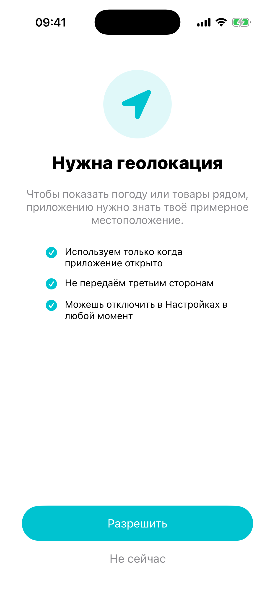

# Глава 7. Permission primer — объяснение перед системным диалогом

{width=45%}

Когда приложение в первый раз вызывает `CLLocationManager
.requestWhenInUseAuthorization()` или
`PHPhotoLibrary.requestAuthorization(...)`, iOS **сама** показывает
системный alert: «Приложение хочет доступ к геолокации — Разрешить /
Не разрешать». Этот alert ты не контролируешь: ни текст, ни кнопки,
ни картинку.

У этого alert'а одна большая проблема: пользователь видит его
**впервые**, без контекста. На скрине только три строки и две кнопки.
Подавляющее большинство жмёт «Не разрешать» — на всякий случай.

После «Не разрешать» вернуть разрешение можно только через Настройки.
Системный alert второй раз не покажется. Это **финал**.

Решение — показать **свой** экран **до** системного alert'а. С
иконкой, объяснением «зачем», тремя bullet-points про privacy, и
кнопками «Разрешить» / «Не сейчас». Это и есть **permission primer**.

Конверсия заметно растёт: по публичным кейсам (их любят приводить
команды вроде Spotify, Pinterest, Tinder) primer поднимает долю
«Allow» в разы. Точные цифры в разных источниках расходятся и зависят
от приложения, так что воспринимай их как порядок величины, а не как
гарантию. Дальше в главе мы сделаем такой же primer.

## 7.1 Что показываем

Структура primer-экрана одинакова для всех permission-типов:

```
   ┌─────────────────────────┐
   │       [иконка]          │
   │                         │
   │      Заголовок          │
   │                         │
   │   Тело — одно           │
   │   предложение           │
   │                         │
   │   • Bullet 1            │
   │   • Bullet 2            │
   │   • Bullet 3            │
   │                         │
   │   [    Разрешить    ]   │
   │       Не сейчас         │
   └─────────────────────────┘
```

Иконка — тематическая (камера, геолокация, фото). Заголовок — почему
оно нужно **этому конкретному приложению**. Bullet'ы — почему это
безопасно («не передаём третьим сторонам», «только когда приложение
открыто», «можно отключить в Настройках»).

Меняется только **контент**. UI одинаковый.

## 7.2 Контент per-type — `switch` на enum

В `PermissionPrimerViewController` есть computed property:

```swift
private var content: (icon: String, title: String, body: String, bullets: [String]) {
    switch kind {
    case .location:
        return (
            icon: "location.fill",
            title: "Нужна геолокация",
            body: "Чтобы показать погоду или товары рядом, приложению нужно знать твоё примерное местоположение.",
            bullets: [
                "Используем только когда приложение открыто",
                "Не передаём третьим сторонам",
                "Можешь отключить в Настройках в любой момент",
            ]
        )
    case .photoLibrary:
        return (...)
    case .camera:
        return (...)
    // ... и так далее
    }
}
```

Один `switch` по `PermissionKind`, каждый case возвращает кортеж из
четырёх строк. UI ничего не знает про конкретный permission — он
просто читает `content.icon`, `content.title`, `content.body`,
`content.bullets`.

> 💡 **Почему не подкласс на каждый тип.** Можно было бы сделать
> `LocationPrimerViewController`, `PhotoPrimerViewController`,
> и так далее. Это бы дало гибкость — у каждого permissionа свой
> макет, своя анимация. Но в нашем случае макет одинаковый, и
> делать пять подклассов ради разного текста — overkill. Один VC
> + computed property проще читать и поддерживать.

В реальном проекте я обычно начинаю с computed property как у нас, и
если для какого-то permission'а понадобится особый UI — выношу в
подкласс. Этот рефакторинг занимает 10 минут, делать его заранее
бессмысленно.

## 7.3 Кнопка «Разрешить» — что внутри

Пользователь тапнул «Разрешить». Что происходит:

```swift
@objc private func allowTapped() {
    guard !requestInFlight else { return }
    requestInFlight = true
    Task { [weak self] in
        guard let self else { return }
        let outcome = await PermissionService.shared.request(kind)
        self.requestInFlight = false
        self.onResult(outcome)
    }
}
```

`PermissionService.shared.request(kind)` — наш wrapper над системными
API. Он сам решает, какой framework позвать (CoreLocation / Photos /
AVCaptureDevice / UserNotifications) — в зависимости от `kind`.

Возвращает `PermissionService.Outcome` — наш enum: `granted`,
`denied`, `limited` (это для фото — пользователь может дать доступ к
**нескольким** фотографиям, а не ко всей библиотеке), `notSupported`
(на симуляторе некоторые permission'ы не работают).

`requestInFlight = true` — защита от двойного тапа. Если пользователь
успеет два раза кликнуть быстро, первый запрос ещё идёт, второй
сразу же сваливается. Без флага мы бы попытались дёрнуть систему
два раза, и кто знает, что получим.

`onResult(outcome)` — callback в `BootCoordinator`. Координатор
**не реагирует** на конкретный outcome (см. Главу 4): идёт дальше
независимо от того, granted или denied. Конкретное mini-app само
решит, как себя вести при отсутствии разрешения (показать кнопку
«Открыть настройки», fallback на ручной ввод, и т.д.).

## 7.4 Кнопка «Не сейчас»

```swift
@objc private func skipTapped() {
    onResult(.denied)
}
```

Просто зовём callback с `.denied`. Никакого системного API не дёргаем
— тем самым **сохраняем** для пользователя возможность позже всё
ещё увидеть системный диалог. Системный alert показывается **только
один раз** — если бы мы его дёрнули, потом этой возможности уже не
было бы.

> 💡 **Идея.** «Не сейчас» в primer'е ≠ «Не разрешать» в системном
> диалоге. Системный «Не разрешать» — финал. «Не сейчас» в нашем
> primer'е — отложить решение, дать пользователю передумать позже.
> Когда mini-app в следующий раз понадобится permission, primer
> покажется снова, и человек получит ещё один шанс согласиться.

## 7.5 `PermissionService` — обёртка над системными API

Системные API для permission'ов написаны в разные эпохи, и API
разные:

- **CoreLocation** — делегат + observable property. Async API нет.
- **Photos** — completion-handler.
- **AVCaptureDevice** — completion-handler.
- **UserNotifications** — async/await (нативный из Swift Concurrency).

Чтобы UI-слой не возился с этим зоопарком, мы делаем единый сервис с
одним методом:

```swift
@MainActor
final class PermissionService: NSObject {
    static let shared = PermissionService()

    func request(_ kind: PermissionKind) async -> Outcome {
        switch kind {
        case .location: return await requestLocation()
        case .photoLibrary: return await requestPhotos()
        case .camera: return await requestCamera()
        // ...
        }
    }
}
```

UI зовёт `await service.request(.camera)` — и получает `Outcome`.
Что там внутри — забота сервиса.

### CoreLocation через `withCheckedContinuation`

CoreLocation — самая сложная обёртка. Делегат + не возвращающий
методов:

```swift
private func requestLocation() async -> Outcome {
    let manager = CLLocationManager()
    locationManager = manager
    return await withCheckedContinuation { (cont: CheckedContinuation<Outcome, Never>) in
        locationContinuation = cont
        manager.delegate = self
        manager.requestWhenInUseAuthorization()
        // Если статус уже определён — делегат может не сработать.
        switch manager.authorizationStatus {
        case .authorizedAlways, .authorizedWhenInUse:
            resolveLocation(.granted)
        case .denied, .restricted:
            resolveLocation(.denied)
        default:
            break  // ждём делегат
        }
    }
}
```

Что здесь происходит:

1. Создаём `CLLocationManager` и сохраняем его в свойстве (если бы
   не сохранили, ARC бы его убил, и делегат никогда бы не сработал).
2. `withCheckedContinuation` — мост между callback-based и async/await.
   Он даёт нам объект `cont`, и мы **сохраняем** его в свойстве.
3. Зовём `requestWhenInUseAuthorization()` — система показывает alert.
4. Когда пользователь ответил, iOS зовёт делегат-метод
   `locationManagerDidChangeAuthorization`. В нём мы зовём
   `cont.resume(returning: .granted)` или `.denied`, и `async`-функция
   возвращается.

`nonisolated func locationManagerDidChangeAuthorization` — делегат-метод
помечен `nonisolated`, потому что iOS зовёт его не обязательно с main.
Внутри мы переходим на main через `Task { @MainActor in ... }` чтобы
безопасно обратиться к нашему `locationContinuation`.

> ⚠ **`withCheckedContinuation` — одноразовая.** Если
> `cont.resume(...)` вызвать **дважды**, будет краш. Поэтому в
> `resolveLocation` мы первым делом сбрасываем `locationContinuation
> = nil`, и `cont.resume` зовётся только если continuation
> ещё активна.

### Photos и Camera — completion handler → continuation

Для photos и camera всё проще — у них completion-based API:

```swift
private func requestPhotos() async -> Outcome {
    await withCheckedContinuation { (cont: CheckedContinuation<Outcome, Never>) in
        PHPhotoLibrary.requestAuthorization(for: .readWrite) { status in
            let outcome: Outcome
            switch status {
            case .authorized: outcome = .granted
            case .limited: outcome = .limited
            case .denied, .restricted: outcome = .denied
            case .notDetermined: outcome = .denied
            @unknown default: outcome = .denied
            }
            cont.resume(returning: outcome)
        }
    }
}
```

Внутри completion-handler'а мы один раз зовём `cont.resume(returning:)`.
Без всяких сохранений continuation в свойство — это локальный обмен
«callback ↔ async».

### Push notifications — нативный async

`UNUserNotificationCenter` уже умеет async:

```swift
private func requestPush() async -> Outcome {
    do {
        let granted = try await UNUserNotificationCenter.current()
            .requestAuthorization(options: [.alert, .sound, .badge])
        return granted ? .granted : .denied
    } catch {
        return .denied
    }
}
```

Ни continuation, ни делегата. Просто `await`. Apple наконец сделала.

## 7.6 `shouldShow` — когда primer не нужен

Гейт показывается **только** если статус permission'а ещё не
определён:

```swift
static func shouldShow(for manifest: AppManifest) -> Bool {
    guard let kind = manifest.requiresPermission else { return false }
    let status = PermissionService.shared.status(of: kind)
    return status == nil
}
```

Три случая:

- **status == nil** (то есть `.notDetermined`) → primer показываем.
  Пользователь ещё не видел системный диалог.
- **status == .granted / .limited** → primer **не** нужен. Доступ уже
  есть, просить ещё раз бессмысленно.
- **status == .denied** → primer **не** нужен (тут спорно). Решение:
  если человек однажды нажал «Не разрешать» в системном диалоге, мы
  не показываем primer снова — он бесполезен. Системный alert второй
  раз не появится, кнопка «Разрешить» в primer'е приведёт сразу к
  failure. Лучше пусть mini-app сам решит, как себя вести (показать
  «Открыть Настройки», или fallback).

Это сильно упрощает координатор: он не знает про permission-логику,
просто зовёт `PermissionPrimerViewController.shouldShow(for: manifest)`.

## 7.7 Info.plist usage descriptions — без них crash

Чтобы любой системный диалог permission'а **вообще показался**, в
`Info.plist` должна быть строка с описанием **зачем**. Без неё iOS
немедленно крашит приложение с понятным сообщением в консоли:

```
This app has crashed because it attempted to access privacy-sensitive
data without a usage description. The app's Info.plist must contain
an NSPhotoLibraryUsageDescription key with a string value explaining
to the user how the app uses this data.
```

В нашем `Info.plist` лежат строки для всех permission'ов, которые мы
запрашиваем:

```xml
<key>NSLocationWhenInUseUsageDescription</key>
<string>Нужно, чтобы показать погоду в твоём городе.</string>

<key>NSPhotoLibraryUsageDescription</key>
<string>Нужно, чтобы вставить фото в заметки или сменить аватар.</string>

<key>NSCameraUsageDescription</key>
<string>Нужно, чтобы сделать фото или отсканировать QR-код.</string>

<!-- ... и далее ... -->
```

Apple показывает **эту** строку в системном alert'е под основным
заголовком. Это **последняя** возможность ещё раз объяснить «зачем» —
ленитесь, и пользователь увидит дефолтное «Приложение хочет доступ к
фото».

Эти строки **обязательны на этапе review**. App Store не примет билд
без них для permission'ов, которые ты запрашиваешь в коде.

> 💡 **Расхождение primer ↔ Info.plist.** Текст в нашем primer'е и в
> `NSPhotoLibraryUsageDescription` могут отличаться, но **смысл**
> должен совпадать. Если в primer'е написал «вставлять фото в
> заметки», а в Info.plist «сделать аватар» — Apple-reviewer'у
> покажется странным.

## 7.8 Бытовая аналогия

Системный alert iOS — это **офицер на границе** с двумя штампами:
«разрешить» и «не разрешать». Скажешь что-то невнятное — штампанёт
«не разрешать», и обратно тебя не пустят.

Permission primer — это **консьерж в твоём отеле**, который объясняет
гостю заранее: «через 20 метров будет паспортный контроль, тебя
спросят то-то — отвечай так-то». После такой подготовки шансы пройти
контроль кратно выше.

В обоих случаях ты можешь и не пройти. Но без подготовки шансы
гораздо меньше.

## 7.9 Edge cases

**Симулятор vs устройство.** В симуляторе некоторые permission'ы
работают не как на устройстве. Например, push notifications реально
не приходят. Permission requestAuthorization возвращает `granted`,
но дальше — тишина. Это нормально, тестировать пуши надо на реальном
устройстве. В нашем `PermissionService.Outcome` есть case
`.notSupported`, но честно говоря, я его на практике почти не вижу.

**Background-permission'ы.** `.authorizedAlways` для геолокации Apple
очень не любит — нужно повторное подтверждение, separate alert «вы
хотите всегда?». В нашей реализации мы просим только
`requestWhenInUseAuthorization` — этого хватает для 95% сценариев.

**`.limited`-доступ к фото.** Это сценарий, когда iOS показывает свой
системный picker и пользователь выбирает 3 фотографии. Доступа к
остальной библиотеке у приложения **нет**. Это полноценный кейс, к
которому надо готовиться — в нашем `Outcome` есть отдельный case
`.limited`.

> 🛠 **Упражнение.** Открой mini-app «Погода» (там
> `requiresPermission = .location`). При первом запуске увидишь
> primer с иконкой геолокации, заголовком «Нужна геолокация», тремя
> bullet'ами. Тапни «Разрешить» — система покажет свой alert. Согласись.
> Зайди в «Настройки → Privacy → Location Services → beginner-testing-app»
> и сбрось разрешение. Снова зайди в Погоду — увидишь primer ещё раз
> (потому что статус снова `.notDetermined`).

## 📋 Что мы выучили

- Системный alert permission'а пользователь видит без контекста и
  чаще жмёт «Не разрешать».
- **Permission primer** — наш свой экран **до** системного alert'а.
  Иконка, объяснение «зачем», bullet'ы про privacy.
- Контент per-type — `switch` по `PermissionKind`, возвращает
  кортеж `(icon, title, body, bullets)`.
- «Не сейчас» в primer'е сохраняет шанс согласиться позже — не дёргаем
  системный API.
- `PermissionService` — обёртка над разными системными API под одним
  `async` интерфейсом, возвращает `Outcome` (granted / denied /
  limited / notSupported).
- CoreLocation требует делегата + `withCheckedContinuation`. Photos и
  Camera — completion-handler через ту же continuation. Push —
  нативный async.
- `Info.plist` обязан содержать `NSXxxUsageDescription` для каждого
  permission'а — иначе крах при первом запросе.
- `shouldShow(for: manifest)` показывает primer только если статус
  `nil` (notDetermined). Granted/denied — primer не нужен.

## Apple Developer Documentation

- [Human Interface Guidelines — Requesting permission](https://developer.apple.com/design/human-interface-guidelines/requesting-permission) — Apple прямо рекомендует объяснять «зачем» **до** системного диалога; наш primer — реализация этой рекомендации.
- [`UNUserNotificationCenter.requestAuthorization(options:)`](https://developer.apple.com/documentation/usernotifications/unusernotificationcenter/requestauthorization(options:)) — нативный async API для пушей, единственный из permission-API без continuation.
- [`CLLocationManager.requestWhenInUseAuthorization()`](https://developer.apple.com/documentation/corelocation/cllocationmanager/requestwheninuseauthorization()) — геолокация «когда приложение открыто»; результат приходит делегатом, поэтому в `PermissionService` обёрнут в `withCheckedContinuation`.
- [`AVCaptureDevice.requestAccess(for:)`](https://developer.apple.com/documentation/avfoundation/avcapturedevice/requestaccess(for:)) — доступ к камере; completion-based, превращается в async через continuation.
- [`PHPhotoLibrary.requestAuthorization(for:)`](https://developer.apple.com/documentation/photos/phphotolibrary/requestauthorization(for:)) — доступ к фото с разделением `.readWrite` / `.addOnly` и отдельным состоянием `.limited`.
- [`ATTrackingManager.requestTrackingAuthorization`](https://developer.apple.com/documentation/apptrackingtransparency/attrackingmanager/requesttrackingauthorization) — App Tracking Transparency; даже если у тебя нет рекламы, primer перед этим диалогом критичен.
- [Bundle resources — Information Property List keys](https://developer.apple.com/documentation/bundleresources/information_property_list) — справочник `NSXxxUsageDescription`-ключей; без них iOS крашит приложение при первом запросе.

→ [Глава 8. Auth gate — Login / Register / Forgot](./12-auth-gate.md)
