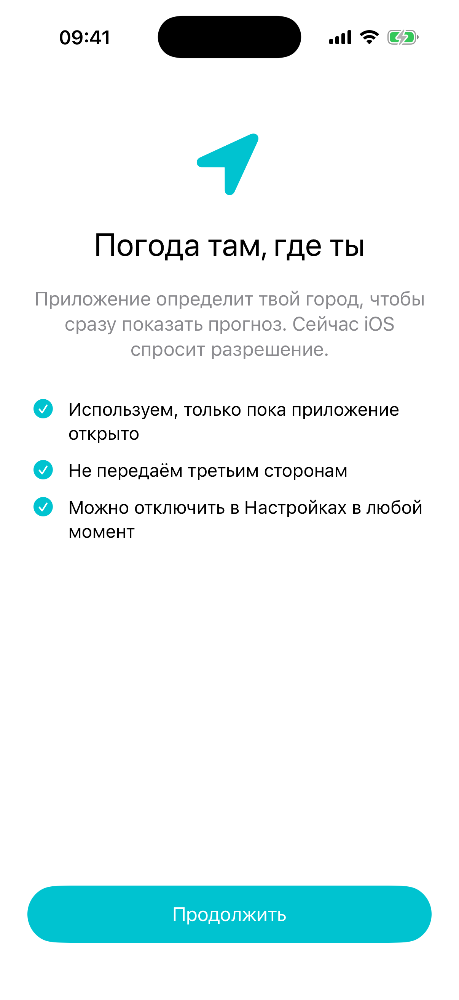

# Глава 7. Permission primer — объяснение перед системным диалогом

{width=45%}

Часть данных и устройств на iPhone защищена **разрешениями**
(permissions): геолокация, фото, камера, микрофон, контакты,
уведомления. Приложение не может просто взять их — оно должно
спросить. Когда приложение впервые вызывает, например,
`CLLocationManager.requestWhenInUseAuthorization()` или
`PHPhotoLibrary.requestAuthorization(for:)`, iOS **сама** показывает
системный alert: «Разрешить приложению доступ к геолокации?» с
кнопками. Заголовок и кнопки этого окна ты не контролируешь. Твоя в
нём только одна строка пояснения — о ней в разделе 7.7.

Проблема в том, что человек видит этот alert **без контекста**. Он
только открыл приложение, а его уже о чём-то спрашивают. Многие по
привычке жмут «Не разрешать» — на всякий случай.

А после отказа второй раз системный alert **не появится**: iOS
запоминает ответ, и вернуть доступ человек может только сам, в
Настройках. Для приложения это почти финал.

Решение — показать **свой** экран **до** системного alert'а: иконка,
объяснение «зачем», пара пунктов про приватность. Такой экран называют
**permission primer** (буквально «подготовка к разрешению»; по-русски
— «экран-пояснение перед запросом»). В гайдлайнах Apple он называется
pre-alert screen.

Насколько primer поднимает долю согласий, точно сказать нельзя:
публичные цифры разных команд сильно расходятся и зависят от
приложения. Но и логика, и опыт сходятся в одном: человек, который
понимает, зачем нужен доступ, соглашается охотнее. В этой главе
делаем такой экран — и делаем его так, чтобы его пропустила проверка
App Store. Это важнее, чем кажется: у Apple есть конкретные правила
для таких экранов, и многие приложения их нарушают.

Полный код главы — в разделе 7.10.

## 7.1 Что показываем

Структура primer'а одинакова для всех типов разрешений:

```
   ┌─────────────────────────┐
   │       [иконка]          │
   │                         │
   │      Заголовок          │
   │                         │
   │   Тело — одно-два       │
   │   предложения           │
   │                         │
   │   ✓ Пункт 1             │
   │   ✓ Пункт 2             │
   │   ✓ Пункт 3             │
   │                         │
   │   [   Продолжить   ]    │
   └─────────────────────────┘
```

Иконка — по теме (геолокация, фото, камера). Заголовок — какую
**пользу** человек получит: не «Нужна геолокация», а «Погода там, где
ты». Тело — одно-два предложения, и в конце — честное
предупреждение «Сейчас iOS спросит разрешение». Пункты — почему это
безопасно: «используем, только пока приложение открыто», «не передаём
третьим сторонам», «можно отключить в Настройках».

Кнопка **одна**. Почему не две, как часто делают, — в разделе 7.3.

Меняется только **текст**. Раскладка одна на все разрешения.

## 7.2 Текст под каждый тип — `switch` по enum

В главе 2 мы объявили `PermissionKind` — какие разрешения бывают у
наших mini-app. Напомним объявление: четыре случая, и у каждого свой
способ запроса, все четыре разберём в этой главе:

```swift
enum PermissionKind: Sendable {
    case location, photoLibrary, camera, notifications
}
```

`PermissionPrimerViewController` хранит текст экрана в вычисляемом
свойстве:

```swift
private var content: (icon: String, title: String, body: String, bullets: [String]) {
    switch kind {
    case .location:
        return (
            icon: "location.fill",
            title: "Погода там, где ты",
            body: "Приложение определит твой город, чтобы сразу показать прогноз. Сейчас iOS спросит разрешение.",
            bullets: [
                "Используем, только пока приложение открыто",
                "Не передаём третьим сторонам",
                "Можно отключить в Настройках в любой момент",
            ]
        )
    case .photoLibrary:
        return (...)
    case .camera:
        return (...)
    case .notifications:
        return (...)
    }
}
```

(Здесь и ниже многоточия — сокращение для книги, полный текст всех
четырёх вариантов — в 7.10.)

Один `switch` по `PermissionKind`, каждый случай возвращает кортеж из
иконки, заголовка, тела и списка пунктов. Кортеж с именованными
элементами — как маленькая безымянная структура: `content.title`,
`content.bullets`. Интерфейс ничего не знает о конкретном разрешении —
он просто читает эти четыре поля.

Добавишь в `PermissionKind` новый случай, например `.microphone`, —
компилятор сразу укажет на этот `switch`: он перестанет быть полным.
Это удобная страховка, текст для нового разрешения не забудется.

> **Почему не подкласс на каждый тип.** Можно было бы сделать
> `LocationPrimerViewController`, `PhotoPrimerViewController` и так
> далее — у каждого своя раскладка, своя анимация. Но раскладка у нас
> одна, и заводить четыре класса ради разного текста — лишняя
> сложность. Один контроллер и вычисляемое свойство проще читать и
> поддерживать. Понадобится особый экран для одного разрешения —
> вынесешь его в отдельный класс, это десять минут работы.

## 7.3 Кнопка — одна, и она ведёт к системному запросу

Первая версия нашего экрана выглядела так:

```
   ┌─────────────────────────┐
   │       [иконка]          │
   │   Нужна геолокация      │
   │   ...                   │
   │   [    Разрешить    ]   │
   │       Не сейчас         │
   └─────────────────────────┘
```

Две кнопки: «Разрешить» и «Не сейчас». Так делали многие приложения,
и так делать **нельзя**. В Human
Interface Guidelines (HIG, раздел Privacy → «Pre-alert screens,
windows, or views») у Apple прямые правила для экранов перед
системным запросом:

- **Только одна кнопка, и понятно, что она открывает системный
  alert.** Вторая кнопка, которая к alert'у не ведёт, уводит человека
  от решения — Apple считает это манипуляцией.
- **Не называть кнопку «Разрешить»** или похоже. На экране-пояснении
  человек ничего не разрешает — разрешают только в системном окне. Если
  кнопка primer'а по смыслу и виду похожа на «Разрешить» в alert'е,
  человек по инерции нажмёт «Разрешить» и там. Apple предлагает
  «Продолжить» или «Далее».
- **Никаких дополнительных действий**, кроме случаев, когда этого
  требует закон (например, юридическое согласие). В частности — никакого
  способа закрыть экран, не увидев системный alert: ни «Отмена», ни
  «Не сейчас», ни крестика.

Кроме того, правило App Review (проверки, которую сотрудники Apple
проводят перед публикацией каждой версии в App Store; правила собраны
в App Review Guidelines) **5.1.1(iv)** запрещает «манипулировать,
обманывать или принуждать» человека к согласию, а HIG предупреждает,
что экраны, которые так делают, отклоняются при проверке. Поэтому
наша кнопка — «Продолжить», и она одна:

```swift
@objc private func continueTapped() {
    guard !requestInFlight else { return }
    requestInFlight = true
    continueButton.isEnabled = false
    let kind = self.kind
    Task { [weak self] in
        let outcome = await PermissionService.shared.request(kind)
        guard let self else { return }
        self.requestInFlight = false
        self.onResult(outcome)
    }
}
```

Что здесь происходит:

1. `requestInFlight` — защита от двойного тапа. Если человек быстро
   нажмёт дважды, второй тап ничего не сделает, пока первый запрос не
   закончится. Кнопка ещё и выключается (`isEnabled = false`) — теперь
   второй тап физически некуда сделать.
2. `let kind = self.kind` — копируем тип разрешения до запуска задачи,
   чтобы задаче не понадобилась сильная ссылка на экран.
3. `PermissionService.shared.request(kind)` — наша обёртка над
   системными API (разберём в 7.5). Внутри неё iOS покажет системный
   alert, а `await` дождётся ответа человека.
4. `guard let self` после `await` — как в главе 8: пока ждём, экран
   держится слабой ссылкой.
5. `onResult(outcome)` — **callback** (обратный вызов): замыкание,
   которое передал координатор, чтобы узнать результат.

`PermissionService.request` возвращает наш enum `Outcome`:
`granted` (разрешил), `denied` (отказал), `limited` (для фото —
человек дал доступ только к **некоторым** снимкам, а не ко всей
библиотеке) и `notSupported` (на устройстве нет нужного железа —
например, камеры в симуляторе).

Координатор **не** смотрит на конкретный ответ (см. главу 4): он идёт
дальше и при `granted`, и при `denied`. Как жить без разрешения,
решает само mini-app — и это тоже правило. Пункт **5.1.1(iv)**
говорит: где возможно, дай альтернативу тем, кто отказался. Например,
если человек не дал геолокацию, Погода должна позволить ввести город
вручную, а не показывать пустой экран.

> **А если человек не хочет?** Он откажет в системном alert'е —
> там есть «Не разрешать». Primer не лишает его выбора, он лишь
> объясняет, о чём сейчас спросят. А «отложить решение на потом»
> правильнее делать иначе: просить разрешение не на старте, а в тот
> момент, когда человек сам открыл функцию, которой оно нужно. Об
> этом — в 7.6.

## 7.4 Вёрстка

Разметка экрана — вертикальный стек в верхней части и кнопка внизу:

```swift
let stack = UIStackView(arrangedSubviews: [icon, titleLabel, bodyLabel, bullets])
stack.axis = .vertical
stack.alignment = .center
stack.spacing = 20
stack.setCustomSpacing(32, after: bodyLabel)
```

`spacing = 20` — 20 точек между элементами, а после текста — 32
(`setCustomSpacing`), чтобы список пунктов визуально отделился от
объяснения.

Каждый пункт — строка из галочки и текста:

```swift
private func makeBullet(_ text: String) -> UIView {
    let check = UIImageView(image: UIImage(systemName: "checkmark.circle.fill"))
    check.tintColor = brandColor
    check.setContentHuggingPriority(.required, for: .horizontal)
    let label = UILabel()
    label.text = text
    label.font = .preferredFont(forTextStyle: .callout)
    label.adjustsFontForContentSizeCategory = true
    label.numberOfLines = 0
    let row = UIStackView(arrangedSubviews: [check, label])
    row.spacing = 12
    row.alignment = .firstBaseline
    return row
}
```

Две строки здесь не очевидны.

`setContentHuggingPriority(.required, for: .horizontal)` — **hugging**
(«обнимание») говорит Auto Layout, насколько view сопротивляется
растягиванию шире своего естественного размера. Естественный размер
(intrinsic content size) у картинки — размер самой иконки, у надписи —
размер текста. В горизонтальном стеке лишнее место достаётся тому, у
кого hugging ниже. Ставим иконке максимальный (`.required`) — она
остаётся размером с иконку, а всю ширину забирает текст.

`alignment = .firstBaseline` — выравнивание по базовой линии первой
строки: галочка стоит ровно на уровне первой строки текста, даже если
текст переносится на две строки.

Шрифты — через `preferredFont(forTextStyle:)` и
`adjustsFontForContentSizeCategory = true`: это Dynamic Type (см. главу
6), размер текста следует системной настройке.

## 7.5 `PermissionService` — обёртка над системными API

Системные API разрешений писались в разные годы и выглядят по-разному:

- **CoreLocation** — через делегата: ответ приходит вызовом метода
  `locationManagerDidChangeAuthorization(_:)`. Готовой async-версии
  запроса нет.
- **Photos** и **AVCaptureDevice** (камера) — исторически через
  completion handler (замыкание, которое вызывается по завершении).
  Swift автоматически создаёт для таких Objective-C-методов
  async-версии, и мы пользуемся ими.
- **UserNotifications** — тоже async-версия того же происхождения.

Чтобы интерфейс не возился с этим зоопарком, делаем один сервис с
одним методом:

```swift
final class PermissionService: NSObject {

    static let shared = PermissionService()
    private override init() {}

    enum Outcome: Sendable, Equatable {
        case granted
        case limited
        case denied
        case notSupported
    }

    func request(_ kind: PermissionKind) async -> Outcome {
        switch kind {
        case .location: return await requestLocation()
        case .photoLibrary: return await requestPhotos()
        case .camera: return await requestCamera()
        case .notifications: return await requestNotifications()
        }
    }
}
```

Интерфейс вызывает `await PermissionService.shared.request(.camera)` и
получает `Outcome`. Что внутри — забота сервиса. `NSObject` в предках
нужен, потому что сервис станет делегатом `CLLocationManager`, а
делегаты Objective-C-классов должны быть потомками `NSObject`.
`private override init()` — чтобы никто не создал второй экземпляр
мимо `shared`.

### CoreLocation — делегат через `withCheckedContinuation`

CoreLocation — самая хитрая обёртка. Метод запроса ничего не
возвращает, ответ приходит в делегат:

```swift
private var locationManager: CLLocationManager?
private var locationContinuation: CheckedContinuation<Outcome, Never>?

private func requestLocation() async -> Outcome {
    let manager = CLLocationManager()
    switch manager.authorizationStatus {
    case .authorizedAlways, .authorizedWhenInUse: return .granted
    case .denied, .restricted: return .denied
    default: break
    }
    guard locationContinuation == nil else { return .denied }
    locationManager = manager
    return await withCheckedContinuation { cont in
        locationContinuation = cont
        manager.delegate = self
        manager.requestWhenInUseAuthorization()
    }
}

private func resolveLocation(_ outcome: Outcome) {
    guard let cont = locationContinuation else { return }
    locationContinuation = nil
    locationManager?.delegate = nil
    locationManager = nil
    cont.resume(returning: outcome)
}
```

По шагам:

1. Создаём `CLLocationManager` и **сначала** смотрим текущий статус
   (`authorizationStatus`, iOS 14+). Если ответ уже есть — возвращаем
   его сразу. Вызов `requestWhenInUseAuthorization()` при уже
   известном статусе ничего не показывает и делегата не зовёт — мы бы
   ждали вечно.
2. `guard locationContinuation == nil` — если запрос уже идёт, второй
   не начинаем. Защита на уровне сервиса, в дополнение к флагу экрана.
3. Менеджер сохраняем в свойстве. Если бы он был только локальной
   переменной, после выхода из функции его освободил бы ARC
   (автоматический подсчёт ссылок), и делегат никогда бы не сработал.
4. `withCheckedContinuation` — мост между «ответ придёт в делегат» и
   `async`-функцией. Он приостанавливает функцию и даёт объект
   **continuation** (`cont`) — «пульт», которым её потом можно
   продолжить. Пульт сохраняем в свойство.
5. `requestWhenInUseAuthorization()` — система показывает alert.
6. Когда человек ответил, iOS вызывает делегат, делегат зовёт
   `resolveLocation`, и `cont.resume(returning:)` продолжает функцию с
   нашим результатом.

Делегат:

```swift
extension PermissionService: CLLocationManagerDelegate {
    nonisolated func locationManagerDidChangeAuthorization(_ manager: CLLocationManager) {
        let status = manager.authorizationStatus
        MainActor.assumeIsolated {
            switch status {
            case .notDetermined:
                break
            case .authorizedAlways, .authorizedWhenInUse:
                resolveLocation(.granted)
            case .denied, .restricted:
                resolveLocation(.denied)
            @unknown default:
                resolveLocation(.denied)
            }
        }
    }
}
```

- `nonisolated` — протокол `CLLocationManagerDelegate` объявлен в
  Objective-C и ничего не знает о главном акторе. Метод, который его
  реализует, должен быть неизолированным, иначе Swift 6 не примет
  соответствие протоколу.
- `MainActor.assumeIsolated { ... }` — CoreLocation вызывает методы
  делегата в том потоке, где был создан менеджер. Мы создали его на
  главном потоке, значит, и вызов будет на главном. `assumeIsolated`
  сообщает это компилятору и разрешает трогать `resolveLocation` —
  метод главного актора. Если бы обещание оказалось ложным,
  приложение остановилось бы с понятной ошибкой. Функция доступна с
  iOS 13.
- `case .notDetermined: break` — важная строка. С iOS 14 этот метод
  вызывается ещё и **сразу после создания менеджера** (и назначения
  делегата), со статусом «пока не определено». Если принять этот вызов
  за ответ, запрос закончится раньше, чем человек что-то нажмёт.
  Поэтому «не определено» пропускаем и ждём настоящего ответа.
- `@unknown default` — на случай, если в будущих iOS появятся новые
  статусы.

> **Continuation — одноразовая.** Если вызвать `resume` у одной и той
> же continuation **дважды**, приложение упадёт. Если **ни разу** —
> функция будет ждать вечно (а `withCheckedContinuation` напишет об
> утечке в консоль). Поэтому `resolveLocation` первым делом забирает
> continuation и обнуляет свойство: второй вызов найдёт `nil` и
> ничего не сделает.

### Фото, камера и уведомления — готовые async-версии

Здесь continuation не нужна: Swift сам превращает Objective-C-методы с
completion handler'ом в `async`-функции.

```swift
private func requestPhotos() async -> Outcome {
    let status = await PHPhotoLibrary.requestAuthorization(for: .readWrite)
    switch status {
    case .authorized: return .granted
    case .limited: return .limited
    case .denied, .restricted, .notDetermined: return .denied
    @unknown default: return .denied
    }
}

private func requestCamera() async -> Outcome {
    guard AVCaptureDevice.default(for: .video) != nil else { return .notSupported }
    let granted = await AVCaptureDevice.requestAccess(for: .video)
    return granted ? .granted : .denied
}

private func requestNotifications() async -> Outcome {
    UserDefaults.standard.set(true, forKey: Self.notificationsAskedKey)
    do {
        let granted = try await UNUserNotificationCenter.current()
            .requestAuthorization(options: [.alert, .sound, .badge])
        return granted ? .granted : .denied
    } catch {
        return .denied
    }
}
```

Разбор:

- `PHPhotoLibrary.requestAuthorization(for: .readWrite)` (iOS 14+) —
  полный доступ на чтение и запись. Бывает ещё `.addOnly` — только
  добавлять снимки, не видя библиотеку. Статус `.restricted` значит,
  что доступ запрещён не человеком, а ограничениями устройства
  (например, родительским контролем).
- `AVCaptureDevice.default(for: .video) == nil` — у устройства нет
  камеры. В симуляторе камеры нет, отсюда наш случай `.notSupported`.
- Уведомления: `options` — что именно просим: баннеры (`.alert`),
  звук, значок-счётчик на иконке (`.badge`). Метод может бросить
  ошибку, поэтому `try` и `do/catch`. Про флаг
  `notificationsAskedKey` — в 7.6.

> **Почему не continuation и здесь.** Можно написать и по-старому:
> `withCheckedContinuation { cont in PHPhotoLibrary.requestAuthorization(for: .readWrite) { status in cont.resume(returning: ...) } }`.
> Это работает, но длиннее, и в замыкании легко забыть, что Photos
> вызывает его на своей очереди, а не на главном потоке (так сказано в
> документации к этому методу). Тронешь там интерфейс — получишь
> ошибку. Async-версия возвращает результат прямо в код главного
> актора.

## 7.6 `shouldShow` — когда primer не нужен

Primer показываем, только если человек ещё **ни разу** не отвечал на
системный запрос:

```swift
static func shouldShow(for manifest: AppManifest) -> Bool {
    guard let kind = manifest.requiresPermission else { return false }
    return PermissionService.shared.isNotDetermined(kind)
}
```

А в сервисе:

```swift
func isNotDetermined(_ kind: PermissionKind) -> Bool {
    switch kind {
    case .location:
        return CLLocationManager().authorizationStatus == .notDetermined
    case .photoLibrary:
        return PHPhotoLibrary.authorizationStatus(for: .readWrite) == .notDetermined
    case .camera:
        return AVCaptureDevice.authorizationStatus(for: .video) == .notDetermined
    case .notifications:
        return !UserDefaults.standard.bool(forKey: Self.notificationsAskedKey)
    }
}

private static let notificationsAskedKey = "permission.asked.notifications"
```

Три случая:

- **Ещё не спрашивали** (`.notDetermined`) → показываем primer.
- **Уже разрешено** (в том числе частично, `.limited`) → primer не
  нужен, просить повторно бессмысленно.
- **Уже отказано** → primer тоже не нужен. Системный alert больше не
  появится, и кнопка «Продолжить» ни к чему не приведёт. Правильнее,
  чтобы mini-app в нужный момент показало своё сообщение с кнопкой
  «Открыть Настройки» (`UIApplication.openSettingsURLString` открывает
  страницу настроек твоего приложения) или предложило обходной путь.

С уведомлениями особый случай. Их статус iOS отдаёт только асинхронно
(`notificationSettings()`), а `shouldShow` — синхронный: координатор
спрашивает и сразу получает ответ. Поэтому для уведомлений запоминаем
сами: в `requestNotifications` ставим флаг «уже спрашивали». Системный
запрос уведомлений тоже показывается только один раз, так что флаг
отражает правду. При удалении приложения `UserDefaults` стирается
вместе с разрешениями — флаг не соврёт и после переустановки.

`shouldShow` сильно упрощает координатор: он ничего не знает о
разрешениях, просто зовёт
`PermissionPrimerViewController.shouldShow(for: manifest)`.

> **Когда спрашивать.** HIG советует не просить разрешения при
> запуске, если приложение может работать без них, а спрашивать в
> момент, когда человек сам открыл функцию. Исключение — когда
> разрешение нужно для самой сути приложения, и это понятно без слов: навигатору
> без геолокации делать нечего. Наш гейт спрашивает на входе в mini-app,
> поэтому включай его только для таких случаев (Погода без города
> бесполезна). Для «вставить фото в заметку» лучше спросить в момент
> тапа по кнопке «Добавить фото» — а ещё лучше, не спрашивать вовсе,
> см. 7.8.

**Упражнение 7.1.** Открой mini-app «Погода» (`requiresPermission =
.location`). Увидишь primer. Нажми «Продолжить» — появится системный
alert геолокации. Выбери «Разрешить при использовании». Зайди в Погоду
снова — primer не появится. Теперь сбрось разрешение и проверь, что
primer вернулся. Как сбросить разрешение двумя способами — через
Настройки и через терминал? Ответ — в конце главы.

## 7.7 Info.plist: строки-пояснения

**Info.plist** — файл настроек приложения, который лежит внутри его
**bundle** (пакета приложения: папки `.app` с кодом, картинками и
настройками). В нём хранятся имя, версия и, среди прочего, **строки-
пояснения** для разрешений (purpose string, usage description). В
Xcode 26 эти ключи редактируются на вкладке **Info** настроек
таргета; в новых проектах отдельного файла `Info.plist` может и не
быть — Xcode собирает его из настроек сборки.

```xml
<key>NSLocationWhenInUseUsageDescription</key>
<string>Показываем погоду в твоём городе.</string>

<key>NSPhotoLibraryUsageDescription</key>
<string>Вставляем выбранные тобой фото в заметки.</string>

<key>NSCameraUsageDescription</key>
<string>Делаем фото для аватара.</string>
```

Имя ключа говорит, к какому разрешению он относится: геолокация «при
использовании», фотобиблиотека, камера. Для уведомлений ключ **не
нужен** — их alert обходится без пояснения.

Эту строку iOS показывает в системном alert'е после названия
приложения, над кнопками. Это твоя последняя возможность объяснить
«зачем» прямо в момент выбора. HIG советует: короткое законченное
предложение, конкретно, без пассивного залога, с точкой в конце.
Правило App Review **5.1.1(ii)** требует, чтобы строка ясно и полностью
описывала, как используются данные. Размытое «Приложению нужен доступ
к фото» — частая причина отказа.

Что будет, если строки нет:

- **Фото, камера, микрофон, контакты и другие данные под защитой
  TCC** (подсистемы iOS, которая следит за доступом к личным данным) —
  приложение **падает** при первом запросе. В консоли Xcode
  появляется сообщение вида: «This app has crashed because it
  attempted to access privacy-sensitive data without a usage
  description. The app's Info.plist must contain an
  NSPhotoLibraryUsageDescription key…».
- **Геолокация** — запрос молча игнорируется: alert не появляется,
  статус остаётся «не определён», а в консоль пишется предупреждение
  «This app has attempted to access privacy-sensitive data without a
  usage description…». Это коварнее падения — легко не заметить. А наш
  `requestLocation()` в такой ситуации будет ждать ответа делегата
  вечно, и primer останется на экране с выключенной кнопкой.

Оба поведения мы проверили запуском в симуляторе iOS 26.5: без
`NSPhotoLibraryUsageDescription` приложение завершилось с сообщением
выше, без `NSLocationWhenInUseUsageDescription` — только напечатало
предупреждение.

Как выглядит alert с нашей строкой (iOS 26, запрос полного доступа к
фото): заголовок «Приложение „…“ запрашивает полный доступ к
медиатеке.», под ним — наша строка из Info.plist, превью нескольких
снимков и три кнопки: «Ограничить доступ…», «Разрешить полный доступ»,
«Не разрешать».

При загрузке сборки в App Store Connect (веб-кабинет разработчика,
через который приложение отправляют на проверку и публикуют)
автоматическая проверка тоже
ругается на отсутствующие строки для API, которые использует код, и
сборка не проходит.

> **Primer и строка-пояснение — об одном и том же.** Текст на нашем
> экране и в `NSPhotoLibraryUsageDescription` могут отличаться
> словами, но не смыслом. Если на primer'е написано «вставлять фото в
> заметки», а в Info.plist — «сменить аватар», это выглядит странно и
> для человека, и для проверяющего App Review.

## 7.8 Бывает и без разрешения

Лучшее разрешение — то, которое не нужно спрашивать. Правило
**5.1.1(iii)** прямо советует по возможности брать «внепроцессный»
выбор или стандартные окна вместо полного доступа к фото или
контактам.

- **`PHPickerViewController`** (iOS 14+) — системное окно выбора фото.
  Оно работает в отдельном процессе iOS: приложение получает только те
  снимки, которые человек выбрал, и **никакого разрешения не
  требуется**. Для «вставить фото в заметку» или «выбрать аватар» это
  лучший выбор: ни primer'а, ни alert'а, ни строки в Info.plist.
- **`CLLocationButton`** из CoreLocationUI (iOS 15+) — системная
  кнопка «поделиться геолокацией». Нажатие даёт разовый доступ к
  местоположению без alert'а. Подходит для «найти магазины рядом».
- **Точная и примерная геолокация.** С iOS 14 человек может дать
  доступ только к **примерному** местоположению (с точностью до
  нескольких километров). Для погоды этого хватает; проверить, что
  выбрал человек, можно через `manager.accuracyAuthorization`.

## 7.9 Бытовая аналогия

Системный alert — **пограничник** с двумя штампами: «разрешить» и
«не разрешать». Ответил невнятно — получил «не разрешать», и
пересдать нельзя.

Permission primer — **стюардесса перед посадкой**, которая раздаёт
миграционные карточки и объясняет: «на границе спросят цель поездки,
вот что нужно показать». Подготовленный человек проходит границу
спокойнее. Но стюардесса не ставит штамп сама и не уводит тебя в
обход пограничника — она просто объясняет и провожает к окошку. Это и
есть наша единственная кнопка «Продолжить».

## 7.10 Экран целиком

`PermissionService` целиком — это куски из 7.5 и 7.6, собранные в один
класс (ниже он приведён полностью). Затем — сам экран.

```swift
import UIKit
import CoreLocation
import Photos
import AVFoundation
import UserNotifications

final class PermissionService: NSObject {

    static let shared = PermissionService()
    private override init() {}

    enum Outcome: Sendable, Equatable {
        case granted
        case limited
        case denied
        case notSupported
    }

    func isNotDetermined(_ kind: PermissionKind) -> Bool {
        switch kind {
        case .location:
            return CLLocationManager().authorizationStatus == .notDetermined
        case .photoLibrary:
            return PHPhotoLibrary.authorizationStatus(for: .readWrite) == .notDetermined
        case .camera:
            return AVCaptureDevice.authorizationStatus(for: .video) == .notDetermined
        case .notifications:
            return !UserDefaults.standard.bool(forKey: Self.notificationsAskedKey)
        }
    }

    private static let notificationsAskedKey = "permission.asked.notifications"

    func request(_ kind: PermissionKind) async -> Outcome {
        switch kind {
        case .location: return await requestLocation()
        case .photoLibrary: return await requestPhotos()
        case .camera: return await requestCamera()
        case .notifications: return await requestNotifications()
        }
    }

    private var locationManager: CLLocationManager?
    private var locationContinuation: CheckedContinuation<Outcome, Never>?

    private func requestLocation() async -> Outcome {
        let manager = CLLocationManager()
        switch manager.authorizationStatus {
        case .authorizedAlways, .authorizedWhenInUse: return .granted
        case .denied, .restricted: return .denied
        default: break
        }
        guard locationContinuation == nil else { return .denied }
        locationManager = manager
        return await withCheckedContinuation { cont in
            locationContinuation = cont
            manager.delegate = self
            manager.requestWhenInUseAuthorization()
        }
    }

    private func resolveLocation(_ outcome: Outcome) {
        guard let cont = locationContinuation else { return }
        locationContinuation = nil
        locationManager?.delegate = nil
        locationManager = nil
        cont.resume(returning: outcome)
    }

    private func requestPhotos() async -> Outcome {
        let status = await PHPhotoLibrary.requestAuthorization(for: .readWrite)
        switch status {
        case .authorized: return .granted
        case .limited: return .limited
        case .denied, .restricted, .notDetermined: return .denied
        @unknown default: return .denied
        }
    }

    private func requestCamera() async -> Outcome {
        guard AVCaptureDevice.default(for: .video) != nil else { return .notSupported }
        let granted = await AVCaptureDevice.requestAccess(for: .video)
        return granted ? .granted : .denied
    }

    private func requestNotifications() async -> Outcome {
        UserDefaults.standard.set(true, forKey: Self.notificationsAskedKey)
        do {
            let granted = try await UNUserNotificationCenter.current()
                .requestAuthorization(options: [.alert, .sound, .badge])
            return granted ? .granted : .denied
        } catch {
            return .denied
        }
    }
}

extension PermissionService: CLLocationManagerDelegate {
    nonisolated func locationManagerDidChangeAuthorization(_ manager: CLLocationManager) {
        let status = manager.authorizationStatus
        MainActor.assumeIsolated {
            switch status {
            case .notDetermined:
                break
            case .authorizedAlways, .authorizedWhenInUse:
                resolveLocation(.granted)
            case .denied, .restricted:
                resolveLocation(.denied)
            @unknown default:
                resolveLocation(.denied)
            }
        }
    }
}
```

```swift
import UIKit

final class PermissionPrimerViewController: UIViewController {

    static func shouldShow(for manifest: AppManifest) -> Bool {
        guard let kind = manifest.requiresPermission else { return false }
        return PermissionService.shared.isNotDetermined(kind)
    }

    private let kind: PermissionKind
    private let brandColor: UIColor
    private let onResult: (PermissionService.Outcome) -> Void
    private var requestInFlight = false
    private let continueButton = UIButton(configuration: .filled())

    init(kind: PermissionKind,
         brandColor: UIColor,
         onResult: @escaping (PermissionService.Outcome) -> Void) {
        self.kind = kind
        self.brandColor = brandColor
        self.onResult = onResult
        super.init(nibName: nil, bundle: nil)
    }

    required init?(coder: NSCoder) { fatalError("init(coder:) не используется") }

    private var content: (icon: String, title: String, body: String, bullets: [String]) {
        switch kind {
        case .location:
            return (
                icon: "location.fill",
                title: "Погода там, где ты",
                body: "Приложение определит твой город, чтобы сразу показать прогноз. Сейчас iOS спросит разрешение.",
                bullets: [
                    "Используем, только пока приложение открыто",
                    "Не передаём третьим сторонам",
                    "Можно отключить в Настройках в любой момент",
                ]
            )
        case .photoLibrary:
            return (
                icon: "photo.on.rectangle",
                title: "Фото для заметок",
                body: "Чтобы вставлять снимки в заметки, нужен доступ к фото. Сейчас iOS спросит разрешение.",
                bullets: [
                    "Можно открыть доступ только к выбранным снимкам",
                    "Ничего не загружаем без твоего действия",
                    "Можно отключить в Настройках в любой момент",
                ]
            )
        case .camera:
            return (
                icon: "camera.fill",
                title: "Снимок для аватара",
                body: "Камера нужна, чтобы сделать фото профиля. Сейчас iOS спросит разрешение.",
                bullets: [
                    "Камера включается только по твоей кнопке",
                    "Снимок остаётся на устройстве",
                    "Можно отключить в Настройках в любой момент",
                ]
            )
        case .notifications:
            return (
                icon: "bell.badge.fill",
                title: "Напоминания о задачах",
                body: "Пришлём уведомление, когда подойдёт срок задачи. Сейчас iOS спросит разрешение.",
                bullets: [
                    "Только о твоих задачах, без рекламы",
                    "Не чаще, чем ты сам запланировал",
                    "Можно отключить в Настройках в любой момент",
                ]
            )
        }
    }

    override func viewDidLoad() {
        super.viewDidLoad()
        view.backgroundColor = .systemBackground
        let c = content

        let icon = UIImageView(image: UIImage(systemName: c.icon))
        icon.tintColor = brandColor
        icon.preferredSymbolConfiguration = UIImage.SymbolConfiguration(pointSize: 56, weight: .semibold)

        let titleLabel = UILabel()
        titleLabel.text = c.title
        titleLabel.font = .preferredFont(forTextStyle: .title1)
        titleLabel.adjustsFontForContentSizeCategory = true
        titleLabel.textAlignment = .center
        titleLabel.numberOfLines = 0

        let bodyLabel = UILabel()
        bodyLabel.text = c.body
        bodyLabel.font = .preferredFont(forTextStyle: .body)
        bodyLabel.adjustsFontForContentSizeCategory = true
        bodyLabel.textColor = .secondaryLabel
        bodyLabel.textAlignment = .center
        bodyLabel.numberOfLines = 0

        let bullets = UIStackView(arrangedSubviews: c.bullets.map(makeBullet))
        bullets.axis = .vertical
        bullets.spacing = 12

        let stack = UIStackView(arrangedSubviews: [icon, titleLabel, bodyLabel, bullets])
        stack.axis = .vertical
        stack.alignment = .center
        stack.spacing = 20
        stack.setCustomSpacing(32, after: bodyLabel)

        var config = UIButton.Configuration.filled()
        config.title = "Продолжить"
        config.baseBackgroundColor = brandColor
        config.cornerStyle = .capsule
        continueButton.configuration = config
        continueButton.addTarget(self, action: #selector(continueTapped), for: .touchUpInside)

        [stack, continueButton].forEach {
            $0.translatesAutoresizingMaskIntoConstraints = false
            view.addSubview($0)
        }
        let margins = view.layoutMarginsGuide
        NSLayoutConstraint.activate([
            stack.topAnchor.constraint(equalTo: view.safeAreaLayoutGuide.topAnchor, constant: 48),
            stack.leadingAnchor.constraint(equalTo: margins.leadingAnchor, constant: 8),
            stack.trailingAnchor.constraint(equalTo: margins.trailingAnchor, constant: -8),

            continueButton.leadingAnchor.constraint(equalTo: margins.leadingAnchor, constant: 8),
            continueButton.trailingAnchor.constraint(equalTo: margins.trailingAnchor, constant: -8),
            continueButton.bottomAnchor.constraint(equalTo: view.safeAreaLayoutGuide.bottomAnchor, constant: -16),
            continueButton.heightAnchor.constraint(greaterThanOrEqualToConstant: 50),
        ])
    }

    private func makeBullet(_ text: String) -> UIView {
        let check = UIImageView(image: UIImage(systemName: "checkmark.circle.fill"))
        check.tintColor = brandColor
        check.setContentHuggingPriority(.required, for: .horizontal)
        let label = UILabel()
        label.text = text
        label.font = .preferredFont(forTextStyle: .callout)
        label.adjustsFontForContentSizeCategory = true
        label.numberOfLines = 0
        let row = UIStackView(arrangedSubviews: [check, label])
        row.spacing = 12
        row.alignment = .firstBaseline
        return row
    }

    @objc private func continueTapped() {
        guard !requestInFlight else { return }
        requestInFlight = true
        continueButton.isEnabled = false
        let kind = self.kind
        Task { [weak self] in
            let outcome = await PermissionService.shared.request(kind)
            guard let self else { return }
            self.requestInFlight = false
            self.onResult(outcome)
        }
    }
}
```

## 7.11 Краевые случаи

**Симулятор и устройство.** В симуляторе часть разрешений ведёт себя
не так, как на iPhone. Камеры нет — отсюда `.notSupported`.
Разрешение на уведомления запрашивается как обычно, а вот
push-уведомления с сервера доходят до симулятора только в
ограниченном виде; проверять их лучше на устройстве (глава 41).

**«Разрешить один раз».** В alert'е геолокации есть вариант
«Разрешить один раз». Он даёт доступ только до конца текущего
использования приложения; потом статус снова становится «не
определён», и при новом запросе alert появится опять. Для нашего
гейта это значит: primer покажется снова. Это честное поведение —
человек сам выбрал «один раз».

**Фоновая геолокация.** Доступ «Всегда» (`authorizedAlways`) Apple
выдаёт неохотно: нужен отдельный ключ
`NSLocationAlwaysAndWhenInUseUsageDescription`, а система спустя время
сама переспрашивает человека, показывая, как часто приложение брало
геолокацию в фоне. Мы просим только «при использовании» — этого
хватает большинству приложений.

**Частичный доступ к фото.** С iOS 14 человек может выбрать
«Ограниченный доступ» и отметить несколько снимков. Остальная
библиотека приложению не видна. Это полноценный сценарий, к которому
нужно готовиться, поэтому в `Outcome` есть отдельный `.limited`.
(Снова: если полная библиотека не нужна, `PHPickerViewController` из
7.8 снимает вопрос целиком.)

**Отслеживание (App Tracking Transparency).** Если приложение
отслеживает человека между приложениями и сайтами других компаний
(обычно для рекламы), оно обязано спросить через
`ATTrackingManager.requestTrackingAuthorization` и указать ключ
`NSUserTrackingUsageDescription`. Для экрана перед этим запросом HIG
строже: нельзя обещать награду за согласие, нельзя показывать
картинку системного alert'а или стрелки к кнопке «Разрешить», нельзя
делать экран, похожий на сам запрос.

**Упражнение 7.2.** Переделай первую версию экрана (схема в начале
раздела 7.3) так, чтобы она соответствовала правилам из 7.3. Что нужно
убрать и что переименовать? Ответ — в конце главы.

## Ответы к упражнениям

**7.1.** Через Настройки: «Настройки → Конфиденциальность и
безопасность → Службы геолокации → название приложения», выбрать
вариант «Спросить в следующий раз» (в свежих версиях iOS у него может
быть более длинное название) — статус вернётся в «не определён». (Вариант
«Никогда» — это отказ, после него primer не покажется: `shouldShow`
вернёт `false`.) Через терминал, для симулятора:

```
xcrun simctl privacy booted reset location <bundle id приложения>
```

`booted` — «запущенный симулятор», bundle id — идентификатор
приложения из настроек таргета. Учти, что при смене разрешения iOS
может завершить запущенное приложение — это нормально. После сброса
зайди в Погоду: primer появится снова.

**7.2.** Убрать кнопку «Не сейчас» совсем: на экране перед системным
запросом не должно быть способа уйти, не увидев alert. Кнопку
«Разрешить» переименовать в «Продолжить» (или «Далее»): на этом
экране человек ничего не разрешает. В тексте тела полезно добавить
«Сейчас iOS спросит разрешение» — так понятно, что будет дальше.
Заголовок «Нужна геолокация» лучше заменить на пользу для человека:
«Погода там, где ты». Итог — экран из 7.10.

## Что мы выучили

- Системный alert разрешения человек видит без контекста; после отказа
  второй раз он не появится — только Настройки.
- **Permission primer** — свой экран **до** системного alert'а:
  иконка, польза, пара пунктов про приватность.
- По HIG у такого экрана **одна** кнопка, «Продолжить» или «Далее», а
  не «Разрешить», и никаких «Не сейчас» или «Отмена». Нарушение —
  типичная причина отказа в App Review (5.1.1(iv)).
- Текст под тип разрешения — `switch` по `PermissionKind` с
  кортежем `(icon, title, body, bullets)`.
- `PermissionService` прячет разные системные API за одним `async`
  методом и возвращает `Outcome` (granted / limited / denied /
  notSupported).
- CoreLocation: делегат + `withCheckedContinuation`; сначала проверить
  текущий статус, в делегате пропустить `.notDetermined`, continuation
  возобновлять ровно один раз.
- Фото, камера, уведомления — готовые async-версии: короче, чем
  continuation, и результат сразу приходит на главный актор.
- В Info.plist нужна строка-пояснение для каждого разрешения. Без неё
  фото/камера падают, геолокация молча не спрашивает; уведомлениям
  строка не нужна.
- Primer показываем, только если статус «не определён».
- Лучше всего — вообще не спрашивать: `PHPickerViewController`,
  `CLLocationButton`, примерная геолокация. И всегда давать обходной
  путь тем, кто отказал.

## Apple Developer Documentation

- [Human Interface Guidelines — Privacy](https://developer.apple.com/design/human-interface-guidelines/privacy) — раздел «Pre-alert screens»: одна кнопка «Продолжить»/«Далее», без «Разрешить» и без способа уйти мимо системного alert'а; как писать строки-пояснения.
- [App Review Guidelines](https://developer.apple.com/app-store/review/guidelines/) — пункт 5.1.1: согласие и строки-пояснения (ii), минимум данных и системные окна выбора (iii), запрет манипуляций и обходной путь для отказавших (iv).
- [`CLLocationManager.requestWhenInUseAuthorization()`](https://developer.apple.com/documentation/corelocation/cllocationmanager/requestwheninuseauthorization()) — геолокация «при использовании»; ответ приходит делегату, поэтому в `PermissionService` обёрнут в `withCheckedContinuation`.
- [`PHPhotoLibrary`](https://developer.apple.com/documentation/photos/phphotolibrary) — доступ к фото: `.readWrite` / `.addOnly` и отдельное состояние `.limited`.
- [`PHPickerViewController`](https://developer.apple.com/documentation/photosui/phpickerviewcontroller) — выбор фото без разрешения на библиотеку.
- [`AVCaptureDevice`](https://developer.apple.com/documentation/avfoundation/avcapturedevice) — `requestAccess(for:)` для камеры и микрофона, у метода есть async-версия.
- [`UNUserNotificationCenter`](https://developer.apple.com/documentation/usernotifications/unusernotificationcenter) — `requestAuthorization(options:)` для уведомлений; статус — только асинхронно через `notificationSettings()`.
- [`ATTrackingManager.requestTrackingAuthorization`](https://developer.apple.com/documentation/apptrackingtransparency/attrackingmanager/requesttrackingauthorization(completionhandler:)) — App Tracking Transparency; для экрана перед этим запросом правила ещё строже.
- [Bundle resources — Information Property List](https://developer.apple.com/documentation/bundleresources/information_property_list) — справочник ключей `NS...UsageDescription`.

→ [Глава 8. Auth gate — Login / Register / Forgot](./12-auth-gate.md)
