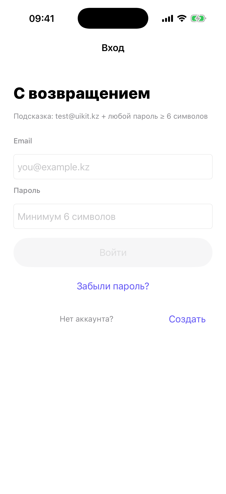

# Глава 8. Auth gate — Login / Register / Forgot

{width=45%}

Auth gate показывается, если приложение требует авторизации
(`manifest.hasAuthGate == true`), а пользователь ещё не залогинен. В
нашем playground'е такой mini-app один — Profile / Настройки.

Гейт состоит из трёх экранов:

- **Login** — корневой. Email, пароль, кнопка «Войти», ссылки на
  «Забыли пароль?» и «Создать аккаунт».
- **Register** — пушится из login. Email, пароль, подтверждение,
  чекбокс «согласен с условиями», индикатор силы пароля.
- **Forgot password** — тоже пушится. Поле email, кнопка «Отправить
  ссылку», success-метка.

В этой главе разбираем архитектуру (как мы оборачиваем в
`UINavigationController`, как делегируем события вверх), мок-сервис,
Keychain для токена. Сам код экранов login/register — это базовая
вёрстка из UIStackView'ов, разберём ключевые места.

## 8.1 Архитектура: контейнер + три экрана

Auth gate — это **отдельный** `UINavigationController` с собственным
nav-стеком. Не тот же, что вокруг лаунчера или main. Полностью
изолированный.

```swift
@MainActor
final class AuthGateContainerViewController: UINavigationController {

    private let brandColor: UIColor
    private let onAuthSuccess: () -> Void

    init(brandColor: UIColor, onAuthSuccess: @escaping () -> Void) {
        self.brandColor = brandColor
        self.onAuthSuccess = onAuthSuccess
        let login = LoginViewController(brandColor: brandColor)
        super.init(rootViewController: login)
        login.delegate = self
        navigationBar.tintColor = brandColor
        navigationBar.prefersLargeTitles = false
    }
}
```

Почему отдельный nav-стек, а не использовать тот, что вокруг main? В
момент показа auth gate main ещё не существует. Координатор только
**решает**, надо ли показать auth, и если да — ставит этот контейнер
root'ом окна. Main создастся позже, **после** успешной авторизации.

В стеке три экрана:

```
[NavigationController]
        │
        ├─ LoginViewController       ← rootViewController
        │       │
        │       ├─ push → RegisterViewController
        │       │
        │       └─ push → ForgotPasswordViewController
```

Login — корневой. Register и Forgot — `push`-ом, с возможностью
свайпнуть назад жестом или нажать back-button.

`prefersLargeTitles = false` — auth-экраны компактные, large titles
не нужны.

`navigationBar.tintColor = brandColor` — кнопки nav-бара цвета mini-app.
В Profile (индиго) — back-button индиго. Цвет приходит из манифеста
(см. Главу 2).

## 8.2 Делегирование событий — почему `delegate` вместо `closure`

Login VC должен сообщать контейнеру про события: «успешно вошёл»,
«хочу на register», «хочу на forgot». Два варианта:

**Closure-based:**
```swift
let login = LoginViewController(brandColor: brandColor)
login.onLoginSuccess = { [weak self] token in self?.didAuthenticate(token) }
login.onGoToRegister = { [weak self] in self?.goToRegister(from: login) }
login.onGoToForgot = { [weak self] in self?.goToForgot(from: login) }
```

**Delegate-based (UIKit-стиль):**
```swift
protocol LoginViewControllerDelegate: AnyObject {
    func login(_ vc: LoginViewController, didSucceedWith token: String)
    func loginRequestsRegister(_ vc: LoginViewController)
    func loginRequestsForgot(_ vc: LoginViewController)
}
```

И в Login:
```swift
weak var delegate: LoginViewControllerDelegate?
```

В нашем коде — второй вариант. Не потому что он «правильнее», а
потому что:

- **Три события** — closure'ы становятся громоздкими. Делегат
  собирает всё в один протокол.
- **`weak`** — у делегата надо помнить добавить `weak`. У closure
  legend держать `[weak self]`, что я часто забываю в учебных
  примерах. Делегат-протокол всегда `weak var` — компилятор не даст
  забыть благодаря `AnyObject`-constraint'у.
- **Эстетика UIKit** — Apple использует делегатов повсюду. Книга
  должна показать **обычный** UIKit-стиль, не модный SwiftUI-стиль
  с closure'ами.

> 💡 **Когда closure лучше.** Если событие одно (`onFinish`) или два
> (`onPass` / `onTooYoung` у age gate в Главе 10), closure'ы короче.
> Делегат начинает выигрывать, когда событий три и больше.

В контейнере мы реализуем оба делегата (login и register):

```swift
extension AuthGateContainerViewController: LoginViewControllerDelegate,
                                            RegisterViewControllerDelegate {
    func login(_ vc: LoginViewController, didSucceedWith token: String) {
        didAuthenticate(token: token)
    }
    func loginRequestsRegister(_ vc: LoginViewController) {
        goToRegister(from: vc)
    }
    func loginRequestsForgot(_ vc: LoginViewController) {
        goToForgot(from: vc)
    }
    func register(_ vc: RegisterViewController, didSucceedWith token: String) {
        didAuthenticate(token: token)
    }
}
```

Login и Register оба сообщают «успех» по сути одинаково — успешно
получен токен. Контейнер хранит его и зовёт `onAuthSuccess` для
координатора.

## 8.3 Keychain — где жить токену

В нашем `AuthStorage` всего три операции: save, read, clear. Базовый
Keychain без Access Group, без iCloud, без биометрии — просто
безопасное хранилище на устройстве.

```swift
@MainActor
final class AuthStorage {

    static let shared = AuthStorage()
    private init() {}

    private let service = "kz.waid.beginner-testing-app.auth"
    private let account = "token"

    var token: String? { read() }
    var isLoggedIn: Bool { token != nil }

    func save(token: String) {
        guard let data = token.data(using: .utf8) else { return }
        let baseQuery: [String: Any] = [
            kSecClass as String: kSecClassGenericPassword,
            kSecAttrService as String: service,
            kSecAttrAccount as String: account,
        ]
        SecItemDelete(baseQuery as CFDictionary)
        var addQuery = baseQuery
        addQuery[kSecValueData as String] = data
        SecItemAdd(addQuery as CFDictionary, nil)
    }
    // ... clear, read ...
}
```

Что важно понять про Keychain:

**Это не UserDefaults.** UserDefaults — простой Plist-файл в
песочнице приложения, читается plain-text. Если телефон украдут и
сделают backup — UserDefaults доступны.

Keychain — отдельное защищённое хранилище. Шифруется ключом, который
привязан к устройству. По умолчанию backup'ится в iCloud только если
ты явно не запретил (через `kSecAttrAccessibleAfterFirstUnlockThisDeviceOnly`
или `...WhenUnlockedThisDeviceOnly`). Для токена — туда же.

**API чудовищный.** Это C-API из CoreFoundation, обёрнутый в Swift
через `CFDictionary`. Параметры — словари `[String: Any]`, ключи —
константы типа `kSecClass`, значения — другие константы или Data.
Привыкнуть можно, но в production проекте обычно подключают
библиотеку-обёртку (`KeychainAccess`, `SimpleKeychain`).

**Save = Delete + Add.** В Keychain нет «update». Точнее, есть
(`SecItemUpdate`), но семантика странная — обновляет атрибуты, не
сам item. Поэтому всегда сначала `SecItemDelete`, потом `SecItemAdd`.
Если первый раз — delete просто ничего не сделает, не ошибка.

**service + account = идентификатор.** Два поля, по которым Keychain
ищет твой токен. `service` — обычно bundleId приложения.
`account` — имя «слота», у тебя их может быть несколько (например,
для разных пользователей).

```swift
private let service = "kz.waid.beginner-testing-app.auth"
private let account = "token"
```

Если бы мы хранили несколько токенов (например, рефреш и аксесс),
сделали бы два разных `account`'а.

> 🛠 **Упражнение.** Запусти Profile mini-app, войди с
> `test@uikit.kz` + любой пароль 6+ символов. Выйди из приложения
> (Cmd+Shift+H). Запусти заново. Зайди в Profile — ты **остался**
> залогинен, токен в Keychain пережил перезапуск.

## 8.4 MockAuthService — почему без реального бэкенда

Реальный auth-сервер не нужен для книги. Мы пишем про **UI и
гейты**, а не про backend. Мок-сервис делает три вещи:

- **Задержка** — `try await Task.sleep(nanoseconds: 600_000_000)` —
  имитирует сеть. Без этого кнопка «Войти» сработала бы мгновенно, и
  ты бы не увидел спиннер. С 600ms — реалистично.
- **Валидация** — простая. Email через регулярку, пароль ≥ 6 символов,
  специальная учётка `test@uikit.kz` для login (любая для register).
- **Ошибки** — кастомный enum с человеческими сообщениями. Login
  показывает их под формой.

```swift
enum MockAuthService {
    enum Error: Swift.Error, LocalizedError {
        case invalidCredentials
        case weakPassword
        case invalidEmail
        case network

        var errorDescription: String? {
            switch self {
            case .invalidCredentials: "Неверный email или пароль..."
            case .weakPassword: "Пароль должен быть минимум 6 символов."
            case .invalidEmail: "Кривой email."
            case .network: "Не удалось подключиться к серверу."
            }
        }
    }

    static func login(email: String, password: String) async throws -> String {
        try await Task.sleep(nanoseconds: 600_000_000)
        guard isValidEmail(email) else { throw Error.invalidEmail }
        guard password.count >= 6 else { throw Error.weakPassword }
        guard email.lowercased() == "test@uikit.kz" else { throw Error.invalidCredentials }
        return "mock-token-\(UUID().uuidString)"
    }
    // ... register, sendResetEmail ...
}
```

`LocalizedError` — протокол с одним свойством `errorDescription`.
Реализуешь его — `error.localizedDescription` (стандартный getter)
вернёт нашу строку, не дефолтное «The operation couldn't be
completed».

Это удобно для UI: можно ловить любую ошибку и сразу показывать
её юзеру:

```swift
do {
    let token = try await MockAuthService.login(email: ..., password: ...)
    // ...
} catch {
    self.showError(error.localizedDescription)  // ← наша строка
}
```

> 💡 **`isValidEmail` через regex.** Регулярка `^[A-Za-z0-9._%+-]+@
> [A-Za-z0-9.-]+\.[A-Za-z]{2,}$` ловит большую часть емейлов. Она
> намеренно простая — RFC-compliant regex для email занимает 50+ строк,
> и почти никому это не нужно. Если у пользователя экзотический email
> — он сам разберётся.

## 8.5 Login — что внутри

Login VC — ScrollView с UIStackView внутри. Прокрутка нужна, чтобы
форма не подпрыгивала клавиатурой на маленьких экранах. ScrollView
с `keyboardDismissMode = .interactive` — клавиатура опускается жестом.

Ключевые куски:

**Реактивная валидация** на `editingChanged`:

```swift
emailField.addTarget(self, action: #selector(textChanged), for: .editingChanged)
passwordField.addTarget(self, action: #selector(textChanged), for: .editingChanged)

@objc private func textChanged() {
    let emailOk = MockAuthService.isValidEmail(emailField.text ?? "")
    let passOk = (passwordField.text?.count ?? 0) >= 6
    loginButton.isEnabled = emailOk && passOk
    loginButton.alpha = loginButton.isEnabled ? 1.0 : 0.5
}
```

Кнопка «Войти» enabled только когда оба поля валидны. До тех пор —
прозрачная и не реагирует. Без этого юзер тапает «Войти» с пустым
полем, видит alert «пароль слишком короткий» — лишнее raздражение.

**Loading state**:

```swift
@objc private func loginTapped() {
    startLoading()
    Task { [weak self] in
        guard let self else { return }
        do {
            let token = try await MockAuthService.login(email: ..., password: ...)
            self.stopLoading()
            self.delegate?.login(self, didSucceedWith: token)
        } catch {
            self.stopLoading()
            self.showError(error.localizedDescription)
        }
    }
}

private func startLoading() {
    view.endEditing(true)
    loginButton.isEnabled = false
    var cfg = loginButton.configuration
    cfg?.showsActivityIndicator = true
    cfg?.title = "Входим…"
    loginButton.configuration = cfg
}
```

`UIButton.Configuration` (iOS 15+) умеет показывать спиннер внутри
кнопки через `showsActivityIndicator = true`. Не нужно отдельный
`UIActivityIndicatorView` поверх — Apple сделала из коробки.

`view.endEditing(true)` прячет клавиатуру перед запросом — иначе
пользователь увидит «Входим…» с открытой клавиатурой, и потом alert,
которому клавиатура мешает.

## 8.6 Register — индикатор силы пароля

В Register то же самое + поле «подтверди пароль» + чекбокс «согласен с
условиями» + индикатор силы пароля.

Индикатор — компактная функция:

```swift
private enum Strength { case weak, medium, strong }

private func passwordStrength(_ s: String) -> Strength {
    var score = 0
    if s.count >= 6 { score += 1 }
    if s.count >= 10 { score += 1 }
    if s.contains(where: \.isNumber) { score += 1 }
    if s.contains(where: { $0.isUppercase }) { score += 1 }
    if s.contains(where: { !$0.isLetter && !$0.isNumber }) { score += 1 }
    switch score {
    case 0...1: return .weak
    case 2...3: return .medium
    default: return .strong
    }
}
```

Простая эвристика: длина, цифры, верхний регистр, спец-символы.
Считаем баллы, разбиваем на три категории. Цветная подпись под полем:
красная «слабый», оранжевая «средний», зелёная «хороший».

Реальные проекты часто используют [zxcvbn](https://github.com/dropbox/zxcvbn)
от Dropbox — серьёзная оценка с учётом популярных паролей и
последовательностей клавиш. Для UX-демонстрации хватит и нашей
функции.

**Чекбокс через `UIButton`:**

```swift
agreeButton.setImage(UIImage(systemName: "square"), for: .normal)
agreeButton.setImage(UIImage(systemName: "checkmark.square.fill"), for: .selected)
agreeButton.addTarget(self, action: #selector(toggleAgree), for: .touchUpInside)

@objc private func toggleAgree() {
    agreed.toggle()
    agreeButton.isSelected = agreed
    validateForm()
}
```

Никакого `UISwitch`, никакого `UISegmentedControl`. Просто `UIButton`
с двумя SF Symbol'ами — для `.normal` и `.selected`. Тап — переключает
`isSelected`. Минимальный код, максимально кастомизируемо.

> 🛠 **Упражнение.** В Register попробуй ввести `password123!Aa` — увидишь
> «Хороший пароль». Сотри спец-символ — «Средний». Сократи до 4 символов
> — «Слабый». Это твоя эвристика в действии.

## 8.7 Forgot password — minimal

Самый простой экран в гейте. Email + кнопка «Отправить» + success-метка.

```swift
@objc private func sendTapped() {
    guard let email = emailField.text else { return }
    view.endEditing(true)
    // показываем спиннер на кнопке ...
    Task { [weak self] in
        guard let self else { return }
        try? await MockAuthService.sendResetEmail(email: email)
        // прячем спиннер, показываем success-метку
        self.successLabel.isHidden = false
    }
}
```

В реальности сервер отправит email со ссылкой, по которой откроется
страница в браузере с формой нового пароля. Деталь, которая обычно
живёт **вне** приложения. У нас мок просто завершает запрос — и
показывает «Письмо отправлено».

## 8.8 `shouldShow` — когда auth не нужен

```swift
static func shouldShow(for manifest: AppManifest) -> Bool {
    manifest.hasAuthGate && !AuthStorage.shared.isLoggedIn
}
```

Два условия:

- mini-app **требует** auth (`hasAuthGate == true` в манифесте);
- пользователь **ещё не залогинен** (в Keychain нет токена).

Если уже залогинен — гейт пропускается, координатор идёт сразу к main.
Чтобы вернуть гейт, надо очистить Keychain. У нас это делается через
Profile → «Выйти из аккаунта» (использует `AuthStorage.shared.clear()`).

## 8.9 Бытовая аналогия

Auth gate — это **рецепция отеля**. Прежде чем попасть в номер
(main-экран mini-app), надо пройти регистрацию. Reception знает три
вещи: «у меня бронь» (login), «я новый гость» (register), «забыл
номер брони» (forgot).

После успешной регистрации тебе дают ключ-карту (token), и ты идёшь в
свой номер. Карта работает, пока ты не сдашь её обратно (logout —
clear() из Keychain).

Системные диалоги iOS — это **охрана здания**. Они дают доступ к
конкретным ресурсам (фото, камера, локация), но не к самим номерам.
Это разный уровень доступа. Auth gate — про **аккаунт**, permission
— про **устройство**.

## 8.10 Что мы не делаем (но в production стоит)

- **Refresh token**. У нашего мока один токен на сессию.
  В production обычно два: short-lived access + long-lived refresh.
  Когда access истёк — отправляем refresh, получаем новый access.
- **SMS-code** (passwordless auth). Пользователь вводит телефон,
  получает SMS с 6-значным кодом, вбивает в приложение.
- **OAuth** через Apple / Google / Telegram. Apple Sign In Apple
  **требует** для приложений с auth — это App Store guideline.
- **Биометрия для входа**. Локальная Face ID-проверка вместо ввода
  пароля каждый раз. Мы делаем биометрию для **возврата из фона** в
  Главе 11, но не для логина.
- **Реакция на 401 в API-вызовах**. Если сервер ответил 401 во время
  работы (токен истёк), нужно показать «сессия истекла», очистить
  Keychain, отправить юзера обратно на login.

Это всё — поверх той же базы (storage + UI с тремя экранами +
делегаты), что мы только что разобрали. Каждая добавка занимает 50–100
строк кода и понятна, если есть основа.

## 📋 Что мы выучили

- Auth gate — отдельный `UINavigationController` с тремя экранами:
  Login, Register, ForgotPassword.
- Login → Register / Forgot — обычный `pushViewController`. Свайп
  назад работает «из коробки».
- Делегат-протокол vs closure'ы: при трёх и более событиях
  делегат-протокол читается лучше.
- Keychain — отдельное защищённое хранилище. API через `CFDictionary`,
  «save = delete + add», `service + account` идентификатор.
- `UIButton.Configuration.showsActivityIndicator = true` — спиннер
  внутри кнопки без отдельного `UIActivityIndicatorView`.
- `LocalizedError` — протокол с `errorDescription`. Реализовать —
  получаешь автоматический человекочитаемый `localizedDescription`.
- Чекбокс — `UIButton` с разными `UIImage` для `.normal` и `.selected`,
  переключение через `isSelected.toggle()`.
- Индикатор силы пароля — эвристика по длине / цифрам / регистру /
  спец-символам. Для UX-демо хватает.
- `shouldShow(for:)` — два условия: манифест требует auth, и в
  Keychain ещё нет токена.

→ [Глава 9. Force-update + Maintenance — серверные гейты](./13-force-update.md)
