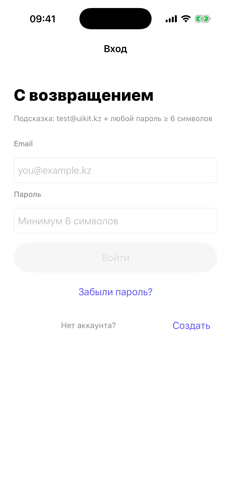

# Глава 8. Auth gate — Login / Register / Forgot

{width=45%}

Auth gate (гейт авторизации) показывается, если mini-app требует входа
в аккаунт (`manifest.hasAuthGate == true`), а пользователь ещё не
вошёл. В нашем playground'е такой mini-app один — Profile / Настройки.

Гейт состоит из трёх экранов:

- **Login** — корневой. Email, пароль, кнопка «Войти», ссылки
  «Забыли пароль?» и «Создать аккаунт».
- **Register** — открывается из Login. Email, пароль, повтор пароля,
  галочка «согласен с условиями», индикатор надёжности пароля.
- **Forgot password** — тоже открывается из Login. Поле email, кнопка
  «Отправить ссылку», сообщение об успехе.

В этой главе разбираем архитектуру (как экраны собраны в
`UINavigationController` и как сообщают о событиях наверх),
мок-сервис вместо настоящего сервера и **Keychain** — место, где
живёт токен. Полный код гейта — в разделе 8.11.

Два слова, которые встретятся на каждой странице:

- **Токен** (token) — строка, которую сервер выдаёт после успешного
  входа. Это «пропуск»: приложение прикладывает его к каждому запросу,
  и сервер понимает, кто пришёл, без повторного ввода пароля. Пароль
  после входа хранить не нужно — хранится только токен.
- **Keychain** (связка ключей) — системное зашифрованное хранилище
  секретов на устройстве. Пароли Safari, данные Wi-Fi и токены
  приложений лежат там. Подробно — в 8.3.

## 8.1 Архитектура: контейнер + три экрана

Auth gate — это **отдельный** `UINavigationController` со своим
стеком экранов. `UINavigationController` — контейнер, который
показывает экраны стопкой: новый экран «кладётся сверху» (push) и
выезжает справа, кнопка «Назад» или свайп от левого края снимают его
(pop). Стек гейта не связан ни с лаунчером, ни с главным экраном
mini-app.

```swift
final class AuthGateContainerViewController: UINavigationController {

    private let brandColor: UIColor
    private let onAuthSuccess: () -> Void

    init(brandColor: UIColor, onAuthSuccess: @escaping () -> Void) {
        self.brandColor = brandColor
        self.onAuthSuccess = onAuthSuccess
        let login = LoginViewController(brandColor: brandColor)
        super.init(rootViewController: login)
        login.delegate = self
        navigationBar.tintColor = brandColor
        navigationBar.prefersLargeTitles = false
    }

    required init?(coder: NSCoder) { fatalError("init(coder:) не используется") }
}
```

Разбор:

- Контейнер — наследник `UINavigationController`. `@MainActor` писать
  не нужно: в нашем режиме (Default Actor Isolation = MainActor, см.
  введение, раздел 0.2) это подразумевается.
- В `init` сначала заполняем собственные свойства, потом создаём экран
  логина и отдаём его родителю как корневой
  (`super.init(rootViewController:)`). Порядок важен: Swift требует
  инициализировать все свои свойства **до** вызова `super.init`.
- `login.delegate = self` — после `super.init` объект готов, и его уже
  можно передавать как делегата.
- `required init?(coder:)` — обязательный инициализатор для загрузки
  из storyboard; мы им не пользуемся.

Почему отдельный стек, а не тот, что вокруг главного экрана? В момент
показа гейта главного экрана ещё не существует. Координатор только
**решает**, нужен ли вход, и если да — ставит этот контейнер корневым
экраном окна. Главный экран создастся позже, **после** успешного
входа.

В стеке три экрана:

```
[NavigationController]
        │
        ├─ LoginViewController       ← rootViewController
        │       │
        │       ├─ push → RegisterViewController
        │       │
        │       └─ push → ForgotPasswordViewController
```

Login — корневой. Register и Forgot открываются push'ем, закрываются
кнопкой «Назад» или свайпом от левого края.

`prefersLargeTitles = false` — на экранах входа крупные заголовки не
нужны, место занимает форма.

`navigationBar.tintColor = brandColor` — кнопки панели навигации
окрашены в цвет mini-app. В Profile (индиго) кнопка «Назад» будет
индиго. Цвет приходит из манифеста (см. главу 2).

## 8.2 Делегирование событий — почему `delegate` вместо замыканий

Экран логина должен сообщать контейнеру о событиях: «успешно вошёл»,
«хочу на регистрацию», «хочу на восстановление». Два варианта.

**На замыканиях (closure):**
```swift
let login = LoginViewController(brandColor: brandColor)
login.onLoginSuccess = { [weak self] token in self?.didAuthenticate(token: token) }
login.onGoToRegister = { [weak self] in self?.goToRegister(from: login) }
login.onGoToForgot = { [weak self] in self?.goToForgot(from: login) }
```

**На делегате (классический стиль UIKit):**
```swift
protocol LoginViewControllerDelegate: AnyObject {
    func login(_ vc: LoginViewController, didSucceedWith token: String)
    func loginRequestsRegister(_ vc: LoginViewController)
    func loginRequestsForgot(_ vc: LoginViewController)
}
```

И в Login:
```swift
weak var delegate: LoginViewControllerDelegate?
```

Делегат — объект, которому экран поручает реагировать на свои события.
Экран знает только протокол, а не конкретный класс: сегодня делегат —
наш контейнер, завтра — тестовый объект.

В нашем коде — второй вариант. Не потому что он «правильнее», а
потому что:

- **Событий три.** Три замыкания-свойства и три присваивания читаются
  хуже, чем один протокол, где все события собраны вместе.
- **Меньше мест для утечки памяти.** Каждое замыкание, которое
  обращается к контейнеру, нужно не забыть написать с `[weak self]`,
  иначе контейнер и экран будут держать друг друга сильными ссылками
  и никогда не освободятся. С делегатом `weak` пишется один раз — в
  объявлении свойства `delegate`. Ограничение `AnyObject` в протоколе
  нужно, чтобы `weak` вообще было разрешено (слабой бывает только
  ссылка на класс). Заставить написать `weak` компилятор не может —
  это остаётся на тебе, но место одно, и его легко проверить.
- **Стиль UIKit.** Apple использует делегатов повсюду:
  `UITableViewDelegate`, `UITextFieldDelegate`, `UIPageViewControllerDelegate`.
  Книга показывает обычный UIKit-код.

> **Когда замыкание лучше.** Если событие одно (`onFinish` у
> онбординга) или два (`onPass` / `onTooYoung` у age gate в главе 10),
> замыкания короче. Делегат начинает выигрывать, когда событий три и
> больше.

Контейнер реализует оба протокола — и логина, и регистрации:

```swift
extension AuthGateContainerViewController: LoginViewControllerDelegate,
                                            RegisterViewControllerDelegate {
    func login(_ vc: LoginViewController, didSucceedWith token: String) {
        didAuthenticate(token: token)
    }
    func loginRequestsRegister(_ vc: LoginViewController) {
        goToRegister(from: vc)
    }
    func loginRequestsForgot(_ vc: LoginViewController) {
        goToForgot(from: vc)
    }
    func register(_ vc: RegisterViewController, didSucceedWith token: String) {
        didAuthenticate(token: token)
    }
}
```

Login и Register сообщают об успехе одинаково — «получен токен».
Контейнер сохраняет его и сообщает координатору:

```swift
private func didAuthenticate(token: String) {
    guard AuthStorage.shared.save(token: token) else {
        let alert = UIAlertController(title: "Не удалось сохранить вход",
                                      message: "Попробуй ещё раз.",
                                      preferredStyle: .alert)
        alert.addAction(UIAlertAction(title: "OK", style: .default))
        present(alert, animated: true)
        return
    }
    onAuthSuccess()
}
```

Если сохранить токен не удалось (Keychain вернул ошибку), молча идти
дальше нельзя: при новом запуске приложение «забудет» вход. Лучше
сразу сказать об этом человеку.

## 8.3 Keychain — где жить токену

Наш `AuthStorage` умеет три вещи: сохранить, прочитать, стереть.
Базовый Keychain без групп доступа, без синхронизации через iCloud и
без биометрии — просто защищённое хранилище на устройстве.

```swift
import Foundation
import Security

final class AuthStorage {

    static let shared = AuthStorage()
    private init() {}

    private let service = "kz.waid.uikitplayground.auth"
    private let account = "token"

    var token: String? { read() }
    var isLoggedIn: Bool { token != nil }

    private var baseQuery: [String: Any] {
        [
            kSecClass as String: kSecClassGenericPassword,
            kSecAttrService as String: service,
            kSecAttrAccount as String: account,
        ]
    }

    @discardableResult
    func save(token: String) -> Bool {
        let data = Data(token.utf8)
        var addQuery = baseQuery
        addQuery[kSecValueData as String] = data
        addQuery[kSecAttrAccessible as String] = kSecAttrAccessibleWhenUnlockedThisDeviceOnly

        let status = SecItemAdd(addQuery as CFDictionary, nil)
        if status == errSecDuplicateItem {
            // Запись уже есть — меняем только данные.
            let changes: [String: Any] = [kSecValueData as String: data]
            return SecItemUpdate(baseQuery as CFDictionary, changes as CFDictionary) == errSecSuccess
        }
        return status == errSecSuccess
    }

    func read() -> String? {
        var query = baseQuery
        query[kSecReturnData as String] = true
        query[kSecMatchLimit as String] = kSecMatchLimitOne

        var result: CFTypeRef?
        let status = SecItemCopyMatching(query as CFDictionary, &result)
        guard status == errSecSuccess,
              let data = result as? Data else { return nil }
        return String(data: data, encoding: .utf8)
    }

    func clear() {
        SecItemDelete(baseQuery as CFDictionary)
    }
}
```

Разберём по частям.

**Почему не UserDefaults.** `UserDefaults` — это обычный plist-файл в
песочнице приложения, данные лежат в нём открытым текстом. Он
попадает в резервные копии, а на взломанном (jailbreak) устройстве
его может прочитать кто угодно. Для флага «онбординг пройден» это
неважно, для токена — недопустимо: с токеном можно войти в аккаунт
без пароля. Apple в HIG прямо советует хранить чувствительные данные
в Keychain.

**Что такое Keychain.** Это база записей, которой управляет система, а
не приложение. Записи зашифрованы ключами, которые привязаны к
устройству и к его код-паролю; приложение видит только свои записи.
Каждая запись — словарь атрибутов плюс данные.

**Запрос — словарь.** API Keychain — функции на языке C из фреймворка
Security. Параметры передаются словарём `[String: Any]`, который
приводится к `CFDictionary`. Ключи словаря — константы вроде
`kSecClass`, значения — другие константы или `Data`. Привыкнуть можно,
но в больших проектах часто берут библиотеку-обёртку (KeychainAccess,
SimpleKeychain) или пишут свою, как наш `AuthStorage`.

**`baseQuery` — как найти нашу запись.** Три атрибута:

- `kSecClass: kSecClassGenericPassword` — тип записи «произвольный
  секрет». Есть ещё интернет-пароли, сертификаты и ключи.
- `kSecAttrService` — «имя сервиса». Обычно bundle id приложения плюс
  назначение: `kz.waid.uikitplayground.auth`.
- `kSecAttrAccount` — «имя слота» внутри сервиса. У нас `token`. Если
  бы мы хранили два токена (access и refresh), были бы два слота:
  `access` и `refresh`.

Пара `service + account` однозначно определяет запись.

**`save` — добавить, а если есть, обновить.** Так рекомендует Apple в
статье «Updating and deleting keychain items»:

1. `SecItemAdd` пытается создать запись. Если её ещё нет — готово,
   функция вернёт `errSecSuccess`.
2. Если запись уже есть, `SecItemAdd` вернёт `errSecDuplicateItem`.
   Тогда зовём `SecItemUpdate`: первый словарь — какую запись искать
   (`baseQuery`), второй — что в ней поменять (новые данные
   `kSecValueData`).

Встречается и вариант «сначала `SecItemDelete`, потом `SecItemAdd`».
Он тоже работает, но между двумя вызовами записи нет совсем, и если
второй вызов упадёт, токен потерян.

Каждая функция Keychain возвращает `OSStatus` — числовой код
результата. `errSecSuccess` (0) — успех, остальное — ошибка. Наш
`save` возвращает `Bool`, чтобы вызывающий код мог отреагировать
(как в `didAuthenticate` выше). `@discardableResult` разрешает
игнорировать результат без предупреждения компилятора — пригодится в
тестах.

**`kSecAttrAccessible` — когда запись доступна.** Мы ставим
`kSecAttrAccessibleWhenUnlockedThisDeviceOnly`. Название читается по
частям:

- `WhenUnlocked` — прочитать запись можно, только пока устройство
  разблокировано. Токен нужен, когда человек пользуется приложением, —
  это наш случай. Если бы приложение обновляло данные в фоне при
  заблокированном экране, понадобился бы вариант `AfterFirstUnlock`
  («доступно после первой разблокировки с момента включения»).
- `ThisDeviceOnly` — запись не переедет на другое устройство. Записи
  Keychain попадают в зашифрованные резервные копии; без этого
  суффикса при восстановлении копии на **новый** iPhone токен
  переехал бы вместе с ней. С суффиксом он восстанавливается только
  на тот же самый аппарат.

Если атрибут не указать, по умолчанию будет
`kSecAttrAccessibleWhenUnlocked` — то же, но без запрета переезда.
Apple советует выбирать самый строгий вариант, который подходит
приложению.

Синхронизация через iCloud Keychain — отдельный атрибут
`kSecAttrSynchronizable`; по умолчанию он выключен, и токен остаётся
на устройстве.

**`read` — поиск записи.** К `baseQuery` добавляем
`kSecReturnData: true` («верни данные, а не только факт наличия») и
`kSecMatchLimitOne` («нужна одна запись»). `SecItemCopyMatching`
кладёт результат в `result` типа `CFTypeRef?`; приводим его к `Data`
и декодируем строку. Любая ошибка, включая «записи нет»
(`errSecItemNotFound`), превращается в `nil` — для «вошёл ли
пользователь» этого достаточно.

**Главный поток.** Вызовы Keychain синхронные: пока система ищет
запись, поток ждёт. Для одной маленькой записи это доли миллисекунды,
поэтому `AuthStorage` работает на главном потоке, как и весь
остальной код. Для записей, защищённых Face ID (глава 11), чтение
ждёт, пока человек пройдёт проверку, — такие вызовы уводят с главного
потока.

**Удаление приложения.** На практике записи Keychain в iOS **не**
стираются при удалении приложения, в отличие от `UserDefaults`.
Apple не обещает это поведение в документации, но на него стоит
рассчитывать: человек удалил приложение, поставил заново — и вдруг
оказался «залогинен» старым токеном.

**Упражнение 8.1.** Сделай так, чтобы после переустановки приложение
не оказывалось «залогиненным» старым токеном. Подсказка: `UserDefaults`
при удалении приложения стирается, а Keychain — нет. Ответ — в конце
главы.

**Упражнение 8.2.** Запусти Profile mini-app и войди с
`test@uikit.kz` и любым паролем от 6 символов. Выйди на домашний экран
(⇧⌘H в симуляторе), затем полностью закрой приложение: Stop в Xcode
или смахни его в переключателе приложений. Запусти снова и зайди в
Profile. Что ты увидишь и почему? Ответ — в конце главы.

## 8.4 MockAuthService — почему без реального бэкенда

Настоящий сервер для книги не нужен: мы пишем про интерфейс и гейты.
Мок-сервис (mock — «подделка», объект, который притворяется настоящим
сервисом) делает три вещи:

- **Задержка.** `try await Task.sleep(nanoseconds: 600_000_000)` —
  600 миллионов наносекунд, то есть 0,6 секунды. Это имитация сети:
  без задержки кнопка «Войти» срабатывала бы мгновенно, и ты не увидел
  бы спиннер. Более удобная запись `Task.sleep(for: .milliseconds(600))`
  появилась только в iOS 16, а мы поддерживаем iOS 15.
- **Проверка данных.** Email — регулярным выражением, пароль — от 6
  символов, для входа подходит только учётка `test@uikit.kz`
  (регистрация принимает любой адрес).
- **Ошибки** — свой enum с понятными человеку сообщениями.

```swift
import Foundation

enum MockAuthService {
    enum Error: Swift.Error, LocalizedError {
        case invalidCredentials
        case weakPassword
        case invalidEmail
        case network

        var errorDescription: String? {
            switch self {
            case .invalidCredentials: "Неверный email или пароль."
            case .weakPassword: "Пароль должен быть не короче 6 символов."
            case .invalidEmail: "Проверь адрес почты: похоже, в нём опечатка."
            case .network: "Не удалось подключиться к серверу."
            }
        }
    }

    static func isValidEmail(_ email: String) -> Bool {
        let pattern = #"^[A-Za-z0-9._%+-]+@[A-Za-z0-9.-]+\.[A-Za-z]{2,}$"#
        return email.range(of: pattern, options: .regularExpression) != nil
    }

    static func login(email: String, password: String) async throws -> String {
        try await Task.sleep(nanoseconds: 600_000_000)
        guard isValidEmail(email) else { throw Error.invalidEmail }
        guard email.lowercased() == "test@uikit.kz", password.count >= 6 else {
            throw Error.invalidCredentials
        }
        return "mock-token-\(UUID().uuidString)"
    }

    static func register(email: String, password: String) async throws -> String {
        try await Task.sleep(nanoseconds: 600_000_000)
        guard isValidEmail(email) else { throw Error.invalidEmail }
        guard password.count >= 6 else { throw Error.weakPassword }
        return "mock-token-\(UUID().uuidString)"
    }

    static func sendResetEmail(email: String) async throws {
        try await Task.sleep(nanoseconds: 600_000_000)
        guard isValidEmail(email) else { throw Error.invalidEmail }
    }
}
```

Что здесь стоит разобрать:

- `enum Error: Swift.Error` — вложенный тип называется `Error`, как
  стандартный протокол. Чтобы не перепутать, протокол указан полным
  именем `Swift.Error`.
- `LocalizedError` — протокол с одним главным свойством
  `errorDescription`. Реализуешь его — и стандартное
  `error.localizedDescription` вернёт твою строку, а не безликое
  «The operation couldn't be completed».
- `switch` без `return` в каждой ветке — с Swift 5.9 `switch` может
  быть выражением, и значение ветки становится результатом.
- При **входе** неверный пароль и неизвестный email дают **одну и ту
  же** ошибку `invalidCredentials`. Это сознательно. Если на «нет
  такого email» отвечать иначе, чем на «неверный пароль», злоумышленник
  может перебором выяснить, какие адреса зарегистрированы. Короткий
  пароль при входе — тоже просто «неверный пароль»: требования к
  длине проверяются при регистрации, а не при входе.
- Токен — `"mock-token-"` плюс случайный UUID, каждый вход даёт новый.

Удобство `LocalizedError` для интерфейса — любую ошибку можно сразу
показать человеку:

```swift
do {
    let token = try await MockAuthService.login(email: email, password: password)
    // ...
} catch {
    showError(error.localizedDescription)  // наша строка
}
```

> **Регулярка для email.** Выражение
> `^[A-Za-z0-9._%+-]+@[A-Za-z0-9.-]+\.[A-Za-z]{2,}$` читается так:
> «одна или больше латинских букв, цифр или символов `._%+-`, затем
> `@`, затем имя домена, точка и зона из двух и более букв». Оно
> намеренно простое: адрес `ivan.petrov+shop@mail.kz` пройдёт, а
> `ivan@mail` — нет. Полная проверка по стандарту RFC 5322 огромна и
> всё равно не гарантирует, что ящик существует. Настоящая проверка
> email — письмо со ссылкой подтверждения. Имей в виду, что регулярка
> не пропустит адреса с кириллицей в имени (`иван@почта.рф`); если они
> нужны, условие придётся ослабить.
>
> `#"..."#` — «сырая» строка: обратный слеш в ней не нужно удваивать,
> и `\.` попадает в регулярку как есть.

## 8.5 Login — что внутри

Экран логина — `UIScrollView`, внутри вертикальный `UIStackView` с
полями и кнопками. Прокрутка нужна, чтобы на маленьком экране
клавиатура не закрыла форму: содержимое можно подвинуть пальцем.
`keyboardDismissMode = .interactive` — клавиатура уезжает вниз вслед
за пальцем, когда прокручиваешь форму.

Ключевые куски.

**Поля с автозаполнением паролей.** Поля создаёт общая функция:

```swift
func makeAuthField(placeholder: String, contentType: UITextContentType, secure: Bool) -> UITextField {
    let field = UITextField()
    field.placeholder = placeholder
    field.borderStyle = .roundedRect
    field.font = .preferredFont(forTextStyle: .body)
    field.adjustsFontForContentSizeCategory = true
    field.textContentType = contentType
    field.isSecureTextEntry = secure
    field.autocapitalizationType = .none
    field.autocorrectionType = .no
    if !secure {
        field.keyboardType = .emailAddress
    }
    field.heightAnchor.constraint(greaterThanOrEqualToConstant: 44).isActive = true
    return field
}
```

Самая важная строка — `textContentType`. Она говорит системе, что это
за поле: `.username` — логин, `.password` — существующий пароль,
`.newPassword` — пароль при регистрации. По этим подсказкам iOS
включает **Password AutoFill**: над клавиатурой появляется
предложение подставить сохранённые логин и пароль, а на экране
регистрации — предложение сгенерировать надёжный пароль и сохранить
его в связку ключей. Человеку не нужно ничего запоминать, а тебе —
писать ни строчки кода хранения пароля. (Чтобы iOS предлагала
пароль именно от твоего сайта, настраивают Associated Domains —
связку приложения с доменом; это тема за пределами главы.)

Остальное:

- `isSecureTextEntry = true` — символы пароля скрываются точками, а
  система не показывает введённое в подсказках клавиатуры и на
  записи экрана.
- `autocapitalizationType = .none`, `autocorrectionType = .no` —
  клавиатура не делает первую букву email заглавной и не «исправляет»
  адрес по словарю.
- `.emailAddress` — клавиатура с `@` и точкой на виду.
- Высота поля не меньше 44 точек — минимальный размер области касания
  по HIG, в неё уверенно попадает палец.

**Проверка на лету** — на каждое изменение текста:

```swift
emailField.addTarget(self, action: #selector(textChanged), for: .editingChanged)
passwordField.addTarget(self, action: #selector(textChanged), for: .editingChanged)

@objc private func textChanged() {
    let emailOk = MockAuthService.isValidEmail(emailField.text ?? "")
    let passOk = (passwordField.text?.count ?? 0) >= 6
    loginButton.isEnabled = emailOk && passOk
    errorLabel.isHidden = true
}
```

Кнопка «Войти» активна, только когда оба поля выглядят правдоподобно.
Иначе человек тапает «Войти» с пустым полем и получает ошибку —
лишнее раздражение. Внешний вид неактивной кнопки делать не нужно:
кнопка на `UIButton.Configuration` сама становится бледной при
`isEnabled = false`. Заодно прячем прошлую ошибку — человек уже
исправляет ввод.

**Состояние загрузки:**

```swift
@objc private func loginTapped() {
    let email = emailField.text ?? ""
    let password = passwordField.text ?? ""
    startLoading()
    Task { [weak self] in
        do {
            let token = try await MockAuthService.login(email: email, password: password)
            guard let self else { return }
            self.stopLoading()
            self.delegate?.login(self, didSucceedWith: token)
        } catch {
            guard let self else { return }
            self.stopLoading()
            self.showError(error.localizedDescription)
        }
    }
}

private func startLoading() {
    view.endEditing(true)
    loginButton.isEnabled = false
    var cfg = loginButton.configuration
    cfg?.showsActivityIndicator = true
    cfg?.title = "Входим…"
    loginButton.configuration = cfg
}
```

Порядок действий:

1. Текст полей читаем **до** запуска задачи, пока мы на главном потоке
   и поля точно те, что ввёл человек.
2. `startLoading()` прячет клавиатуру (`view.endEditing(true)` снимает
   фокус со всех полей), выключает кнопку и включает спиннер прямо
   внутри неё: `UIButton.Configuration` умеет это свойством
   `showsActivityIndicator` (iOS 15+), отдельный
   `UIActivityIndicatorView` не нужен.
3. `Task { [weak self] in ... }` запускает асинхронную работу. Внутри —
   `await` на мок-сервис.
4. `guard let self` стоит **после** `await`, а не в начале задачи.
   Разница важна: пока идёт запрос, экран держится только слабой
   ссылкой. Если человек за эти 0,6 секунды ушёл с экрана, контроллер
   освободится, и `guard` просто выйдет. Если бы `guard let self`
   стоял первой строкой, задача держала бы экран сильной ссылкой до
   конца запроса.
5. Задача, созданная в коде главного актора, продолжает работу на
   главном потоке, поэтому трогать интерфейс после `await` можно.

`stopLoading()` возвращает кнопке заголовок и снова вызывает
`textChanged()`, чтобы кнопка стала активной или нет по текущему
вводу.

**Ошибка под формой:**

```swift
private func showError(_ message: String) {
    errorLabel.text = message
    errorLabel.isHidden = false
    UIAccessibility.post(notification: .announcement, argument: message)
}
```

Красная надпись под полями заметнее alert'а и не требует лишнего
тапа. Последняя строка — для VoiceOver, экранного диктора для
незрячих: он произнесёт текст ошибки вслух. Без этого человек с
VoiceOver не узнал бы, что вход не удался.

## 8.6 Register — индикатор надёжности пароля

Register — то же самое плюс поле «повтори пароль», галочка «согласен с
условиями» и индикатор надёжности пароля.

Индикатор — небольшая функция:

```swift
enum Strength { case weak, medium, strong }

static func passwordStrength(_ s: String) -> Strength {
    var score = 0
    if s.count >= 6 { score += 1 }
    if s.count >= 10 { score += 1 }
    if s.contains(where: \.isNumber) { score += 1 }
    if s.contains(where: { $0.isUppercase }) { score += 1 }
    if s.contains(where: { !$0.isLetter && !$0.isNumber }) { score += 1 }
    switch score {
    case 0...1: return .weak
    case 2...3: return .medium
    default: return .strong
    }
}
```

За каждое выполненное условие — балл: длина от 6 символов, длина от
10, есть цифра, есть заглавная буква, есть символ, который не буква и
не цифра. 0–1 балл — слабый, 2–3 — средний, 4–5 — хороший. Примеры на
числах (проверены запуском):

| Пароль | Баллы | Итог |
|---|---|---|
| `pass` | 0 | слабый |
| `qwerty` | 1 (длина от 6) | слабый |
| `qwerty12` | 2 (длина, цифра) | средний |
| `password123` | 3 (длина от 6, от 10, цифра) | средний |
| `password123Aa` | 4 (плюс заглавная) | хороший |
| `password123!Aa` | 5 (плюс `!`) | хороший |

Цветная подпись под полем: красная «Слабый пароль», оранжевая
«Средний», зелёная «Хороший».

Таблица заодно показывает слабость такой эвристики: `qwerty12` —
один из самых популярных паролей в утечках, а функция называет его
средним. Серьёзные оценщики вроде библиотеки
[zxcvbn](https://github.com/dropbox/zxcvbn) от Dropbox сверяют пароль
со словарями популярных паролей и раскладок клавиатуры. Современные
рекомендации по паролям (например, американский стандарт NIST
SP 800-63B) ставят длину и проверку по базам утечек выше обязательных
«цифра + заглавная + спецсимвол». Для демонстрации интерфейса нашей
функции хватает, для настоящего сервиса окончательную проверку делает
сервер.

Для **сгенерированного** системой пароля можно подсказать правила
через `passwordRules`:

```swift
passwordField.passwordRules = UITextInputPasswordRules(
    descriptor: "minlength: 10; required: lower; required: upper; required: digit;"
)
```

Когда iOS предлагает «надёжный пароль» в поле с `.newPassword`, она
учтёт эти правила: не короче 10 символов, обязательно строчная,
заглавная и цифра.

**Галочка на `UIButton`:**

```swift
agreeButton.setImage(UIImage(systemName: "square"), for: .normal)
agreeButton.setImage(UIImage(systemName: "checkmark.square.fill"), for: .selected)
agreeButton.addTarget(self, action: #selector(toggleAgree), for: .touchUpInside)

@objc private func toggleAgree() {
    agreed.toggle()
    agreeButton.isSelected = agreed
    validateForm()
}
```

Ни `UISwitch`, ни `UISegmentedControl` — просто `UIButton` с двумя
картинками из SF Symbols: пустой квадрат для обычного состояния
(`.normal`) и квадрат с галочкой для выбранного (`.selected`). Тап
переключает `isSelected`, кнопка сама подставляет нужную картинку.
Бонус: VoiceOver читает выбранную кнопку как «выбрано», потому что
`isSelected` у `UIControl` автоматически попадает в свойства
доступности.

`validateForm()` включает кнопку «Создать аккаунт», только если email
правдоподобен, пароль от 6 символов, повтор совпадает и галочка
стоит.

**Упражнение 8.3.** Не запуская приложение, посчитай баллы и итог для
паролей `Pass1`, `Qwerty12` и `Пароль1!`. Затем открой Register и
проверь себя. Совпадает ли с тем, что проверка длины в `validateForm`
требует от 6 символов? Ответ — в конце главы.

## 8.7 Forgot password — минимальный экран

Самый простой экран гейта: email, кнопка «Отправить ссылку» и
сообщение.

```swift
@objc private func sendTapped() {
    let email = emailField.text ?? ""
    view.endEditing(true)
    var cfg = sendButton.configuration
    cfg?.showsActivityIndicator = true
    sendButton.configuration = cfg
    sendButton.isEnabled = false
    Task { [weak self] in
        try? await MockAuthService.sendResetEmail(email: email)
        guard let self else { return }
        var cfg = self.sendButton.configuration
        cfg?.showsActivityIndicator = false
        self.sendButton.configuration = cfg
        self.sendButton.isEnabled = true
        self.successLabel.isHidden = false
    }
}
```

`try?` превращает любую ошибку в `nil`: результат нам не важен. Текст
сообщения — «Если такой адрес зарегистрирован, мы отправили на него
письмо». Не «письмо отправлено» и не «такого адреса нет» — по той же
причине, что и в 8.4: экран восстановления не должен подсказывать,
какие email есть в базе.

В реальности сервер пришлёт письмо со ссылкой, по которой откроется
страница с формой нового пароля. Эта часть обычно живёт **вне**
приложения, на сайте. Мок просто ждёт 0,6 секунды.

## 8.8 `shouldShow` — когда auth не нужен

```swift
static func shouldShow(for manifest: AppManifest) -> Bool {
    manifest.hasAuthGate && !AuthStorage.shared.isLoggedIn
}
```

Два условия:

- mini-app **требует** входа (`hasAuthGate == true` в манифесте);
- пользователь **ещё не вошёл** (в Keychain нет токена).

Если токен есть — гейт пропускается, координатор идёт прямо к
главному экрану. Чтобы вернуть гейт, нужно стереть токен. В Profile
это делает кнопка «Выйти из аккаунта» — она вызывает
`AuthStorage.shared.clear()`.

Заметь: `isLoggedIn` проверяет только **наличие** токена на
устройстве, а не то, что сервер его ещё принимает. Токен мог
истечь или быть отозван. Настоящее приложение узнаёт об этом при
первом запросе к API (ответ 401) — см. 8.10.

## 8.9 Бытовая аналогия

Auth gate — **стойка регистрации в отеле**. Прежде чем попасть в номер
(главный экран mini-app), нужно заселиться. Администратор умеет три
вещи: «у меня бронь» (login), «я новый гость» (register), «забыл номер
брони» (forgot).

После заселения тебе дают ключ-карту (токен), и ты идёшь в номер.
Пароль от брони больше не нужен — дверь открывает карта. Карта
работает, пока ты её не сдашь (выход — `clear()`) или пока отель её не
заблокирует (сервер отозвал токен). Карту ты носишь во внутреннем
кармане на молнии (Keychain), а не в прозрачном бейдже на шее
(`UserDefaults`).

Системные запросы разрешений iOS из главы 7 — это **охрана здания**.
Она пускает к ресурсам устройства (фото, камера, геолокация), но не в
твой номер. Разные уровни доступа: auth gate — про **аккаунт**,
разрешения — про **устройство**.

## 8.10 Что мы не делаем (но в production стоит)

- **Refresh token.** У мока один токен на сессию. В production их
  обычно два: короткоживущий access (минуты-часы) и долгоживущий
  refresh. Когда access истёк, приложение отправляет refresh и получает
  новый access, не спрашивая пароль.
- **Реакция на 401.** Если сервер во время работы ответил «401
  Unauthorized» (токен истёк или отозван), нужно стереть токен из
  Keychain, показать «Сессия истекла» и вернуть человека на вход.
- **Вход по коду из SMS или письма** — человек вводит телефон или
  email и получает одноразовый код. Для поля кода есть
  `textContentType = .oneTimeCode`: iOS сама подставит код из
  пришедшего сообщения.
- **Passkeys.** Вход без пароля вообще: ключ хранится в связке ключей
  и подтверждается Face ID. HIG советует passkeys, если ты не
  используешь Sign in with Apple.
- **Вход через сторонние сервисы** (Google, Telegram и т.д.). Здесь
  есть правило App Review **4.8 Login Services**: если основной
  аккаунт в приложении создаётся через сторонний сервис входа,
  приложение обязано предложить ещё один равноценный вариант, который
  собирает только имя и email, позволяет скрыть email и не
  отслеживает человека для рекламы без согласия. Sign in with Apple
  этим требованиям отвечает, поэтому его обычно и добавляют. Если же
  вход только через твою собственную систему аккаунтов (как у нас:
  email + пароль), дополнительный вариант не требуется.
- **Удаление аккаунта.** Правило **5.1.1(v)**: если в приложении можно
  создать аккаунт, в нём же должна быть возможность этот аккаунт
  удалить — не просто деактивировать. Подробно — в главе 40.
- **Биометрия.** Face ID вместо ввода пароля каждый раз. Мы делаем
  биометрию для **возврата из фона** в главе 11, там же — как
  привязать к Face ID сам токен в Keychain.

Всё это строится поверх той же базы: хранилище + три экрана +
делегаты.

## 8.11 Гейт целиком

`AuthStorage` и `MockAuthService` целиком приведены в 8.3 и 8.4. Ниже —
файл `AuthGate.swift` со всеми экранами. Он собирается и запускается
вместе с ними; `AppManifest` — из главы 2.

```swift
import UIKit

protocol LoginViewControllerDelegate: AnyObject {
    func login(_ vc: LoginViewController, didSucceedWith token: String)
    func loginRequestsRegister(_ vc: LoginViewController)
    func loginRequestsForgot(_ vc: LoginViewController)
}

protocol RegisterViewControllerDelegate: AnyObject {
    func register(_ vc: RegisterViewController, didSucceedWith token: String)
}

final class AuthGateContainerViewController: UINavigationController {

    static func shouldShow(for manifest: AppManifest) -> Bool {
        manifest.hasAuthGate && !AuthStorage.shared.isLoggedIn
    }

    private let brandColor: UIColor
    private let onAuthSuccess: () -> Void

    init(brandColor: UIColor, onAuthSuccess: @escaping () -> Void) {
        self.brandColor = brandColor
        self.onAuthSuccess = onAuthSuccess
        let login = LoginViewController(brandColor: brandColor)
        super.init(rootViewController: login)
        login.delegate = self
        navigationBar.tintColor = brandColor
        navigationBar.prefersLargeTitles = false
    }

    required init?(coder: NSCoder) { fatalError("init(coder:) не используется") }

    private func goToRegister(from vc: UIViewController) {
        let register = RegisterViewController(brandColor: brandColor)
        register.delegate = self
        pushViewController(register, animated: true)
    }

    private func goToForgot(from vc: UIViewController) {
        pushViewController(ForgotPasswordViewController(brandColor: brandColor), animated: true)
    }

    private func didAuthenticate(token: String) {
        guard AuthStorage.shared.save(token: token) else {
            let alert = UIAlertController(title: "Не удалось сохранить вход",
                                          message: "Попробуй ещё раз.",
                                          preferredStyle: .alert)
            alert.addAction(UIAlertAction(title: "OK", style: .default))
            present(alert, animated: true)
            return
        }
        onAuthSuccess()
    }
}

extension AuthGateContainerViewController: LoginViewControllerDelegate,
                                            RegisterViewControllerDelegate {
    func login(_ vc: LoginViewController, didSucceedWith token: String) {
        didAuthenticate(token: token)
    }
    func loginRequestsRegister(_ vc: LoginViewController) {
        goToRegister(from: vc)
    }
    func loginRequestsForgot(_ vc: LoginViewController) {
        goToForgot(from: vc)
    }
    func register(_ vc: RegisterViewController, didSucceedWith token: String) {
        didAuthenticate(token: token)
    }
}

func makeAuthField(placeholder: String, contentType: UITextContentType, secure: Bool) -> UITextField {
    let field = UITextField()
    field.placeholder = placeholder
    field.borderStyle = .roundedRect
    field.font = .preferredFont(forTextStyle: .body)
    field.adjustsFontForContentSizeCategory = true
    field.textContentType = contentType
    field.isSecureTextEntry = secure
    field.autocapitalizationType = .none
    field.autocorrectionType = .no
    if !secure {
        field.keyboardType = .emailAddress
    }
    field.heightAnchor.constraint(greaterThanOrEqualToConstant: 44).isActive = true
    return field
}

func makeScrollingForm(in view: UIView, arrangedSubviews: [UIView]) -> UIScrollView {
    let scroll = UIScrollView()
    scroll.keyboardDismissMode = .interactive
    scroll.alwaysBounceVertical = true
    let stack = UIStackView(arrangedSubviews: arrangedSubviews)
    stack.axis = .vertical
    stack.spacing = 12
    scroll.translatesAutoresizingMaskIntoConstraints = false
    stack.translatesAutoresizingMaskIntoConstraints = false
    view.addSubview(scroll)
    scroll.addSubview(stack)
    NSLayoutConstraint.activate([
        scroll.topAnchor.constraint(equalTo: view.topAnchor),
        scroll.leadingAnchor.constraint(equalTo: view.leadingAnchor),
        scroll.trailingAnchor.constraint(equalTo: view.trailingAnchor),
        scroll.bottomAnchor.constraint(equalTo: view.bottomAnchor),

        stack.topAnchor.constraint(equalTo: scroll.contentLayoutGuide.topAnchor, constant: 32),
        stack.bottomAnchor.constraint(equalTo: scroll.contentLayoutGuide.bottomAnchor, constant: -32),
        stack.leadingAnchor.constraint(equalTo: scroll.frameLayoutGuide.leadingAnchor, constant: 24),
        stack.trailingAnchor.constraint(equalTo: scroll.frameLayoutGuide.trailingAnchor, constant: -24),
    ])
    return scroll
}

final class LoginViewController: UIViewController {

    weak var delegate: LoginViewControllerDelegate?
    private let brandColor: UIColor

    private let emailField = makeAuthField(placeholder: "Email", contentType: .username, secure: false)
    private let passwordField = makeAuthField(placeholder: "Пароль", contentType: .password, secure: true)
    private let loginButton = UIButton(configuration: .filled())
    private let errorLabel = UILabel()

    init(brandColor: UIColor) {
        self.brandColor = brandColor
        super.init(nibName: nil, bundle: nil)
    }

    required init?(coder: NSCoder) { fatalError("init(coder:) не используется") }

    override func viewDidLoad() {
        super.viewDidLoad()
        title = "Вход"
        view.backgroundColor = .systemBackground

        var cfg = UIButton.Configuration.filled()
        cfg.title = "Войти"
        cfg.baseBackgroundColor = brandColor
        cfg.cornerStyle = .large
        loginButton.configuration = cfg
        loginButton.isEnabled = false
        loginButton.addTarget(self, action: #selector(loginTapped), for: .touchUpInside)

        errorLabel.textColor = .systemRed
        errorLabel.font = .preferredFont(forTextStyle: .footnote)
        errorLabel.adjustsFontForContentSizeCategory = true
        errorLabel.numberOfLines = 0
        errorLabel.isHidden = true

        let forgot = UIButton(type: .system)
        forgot.setTitle("Забыли пароль?", for: .normal)
        forgot.addTarget(self, action: #selector(forgotTapped), for: .touchUpInside)
        let register = UIButton(type: .system)
        register.setTitle("Создать аккаунт", for: .normal)
        register.addTarget(self, action: #selector(registerTapped), for: .touchUpInside)

        emailField.addTarget(self, action: #selector(textChanged), for: .editingChanged)
        passwordField.addTarget(self, action: #selector(textChanged), for: .editingChanged)

        _ = makeScrollingForm(in: view, arrangedSubviews: [
            emailField, passwordField, errorLabel, loginButton, forgot, register,
        ])
    }

    @objc private func textChanged() {
        let emailOk = MockAuthService.isValidEmail(emailField.text ?? "")
        let passOk = (passwordField.text?.count ?? 0) >= 6
        loginButton.isEnabled = emailOk && passOk
        errorLabel.isHidden = true
    }

    @objc private func loginTapped() {
        let email = emailField.text ?? ""
        let password = passwordField.text ?? ""
        startLoading()
        Task { [weak self] in
            do {
                let token = try await MockAuthService.login(email: email, password: password)
                guard let self else { return }
                self.stopLoading()
                self.delegate?.login(self, didSucceedWith: token)
            } catch {
                guard let self else { return }
                self.stopLoading()
                self.showError(error.localizedDescription)
            }
        }
    }

    private func startLoading() {
        view.endEditing(true)
        loginButton.isEnabled = false
        var cfg = loginButton.configuration
        cfg?.showsActivityIndicator = true
        cfg?.title = "Входим…"
        loginButton.configuration = cfg
    }

    private func stopLoading() {
        var cfg = loginButton.configuration
        cfg?.showsActivityIndicator = false
        cfg?.title = "Войти"
        loginButton.configuration = cfg
        textChanged()
    }

    private func showError(_ message: String) {
        errorLabel.text = message
        errorLabel.isHidden = false
        UIAccessibility.post(notification: .announcement, argument: message)
    }

    @objc private func forgotTapped() { delegate?.loginRequestsForgot(self) }
    @objc private func registerTapped() { delegate?.loginRequestsRegister(self) }
}

final class RegisterViewController: UIViewController {

    enum Strength { case weak, medium, strong }

    static func passwordStrength(_ s: String) -> Strength {
        var score = 0
        if s.count >= 6 { score += 1 }
        if s.count >= 10 { score += 1 }
        if s.contains(where: \.isNumber) { score += 1 }
        if s.contains(where: { $0.isUppercase }) { score += 1 }
        if s.contains(where: { !$0.isLetter && !$0.isNumber }) { score += 1 }
        switch score {
        case 0...1: return .weak
        case 2...3: return .medium
        default: return .strong
        }
    }

    weak var delegate: RegisterViewControllerDelegate?
    private let brandColor: UIColor
    private var agreed = false

    private let emailField = makeAuthField(placeholder: "Email", contentType: .username, secure: false)
    private let passwordField = makeAuthField(placeholder: "Пароль", contentType: .newPassword, secure: true)
    private let confirmField = makeAuthField(placeholder: "Повтори пароль", contentType: .newPassword, secure: true)
    private let strengthLabel = UILabel()
    private let agreeButton = UIButton(type: .system)
    private let submitButton = UIButton(configuration: .filled())

    init(brandColor: UIColor) {
        self.brandColor = brandColor
        super.init(nibName: nil, bundle: nil)
    }

    required init?(coder: NSCoder) { fatalError("init(coder:) не используется") }

    override func viewDidLoad() {
        super.viewDidLoad()
        title = "Регистрация"
        view.backgroundColor = .systemBackground

        passwordField.passwordRules = UITextInputPasswordRules(
            descriptor: "minlength: 10; required: lower; required: upper; required: digit;"
        )

        strengthLabel.font = .preferredFont(forTextStyle: .footnote)
        strengthLabel.adjustsFontForContentSizeCategory = true
        strengthLabel.isHidden = true

        agreeButton.setImage(UIImage(systemName: "square"), for: .normal)
        agreeButton.setImage(UIImage(systemName: "checkmark.square.fill"), for: .selected)
        agreeButton.setTitle("  Согласен с условиями", for: .normal)
        agreeButton.contentHorizontalAlignment = .leading
        agreeButton.addTarget(self, action: #selector(toggleAgree), for: .touchUpInside)

        var cfg = UIButton.Configuration.filled()
        cfg.title = "Создать аккаунт"
        cfg.baseBackgroundColor = brandColor
        submitButton.configuration = cfg
        submitButton.isEnabled = false
        submitButton.addTarget(self, action: #selector(submitTapped), for: .touchUpInside)

        [emailField, passwordField, confirmField].forEach {
            $0.addTarget(self, action: #selector(validateForm), for: .editingChanged)
        }

        _ = makeScrollingForm(in: view, arrangedSubviews: [
            emailField, passwordField, strengthLabel, confirmField, agreeButton, submitButton,
        ])
    }

    @objc private func toggleAgree() {
        agreed.toggle()
        agreeButton.isSelected = agreed
        validateForm()
    }

    @objc private func validateForm() {
        let password = passwordField.text ?? ""
        switch Self.passwordStrength(password) {
        case .weak:
            strengthLabel.text = "Слабый пароль"
            strengthLabel.textColor = .systemRed
        case .medium:
            strengthLabel.text = "Средний пароль"
            strengthLabel.textColor = .systemOrange
        case .strong:
            strengthLabel.text = "Хороший пароль"
            strengthLabel.textColor = .systemGreen
        }
        strengthLabel.isHidden = password.isEmpty
        submitButton.isEnabled = MockAuthService.isValidEmail(emailField.text ?? "")
            && password.count >= 6
            && password == confirmField.text
            && agreed
    }

    @objc private func submitTapped() {
        let email = emailField.text ?? ""
        let password = passwordField.text ?? ""
        view.endEditing(true)
        submitButton.isEnabled = false
        Task { [weak self] in
            do {
                let token = try await MockAuthService.register(email: email, password: password)
                guard let self else { return }
                self.delegate?.register(self, didSucceedWith: token)
            } catch {
                self?.validateForm()
            }
        }
    }
}

final class ForgotPasswordViewController: UIViewController {
    private let brandColor: UIColor
    private let emailField = makeAuthField(placeholder: "Email", contentType: .username, secure: false)
    private let sendButton = UIButton(configuration: .filled())
    private let successLabel = UILabel()

    init(brandColor: UIColor) {
        self.brandColor = brandColor
        super.init(nibName: nil, bundle: nil)
    }

    required init?(coder: NSCoder) { fatalError("init(coder:) не используется") }

    override func viewDidLoad() {
        super.viewDidLoad()
        title = "Восстановление"
        view.backgroundColor = .systemBackground
        var cfg = UIButton.Configuration.filled()
        cfg.title = "Отправить ссылку"
        cfg.baseBackgroundColor = brandColor
        sendButton.configuration = cfg
        sendButton.addTarget(self, action: #selector(sendTapped), for: .touchUpInside)
        successLabel.text = "Если такой адрес зарегистрирован, мы отправили на него письмо."
        successLabel.numberOfLines = 0
        successLabel.isHidden = true
        _ = makeScrollingForm(in: view, arrangedSubviews: [emailField, sendButton, successLabel])
    }

    @objc private func sendTapped() {
        let email = emailField.text ?? ""
        view.endEditing(true)
        var cfg = sendButton.configuration
        cfg?.showsActivityIndicator = true
        sendButton.configuration = cfg
        sendButton.isEnabled = false
        Task { [weak self] in
            try? await MockAuthService.sendResetEmail(email: email)
            guard let self else { return }
            var cfg = self.sendButton.configuration
            cfg?.showsActivityIndicator = false
            self.sendButton.configuration = cfg
            self.sendButton.isEnabled = true
            self.successLabel.isHidden = false
        }
    }
}
```

Про `makeScrollingForm` — общую функцию раскладки формы — стоит
сказать отдельно. У `UIScrollView` два «прямоугольника»:

- `frameLayoutGuide` — рамка самой прокрутки на экране;
- `contentLayoutGuide` — всё прокручиваемое содержимое.

Стек привязан боками к **рамке** (ширина формы = ширина экрана минус
по 24 точки с каждой стороны), а верхом и низом — к **содержимому**.
Поэтому прокрутка идёт только по вертикали, а высота содержимого
равна высоте стека плюс по 32 точки сверху и снизу. Если форма
выше экрана (крупный шрифт, открытая клавиатура), её можно прокрутить.

## Ответы к упражнениям

**8.1.** Решение — флаг первого запуска в `UserDefaults`, который, в
отличие от Keychain, при удалении стирается:

```swift
func clearKeychainOnFirstLaunch() {
    let key = "app.hasLaunchedBefore"
    guard !UserDefaults.standard.bool(forKey: key) else { return }
    AuthStorage.shared.clear()
    UserDefaults.standard.set(true, forKey: key)
}
```

Вызывай его в самом начале, до первого `shouldShow` — например, в
`scene(_:willConnectTo:options:)`. Проверка: войди, удали приложение
с симулятора, поставь заново — должен показаться экран входа.

**8.2.** Profile откроется сразу, без экрана входа. Токен лежит в
Keychain, а Keychain переживает перезапуск приложения:
`AuthGateContainerViewController.shouldShow(for:)` нашла токен и
вернула `false`. Чтобы снова увидеть вход, нажми «Выйти из аккаунта»
в Profile.

**8.3.** `Pass1` — 5 символов: длина от 6 не набрана, от 10 тоже; есть
цифра (+1) и заглавная (+1) — 2 балла, «средний». `Qwerty12` — длина
от 6 (+1), цифра (+1), заглавная (+1) — 3 балла, «средний».
`Пароль1!` — длина от 6 (+1), цифра (+1), заглавная `П` (+1), `!`
(+1) — 4 балла, «хороший»: `isUppercase` и `isLetter` понимают
кириллицу. Нестыковка есть: `Pass1` индикатор называет средним, а
кнопка «Создать аккаунт» остаётся неактивной, потому что паролю
меньше 6 символов. Честнее считать «слабым» любой пароль короче
минимума — например, первой строкой функции:
`guard s.count >= 6 else { return .weak }`.

## Что мы выучили

- Auth gate — отдельный `UINavigationController` с тремя экранами:
  Login, Register, ForgotPassword.
- Login → Register / Forgot — обычный `pushViewController`; кнопка и
  свайп «Назад» работают из коробки.
- Делегат-протокол против замыканий: при трёх и более событиях
  протокол читается лучше, а `weak` пишется один раз.
- Токен — в Keychain, не в `UserDefaults`. Запрос к Keychain —
  словарь атрибутов; `service + account` определяют запись.
- Сохранение: `SecItemAdd`, а при `errSecDuplicateItem` —
  `SecItemUpdate`. Каждый `OSStatus` проверяем.
- `kSecAttrAccessibleWhenUnlockedThisDeviceOnly` — токен доступен
  только при разблокированном устройстве и не переезжает на другой
  iPhone.
- Записи Keychain на практике переживают удаление приложения — нужен
  флаг первого запуска.
- `textContentType` (`.username`, `.password`, `.newPassword`)
  включает Password AutoFill и генерацию паролей.
- `UIButton.Configuration.showsActivityIndicator = true` — спиннер
  внутри кнопки.
- `LocalizedError` даёт человекочитаемый `localizedDescription`.
- Ошибки входа и восстановления не должны подсказывать, какие email
  зарегистрированы.
- Правила App Review: 4.8 (сторонний вход требует равноценной
  приватной альтернативы, например Sign in with Apple) и 5.1.1(v)
  (создание аккаунта в приложении → удаление аккаунта тоже в
  приложении).

## Apple Developer Documentation

- [Human Interface Guidelines — Managing accounts](https://developer.apple.com/design/human-interface-guidelines/managing-accounts) — просить вход только когда без него нельзя, откладывать его как можно дольше, предпочитать passkeys или Sign in with Apple; правила удаления аккаунта.
- [App Review Guidelines](https://developer.apple.com/app-store/review/guidelines/) — пункты 4.8 Login Services и 5.1.1(v) Account Sign-In.
- [`UINavigationController`](https://developer.apple.com/documentation/uikit/uinavigationcontroller) — стек гейта: login как корневой экран, register/forgot — `pushViewController` со штатным жестом «назад».
- [`UIButton.Configuration`](https://developer.apple.com/documentation/uikit/uibutton/configuration) — `showsActivityIndicator = true` даёт встроенный спиннер без отдельного `UIActivityIndicatorView`.
- [`UITextContentType`](https://developer.apple.com/documentation/uikit/uitextcontenttype) — подсказки полям для автозаполнения: `.username`, `.password`, `.newPassword`, `.oneTimeCode`.
- [`LocalizedError`](https://developer.apple.com/documentation/foundation/localizederror) — протокол, благодаря которому `error.localizedDescription` возвращает нашу строку.
- [Keychain Services](https://developer.apple.com/documentation/security/keychain_services) — `SecItemAdd` / `SecItemUpdate` / `SecItemCopyMatching` / `SecItemDelete`; сюда кладём токен, а не в `UserDefaults`.
- [Updating and deleting keychain items](https://developer.apple.com/documentation/security/updating-and-deleting-keychain-items) — почему повторное сохранение делают через `SecItemUpdate`.
- [`kSecAttrAccessible`](https://developer.apple.com/documentation/security/ksecattraccessible) — когда запись доступна; варианты с `ThisDeviceOnly` не переезжают на другое устройство.
- [`ASAuthorizationAppleIDProvider`](https://developer.apple.com/documentation/authenticationservices/asauthorizationappleidprovider) — Sign in with Apple; типичный способ выполнить правило 4.8, если в приложении есть вход через сторонние сервисы.
- [`URLSession`](https://developer.apple.com/documentation/foundation/urlsession) — когда мок заменится настоящим сервером, отправная точка — `data(for:)` с async/await.
- [The Swift Programming Language — Concurrency](https://docs.swift.org/swift-book/documentation/the-swift-programming-language/concurrency) — `async`/`await` и `Task`: почему `Task { [weak self] in ... }` и где ставить `guard let self`.

→ [Глава 9. Force-update + Maintenance — серверные гейты](./13-force-update.md)
