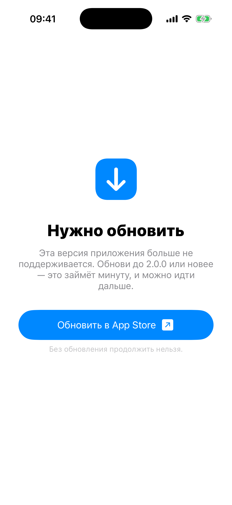

# Глава 9. Force-update + Maintenance — серверные гейты

{width=45%}

Эти два гейта приходят к нам **с сервера**. Они отвечают на простой
вопрос «можно ли пускать пользователя в приложение прямо сейчас?»
Если ответ «нет, обновись», показываем экран-блокатор с кнопкой
«Обновить в App Store». Если ответ «нет, у нас тех-работы», показываем
экран «Возвращаемся через 45 минут».

Между этими гейтами и предыдущими (onboarding / permission / auth)
есть принципиальное отличие: эти **асинхронные**. Чтобы решить, нужны
ли они, мы делаем сетевой запрос. Пока запрос идёт — показываем
крошечный экран загрузки.

## 9.1 Зачем force-update вообще

Бывают **breaking changes** в API. Сервер выкатил новую версию,
старые клиенты падают. Опции:

1. **Поддерживать старый и новый клиент одновременно.** Дорого: каждый
   API endpoint живёт в двух версиях, бэкенд раздувается.
2. **Закрыть старый API**, пусть пользователи обновляются по своей
   воле через App Store. Те, у кого автоматических апдейтов нет,
   получат crash при следующем открытии — плохая UX.
3. **Force-update.** Старый клиент при старте дёргает remote-config,
   получает «версия 1.2 не поддерживается, нужна 2.0+», показывает
   блокатор. Пользователь обновляется и продолжает работать.

Force-update гейт — это **последняя дверь** между breaking change на
сервере и крашами в проде. Стоит реализовать **до** первого мажора,
не после.

## 9.2 AppConfigService — мок «remote config»

В реальности это URLSession-запрос на бэкенд (Firebase Remote Config,
кастомный endpoint, или REST `/config`). У нас — мок:

```swift
enum AppConfigStatus: Sendable {
    case ok
    case forceUpdate(minVersion: String, storeURL: URL)
    case maintenance(message: String, until: Date?)
}

@MainActor
final class AppConfigService {
    static let shared = AppConfigService()
    private init() {}

    private var scenarios: [String: AppConfigStatus] = [:]

    func setScenario(_ status: AppConfigStatus, for manifestId: String) {
        scenarios[manifestId] = status
    }

    func fetch(for manifestId: String) async -> AppConfigStatus {
        try? await Task.sleep(nanoseconds: 400_000_000)
        return scenarios[manifestId] ?? .ok
    }
}
```

`AppConfigStatus` — три варианта: всё ок, нужно обновиться, тех-работы.
Force-update приходит вместе с `minVersion` (минимальная поддерживаемая
версия) и `storeURL` (куда ведёт кнопка). Maintenance — со
`message` и опциональным `until` (когда вернёмся).

`setScenario(_:for:)` — для **тестирования**. Мы не хотим, чтобы все
mini-apps показывали force-update — это сломало бы playground. Поэтому
**регистрируем** сценарии для конкретных id. В SceneDelegate:

```swift
AppRegistry.registerDemoConfigScenarios()
```

Где `registerDemoConfigScenarios` ставит force-update на «music»,
maintenance на «chat». В реальности этот метод не нужен — сервер
сам говорит.

`fetch(for:)` — асинхронный, имитирует 400ms задержки и возвращает
сценарий или `.ok` если не зарегистрирован. **`@MainActor`** на классе
потому что нам удобно использовать его с UIKit без переходов
контекста.

> 💡 **400ms — не случайно.** Это среднее время ответа простого
> /config endpoint'а на хорошем интернете. Если меньше — пользователь
> не успевает прочитать «Проверяем доступность…». Если больше —
> запуск приложения ощущается медленным.

## 9.3 Логика в BootCoordinator

В `BootCoordinator` (см. Главу 4) гейт ставится **после** региона и
возраста, но **до** auth:

```swift
private func proceedAfterAgeGate() {
    if manifest.checksForceUpdate || manifest.hasMaintenanceCheck {
        checkRemoteConfig()
    } else {
        proceedAfterRemoteConfig()
    }
}

private func checkRemoteConfig() {
    let loader = RemoteConfigLoadingViewController(brandColor: manifest.brandColor)
    setRoot(loader, animated: true)
    Task { [weak self] in
        guard let self else { return }
        let status = await AppConfigService.shared.fetch(for: manifest.id)
        self.apply(remoteConfig: status)
    }
}
```

Сначала ставим **loader** (крутящийся спиннер). Параллельно стартуем
async-запрос. Когда придёт ответ — `apply(remoteConfig:)` решает что
показать.

Loader важен — без него получился бы «застывший» предыдущий экран на
400ms. Пользователь подумал «всё, повисло». С loader'ом — видно, что
приложение что-то делает.

`RemoteConfigLoadingViewController` — минимальный экран:

```swift
final class RemoteConfigLoadingViewController: UIViewController {
    override func viewDidLoad() {
        super.viewDidLoad()
        view.backgroundColor = .systemBackground
        let spinner = UIActivityIndicatorView(style: .medium)
        spinner.color = brandColor
        spinner.startAnimating()
        let label = UILabel()
        label.text = "Проверяем доступность…"
        // ... констрейнты по центру ...
    }
}
```

Спиннер + надпись по центру. Ничего больше — пользователь не должен
успеть на нём что-то сделать.

## 9.4 Обработка результата

```swift
private func apply(remoteConfig: AppConfigStatus) {
    switch remoteConfig {
    case .ok:
        proceedAfterRemoteConfig()
    case .forceUpdate(let minVersion, let storeURL):
        guard manifest.checksForceUpdate else {
            proceedAfterRemoteConfig()
            return
        }
        let vc = ForceUpdateViewController(
            brandColor: manifest.brandColor,
            minVersion: minVersion,
            storeURL: storeURL
        )
        setRoot(vc, animated: true)
    case .maintenance(let message, let until):
        guard manifest.hasMaintenanceCheck else {
            proceedAfterRemoteConfig()
            return
        }
        let vc = MaintenanceViewController(
            brandColor: manifest.brandColor,
            message: message,
            until: until,
            onRetry: { [weak self] in self?.checkRemoteConfig() }
        )
        setRoot(vc, animated: true)
    }
}
```

Важный нюанс — `guard manifest.checksForceUpdate else { ... }`. Сервер
**может вернуть** force-update любому mini-app, но **показываем** мы
только тем, у кого в манифесте флаг включен. Это разумно: даже если
вся инфра force-update'ит, для каких-то приложений (например,
оффлайн-калькулятора) это не релевантно.

Те же двери для maintenance — только показываем если
`hasMaintenanceCheck`.

## 9.5 ForceUpdateViewController — блокирующий

```swift
final class ForceUpdateViewController: UIViewController {
    private let brandColor: UIColor
    private let minVersion: String
    private let storeURL: URL

    override func viewDidLoad() {
        super.viewDidLoad()
        view.backgroundColor = .systemBackground
        setupLayout()
    }

    private func setupLayout() {
        let icon = UIImageView(image: UIImage(systemName: "arrow.down.app.fill"))
        // ... иконка по центру

        let titleLabel = UILabel()
        titleLabel.text = "Нужно обновить"
        // ... заголовок

        let bodyLabel = UILabel()
        bodyLabel.text = """
        Эта версия приложения больше не поддерживается. \
        Обнови до \(minVersion) или новее — это займёт минуту, и можно идти дальше.
        """
        // ...

        let updateButton = UIButton(configuration: makeUpdateConfig())
        updateButton.addTarget(self, action: #selector(updateTapped), for: .touchUpInside)

        let noteLabel = UILabel()
        noteLabel.text = "Без обновления продолжить нельзя."
        // ...
    }

    @objc private func updateTapped() {
        UIApplication.shared.open(storeURL)
    }
}
```

Никаких «продолжить позже». Одна кнопка — «Обновить в App Store».
Тап — `UIApplication.shared.open(storeURL)` открывает App Store по
ссылке.

В реальности `storeURL` — это URL твоего приложения, типа
`https://apps.apple.com/app/id1234567890`. Можно использовать
`itms-apps://` схему, но `https://` тоже работает (iOS сама
редиректнет в App Store-приложение).

Кнопка `Configuration.filled()` с иконкой стрелочки справа:

```swift
private func makeUpdateConfig() -> UIButton.Configuration {
    var cfg = UIButton.Configuration.filled()
    cfg.title = "Обновить в App Store"
    cfg.image = UIImage(systemName: "arrow.up.right.square.fill")
    cfg.imagePlacement = .trailing
    cfg.imagePadding = 8
    cfg.cornerStyle = .capsule
    cfg.baseBackgroundColor = brandColor
    cfg.baseForegroundColor = .white
    cfg.contentInsets = NSDirectionalEdgeInsets(top: 14, leading: 24, bottom: 14, trailing: 24)
    return cfg
}
```

`imagePlacement = .trailing` ставит иконку **после** текста (стрелочка
вправо — намёк, что что-то откроется). `cornerStyle = .capsule` —
скругление по высоте, овальная кнопка.

## 9.6 MaintenanceViewController — с таймером и retry

Maintenance отличается двумя вещами:

1. **Опциональный таймер** — если сервер прислал `until: Date`, мы
   показываем «возвращаемся через ~45 минут» с обновлением каждую
   секунду.
2. **Retry-кнопка** — пользователь может «проверить ещё раз». Иногда
   тех-работы заканчиваются раньше; не заставляй пользователя
   перезапускать приложение.

Таймер:

```swift
private var timer: Timer?

private func startCountdown() {
    guard let until else {
        countdownLabel.isHidden = true
        return
    }
    updateCountdown(until: until)
    timer = Timer.scheduledTimer(withTimeInterval: 1, repeats: true) { [weak self] _ in
        self?.updateCountdown(until: until)
    }
}

private func updateCountdown(until: Date) {
    let remaining = max(0, until.timeIntervalSinceNow)
    if remaining <= 0 {
        countdownLabel.text = "Похоже, работы завершены — попробуй обновить."
        timer?.invalidate()
        return
    }
    let formatter = DateComponentsFormatter()
    formatter.allowedUnits = [.hour, .minute, .second]
    formatter.unitsStyle = .abbreviated
    countdownLabel.text = "Возвращаемся через ~\(formatter.string(from: remaining) ?? "—")"
}

deinit { timer?.invalidate() }
```

`Timer.scheduledTimer(withTimeInterval: 1, repeats: true)` — каждую
секунду обновляем `countdownLabel`. `[weak self]` — обязательно, чтобы
не было retain-cycle (таймер держит замыкание, замыкание держит self,
self держит таймер — циклическая ссылка).

`deinit { timer?.invalidate() }` — чистим таймер при деаллокации.
Можно было бы и не делать (через `[weak self]` цикл уже разорван), но
явный invalidate надёжнее: иначе таймер будет «тикать» до завершения
runloop'а.

`DateComponentsFormatter` — апплевский форматтер длительностей.
Получает `TimeInterval` (секунды), возвращает строку «1h 23m 45s» или
«1 ч 23 мин 45 с» в зависимости от локали.

Retry:

```swift
@objc private func retryTapped() {
    var cfg = retryButton.configuration
    cfg?.showsActivityIndicator = true
    cfg?.title = "Проверяем…"
    retryButton.configuration = cfg
    retryButton.isEnabled = false
    onRetry()
}
```

Кнопка переходит в spinner-режим, зовёт `onRetry` (callback в
BootCoordinator, который ведёт обратно в `checkRemoteConfig()`).
Если сервер всё ещё в maintenance — гейт покажется снова, мы вернёмся
сюда. Если ок — пойдёт дальше по цепочке к auth/main.

## 9.7 Что считать «hard» vs «soft» update

Наш force-update — **hard**: единственная кнопка, без обхода. В
реальности есть и **soft**-варианты:

- **Recommended update** — окно с двумя кнопками: «Обновить» и
  «Напомнить позже». Сейчас можно продолжить со старой версией.
- **Inline update** — баннер в углу, не блокирующий. «Доступна новая
  версия».
- **Hybrid** — soft до момента X («поддерживается ещё 2 недели»),
  потом hard.

В playground'е мы делаем hard для простоты. В production-приложении
выбор зависит от того, что именно сломалось:

- Сервер обязательно требует новую версию → hard.
- Появилась новая фича, ранее не было → soft (если не критично).
- Обновили дизайн без breaking changes → inline.

## 9.8 Demo-сценарии в реестре

Чтобы посмотреть оба экрана, мы зарегистрировали два mini-app со
сценариями (`AppRegistry.registerDemoConfigScenarios`):

- **Music** → force-update. `minVersion: "2.0.0"`, кнопка ведёт на
  App Store.
- **Chat** → maintenance. Сообщение про серверы чата, таймер на 45
  минут.

В манифестах эти приложения помечены флагами:

```swift
{
    var m = AppManifest.placeholder(id: "music", ...)
    m.checksForceUpdate = true
    return m
}()
```

Сейчас Music и Chat — placeholder'ы (потому что мы их «реальный» main
повесили на эти же id... подожди, в Главе 11 мы их сделали реальными
mini-apps). Чтобы увидеть force-update demo, надо снять флаги
`checksForceUpdate` с реальной music-конфигурации и поставить на
какой-то другой mini-app, или поменять `registerDemoConfigScenarios`.

> 🛠 **Упражнение.** В `AppRegistry.swift` найди манифест Music. Добавь
> ему `m.checksForceUpdate = true` (если его там нет). Зайди в
> Music — увидишь сначала splash, потом крошечный loader, потом
> экран «Нужно обновить». Тапни «Обновить в App Store» — симулятор
> откроет (или попытается открыть) App Store-страницу. Сделай шейк,
> чтобы вернуться. Потом снова поставь флаг в `false` — снова
> работает нормально.

## 9.9 Бытовая аналогия

Force-update — это **технический осмотр автомобиля**. Ты приехал на
АЗС, тебе говорят: «у тебя истёк техосмотр, без него мы не зальём
бензин». Один вариант — поехать делать техосмотр (обновить
приложение). Другого нет. Поэтому система блокирующая.

Maintenance — это **«закрыто на инвентаризацию» табличка на двери
магазина**. Дверь заперта на 45 минут. Сходить за углом, выпить кофе,
вернуться. Иногда инвентаризация быстрее (5 минут), тогда табличку
снимут — но тогда нужно подёргать дверь («Проверить ещё раз»), чтобы
заметить.

## 9.10 Кеширование remote-config

В нашей реализации каждый запуск mini-app делает свежий запрос. В
реальности это бессмысленно — config меняется максимум раз в день.
Стандартный паттерн:

- Кешировать ответ на N минут (например, 5).
- При запуске — взять из кеша, если он не протух.
- В фоне обновить кеш, чтобы следующий запуск был свежий.

Реализация — где-то 30 строк поверх `AppConfigService`. Кеш в
`UserDefaults` (timestamp + JSON). Если уже больше 5 минут — fetch и
update.

Мы не делаем это в книге, но в production-приложении обязательно.
Иначе на каждый запуск получаешь 400ms задержки, что неприятно.

## 📋 Что мы выучили

- Force-update и maintenance — **серверные** гейты. Чтобы решить
  что показывать, нужен сетевой запрос.
- Поэтому перед ними показываем мини-loader
  (`RemoteConfigLoadingViewController`) — чтобы пользователь видел,
  что приложение что-то делает.
- `AppConfigStatus` — enum с тремя case'ами: `.ok`, `.forceUpdate`,
  `.maintenance`. Каждый с нужными данными.
- Гейт показывается **только** если в манифесте включён
  соответствующий флаг — иначе сервер игнорируется.
- Force-update — **блокирующий**. Одна кнопка, ведущая в App Store
  через `UIApplication.shared.open(storeURL)`.
- Maintenance — с таймером (`Timer.scheduledTimer` + `[weak self]` +
  `deinit invalidate`) и retry-кнопкой.
- `DateComponentsFormatter` — стандарт для длительностей.
- В production нужен **кеш** на remote-config, чтобы не делать
  запрос на каждый запуск.

→ [Глава 10. Region + Age gates — фильтры по локации и возрасту](./14-region-language.md)
