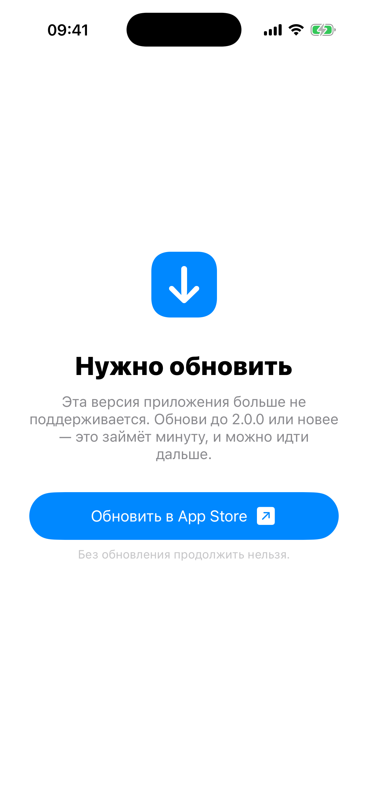

# Глава 9. Force-update + Maintenance — серверные гейты

{width=45%}

Эти два гейта решает **сервер**. Они отвечают на вопрос «можно ли
пускать пользователя в приложение прямо сейчас?». Если ответ «нет,
обновись» — показываем экран-блокатор с кнопкой «Обновить в App
Store». Это **force update** (принудительное обновление). Если ответ
«нет, у нас технические работы» — показываем экран «Возвращаемся
через 45 минут». Это **maintenance** (режим обслуживания).

От предыдущих гейтов (онбординг, разрешения, вход) эти отличаются
принципиально: они **асинхронные**. Чтобы решить, нужны ли они, мы
делаем сетевой запрос и ждём ответа. Пока запрос идёт, показываем
маленький экран загрузки.

Полный код всех экранов главы собран в разделе 9.11.

## 9.1 Зачем force-update вообще

Сервер и приложение договариваются о формате данных — это **API**
(программный интерфейс): какие адреса (endpoint'ы) у сервера, какие
поля в запросах и ответах. Иногда формат приходится менять так, что
старые версии приложения перестают его понимать. Такое изменение
называют **breaking change** («ломающее изменение»): например, поле
`price` было числом, а стало объектом `{ amount, currency }`.

Варианты, что делать со старыми версиями приложения:

1. **Поддерживать старый и новый формат одновременно.** Дорого: каждый
   endpoint живёт в двух версиях, бэкенд обрастает ветками «если
   клиент старый».
2. **Закрыть старый формат** и ждать, пока все обновятся сами. Не у
   всех включены автообновления; у кого нет — приложение начнёт
   показывать ошибки или вообще падать на непонятном ответе.
3. **Force update.** При запуске приложение спрашивает у сервера
   «удалённую конфигурацию» (remote config) и получает: «версии ниже
   2.0 не поддерживаются». Старое приложение показывает блокатор,
   человек обновляется и продолжает работать.

Force-update гейт — последний рубеж между ломающим изменением на
сервере и сломанным приложением у пользователей. Встроить его стоит
**в первую же версию**: версии без проверки остановить уже не
получится — они о ней не знают.

## 9.2 AppConfigService — мок «remote config»

В реальности конфигурация приходит сетевым запросом: собственный
endpoint `/config`, Firebase Remote Config или похожий сервис. У нас —
мок, который притворяется сервером:

```swift
enum AppConfigStatus: Sendable {
    case ok
    case forceUpdate(minVersion: String, storeURL: URL)
    case maintenance(message: String, until: Date?)
}

final class AppConfigService {
    static let shared = AppConfigService()
    private init() {}

    private var scenarios: [String: AppConfigStatus] = [:]

    func setScenario(_ status: AppConfigStatus, for manifestId: String) {
        scenarios[manifestId] = status
    }

    func fetch(for manifestId: String) async -> AppConfigStatus {
        try? await Task.sleep(nanoseconds: 400_000_000)
        return scenarios[manifestId] ?? .ok
    }
}
```

`AppConfigStatus` — три варианта ответа: всё в порядке, нужно
обновиться, технические работы. Вместе с `forceUpdate` приходят
`minVersion` (минимальная поддерживаемая версия, строка вида `"2.0.0"`)
и `storeURL` (куда ведёт кнопка). Вместе с `maintenance` — текст
`message` и необязательное `until` — когда работы закончатся.

`Sendable` у enum означает «значение можно безопасно передавать между
потоками». Для enum из строк, URL и дат Swift и так вывел бы это сам,
но явная пометка документирует намерение: ответ сервера рождается в
сетевом слое и едет в интерфейс.

`setScenario(_:for:)` нужен для **демонстрации**. Если бы мок
отвечал «обновись» всем подряд, playground перестал бы работать.
Поэтому сценарии регистрируются для конкретных mini-app по их `id`.
В `SceneDelegate` (глава 5) при старте вызывается
`AppRegistry.registerDemoConfigScenarios()`:

```swift
extension AppRegistry {
    static func registerDemoConfigScenarios() {
        let service = AppConfigService.shared
        service.setScenario(
            .forceUpdate(minVersion: "2.0.0",
                         storeURL: URL(string: "https://apps.apple.com/app/id1234567890")!),
            for: "music"
        )
        service.setScenario(
            .maintenance(message: "Обновляем серверы чата. Это ненадолго.",
                         until: Date().addingTimeInterval(45 * 60)),
            for: "chat"
        )
    }
}
```

Mini-app Music получает «обновись до 2.0.0», Chat — «технические
работы ещё 45 минут» (`45 * 60` = 2700 секунд; `addingTimeInterval`
прибавляет к текущему моменту секунды). Восклицательный знак после
`URL(string:)` здесь допустим: строка написана вручную и заведомо
корректна, упасть этот код не может. Для адреса, пришедшего из сети,
так делать нельзя. В настоящем приложении этой функции нет вовсе —
сценарий выбирает сервер.

`fetch(for:)` асинхронный: ждёт 0,4 секунды (400 миллионов
наносекунд), имитируя сеть, и возвращает зарегистрированный сценарий
или `.ok`. Сервис, как и весь наш код, работает на главном акторе —
это удобно для UIKit, и настоящий сетевой запрос через `URLSession`
всё равно выполняется в фоне без нашего участия.

> **Про 0,4 секунды.** Цифра условная — примерно столько отвечает
> лёгкий запрос по хорошей сети. На медленном мобильном интернете
> будет дольше, поэтому экран загрузки и кеш (9.10) обязательны.

## 9.3 Логика в BootCoordinator

В `BootCoordinator` (глава 4) этот гейт стоит **после** региона и
возраста, но **до** входа в аккаунт. Это те методы координатора,
которые добавляет глава:

```swift
private var configTask: Task<Void, Never>?

private func proceedAfterAgeGate() {
    if manifest.checksForceUpdate || manifest.hasMaintenanceCheck {
        checkRemoteConfig()
    } else {
        proceedAfterRemoteConfig()
    }
}

private func checkRemoteConfig() {
    let loader = RemoteConfigLoadingViewController(brandColor: manifest.brandColor)
    setRoot(loader, animated: true)
    configTask?.cancel()
    configTask = Task { [weak self, manifestId = manifest.id] in
        let status = await AppConfigService.shared.fetch(for: manifestId)
        guard let self, !Task.isCancelled else { return }
        self.apply(remoteConfig: status)
    }
}
```

Сначала ставим экран загрузки, потом запускаем асинхронный запрос.
Когда придёт ответ, `apply(remoteConfig:)` решит, что показать.

Две детали в `checkRemoteConfig` защищают от реального бага.
Представь: запрос идёт, а пользователь встряхнул телефон и вышел в
лаунчер (глава 3). Лаунчер обнуляет ссылку на координатор, тот должен
освободиться. Но если задача держит координатор **сильной** ссылкой,
через 0,4 секунды она выполнит `apply` и поставит экран «Нужно
обновить» корневым экраном окна — **поверх лаунчера**.

- `[weak self, manifestId = manifest.id]` — задача держит координатор
  слабой ссылкой, а `id` манифеста копирует заранее, чтобы для запроса
  координатор вообще не понадобился.
- `guard let self` стоит **после** `await`. Если бы он стоял первой
  строкой задачи, `self` стал бы сильной ссылкой на всё время ожидания,
  и слабый захват ничего бы не дал. После `await` проверка ловит
  случай «координатор уже освобождён».
- `configTask` хранит задачу, а `!Task.isCancelled` — вторая страховка.
  При выходе в лаунчер координатор отменяет задачу:

```swift
private func exitToLauncher() {
    configTask?.cancel()
    configTask = nil
    // ... остальное из главы 4 ...
}
```

Отмена в Swift **кооперативная**: `cancel()` не обрывает задачу, а
ставит ей флаг «тебя отменили». Наш `Task.sleep` на флаг реагирует и
заканчивается раньше, а `guard !Task.isCancelled` не даёт дойти до
`apply`. `configTask?.cancel()` в начале `checkRemoteConfig` нужен для
кнопки «Проверить ещё раз» (9.6): новая проверка отменяет старую,
если та ещё не закончилась.

Экран загрузки без него выглядел бы как «застывший» предыдущий экран
на 0,4 секунды, и человек решил бы, что приложение зависло. Со
спиннером видно, что работа идёт:

```swift
final class RemoteConfigLoadingViewController: UIViewController {
    private let brandColor: UIColor

    init(brandColor: UIColor) {
        self.brandColor = brandColor
        super.init(nibName: nil, bundle: nil)
    }

    required init?(coder: NSCoder) { fatalError("init(coder:) не используется") }

    override func viewDidLoad() {
        super.viewDidLoad()
        view.backgroundColor = .systemBackground
        let spinner = UIActivityIndicatorView(style: .medium)
        spinner.color = brandColor
        spinner.startAnimating()
        let label = UILabel()
        label.text = "Проверяем доступность…"
        label.font = .preferredFont(forTextStyle: .footnote)
        label.adjustsFontForContentSizeCategory = true
        label.textColor = .secondaryLabel
        let stack = UIStackView(arrangedSubviews: [spinner, label])
        stack.axis = .vertical
        stack.spacing = 12
        stack.alignment = .center
        stack.translatesAutoresizingMaskIntoConstraints = false
        view.addSubview(stack)
        NSLayoutConstraint.activate([
            stack.centerXAnchor.constraint(equalTo: view.centerXAnchor),
            stack.centerYAnchor.constraint(equalTo: view.centerYAnchor),
        ])
    }
}
```

Спиннер и подпись друг под другом, стек выровнен по центру экрана
двумя констрейнтами. Больше ничего: пользователь не должен успеть
здесь что-то сделать. Цвет спиннера приходит через инициализатор —
отсюда свойство `brandColor` и `init(brandColor:)`.

## 9.4 Обработка результата и сравнение версий

```swift
private func apply(remoteConfig: AppConfigStatus) {
    switch remoteConfig {
    case .ok:
        proceedAfterRemoteConfig()
    case .forceUpdate(let minVersion, let storeURL):
        guard manifest.checksForceUpdate,
              let required = AppVersion(minVersion),
              let current = AppVersion.current,
              current < required else {
            proceedAfterRemoteConfig()
            return
        }
        let vc = ForceUpdateViewController(
            brandColor: manifest.brandColor,
            minVersion: minVersion,
            storeURL: storeURL
        )
        setRoot(vc, animated: true)
    case .maintenance(let message, let until):
        guard manifest.hasMaintenanceCheck else {
            proceedAfterRemoteConfig()
            return
        }
        let vc = MaintenanceViewController(
            brandColor: manifest.brandColor,
            message: message,
            until: until,
            onRetry: { [weak self] in self?.checkRemoteConfig() }
        )
        setRoot(vc, animated: true)
    }
}
```

Блокатор обновления показывается, только если выполнены **все** три
условия в `guard`:

1. У mini-app включён флаг `checksForceUpdate`. Сервер может прислать
   force update кому угодно, но показываем мы его только тем, кому он
   нужен: офлайн-калькулятору, например, ломающие изменения API
   безразличны.
2. Обе версии удалось разобрать (`AppVersion(minVersion)` и
   `AppVersion.current` не `nil`). Если сервер прислал мусор, лучше
   пропустить человека, чем запереть его навсегда.
3. Текущая версия **меньше** минимальной. Сервер сообщает порог,
   а сравнивает клиент. Так серверу не нужно знать версию каждого
   клиента: один и тот же ответ «минимум 2.0.0» заблокирует 1.9 и
   пропустит 2.0.1.

Для maintenance логика проще — нужен только флаг `hasMaintenanceCheck`.
`onRetry` ведёт обратно в `checkRemoteConfig()`, с `[weak self]` по
той же причине, что и в 9.3.

### Почему версии нельзя сравнивать как строки

Версия приложения — строка вида `"1.10.2"`: три числа через точку
(мажорная, минорная, патч). Хочется написать `current < minVersion`
для строк, но строки сравниваются **посимвольно**, как слова в
словаре. Посмотрим на числах, что получится:

- `"1.9"` против `"1.10"`: первые два символа `1.` совпадают, дальше
  `9` против `1`. Символ `9` «больше» символа `1`, значит, строка
  `"1.9"` считается больше `"1.10"`. А по смыслу 1.9 — это версия
  **до** 1.10. Человек с 1.9 не увидит требование «обновись до 1.10».
- `"2.0.0"` против `"10.0.0"`: `2` больше `1`, строка `"2.0.0"`
  «больше» — хотя 2 меньше 10.

Встречается совет сравнивать через `compare(_:options: .numeric)` —
он сравнивает группы цифр как числа, и оба примера выше решает
правильно. Но у него своя ловушка: `"2.0".compare("2.0.0", options:
.numeric)` возвращает «меньше». Для людей 2.0 и 2.0.0 — одна и та же
версия, а блокатор покажется пользователю, у которого уже всё
обновлено. Мы проверили все эти случаи запуском.

Надёжнее разобрать версию на числа и сравнить по частям, дополняя
недостающие части нулями:

```swift
struct AppVersion: Comparable, Sendable {
    let parts: [Int]

    init?(_ string: String) {
        var parts: [Int] = []
        for piece in string.split(separator: ".", omittingEmptySubsequences: false) {
            guard let number = Int(piece), number >= 0 else { return nil }
            parts.append(number)
        }
        guard !parts.isEmpty else { return nil }
        self.parts = parts
    }

    static func < (lhs: AppVersion, rhs: AppVersion) -> Bool {
        let count = max(lhs.parts.count, rhs.parts.count)
        for i in 0..<count {
            let l = i < lhs.parts.count ? lhs.parts[i] : 0
            let r = i < rhs.parts.count ? rhs.parts[i] : 0
            if l != r { return l < r }
        }
        return false
    }

    static func == (lhs: AppVersion, rhs: AppVersion) -> Bool {
        !(lhs < rhs) && !(rhs < lhs)
    }

    static var current: AppVersion? {
        let string = Bundle.main.object(forInfoDictionaryKey: "CFBundleShortVersionString") as? String
        return string.flatMap(AppVersion.init)
    }
}
```

Как это работает:

- `init?` режет строку по точкам и превращает каждый кусок в `Int`.
  Если кусок не число (`"1.0-beta"`) или пустой (`"1..2"`,
  `omittingEmptySubsequences: false` сохраняет пустые куски, чтобы их
  поймать), инициализатор возвращает `nil` — такую версию мы не
  понимаем.
- `<` идёт по позициям слева направо. Для `1.9` и `1.10`: части
  `[1, 9]` и `[1, 10]`, первая позиция 1 = 1, вторая 9 < 10 —
  ответ «меньше», верно. Для `2.0` и `2.0.0`: части `[2, 0]` и
  `[2, 0, 0]`, недостающая третья часть считается нулём, все позиции
  равны — «не меньше», а `==` даёт «равны». Верно.
- `Comparable` требует только `<`; остальные операторы (`>`, `<=`,
  `>=`) Swift выводит сам. `==` мы задали вручную, иначе Swift
  сравнил бы массивы `[2, 0]` и `[2, 0, 0]` напрямую и счёл бы их
  разными.
- `current` читает версию приложения из `Info.plist` по ключу
  `CFBundleShortVersionString`. Это «маркетинговая» версия — та, что
  видна в App Store (`2.0.1`). Есть ещё `CFBundleVersion` — номер
  сборки (build number), он растёт при каждой загрузке в App Store
  Connect и для этой проверки не подходит.

Проверенные запуском результаты:

| Сравнение | Строки `<` | `.numeric` | `AppVersion` |
|---|---|---|---|
| `1.9` и `1.10` | 1.9 больше (неверно) | меньше | меньше |
| `2.0.0` и `10.0.0` | 2.0.0 больше (неверно) | меньше | меньше |
| `2.0` и `2.0.0` | меньше (неверно) | меньше (неверно) | равны |
| `1.2.3` и `1.2` | больше | больше | больше |

**Упражнение 9.1.** Добавь в `AppVersion` поддержку версий с суффиксом
вроде `"2.1.0-beta"`: суффикс отбрасывается, сравниваются только числа.
Проверь, что `AppVersion("2.1.0-beta")! < AppVersion("2.1.1")!` даёт
`true`. Ответ — в конце главы.

## 9.5 ForceUpdateViewController — блокирующий

```swift
final class ForceUpdateViewController: UIViewController {
    private let brandColor: UIColor
    private let minVersion: String
    private let storeURL: URL

    init(brandColor: UIColor, minVersion: String, storeURL: URL) {
        self.brandColor = brandColor
        self.minVersion = minVersion
        self.storeURL = storeURL
        super.init(nibName: nil, bundle: nil)
    }

    required init?(coder: NSCoder) { fatalError("init(coder:) не используется") }

    override func viewDidLoad() {
        super.viewDidLoad()
        view.backgroundColor = .systemBackground
        setupLayout()
    }

    private func setupLayout() {
        let stack = makeGateStack(
            symbol: "arrow.down.app.fill",
            color: brandColor,
            title: "Нужно обновить",
            body: "Эта версия приложения больше не поддерживается. "
                + "Обнови до \(minVersion) или новее — это займёт минуту."
        )
        let updateButton = UIButton(configuration: makeUpdateConfig())
        updateButton.addTarget(self, action: #selector(updateTapped), for: .touchUpInside)

        let noteLabel = UILabel()
        noteLabel.text = "Без обновления продолжить нельзя."
        noteLabel.font = .preferredFont(forTextStyle: .footnote)
        noteLabel.adjustsFontForContentSizeCategory = true
        noteLabel.textColor = .secondaryLabel
        noteLabel.textAlignment = .center

        stack.addArrangedSubview(updateButton)
        stack.addArrangedSubview(noteLabel)
        stack.translatesAutoresizingMaskIntoConstraints = false
        view.addSubview(stack)
        NSLayoutConstraint.activate([
            stack.centerYAnchor.constraint(equalTo: view.safeAreaLayoutGuide.centerYAnchor),
            stack.leadingAnchor.constraint(equalTo: view.layoutMarginsGuide.leadingAnchor, constant: 16),
            stack.trailingAnchor.constraint(equalTo: view.layoutMarginsGuide.trailingAnchor, constant: -16),
        ])
    }

    @objc private func updateTapped() {
        UIApplication.shared.open(storeURL)
    }
}
```

Иконка, заголовок и текст собираются общей функцией
`makeGateStack` — она же пригодится экрану обслуживания (полный код —
в 9.11). Под ними — кнопка и мелкая приписка.

Никаких «продолжить позже». Одна кнопка — «Обновить в App Store».
Тап вызывает `UIApplication.shared.open(storeURL)`: система открывает
ссылку. Ссылка вида `https://apps.apple.com/app/id1234567890`, где
число — Apple ID приложения из App Store Connect, на iPhone
открывается сразу в приложении App Store. В симуляторе приложения App
Store нет, поэтому там ссылка откроется в Safari; проверять переход
в магазин нужно на устройстве. Встречается и схема
`itms-apps://`, но обычная `https://`-ссылка работает везде.

Если хочется показать страницу приложения, не выходя из него, есть
`SKStoreProductViewController` из StoreKit: он открывает карточку App
Store прямо поверх твоего экрана.

Кнопка — `UIButton.Configuration.filled()` со стрелкой справа:

```swift
private func makeUpdateConfig() -> UIButton.Configuration {
    var cfg = UIButton.Configuration.filled()
    cfg.title = "Обновить в App Store"
    cfg.image = UIImage(systemName: "arrow.up.right.square.fill")
    cfg.imagePlacement = .trailing
    cfg.imagePadding = 8
    cfg.cornerStyle = .capsule
    cfg.baseBackgroundColor = brandColor
    cfg.baseForegroundColor = .white
    cfg.contentInsets = NSDirectionalEdgeInsets(top: 14, leading: 24, bottom: 14, trailing: 24)
    return cfg
}
```

- `imagePlacement = .trailing` ставит иконку **после** текста.
  «Trailing» — «со стороны конца строки»: в русском это справа, а в
  арабском интерфейсе система сама перенесёт иконку влево. Стрелка
  вверх-вправо намекает, что откроется что-то внешнее.
- `imagePadding = 8` — 8 точек между текстом и иконкой.
- `cornerStyle = .capsule` — скругление радиусом в половину высоты:
  кнопка превращается в «таблетку».
- `baseBackgroundColor` / `baseForegroundColor` — цвет заливки и
  текста.
- `contentInsets` — внутренние отступы: по 14 точек сверху и снизу,
  по 24 — слева и справа. `NSDirectionalEdgeInsets` тоже говорит
  `leading` / `trailing`, а не `left` / `right`, по той же причине.

## 9.6 MaintenanceViewController — с таймером и повтором

Maintenance отличается двумя вещами:

1. **Обратный отсчёт.** Если сервер прислал `until`, показываем
   «Возвращаемся через ~44 мин 59 с» и обновляем каждую секунду.
2. **Кнопка «Проверить ещё раз».** Работы иногда заканчиваются
   раньше; не заставляй человека перезапускать приложение.

Таймер:

```swift
private var timer: Timer?

override func viewWillAppear(_ animated: Bool) {
    super.viewWillAppear(animated)
    startCountdown()
}

override func viewDidDisappear(_ animated: Bool) {
    super.viewDidDisappear(animated)
    timer?.invalidate()
    timer = nil
}

private func startCountdown() {
    guard let until else {
        countdownLabel.isHidden = true
        return
    }
    timer?.invalidate()
    updateCountdown(until: until)
    timer = Timer.scheduledTimer(withTimeInterval: 1, repeats: true) { [weak self] _ in
        MainActor.assumeIsolated {
            self?.updateCountdown(until: until)
        }
    }
}

private func updateCountdown(until: Date) {
    let remaining = until.timeIntervalSinceNow
    if remaining <= 0 {
        countdownLabel.text = "Похоже, работы завершены — проверь ещё раз."
        timer?.invalidate()
        timer = nil
        return
    }
    countdownLabel.text = "Возвращаемся через ~\(formatter.string(from: remaining) ?? "—")"
}
```

Разберём.

**Когда запускать и останавливать.** Таймер стартует в
`viewWillAppear` (экран вот-вот появится) и останавливается в
`viewDidDisappear` (экран ушёл). Отсчёт нужен, только пока его видно.
`timer?.invalidate()` перед созданием нового — защита от двух таймеров
сразу, если экран появится повторно.

**Почему `[weak self]`.** `Timer.scheduledTimer` регистрирует таймер в
**run loop** — цикле событий главного потока, который крутится всё
время жизни приложения. Run loop держит таймер, таймер держит
замыкание. Если бы замыкание держало `self` сильно, экран не
освободился бы никогда, даже после ухода с него: цепочка «run loop →
таймер → замыкание → экран» не рвётся сама. С `[weak self]` экран
освобождается, а остановку таймера мы делаем явно в
`viewDidDisappear`.

**Зачем `MainActor.assumeIsolated`.** Замыкание таймера для
компилятора — обычное, не привязанное к главному актору, а
`updateCountdown` принадлежит главному актору (как весь класс).
Swift 6 предупреждает о таком вызове: «вызов метода главного актора
из неизолированного контекста». Мы знаем, что таймер, созданный
`scheduledTimer` на главном потоке, срабатывает на главном потоке.
`MainActor.assumeIsolated { ... }` сообщает это компилятору: «я уже на
главном акторе, выполняй». Если обещание окажется ложным, приложение
остановится с понятной ошибкой, а не испортит данные тихо.
`assumeIsolated` доступен с iOS 13, подходит для нашего iOS 15.

**Отсчёт на числах.** `until.timeIntervalSinceNow` — сколько секунд
осталось до `until`. Для «45 минут от старта» в первую секунду это
2699,9…; когда время вышло, число становится нулём или отрицательным —
тогда пишем «Похоже, работы завершены» и останавливаем таймер.

**`DateComponentsFormatter`** — форматтер длительностей из Foundation.
Он превращает секунды в текст на языке устройства:

```swift
private let formatter: DateComponentsFormatter = {
    let f = DateComponentsFormatter()
    f.allowedUnits = [.hour, .minute, .second]
    f.unitsStyle = .abbreviated
    return f
}()
```

`allowedUnits` — какие единицы использовать, `unitsStyle =
.abbreviated` — сокращения. Проверено запуском: 2699 секунд на
русском дают «44 мин 59 с», 3723 секунды — «1 ч 2 мин 3 с», на
английском — «1h 2m 3s». Склонять «минута / минуты / минут» самим не
нужно. Форматтер создаётся один раз и хранится в свойстве: создавать
его каждую секунду заново — лишняя работа.

Кнопка повтора:

```swift
@objc private func retryTapped() {
    var cfg = retryButton.configuration
    cfg?.showsActivityIndicator = true
    cfg?.title = "Проверяем…"
    retryButton.configuration = cfg
    retryButton.isEnabled = false
    onRetry()
}
```

Кнопка показывает спиннер, выключается (защита от серии тапов) и
зовёт `onRetry` — замыкание от координатора, которое ведёт обратно в
`checkRemoteConfig()`. Координатор ставит экран загрузки, снова
спрашивает сервер. Если работы ещё идут — появится новый экран
обслуживания. Если закончились — цепочка пойдёт дальше, к входу и
главному экрану.

## 9.7 Что считать «hard» и «soft» update

Наш force update — **жёсткий** (hard): одна кнопка, обойти нельзя. В
реальности бывают и мягкие варианты:

- **Рекомендованное обновление** — окно с двумя кнопками: «Обновить»
  и «Напомнить позже». Старой версией пока можно пользоваться.
- **Ненавязчивое** — баннер в углу «Доступна новая версия»,
  ничего не блокирует.
- **Смешанное** — мягкое до определённой даты («старая версия
  поддерживается ещё две недели»), потом жёсткое.

В playground'е — жёсткий вариант для простоты. В настоящем
приложении выбор зависит от того, что случилось:

- сервер больше не понимает старые версии → жёсткий;
- появилась новая функция, без которой можно жить → мягкий;
- обновился дизайн без изменений API → ненавязчивый или никакой:
  автообновления сделают своё дело.

Для мягкого варианта в `AppConfigStatus` добавляют ещё один случай,
например `.recommendUpdate(latestVersion: String, storeURL: URL)`, и
экран с кнопкой «Позже», которая ведёт дальше по цепочке.

## 9.8 Demo-сценарии в реестре

Чтобы увидеть оба экрана, `registerDemoConfigScenarios` из 9.2
регистрирует сценарии для Music (force update до 2.0.0) и Chat
(обслуживание 45 минут). Но сервер — это только половина: экран
покажется, если у mini-app в манифесте включён соответствующий флаг.

```swift
var m = AppManifest.placeholder(id: "music", name: "Музыка",
                                subtitle: "AVPlayer", symbolName: "music.note",
                                brandColor: .systemRed)
m.checksForceUpdate = true
```

И ещё одно условие для force update из 9.4: версия приложения должна
быть **меньше** 2.0.0. У нового проекта в Xcode версия по умолчанию
1.0 (поле **Version** на вкладке **General** настроек таргета), так
что условие выполняется.

**Упражнение 9.2.** Включи Music флаг `checksForceUpdate = true`.
Зайди в Music: сначала splash, потом на 0,4 секунды экран загрузки,
потом «Нужно обновить». Тапни «Обновить в App Store». Встряхни
симулятор (⌃⌘Z), чтобы вернуться в лаунчер. Теперь поменяй версию
приложения на 2.0 в настройках таргета и запусти снова. Что покажет
Music и почему? Ответ — в конце главы.

## 9.9 Бытовая аналогия

Force update — **техосмотр автомобиля**. Приезжаешь на стоянку
торгового центра, а охрана говорит: «у машины просрочен техосмотр,
сюда нельзя». Вариант один — пройти техосмотр (обновить приложение).
Поэтому экран блокирующий.

Maintenance — **табличка «Закрыто на инвентаризацию» на двери
магазина**. Дверь заперта на 45 минут: сходи за кофе, возвращайся.
Иногда инвентаризация заканчивается раньше, и табличку снимают — но
чтобы это заметить, нужно подёргать дверь. Это наша кнопка «Проверить
ещё раз».

## 9.10 Кеширование remote-config

В нашей реализации каждый вход в mini-app делает свежий запрос. В
реальности конфигурация меняется редко — раз в день или реже.
Стандартный приём:

- хранить последний ответ вместе с временем получения;
- при запуске, если ответу меньше N минут (например, 5), брать его из
  кеша без ожидания;
- иначе — запрашивать сервер и обновлять кеш.

Реализация — порядка 30 строк поверх `AppConfigService`: ответ
кодируется в JSON и кладётся в `UserDefaults` вместе с датой. Если
сервер недоступен, а кеш есть — разумно взять кеш, даже старый:
лучше пустить человека, чем показать «нет сети» на ровном месте.

В книге кеш не делаем, но в production он нужен: без него каждый
запуск ждёт сеть.

## 9.11 Экраны целиком

Все типы главы в одном файле. `AppManifest` — из главы 2, методы
координатора — в 9.3 и 9.4, `AppVersion` и `AppConfigService` — выше.

```swift
import UIKit

func makeGateStack(symbol: String, color: UIColor, title: String, body: String) -> UIStackView {
    let icon = UIImageView(image: UIImage(systemName: symbol))
    icon.tintColor = color
    icon.preferredSymbolConfiguration = UIImage.SymbolConfiguration(pointSize: 64, weight: .semibold)
    let titleLabel = UILabel()
    titleLabel.text = title
    titleLabel.font = .preferredFont(forTextStyle: .title2)
    titleLabel.adjustsFontForContentSizeCategory = true
    titleLabel.textAlignment = .center
    titleLabel.numberOfLines = 0
    let bodyLabel = UILabel()
    bodyLabel.text = body
    bodyLabel.font = .preferredFont(forTextStyle: .body)
    bodyLabel.adjustsFontForContentSizeCategory = true
    bodyLabel.textColor = .secondaryLabel
    bodyLabel.textAlignment = .center
    bodyLabel.numberOfLines = 0
    let stack = UIStackView(arrangedSubviews: [icon, titleLabel, bodyLabel])
    stack.axis = .vertical
    stack.alignment = .center
    stack.spacing = 16
    return stack
}

final class MaintenanceViewController: UIViewController {
    private let brandColor: UIColor
    private let message: String
    private let until: Date?
    private let onRetry: () -> Void

    private let countdownLabel = UILabel()
    private let retryButton = UIButton(configuration: .gray())
    private var timer: Timer?

    private let formatter: DateComponentsFormatter = {
        let f = DateComponentsFormatter()
        f.allowedUnits = [.hour, .minute, .second]
        f.unitsStyle = .abbreviated
        return f
    }()

    init(brandColor: UIColor, message: String, until: Date?, onRetry: @escaping () -> Void) {
        self.brandColor = brandColor
        self.message = message
        self.until = until
        self.onRetry = onRetry
        super.init(nibName: nil, bundle: nil)
    }

    required init?(coder: NSCoder) { fatalError("init(coder:) не используется") }

    override func viewDidLoad() {
        super.viewDidLoad()
        view.backgroundColor = .systemBackground
        let stack = makeGateStack(symbol: "wrench.and.screwdriver.fill", color: brandColor,
                                  title: "Технические работы", body: message)
        countdownLabel.font = .monospacedDigitSystemFont(ofSize: 17, weight: .medium)
        countdownLabel.textAlignment = .center
        countdownLabel.numberOfLines = 0
        var cfg = UIButton.Configuration.gray()
        cfg.title = "Проверить ещё раз"
        retryButton.configuration = cfg
        retryButton.addTarget(self, action: #selector(retryTapped), for: .touchUpInside)
        stack.addArrangedSubview(countdownLabel)
        stack.addArrangedSubview(retryButton)
        stack.translatesAutoresizingMaskIntoConstraints = false
        view.addSubview(stack)
        NSLayoutConstraint.activate([
            stack.centerYAnchor.constraint(equalTo: view.safeAreaLayoutGuide.centerYAnchor),
            stack.leadingAnchor.constraint(equalTo: view.layoutMarginsGuide.leadingAnchor, constant: 16),
            stack.trailingAnchor.constraint(equalTo: view.layoutMarginsGuide.trailingAnchor, constant: -16),
        ])
    }

    override func viewWillAppear(_ animated: Bool) {
        super.viewWillAppear(animated)
        startCountdown()
    }

    override func viewDidDisappear(_ animated: Bool) {
        super.viewDidDisappear(animated)
        timer?.invalidate()
        timer = nil
    }

    private func startCountdown() {
        guard let until else {
            countdownLabel.isHidden = true
            return
        }
        timer?.invalidate()
        updateCountdown(until: until)
        timer = Timer.scheduledTimer(withTimeInterval: 1, repeats: true) { [weak self] _ in
            MainActor.assumeIsolated {
                self?.updateCountdown(until: until)
            }
        }
    }

    private func updateCountdown(until: Date) {
        let remaining = until.timeIntervalSinceNow
        if remaining <= 0 {
            countdownLabel.text = "Похоже, работы завершены — проверь ещё раз."
            timer?.invalidate()
            timer = nil
            return
        }
        countdownLabel.text = "Возвращаемся через ~\(formatter.string(from: remaining) ?? "—")"
    }

    @objc private func retryTapped() {
        var cfg = retryButton.configuration
        cfg?.showsActivityIndicator = true
        cfg?.title = "Проверяем…"
        retryButton.configuration = cfg
        retryButton.isEnabled = false
        onRetry()
    }
}
```

Пара деталей, которых не было в разделах:

- `monospacedDigitSystemFont` — системный шрифт, в котором все цифры
  одной ширины. Без него при отсчёте «44 мин 59 с» → «44 мин 58 с»
  текст подёргивался бы: у обычного шрифта «1» уже, чем «8».
- `ForceUpdateViewController` целиком приведён в 9.5, а
  `makeUpdateConfig()` — сразу после него; в файле они идут подряд.

## Ответы к упражнениям

**9.1.** Отрезаем всё после первого `-` до разбора:

```swift
init?(_ string: String) {
    let numeric = string.split(separator: "-", maxSplits: 1).first.map(String.init) ?? string
    var parts: [Int] = []
    for piece in numeric.split(separator: ".", omittingEmptySubsequences: false) {
        guard let number = Int(piece), number >= 0 else { return nil }
        parts.append(number)
    }
    guard !parts.isEmpty else { return nil }
    self.parts = parts
}
```

`"2.1.0-beta"` превращается в `"2.1.0"`, части `[2, 1, 0]`; против
`[2, 1, 1]` на третьей позиции 0 < 1 — `true`. Для пустой строки
`split` вернёт пустой массив, `.first` будет `nil`, сработает
`?? string`, и дальше `Int("")` вернёт `nil` — как и раньше.

**9.2.** Music откроется без блокатора. Сервер по-прежнему отвечает
«минимум 2.0.0», но `AppVersion("2.0")` и `AppVersion("2.0.0")` равны,
условие `current < required` ложно, и `apply` уходит в
`proceedAfterRemoteConfig()`. Со строковым сравнением через
`.numeric` блокатор показался бы и здесь.

## Что мы выучили

- Force update и maintenance — **серверные** гейты: чтобы решить, что
  показывать, нужен сетевой запрос.
- Пока запрос идёт, показываем экран загрузки
  (`RemoteConfigLoadingViewController`).
- Асинхронная задача координатора держит его слабо, `guard let self`
  стоит после `await`, а при выходе в лаунчер задача отменяется —
  иначе поздний ответ сервера перекроет лаунчер.
- `AppConfigStatus` — enum с тремя случаями: `.ok`, `.forceUpdate`,
  `.maintenance`, каждый со своими данными.
- Гейт показывается, только если в манифесте включён нужный флаг.
- Версии сравниваем по числам, дополняя недостающие части нулями:
  `1.9 < 1.10`, `2.0 == 2.0.0`. Строки и `.numeric` здесь ошибаются.
- Версия приложения — `CFBundleShortVersionString`, а не
  `CFBundleVersion` (номер сборки).
- Force update — **блокирующий** экран с одной кнопкой
  `UIApplication.shared.open(storeURL)`.
- Maintenance — отсчёт на `Timer` с `[weak self]`, остановкой в
  `viewDidDisappear` и `MainActor.assumeIsolated`, плюс кнопка
  повтора.
- `DateComponentsFormatter` форматирует длительность на языке
  устройства: «44 мин 59 с».
- В production ответ remote config кешируют.

## Apple Developer Documentation

- [Human Interface Guidelines — Patterns](https://developer.apple.com/design/human-interface-guidelines/patterns) — раздел о типовых сценариях, в том числе запуске приложения: блокирующий экран оправдан, только когда без него приложение не может работать.
- [`Bundle.main`](https://developer.apple.com/documentation/foundation/bundle/main) — доступ к `Info.plist` приложения; отсюда читаем текущую версию.
- [`CFBundleShortVersionString`](https://developer.apple.com/documentation/bundleresources/information_property_list/cfbundleshortversionstring) — «маркетинговая» версия («1.2.3»); с ней и сравниваем `minVersion`, а не с `CFBundleVersion` (номер сборки).
- [`URLSession`](https://developer.apple.com/documentation/foundation/urlsession) — настоящий remote config обычно запрашивают через `URLSession.shared.data(for:)`; наш мок повторяет ту же async-форму.
- [`UIApplication.open(_:options:completionHandler:)`](https://developer.apple.com/documentation/uikit/uiapplication/open(_:options:completionhandler:)) — открывает ссылку `https://apps.apple.com/...` в App Store.
- [`SKStoreProductViewController`](https://developer.apple.com/documentation/storekit/skstoreproductviewcontroller) — карточка приложения из App Store поверх своего экрана, без выхода из приложения.
- [`Timer.scheduledTimer(withTimeInterval:repeats:block:)`](https://developer.apple.com/documentation/foundation/timer/scheduledtimer(withtimeinterval:repeats:block:)) — таймер для отсчёта; `[weak self]` и явный `invalidate()`.
- [`DateComponentsFormatter`](https://developer.apple.com/documentation/foundation/datecomponentsformatter) — форматирует длительности с учётом языка («1 ч 2 мин 3 с»).
- [`OperationQueue`](https://developer.apple.com/documentation/foundation/operationqueue) — старая альтернатива async/await, если сетевой слой проекта построен на `Operation`.

→ [Глава 10. Region + Age gates — фильтры по локации и возрасту](./14-region-language.md)
