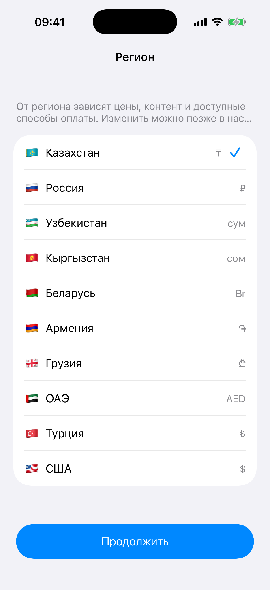

# Глава 10. Region + Age gates — фильтры по локации и возрасту

{width=45%}

Эти два гейта объединены в одну главу, потому что они похожи по
структуре:

- Оба показываются **один раз** (как onboarding) — сохраняем выбор в
  UserDefaults, больше не спрашиваем.
- Оба собирают данные **до** того, как пользователь увидит main.
- Оба могут **заблокировать** доступ (age gate — если слишком юн;
  region — теоретически если регион не поддерживается, у нас этого
  пока нет).

Но есть и **принципиальное отличие** от других гейтов: у age gate
**два** callback'а — `onPass` и `onTooYoung`. Координатор по-разному
реагирует на каждый.

В этой главе разбираем оба.

## 10.1 Region picker

Зачем нужен. От региона часто зависят:

- **Валюта** в ценниках.
- **Контент** — какие фильмы / песни / товары доступны.
- **Способы оплаты** — какой-то регион не поддерживает Apple Pay,
  только карта.
- **Законы** — GDPR в ЕС, COPPA в США, и так далее.

Если ты можешь определить регион **автоматически** — лучше так. iOS
даёт `Locale.current.region` (iOS 16+) или `regionCode` (раньше).
Если автоматики недостаточно (например, человек путешествует и
телефон в роуминге), даём явный picker.

В нашем playground'е — явный picker с списком стран:

```swift
struct Region: Hashable, Sendable {
    let code: String   // ISO 3166-1 alpha-2
    let name: String
    let flag: String   // emoji-флаг
    let currency: String

    static let all: [Region] = [
        Region(code: "KZ", name: "Казахстан", flag: "🇰🇿", currency: "₸"),
        Region(code: "RU", name: "Россия", flag: "🇷🇺", currency: "₽"),
        Region(code: "UZ", name: "Узбекистан", flag: "🇺🇿", currency: "сум"),
        // ...
    ]
}
```

Сохранение в UserDefaults через `RegionStorage`:

```swift
@MainActor
final class RegionStorage {
    static let shared = RegionStorage()
    private init() {}

    private func key(for manifestId: String) -> String {
        "region.selected.\(manifestId)"
    }

    func region(for manifestId: String) -> Region? {
        guard let code = UserDefaults.standard.string(forKey: key(for: manifestId)) else { return nil }
        return Region.all.first { $0.code == code }
    }

    func setRegion(_ region: Region, for manifestId: String) {
        UserDefaults.standard.set(region.code, forKey: key(for: manifestId))
    }

    func reset(for manifestId: String) {
        UserDefaults.standard.removeObject(forKey: key(for: manifestId))
    }
}
```

Ключ per-manifest: `region.selected.music`, `region.selected.weather`.
В реальном приложении регион обычно один на всё, не per-feature, но
в playground'е каждое mini-app независимо — поэтому per-id.

Храним только `code` («KZ»). При чтении ищем `Region.all.first { $0.code
== code }`. Если код не найден — `nil` (например, мы убрали страну из
списка после релиза). Это защита от мусорных данных.

## 10.2 Auto-guess из системной локали

При показе picker'а делаем дефолтный выбор — по системному региону:

```swift
private func guessDefaultRegion() {
    let code: String?
    if #available(iOS 16, *) {
        code = Locale.current.region?.identifier
    } else {
        code = Locale.current.regionCode
    }
    if let code, let match = regions.first(where: { $0.code == code }) {
        selected = match
    }
    tableView.reloadData()
    updateContinueState()
}
```

`Locale.current.region` появился в iOS 16. Раньше был `regionCode`.
Через `@available` проверку поддерживаем оба пути.

Если код не нашёлся в списке (например, телефон настроен на Польшу,
а у нас Польши нет) — `selected` остаётся `nil`, пользователь должен
выбрать вручную. Кнопка «Продолжить» становится disabled, пока выбор
не сделан.

> 💡 **Дефолт ≠ автомат.** Мы **подсвечиваем** угаданный регион, но
> не подтверждаем его за пользователя. Пользователь видит, что мы
> угадали, и одним тапом подтверждает или меняет. Это лучше, чем
> «угадал → сохранил без спроса». Особенно для путешественников.

## 10.3 Picker — UITableView с галочкой

Реализация — `UITableView` в стиле `.insetGrouped`, на каждой строке
emoji-флаг + название + валюта. Выбранная строка получает галочку
(`accessoryType = .checkmark`):

```swift
extension RegionPickerViewController: UITableViewDataSource, UITableViewDelegate {
    func tableView(_ tableView: UITableView, numberOfRowsInSection section: Int) -> Int {
        regions.count
    }

    func tableView(_ tableView: UITableView, cellForRowAt indexPath: IndexPath) -> UITableViewCell {
        let cell = tableView.dequeueReusableCell(withIdentifier: "cell", for: indexPath)
        let region = regions[indexPath.row]
        var content = cell.defaultContentConfiguration()
        content.text = "\(region.flag)  \(region.name)"
        content.secondaryText = region.currency
        content.prefersSideBySideTextAndSecondaryText = true
        cell.contentConfiguration = content
        cell.accessoryType = (selected?.code == region.code) ? .checkmark : .none
        cell.tintColor = brandColor
        return cell
    }

    func tableView(_ tableView: UITableView, didSelectRowAt indexPath: IndexPath) {
        tableView.deselectRow(at: indexPath, animated: true)
        selected = regions[indexPath.row]
        tableView.reloadData()
        updateContinueState()
    }
}
```

`UIListContentConfiguration` (iOS 14+) — современный способ задавать
содержимое ячейки. Поля `text`, `secondaryText`, `image`,
`imageProperties`, `textProperties` дают полный контроль. До этого
делали через `UITableViewCell(style: .value1)` и допиливание subviews.

`prefersSideBySideTextAndSecondaryText = true` — текст и валюта в
**одну строку**, не друг под другом. Имя слева, валюта справа.

`accessoryType = .checkmark` — стандартная иконка-галочка от iOS,
цвет которой берётся из `tintColor` ячейки. Мы ставим
`tintColor = brandColor` — галочка цвета mini-app.

`didSelectRow` — изменили `selected`, перерисовали таблицу (чтобы
галочка переехала), обновили `Continue`-кнопку.

> 🛠 **Упражнение.** Открой Music mini-app (у него
> `requiresRegionPick = true` в манифесте). Увидишь сразу после
> splash'а экран «Выбери регион». Тапни «Казахстан», потом
> «Продолжить». Зайди в Music снова — picker уже **не покажется**,
> потому что регион сохранён в UserDefaults.

## 10.4 Age gate

Зачем нужен. Apple App Store требует, чтобы приложения с возрастным
ограничением имели **гейт**:

- 12+ — насилие, секс, азартные игры.
- 17+ — алкоголь / наркотики / порнография.
- 4+ — мультики, головоломки.

Если ты вешаешь рейтинг 17+ при review, **обязан** показывать
age gate. Иначе reject.

Структура нашего гейта:

```swift
final class AgeGateViewController: UIViewController {
    private let manifestId: String
    private let brandColor: UIColor
    private let minAge: Int
    private let onPass: () -> Void
    private let onTooYoung: () -> Void

    init(manifestId: String,
         brandColor: UIColor,
         minAge: Int,
         onPass: @escaping () -> Void,
         onTooYoung: @escaping () -> Void) {
        // ...
    }
}
```

Главное — **два** callback'а:

- `onPass` — возраст ≥ minAge. Идём дальше.
- `onTooYoung` — возраст < minAge. Возвращаемся в лаунчер.

Это пример **гейта с несколькими выходами** (мы это упоминали в Главе 4).

## 10.5 UIDatePicker — `.wheels` стиль

```swift
datePicker.datePickerMode = .date
datePicker.preferredDatePickerStyle = .wheels
datePicker.maximumDate = Date()
// Дефолт — 20 лет назад, чтобы не пугать «слишком молодыми».
datePicker.date = Calendar.current.date(byAdding: .year, value: -20, to: Date()) ?? Date()
datePicker.addTarget(self, action: #selector(dateChanged), for: .valueChanged)
```

Три настройки:

- `datePickerMode = .date` — только дата, без времени.
- `preferredDatePickerStyle = .wheels` — три крутящихся барабана (день,
  месяц, год). С iOS 14 дефолт — `.compact` или `.inline`, что для
  age gate не идеально (выбор года клавиатурой утомителен).
- `maximumDate = Date()` — нельзя выбрать **будущее** (родился в 2030
  году звучит странно).

Дефолтная дата — 20 лет назад. Можно было поставить просто `Date()`
(сегодня), но тогда «возраст 0 лет» — невнятный сигнал. 20 лет —
безопасный середняк.

`dateChanged` зовётся при каждом провороте барабана. В нём
пересчитываем возраст и обновляем подпись:

```swift
@objc private func dateChanged() {
    updateAgeLabel()
}

private func updateAgeLabel() {
    let years = AgeStorage.shared.ageYears(for: datePicker.date)
    ageLabel.text = "Тебе \(years) " + russianYearsSuffix(years)
}
```

## 10.6 Русский плюрал — год / года / лет

Маленькая, но важная деталь. На английском хватает двух форм:
`1 year`, `2 years`. На русском — три: «1 год», «2 года», «5 лет».

```swift
private func russianYearsSuffix(_ years: Int) -> String {
    let mod100 = years % 100
    let mod10 = years % 10
    if mod100 >= 11 && mod100 <= 14 { return "лет" }
    switch mod10 {
    case 1: return "год"
    case 2, 3, 4: return "года"
    default: return "лет"
    }
}
```

Правила:

- **11-14** → «лет» (11 лет, 12 лет, 13 лет, 14 лет — исключения).
- Остальные числа смотрим по последней цифре:
  - 1 → «год» (1, 21, 31...).
  - 2, 3, 4 → «года» (2, 3, 4, 22, 23, 24...).
  - 0, 5–9 → «лет» (0, 5, 10, 15, 20...).

В iOS 15+ есть `inflect()` API для AttributedString — Apple обещает
правильный плюрал для всех языков, но честно говоря, для русского
там пока не очень. Своя функция надёжнее.

Если у тебя в приложении много плюралов — лучше вынеси такую функцию
в `Common/` и переиспользуй. Не делай отдельную в каждом VC.

## 10.7 «Слишком юн» — блокирующее состояние

При тапе «Подтвердить»:

```swift
@objc private func confirmTapped() {
    let years = AgeStorage.shared.ageYears(for: datePicker.date)
    if years < minAge {
        showBlocker()
    } else {
        AgeStorage.shared.setBirthDate(datePicker.date, for: manifestId)
        onPass()
    }
}
```

Если возраст в порядке — сохраняем дату в UserDefaults и зовём
`onPass`. Если меньше — `showBlocker()`.

`showBlocker` **не** меняет root, не показывает alert. Он
**перерисовывает** текущий VC в блокирующее состояние:

```swift
private func showBlocker() {
    inBlockedState = true

    let icon = UIImageView(image: UIImage(systemName: "hand.raised.fill"))
    icon.tintColor = .systemRed
    // ...

    let titleLabel = UILabel()
    titleLabel.text = "К сожалению, рано"

    let bodyLabel = UILabel()
    bodyLabel.text = "Это приложение для пользователей от \(minAge) лет. Возвращайся позже!"

    // ... кнопка «Вернуться в лаунчер» → onTooYoung()

    for v in blockerStack.arrangedSubviews { v.removeFromSuperview() }
    blockerStack.addArrangedSubview(icon)
    blockerStack.addArrangedSubview(titleLabel)
    blockerStack.addArrangedSubview(bodyLabel)
    blockerStack.addArrangedSubview(exitButton)
    blockerStack.isHidden = false

    view.subviews.forEach { v in
        if v != blockerStack { v.isHidden = true }
    }
}
```

Прячем **все** subview view'а (date picker, кнопка «Подтвердить»,
надписи), кроме `blockerStack`, который содержит «рано» + кнопку
выхода. Получаем визуальный «переход» без перезагрузки VC.

Можно было бы заменить root окна на отдельный VC, но это лишнее:
блокирующее состояние — частный случай age-gate'а, логически он
там же.

## 10.8 Date storage и сохранение

```swift
@MainActor
final class AgeStorage {
    static let shared = AgeStorage()
    private init() {}

    private func key(for manifestId: String) -> String {
        "agegate.birthday.\(manifestId)"
    }

    func birthDate(for manifestId: String) -> Date? {
        UserDefaults.standard.object(forKey: key(for: manifestId)) as? Date
    }

    func setBirthDate(_ date: Date, for manifestId: String) {
        UserDefaults.standard.set(date, forKey: key(for: manifestId))
    }

    func ageYears(for date: Date, now: Date = Date()) -> Int {
        Calendar.current.dateComponents([.year], from: date, to: now).year ?? 0
    }
}
```

`UserDefaults` поддерживает `Date` напрямую — никаких кодирования через
ISO-string не надо. Просто `set` / `object(forKey:)`.

`ageYears` через `Calendar.current.dateComponents([.year], from:to:)` —
**правильный** способ. Не делай `floor((now - birth) / (365.25 * 24 * 3600))`
— получишь баги в високосные годы и DST. Calendar умеет работать с
календарными единицами правильно.

`now: Date = Date()` параметр — для **тестирования**. В юнит-тестах
можно передать конкретную дату и проверить функцию без зависимости
от системного времени. У нас тестов пока нет, но привычка полезная.

## 10.9 `shouldShow` для каждого гейта

```swift
// Region
static func shouldShow(for manifest: AppManifest) -> Bool {
    manifest.requiresRegionPick && RegionStorage.shared.region(for: manifest.id) == nil
}

// Age
static func shouldShow(for manifest: AppManifest) -> Bool {
    guard manifest.requiresAgeGate else { return false }
    if let date = AgeStorage.shared.birthDate(for: manifest.id) {
        return AgeStorage.shared.ageYears(for: date) < manifest.minAgeYears
    }
    return true
}
```

Region — простой: нужно показывать, если флаг включён и регион
ещё не выбран.

Age — хитрее. Показываем, если **либо** дата ещё не введена, **либо**
введена дата, по которой возраст меньше `minAgeYears`. То есть если
пользователь ввёл «10 лет», а гейт 16+, мы каждый раз будем
показывать gate-блокер. Это пример **дополнительной защиты**: вдруг
ребёнок прошёл гейт, проставив большой возраст год назад, а сейчас
взрослые проверили и хотят его не пустить.

В реальности обычно делают проще: дата сохраняется один раз, если >=
minAge — больше не спрашиваем. У нас немного параноидальнее.

> 🛠 **Упражнение.** Открой Chat mini-app (у него `requiresAgeGate =
> true, minAgeYears = 16`). Введи дату рождения 10-летней давности
> (или поставь дефолт 20 лет назад — он там по умолчанию). Тапни
> «Подтвердить» — пройдёшь. Сделай шейк, зайди снова — gate не
> покажется. Теперь зайди в `AgeStorage.shared.reset(for: "chat")`
> через дебаггер (или замени дату вручную в UserDefaults), поставь
> возраст 8 лет — увидишь блокирующий экран.

## 10.10 Бытовая аналогия

Region picker — **выбор языка в банкомате**. Один раз спросили — в
карточке записали. В следующий раз сразу даёт русское меню (или
казахское, или английское).

Age gate — **кассир в магазине алкоголя**. Просит ID. Если меньше 21
— до свидания. Запомнить тебя кассир не может (новая смена — новый
кассир), а у нас в приложении дата на руках, поэтому второй раз
спрашиваем только из паранойи.

## 10.11 Что мы пропустили в этой главе

- **Language picker** — отдельный гейт, не объединили с регионом
  (хотя могли бы). Язык чаще регулируется системным `Locale`, и
  явный picker нужен редко (например, для приложений с
  немассовыми языками).
- **Country code для телефона** — отдельная задача в форме регистрации
  (`+7`, `+1`, `+44`). Чаще делается как кастомный picker, а не
  через системный.
- **GDPR consent** — отдельный гейт, более сложный. В EU обязателен.
  По структуре похож на permission primer, по содержанию — длиннее.

Эти темы — на отдельную главу в Части V (production checklist).

## 📋 Что мы выучили

- Region и Age gates — оба one-time, оба сохраняются в UserDefaults.
- **Region**: список стран с emoji-флагами и валютой; auto-guess по
  `Locale.current.region` (iOS 16+) или `regionCode`.
- Picker через `UITableView.insetGrouped` + `UIListContentConfiguration`
  + `accessoryType = .checkmark` для выбранной строки.
- **Age gate** — `UIDatePicker(style: .wheels)`, `maximumDate = Date()`,
  дефолт 20 лет назад.
- Возраст вычисляем через `Calendar.current.dateComponents([.year],
  from:to:)`. Не через арифметику с секундами.
- Русский плюрал «год / года / лет» — отдельная функция, RFC-проверка
  через `% 100` и `% 10`.
- Age gate имеет **два** callback'а: `onPass` (идём дальше) и
  `onTooYoung` (возвращаемся в лаунчер). Этим он отличается от
  всех остальных гейтов.
- Блокирующее состояние реализовано не отдельным VC, а через
  скрытие/показ subview'ов того же экрана.

## Apple Developer Documentation

- [Human Interface Guidelines — Right to left](https://developer.apple.com/design/human-interface-guidelines/right-to-left) — если поддерживаешь арабский/иврит, region picker и age gate должны зеркалиться; UIKit делает это автоматически, если не лезть в `frame`.
- [`Locale`](https://developer.apple.com/documentation/foundation/locale) — точка входа в локализацию; `Locale.current` отражает выбор пользователя в Settings → General → Language & Region.
- [`Locale.current`](https://developer.apple.com/documentation/foundation/locale/current) — текущая локаль приложения; в iOS 16+ оттуда читаем `region?.identifier`.
- [`Locale.preferredLanguages`](https://developer.apple.com/documentation/foundation/locale/preferredlanguages) — упорядоченный список языков пользователя; для language picker'а это правильный источник, а не `Locale.current.language` (там только один).
- [`Bundle.preferredLocalizations(from:forPreferences:)`](https://developer.apple.com/documentation/foundation/bundle/preferredlocalizations(from:forpreferences:)) — пересечение языков приложения и предпочтений пользователя; полезно когда показываешь свой language picker и хочешь дефолт.
- [`NSLocalizedString`](https://developer.apple.com/documentation/foundation/nslocalizedstring) — стандартный путь к локализованным строкам; в Swift есть и `String(localized:)` (iOS 15+), но `NSLocalizedString` всё ещё каноничен в `.strings`-флоу.
- [`UIDatePicker`](https://developer.apple.com/documentation/uikit/uidatepicker) — `preferredDatePickerStyle = .wheels` для age gate, `maximumDate = Date()` чтобы не выбрать будущее.
- [`Calendar.dateComponents(_:from:to:)`](https://developer.apple.com/documentation/foundation/calendar/datecomponents(_:from:to:)) — единственный корректный способ посчитать возраст в годах; не делить секунды на 365.25.
- [`UIListContentConfiguration`](https://developer.apple.com/documentation/uikit/uilistcontentconfiguration) — современный API для содержимого ячейки таблицы (iOS 14+); вытесняет `UITableViewCell(style:)`.

→ [Глава 11. Privacy blur + Biometric on resume](./15-privacy-blur-biometric.md)
