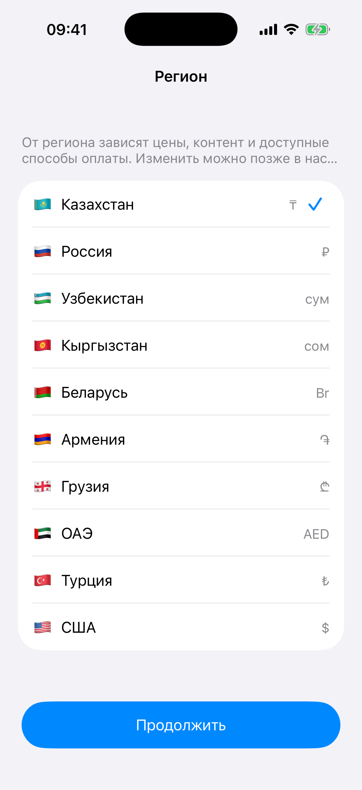

# Глава 10. Region + Age gates — фильтры по локации и возрасту

{width=45%}

Эти два гейта собраны в одну главу, потому что устроены похоже:

- оба спрашивают **один раз** (как онбординг) и сохраняют ответ в
  `UserDefaults`;
- оба собирают данные **до** того, как человек увидит главный экран;
- оба могут **не пустить** дальше: age gate — если человек слишком
  молод; region — теоретически, если регион не поддерживается (у нас
  такого случая нет).

Но есть и **принципиальное отличие**: у age gate **два** выхода —
`onPass` («проходи») и `onTooYoung` («рано»). Координатор по-разному
реагирует на каждый (см. главу 4).

Полный код обоих гейтов — в разделе 10.12.

## 10.1 Region picker

Зачем вообще спрашивать регион. От него часто зависят:

- **валюта** в ценах;
- **контент** — какие фильмы, песни, товары доступны в стране;
- **способы оплаты** — где-то есть Apple Pay, где-то только карта;
- **законы** — GDPR в Евросоюзе, COPPA в США и местные правила о
  персональных данных.

Сначала два понятия, которые легко спутать.

- **Локаль** (locale) — набор региональных настроек устройства: язык
  интерфейса, регион, формат дат и чисел, валюта. Человек выбирает её в
  «Настройки → Основные → Язык и регион». Например, локаль `ru_KZ` —
  русский язык, регион Казахстан: даты вида «27.09.2026», деньги в
  тенге.
- **Местоположение** — где телефон физически находится. Это
  геолокация, для неё нужно разрешение (глава 7).

Регион в локали — это **выбор человека в настройках**, а не место, где
он сейчас. Казахстанец в командировке в Стамбуле по-прежнему видит
регион «Казахстан». Поэтому регион из локали — хорошая **догадка**, но
не истина, и мы даём явный выбор.

Страна в нашем списке:

```swift
struct Region: Hashable, Sendable {
    let code: String      // ISO 3166-1 alpha-2: "KZ"
    let name: String
    let currency: String

    var flag: String {
        let base: UInt32 = 0x1F1E6 - 0x41
        var result = ""
        for scalar in code.uppercased().unicodeScalars {
            guard let flagScalar = Unicode.Scalar(base + scalar.value) else { return "" }
            result.unicodeScalars.append(flagScalar)
        }
        return result
    }

    static let all: [Region] = [
        Region(code: "KZ", name: "Казахстан", currency: "₸"),
        Region(code: "RU", name: "Россия", currency: "₽"),
        Region(code: "UZ", name: "Узбекистан", currency: "сум"),
        Region(code: "KG", name: "Кыргызстан", currency: "сом"),
    ]
}
```

`code` — двухбуквенный код страны по стандарту ISO 3166-1 alpha-2:
`KZ`, `RU`, `UZ`. Этот же код iOS возвращает в локали, поэтому по нему
удобно сравнивать.

`Hashable` нужен, чтобы регионы можно было сравнивать и класть в
множества, `Sendable` — чтобы значение можно было передавать между
потоками.

### Как из «KZ» получается флаг

Эмодзи-флаг — не отдельная картинка, а **пара особых символов**. В
Unicode есть 26 «региональных букв» — от «региональной A» с кодом
`0x1F1E6` до «региональной Z». Две такие буквы подряд iOS рисует как
флаг страны с этим кодом. Код обычной латинской «A» — `0x41` (65 в
десятичной записи).

Считаем на числах для «K»:

- код буквы «K» — `0x4B` (75);
- «K» отстоит от «A» на 75 − 65 = 10 позиций;
- «региональная K» — это `0x1F1E6` + 10 = `0x1F1F0`.

`base` в коде — это заранее вычтенное `0x1F1E6 − 0x41`, поэтому
`base + scalar.value` сразу даёт региональную букву. «KZ» →
«региональная K» + «региональная Z» → флаг Казахстана. Никаких
картинок в проекте и никаких эмодзи в исходнике. `Unicode.Scalar(...)`
возвращает опционал: если бы в коде оказался не латинский символ,
получился бы недопустимый код, и мы вернули бы пустую строку.

### Хранение выбора

```swift
final class RegionStorage {
    static let shared = RegionStorage()
    private init() {}

    private func key(for manifestId: String) -> String {
        "region.selected.\(manifestId)"
    }

    func region(for manifestId: String) -> Region? {
        guard let code = UserDefaults.standard.string(forKey: key(for: manifestId)) else { return nil }
        return Region.all.first { $0.code == code }
    }

    func setRegion(_ region: Region, for manifestId: String) {
        UserDefaults.standard.set(region.code, forKey: key(for: manifestId))
    }

    func reset(for manifestId: String) {
        UserDefaults.standard.removeObject(forKey: key(for: manifestId))
    }
}
```

Ключ свой для каждого mini-app: `region.selected.music`,
`region.selected.weather`. В настоящем приложении регион обычно один
на всё приложение, но в playground'е каждое mini-app независимо.

Храним только код («KZ»), а не всю структуру. При чтении ищем регион с
этим кодом в `Region.all`. Если его нет (например, страну убрали из
списка в новой версии) — получаем `nil`, и гейт спросит заново. Это
защита от устаревших данных.

## 10.2 Догадка по локали

При показе списка сразу отмечаем регион из локали:

```swift
private func guessDefaultRegion() {
    let code: String?
    if #available(iOS 16, *) {
        code = Locale.current.region?.identifier
    } else {
        code = Locale.current.regionCode
    }
    if let code, let match = regions.first(where: { $0.code == code }) {
        selected = match
    }
    tableView.reloadData()
    updateContinueState()
}
```

`Locale.current` — текущая локаль. Код региона в ней в iOS 16 и новее
читается через `region?.identifier`, а в iOS 15 — через старое
свойство `regionCode`, которое с iOS 16 помечено устаревшим.
`if #available(iOS 16, *)` выбирает нужный путь во время выполнения:
на iOS 16+ — новый, на iOS 15 — старый. Компилятор не ругается на
устаревшее свойство, потому что оно вызывается только в ветке для
старых систем.

Если кода нет в нашем списке (телефон настроен на Польшу, а Польши
нет), `selected` остаётся `nil`: человек выбирает сам, а кнопка
«Продолжить» выключена, пока выбора нет.

> **Догадка ≠ решение за человека.** Мы **отмечаем** угаданный регион,
> но не сохраняем его сами. Человек видит догадку и одним тапом
> подтверждает или меняет. Это лучше, чем «угадал и сохранил молча»,
> особенно для тех, кто путешествует.

## 10.3 Список — UITableView с галочкой

Список стран — `UITableView` в стиле `.insetGrouped`: карточка со
скруглёнными углами и отступами от краёв, как в «Настройках». В каждой
строке флаг, название и валюта; у выбранной — галочка.

```swift
extension RegionPickerViewController: UITableViewDataSource, UITableViewDelegate {
    func tableView(_ tableView: UITableView, titleForHeaderInSection section: Int) -> String? {
        "Выбери регион"
    }

    func tableView(_ tableView: UITableView, numberOfRowsInSection section: Int) -> Int {
        regions.count
    }

    func tableView(_ tableView: UITableView, cellForRowAt indexPath: IndexPath) -> UITableViewCell {
        let cell = tableView.dequeueReusableCell(withIdentifier: "cell", for: indexPath)
        let region = regions[indexPath.row]
        var content = cell.defaultContentConfiguration()
        content.text = "\(region.flag)  \(region.name)"
        content.secondaryText = region.currency
        content.prefersSideBySideTextAndSecondaryText = true
        cell.contentConfiguration = content
        cell.accessoryType = (selected?.code == region.code) ? .checkmark : .none
        cell.tintColor = brandColor
        return cell
    }

    func tableView(_ tableView: UITableView, didSelectRowAt indexPath: IndexPath) {
        tableView.deselectRow(at: indexPath, animated: true)
        selected = regions[indexPath.row]
        tableView.reloadData()
        updateContinueState()
    }
}
```

**Переиспользование ячеек.** `dequeueReusableCell(withIdentifier:for:)`
не создаёт ячейку каждый раз. Таблица держит небольшой запас ячеек:
когда строка уезжает за край экрана, её ячейка возвращается в запас и
потом приходит заново — уже для другой строки. Поэтому в
`cellForRowAt` нужно выставлять **всё** состояние ячейки: и текст, и
галочку. Если бы мы ставили `.checkmark` только выбранной строке и
никогда не ставили `.none` остальным, переиспользованная ячейка могла
бы «принести» чужую галочку. Строка с тернарным оператором как раз
выставляет оба варианта. Идентификатор `"cell"` мы зарегистрировали
заранее: `tableView.register(UITableViewCell.self,
forCellReuseIdentifier: "cell")` (см. 10.12).

**`UIListContentConfiguration`** (iOS 14+) — современный способ задать
содержимое стандартной ячейки. `defaultContentConfiguration()` даёт
заготовку со стилем ячейки; заполняешь `text`, `secondaryText`, при
желании `image`, и присваиваешь в `cell.contentConfiguration`. Раньше
для того же брали `UITableViewCell(style: .value1)` и трогали
`textLabel` / `detailTextLabel` напрямую — эти свойства теперь
устаревшие.

`prefersSideBySideTextAndSecondaryText = true` — название и валюта
**в одну строку**: название слева, валюта справа. Без этого валюта
оказалась бы под названием.

`accessoryType = .checkmark` — стандартная галочка в правой части
ячейки. Её цвет берётся из `tintColor` ячейки, поэтому
`cell.tintColor = brandColor` красит галочку в цвет mini-app.

`didSelectRowAt` — запомнили выбор, перерисовали таблицу (галочка
переехала), обновили кнопку. `deselectRow(at:animated:)` снимает серую
подсветку нажатой строки — иначе она осталась бы «залипшей».
`reloadData()` перерисовывает все строки; для четырёх стран это
мгновенно. Для длинного списка лучше перерисовать только две строки —
старую и новую — через `reloadRows(at:with:)`.

**Упражнение 10.1.** Включи mini-app Music выбор региона
(`m.requiresRegionPick = true` в `AppRegistry`, как флаги в главе 2).
Зайди в Music — после splash появится «Выбери регион», и, если локаль
симулятора казахстанская, Казахстан уже будет отмечен. Выбери другую
страну, нажми «Продолжить». Зайди в Music ещё раз. Что увидишь и
почему? Как вернуть экран выбора, не переустанавливая приложение?
Ответ — в конце главы.

## 10.4 Age gate — когда он действительно нужен

Сначала факты, потому что вокруг возрастных гейтов много мифов.

**Возрастной рейтинг** в App Store ставит не разработчик напрямую:
ты отвечаешь на анкету в App Store Connect (есть ли насилие, азартные
игры, медицинские темы, общение с незнакомцами), и система выставляет
рейтинг. С 2025 года шкала такая: **4+, 9+, 13+, 16+, 18+** (раньше
были 12+ и 17+). Рейтинг может отличаться по странам.

Соблюдает рейтинг **сама iOS**: если родители включили в «Экранном
времени» ограничение «до 13+», приложение 16+ ребёнок не скачает и не
откроет. Поэтому правило «поставил 17+ — обязан сделать age gate»
неверно: общего требования делать в приложении свою проверку возраста
у Apple нет.

Когда проверка возраста внутри приложения всё-таки нужна:

- **Правила App Review.** Приложения с контентом, созданным
  пользователями (1.2.1(a)), и приложения, которые запускают внутри
  себя чужие мини-игры и мини-приложения (4.7.5), должны давать
  способ пометить контент старше рейтинга приложения и ограничивать к
  нему доступ по **подтверждённому или заявленному** возрасту.
- **Законы.** Ставки, алкоголь, знакомства, работа с данными детей —
  во многих странах законы требуют проверять возраст, иногда строже,
  чем просто спросить дату рождения.
- **Собственная политика продукта** — например, сервис только для
  взрослых.

Apple в iOS 26 добавила фреймворк **DeclaredAgeRange**: приложение
может попросить человека поделиться возрастным диапазоном (например,
«до 13», «13–15», «16+»), не спрашивая дату рождения. Данные указал сам
человек или, для детей в «Семейном доступе», родитель; решает, делиться
ли ими, тоже родитель. Чтобы пользоваться API, у таргета включают
**capability** Declared Age Range. Capability — это «разрешённая
возможность» приложения: включаешь её в Xcode на вкладке **Signing &
Capabilities**, и в подпись приложения добавляется **entitlement** —
запись «этому приложению можно пользоваться такой-то функцией». Это API только для iOS 26+, поэтому в
книге с iOS 15 мы делаем гейт с вводом даты — а на новых системах его
можно заменить системным запросом через `if #available(iOS 26, *)`.

Наш гейт — простая **самодекларация**: человек сам указывает дату
рождения. Обойти её легко — достаточно соврать. Это не защита, а
отметка «мы спросили». Для учебного примера этого хватает.

Структура гейта:

```swift
final class AgeGateViewController: UIViewController {
    private let manifestId: String
    private let brandColor: UIColor
    private let minAge: Int
    private let onPass: () -> Void
    private let onTooYoung: () -> Void

    init(manifestId: String,
         brandColor: UIColor,
         minAge: Int,
         onPass: @escaping () -> Void,
         onTooYoung: @escaping () -> Void) {
        self.manifestId = manifestId
        self.brandColor = brandColor
        self.minAge = minAge
        self.onPass = onPass
        self.onTooYoung = onTooYoung
        super.init(nibName: nil, bundle: nil)
    }

    required init?(coder: NSCoder) { fatalError("init(coder:) не используется") }
}
```

Главное — **два** замыкания:

- `onPass` — возраст не меньше `minAge`, идём дальше;
- `onTooYoung` — возраст меньше, возвращаемся в лаунчер.

Это пример **гейта с несколькими выходами** из главы 4. Какой выход
куда ведёт, решает координатор.

## 10.5 UIDatePicker — стиль «барабаны»

```swift
datePicker.datePickerMode = .date
datePicker.preferredDatePickerStyle = .wheels
datePicker.maximumDate = Date()
datePicker.minimumDate = Calendar.current.date(byAdding: .year, value: -120, to: Date())
datePicker.date = Date()
datePicker.addTarget(self, action: #selector(dateChanged), for: .valueChanged)
```

Разбор:

- `datePickerMode = .date` — только дата, без времени.
- `preferredDatePickerStyle = .wheels` — три крутящихся барабана:
  день, месяц, год. По умолчанию стиль `.automatic`, и для даты iOS
  выбирает компактный вариант — строку с датой, по тапу на которую
  открывается календарь. Для даты рождения это неудобно: до 1990 года
  пришлось бы листать календарь месяц за месяцем. Барабан года
  прокручивается за пару взмахов.
- `maximumDate = Date()` — нельзя выбрать **будущее**: родиться в 2030
  году не получится.
- `minimumDate` — 120 лет назад. `Calendar.current.date(byAdding:
  .year, value: -120, to: Date())` отнимает 120 календарных лет от
  сегодняшней даты. Функция возвращает опционал, и `minimumDate` тоже
  опционал, так что их можно присвоить напрямую.
- `date = Date()` — стартовое значение **сегодня**. Почему не «20 лет
  назад», как иногда делают? Потому что такая дата уже проходит
  проверку 16+: ребёнку достаточно нажать «Подтвердить», ничего не
  трогая. Проверка возраста должна быть **нейтральной**: не
  подсказывать «правильный» ответ и не делать проходящий вариант
  выбором по умолчанию. По той же причине на экране не написано,
  какой возраст нужен. Так советуют, например, разъяснения
  американского регулятора FTC к закону о детской приватности COPPA.

`dateChanged` вызывается при каждом повороте барабана. В нём
пересчитываем возраст и обновляем подпись:

```swift
@objc private func dateChanged() {
    updateAgeLabel()
}

private func updateAgeLabel() {
    let years = AgeStorage.shared.ageYears(for: datePicker.date)
    ageLabel.text = "Тебе \(years) " + russianYearsSuffix(years)
}
```

## 10.6 Русские окончания — год / года / лет

Маленькая, но заметная деталь. В английском у чисел две формы: `1
year`, `2 years`. В русском три: «1 год», «2 года», «5 лет».

```swift
func russianYearsSuffix(_ years: Int) -> String {
    let mod100 = years % 100
    let mod10 = years % 10
    if mod100 >= 11 && mod100 <= 14 { return "лет" }
    switch mod10 {
    case 1: return "год"
    case 2, 3, 4: return "года"
    default: return "лет"
    }
}
```

`%` — остаток от деления. `years % 10` — последняя цифра числа,
`years % 100` — две последние. Правило словами:

- если две последние цифры — от 11 до 14, всегда «лет»: 11 лет,
  12 лет, 112 лет;
- иначе смотрим на последнюю цифру: 1 → «год» (1, 21, 101 год);
  2, 3, 4 → «года» (2, 23, 104 года); 0 и 5–9 → «лет» (0, 5, 20,
  25 лет).

Проверим на 21: две последние цифры — 21, это не 11–14; последняя
цифра 1 → «21 год». На 111: две последние — 11, попадаем в
исключение → «111 лет».

**Как это делают по-взрослому.** Для локализованных приложений
правильный путь — не функция в коде, а **правила множественного
числа** в файлах локализации: String Catalog (`.xcstrings`, Xcode 15+)
или старый `.stringsdict`. Там для строки задаются варианты по
категориям Unicode CLDR: для русского это `one` (1, 21, 31…), `few`
(2–4, 22–24…), `many` (0, 5–20, 25…) и `other` (дробные числа).
Система сама выбирает вариант по числу, а переводчик на казахский или
английский задаст свои формы. В коде тогда одна строка:

```swift
let text = String.localizedStringWithFormat(
    NSLocalizedString("age.years", comment: "Возраст на экране проверки"),
    years
)
```

`NSLocalizedString` находит строку по ключу `age.years` в ресурсах
приложения, `localizedStringWithFormat` подставляет число и выбирает
нужную форму. В String Catalog варианты задаются прямо в редакторе
Xcode: у строки выбираешь **Vary by Plural** и заполняешь формы.

Есть ещё «автоматическое грамматическое согласование» в
`AttributedString(localized:)` с разметкой `^[...](inflect: true)`.
Но оно работает не для всех языков: `InflectionRule.canInflect(language:)`
подскажет, поддерживается ли язык. Мы проверили в симуляторе iOS 26.5:
для `"en"` метод возвращает `true`, для `"ru"` — `false`. Для русского
остаются правила множественного числа. Их мы тоже проверили запуском
с `.stringsdict` из четырёх форм: 1 → «1 год», 22 → «22 года»,
11 → «11 лет», 111 → «111 лет» — ровно как наша функция.

Наша функция — честный вариант для приложения на одном языке. Если
окончания нужны в нескольких местах, вынеси её в общий файл
(`Common/`), а не копируй в каждый экран.

**Упражнение 10.2.** Не запуская код, посчитай, что вернёт
`russianYearsSuffix` для 0, 4, 12, 22, 104 и 1011. Потом проверь себя.
Ответ — в конце главы.

## 10.7 «Пока рано» — блокирующее состояние

При тапе «Подтвердить»:

```swift
@objc private func confirmTapped() {
    let date = datePicker.date
    AgeStorage.shared.setBirthDate(date, for: manifestId)
    if AgeStorage.shared.ageYears(for: date) < minAge {
        showBlocker()
    } else {
        onPass()
    }
}
```

Дату сохраняем **в любом случае** — и когда человек прошёл, и когда
нет. Зачем сохранять «слишком молодую» дату? Иначе проверку легко
обойти: получил отказ, вышел, зашёл снова — и ввёл другую дату. С
сохранённой датой при новом входе гейт сразу покажет блокер (см.
`viewDidLoad` в 10.12), а когда человек подрастёт до нужного возраста,
`shouldShow` сам пропустит его (10.9).

`showBlocker()` **не** меняет корневой экран и не показывает alert. Он
перестраивает текущий экран в блокирующее состояние:

```swift
private func showBlocker() {
    let icon = UIImageView(image: UIImage(systemName: "hand.raised.fill"))
    icon.tintColor = .systemRed
    icon.preferredSymbolConfiguration = UIImage.SymbolConfiguration(pointSize: 56)

    let titleLabel = UILabel()
    titleLabel.text = "Пока рано"
    titleLabel.font = .preferredFont(forTextStyle: .title2)
    titleLabel.adjustsFontForContentSizeCategory = true

    let bodyLabel = UILabel()
    bodyLabel.text = "Это приложение для пользователей постарше."
    bodyLabel.font = .preferredFont(forTextStyle: .body)
    bodyLabel.adjustsFontForContentSizeCategory = true
    bodyLabel.numberOfLines = 0
    bodyLabel.textAlignment = .center

    var cfg = UIButton.Configuration.gray()
    cfg.title = "Вернуться в лаунчер"
    let exitButton = UIButton(configuration: cfg, primaryAction: UIAction { [weak self] _ in
        self?.onTooYoung()
    })

    blockerStack.arrangedSubviews.forEach { $0.removeFromSuperview() }
    [icon, titleLabel, bodyLabel, exitButton].forEach(blockerStack.addArrangedSubview)
    formStack.isHidden = true
    blockerStack.isHidden = false
    UIAccessibility.post(notification: .screenChanged, argument: titleLabel)
}
```

Что здесь происходит:

- Экран с самого начала содержит **два** стека: `formStack` (заголовок,
  барабаны, подпись, кнопка) и пустой скрытый `blockerStack`.
  `showBlocker` наполняет второй, прячет первый и показывает второй.
  Прятать каждую view по отдельности не нужно — достаточно спрятать
  стек целиком.
- `blockerStack.arrangedSubviews.forEach { $0.removeFromSuperview() }` —
  на случай повторного вызова: старое содержимое убираем, чтобы не
  получить две иконки.
- `UIButton(configuration:primaryAction:)` (iOS 14+) — кнопка сразу с
  действием в виде `UIAction`, без `addTarget` и `@objc`-метода.
  `[weak self]` — потому что кнопка принадлежит экрану, а замыкание
  без `weak` держало бы экран сильно: экран → кнопка → действие →
  экран, цикл.
- Текст «для пользователей постарше» без конкретного возраста — чтобы
  не подсказывать, какую дату ввести в другой раз.
- `UIAccessibility.post(notification: .screenChanged, argument:)` —
  сообщение для VoiceOver: «экран сильно изменился», и фокус диктора
  переходит на заголовок «Пока рано». Без этого незрячий человек не
  узнал бы, что форма исчезла.

Можно было бы вместо этого поставить в окно отдельный экран-блокер,
но это лишнее: блокирующее состояние — часть того же гейта.

## 10.8 Хранение даты

```swift
final class AgeStorage {
    static let shared = AgeStorage()
    private init() {}

    private func key(for manifestId: String) -> String {
        "agegate.birthday.\(manifestId)"
    }

    func birthDate(for manifestId: String) -> Date? {
        UserDefaults.standard.object(forKey: key(for: manifestId)) as? Date
    }

    func setBirthDate(_ date: Date, for manifestId: String) {
        UserDefaults.standard.set(date, forKey: key(for: manifestId))
    }

    func reset(for manifestId: String) {
        UserDefaults.standard.removeObject(forKey: key(for: manifestId))
    }

    func ageYears(for date: Date, now: Date = Date()) -> Int {
        Calendar.current.dateComponents([.year], from: date, to: now).year ?? 0
    }
}
```

`UserDefaults` умеет хранить `Date` напрямую — не нужно превращать дату
в строку. Сохраняем через `set`, читаем через `object(forKey:)` с
приведением `as? Date`.

`ageYears` через `Calendar.current.dateComponents([.year], from:to:)` —
**правильный** способ посчитать полные годы. Календарь считает, сколько
**полных календарных лет** прошло между датами. Пример: родился
28.09.2010, сегодня 27.09.2026 — это 15 лет, шестнадцатилетие наступит
только завтра. Календарь так и ответит: 15.

Почему не «разделить секунды на длину года»? Дата — это момент
времени в секундах. Можно взять разницу и разделить на 365,25 суток по
86 400 секунд. Но четверть суток в «среднем годе» — это усреднение
високосных лет, и в дни рядом с днём рождения такое деление ошибается
на день в ту или иную сторону. Для гейта «16+» ошибка на день —
пропустить человека за день до шестнадцатилетия. Календарь считает по
настоящим датам и таких ошибок не делает.

Про **часовой пояс**: дата из `UIDatePicker` в режиме `.date` — это
полночь выбранного дня по часовому поясу устройства, а
`Calendar.current` считает в том же поясе. Пока пояс не меняется, всё
сходится. Если человек переехал из Алматы (UTC+5) в Лондон (UTC+0 или
+1 летом), сохранённая «полночь по Алматы» окажется вечером
предыдущего дня по Лондону — и в день рождения возраст может
«подрасти» на несколько часов позже. Для учебного гейта это
несущественно; в серьёзной системе дату рождения хранят как три числа
(год, месяц, день) без времени и пояса.

Параметр `now: Date = Date()` — для **тестирования**. В проверке можно
подставить конкретную дату «сегодня» и убедиться, что функция права,
не завися от реальных часов.

## 10.9 `shouldShow` для каждого гейта

```swift
// Region
static func shouldShow(for manifest: AppManifest) -> Bool {
    manifest.requiresRegionPick && RegionStorage.shared.region(for: manifest.id) == nil
}

// Age
static func shouldShow(for manifest: AppManifest) -> Bool {
    guard manifest.requiresAgeGate else { return false }
    if let date = AgeStorage.shared.birthDate(for: manifest.id) {
        return AgeStorage.shared.ageYears(for: date) < manifest.minAgeYears
    }
    return true
}
```

Region — простой: показываем, если флаг включён и регион ещё не
выбран.

Age — хитрее. Показываем, если флаг включён **и** либо дата ещё не
введена, либо по сохранённой дате возраст пока меньше `minAgeYears`.
Второй случай — человек уже получил отказ. Гейт покажется снова, но
сразу в состоянии «Пока рано» (проверка в `viewDidLoad`, 10.12), без
возможности ввести другую дату. А в день, когда человеку исполнится
нужный возраст, условие станет ложным, и гейт пропустит его сам.

**Упражнение 10.3.** Включи Music проверку возраста, как в примере из
главы 2: `m.requiresAgeGate = true`, `m.minAgeYears = 16`. Зайди в
Music и, не трогая барабаны, нажми «Подтвердить». Что увидишь? Выйди в
лаунчер и зайди снова. Затем сделай так, чтобы гейт снова спросил
дату. Ответ — в конце главы.

## 10.10 Бытовая аналогия

Выбор региона — **выбор языка в банкомате**. Спросили один раз,
запомнили в карточке. Потом банкомат сразу говорит
по-русски (или по-казахски, или по-английски). А подсказка «похоже,
вы из Казахстана» — это банкомат, который по карте догадался о
стране, но всё равно даёт нажать кнопку самому.

Проверка возраста — **кассир на входе в кинозал на фильм 18+**. Он
просит назвать год рождения и не подсказывает, какой нужен. Ответ
записывает в журнал: если сегодня не пустил, то завтра, назвав другой
год, не пройдёшь. А через несколько лет, когда подрастёшь, журнал сам
тебя пропустит.

## 10.11 Что мы пропустили в этой главе

- **Выбор языка.** Отдельный гейт мы не делаем: язык интерфейса
  лучше оставить системным настройкам. С iOS 13 у каждого приложения
  есть свой пункт выбора языка в «Настройки → [Приложение] → Язык»,
  если приложение переведено больше чем на один язык. Список языков
  человека в порядке предпочтения — `Locale.preferredLanguages`.
- **Код страны для телефона** (`+7`, `+1`, `+44`) — отдельная задача
  формы регистрации, обычно свой список с поиском.
- **Согласие на обработку данных** (GDPR и похожие законы) —
  отдельный гейт. По устройству похож на primer из главы 7, по
  содержанию — длиннее и юридически строже. Что именно из этого нужно
  App Store, разбирается в главе 39.

## 10.12 Экраны целиком

`Region`, `RegionStorage` и `AgeStorage` целиком приведены выше, как и
функция `russianYearsSuffix`. Здесь — оба экрана. `AppManifest` — из
главы 2.

```swift
import UIKit

final class RegionPickerViewController: UIViewController {

    static func shouldShow(for manifest: AppManifest) -> Bool {
        manifest.requiresRegionPick && RegionStorage.shared.region(for: manifest.id) == nil
    }

    private let manifestId: String
    private let brandColor: UIColor
    private let onDone: () -> Void
    private let regions = Region.all
    private var selected: Region?

    private let tableView = UITableView(frame: .zero, style: .insetGrouped)
    private let continueButton = UIButton(configuration: .filled())

    init(manifestId: String, brandColor: UIColor, onDone: @escaping () -> Void) {
        self.manifestId = manifestId
        self.brandColor = brandColor
        self.onDone = onDone
        super.init(nibName: nil, bundle: nil)
    }

    required init?(coder: NSCoder) { fatalError("init(coder:) не используется") }

    override func viewDidLoad() {
        super.viewDidLoad()
        view.backgroundColor = .systemGroupedBackground
        tableView.register(UITableViewCell.self, forCellReuseIdentifier: "cell")
        tableView.dataSource = self
        tableView.delegate = self

        var cfg = UIButton.Configuration.filled()
        cfg.title = "Продолжить"
        cfg.baseBackgroundColor = brandColor
        cfg.cornerStyle = .capsule
        continueButton.configuration = cfg
        continueButton.addTarget(self, action: #selector(continueTapped), for: .touchUpInside)

        [tableView, continueButton].forEach {
            $0.translatesAutoresizingMaskIntoConstraints = false
            view.addSubview($0)
        }
        NSLayoutConstraint.activate([
            tableView.topAnchor.constraint(equalTo: view.topAnchor),
            tableView.leadingAnchor.constraint(equalTo: view.leadingAnchor),
            tableView.trailingAnchor.constraint(equalTo: view.trailingAnchor),
            tableView.bottomAnchor.constraint(equalTo: continueButton.topAnchor, constant: -12),
            continueButton.leadingAnchor.constraint(equalTo: view.layoutMarginsGuide.leadingAnchor),
            continueButton.trailingAnchor.constraint(equalTo: view.layoutMarginsGuide.trailingAnchor),
            continueButton.bottomAnchor.constraint(equalTo: view.safeAreaLayoutGuide.bottomAnchor, constant: -16),
            continueButton.heightAnchor.constraint(greaterThanOrEqualToConstant: 50),
        ])
        guessDefaultRegion()
    }

    private func guessDefaultRegion() {
        let code: String?
        if #available(iOS 16, *) {
            code = Locale.current.region?.identifier
        } else {
            code = Locale.current.regionCode
        }
        if let code, let match = regions.first(where: { $0.code == code }) {
            selected = match
        }
        tableView.reloadData()
        updateContinueState()
    }

    private func updateContinueState() {
        continueButton.isEnabled = selected != nil
    }

    @objc private func continueTapped() {
        guard let selected else { return }
        RegionStorage.shared.setRegion(selected, for: manifestId)
        onDone()
    }
}

final class AgeGateViewController: UIViewController {

    static func shouldShow(for manifest: AppManifest) -> Bool {
        guard manifest.requiresAgeGate else { return false }
        if let date = AgeStorage.shared.birthDate(for: manifest.id) {
            return AgeStorage.shared.ageYears(for: date) < manifest.minAgeYears
        }
        return true
    }

    private let manifestId: String
    private let brandColor: UIColor
    private let minAge: Int
    private let onPass: () -> Void
    private let onTooYoung: () -> Void

    private let datePicker = UIDatePicker()
    private let ageLabel = UILabel()
    private let formStack = UIStackView()
    private let blockerStack = UIStackView()

    init(manifestId: String,
         brandColor: UIColor,
         minAge: Int,
         onPass: @escaping () -> Void,
         onTooYoung: @escaping () -> Void) {
        self.manifestId = manifestId
        self.brandColor = brandColor
        self.minAge = minAge
        self.onPass = onPass
        self.onTooYoung = onTooYoung
        super.init(nibName: nil, bundle: nil)
    }

    required init?(coder: NSCoder) { fatalError("init(coder:) не используется") }

    override func viewDidLoad() {
        super.viewDidLoad()
        view.backgroundColor = .systemBackground

        let titleLabel = UILabel()
        titleLabel.text = "Укажи дату рождения"
        titleLabel.font = .preferredFont(forTextStyle: .title2)
        titleLabel.adjustsFontForContentSizeCategory = true

        datePicker.datePickerMode = .date
        datePicker.preferredDatePickerStyle = .wheels
        datePicker.maximumDate = Date()
        datePicker.minimumDate = Calendar.current.date(byAdding: .year, value: -120, to: Date())
        datePicker.date = Date()
        datePicker.addTarget(self, action: #selector(dateChanged), for: .valueChanged)

        ageLabel.font = .preferredFont(forTextStyle: .body)
        ageLabel.adjustsFontForContentSizeCategory = true
        ageLabel.textColor = .secondaryLabel

        var cfg = UIButton.Configuration.filled()
        cfg.title = "Подтвердить"
        cfg.baseBackgroundColor = brandColor
        cfg.cornerStyle = .capsule
        let confirm = UIButton(configuration: cfg)
        confirm.addTarget(self, action: #selector(confirmTapped), for: .touchUpInside)

        [titleLabel, datePicker, ageLabel, confirm].forEach(formStack.addArrangedSubview)
        formStack.axis = .vertical
        formStack.alignment = .center
        formStack.spacing = 16

        blockerStack.axis = .vertical
        blockerStack.alignment = .center
        blockerStack.spacing = 16
        blockerStack.isHidden = true

        for stack in [formStack, blockerStack] {
            stack.translatesAutoresizingMaskIntoConstraints = false
            view.addSubview(stack)
            NSLayoutConstraint.activate([
                stack.centerYAnchor.constraint(equalTo: view.safeAreaLayoutGuide.centerYAnchor),
                stack.leadingAnchor.constraint(equalTo: view.layoutMarginsGuide.leadingAnchor),
                stack.trailingAnchor.constraint(equalTo: view.layoutMarginsGuide.trailingAnchor),
            ])
        }
        updateAgeLabel()

        if let saved = AgeStorage.shared.birthDate(for: manifestId),
           AgeStorage.shared.ageYears(for: saved) < minAge {
            showBlocker()
        }
    }

    @objc private func dateChanged() {
        updateAgeLabel()
    }

    private func updateAgeLabel() {
        let years = AgeStorage.shared.ageYears(for: datePicker.date)
        ageLabel.text = "Тебе \(years) " + russianYearsSuffix(years)
    }

    @objc private func confirmTapped() {
        let date = datePicker.date
        AgeStorage.shared.setBirthDate(date, for: manifestId)
        if AgeStorage.shared.ageYears(for: date) < minAge {
            showBlocker()
        } else {
            onPass()
        }
    }

    private func showBlocker() {
        let icon = UIImageView(image: UIImage(systemName: "hand.raised.fill"))
        icon.tintColor = .systemRed
        icon.preferredSymbolConfiguration = UIImage.SymbolConfiguration(pointSize: 56)

        let titleLabel = UILabel()
        titleLabel.text = "Пока рано"
        titleLabel.font = .preferredFont(forTextStyle: .title2)
        titleLabel.adjustsFontForContentSizeCategory = true

        let bodyLabel = UILabel()
        bodyLabel.text = "Это приложение для пользователей постарше."
        bodyLabel.font = .preferredFont(forTextStyle: .body)
        bodyLabel.adjustsFontForContentSizeCategory = true
        bodyLabel.numberOfLines = 0
        bodyLabel.textAlignment = .center

        var cfg = UIButton.Configuration.gray()
        cfg.title = "Вернуться в лаунчер"
        let exitButton = UIButton(configuration: cfg, primaryAction: UIAction { [weak self] _ in
            self?.onTooYoung()
        })

        blockerStack.arrangedSubviews.forEach { $0.removeFromSuperview() }
        [icon, titleLabel, bodyLabel, exitButton].forEach(blockerStack.addArrangedSubview)
        formStack.isHidden = true
        blockerStack.isHidden = false
        UIAccessibility.post(notification: .screenChanged, argument: titleLabel)
    }
}
```

Расширение с data source и delegate таблицы — в 10.3; в файле оно идёт
сразу после `RegionPickerViewController`.

Пара деталей вёрстки:

- Таблица занимает всё от верха экрана до кнопки
  (`tableView.bottomAnchor` = верх кнопки минус 12 точек), а кнопка
  прижата к низу safe area. Таблица сама прокручивается, если стран
  станет много.
- Оба стека возрастного гейта центрируются по вертикали одинаково: они
  лежат друг на друге, а виден в каждый момент только один.

## Ответы к упражнениям

**10.1.** Второй раз экран выбора не появится: код региона сохранён в
`UserDefaults` под ключом `region.selected.music`, и `shouldShow`
вернёт `false`. Вернуть экран можно вызовом
`RegionStorage.shared.reset(for: "music")` — например, из отладочной
кнопки или из точки останова в Xcode командой
`expr RegionStorage.shared.reset(for: "music")`. Второй способ —
удалить приложение с симулятора: вместе с ним сотрутся и настройки.

**10.2.** 0 → «лет» (последняя цифра 0); 4 → «года»; 12 → «лет» (две
последние цифры 12 — исключение 11–14); 22 → «года» (22 — не
исключение, последняя цифра 2); 104 → «года» (две последние — 04, не
исключение, последняя 4); 1011 → «лет» (две последние цифры 11).

**10.3.** Барабаны стоят на сегодняшней дате, возраст 0 лет, поэтому
«Подтвердить» сразу покажет «Пока рано». Дата сохранена, и при
повторном входе гейт откроется уже с блокером, без барабанов. Чтобы
гейт снова спросил дату, удали сохранённую дату:
`AgeStorage.shared.reset(for: "music")` (из отладчика командой `expr`,
как в 10.1) или удали приложение с симулятора.

## Что мы выучили

- Region и Age — разовые гейты, ответ хранится в `UserDefaults`.
- Локаль — региональные настройки устройства (язык, регион, форматы),
  а не местоположение. Регион из локали — догадка, которую человек
  подтверждает.
- `Locale.current.region?.identifier` в iOS 16+ и `regionCode` в
  iOS 15 — через `if #available`.
- Флаг страны — две «региональные буквы» Unicode; их можно вычислить из
  кода «KZ», без картинок и эмодзи в исходнике.
- Список — `UITableView(.insetGrouped)` + `UIListContentConfiguration`
  + `accessoryType = .checkmark`; в `cellForRowAt` выставляем всё
  состояние ячейки, потому что ячейки переиспользуются.
- Возрастной рейтинг App Store (4+, 9+, 13+, 16+, 18+) соблюдает сама
  iOS; своя проверка возраста нужна по правилам 1.2.1(a) и 4.7.5, по
  законам или по политике продукта. В iOS 26 есть DeclaredAgeRange.
- Проверка возраста должна быть нейтральной: барабаны на сегодняшней
  дате, порог не показан, неудачная попытка запоминается.
- Возраст считаем `Calendar.dateComponents([.year], from:to:)` —
  полными календарными годами, а не делением секунд.
- Окончания «год / года / лет»: своя функция на `% 100` и `% 10` или,
  правильнее для локализации, правила множественного числа в String
  Catalog / `.stringsdict`.
- У age gate **два** выхода: `onPass` и `onTooYoung`.
- Блокирующее состояние — второй стек на том же экране и уведомление
  VoiceOver `.screenChanged`.

## Apple Developer Documentation

- [Human Interface Guidelines — Right to left](https://developer.apple.com/design/human-interface-guidelines/right-to-left) — если поддерживаешь арабский или иврит, экраны должны зеркалиться; UIKit делает это сам, если раскладка на `leading`/`trailing`, а не на `left`/`right`.
- [`Locale`](https://developer.apple.com/documentation/foundation/locale) — региональные настройки; `Locale.current` отражает выбор в «Настройки → Основные → Язык и регион».
- [`Locale.current`](https://developer.apple.com/documentation/foundation/locale/current) — текущая локаль; в iOS 16+ регион читаем через `region?.identifier`.
- [`Locale.preferredLanguages`](https://developer.apple.com/documentation/foundation/locale/preferredlanguages) — языки пользователя в порядке предпочтения.
- [`Bundle.preferredLocalizations(from:forPreferences:)`](https://developer.apple.com/documentation/foundation/bundle/preferredlocalizations(from:forpreferences:)) — пересечение языков приложения и предпочтений пользователя.
- [`NSLocalizedString`](https://developer.apple.com/documentation/foundation/nslocalizedstring) — загрузка локализованных строк, в том числе с правилами множественного числа; в Swift есть и `String(localized:)` (iOS 15+).
- [`UIDatePicker`](https://developer.apple.com/documentation/uikit/uidatepicker) — `preferredDatePickerStyle = .wheels`, `minimumDate` / `maximumDate`.
- [`Calendar.dateComponents(_:from:to:)`](https://developer.apple.com/documentation/foundation/calendar/datecomponents(_:from:to:)-5g20t) — разница между датами в календарных единицах; так считаем полные годы.
- [`UIListContentConfiguration`](https://developer.apple.com/documentation/uikit/uilistcontentconfiguration) — содержимое стандартной ячейки (iOS 14+), замена `textLabel` / `detailTextLabel`.
- [Age ratings values and definitions](https://developer.apple.com/help/app-store-connect/reference/app-information/age-ratings-values-and-definitions/) — шкала возрастных рейтингов App Store и вопросы анкеты.
- [App Review Guidelines](https://developer.apple.com/app-store/review/guidelines/) — пункты 1.2.1(a) и 4.7.5 о проверке возраста для пользовательского контента и мини-приложений.

→ [Глава 11. Privacy blur + Biometric on resume](./15-privacy-blur-biometric.md)
