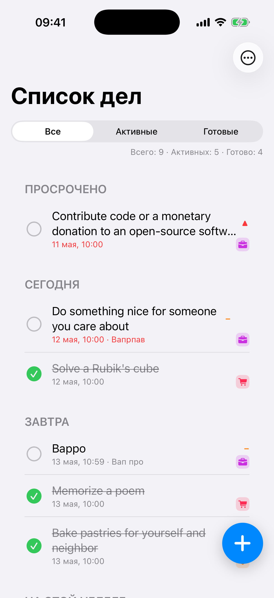

# Глава 12. Todo — UITableView, ячейка-чек, UserDefaults+Codable, dummyjson

{width=45%}

С этой главы начинается Часть III — **mini-приложения**. Каждое
самодостаточно: можно прочитать одну главу, забрать паттерн в свой
проект, и не вникать в остальные. Но я бы советовал хотя бы Todo
прочитать целиком — здесь закладываются базовые приёмы (хранилище,
ячейка, кнопка добавления), которые повторяются в других mini-apps.

«Список дел» — классический tutorial-проект iOS-разработчика. И не
зря: он включает почти всё, что нужно понимать про работу с
UITableView. Мы делаем его в playground-стиле: ячейка с чек-боксом,
свайп-actions для удаления и завершения, плавающая кнопка «плюс»,
секции по датам (Сегодня / Завтра / На этой неделе), seeding из
dummyjson при первом запуске.

## 12.1 Модель данных

Файл: `Apps/Todo/Models/Todo.swift`. Структура простая, но с двумя
нюансами — категория и приоритет:

```swift
struct Todo: Identifiable, Codable, Hashable, Sendable {
    enum Category: String, Codable, CaseIterable, Sendable {
        case personal = "Личное"
        case work = "Работа"
        case shopping = "Покупки"
        case health = "Здоровье"
        case study = "Учёба"
    }

    enum Priority: Int, Codable, CaseIterable, Sendable {
        case low = 0
        case medium = 1
        case high = 2
    }

    let id: UUID
    var title: String
    var note: String
    var category: Category
    var priority: Priority
    var dueDate: Date?
    var isCompleted: Bool
    var createdAt: Date
}
```

Несколько важных моментов:

`Identifiable, Codable, Hashable, Sendable` — четыре протокола. Зачем
каждый:

- **`Identifiable`** — для diffable data sources, для SwiftUI (если
  понадобится), для swipe-actions. Удобно иметь `todo.id` как
  «адрес» элемента.
- **`Codable`** — для сохранения в UserDefaults через JSON. Без него
  пришлось бы вручную писать `init(coder:)` и `encode(to:)`.
- **`Hashable`** — для `Set`, для `firstIndex(where:)`,
  для UIKit diffable APIs (`NSDiffableDataSourceSnapshot` требует
  Hashable).
- **`Sendable`** — для async/await кросс-actor передачи. Swift 6 без
  этого даст warning при попытке передать Todo из main-actor в
  detached-task.

`id: UUID = UUID()` — генерируем новый при создании. Не `Int`, не
auto-increment. UUID гарантированно уникален без обращения к серверу
(или к локальному счётчику).

`dueDate: Date?` — опциональный. Не все задачи привязаны к дате
(«Когда-нибудь прочитать книгу»). Без явной даты задача попадает в
группу «Без даты».

`var` vs `let`. Только `id` и `createdAt` — `let` (они не меняются
после создания). Остальные — `var`, потому что юзер их редактирует.

## 12.2 Группировка по датам

Trick: вычисляемое свойство `group: Group`, которое смотрит на
`dueDate` и возвращает один из шести бакетов:

```swift
extension Todo {
    enum Group: Hashable, Sendable {
        case overdue, today, tomorrow, thisWeek, later, noDate
        // ... title, sortOrder
    }

    var group: Group {
        guard let due = dueDate else { return .noDate }
        let cal = Calendar.current
        let today = cal.startOfDay(for: .now)
        let dueDay = cal.startOfDay(for: due)
        if dueDay < today { return .overdue }
        if dueDay == today { return .today }
        if let tomorrow = cal.date(byAdding: .day, value: 1, to: today),
           dueDay == tomorrow { return .tomorrow }
        if let weekEnd = cal.date(byAdding: .day, value: 7, to: today),
           dueDay < weekEnd { return .thisWeek }
        return .later
    }
}
```

`Calendar.current.startOfDay(for:)` — обнуляет время суток (00:00).
Без этого сравнение `dueDay < today` сломалось бы для задачи на
сегодня в 14:00 (это «меньше» чем сейчас, но НЕ «просрочено» — это
сегодня).

`group` пересчитывается **каждый раз** при обращении. Если задач
много (десятки тысяч), это будет медленно. Для 50–100 задач — мгновенно.

В TableView мы потом сгруппируем массив по этому свойству:

```swift
let grouped = Dictionary(grouping: storage.items, by: \.group)
```

И отсортируем секции по `sortOrder` (просроченное наверху, «без даты»
внизу).

> 💡 **`Dictionary(grouping:by:)`** — стандартная функция Swift
> Foundation. Принимает массив и keypath/closure, возвращает
> `[Key: [Element]]`. Если ты ещё не использовал — попробуй, очень
> удобно для сгруппированных таблиц.

## 12.3 Хранилище — UserDefaults через JSON

`TodoStorage` — `@MainActor` синглтон, который держит массив и
сохраняет его в UserDefaults через `JSONEncoder`:

```swift
@MainActor
final class TodoStorage {
    static let shared = TodoStorage()

    private let defaults: UserDefaults
    private let key = "todo.items.v1"

    private(set) var items: [Todo] = []
    private var observers: [String: () -> Void] = [:]

    init(defaults: UserDefaults = .standard) {
        self.defaults = defaults
        load()
    }

    private func save() {
        do {
            let encoder = JSONEncoder()
            encoder.dateEncodingStrategy = .iso8601
            let data = try encoder.encode(items)
            defaults.set(data, forKey: key)
        } catch {
            // в реальном проекте — пробросить в логгер
        }
        notify()
    }

    private func load() {
        guard let data = defaults.data(forKey: key) else { return }
        do {
            let decoder = JSONDecoder()
            decoder.dateDecodingStrategy = .iso8601
            items = try decoder.decode([Todo].self, from: data)
        } catch {
            items = []
        }
    }
}
```

Ключевые моменты:

**Зачем `v1` в ключе.** Если завтра ты поменяешь модель `Todo` (добавишь
обязательное поле `assignee`), `JSONDecoder().decode([Todo].self,
from: oldData)` упадёт — старого поля в файле нет. С версионированием
(`todo.items.v1` → `todo.items.v2`) ты можешь начать с пустого
массива для новой версии, без падений.

**`init` принимает `defaults`**. По умолчанию `.standard`, но можно
передать другой `UserDefaults` (например, в `applicationGroup` для
shared с widget'ом). Это **dependency injection** — хранилище легко
тестировать, передав `UserDefaults(suiteName: "test")`.

**`@MainActor`**. Хотя UserDefaults thread-safe, наш сторадж зовётся
из UI, и публикует уведомления о изменениях (`notify()`), которые
обновляют tableView. Уведомления **обязаны** идти с main. Проще
объявить весь класс main-actor — компилятор сам не даст вызвать его
с background.

**`dateEncodingStrategy = .iso8601`**. JSON не знает про Date — по
умолчанию `JSONEncoder` сохраняет как `Double` (timestamp с
millisecond). ISO8601 (`"2026-05-12T15:30:00Z"`) **человекочитабельный**
— если ты откроешь preferences в Finder и заглянешь, поймёшь что
там лежит.

## 12.4 Observer pattern — для перерисовки UI

Когда модель изменилась, view надо обновить. Несколько вариантов:

1. **`NotificationCenter`** — отправлять `Notification.Name("todosChanged")`.
   Работает, но громоздко: каждый VC подписывается / отписывается.
2. **Combine `@Published`** — современно, но требует Combine import'а
   везде, где есть подписчик.
3. **`@Observable` macro (iOS 17+)** — самый чистый, но нам нужна
   iOS 15+ совместимость.
4. **Кастомный observer-callback**. Простой, понятный, работает.

Мы выбираем 4-й:

```swift
private var observers: [String: () -> Void] = [:]

func addObserver(_ name: String, handler: @escaping () -> Void) {
    observers[name] = handler
}

func removeObserver(_ name: String) {
    observers.removeValue(forKey: name)
}

private func notify() {
    for handler in observers.values {
        handler()
    }
}
```

Подписчик — VC в `viewDidLoad`:

```swift
TodoStorage.shared.addObserver("TodoListVC") { [weak self] in
    self?.refresh()
}
```

И в `deinit`:

```swift
deinit {
    TodoStorage.shared.removeObserver("TodoListVC")
}
```

Уникальный ключ (`"TodoListVC"`) — чтобы при повторной подписке (например,
после shake → ребилд) старый handler заменился новым, не оставаясь
дубликатом.

> 💡 **Зачем dictionary, а не array.** С dictionary мы можем
> заменить handler по ключу. С array — пришлось бы хранить токен и
> ловить нужный handler в `removeObserver`. Dictionary упрощает.

## 12.5 Seeding из dummyjson

Когда пользователь впервые открывает Todo, список пустой. Это
визуально неприятно — empty state и больше ничего. Хорошее решение:
**заполнить** при первом запуске несколькими демо-задачами с
сервера.

`TodoAPI` — клиент к `https://dummyjson.com/todos`:

```swift
struct TodoAPI: Sendable {
    func fetchSampleTodos(limit: Int = 8) async throws -> [Todo] {
        var components = URLComponents(url: baseURL.appendingPathComponent("todos"), ...)!
        components.queryItems = [URLQueryItem(name: "limit", value: String(limit))]
        var request = URLRequest(url: components.url!)
        request.timeoutInterval = 10

        let (data, response) = try await session.data(for: request)
        guard let http = response as? HTTPURLResponse,
              (200..<300).contains(http.statusCode) else {
            throw APIError.badResponse
        }
        let decoded = try JSONDecoder().decode(RemoteTodoListResponse.self, from: data)

        // Раскидываем удалённые todo по нашим категориям детерминированно (id % 5).
        let categories = Todo.Category.allCases
        return decoded.todos.map { remote in
            let category = categories[remote.id % categories.count]
            // ...
        }
    }
}
```

dummyjson.com — публичный mock-API, без ключа, без авторизации.
Идеальный seeding-источник для учебных проектов. Не надо ничего
регистрировать, не надо ничего бояться.

Маппинг `remote.id % 5` → категория — детерминированный, чтобы при
повторном запуске получались **те же** категории. Если бы рандомили,
каждый раз тестируя ты бы видел разные данные, и сложнее было
воспроизводить баги.

Seeding запускается **один раз** через флаг `firstLaunchKey`:

```swift
var needsFirstLaunchSeed: Bool {
    !defaults.bool(forKey: firstLaunchKey) && items.isEmpty
}

func seedIfNeeded(with remoteTodos: [Todo]) {
    guard needsFirstLaunchSeed else { return }
    items = remoteTodos
    defaults.set(true, forKey: firstLaunchKey)
    save()
}
```

Условие: флаг **не** установлен И список пустой. Это защита от
двойного seed'а — если seed уже был, но юзер удалил всё, мы **не**
делаем повторный seed. У юзера была причина очистить.

## 12.6 TodoListViewController — список с секциями

`UITableView(frame: .zero, style: .insetGrouped)` + кастомная ячейка.
Самое интересное — связывание секций и данных:

```swift
private func reloadGroups() {
    let grouped = Dictionary(grouping: storage.items, by: \.group)
    sections = Todo.Group.allCases
        .filter { grouped[$0] != nil }
        .sorted { $0.sortOrder < $1.sortOrder }
    sectionItems = sections.map { group in
        (grouped[group] ?? []).sorted(by: Self.todoSorter)
    }
    tableView.reloadData()
    updateCountLabel()
    updateEmptyState(isEmpty: storage.items.isEmpty)
}

nonisolated private static func todoSorter(_ a: Todo, _ b: Todo) -> Bool {
    if a.isCompleted != b.isCompleted { return !a.isCompleted }
    if a.priority != b.priority { return a.priority.rawValue > b.priority.rawValue }
    return a.createdAt > b.createdAt
}
```

Что происходит:

1. **Группируем** массив по `\.group` keypath (свойство, описанное в
   секции 12.2). Получаем `[Todo.Group: [Todo]]`.
2. **Сортируем секции** по `sortOrder`. Просроченные сверху, «без
   даты» внизу.
3. **Внутри каждой секции** — сортируем по: незавершённые → приоритет
   убывая → дата создания убывая (новые сверху).

`nonisolated` на `todoSorter` — потому что эта функция **чистая**, не
трогает UI и не использует main-actor состояние. Если оставить без
`nonisolated`, компилятор Swift 6 потребует MainActor-context при
вызове из любого места.

`Todo.Group.allCases` — это новое! Я не объявил его как `CaseIterable`.
Получается, я **не могу** вызвать `allCases` на него. Нужно либо
добавить `CaseIterable`, либо перечислять явно. В реальном коде
обычно добавляют CaseIterable — это бесплатно для enum'а без associated
values.

> 🛠 **Упражнение.** Открой `Todo.swift`. Добавь к `enum Group:
> Hashable, Sendable, CaseIterable {`. Запусти приложение — без
> ошибок. Это и есть «бесплатное» добавление протокола Swift.

## 12.7 Кастомная ячейка — `TodoCell`

`UITableViewCell` подкласс с пользовательской вёрсткой. Внутри:
чек-бокс (UIButton), заголовок, иконка категории, подпись с приоритетом
и датой.

Главное — **чек-бокс через `UIButton`**, а не `UISwitch`. Switch
выглядит избыточно для одной задачи. Один тап — toggle.

```swift
private let checkButton = UIButton(type: .system)

private func setupLayout() {
    let normalImg = UIImage(systemName: "circle")
    let checkedImg = UIImage(systemName: "checkmark.circle.fill")
    checkButton.setImage(normalImg, for: .normal)
    checkButton.setImage(checkedImg, for: .selected)
    checkButton.setPreferredSymbolConfiguration(
        UIImage.SymbolConfiguration(pointSize: 22, weight: .regular),
        forImageIn: .normal
    )
    checkButton.addTarget(self, action: #selector(checkboxTapped), for: .touchUpInside)
}
```

Когда юзер тапает чек-бокс, мы НЕ хотим, чтобы Cell делал toggle на
своих данных. Cell — это **отображалка**. Toggle должен пройти
через `TodoStorage`. Поэтому Cell объявляет callback:

```swift
var onCheckTap: (() -> Void)?

@objc private func checkboxTapped() {
    onCheckTap?()
}
```

И в `TodoListViewController.cellForRowAt` подписывает:

```swift
cell.onCheckTap = { [weak self, weak cell] in
    guard let self else { return }
    let todo = self.todoAt(indexPath)
    self.storage.toggleCompleted(id: todo.id)
}
```

Storage публикует уведомление, observer перерисует таблицу, чек-бокс
отрисуется в новом состоянии.

> 💡 **Зачем `weak cell` в захвате.** Ячейки переиспользуются. Та
> же `cell`, в которую мы только что подписали callback, через 200ms
> может уже отображать другую задачу. Если бы мы захватили `cell`
> сильно — старый callback держал бы ячейку, мешая переиспользованию.

## 12.8 Свайп-actions

```swift
func tableView(_ tableView: UITableView,
               trailingSwipeActionsConfigurationForRowAt indexPath: IndexPath)
-> UISwipeActionsConfiguration? {
    let todo = todoAt(indexPath)
    let delete = UIContextualAction(style: .destructive, title: "Удалить") { [weak self] _, _, completion in
        self?.storage.remove(id: todo.id)
        completion(true)
    }
    delete.image = UIImage(systemName: "trash")
    return UISwipeActionsConfiguration(actions: [delete])
}

func tableView(_ tableView: UITableView,
               leadingSwipeActionsConfigurationForRowAt indexPath: IndexPath)
-> UISwipeActionsConfiguration? {
    let todo = todoAt(indexPath)
    let toggle = UIContextualAction(style: .normal, title: todo.isCompleted ? "Открыть" : "Закрыть") { [weak self] _, _, completion in
        self?.storage.toggleCompleted(id: todo.id)
        completion(true)
    }
    toggle.backgroundColor = todo.isCompleted ? .systemGray : Palette.success
    toggle.image = UIImage(systemName: todo.isCompleted ? "arrow.uturn.backward" : "checkmark")
    return UISwipeActionsConfiguration(actions: [toggle])
}
```

`trailingSwipeActions` — справа налево (стандартный для iOS — Mail,
Notes). `leadingSwipeActions` — слева направо (обычно «отметить как
прочитанное»).

`UIContextualAction` — action в свайпе. Стиль `.destructive` — красный
фон + автоматическое полное удаление при «full swipe». Стиль
`.normal` — серый, без full-swipe.

`completion(true)` — обязательно. Без него таблица «зависает» в
полу-открытом состоянии после свайпа.

`backgroundColor` действия — можно красить как угодно. Здесь у нас
зелёный для «закрыть», серый для «открыть обратно».

## 12.9 Плавающий FAB «плюс»

Кнопка-«плюс» внизу справа — паттерн Material Design, но мы используем
его и в iOS. Реализация — обычная `UIButton` поверх `UITableView`:

```swift
private lazy var addButton: UIButton = {
    var cfg = UIButton.Configuration.filled()
    cfg.image = UIImage(systemName: "plus")
    cfg.cornerStyle = .capsule
    cfg.baseBackgroundColor = Palette.tint
    cfg.baseForegroundColor = .white
    cfg.contentInsets = NSDirectionalEdgeInsets(top: 14, leading: 14, bottom: 14, trailing: 14)
    let button = UIButton(configuration: cfg)
    button.addTarget(self, action: #selector(addTapped), for: .touchUpInside)
    button.layer.shadowColor = UIColor.black.cgColor
    button.layer.shadowOpacity = 0.2
    button.layer.shadowRadius = 8
    button.layer.shadowOffset = CGSize(width: 0, height: 4)
    return button
}()
```

Тень даёт ощущение «парения». Без неё кнопка визуально сливается с
таблицей.

Позиция через констрейнты к `safeAreaLayoutGuide.bottomAnchor` —
чтобы FAB не залезал под home-indicator.

## 12.10 Modal editor с detents

При тапе «плюс» или на строку — открываем редактор задачи.
`TodoEditorViewController` — modal sheet с UI textField, дата picker,
сегментом приоритета:

```swift
@objc private func addTapped() {
    let editor = TodoEditorViewController(mode: .create)
    presentEditor(editor)
}

private func presentEditor(_ editor: TodoEditorViewController) {
    let nav = UINavigationController(rootViewController: editor)
    if let sheet = nav.sheetPresentationController {
        sheet.detents = [.medium(), .large()]
        sheet.prefersGrabberVisible = true
    }
    present(nav, animated: true)
}
```

`UISheetPresentationController` (iOS 15+) — нативный «вытяжной»
бottom sheet с двумя позициями: половинная (`.medium`) и полная
(`.large`). Можно тянуть пальцем между ними.

`prefersGrabberVisible = true` — серый «крючок» сверху sheet'а, по
которому понятно, что его можно тянуть.

## 12.11 Бытовая аналогия

Todo-приложение — **холодильник с магнитиками**. Каждая задача —
магнитик с запиской. Категории — цвета магнитиков. Приоритет —
шрифт. Свайп-actions — рука, которая стирает или зачёркивает запись.

Когда ты добавляешь задачу, магнитик прикрепляется к холодильнику
(storage). Когда видишь холодильник (TableView) — видишь все магнитики,
рассортированные по группам («Срочное», «На завтра», «Когда-нибудь»).

Storage observer — это **глаза**, которые следят за холодильником.
Кто-то снял магнитик — глаза заметили, тут же обновили память
(перерисовали список).

## 12.12 Что мы пропустили

- **Notifications**. Когда задача с дедлайном «через час», iOS
  должна прислать пуш. Делается через `UNUserNotificationCenter`,
  при сохранении задачи планируется local notification.
- **Sync**. Сейчас задачи только локально. Если хочешь иметь их на
  iPhone и iPad — CloudKit или собственный API.
- **Search**. У нас есть категории и фильтр («все / активные /
  завершённые») в navigation bar, но нет поиска по тексту.
  `UISearchController` ставится в `navigationItem.searchController`.
- **Recurring tasks**. «Каждый понедельник» — нужен отдельный
  механизм rrule + расчёт следующего срока. Сложно, в учебнике
  пропускаем.

> 🛠 **Упражнение.** Открой Todo (синяя ячейка в лаунчере). Создай
> несколько задач: «Купить молоко» с категорией «Покупки», «Сделать
> отчёт» с приоритетом «Высокий», «Прочитать книгу» без даты.
> Закрой задачу свайпом влево (или тапом на кружок), удали свайпом
> вправо. Открой одну для редактирования. Запиши приложение, выйди
> shake'ом, зайди обратно — задачи на месте (UserDefaults сохранил).

## 📋 Что мы выучили

- Модель Todo — `Identifiable, Codable, Hashable, Sendable`. Каждый
  протокол нужен для конкретной цели.
- Группировка по группам через computed property `var group: Group`
  + `Dictionary(grouping:by: \.group)`.
- Хранилище через UserDefaults + JSON. `dateEncodingStrategy = .iso8601`
  для читаемых дат.
- Версия в ключе (`v1`) — на случай миграции модели.
- Observer-pattern через `[String: () -> Void]` dictionary. Уникальный
  ключ позволяет переподписываться без дубликатов.
- Seeding из dummyjson при первом запуске + флаг
  `firstLaunchSeeded.v1`, защищающий от повторного засева.
- Кастомная ячейка с чек-боксом через `UIButton(type: .system)` с
  `circle` / `checkmark.circle.fill` для `.normal` / `.selected`.
- Свайп-actions через `UISwipeActionsConfiguration` +
  `UIContextualAction`. Trailing — destructive, leading — toggle.
- FAB «плюс» с тенью поверх tableView, привязан к
  `safeAreaLayoutGuide.bottomAnchor`.
- Modal editor через `UISheetPresentationController` с
  `[.medium(), .large()]` detent'ами.
- `nonisolated` static функция сортировки — компилятор не требует
  main-actor контекста.

→ [Глава 13. Notes — UITextView, FileManager, UISearchController](./21-notes.md)
