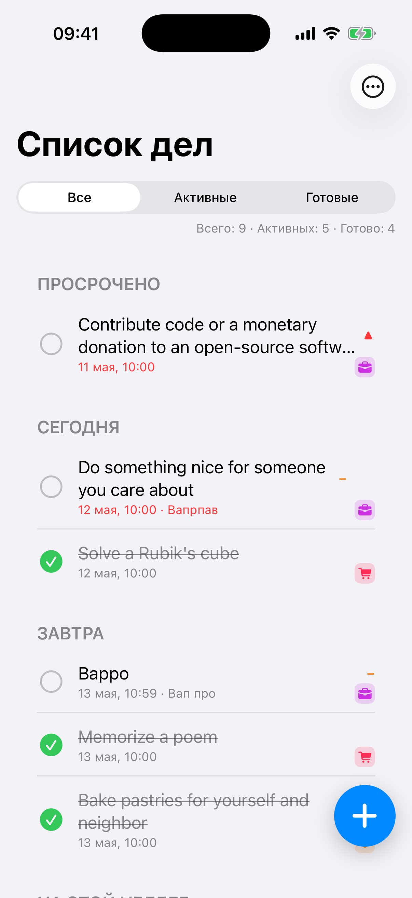

# Глава 12. Todo — UITableView, ячейка-чек, UserDefaults+Codable, dummyjson

{width=45%}

С этой главы начинается Часть III — **мини-приложения**. Каждое
самодостаточно: можно прочитать одну главу, забрать приём в свой
проект и не вникать в остальные. Но Todo я советую прочитать целиком —
здесь закладываются базовые приёмы (хранилище, своя ячейка, кнопка
добавления, лист-редактор), которые повторяются в других мини-приложениях.

«Список дел» — классический учебный проект iOS-разработчика. И не
зря: он включает почти всё, что нужно понимать про `UITableView`. Мы
делаем его в стиле playground: ячейка с кружком-галочкой, действия по
свайпу для удаления и завершения, плавающая кнопка «плюс», секции по
датам («Сегодня», «Завтра», «Ближайшие 7 дней»), фильтр «все / активные /
завершённые» и заполнение демо-задачами с сервера dummyjson при первом
запуске.

Что строим, одним экраном:

```
┌──────────────────────────────┐
│        Список дел        (≡) │ ← фильтр
│ Сегодня                      │ ← секция = группа по сроку
│ ┌──────────────────────────┐ │
│ │ ○  Купить молоко       ▣ │ │ ← кружок-чек, заголовок, иконка категории
│ │    Покупки · 27 сент.    │ │
│ │ ◉  Сделать отчёт       ◆ │ │ ← выполнено: зелёная галочка, зачёркнуто
│ └──────────────────────────┘ │
│ Без даты                     │
│ ┌──────────────────────────┐ │
│ │ ○  Прочитать книгу     ▤ │ │
│ └──────────────────────────┘ │
│                         (+)  │ ← плавающая кнопка
└──────────────────────────────┘
```

## Перед началом: проект и режим Swift

Весь код главы собирается в отдельное приложение — так его проще
проверить. В Xcode: **File → New → Project → iOS → App**, интерфейс
**Storyboard**, язык **Swift**. Шаблон Xcode 26 ставит в Build Settings
две настройки, о которых надо знать:

- **Swift Language Version = Swift 5**. Код книги проверен в режиме
  **Swift 6** — переключи эту настройку на Swift 6. В этом режиме
  компилятор строже проверяет работу с потоками: ошибку «UI трогают
  не с главного потока» ты увидишь при сборке, а не в отчёте о падении.
- **Default Actor Isolation = MainActor**. Это значит: всё, что ты
  объявил без пометок, по умолчанию живёт на главном потоке
  (*main actor* — «исполнитель», который выполняет код строго на
  главном потоке, по одному куску за раз). Для UIKit это ровно то, что
  нужно: `UIView` и `UIViewController` всё равно можно трогать только
  с главного потока.

Третья настройка шаблона, **Approachable Concurrency = Yes**,
остаётся включённой. Все три подробно разобраны во введении (шаг 4
«Режим языка»).

Deployment target (минимальная версия iOS, на которой запустится
приложение) — **iOS 15.0**. Всё, что появилось позже, в коде помечено
проверкой `if #available`.

Шаблон создаёт `Main.storyboard` со своим контроллером. Нам он не
нужен: экран соберём кодом. Удали `Main.storyboard` и `ViewController.swift`
и убери две ссылки на storyboard: в Info.plist — строку
**Storyboard Name** внутри *Application Scene Manifest → Scene
Configuration → Application Session Role → Item 0*, а в Build Settings
таргета — значение **UIKit Main Storyboard File Base Name** (ключ
`INFOPLIST_KEY_UIMainStoryboardFile`). Если забудешь, приложение упадёт
при старте с «Could not find a storyboard named 'Main'».
`AppDelegate.swift` из шаблона оставь как есть, а содержимое
`SceneDelegate.swift` замени нашим. *Сцена* — это одно окно
приложения со всем содержимым; на iPhone она одна, на iPad их может
быть несколько. `SceneDelegate` получает событие «сцена подключилась» и
создаёт окно (`UIWindow`) — подробно об этом в главе 5.

<!-- file: Todo/SceneDelegate.swift -->
```swift
import UIKit

final class SceneDelegate: UIResponder, UIWindowSceneDelegate {
    var window: UIWindow?

    func scene(_ scene: UIScene,
               willConnectTo session: UISceneSession,
               options connectionOptions: UIScene.ConnectionOptions) {
        guard let windowScene = scene as? UIWindowScene else { return }
        let window = UIWindow(windowScene: windowScene)
        window.rootViewController = UINavigationController(
            rootViewController: TodoListViewController()
        )
        window.makeKeyAndVisible()
        self.window = window
    }
}
```

`UINavigationController` — контейнер, который рисует навигационную
панель сверху (заголовок, кнопки справа и слева) и умеет «стопкой»
открывать экраны. Нам он нужен ради панели: туда встанет кнопка
фильтра. `window` мы сохраняем в свойство: если окно никто не держит,
оно тут же освободится из памяти, и экран останется чёрным.

В нашем playground Todo открывается из лаунчера через манифест
(глава 2), а не из `SceneDelegate`. Разница только в том, кто создаёт
первый экран; код самого Todo от этого не меняется. Если подключаешь
Todo в playground, пиши просто `makeMain: { TodoListViewController() }`:
`showMain()` координатора (глава 4, раздел 4.4) сам кладёт main-экран в
`UINavigationController`. Обернёшь ещё раз — получишь навигационный
контроллер внутри навигационного, а такое вложение UIKit не
поддерживает.

## 12.1 Модель данных

Файл `Todo.swift`. Структура простая, но с двумя нюансами — категория
и приоритет:

<!-- file: Todo/Todo.swift -->
```swift
import Foundation

struct Todo: Identifiable, Codable, Hashable, Sendable {
    enum Category: String, Codable, CaseIterable, Sendable {
        case personal = "Личное"
        case work = "Работа"
        case shopping = "Покупки"
        case health = "Здоровье"
        case study = "Учёба"
    }

    enum Priority: Int, Codable, CaseIterable, Sendable {
        case low = 0
        case medium = 1
        case high = 2
    }

    let id: UUID
    var title: String
    var note: String
    var category: Category
    var priority: Priority
    var dueDate: Date?
    var isCompleted: Bool
    let createdAt: Date

    init(id: UUID = UUID(),
         title: String,
         note: String = "",
         category: Category = .personal,
         priority: Priority = .medium,
         dueDate: Date? = nil,
         isCompleted: Bool = false,
         createdAt: Date = Date()) {
        self.id = id
        self.title = title
        self.note = note
        self.category = category
        self.priority = priority
        self.dueDate = dueDate
        self.isCompleted = isCompleted
        self.createdAt = createdAt
    }
}
```

Четыре протокола в объявлении. Зачем каждый:

- **`Identifiable`** — у задачи есть свойство `id`, которое однозначно
  её называет. Нам это нужно, чтобы находить задачу в массиве после
  любых перестановок: позиция в таблице меняется, `id` — никогда.
  Если позже перейдёшь на *diffable data source* (таблица, которая
  сама вычисляет разницу между старым и новым списком, см. ссылки в
  конце главы), `id` станет ключом, по которому она узнаёт «ту же»
  строку.
- **`Codable`** — задачу можно превратить в JSON и обратно. Для
  структуры, у которой все поля сами `Codable` (строки, даты,
  перечисления с `rawValue`), компилятор пишет код кодирования сам.
  Без этого протокола пришлось бы вручную писать `init(from:)` и
  `encode(to:)`.
- **`Hashable`** — задачу можно положить в `Set` или сделать ключом
  словаря. В этой главе это нужно для группировки ниже и пригодится
  для diffable data source: он требует `Hashable` от элементов.
- **`Sendable`** — «значение можно безопасно передать в другой поток».
  Для структуры из простых полей Swift выводит это сам, если тип не
  публичный; явная пометка — документация для читателя и защита: если
  кто-то добавит в `Todo` небезопасное поле (например, ссылку на
  изменяемый класс), компилятор сразу скажет.

**`init` с значениями по умолчанию.** Автоматический инициализатор
структуры требовал бы все восемь полей. Свой `init` позволяет писать
коротко: `Todo(title: "Купить молоко", category: .shopping)`. Новый
`id` генерируется вызовом `UUID()` — это 128-битное случайное число
вида `79CB4E81-5A0F-4E3B-…`. Вероятность, что два таких числа совпадут,
настолько мала, что на практике ею пренебрегают: не нужен ни сервер,
ни счётчик, чтобы выдать задаче уникальный номер.

`dueDate: Date?` — опциональный. Не все задачи привязаны к дате
(«Когда-нибудь прочитать книгу»). Без даты задача попадает в группу
«Без даты».

`let` и `var`. Только `id` и `createdAt` — `let`: они не меняются после
создания. Остальные — `var`, потому что пользователь их редактирует.

`rawValue` у категорий — русские названия. Это удобно (подпись в
интерфейсе бесплатно), но у решения есть цена: `rawValue` попадает в
сохранённый JSON. Переименуешь «Учёба» в «Обучение» — старые данные
перестанут читаться. В настоящем приложении `rawValue` делают
латинским (`"study"`), а подпись — отдельным свойством. Здесь оставим
как есть ради краткости, но помни об этом.

Иконки и цвета категорий — это уже вопрос интерфейса, модели они не
касаются. Держим их в отдельном файле-расширении, чтобы `Todo.swift`
не импортировал UIKit:

<!-- file: Todo/Todo+Display.swift -->
```swift
import UIKit

extension Todo.Category {
    var symbolName: String {
        switch self {
        case .personal: return "person.fill"
        case .work:     return "briefcase.fill"
        case .shopping: return "cart.fill"
        case .health:   return "heart.fill"
        case .study:    return "book.fill"
        }
    }

    var color: UIColor {
        switch self {
        case .personal: return .systemBlue
        case .work:     return .systemIndigo
        case .shopping: return .systemOrange
        case .health:   return .systemPink
        case .study:    return .systemTeal
        }
    }
}

extension Todo.Priority {
    var title: String {
        switch self {
        case .low:    return "Низкий"
        case .medium: return "Средний"
        case .high:   return "Высокий"
        }
    }
}
```

`symbolName` — имя картинки из *SF Symbols*, встроенной библиотеки
иконок Apple (их больше 5000, названия смотри в бесплатном приложении
SF Symbols для Mac). `UIImage(systemName: "cart.fill")` достаёт иконку
тележки. `.systemBlue`, `.systemPink` — системные цвета: они сами чуть
меняют оттенок в тёмной теме, чтобы оставаться читаемыми.

## 12.2 Группировка по датам

Приём: вычисляемое свойство `group`, которое смотрит на `dueDate` и
возвращает одну из шести «корзин»:

<!-- file: Todo/Todo+Group.swift -->
```swift
import Foundation

extension Todo {
    enum Group: CaseIterable, Hashable, Sendable {
        case overdue, today, tomorrow, thisWeek, later, noDate

        var title: String {
            switch self {
            case .overdue:  return "Просрочено"
            case .today:    return "Сегодня"
            case .tomorrow: return "Завтра"
            case .thisWeek: return "Ближайшие 7 дней"
            case .later:    return "Позже"
            case .noDate:   return "Без даты"
            }
        }

        var sortOrder: Int {
            switch self {
            case .overdue:  return 0
            case .today:    return 1
            case .tomorrow: return 2
            case .thisWeek: return 3
            case .later:    return 4
            case .noDate:   return 5
            }
        }
    }

    var group: Group {
        guard let due = dueDate else { return .noDate }
        let calendar = Calendar.current
        let today = calendar.startOfDay(for: .now)
        let dueDay = calendar.startOfDay(for: due)
        if dueDay < today { return .overdue }
        if dueDay == today { return .today }
        if let tomorrow = calendar.date(byAdding: .day, value: 1, to: today),
           dueDay == tomorrow { return .tomorrow }
        if let weekEnd = calendar.date(byAdding: .day, value: 7, to: today),
           dueDay < weekEnd { return .thisWeek }
        return .later
    }
}
```

`CaseIterable` на `Group` даёт свойство `Group.allCases` — массив всех
шести вариантов в порядке объявления. Оно понадобится в списке, чтобы
пройти по группам.

`Calendar.current.startOfDay(for:)` — отбрасывает время суток и
возвращает полночь того же дня. Зачем: `Date` — это точный момент
(«27 сентября, 14:00:00»), а нам нужно сравнивать **дни**. Пусть сейчас
27 сентября, 16:00, а срок задачи — 27 сентября, 14:00. Сравнение
моментов скажет «срок меньше текущего, просрочено», хотя задача на
сегодня. После `startOfDay` обе даты становятся «27 сентября, 00:00»,
равны — значит, «Сегодня».

Разберём на числах. Пусть сегодня 27 сентября:

- срок 26 сентября → меньше «сегодня» → **Просрочено**;
- срок 27 сентября → равен → **Сегодня**;
- `today + 1 день` = 28 сентября; срок 28 → **Завтра**;
- `today + 7 дней` = 4 октября; срок 29 сентября … 3 октября →
  **Ближайшие 7 дней** (строго меньше 4 октября);
- срок 4 октября и дальше → **Позже**.

`calendar.date(byAdding: .day, value: 1, to: today)` — «прибавь один
календарный день». Почему не `today + 86400` секунд? Потому что не
каждый день длится 24 часа: в странах с переходом на летнее время
бывают дни по 23 и 25 часов. Календарь это знает, простое сложение
секунд — нет. Метод возвращает опционал, потому что теоретически
прибавление может не получиться (например, в экзотическом календаре);
поэтому `if let`.

`Calendar.current` — календарь и часовой пояс, выбранные на телефоне.
«Сегодня» для пользователя в Алматы и в Берлине начинается в разные
моменты, и `startOfDay` это учитывает: полночь считается по поясу
телефона.

`group` пересчитывается **при каждом обращении**. Для сотни задач это
микросекунды. На десятках тысяч стоило бы кешировать, но это не наш
случай.

В таблице мы потом разложим массив по этому свойству:

```swift
let grouped = Dictionary(grouping: storage.items, by: \.group)
```

и отсортируем секции по `sortOrder` (просроченное наверху, «без даты»
внизу).

> **`Dictionary(grouping:by:)`** — инициализатор словаря из
> стандартной библиотеки Swift. Принимает массив и правило (замыкание
> или key path — «путь к свойству», `\.group`), возвращает
> `[Ключ: [Элемент]]`. Из `[молоко(сегодня), отчёт(завтра),
> хлеб(сегодня)]` получится `[.today: [молоко, хлеб], .tomorrow:
> [отчёт]]`. Порядок внутри каждой группы сохраняется.

## 12.3 Хранилище — UserDefaults через JSON

*UserDefaults* — простое хранилище «ключ → значение», которое iOS
держит для каждого приложения в отдельном файле (plist) внутри его
*песочницы* (sandbox — личной папки приложения, куда другие приложения
доступа не имеют). Туда удобно класть настройки и небольшие данные.
Строки, числа и `Bool` он хранит напрямую, а массив наших структур —
нет. Поэтому превращаем задачи в JSON (`Data`) и кладём уже байты.

`TodoStorage` — единственный экземпляр на приложение (*синглтон*,
`static let shared`), который держит массив задач и сохраняет его:

<!-- file: Todo/TodoStorage.swift -->
```swift
import Foundation

@MainActor
final class TodoStorage {
    static let shared = TodoStorage()

    private let defaults: UserDefaults
    private let key = "todo.items.v1"
    private let firstLaunchKey = "todo.firstLaunchSeeded.v1"

    private(set) var items: [Todo] = []
    private var observers: [ObjectIdentifier: Observer] = [:]

    init(defaults: UserDefaults = .standard) {
        self.defaults = defaults
        load()
    }

    private func save() {
        do {
            let encoder = JSONEncoder()
            encoder.dateEncodingStrategy = .iso8601
            let data = try encoder.encode(items)
            defaults.set(data, forKey: key)
        } catch {
            assertionFailure("TodoStorage: не удалось закодировать задачи: \(error)")
        }
        notify()
    }

    private func load() {
        guard let data = defaults.data(forKey: key) else { return }
        do {
            let decoder = JSONDecoder()
            decoder.dateDecodingStrategy = .iso8601
            items = try decoder.decode([Todo].self, from: data)
        } catch {
            items = []
        }
    }
}
```

Разберём по строкам.

`private(set) var items` — читать массив может кто угодно, менять —
только сам `TodoStorage`. Так никто снаружи не сделает
`storage.items.append(...)` в обход сохранения на диск.

**Зачем `v1` в ключе.** Если завтра поменяешь модель `Todo` (добавишь
обязательное поле `assignee`), `JSONDecoder` не сможет прочитать старые
данные — поля `assignee` в них нет, и `decode` бросит ошибку. У нас
`catch` в `load()` в этом случае тихо начнёт с пустого списка — то есть
пользователь потеряет задачи. Версия в ключе даёт место для миграции:
новая версия приложения пишет в `todo.items.v2`, а при первом запуске
читает старый `v1`, переводит в новый формат и сохраняет. Сама
миграция в этой главе не нужна, но ключ с версией стоит ничего, а
переименовывать ключ задним числом — больно.

**`init` принимает `defaults`.** По умолчанию `.standard` — обычное
хранилище приложения. Но можно передать другой `UserDefaults`:
например, `UserDefaults(suiteName: "group.kz.example.todo")` — общий
для приложения и его виджета (для этого нужна настройка App Groups в
Signing & Capabilities). Или отдельный набор для тестов:
`UserDefaults(suiteName: "tests")`, чтобы тесты не портили настоящие
данные. Передача зависимости через параметр называется *dependency
injection* («внедрение зависимости»): объект не сам решает, с чем
работать, ему это дают снаружи.

**`@MainActor` на классе.** В проекте с Default Actor Isolation =
MainActor пометка лишняя — класс и так на главном потоке. Мы всё
равно пишем её явно: читающему сразу видно, что хранилище рассчитано
на главный поток, и код не сломается, если его скопируют в проект без
этой настройки. Почему главный поток: сам `UserDefaults`
потокобезопасен (так написано в документации Apple), но наше
хранилище после каждого изменения зовёт подписчиков (`notify()`), а
они перерисовывают таблицу. Таблицу можно трогать только с главного
потока — проще закрепить за ним весь класс, и компилятор сам не даст
позвать его из фона.

**`dateEncodingStrategy = .iso8601`.** В JSON нет типа «дата». По
умолчанию `JSONEncoder` пишет `Date` числом — количеством секунд от
1 января **2001** года (это «эпоха» Apple, не путать с Unix-эпохой
1970 года). Момент 27 сентября 2026, 10:00 UTC станет числом `812196000`.
С `.iso8601` получится строка `"2026-09-27T10:00:00Z"`, которую
понимает любой сервер и любой язык. Обрати внимание: `.iso8601`
сохраняет время с точностью до секунды, доли секунды пропадают. Для
списка дел это неважно.

Сами байты в UserDefaults лежат блоком `Data`, а не текстом: если
открыть plist приложения, увидишь закодированные байты, а не
читаемый JSON. Читаемость ISO-строк пригодится, когда ты захочешь
выгрузить задачи на сервер или отладить их, напечатав JSON в консоль.

**`assertionFailure` в `catch`.** Закодировать массив из наших
простых типов практически невозможно не суметь, поэтому ошибка здесь
— баг программиста. `assertionFailure` остановит приложение в отладке
(ты сразу увидишь проблему), а в релизной сборке ничего не сделает.
Молча проглатывать такую ошибку пустым `catch {}` — плохая привычка.

**Сколько можно хранить в UserDefaults.** Жёсткого лимита на iOS
Apple не называет, но файл целиком читается в память при старте и
переписывается при изменениях. Сотня задач — это килобайты, нормально.
Мегабайты данных (фото, большие документы) туда не кладут — для них
файлы, как в главе 13 (Notes).

> **Privacy manifest.** `UserDefaults` входит в список API, для
> которых Apple требует указать причину использования в файле
> `PrivacyInfo.xcprivacy` (privacy manifest — «декларация» того, какие
> данные и системные API использует приложение). Для хранения своих
> данных подходит причина `CA92.1`. Без этого App Store Connect не
> примет сборку. Подробно — в главе 39.

Теперь операции, которыми пользуется экран. Их кладём в расширение
того же класса:

<!-- file: Todo/TodoStorage.swift -->
```swift
extension TodoStorage {
    func add(_ todo: Todo) {
        items.append(todo)
        save()
    }

    func update(_ todo: Todo) {
        guard let index = items.firstIndex(where: { $0.id == todo.id }) else { return }
        items[index] = todo
        save()
    }

    func remove(id: UUID) {
        items.removeAll { $0.id == id }
        save()
    }

    func toggleCompleted(id: UUID) {
        guard let index = items.firstIndex(where: { $0.id == id }) else { return }
        items[index].isCompleted.toggle()
        save()
    }
}
```

Все операции принимают `id`, а не номер строки в таблице. Номер
строки — это позиция в **отсортированном и сгруппированном** виде,
она не совпадает с позицией в `items`. `id` один и тот же везде.

`firstIndex(where:)` — «первый индекс, для которого условие истинно».
Если задачи с таким `id` нет (её уже удалили), `guard` тихо выходит —
это нормально, например, если пользователь быстро нажал два раза.

Каждая операция заканчивается `save()`, а `save()` — `notify()`. Так
невозможно изменить данные и забыть сохранить или перерисовать экран.

## 12.4 Наблюдатели — чтобы перерисовать экран

Когда модель изменилась, экран надо обновить. Вариантов несколько:

1. **`NotificationCenter`** — рассылать уведомление
   `Notification.Name("todosChanged")`. Работает, но тип данных в
   уведомлении не проверяется компилятором, а подписку легко забыть
   снять.
2. **Combine и `@Published`** — современно, но требует знания Combine и
   хранения подписок (`AnyCancellable`) в каждом подписчике.
3. **Макрос `@Observable` (iOS 17+)** — самый чистый, но нам нужна
   поддержка iOS 15.
4. **Свой список обработчиков.** Простой, понятный, работает везде.

Выбираем 4-й. *Наблюдатель* (observer) — это «кто-то, кто хочет знать
об изменениях». Хранилище держит список наблюдателей и после каждого
изменения зовёт их по очереди:

<!-- file: Todo/TodoStorage.swift -->
```swift
extension TodoStorage {
    struct Observer {
        weak var owner: AnyObject?
        let handler: () -> Void
    }

    func addObserver(_ owner: AnyObject, handler: @escaping () -> Void) {
        observers[ObjectIdentifier(owner)] = Observer(owner: owner, handler: handler)
    }

    func removeObserver(_ owner: AnyObject) {
        observers.removeValue(forKey: ObjectIdentifier(owner))
    }

    private func notify() {
        // Выбрасываем тех, чей владелец уже освободился из памяти.
        observers = observers.filter { $0.value.owner != nil }
        for observer in observers.values {
            observer.handler()
        }
    }
}
```

Здесь три решения, и у каждого своя причина.

**Ключ — `ObjectIdentifier(owner)`.** Это «адрес» объекта в памяти,
завёрнутый в тип, который можно сделать ключом словаря. Один и тот же
контроллер всегда даёт один и тот же ключ. Если он подпишется второй
раз, новый обработчик заменит старый, а не встанет рядом дубликатом.
А два **разных** экземпляра одного класса получат разные ключи — в
отличие от строкового ключа вроде `"TodoListVC"`, где второй экран
молча выкинул бы подписку первого.

**`weak var owner`.** Хранилище живёт всё время работы приложения, а
экран — нет. Если бы хранилище держало экран сильной ссылкой, экран
никогда бы не освободился. `weak` — «смотрю, но не держу»: когда экран
закроют, `owner` сам станет `nil`, и `notify()` выбросит эту запись.

**Почему не отписываться в `deinit`.** Классический код выглядит так:

```swift
deinit {
    TodoStorage.shared.removeObserver(self)   // ошибка компиляции в Swift 6
}
```

В режиме Swift 6 он **не собирается**: «main actor-isolated static
property 'shared' can not be referenced from a nonisolated context».
`deinit` не привязан к главному потоку — объект может освободиться на
любом потоке, — а хранилище закреплено за главным. Можно было бы
написать `isolated deinit`, но эта возможность требует iOS 18.4. Слабая
ссылка на владельца решает задачу без `deinit` вообще: отписываться не
нужно, мёртвые подписки убираются сами. `removeObserver` оставлен на
случай, когда экран хочет перестать слушать, продолжая жить.

Подписчик — контроллер списка, в `viewDidLoad`:

```swift
storage.addObserver(self) { [weak self] in
    self?.reloadGroups()
}
```

`[weak self]` в замыкании обязателен по той же причине: замыкание
хранится в хранилище, и сильный `self` внутри него снова держал бы
экран вечно. Слабая ссылка на владельца в `Observer` не спасла бы —
её бы «подпирало» само замыкание.

## 12.5 Первое заполнение из dummyjson

Когда пользователь впервые открывает Todo, список пустой — видно
только надпись «Задач нет». Для учебного приложения полезнее
**заполнить** его при первом запуске несколькими демо-задачами с
сервера (по-английски это называют *seeding*, «посев»).

Источник — `https://dummyjson.com/todos`, публичный тестовый API без
ключа и регистрации. Проверь сам в терминале:

```
curl "https://dummyjson.com/todos?limit=2"
```

Ответ (сокращён до двух задач):

```
{"todos":[{"id":1,"todo":"Do something nice for someone you care about",
           "completed":false,"userId":152},
          {"id":2,"todo":"Memorize a poem","completed":true,"userId":13}],
 "total":254,"skip":0,"limit":2}
```

Задачи там на английском — это нормально для демо. Клиент:

<!-- file: Todo/TodoAPI.swift -->
```swift
import Foundation

struct TodoAPI {
    enum APIError: Error {
        case badResponse
    }

    private struct RemoteTodo: Decodable {
        let id: Int
        let todo: String
        let completed: Bool
    }

    private struct RemoteTodoListResponse: Decodable {
        let todos: [RemoteTodo]
    }

    private let baseURL = URL(string: "https://dummyjson.com")!
    private let session: URLSession

    init(session: URLSession = .shared) {
        self.session = session
    }

    func fetchSampleTodos(limit: Int = 8) async throws -> [Todo] {
        var components = URLComponents(
            url: baseURL.appendingPathComponent("todos"),
            resolvingAgainstBaseURL: false
        )
        components?.queryItems = [URLQueryItem(name: "limit", value: String(limit))]
        guard let url = components?.url else { throw APIError.badResponse }

        var request = URLRequest(url: url)
        request.timeoutInterval = 10

        let (data, response) = try await session.data(for: request)
        guard let http = response as? HTTPURLResponse,
              (200..<300).contains(http.statusCode) else {
            throw APIError.badResponse
        }
        let decoded = try JSONDecoder().decode(RemoteTodoListResponse.self, from: data)

        let categories = Todo.Category.allCases
        let priorities = Todo.Priority.allCases
        let today = Calendar.current.startOfDay(for: .now)
        return decoded.todos.map { remote in
            // Остаток от деления id: одинаковый id всегда даёт одинаковый результат.
            let dayOffset: Int? = remote.id % 4 == 3 ? nil : remote.id % 4
            return Todo(
                title: remote.todo,
                category: categories[remote.id % categories.count],
                priority: priorities[remote.id % priorities.count],
                dueDate: dayOffset.flatMap {
                    Calendar.current.date(byAdding: .day, value: $0, to: today)
                },
                isCompleted: remote.completed
            )
        }
    }
}
```

**Две модели.** `RemoteTodo` зеркалит JSON сервера: поля `id`, `todo`,
`completed` (поле `userId` нам не нужно — `Decodable` просто
пропускает лишние ключи). Наш `Todo` устроен иначе: другие имена,
`UUID` вместо `Int`, категории, даты. Держать две модели и
переводить одну в другую — нормальная практика: сервер может поменять
формат, а наш код изменится только в этом файле. Обе вложены в `TodoAPI`
как `private` — снаружи о них никто не знает.

**`URLComponents`** собирает адрес из частей и сам экранирует
параметры (заменяет пробелы и кириллицу на `%20`, `%D0%…`). Склеивать
URL строками опасно: `"?q=" + "молоко и хлеб"` даст неверный адрес.

**`try await session.data(for:)`** — асинхронный запрос (iOS 15+).
`await` означает «здесь функция может приостановиться, пока ждёт
сеть». Главный поток при этом не блокируется: пока идёт запрос,
интерфейс продолжает реагировать на пальцы. Когда ответ придёт,
выполнение продолжится со строки ниже. `timeoutInterval = 10` —
если сервер молчит больше 10 секунд, запрос завершится ошибкой.

**Проверка статуса.** `URLSession` не считает ответ 404 или 500
ошибкой — для неё это успешно полученный ответ. Проверять код
(`200..<300` — «успех» в HTTP) приходится самим.

**Раскладка по категориям через остаток от деления.** `remote.id % 5`
— остаток от деления `id` на 5, всегда число от 0 до 4. Задача с
`id = 7` получит `7 % 5 = 2` → третью категорию, «Покупки», при
каждом запуске. Если бы мы выбирали категорию случайно, каждый
первый запуск выглядел бы по-разному, и баг «на моём телефоне задача
не в той секции» было бы трудно повторить. Тот же приём для
приоритета (`id % 3`) и для срока: `id % 4` даёт 0, 1, 2 или 3 — первые
три превращаем в «сегодня», «завтра», «послезавтра», а 3 — в «без
даты».

**Где это работает.** `TodoAPI` в нашем режиме изолирован на главном
потоке, как и всё остальное. Сетевое ожидание от этого не страдает —
`await` отпускает поток. Разбор JSON из восьми задач занимает доли
миллисекунды, так что делать его в фоне нет смысла.

Теперь хранилище. Заполняем **один раз**, и запоминаем это флагом:

<!-- file: Todo/TodoStorage.swift -->
```swift
extension TodoStorage {
    var needsFirstLaunchSeed: Bool {
        !defaults.bool(forKey: firstLaunchKey) && items.isEmpty
    }

    func seedIfNeeded(with remoteTodos: [Todo]) {
        guard needsFirstLaunchSeed else { return }
        items = remoteTodos
        defaults.set(true, forKey: firstLaunchKey)
        save()
    }
}
```

Условие двойное: флаг **не** установлен **и** список пустой. Флаг
защищает от повторного заполнения: если пользователь сам удалил все
задачи, демо-задачи не вернутся — у него была причина очистить список.
Проверка `items.isEmpty` защищает от гонки: пока шёл запрос, человек
мог успеть добавить свою задачу, и затирать её демо-данными нельзя.

Флаг ставится только при **успешном** заполнении. Если первый запуск
был без интернета, запрос упадёт, флаг не встанет, и попытка
повторится при новом запуске.

## 12.6 TodoListViewController — список с секциями

Главный экран. Начнём со свойств и `viewDidLoad`:

<!-- file: Todo/TodoListViewController.swift -->
```swift
import UIKit

final class TodoListViewController: UIViewController {

    enum Filter: CaseIterable {
        case all, active, completed

        var title: String {
            switch self {
            case .all:       return "Все"
            case .active:    return "Активные"
            case .completed: return "Завершённые"
            }
        }

        func includes(_ todo: Todo) -> Bool {
            switch self {
            case .all:       return true
            case .active:    return !todo.isCompleted
            case .completed: return todo.isCompleted
            }
        }
    }

    let storage: TodoStorage
    let api: TodoAPI

    let tableView = UITableView(frame: .zero, style: .insetGrouped)
    let emptyLabel = UILabel()

    var filter: Filter = .all
    var sections: [Todo.Group] = []
    var sectionItems: [[Todo]] = []

    init(storage: TodoStorage = .shared, api: TodoAPI = TodoAPI()) {
        self.storage = storage
        self.api = api
        super.init(nibName: nil, bundle: nil)
    }

    required init?(coder: NSCoder) {
        fatalError("init(coder:) не используется")
    }

    override func viewDidLoad() {
        super.viewDidLoad()
        title = "Список дел"
        view.backgroundColor = .systemGroupedBackground
        setupTable()
        setupAddButton()
        updateFilterMenu()

        storage.addObserver(self) { [weak self] in
            self?.reloadGroups()
        }
        reloadGroups()
        seedIfNeeded()
    }
}
```

`UIViewController` — «контроллер экрана»: объект, который владеет
одним экраном (его корневым `view`), создаёт на нём элементы и
реагирует на события. `viewDidLoad` вызывается один раз, когда корневой
`view` создан, — место для настройки интерфейса.

`UITableView(frame: .zero, style: .insetGrouped)` — таблица в стиле
«Настроек»: секции-карточки со скруглёнными углами и отступом от
краёв. `frame: .zero` — размер пока нулевой, настоящий зададут
*констрейнты* (constraints — правила вида «верх таблицы = верх экрана»,
по которым система *Auto Layout* сама вычисляет размеры и положение).

Хранилище и API приходят через `init` с значениями по умолчанию — тот
же приём внедрения зависимостей, что в 12.3: в тестах можно подсунуть
хранилище с отдельным `UserDefaults`.
Если оставишь в проекте Swift 5, на `storage: TodoStorage = .shared`
компилятор выдаст предупреждение «main actor-isolated static property
'shared' can not be referenced from a nonisolated context»: в режиме
Swift 5 значения по умолчанию вычисляются вне главного потока. В
Swift 6 это правило смягчили (значение по умолчанию вычисляется там
же, где изолирован инициализатор), и предупреждения нет — ещё одна
причина переключиться.

`required init?(coder:)` — инициализатор для создания из storyboard.
Мы экран из storyboard не создаём, а Swift всё равно требует его
объявить; `fatalError` честно говорит «так не бывает».

Свойства и методы экрана в листингах — без `private`, чтобы код можно
было показать частями в нескольких расширениях. Расширения в том же
файле видят и `private`-члены, так что в своём проекте смело помечай
всё внутреннее `private` — соберётся так же.

Разметка — таблица на весь экран и надпись для пустого списка:

<!-- file: Todo/TodoListViewController.swift -->
```swift
extension TodoListViewController {
    func setupTable() {
        tableView.translatesAutoresizingMaskIntoConstraints = false
        tableView.dataSource = self
        tableView.delegate = self
        tableView.register(TodoCell.self, forCellReuseIdentifier: TodoCell.reuseID)
        // Запас снизу, чтобы последняя строка не пряталась под круглой кнопкой.
        tableView.contentInset.bottom = 88
        view.addSubview(tableView)

        emptyLabel.text = "Задач нет.\nНажми «+», чтобы добавить первую."
        emptyLabel.numberOfLines = 0
        emptyLabel.textAlignment = .center
        emptyLabel.textColor = .secondaryLabel
        emptyLabel.font = .preferredFont(forTextStyle: .body)
        emptyLabel.adjustsFontForContentSizeCategory = true

        NSLayoutConstraint.activate([
            tableView.topAnchor.constraint(equalTo: view.topAnchor),
            tableView.leadingAnchor.constraint(equalTo: view.leadingAnchor),
            tableView.trailingAnchor.constraint(equalTo: view.trailingAnchor),
            tableView.bottomAnchor.constraint(equalTo: view.bottomAnchor),
        ])
    }
}
```

`translatesAutoresizingMaskIntoConstraints = false` — обязательная
строка для каждого view, которое ты расставляешь констрейнтами.
Без неё UIKit добавит свои правила из `frame` (у нас нулевого), и
они начнут конфликтовать с нашими — в консоли появится «Unable to
simultaneously satisfy constraints», а таблица окажется размером 0×0.

`dataSource` и `delegate` — два помощника таблицы. *Data source*
(«источник данных») отвечает на вопросы «сколько секций и строк» и
«какую ячейку показать в строке N». *Delegate* («делегат») получает
события: тап по строке, свайп. Оба — наш контроллер; сами методы
ниже.

`register(_:forCellReuseIdentifier:)` — говорим таблице, какой класс
создавать для ячеек с идентификатором `"TodoCell"`. Таблица не создаёт
ячейку на каждую задачу: на экране помещается строк десять, и таблица
держит примерно столько ячеек, *переиспользуя* их — ячейка, уехавшая
за верхний край, возвращается снизу с новыми данными. Поэтому
ячейка — это только «рамка», которую каждый раз заново заполняют.

`contentInset.bottom = 88` — дополнительная прокрутка снизу на 88
точек (*точка*, point — единица размеров в iOS; на экране @3x одна
точка — это 3×3 физических пикселя). Кнопка «плюс» высотой около 56
точек стоит в 20 точках от низа: 56 + 20 = 76, плюс небольшой запас —
88. Без этого последнюю задачу нельзя было бы прокрутить выше кнопки.

`preferredFont(forTextStyle: .body)` + `adjustsFontForContentSizeCategory
= true` — поддержка *Dynamic Type*: размер шрифта берётся из
системной настройки «Размер текста», и меняется на лету, если
пользователь её подвинет. Если ставить фиксированный
`.systemFont(ofSize: 17)`, людям с плохим зрением будет нечем помочь.

`backgroundView` таблицы — view, которое она рисует под всеми
строками. Туда удобно класть надпись «пусто»: она сама растягивается
на всю таблицу.

Данные — самое интересное: связывание секций и задач.

<!-- file: Todo/TodoListViewController.swift -->
```swift
extension TodoListViewController {
    func reloadGroups() {
        let visible = storage.items.filter(filter.includes)
        let grouped = Dictionary(grouping: visible, by: \.group)
        sections = Todo.Group.allCases
            .filter { grouped[$0] != nil }
            .sorted { $0.sortOrder < $1.sortOrder }
        sectionItems = sections.map { group in
            (grouped[group] ?? []).sorted(by: Self.todoSorter)
        }
        tableView.reloadData()
        tableView.backgroundView = visible.isEmpty ? emptyLabel : nil
    }

    static func todoSorter(_ a: Todo, _ b: Todo) -> Bool {
        if a.isCompleted != b.isCompleted { return !a.isCompleted }
        if a.priority != b.priority { return a.priority.rawValue > b.priority.rawValue }
        return a.createdAt > b.createdAt
    }

    func todoAt(_ indexPath: IndexPath) -> Todo {
        sectionItems[indexPath.section][indexPath.row]
    }

    func seedIfNeeded() {
        guard storage.needsFirstLaunchSeed else { return }
        Task { [weak self, api] in
            guard let todos = try? await api.fetchSampleTodos() else { return }
            self?.storage.seedIfNeeded(with: todos)
        }
    }
}
```

Что происходит в `reloadGroups()`:

1. **Фильтруем** по выбранному фильтру. `filter(filter.includes)` —
   передаём метод как функцию-условие, без лишнего замыкания.
2. **Группируем** по `\.group` (свойство из 12.2). Получаем
   `[Todo.Group: [Todo]]`.
3. **Выбираем секции** — только те группы, где есть задачи, в порядке
   `sortOrder`. Пустую секцию «Завтра» без строк показывать незачем.
   `sections` и `sectionItems` — два параллельных массива: секция
   номер 2 — это `sections[2]`, её задачи — `sectionItems[2]`.
4. **Сортируем внутри секции** `todoSorter`: сначала невыполненные,
   потом по приоритету (высокий выше), потом новые выше.
5. **`reloadData()`** — таблица заново спросит data source обо всём
   и перерисует видимые строки.

Разберём `todoSorter` на примере. Функция отвечает на вопрос «должна
ли `a` стоять выше `b`». Пусть `a` — выполненная, `b` — нет: первое
условие сработает (`isCompleted` разные) и вернёт `!a.isCompleted`,
то есть `false` — `a` ниже. Если обе невыполненные, но у `a`
приоритет высокий (2), а у `b` средний (1): `2 > 1` → `true`, `a`
выше. Если и приоритеты равны — сравниваем даты создания.

`todoSorter` — `static`: функция не трогает свойства экземпляра, ей
нужны только две задачи. Такую функцию можно передать в `sorted(by:)`
просто по имени: `Self.todoSorter`.

`todoAt(_:)` — одна точка, где номер секции и строки
(`IndexPath` — пара «секция, строка») превращаются в задачу. Все
методы таблицы пользуются ею.

**Загрузка демо-задач.** `Task { … }` запускает асинхронную работу из
обычного (синхронного) метода. Список захвата `[weak self, api]`:
`self` — слабо (если экран закроют раньше, чем придёт ответ,
держать его незачем), `api` — копией (это структура). `try?`
превращает ошибку сети в `nil`: для демо-данных молча промолчать —
нормально, пользователь просто увидит пустой список. Результат
кладём в хранилище, оно позовёт наблюдателей, и таблица обновится
сама.

Протоколы таблицы — сколько секций, строк, какой заголовок и какая
ячейка:

<!-- file: Todo/TodoListViewController.swift -->
```swift
extension TodoListViewController: UITableViewDataSource {
    func numberOfSections(in tableView: UITableView) -> Int {
        sections.count
    }

    func tableView(_ tableView: UITableView, numberOfRowsInSection section: Int) -> Int {
        sectionItems[section].count
    }

    func tableView(_ tableView: UITableView, titleForHeaderInSection section: Int) -> String? {
        sections[section].title
    }

    func tableView(_ tableView: UITableView, cellForRowAt indexPath: IndexPath) -> UITableViewCell {
        let cell = tableView.dequeueReusableCell(
            withIdentifier: TodoCell.reuseID, for: indexPath
        ) as! TodoCell
        let todo = todoAt(indexPath)
        cell.configure(with: todo)
        let id = todo.id
        cell.onCheckTap = { [weak self] in
            self?.storage.toggleCompleted(id: id)
        }
        return cell
    }
}
```

`dequeueReusableCell(withIdentifier:for:)` — «дай ячейку для
переиспользования»: либо уехавшую с экрана, либо новую. `as! TodoCell`
— принудительное приведение типа. Обычно `as!` — повод насторожиться,
но здесь это осознанно: мы сами зарегистрировали под этим
идентификатором `TodoCell`, и другой класс там оказаться не может.
Если всё же окажется (опечатка в идентификаторе), лучше упасть сразу в
отладке, чем показать пустую строку.

Зачем замыкание `onCheckTap` и что оно захватывает — в разделе
12.7.

> **Упражнение 12.1.** Добавь в `reloadGroups()` подсчёт невыполненных
> задач и выводи его в заголовке экрана: «Список дел (3)». Проверь:
> отметь задачу галочкой — число уменьшится на 1.

## 12.7 Своя ячейка — `TodoCell`

`UITableViewCell` — строка таблицы. Своя ячейка — подкласс с
собственной разметкой: кружок-чек (`UIButton`), заголовок, подпись
(категория, приоритет, дата) и иконка категории справа.

Главное решение — **чек через `UIButton`, а не `UISwitch`**.
Переключатель выглядит тяжело для одной строки списка; кружок, который
по тапу становится галочкой, привычнее — так сделано в «Напоминаниях».

<!-- file: Todo/TodoCell.swift -->
```swift
import UIKit

final class TodoCell: UITableViewCell {
    static let reuseID = "TodoCell"

    var onCheckTap: (() -> Void)?

    let checkButton = UIButton(type: .custom)
    let titleLabel = UILabel()
    let detailLabel = UILabel()
    let categoryIcon = UIImageView()

    static let dateFormatter: DateFormatter = {
        let formatter = DateFormatter()
        formatter.locale = Locale(identifier: "ru_RU")
        formatter.setLocalizedDateFormatFromTemplate("d MMM")
        return formatter
    }()

    override init(style: UITableViewCell.CellStyle, reuseIdentifier: String?) {
        super.init(style: style, reuseIdentifier: reuseIdentifier)
        setupLayout()
    }

    required init?(coder: NSCoder) {
        fatalError("init(coder:) не используется")
    }

    override func prepareForReuse() {
        super.prepareForReuse()
        onCheckTap = nil
    }

    func configure(with todo: Todo) {
        checkButton.isSelected = todo.isCompleted
        checkButton.tintColor = todo.isCompleted ? .systemGreen : .tertiaryLabel
        checkButton.accessibilityLabel = todo.isCompleted
            ? "Отметить невыполненной" : "Отметить выполненной"

        let attributes: [NSAttributedString.Key: Any] = todo.isCompleted
            ? [.strikethroughStyle: NSUnderlineStyle.single.rawValue,
               .foregroundColor: UIColor.secondaryLabel]
            : [.foregroundColor: UIColor.label]
        titleLabel.attributedText = NSAttributedString(string: todo.title, attributes: attributes)

        var parts = [todo.category.rawValue, "приоритет: \(todo.priority.title.lowercased())"]
        if let due = todo.dueDate {
            parts.append(Self.dateFormatter.string(from: due))
        }
        detailLabel.text = parts.joined(separator: " · ")

        categoryIcon.image = UIImage(systemName: todo.category.symbolName)
        categoryIcon.tintColor = todo.category.color
    }

    @objc func checkboxTapped() {
        onCheckTap?()
    }
}
```

**`UIButton(type: .custom)`, а не `.system`.** Это настоящая ловушка.
Кнопка типа `.system` в выбранном состоянии (`isSelected = true`)
рисует под картинкой залитую подложку цвета `tintColor`. Выполненная
задача показала бы галочку в **зелёном квадрате** вместо аккуратной
зелёной галочки — именно так выглядела первая сборка этой главы. Тип
`.custom` ничего не добавляет от себя: только наши картинки для
`.normal` и `.selected`.

**`configure(with:)`** заполняет ячейку данными. Он должен выставлять
**каждое** свойство, которое зависит от задачи, в обе стороны:
не только «зачеркнуть, если выполнено», но и «не зачёркивать, если
нет». Ячейка переиспользуется: если бы мы только зачёркивали, строка
с выполненной задачей, уехавшая наверх и вернувшаяся снизу с новой
задачей, так и осталась бы зачёркнутой.

**`prepareForReuse()`** — система вызывает его прямо перед тем, как
отдать ячейку для новой строки. Здесь обнуляем замыкание: старое
относилось к другой задаче. `configure` всё равно поставит новое, но
обнулять в `prepareForReuse` — хорошая привычка: если когда-нибудь
забудешь поставить замыкание, тап не отметит чужую задачу.

**Зачёркивание** делаем через `NSAttributedString` — строку с
атрибутами: `.strikethroughStyle` (линия поверх текста) и цвет
`.secondaryLabel` (приглушённый серый).

**`DateFormatter`** создаём один раз, `static let`: создание
форматтера — сравнительно дорогая операция, а `cellForRowAt`
вызывается на каждую строку при прокрутке. `setLocalizedDateFormatFromTemplate("d MMM")`
просит «день и сокращённый месяц» и сам расставляет их по правилам
локали: для русской получится «27 сент.».

**`accessibilityLabel`** — то, что прочитает *VoiceOver* (экранный
диктор для незрячих пользователей). Без подписи кнопка с одной
картинкой прозвучит как «кнопка» — непонятно, что она делает.

Разметка ячейки:

<!-- file: Todo/TodoCell.swift -->
```swift
extension TodoCell {
    func setupLayout() {
        let symbolConfig = UIImage.SymbolConfiguration(pointSize: 22, weight: .regular)
        checkButton.setImage(UIImage(systemName: "circle"), for: .normal)
        checkButton.setImage(UIImage(systemName: "checkmark.circle.fill"), for: .selected)
        checkButton.setPreferredSymbolConfiguration(symbolConfig, forImageIn: .normal)
        checkButton.setPreferredSymbolConfiguration(symbolConfig, forImageIn: .selected)
        checkButton.addTarget(self, action: #selector(checkboxTapped), for: .touchUpInside)

        titleLabel.font = .preferredFont(forTextStyle: .body)
        titleLabel.adjustsFontForContentSizeCategory = true
        titleLabel.numberOfLines = 0

        detailLabel.font = .preferredFont(forTextStyle: .footnote)
        detailLabel.adjustsFontForContentSizeCategory = true
        detailLabel.textColor = .secondaryLabel
        detailLabel.numberOfLines = 0

        categoryIcon.contentMode = .scaleAspectFit
        categoryIcon.preferredSymbolConfiguration =
            UIImage.SymbolConfiguration(textStyle: .footnote)

        let textStack = UIStackView(arrangedSubviews: [titleLabel, detailLabel])
        textStack.axis = .vertical
        textStack.spacing = 2

        [checkButton, textStack, categoryIcon].forEach {
            $0.translatesAutoresizingMaskIntoConstraints = false
            contentView.addSubview($0)
        }

        NSLayoutConstraint.activate([
            checkButton.leadingAnchor.constraint(equalTo: contentView.layoutMarginsGuide.leadingAnchor),
            checkButton.centerYAnchor.constraint(equalTo: contentView.centerYAnchor),
            checkButton.widthAnchor.constraint(equalToConstant: 44),
            checkButton.heightAnchor.constraint(equalToConstant: 44),
            checkButton.topAnchor.constraint(greaterThanOrEqualTo: contentView.topAnchor, constant: 4),
            checkButton.bottomAnchor.constraint(lessThanOrEqualTo: contentView.bottomAnchor, constant: -4),

            textStack.leadingAnchor.constraint(equalTo: checkButton.trailingAnchor, constant: 8),
            textStack.topAnchor.constraint(equalTo: contentView.layoutMarginsGuide.topAnchor),
            textStack.bottomAnchor.constraint(equalTo: contentView.layoutMarginsGuide.bottomAnchor),

            categoryIcon.leadingAnchor.constraint(equalTo: textStack.trailingAnchor, constant: 8),
            categoryIcon.trailingAnchor.constraint(equalTo: contentView.layoutMarginsGuide.trailingAnchor),
            categoryIcon.centerYAnchor.constraint(equalTo: contentView.centerYAnchor),
            categoryIcon.widthAnchor.constraint(equalToConstant: 20),
        ])
    }
}
```

**Картинки для состояний.** `setImage(_:for:)` задаёт картинку для
каждого состояния кнопки: `.normal` — пустой кружок, `.selected` —
кружок с галочкой. Дальше достаточно менять `isSelected`, кнопка
сама покажет нужную. `setPreferredSymbolConfiguration` задаёт размер
символа (22 точки) — тоже для каждого состояния отдельно; если задать
только для `.normal`, выбранная галочка нарисуется в размере по
умолчанию и строка «прыгнет».

**`addTarget(_:action:for:)`** — «когда палец отпущен внутри кнопки
(`.touchUpInside`), вызови у `self` метод `checkboxTapped`». Метод
помечен `@objc`, потому что этот механизм пришёл из Objective-C и
ищет метод по имени.

**Всё добавляем в `contentView`, а не в саму ячейку.** `contentView` —
область содержимого ячейки. Когда пользователь свайпает строку,
именно `contentView` сдвигается, открывая кнопки действий. Элементы,
добавленные прямо в ячейку, остались бы на месте и наехали на кнопки.

**Кнопка 44×44 точки** при значке 22 точки. 44 точки — минимальный
размер области нажатия, который рекомендует Apple в Human Interface
Guidelines: меньшую цель трудно попасть пальцем. Картинка маленькая,
а «мишень» вокруг неё большая.

**`layoutMarginsGuide`** — рамка внутри ячейки с системными
отступами от краёв (*layout margins* — «поля»). Привязываясь к ней, а
не к краю, мы получаем те же отступы, что у системных ячеек, в том
числе на iPad и в альбомной ориентации.

**Высота строки.** Мы не задаём её числом. Текстовый стек привязан к
верхнему и нижнему полям — значит, высота ячейки = высота текста +
поля. Если название задачи длинное и занимает три строки
(`numberOfLines = 0` — «сколько угодно строк»), ячейка вырастет
сама. Для кнопки — два неравенства «не ближе 4 точек к верху и низу»:
строка с одной короткой строчкой текста всё равно будет не ниже
44 + 4 + 4 = 52 точек, чтобы кнопка поместилась.

**`UIStackView`** — контейнер, который сам выстраивает вложенные
view в столбик (`.vertical`) или строку (`.horizontal`) с заданным
промежутком (`spacing = 2`). Заголовок и подпись — в столбик, без
отдельных констрейнтов для каждого.

Когда пользователь тапает чек-бокс, ячейка **не** должна сама
переключать задачу. Ячейка — это «отображалка»: она не знает ни о
хранилище, ни о том, что строка вообще чья-то. Переключение должно
пройти через `TodoStorage`. Поэтому ячейка только сообщает
«по мне тапнули» через замыкание `onCheckTap` (*callback* — «функция
обратного вызова»), а решение принимает контроллер.

Вспомни, что он туда кладёт:

```swift
let id = todo.id
cell.onCheckTap = { [weak self] in
    self?.storage.toggleCompleted(id: id)
}
```

**Захватываем `id`, а не `indexPath`.** Соблазнительно написать
`self.todoAt(indexPath)` внутри замыкания — но замыкание выполнится
позже, по тапу, а к тому моменту строки могли переехать: задача
выполнена → уехала вниз секции; наступила полночь → поменялись
группы. Старый `indexPath` укажет на **другую** задачу или вообще
выйдет за границы массива (падение). `id` задачи не меняется никогда.

**`[weak self]`**: ячейка хранит замыкание, таблица хранит ячейки,
контроллер хранит таблицу. Сильный `self` в замыкании замкнул бы круг
(*retain cycle* — два объекта держат друг друга и никогда не
освобождаются).

После переключения хранилище позовёт наблюдателей, `reloadGroups()`
перерисует таблицу, и кнопка покажет новое состояние.

## 12.8 Действия по свайпу

<!-- file: Todo/TodoListViewController.swift -->
```swift
extension TodoListViewController: UITableViewDelegate {
    func tableView(_ tableView: UITableView, didSelectRowAt indexPath: IndexPath) {
        tableView.deselectRow(at: indexPath, animated: true)
        presentEditor(TodoEditorViewController(mode: .edit(todoAt(indexPath))))
    }

    func tableView(_ tableView: UITableView,
                   trailingSwipeActionsConfigurationForRowAt indexPath: IndexPath)
    -> UISwipeActionsConfiguration? {
        let id = todoAt(indexPath).id
        let delete = UIContextualAction(style: .destructive, title: "Удалить") { [weak self] _, _, completion in
            self?.storage.remove(id: id)
            completion(true)
        }
        delete.image = UIImage(systemName: "trash")
        return UISwipeActionsConfiguration(actions: [delete])
    }

    func tableView(_ tableView: UITableView,
                   leadingSwipeActionsConfigurationForRowAt indexPath: IndexPath)
    -> UISwipeActionsConfiguration? {
        let todo = todoAt(indexPath)
        let toggle = UIContextualAction(
            style: .normal,
            title: todo.isCompleted ? "Вернуть" : "Готово"
        ) { [weak self] _, _, completion in
            self?.storage.toggleCompleted(id: todo.id)
            completion(true)
        }
        toggle.backgroundColor = todo.isCompleted ? .systemGray : .systemGreen
        toggle.image = UIImage(systemName: todo.isCompleted ? "arrow.uturn.backward" : "checkmark")
        return UISwipeActionsConfiguration(actions: [toggle])
    }
}
```

`didSelectRowAt` — тап по строке: снимаем выделение (иначе строка
останется серой) и открываем редактор этой задачи (12.10).

Направления свайпа легко перепутать, поэтому точно:

- **trailing** («замыкающие») действия появляются у **правого** края
  строки, когда ты ведёшь палец **справа налево**. Так в «Почте»
  удаляют письма. У нас там «Удалить».
- **leading** («ведущие») — у **левого** края, палец ведёшь **слева
  направо**. У нас там «Готово» / «Вернуть».

(Для языков, которые пишут справа налево, например арабского, iOS
сама зеркально меняет стороны — поэтому в API «leading/trailing», а не
«left/right».)

`UIContextualAction` — одна кнопка в свайпе. Стиль `.destructive`
рисует красный фон и подсказывает системе, что действие удаляет
строку: после него таблица ждёт, что строка исчезнет, и анимирует
это. Стиль `.normal` — серый фон по умолчанию, мы перекрашиваем его в
зелёный через `backgroundColor`.

**Полный свайп.** Если протянуть палец через всю строку, iOS сразу
выполнит **первое** действие в списке, не дожидаясь тапа по кнопке.
Это работает для обоих стилей и включено по умолчанию
(`performsFirstActionWithFullSwipe = true` у
`UISwipeActionsConfiguration`). Для удаления это удобно, но опасно:
если хочешь подстраховаться, поставь свойству `false` — тогда кнопку
придётся нажать явно.

`completion(true)` — обязательный вызов: так ты сообщаешь таблице, что
действие выполнено и свайп можно закрыть. Если не вызвать его вовсе,
строка останется в полуоткрытом состоянии. `false` — «действие не
выполнено», таблица вернёт строку назад.

Опять захватываем `id`, а не `indexPath` — по той же причине, что в
ячейке.

## 12.9 Плавающая кнопка «плюс»

Круглая кнопка в правом нижнем углу (в Material Design от Google её
называют *FAB*, floating action button, «плавающая кнопка действия»)
— не системный элемент iOS, у Apple кнопку «добавить» обычно ставят в
навигационную панель или внизу. Но в списках дел плавающая кнопка
встречается часто, и на ней удобно показать, как положить view поверх
таблицы.

<!-- file: Todo/TodoListViewController.swift -->
```swift
extension TodoListViewController {
    func setupAddButton() {
        var config = UIButton.Configuration.filled()
        config.image = UIImage(systemName: "plus")
        config.preferredSymbolConfigurationForImage =
            UIImage.SymbolConfiguration(pointSize: 22, weight: .semibold)
        config.cornerStyle = .capsule
        config.baseBackgroundColor = .systemBlue
        config.baseForegroundColor = .white
        config.contentInsets = NSDirectionalEdgeInsets(top: 16, leading: 16, bottom: 16, trailing: 16)

        let button = UIButton(configuration: config)
        button.accessibilityLabel = "Добавить задачу"
        button.addTarget(self, action: #selector(addTapped), for: .touchUpInside)
        button.layer.shadowColor = UIColor.black.cgColor
        button.layer.shadowOpacity = 0.2
        button.layer.shadowRadius = 8
        button.layer.shadowOffset = CGSize(width: 0, height: 4)

        button.translatesAutoresizingMaskIntoConstraints = false
        view.addSubview(button)
        NSLayoutConstraint.activate([
            button.trailingAnchor.constraint(equalTo: view.safeAreaLayoutGuide.trailingAnchor, constant: -20),
            button.bottomAnchor.constraint(equalTo: view.safeAreaLayoutGuide.bottomAnchor, constant: -20),
        ])
    }

    @objc func addTapped() {
        presentEditor(TodoEditorViewController(mode: .create))
    }
}
```

**`UIButton.Configuration.filled()`** (iOS 15+) — «рецепт» кнопки:
залитый фон, цвет, форма, отступы. `.capsule` — форма «капсулы»:
углы скругляются на половину высоты. У квадратной кнопки капсула —
это круг.

**Размер.** Значок 22 точки + отступы по 16 с каждой стороны:
22 + 16 + 16 = 54 точки по ширине и высоте. Отдельные констрейнты
на размер не нужны — кнопка знает свой «естественный» размер
(*intrinsic content size* — размер, который view хочет занимать по
своему содержимому), и Auto Layout его использует.

**Тень.** `layer` — слой Core Animation, из которого в итоге
рисуется любой view. Тень задаётся на нём:

- `shadowOpacity = 0.2` — тень чёрная на 20% (почти прозрачная);
- `shadowRadius = 8` — размытие на 8 точек: край тени мягкий;
- `shadowOffset = (0, 4)` — тень сдвинута на 4 точки вниз, как от
  лампы сверху.

Тень даёт ощущение, что кнопка «парит» над списком. Без неё синий
круг сливается с синими иконками в строках.

**`safeAreaLayoutGuide`** — *безопасная зона*: часть экрана, которую
не перекрывают «чёлка» или Dynamic Island сверху, полоска
home-индикатора снизу и скругления углов. На iPhone 16 Pro нижний
отступ безопасной зоны — 34 точки. Привязав кнопку к низу safe area
с отступом 20, получим 34 + 20 = 54 точки от физического края —
кнопка не залезет под полоску, которой пользователь сворачивает
приложение.

Кнопку добавляем в `view` **после** таблицы: у view, добавленного
позже, больший «порядок наложения», он рисуется поверх.

## 12.10 Редактор в выдвижном листе

По тапу на «плюс» или на строку открываем редактор задачи — лист,
выезжающий снизу (*sheet*), с полем названия, выбором категории и
приоритета и датой:

<!-- file: Todo/TodoListViewController.swift -->
```swift
extension TodoListViewController {
    func presentEditor(_ editor: TodoEditorViewController) {
        editor.onSave = { [weak self] todo in
            guard let self else { return }
            if self.storage.items.contains(where: { $0.id == todo.id }) {
                self.storage.update(todo)
            } else {
                self.storage.add(todo)
            }
        }
        let nav = UINavigationController(rootViewController: editor)
        if let sheet = nav.sheetPresentationController {
            sheet.detents = [.medium(), .large()]
            sheet.prefersGrabberVisible = true
        }
        present(nav, animated: true)
    }

    func updateFilterMenu() {
        let actions = Filter.allCases.map { option in
            UIAction(title: option.title, state: option == filter ? .on : .off) { [weak self] _ in
                self?.filter = option
                self?.updateFilterMenu()
                self?.reloadGroups()
            }
        }
        navigationItem.rightBarButtonItem = UIBarButtonItem(
            image: UIImage(systemName: "line.3.horizontal.decrease.circle"),
            menu: UIMenu(title: "Показывать", children: actions)
        )
        navigationItem.rightBarButtonItem?.accessibilityLabel = "Фильтр"
    }
}
```

**`sheetPresentationController`** (iOS 15+) — настройки листа.
`detents` («упоры») — высоты, на которых лист может остановиться:
`.medium()` — примерно половина экрана, `.large()` — почти весь
экран. Пользователь тянет лист пальцем между ними. Лист открывается на
первой высоте из списка — половинной.

`prefersGrabberVisible = true` — серая полоска-«ручка» сверху листа:
подсказка, что его можно тянуть.

Редактор обёрнут в `UINavigationController` ради панели сверху с
кнопками «Отменить» и «Сохранить».

**Как редактор возвращает результат.** Он ничего не знает о
хранилище — только вызывает `onSave(задача)`. Решение «добавить или
обновить» принимает список: есть задача с таким `id` — обновляем,
нет — добавляем. Это та же идея, что у ячейки: экран-помощник
сообщает, главный решает.

**Меню фильтра.** `UIBarButtonItem(image:menu:)` (iOS 14+) — кнопка в
навигационной панели, которая по тапу сразу открывает меню.
`UIAction` — пункт меню; `state: .on` рисует галочку у текущего
фильтра. После выбора пересоздаём меню (чтобы галочка переехала) и
перегружаем список.

Сам редактор:

<!-- file: Todo/TodoEditorViewController.swift -->
```swift
import UIKit

final class TodoEditorViewController: UIViewController {

    enum Mode {
        case create
        case edit(Todo)
    }

    var onSave: ((Todo) -> Void)?

    let mode: Mode
    var draft: Todo

    let titleField = UITextField()
    let categoryControl = UISegmentedControl(
        items: Todo.Category.allCases.map { UIImage(systemName: $0.symbolName) as Any }
    )
    let priorityControl = UISegmentedControl(
        items: Todo.Priority.allCases.map(\.title)
    )
    let dueSwitch = UISwitch()
    let datePicker = UIDatePicker()

    init(mode: Mode) {
        self.mode = mode
        switch mode {
        case .create:
            draft = Todo(title: "")
        case .edit(let todo):
            draft = todo
        }
        super.init(nibName: nil, bundle: nil)
    }

    required init?(coder: NSCoder) {
        fatalError("init(coder:) не используется")
    }

    override func viewDidLoad() {
        super.viewDidLoad()
        view.backgroundColor = .systemBackground
        setupNavigation()
        setupForm()
        fillForm()
    }

    override func viewDidAppear(_ animated: Bool) {
        super.viewDidAppear(animated)
        if case .create = mode {
            titleField.becomeFirstResponder()
        }
    }
}
```

**Режим `Mode`** — перечисление с *ассоциированным значением*:
`.edit(Todo)` несёт с собой задачу, которую правим. Один экран
обслуживает оба случая. `draft` («черновик») — копия задачи, которую
редактор меняет. Это структура, значит, копия настоящая: пока
пользователь не нажал «Сохранить», хранилище ничего не знает об
изменениях. «Отменить» просто закрывает лист — черновик исчезает.

**`UISegmentedControl`** — ряд сегментов, из которых выбран один.
Для категорий — иконки, для приоритетов — слова.

**`becomeFirstResponder()`** в `viewDidAppear`. *First responder*
(«первый отвечающий») — элемент, который сейчас получает ввод с
клавиатуры. Сделать поле первым отвечающим — значит поставить в него
курсор и показать клавиатуру. Для новой задачи это экономит тап. Почему
в `viewDidAppear`, а не в `viewDidLoad`: в `viewDidLoad` экран ещё не
на экране, и клавиатура может не показаться или появиться посреди
анимации листа.

Разметка и сохранение:

<!-- file: Todo/TodoEditorViewController.swift -->
```swift
extension TodoEditorViewController {
    func setupNavigation() {
        if case .create = mode {
            title = "Новая задача"
        } else {
            title = "Задача"
        }
        navigationItem.leftBarButtonItem = UIBarButtonItem(
            systemItem: .cancel,
            primaryAction: UIAction { [weak self] _ in self?.dismiss(animated: true) }
        )
        navigationItem.rightBarButtonItem = UIBarButtonItem(
            systemItem: .save,
            primaryAction: UIAction { [weak self] _ in self?.saveTapped() }
        )
    }

    func setupForm() {
        titleField.placeholder = "Что сделать?"
        titleField.borderStyle = .roundedRect
        titleField.font = .preferredFont(forTextStyle: .body)
        titleField.adjustsFontForContentSizeCategory = true
        titleField.returnKeyType = .done
        titleField.addAction(UIAction { [weak self] _ in self?.updateSaveButton() },
                             for: .editingChanged)
        titleField.addAction(UIAction { [weak self] _ in self?.titleField.resignFirstResponder() },
                             for: .editingDidEndOnExit)

        for (index, category) in Todo.Category.allCases.enumerated() {
            categoryControl.imageForSegment(at: index)?.accessibilityLabel = category.rawValue
        }

        datePicker.datePickerMode = .date
        datePicker.preferredDatePickerStyle = .compact
        dueSwitch.addAction(UIAction { [weak self] _ in
            guard let self else { return }
            self.datePicker.isEnabled = self.dueSwitch.isOn
        }, for: .valueChanged)

        let dueRow = UIStackView(arrangedSubviews: [makeCaption("Срок"), UIView(), datePicker, dueSwitch])
        dueRow.spacing = 12
        dueRow.alignment = .center

        let stack = UIStackView(arrangedSubviews: [
            titleField,
            makeCaption("Категория"), categoryControl,
            makeCaption("Приоритет"), priorityControl,
            dueRow,
        ])
        stack.axis = .vertical
        stack.spacing = 12
        stack.setCustomSpacing(20, after: titleField)
        stack.setCustomSpacing(20, after: categoryControl)
        stack.setCustomSpacing(20, after: priorityControl)
        stack.translatesAutoresizingMaskIntoConstraints = false
        view.addSubview(stack)

        NSLayoutConstraint.activate([
            stack.topAnchor.constraint(equalTo: view.safeAreaLayoutGuide.topAnchor, constant: 16),
            stack.leadingAnchor.constraint(equalTo: view.layoutMarginsGuide.leadingAnchor),
            stack.trailingAnchor.constraint(equalTo: view.layoutMarginsGuide.trailingAnchor),
        ])
    }

    func makeCaption(_ text: String) -> UILabel {
        let label = UILabel()
        label.text = text
        label.font = .preferredFont(forTextStyle: .subheadline)
        label.adjustsFontForContentSizeCategory = true
        label.textColor = .secondaryLabel
        return label
    }

    func fillForm() {
        titleField.text = draft.title
        categoryControl.selectedSegmentIndex =
            Todo.Category.allCases.firstIndex(of: draft.category) ?? 0
        priorityControl.selectedSegmentIndex = draft.priority.rawValue
        dueSwitch.isOn = draft.dueDate != nil
        datePicker.date = draft.dueDate ?? .now
        datePicker.isEnabled = dueSwitch.isOn
        updateSaveButton()
    }

    func updateSaveButton() {
        let text = titleField.text ?? ""
        navigationItem.rightBarButtonItem?.isEnabled =
            !text.trimmingCharacters(in: .whitespacesAndNewlines).isEmpty
    }

    func saveTapped() {
        draft.title = (titleField.text ?? "").trimmingCharacters(in: .whitespacesAndNewlines)
        draft.category = Todo.Category.allCases[categoryControl.selectedSegmentIndex]
        draft.priority = Todo.Priority(rawValue: priorityControl.selectedSegmentIndex) ?? .medium
        draft.dueDate = dueSwitch.isOn ? datePicker.date : nil
        onSave?(draft)
        dismiss(animated: true)
    }
}
```

**Кнопки панели через `UIAction`.** `UIBarButtonItem(systemItem:primaryAction:)`
(iOS 14+) создаёт системную кнопку («Отменить», «Сохранить» — подписи
система переведёт на язык телефона сама) и сразу вешает на неё
замыкание. Не нужен отдельный метод с `@objc`.

**Кнопка «Сохранить» выключена, пока название пустое.**
`.editingChanged` срабатывает на каждую введённую букву;
`updateSaveButton()` проверяет, есть ли в поле что-то кроме
пробелов (`trimmingCharacters(in: .whitespacesAndNewlines)` обрезает
пробелы и переводы строк по краям). Задачу «   » сохранить нельзя.

**`.editingDidEndOnExit`** — нажата клавиша «Готово» на клавиатуре
(её подпись задаёт `returnKeyType = .done`). Убираем клавиатуру
`resignFirstResponder()`.

**Срок — переключатель плюс дата.** `UIDatePicker` не умеет быть
«пустым», поэтому «без даты» выражаем переключателем. Когда
переключатель выключен, выбор даты неактивен (`isEnabled = false`),
а при сохранении `dueDate` станет `nil`. Стиль `.compact` (iOS 14+) —
дата показывается компактной кнопкой, по тапу раскрывается календарь.
Язык календаря берётся из настроек телефона; на русском iOS он
будет русским без дополнительных строк.

`UIView()` между подписью «Срок» и датой — пустой «распорный» view:
в горизонтальном стеке он забирает всё свободное место, прижимая
дату и переключатель вправо.

**`setCustomSpacing(_:after:)`** — промежуток после конкретного
элемента стека больше, чем общий `spacing`: так подпись «Категория»
визуально прилипает к своему контролу, а не к предыдущему.

> **Упражнение 12.2.** Сейчас лист открывается на половинной высоте, и
> на iPhone SE клавиатура закрывает выбор приоритета. Сделай так,
> чтобы при создании новой задачи лист открывался сразу во всю
> высоту, а при редактировании — на половину. Подсказка: у
> `UISheetPresentationController` есть свойство
> `selectedDetentIdentifier`.

## 12.11 Бытовая аналогия

Todo — это **холодильник с магнитиками**. Каждая задача — магнитик с
запиской. Категории — цвета магнитиков, приоритет — насколько крупно
написано. Свайп — рука, которая снимает магнитик или зачёркивает
запись.

Когда ты добавляешь задачу, магнитик прикрепляется к холодильнику
(хранилище). Когда смотришь на холодильник (таблица), видишь все
магнитики, разложенные по зонам: «Просрочено», «Сегодня»,
«Когда-нибудь».

Наблюдатели — это **члены семьи, которые попросили сказать им, если
на холодильнике что-то поменялось**. Хранилище не ходит за ними и не
держит их за руку (`weak`): кто ушёл из дома, того просто
вычёркивают из списка.

## 12.12 Что мы пропустили

- **Напоминания.** Задача со сроком «через час» должна напомнить о себе.
  Делается через `UNUserNotificationCenter`: при сохранении задачи
  планируется локальное уведомление на её срок (нужно разрешение
  пользователя — см. главу 7 про объяснение перед системным
  диалогом).
- **Синхронизация.** Сейчас задачи живут только на одном устройстве.
  Чтобы они были и на iPhone, и на iPad, нужен CloudKit или свой
  сервер.
- **Поиск по тексту.** Фильтр «все / активные / завершённые» есть, а
  поиска нет. `UISearchController` в `navigationItem.searchController`
  — как в главе 13 про заметки.
- **Повторяющиеся задачи.** «Каждый понедельник» требует правил
  повтора и расчёта очередного срока с учётом календаря. В этом
  учебнике пропускаем.
- **Анимированные изменения.** `reloadData()` перерисовывает таблицу
  мгновенно, без анимации. Diffable data source вычислит разницу и
  плавно переставит строки.

> **Упражнение 12.3.** Запусти приложение (первый запуск — с
> интернетом). Проверь по шагам:
>
> 1. Появились восемь демо-задач, разложенных по секциям «Сегодня»,
>    «Завтра», «Ближайшие 7 дней», «Без даты».
> 2. Создай «Купить молоко» с категорией «Покупки» без срока — она
>    окажется в секции «Без даты».
> 3. Отметь её выполненной, проведя пальцем по строке **слева
>    направо** и нажав «Готово» (или тапнув кружок) — задача
>    зачеркнётся и опустится вниз секции.
> 4. Удали другую задачу, проведя пальцем **справа налево**.
> 5. Полностью закрой приложение (смахни его в переключателе
>    приложений) и открой снова — всё на месте, демо-задачи повторно
>    не появились.

## Ответы к упражнениям

**Упражнение 12.1.** В конец `reloadGroups()`:

```swift
let activeCount = storage.items.filter { !$0.isCompleted }.count
title = activeCount == 0 ? "Список дел" : "Список дел (\(activeCount))"
```

Считаем по всем задачам (`storage.items`), а не по отфильтрованным:
иначе при фильтре «Завершённые» заголовок показал бы 0. Проверка:
задач 3 активных → «Список дел (3)», отметил одну → «(2)».

**Упражнение 12.2.** В `presentEditor(_:)`, после строки с `detents`:

```swift
if case .create = editor.mode {
    sheet.selectedDetentIdentifier = .large
}
```

`selectedDetentIdentifier` — на какой высоте лист стоит сейчас
(`.medium` или `.large`). Если задать его до `present`, лист сразу
откроется на этой высоте. Проверка: «плюс» — лист во весь экран, тап
по задаче — на половину.

**Упражнение 12.3.** Ожидаемый результат описан в самих шагах. Если
демо-задачи не появились — проверь, что у симулятора есть интернет
(открой в нём Safari). Если после перезапуска они появились снова —
значит, флаг `todo.firstLaunchSeeded.v1` не сохранился; проверь, что
`seedIfNeeded(with:)` вызывает `defaults.set(true, forKey:)`.

## Что мы выучили

- Модель `Todo` — `Identifiable, Codable, Hashable, Sendable`. Каждый
  протокол нужен для своей цели: стабильный `id`, JSON, `Set`/словари,
  безопасная передача между потоками.
- Группировка по датам — вычисляемое свойство `group` +
  `Dictionary(grouping:by: \.group)`. Дни сравниваем через
  `startOfDay`, дни прибавляем через `Calendar`, а не секундами.
- Хранилище — `UserDefaults` + JSON. Версия в ключе (`v1`) оставляет
  место для миграции. `.iso8601` — даты строками, понятными любому
  серверу. `UserDefaults` требует причины в privacy manifest.
- Наблюдатели — словарь `[ObjectIdentifier: Observer]` со слабой
  ссылкой на владельца: без дубликатов и без `deinit`, который в
  Swift 6 не может трогать main-actor хранилище.
- Первое заполнение из dummyjson — отдельная модель для ответа
  сервера, детерминированная раскладка через остаток от деления, флаг
  `todo.firstLaunchSeeded.v1`.
- Своя ячейка: `UIButton(type: .custom)` с картинками для `.normal` и
  `.selected`, всё в `contentView`, высота от содержимого,
  `prepareForReuse` сбрасывает замыкание, `configure` выставляет
  каждое свойство в обе стороны.
- В замыканиях ячеек и свайпов захватываем `id` задачи, а не
  `indexPath`, и `[weak self]`.
- Свайпы: trailing (справа налево) — удалить, leading (слева направо)
  — отметить. Первое действие срабатывает полным свайпом.
- Плавающая кнопка — `UIButton.Configuration.filled()` с тенью на
  слое, привязана к safe area.
- Редактор — лист `UISheetPresentationController` с `[.medium(),
  .large()]`, черновик-копия структуры, результат через `onSave`.

## Apple Developer Documentation

- [UITableView](https://developer.apple.com/documentation/uikit/uitableview) — список с секциями и переиспользуемыми ячейками, основа экрана Todo.
- [UITableViewDataSource](https://developer.apple.com/documentation/uikit/uitableviewdatasource) — протокол, отвечающий за количество секций/строк и `cellForRowAt`.
- [UITableViewDelegate](https://developer.apple.com/documentation/uikit/uitableviewdelegate) — отдельный протокол про взаимодействие (выбор строки, свайпы, высоты).
- [UITableViewDiffableDataSource](https://developer.apple.com/documentation/uikit/uitableviewdiffabledatasource) — альтернатива классическому data source через снимки данных; пригодится, если уйдёшь от `reloadData()` к анимированным изменениям.
- [UISwipeActionsConfiguration](https://developer.apple.com/documentation/uikit/uiswipeactionsconfiguration) — конфигурация trailing/leading свайпов с `UIContextualAction`.
- [UserDefaults](https://developer.apple.com/documentation/foundation/userdefaults) — простое key-value хранилище, в нашей главе хранит JSON задач.
- [Codable](https://developer.apple.com/documentation/swift/codable) — type alias `Encodable & Decodable`, делает `Todo` сериализуемым в JSON.
- [JSONEncoder](https://developer.apple.com/documentation/foundation/jsonencoder) и [JSONDecoder](https://developer.apple.com/documentation/foundation/jsondecoder) — сериализация в JSON и обратно, с настройкой стратегии дат.
- [URLSession](https://developer.apple.com/documentation/foundation/urlsession) — стандартный сетевой клиент iOS; используем для запроса демо-задач в dummyjson.

→ [Глава 13. Notes — UITextView, FileManager, UISearchController](./21-notes.md)
