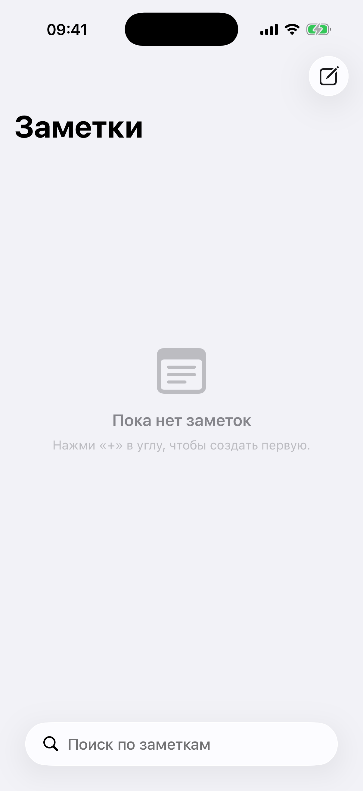

# Глава 13. Notes — UITextView, FileManager, UISearchController

{width=45%}

Заметки — второй после Todo «канонический» иос-проект. Если в Todo
главный экран — таблица с действиями, то в Notes — экран
**редактирования**. Свободный текст, без полей.

Технически отличий три: хранилище (вместо UserDefaults — FileManager),
основной view (вместо UITableViewCell с кнопками — UITextView во весь
экран), поиск через UISearchController.

## 13.1 Почему FileManager, а не UserDefaults

UserDefaults — простой Plist на диске. Хорош для:
- настроек (Bool, Int, String);
- маленьких структур (JSON в Data);
- флагов «впервые запущено», «онбординг пройден».

Но **не** для:
- больших объёмов (Apple рекомендует ≤ 1 MB на весь Defaults);
- частых записей (каждое сохранение — fsync на диск);
- структурированных данных, которые удобнее видеть отдельно.

Заметка — это **один файл**. Может быть мелким (10 байт), может — на
тысячи строк (большой markdown). И каждая заметка независима:
изменение одной не должно тригернуть перезапись всех.

Решение — **файл на заметку** в Documents:

```
Documents/
└── Notes/
    ├── 79CB4E81-... .json
    ├── 8FAD7C12-... .json
    └── A2D5F801-... .json
```

Имя файла — UUID заметки. Расширение `.json` (не для совместимости с
каким-то форматом — просто для дебага: открыл в Finder → видно
структуру).

## 13.2 Модель заметки

```swift
struct Note: Codable, Equatable, Sendable, Identifiable {
    let id: UUID
    var body: String
    var createdAt: Date
    var updatedAt: Date
    var pinned: Bool

    var title: String {
        let firstLine = body
            .split(separator: "\n", omittingEmptySubsequences: false)
            .first.map(String.init) ?? ""
        let trimmed = firstLine.trimmingCharacters(in: .whitespaces)
        return trimmed.isEmpty ? "Новая заметка" : trimmed
    }

    var preview: String {
        let lines = body.split(separator: "\n", omittingEmptySubsequences: false)
        let rest = lines.dropFirst().joined(separator: " ").trimmingCharacters(in: .whitespaces)
        if rest.isEmpty { return "Пусто" }
        return rest.count > 100 ? String(rest.prefix(100)) + "…" : rest
    }
}
```

Что в этой модели важного:

`body` — это всё. Заголовок и тело не разделены. Так делает Apple Notes,
Notion, многие другие. Первая строка тела автоматически становится
заголовком — меньше полей в UI (одно `UITextView`, не два) и гибче:
пользователь сам решает, нужен ли заголовок. Если первая строка
короткая — она и есть заголовок. Если сразу пошёл текст — заголовок
«Новая заметка».

`title` и `preview` — computed свойства, в файл не пишутся. JSON хранит
только `body` + метадату.

`pinned` — для важных заметок, которые крепятся наверху. Аналог
закрепления в мессенджерах.

## 13.3 Хранилище через FileManager

```swift
@MainActor
final class NoteStorage {
    static let shared = NoteStorage()

    private let fileManager = FileManager.default
    private let folderURL: URL
    private let encoder = JSONEncoder()
    private let decoder = JSONDecoder()

    private(set) var notes: [Note] = []
    private var subscribers: [(([Note]) -> Void)] = []

    private init() {
        let docs = fileManager.urls(for: .documentDirectory, in: .userDomainMask)[0]
        folderURL = docs.appendingPathComponent("Notes", isDirectory: true)
        try? fileManager.createDirectory(at: folderURL, withIntermediateDirectories: true)
        encoder.dateEncodingStrategy = .iso8601
        decoder.dateDecodingStrategy = .iso8601
        load()
    }
}
```

`FileManager.urls(for:in:)` — стандартный способ получить URL папки
Documents. Возвращает массив (на iOS — всегда из одного элемента).

`appendingPathComponent("Notes", isDirectory: true)` — наша
поддиректория. `isDirectory: true` — подсказка FileManager'у, что это
**папка**, а не файл (нужно для правильного URL формирования). Без
этого URL `.../Documents/Notes` мог бы интерпретироваться как файл
без расширения.

`createDirectory(at:withIntermediateDirectories: true)` — создаём
папку, если её ещё нет. `withIntermediateDirectories: true` — создаст
и всех родителей по пути (хотя в нашем случае Documents уже есть).
`try?` — если уже создана, ошибка, мы её игнорируем (нам всё равно).

## 13.4 Save / load / delete

```swift
@discardableResult
func save(_ note: Note) -> Note {
    var updated = note
    updated.updatedAt = Date()
    do {
        let data = try encoder.encode(updated)
        try data.write(to: fileURL(for: updated.id), options: .atomic)
        if let idx = notes.firstIndex(where: { $0.id == updated.id }) {
            notes[idx] = updated
        } else {
            notes.append(updated)
        }
        sortAndNotify()
    } catch {
        assertionFailure("NoteStorage save failed: \(error)")
    }
    return updated
}

func delete(_ id: UUID) {
    try? fileManager.removeItem(at: fileURL(for: id))
    notes.removeAll { $0.id == id }
    sortAndNotify()
}

private func fileURL(for id: UUID) -> URL {
    folderURL.appendingPathComponent("\(id.uuidString).json")
}
```

`@discardableResult` — позволяет вызвать `save` без чтения результата
(если вызывающий не нуждается в `updated` версии). Без атрибута Swift
бы выдал warning.

`updated.updatedAt = Date()` — обновляем timestamp **в save**. Так
вызывающему не нужно об этом думать.

`options: .atomic` — file write атомарный: данные пишутся во временный
файл, потом переименовываются. Если процесс упадёт посередине, мы НЕ
получим повреждённый файл. Старая версия останется. Это критично для
ценных пользовательских данных.

`load()` — при инициализации читаем все файлы из папки:

```swift
private func load() {
    guard let entries = try? fileManager.contentsOfDirectory(at: folderURL, includingPropertiesForKeys: nil) else { return }
    notes = entries.compactMap { url in
        guard let data = try? Data(contentsOf: url) else { return nil }
        return try? decoder.decode(Note.self, from: data)
    }
    sortAndNotify()
}
```

`contentsOfDirectory(at:includingPropertiesForKeys:)` — список URL
файлов в папке. `includingPropertiesForKeys: nil` — не запрашиваем
доп-метадату (size, modificationDate); нам она не нужна.

`compactMap` — если хотя бы один файл повреждён, мы его игнорируем,
остальные подгружаются. С `map` + force-unwrap получили бы краш при
первой ошибке.

> 💡 **Атомарная запись**. `.atomic` гарантирует, что либо ты видишь
> старую полную версию файла, либо новую полную. Никогда — половину.
> Это base feature файловой системы; используй везде, где пишешь
> ценные данные.

## 13.5 Поиск через UISearchController

`UISearchController` — обёртка над `UISearchBar`, которая встраивается
в `navigationItem.searchController`:

```swift
private func setupSearch() {
    searchController.searchResultsUpdater = self
    searchController.obscuresBackgroundDuringPresentation = false
    searchController.searchBar.placeholder = "Поиск по заметкам"
    navigationItem.searchController = searchController
    navigationItem.hidesSearchBarWhenScrolling = false
    definesPresentationContext = true
}
```

Что делают параметры:

- `searchResultsUpdater = self` — кто получает уведомления о изменении
  текста. Реализуем `UISearchResultsUpdating`.
- `obscuresBackgroundDuringPresentation = false` — основной экран не
  затемняется во время поиска. Это правильно: мы фильтруем **прямо
  на тех же ячейках**, не открываем отдельный VC для результатов.
- `hidesSearchBarWhenScrolling = false` — searchbar **всегда** виден.
  По умолчанию iOS прячет его при скролле вниз и показывает при
  pull-down. Для приложений с активным поиском — лучше всегда видеть.
- `definesPresentationContext = true` — нужен для правильного управления
  navigation context при поиске.

И сам делегат:

```swift
extension NoteListViewController: UISearchResultsUpdating {
    func updateSearchResults(for searchController: UISearchController) {
        applyFilter()
    }
}

private func applyFilter() {
    let query = searchController.searchBar.text ?? ""
    displayedNotes = NoteStorage.shared.search(query: query)
    emptyState.isHidden = !displayedNotes.isEmpty
    tableView.isHidden = displayedNotes.isEmpty
    tableView.reloadData()
}
```

`updateSearchResults` зовётся **на каждое нажатие клавиши**. Поиск в
хранилище — простой `contains` без регистра:

```swift
func search(query: String) -> [Note] {
    let q = query.lowercased().trimmingCharacters(in: .whitespacesAndNewlines)
    guard !q.isEmpty else { return notes }
    return notes.filter { $0.body.lowercased().contains(q) }
}
```

Для 50 заметок — мгновенно. Для тысяч — стоит подумать о debounce
(не вызывать на каждое нажатие, а через 200 мс после остановки) и о
fuzzy-поиске. Для playground'а хватит.

> 💡 **Debounce для тяжёлых запросов.** Если поиск идёт по большому
> объёму или ходит на сервер — обязательно debounce. Иначе каждое
> нажатие = отдельный запрос, перегрузка. `DispatchWorkItem`
> + `DispatchQueue.main.asyncAfter` — простой паттерн на 10 строк.

## 13.6 Группировка «закреплённые / обычные»

Список разбит на две секции:

```swift
private enum Section: Int, CaseIterable { case pinned, regular }

func numberOfSections(in tableView: UITableView) -> Int {
    Section.allCases.count
}

func tableView(_ tableView: UITableView, numberOfRowsInSection section: Int) -> Int {
    let groups = notesByGroup()
    return Section(rawValue: section) == .pinned ? groups.pinned.count : groups.regular.count
}

func tableView(_ tableView: UITableView, titleForHeaderInSection section: Int) -> String? {
    let groups = notesByGroup()
    switch Section(rawValue: section) {
    case .pinned: return groups.pinned.isEmpty ? nil : "Закреплённые"
    case .regular: return groups.regular.isEmpty || groups.pinned.isEmpty ? nil : "Заметки"
    case .none: return nil
    }
}

private func notesByGroup() -> (pinned: [Note], regular: [Note]) {
    (displayedNotes.filter { $0.pinned }, displayedNotes.filter { !$0.pinned })
}
```

`titleForHeaderInSection` хитрый: возвращает заголовок только если
есть **обе** секции с данными. Если все заметки обычные — заголовок
«Заметки» не показываем. Если все закреплённые — нет заголовка
«Закреплённые». Это убирает шумные пустые заголовки.

## 13.7 Swipe — pin / unpin

```swift
func tableView(_ tableView: UITableView,
               leadingSwipeActionsConfigurationForRowAt indexPath: IndexPath)
-> UISwipeActionsConfiguration? {
    let target = note(at: indexPath)
    let pin = UIContextualAction(
        style: .normal,
        title: target.pinned ? "Открепить" : "Закрепить"
    ) { _, _, done in
        NoteStorage.shared.togglePin(target.id)
        done(true)
    }
    pin.image = UIImage(systemName: target.pinned ? "pin.slash.fill" : "pin.fill")
    pin.backgroundColor = .systemYellow
    return UISwipeActionsConfiguration(actions: [pin])
}
```

Свайп вправо (`leadingSwipeActions`) — переключатель `pinned`.
Жёлтый фон, иконка `pin.fill` или `pin.slash.fill` в зависимости от
текущего состояния.

`togglePin` в storage:

```swift
func togglePin(_ id: UUID) {
    guard var note = notes.first(where: { $0.id == id }) else { return }
    note.pinned.toggle()
    save(note)
}
```

После toggle — `save(_)`, который обновляет `updatedAt` и шлёт
notify. Наш VC через подписчика перерисует таблицу.

## 13.8 Editor — UITextView во весь экран + auto-save

`NoteEditorViewController` — один большой UITextView и метка с
датой обновления вверху. Никаких toolbar'ов (для базового
markdown'а не нужно).

Auto-save с debounce:

```swift
private var saveWorkItem: DispatchWorkItem?
private var didEverEdit = false

func textViewDidChange(_ textView: UITextView) {
    didEverEdit = true
    scheduleSave()
}

private func scheduleSave() {
    saveWorkItem?.cancel()
    let work = DispatchWorkItem { [weak self] in self?.flushSave() }
    saveWorkItem = work
    DispatchQueue.main.asyncAfter(deadline: .now() + 0.4, execute: work)
}

private func flushSave() {
    saveWorkItem?.cancel()
    saveWorkItem = nil
    guard didEverEdit else { return }
    note.body = textView.text
    note = NoteStorage.shared.save(note)
    updateDateLabel()
    title = note.title
}
```

Что происходит:

1. Юзер печатает букву — `textViewDidChange` зовётся.
2. Мы планируем сохранение через 0.4с (`scheduleSave`).
3. Если юзер быстро печатает — таймер сбрасывается на каждой букве.
4. Когда юзер на 0.4с останавливается — `flushSave` срабатывает.
5. Берём текст из UITextView, сохраняем в storage, обновляем дату.

`DispatchWorkItem` — отменяемая работа. `cancel()` мешает её запустить,
если ещё не наступило время. Альтернатива — `Timer`, но он громоздче.

`didEverEdit` — флаг «юзер хоть раз поменял текст». Без этого мы
сохраняли бы пустые заметки только потому что юзер их открыл и
вышел. С флагом — открытие без изменения не оставляет следов.

При `viewWillDisappear` форсируем сохранение и удаляем заметку, если
она пустая:

```swift
override func viewWillDisappear(_ animated: Bool) {
    super.viewWillDisappear(animated)
    flushSave()
    if isNew, note.body.trimmingCharacters(in: .whitespacesAndNewlines).isEmpty {
        NoteStorage.shared.delete(note.id)
    }
}
```

Это поведение Apple Notes: создал заметку, ничего не написал, вышел —
заметка не появилась в списке. Только реальные данные сохраняются.

> 💡 **Зачем `flushSave` при выходе.** Юзер может не дать 0.4с
> debounce'у сработать (быстро нажал «назад»). Без `flushSave` —
> потеряли последние буквы.

## 13.9 Keyboard avoidance — keyboardLayoutGuide и не только

В iOS 15 появился `UIView.keyboardLayoutGuide` — guide, который
автоматически отслеживает клавиатуру. Можно констрейнить view к нему,
и всё подвинется при появлении клавиатуры.

Но у нас старый, проверенный способ — через `NotificationCenter` и
ручное обновление constraint'а:

```swift
@objc private func keyboardWillChange(_ note: Notification) {
    guard let frame = note.userInfo?[UIResponder.keyboardFrameEndUserInfoKey] as? CGRect else { return }
    let inset = view.bounds.height - view.convert(frame, from: nil).origin.y
    keyboardConstraint.constant = -max(0, inset - view.safeAreaInsets.bottom)
    UIView.animate(withDuration: 0.25) { self.view.layoutIfNeeded() }
}
```

Что здесь:

1. `keyboardFrameEndUserInfoKey` — финальное положение клавиатуры в
   экранных координатах.
2. `view.convert(frame, from: nil)` — переводим из экранных в
   локальные.
3. `inset = bounds.height - frame.origin.y` — сколько клавиатура
   занимает снизу.
4. `keyboardConstraint.constant = -inset + safeAreaInsets.bottom` —
   приподнимаем низ UITextView над клавиатурой.

Альтернатива (для нового проекта) — `keyboardLayoutGuide`:

```swift
NSLayoutConstraint.activate([
    textView.bottomAnchor.constraint(equalTo: view.keyboardLayoutGuide.topAnchor)
])
```

Одна строка, никаких observer'ов. Я бы советовал так для всех новых
проектов. У нас в Notes — старый способ для демонстрации, что и так
тоже работает.

## 13.10 Меню действий в navbar — UIMenu

В навигации Notes — кнопка `ellipsis.circle` с меню:

```swift
private func setupNavigation() {
    let pinAction = UIAction(
        title: note.pinned ? "Открепить" : "Закрепить",
        image: UIImage(systemName: note.pinned ? "pin.slash" : "pin")
    ) { [weak self] _ in
        self?.togglePin()
    }
    let shareAction = UIAction(title: "Поделиться", image: UIImage(systemName: "square.and.arrow.up")) { [weak self] _ in
        self?.shareNote()
    }
    let deleteAction = UIAction(
        title: "Удалить",
        image: UIImage(systemName: "trash"),
        attributes: .destructive
    ) { [weak self] _ in
        self?.deleteNote()
    }
    let menu = UIMenu(children: [pinAction, shareAction, deleteAction])
    navigationItem.rightBarButtonItem = UIBarButtonItem(
        image: UIImage(systemName: "ellipsis.circle"),
        menu: menu
    )
}
```

`UIBarButtonItem(image:menu:)` — инициализатор с прикреплённым меню.
Тап по кнопке открывает popup с пунктами. Не надо отдельных
`UIAlertController(.actionSheet)` — этот вариант более «системный».

`attributes: .destructive` — красная подпись и иконка у пункта «Удалить».
Apple-style индикатор «осторожно».

## 13.11 Share — UIActivityViewController

```swift
private func shareNote() {
    let body = note.body.isEmpty ? note.title : note.body
    let activity = UIActivityViewController(activityItems: [body], applicationActivities: nil)
    activity.popoverPresentationController?.barButtonItem = navigationItem.rightBarButtonItem
    present(activity, animated: true)
}
```

`UIActivityViewController` — стандартный share-sheet iOS. Передаёшь
массив объектов (`activityItems`), iOS показывает доступные приложения
для шаринга (Messages, Mail, AirDrop, Notes, ...).

`popoverPresentationController?.barButtonItem` — для iPad: на нём
share-sheet показывается как popover с **источником**. Без этой
строки на iPad получишь краш.

## 13.12 Бытовая аналогия

Notes — это **записная книжка с закладками**. Каждая страница —
один файл. Можешь добавлять, рвать, закладывать (pinned). Все страницы
лежат в одной тетради на полке (Documents/Notes/).

Поиск — это **листание в поиске нужной фразы**. Не быстро, но работает.
Если у тебя 10000 страниц — нужен альтернативный механизм (индекс
+ инверсия), но для 100 страниц перелистать достаточно.

Auto-save — это как **ленинградский гипноз стенографистки**. Печатаешь —
она пишет на дубль. Не нужно говорить «сохрани». Она пишет автоматически
после короткой паузы.

## 13.13 Что мы пропустили

- **Rich text / markdown rendering**. У нас обычный текст.
  Markdown-парсинг и рендеринг — отдельная большая тема.
- **Attachments**. Прикрепить фото к заметке через
  `NSTextAttachment`.
- **Folders / Tags**. Группировка заметок по папкам или тегам.
- **iCloud sync**. Чтобы заметки появлялись на iPad. Делается через
  CloudKit или iCloud Documents container.

> 🛠 **Упражнение.** Открой Notes (жёлтая ячейка в лаунчере), создай
> заметку. Напиши первой строкой «Список покупок», за ней — товары.
> Выйди обратно. Увидишь в списке: заголовок «Список покупок», превью
> с товарами. Закрепи свайпом вправо — переехала в «Закреплённые».
> Найди заметку через поиск — введи «покупок».

## 📋 Что мы выучили

- Заметки храним **файл на запись** в `Documents/Notes/<UUID>.json`,
  через `FileManager`.
- Атомарная запись через `data.write(to:options: .atomic)` — гарантия,
  что мы не получим повреждённый файл при крахе.
- Computed `title` и `preview` — не сохраняем, вычисляем. Первая строка
  тела автоматически становится заголовком.
- `UISearchController` встраивается в `navigationItem.searchController`.
  `hidesSearchBarWhenScrolling = false` — searchbar всегда виден.
- Реализуем `UISearchResultsUpdating.updateSearchResults(for:)` —
  вызывается на каждое нажатие клавиши.
- Auto-save с debounce через `DispatchWorkItem` — отменяем предыдущий
  work item при каждом изменении, новый ставится через 0.4с.
- `viewWillDisappear` — финальная гарантия сохранения + удаление
  пустых новых заметок.
- `UIBarButtonItem(image:menu:)` — кнопка с меню, без
  `UIAlertController(.actionSheet)`.
- `UIActivityViewController` для share. На iPad обязательно
  `popoverPresentationController?.barButtonItem`.

## Apple Developer Documentation

- [UITextView](https://developer.apple.com/documentation/uikit/uitextview) — многострочное редактируемое поле, основной экран редактора заметок.
- [UISearchController](https://developer.apple.com/documentation/uikit/uisearchcontroller) — встраивается в `navigationItem.searchController`, даёт нативный searchbar.
- [UISearchResultsUpdating](https://developer.apple.com/documentation/uikit/uisearchresultsupdating) — протокол с `updateSearchResults(for:)`, вызывается при каждом нажатии клавиши.
- [FileManager](https://developer.apple.com/documentation/foundation/filemanager) — единая точка доступа к файловой системе, через неё получаем `Documents/` и создаём папки.
- [URL (filesystem)](https://developer.apple.com/documentation/foundation/url) — тип-«адрес» файла; `appendingPathComponent(_:isDirectory:)` собирает путь корректно для папки.
- [Data](https://developer.apple.com/documentation/foundation/data) — байтовый буфер; `data.write(to:options: .atomic)` даёт атомарную запись.
- [String.Encoding](https://developer.apple.com/documentation/swift/string/encoding) — кодировки для конвертации `String ↔ Data`; для JSON-файлов используем `.utf8`.

→ [Глава 14. Calculator — UIStackView grid, state machine, haptics](./22-calculator.md)
