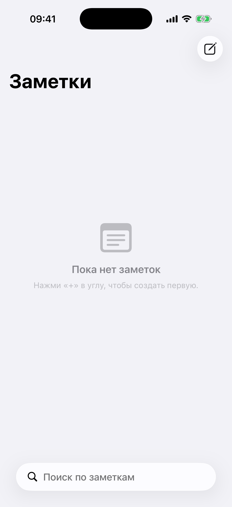

# Глава 13. Notes — UITextView, FileManager, UISearchController

{width=45%}

Заметки — второй после Todo «канонический» учебный проект iOS. Если в
Todo главный экран — таблица с действиями, то в Notes главное —
экран **редактирования**: свободный текст без полей и кнопок
«Сохранить».

Технически от Todo три отличия: хранилище (вместо UserDefaults —
отдельные файлы через FileManager), главный элемент (вместо ячеек с
кнопками — `UITextView` во весь экран) и поиск через
`UISearchController`.

Что строим — два экрана:

```
┌─────────────────────────┐      ┌─────────────────────────┐
│ Заметки              +  │      │ ‹ Заметки          (…)  │ ← меню: закрепить,
│ ┌─────────────────────┐ │      │   27 сентября, 10:15    │   поделиться, удалить
│ │ ⌕ Поиск по заметкам │ │ тап  │ Список покупок          │
│ └─────────────────────┘ │ ───▶ │ молоко                  │ ← UITextView,
│ Закреплённые            │      │ хлеб                    │   автосохранение
│  Список покупок       › │      │ яйца|                   │
│  27.09.26 молоко хлеб…  │      │                         │
│ Заметки                 │      ├─────────────────────────┤
│  Идеи для отпуска     › │      │      клавиатура         │
└─────────────────────────┘      └─────────────────────────┘
```

Проект — такой же, как в главе 12 (раздел «Перед началом»): App,
Swift 6, Default Actor Isolation = MainActor, iOS 15+, без
`Main.storyboard`. `SceneDelegate` отличается одной строкой — первым
экраном:

<!-- file: Notes/SceneDelegate.swift -->
```swift
import UIKit

final class SceneDelegate: UIResponder, UIWindowSceneDelegate {
    var window: UIWindow?

    func scene(_ scene: UIScene,
               willConnectTo session: UISceneSession,
               options connectionOptions: UIScene.ConnectionOptions) {
        guard let windowScene = scene as? UIWindowScene else { return }
        let window = UIWindow(windowScene: windowScene)
        window.rootViewController = UINavigationController(
            rootViewController: NoteListViewController()
        )
        window.makeKeyAndVisible()
        self.window = window
    }
}
```

Здесь навигационный контроллер нужен не только ради панели: из
списка мы будем **переходить** в редактор (`push`), и кнопка «‹ Заметки»
для возврата появится сама.

## 13.1 Почему FileManager, а не UserDefaults

`UserDefaults` — это один plist-файл на всё приложение (см. главу 12).
Он хорош для:

- настроек (`Bool`, `Int`, `String`);
- небольших структур (JSON в `Data`, как задачи в Todo);
- флагов «уже запускали», «онбординг пройден».

И плохо подходит для:

- **больших объёмов.** Жёсткого лимита на iOS Apple не называет, но
  весь файл целиком читается в память при старте приложения и целиком
  переписывается при изменениях. Сто заметок по 20 КБ — это 2 МБ,
  которые будут висеть в памяти, даже если пользователь открыл одну;
- **частых записей большого массива.** Поменял одну букву в одной
  заметке — перекодировал и переписал все;
- **данных, которые удобно видеть по отдельности** — например,
  удалить одну испорченную заметку, не трогая остальные.

Заметка — это **один документ**. Она может быть на 10 байт, а может
на тысячи строк. Заметки независимы: правка одной не должна
перезаписывать остальные.

Решение — **файл на заметку** в папке Documents:

```
Documents/
└── Notes/
    ├── 79CB4E81-5A0F-4E3B-9D0C-1F2A3B4C5D6E.json
    ├── 8FAD7C12-….json
    └── A2D5F801-….json
```

*Documents* — одна из папок в песочнице приложения (sandbox — личная
файловая область, которую видит только это приложение). Её
содержимое попадает в резервную копию iCloud/компьютера, поэтому там
хранят именно пользовательские данные. Для временного и того, что
можно скачать заново, есть папка Caches — её система может очистить
сама, когда кончается место.

Имя файла — `id` заметки (UUID), расширение `.json`. Формат JSON
выбран не ради совместимости — просто при отладке файл можно
открыть и прочитать глазами. Где лежит песочница симулятора, узнаешь
командой `xcrun simctl get_app_container booted <bundle id> data`.

## 13.2 Модель заметки

<!-- file: Notes/Note.swift -->
```swift
import Foundation

struct Note: Codable, Equatable, Sendable, Identifiable {
    let id: UUID
    var body: String
    let createdAt: Date
    var updatedAt: Date
    var pinned: Bool

    init(id: UUID = UUID(), body: String = "", createdAt: Date = Date(), pinned: Bool = false) {
        self.id = id
        self.body = body
        self.createdAt = createdAt
        self.updatedAt = createdAt
        self.pinned = pinned
    }

    var title: String {
        let firstLine = body
            .split(separator: "\n", omittingEmptySubsequences: false)
            .first.map(String.init) ?? ""
        let trimmed = firstLine.trimmingCharacters(in: .whitespaces)
        return trimmed.isEmpty ? "Новая заметка" : trimmed
    }

    var preview: String {
        let lines = body.split(separator: "\n", omittingEmptySubsequences: false)
        let rest = lines.dropFirst()
            .joined(separator: " ")
            .trimmingCharacters(in: .whitespaces)
        if rest.isEmpty { return "Нет дополнительного текста" }
        return rest.count > 100 ? String(rest.prefix(100)) + "…" : rest
    }
}
```

Что в этой модели важно.

**`body` — это всё.** Заголовок и текст не разделены: так устроены
«Заметки» Apple и многие другие редакторы. Первая строка текста
автоматически становится заголовком. В интерфейсе одно поле
(`UITextView`), а не два, и пользователь сам решает, нужен ли
заголовок: написал короткую первую строку — она и есть заголовок.

**`title` и `preview` — вычисляемые свойства**, в файл не пишутся.
`Codable` кодирует только хранимые свойства, поэтому JSON содержит
`id`, `body`, две даты и `pinned`.

Как работает `title` на примере. Пусть `body` = `"Список покупок\nмолоко\nхлеб"`.
`split(separator: "\n")` режет строку по переводам строки:
`["Список покупок", "молоко", "хлеб"]`. `.first` — `"Список покупок"`.
`trimmingCharacters(in: .whitespaces)` обрезает пробелы по краям.
Не пусто — это и есть заголовок.

`omittingEmptySubsequences: false` — важная деталь. По умолчанию
`split` выбрасывает пустые куски. Для текста `"\nмолоко"` (первая
строка пустая) без этого флага первым куском оказалось бы «молоко», и
заголовок «украл» бы вторую строку. С флагом первый кусок — пустая
строка, и заголовок честно станет «Новая заметка».

`preview` — всё, кроме первой строки, склеенное через пробел и
обрезанное до 100 символов. Для примера выше: `"молоко хлеб"`.

`updatedAt` в `init` равен `createdAt`: у только что созданной заметки
это одно и то же время.

`pinned` — закреплённые заметки показываются в отдельной секции сверху,
как закреплённые чаты в мессенджерах.

## 13.3 Хранилище через FileManager

<!-- file: Notes/NoteStorage.swift -->
```swift
import Foundation

@MainActor
final class NoteStorage {
    static let shared = NoteStorage()

    private let fileManager = FileManager.default
    private let folderURL: URL
    private let encoder = JSONEncoder()
    private let decoder = JSONDecoder()

    private(set) var notes: [Note] = []
    private var observers: [ObjectIdentifier: Observer] = [:]

    init(folderURL: URL? = nil) {
        if let folderURL {
            self.folderURL = folderURL
        } else {
            let docs = fileManager.urls(for: .documentDirectory, in: .userDomainMask)[0]
            self.folderURL = docs.appendingPathComponent("Notes", isDirectory: true)
        }
        do {
            try fileManager.createDirectory(at: self.folderURL, withIntermediateDirectories: true)
        } catch {
            assertionFailure("NoteStorage: не удалось создать папку: \(error)")
        }
        encoder.dateEncodingStrategy = .iso8601
        encoder.outputFormatting = [.prettyPrinted, .sortedKeys]
        decoder.dateDecodingStrategy = .iso8601
        load()
    }
}
```

**`fileManager.urls(for: .documentDirectory, in: .userDomainMask)`** —
стандартный способ получить адрес папки Documents. Возвращает массив
(API общий с macOS, где папок может быть несколько), на iOS в нём
всегда один элемент — берём `[0]`.

**`appendingPathComponent("Notes", isDirectory: true)`** — добавляем к
адресу имя подпапки. `isDirectory: true` говорит, что это папка: URL
получит завершающий `/` (`…/Documents/Notes/`), и все пути, собранные
от него дальше, будут правильными. В iOS 16 появился более короткий
`appending(path:)`, но нам нужна iOS 15.

**`createDirectory(at:withIntermediateDirectories: true)`** — создать
папку, если её нет. С `withIntermediateDirectories: true` метод
создаёт и недостающих «родителей» по пути и **не** считает ошибкой,
что папка уже существует — поэтому его можно звать при каждом
запуске. Ошибка возможна только в настоящей беде (например, диск
переполнен); на неё — `assertionFailure`, чтобы увидеть в отладке.

**`init(folderURL:)`** — адрес папки можно передать снаружи. В тестах
передают временную папку, чтобы не трогать настоящие заметки.

**`outputFormatting = [.prettyPrinted, .sortedKeys]`** — JSON с
отступами и ключами по алфавиту. Файл чуть больше, зато его приятно
читать при отладке. Сохранённая заметка выглядит так:

```
{
  "body" : "Список покупок\nмолоко",
  "createdAt" : "2026-09-27T05:15:00Z",
  "id" : "79CB4E81-5A0F-4E3B-9D0C-1F2A3B4C5D6E",
  "pinned" : false,
  "updatedAt" : "2026-09-27T05:16:12Z"
}
```

Время в файле — по UTC (буква `Z` в конце — «Zulu», нулевой часовой
пояс). 05:15 UTC — это 10:15 в Алматы (UTC+5). Хранить время в UTC и
переводить в местное только при показе — правило, которое спасает от
путаницы, когда человек летит в другой часовой пояс.

**`@MainActor`** — по той же причине, что в Todo: после изменений
хранилище зовёт подписчиков, а они трогают интерфейс. Запись одного
небольшого файла занимает доли миллисекунды, так что делать её на
главном потоке допустимо. Если бы заметки весили мегабайты (с
картинками), запись стоило бы увести в фон.

## 13.4 Сохранение, загрузка, удаление

<!-- file: Notes/NoteStorage.swift -->
```swift
extension NoteStorage {
    func note(with id: UUID) -> Note? {
        notes.first { $0.id == id }
    }

    /// Сохраняет заметку. `touch: true` — это правка текста, двигаем дату изменения.
    @discardableResult
    func save(_ note: Note, touch: Bool = true) -> Note {
        var updated = note
        if touch { updated.updatedAt = Date() }
        do {
            let data = try encoder.encode(updated)
            try data.write(to: fileURL(for: updated.id), options: .atomic)
        } catch {
            assertionFailure("NoteStorage: не удалось сохранить: \(error)")
            return note
        }
        if let index = notes.firstIndex(where: { $0.id == updated.id }) {
            notes[index] = updated
        } else {
            notes.append(updated)
        }
        sortAndNotify()
        return updated
    }

    func delete(_ id: UUID) {
        try? fileManager.removeItem(at: fileURL(for: id))
        notes.removeAll { $0.id == id }
        sortAndNotify()
    }

    func togglePin(_ id: UUID) {
        guard var note = note(with: id) else { return }
        note.pinned.toggle()
        save(note, touch: false)
    }

    private func fileURL(for id: UUID) -> URL {
        folderURL.appendingPathComponent("\(id.uuidString).json")
    }
}
```

**`@discardableResult`** — разрешает вызвать `save` и не использовать
результат. Без атрибута Swift выдаст предупреждение «result of call
to 'save' is unused». Результат нужен редактору (ему важна новая
`updatedAt`), а `togglePin` — нет.

**`updatedAt` обновляется внутри `save`**, чтобы вызывающему не
нужно было об этом помнить. Но не всегда: параметр `touch`. Закрепить
заметку — не значит изменить её текст. Если бы закрепление двигало
дату, старая заметка после закрепления «помолодела» бы и прыгнула
наверх списка как только что изменённая. Поэтому `togglePin` сохраняет
с `touch: false`.

**`options: .atomic`** — атомарная запись: данные сначала пишутся во
временный файл рядом, а потом одним действием файловой системы
подменяют старый. Если приложение упадёт или разрядится телефон
посередине записи, на диске останется либо старая полная версия, либо
новая полная — никогда половина. Для пользовательских данных это
обязательно.

**Порядок: сначала диск, потом память.** Если запись на диск не
удалась, мы выходим, не меняя массив `notes`. Иначе на экране было
бы одно, а на диске другое, и после перезапуска правка молча
исчезла бы.

**`delete` с `try?`**: если файла уже нет (удаляли дважды), ошибка
нам не важна — результат тот же, файла нет.

Загрузка при старте и уведомление подписчиков:

<!-- file: Notes/NoteStorage.swift -->
```swift
extension NoteStorage {
    func load() {
        let entries = (try? fileManager.contentsOfDirectory(
            at: folderURL, includingPropertiesForKeys: nil
        )) ?? []
        notes = entries
            .filter { $0.pathExtension == "json" }
            .compactMap { url in
                guard let data = try? Data(contentsOf: url) else { return nil }
                return try? decoder.decode(Note.self, from: data)
            }
        sortAndNotify()
    }

    func sortAndNotify() {
        notes.sort { $0.updatedAt > $1.updatedAt }
        notify()
    }
}
```

**`contentsOfDirectory(at:includingPropertiesForKeys:)`** — список
адресов файлов в папке. `includingPropertiesForKeys: nil` — не
запрашивать заранее размер, дату изменения и прочее; нам хватит
содержимого. Это ещё и плюс для приватности: API, читающие даты
файлов, входят в список «required reason API», для которых нужно
указывать причину в privacy manifest (глава 39). Мы их не трогаем.

**`.filter { $0.pathExtension == "json" }`** — пропускаем чужие файлы.
iOS или сам пользователь (если включить доступ к Documents через
приложение «Файлы») могут положить в папку что-то своё.

**`compactMap`** — `map`, который выбрасывает `nil`. Если один файл
повреждён и не читается, `try?` даст `nil`, и этот файл просто не
попадёт в список, а остальные загрузятся. С `map` и принудительным
разворачиванием (`try!`) одна испорченная заметка роняла бы всё
приложение при каждом запуске.

**Сортировка по `updatedAt` по убыванию** — свежие заметки сверху.
Порядок файлов, который вернула файловая система, не определён,
поэтому сортируем всегда сами.

Наблюдатели — тот же приём, что в главе 12, раздел 12.4: словарь по
`ObjectIdentifier` со слабой ссылкой на владельца, без `deinit`:

<!-- file: Notes/NoteStorage.swift -->
```swift
extension NoteStorage {
    struct Observer {
        weak var owner: AnyObject?
        let handler: () -> Void
    }

    func addObserver(_ owner: AnyObject, handler: @escaping () -> Void) {
        observers[ObjectIdentifier(owner)] = Observer(owner: owner, handler: handler)
    }

    private func notify() {
        observers = observers.filter { $0.value.owner != nil }
        for observer in observers.values {
            observer.handler()
        }
    }
}
```

> **Атомарная запись.** `.atomic` гарантирует, что ты видишь либо
> старую полную версию файла, либо новую полную. Никогда — половину.
> Используй её везде, где пишешь ценные данные: цена — одна лишняя
> операция переименования, то есть почти ничего.

> **Упражнение 13.1.** Запусти приложение в симуляторе, создай две
> заметки. В терминале выполни
> `xcrun simctl get_app_container booted <твой bundle id> data` и
> загляни в `Documents/Notes/` по напечатанному пути. Сколько там
> файлов и что внутри? Удали один файл из Finder и перезапусти
> приложение — что станет со списком?

## 13.5 Поиск через UISearchController

`UISearchController` — системный контроллер поиска: строка поиска с
кнопкой «Отменить» и логикой её появления и скрытия. Он встраивается
в навигационную панель через `navigationItem.searchController` (iOS 11+).

Начнём со свойств и `viewDidLoad` экрана списка:

<!-- file: Notes/NoteListViewController.swift -->
```swift
import UIKit

final class NoteListViewController: UIViewController {

    enum Section: Int, CaseIterable { case pinned, regular }

    let storage: NoteStorage
    let tableView = UITableView(frame: .zero, style: .insetGrouped)
    let searchController = UISearchController(searchResultsController: nil)
    let emptyLabel = UILabel()

    var pinnedNotes: [Note] = []
    var regularNotes: [Note] = []

    static let dateFormatter: DateFormatter = {
        let formatter = DateFormatter()
        formatter.locale = Locale(identifier: "ru_RU")
        formatter.dateStyle = .short
        formatter.timeStyle = .short
        return formatter
    }()

    init(storage: NoteStorage = .shared) {
        self.storage = storage
        super.init(nibName: nil, bundle: nil)
    }

    required init?(coder: NSCoder) {
        fatalError("init(coder:) не используется")
    }

    override func viewDidLoad() {
        super.viewDidLoad()
        title = "Заметки"
        navigationController?.navigationBar.prefersLargeTitles = true
        view.backgroundColor = .systemGroupedBackground
        navigationItem.rightBarButtonItem = UIBarButtonItem(
            systemItem: .compose,
            primaryAction: UIAction { [weak self] _ in self?.openEditor(for: nil) }
        )
        navigationItem.rightBarButtonItem?.accessibilityLabel = "Новая заметка"
        setupTable()
        setupSearch()

        storage.addObserver(self) { [weak self] in
            self?.applyFilter()
        }
        applyFilter()
    }
}
```

`UISearchController(searchResultsController: nil)` — `nil` значит
«результаты показывай в этом же экране». Можно передать отдельный
контроллер результатов (так сделан поиск в «Настройках»), но нам
проще фильтровать ту же таблицу.

`prefersLargeTitles = true` — крупный заголовок «Заметки», как в
системных приложениях. При прокрутке он сам уменьшается до обычного.

`.compose` — системная иконка «карандаш над листом», ею во всех
приложениях Apple обозначают «новый документ».

`DateFormatter` со стилями `.short` — «27.09.2026, 10:15» в русской
локали. Порядок дня и месяца форматтер берёт из правил локали, мы
его не задаём.

Разметка и настройка поиска:

<!-- file: Notes/NoteListViewController.swift -->
```swift
extension NoteListViewController {
    func setupTable() {
        tableView.translatesAutoresizingMaskIntoConstraints = false
        tableView.dataSource = self
        tableView.delegate = self
        tableView.register(UITableViewCell.self, forCellReuseIdentifier: "NoteCell")
        tableView.keyboardDismissMode = .onDrag
        view.addSubview(tableView)
        NSLayoutConstraint.activate([
            tableView.topAnchor.constraint(equalTo: view.topAnchor),
            tableView.leadingAnchor.constraint(equalTo: view.leadingAnchor),
            tableView.trailingAnchor.constraint(equalTo: view.trailingAnchor),
            tableView.bottomAnchor.constraint(equalTo: view.bottomAnchor),
        ])

        emptyLabel.numberOfLines = 0
        emptyLabel.textAlignment = .center
        emptyLabel.textColor = .secondaryLabel
        emptyLabel.font = .preferredFont(forTextStyle: .body)
        emptyLabel.adjustsFontForContentSizeCategory = true
    }

    func setupSearch() {
        searchController.searchResultsUpdater = self
        searchController.obscuresBackgroundDuringPresentation = false
        searchController.searchBar.placeholder = "Поиск по заметкам"
        navigationItem.searchController = searchController
        navigationItem.hidesSearchBarWhenScrolling = false
        definesPresentationContext = true
    }
}
```

Что делают параметры поиска:

- **`searchResultsUpdater = self`** — кому сообщать об изменении текста
  в строке поиска. Наш контроллер реализует протокол
  `UISearchResultsUpdating` (ниже).
- **`obscuresBackgroundDuringPresentation = false`** — не затемнять
  экран во время поиска. Затемнение нужно, когда результаты
  показываются в отдельном контроллере поверх; мы фильтруем прямо в
  той же таблице, и затемнённые строки нельзя было бы нажать.
- **`hidesSearchBarWhenScrolling = false`** — строка поиска видна
  всегда. По умолчанию iOS прячет её при прокрутке вниз и показывает,
  если потянуть список. Для приложения, где поиск — основной способ
  найти заметку, лучше не прятать.
- **`definesPresentationContext = true`** — «этот контроллер —
  граница для показа поиска». Без этого строка поиска, активная в
  момент перехода в редактор, могла остаться висеть поверх нового
  экрана.

**Где окажется строка поиска, решает система.** На iOS 15–18 она
стоит в навигационной панели под крупным заголовком, как на схеме в
начале главы. На iOS 26 на iPhone та же настройка рисует поле поиска
**внизу экрана**, над home-индикатором, — так выглядят новые системные
приложения (проверено в симуляторе iOS 26.5). Код для обоих вариантов
один и тот же, менять ничего не нужно.

`keyboardDismissMode = .onDrag` — клавиатура поиска прячется, как
только пользователь начинает прокручивать список.

Сам протокол и фильтр:

<!-- file: Notes/NoteListViewController.swift -->
```swift
extension NoteListViewController: UISearchResultsUpdating {
    func updateSearchResults(for searchController: UISearchController) {
        applyFilter()
    }
}

extension NoteListViewController {
    func applyFilter() {
        let query = searchController.searchBar.text ?? ""
        let found = storage.search(query: query)
        pinnedNotes = found.filter { $0.pinned }
        regularNotes = found.filter { !$0.pinned }

        if found.isEmpty {
            emptyLabel.text = query.isEmpty
                ? "Заметок пока нет.\nНажми на карандаш справа вверху."
                : "Ничего не нашлось по запросу «\(query)»."
            tableView.backgroundView = emptyLabel
        } else {
            tableView.backgroundView = nil
        }
        tableView.reloadData()
    }

    func notes(in section: Int) -> [Note] {
        Section(rawValue: section) == .pinned ? pinnedNotes : regularNotes
    }

    func note(at indexPath: IndexPath) -> Note {
        notes(in: indexPath.section)[indexPath.row]
    }

    func openEditor(for note: Note?) {
        let editor = NoteEditorViewController(note: note, storage: storage)
        navigationController?.pushViewController(editor, animated: true)
    }
}
```

`updateSearchResults(for:)` вызывается **на каждое изменение текста**
в строке поиска (каждая буква, стирание, вставка), а также при
открытии и закрытии поиска.

Пустое состояние различает два случая: заметок нет вообще («нажми на
карандаш») и ничего не нашлось по запросу. Одинаковая надпись для
обоих сбивала бы с толку: человек ищет «отпуск», видит «заметок пока
нет» и пугается, что всё пропало.

Поиск в хранилище:

<!-- file: Notes/NoteStorage.swift -->
```swift
extension NoteStorage {
    func search(query: String) -> [Note] {
        let q = query.trimmingCharacters(in: .whitespacesAndNewlines)
        guard !q.isEmpty else { return notes }
        return notes.filter {
            $0.body.range(of: q, options: [.caseInsensitive, .diacriticInsensitive]) != nil
        }
    }
}
```

`range(of:options:)` ищет подстроку с настройками сравнения.
`.caseInsensitive` — без учёта регистра («ПОКУПОК» найдёт «покупок»).
`.diacriticInsensitive` — без учёта диакритических знаков. Для
русского это важно из-за буквы «ё»: по запросу «елка» найдётся «Ёлка».
Простое `body.lowercased().contains(q)` так не умеет — проверено:
`"Ёлка и мёд".lowercased().contains("елка")` даёт `false`, а
`range(of:options:)` с этими флагами находит совпадение.

Для 50 заметок перебор мгновенный. Для тысяч длинных заметок стоит
подумать о *debounce* («подавлении дребезга» — запускать поиск не на
каждую букву, а через 200–300 мс после того, как человек перестал
печатать) и о полнотекстовом индексе. Для нашего приложения хватит.

> **Debounce для тяжёлых запросов.** Если поиск идёт по большому
> объёму или ходит на сервер, debounce обязателен. Иначе слово
> «покупки» из 7 букв — это 7 запросов подряд, из которых нужен
> только последний. Как сделать — через `DispatchWorkItem` — показано
> ниже, в 13.8: там тем же приёмом откладывается сохранение.
> Подробнее о поиске и фильтрах — глава 25.

## 13.6 Группировка «закреплённые / обычные»

Список разбит на две секции:

<!-- file: Notes/NoteListViewController.swift -->
```swift
extension NoteListViewController: UITableViewDataSource {
    func numberOfSections(in tableView: UITableView) -> Int {
        Section.allCases.count
    }

    func tableView(_ tableView: UITableView, numberOfRowsInSection section: Int) -> Int {
        notes(in: section).count
    }

    func tableView(_ tableView: UITableView, titleForHeaderInSection section: Int) -> String? {
        // Заголовки нужны, только когда есть закреплённые: иначе список один.
        guard !pinnedNotes.isEmpty else { return nil }
        switch Section(rawValue: section) {
        case .pinned:  return "Закреплённые"
        case .regular: return regularNotes.isEmpty ? nil : "Заметки"
        case .none:    return nil
        }
    }

    func tableView(_ tableView: UITableView, cellForRowAt indexPath: IndexPath) -> UITableViewCell {
        let cell = tableView.dequeueReusableCell(withIdentifier: "NoteCell", for: indexPath)
        let note = note(at: indexPath)
        var content = UIListContentConfiguration.subtitleCell()
        content.text = note.title
        content.textProperties.font = .preferredFont(forTextStyle: .headline)
        content.textProperties.numberOfLines = 1
        let date = Self.dateFormatter.string(from: note.updatedAt)
        content.secondaryText = "\(date)  \(note.preview)"
        content.secondaryTextProperties.color = .secondaryLabel
        content.secondaryTextProperties.numberOfLines = 2
        content.textToSecondaryTextVerticalPadding = 4
        cell.contentConfiguration = content
        cell.accessoryType = .disclosureIndicator
        return cell
    }
}
```

**Секций всегда две**, даже если одна пустая. Так номер секции
однозначно говорит, что в ней: 0 — закреплённые, 1 — обычные.
`Section(rawValue: section)` превращает число в перечисление. Пустая
секция без заголовка и без строк на экране не видна.

**`titleForHeaderInSection`** возвращает заголовки только если есть
закреплённые. Логика по случаям:

- закреплённых нет → заголовков нет вообще, просто список;
- есть и те, и другие → «Закреплённые» и «Заметки»;
- все закреплённые → только «Закреплённые».

Это убирает шумный заголовок «Заметки» над единственным списком.

**Ячейка без своего класса.** Здесь хватает системной разметки
«заголовок + подзаголовок». `UIListContentConfiguration` (iOS 14+) —
«рецепт» содержимого стандартной ячейки: текст, второй текст,
картинка и их стили. Мы заполняем рецепт и отдаём ячейке
(`cell.contentConfiguration = content`). Удобно для переиспользования:
каждый раз задаём рецепт целиком, и от прошлой строки ничего не
остаётся — `prepareForReuse` не нужен.

`numberOfLines = 1` у заголовка — длинный заголовок обрежется
многоточием. У превью — 2 строки. `disclosureIndicator` — серая
стрелка «›» справа: подсказка, что по тапу откроется новый экран.

## 13.7 Свайпы — закрепить и удалить

<!-- file: Notes/NoteListViewController.swift -->
```swift
extension NoteListViewController: UITableViewDelegate {
    func tableView(_ tableView: UITableView, didSelectRowAt indexPath: IndexPath) {
        tableView.deselectRow(at: indexPath, animated: true)
        openEditor(for: note(at: indexPath))
    }

    func tableView(_ tableView: UITableView,
                   leadingSwipeActionsConfigurationForRowAt indexPath: IndexPath)
    -> UISwipeActionsConfiguration? {
        let target = note(at: indexPath)
        let pin = UIContextualAction(
            style: .normal,
            title: target.pinned ? "Открепить" : "Закрепить"
        ) { [weak self] _, _, done in
            self?.storage.togglePin(target.id)
            done(true)
        }
        pin.image = UIImage(systemName: target.pinned ? "pin.slash.fill" : "pin.fill")
        pin.backgroundColor = .systemYellow
        return UISwipeActionsConfiguration(actions: [pin])
    }

    func tableView(_ tableView: UITableView,
                   trailingSwipeActionsConfigurationForRowAt indexPath: IndexPath)
    -> UISwipeActionsConfiguration? {
        let id = note(at: indexPath).id
        let delete = UIContextualAction(style: .destructive, title: "Удалить") { [weak self] _, _, done in
            self?.storage.delete(id)
            done(true)
        }
        delete.image = UIImage(systemName: "trash")
        return UISwipeActionsConfiguration(actions: [delete])
    }
}
```

Свайп **слева направо** (leading, «ведущие» действия у левого края)
— закрепить или открепить. Жёлтый фон, иконка `pin.fill` или
`pin.slash.fill` в зависимости от текущего состояния. Свайп **справа
налево** (trailing) — удалить. Подробно о сторонах свайпа и полном
свайпе — глава 12, раздел 12.8.

В замыкания захватываем заметку (`target`) или её `id`, а не
`indexPath`: к моменту тапа по кнопке строки могли переехать.

`togglePin` в хранилище (раздел 13.4) переключает флаг и сохраняет с
`touch: false`. Хранилище позовёт подписчика, `applyFilter()`
перераспределит заметки по секциям, и строка переедет в
«Закреплённые».

> **Упражнение 13.2.** Сейчас внутри каждой секции заметки идут по дате
> изменения. Сделай так, чтобы закреплённые шли в том порядке, в
> котором их закрепляли: последняя закреплённая — сверху. Подсказка:
> понадобится новое поле в модели. Что будет со старыми файлами
> заметок, в которых этого поля нет?

## 13.8 Редактор — UITextView во весь экран и автосохранение

`NoteEditorViewController` — один большой `UITextView` и надпись с
датой изменения сверху. Кнопки «Сохранить» нет: текст сохраняется
сам.

<!-- file: Notes/NoteEditorViewController.swift -->
```swift
import UIKit

final class NoteEditorViewController: UIViewController, UITextViewDelegate {

    let storage: NoteStorage
    var note: Note
    let isNew: Bool

    let textView = UITextView()
    let dateLabel = UILabel()

    var saveWorkItem: DispatchWorkItem?
    var didEverEdit = false

    static let dateFormatter: DateFormatter = {
        let formatter = DateFormatter()
        formatter.locale = Locale(identifier: "ru_RU")
        formatter.dateStyle = .long
        formatter.timeStyle = .short
        return formatter
    }()

    init(note: Note?, storage: NoteStorage = .shared) {
        self.storage = storage
        self.note = note ?? Note()
        self.isNew = (note == nil)
        super.init(nibName: nil, bundle: nil)
    }

    required init?(coder: NSCoder) {
        fatalError("init(coder:) не используется")
    }

    override func viewDidLoad() {
        super.viewDidLoad()
        view.backgroundColor = .systemBackground
        navigationItem.largeTitleDisplayMode = .never
        title = isNew ? "Новая заметка" : note.title
        setupLayout()
        setupNavigation()
        updateDateLabel()

        NotificationCenter.default.addObserver(
            self,
            selector: #selector(appWillResignActive),
            name: UIApplication.willResignActiveNotification,
            object: nil
        )
    }

    override func viewDidAppear(_ animated: Bool) {
        super.viewDidAppear(animated)
        if isNew && !didEverEdit {
            textView.becomeFirstResponder()
        }
    }

    override func viewWillDisappear(_ animated: Bool) {
        super.viewWillDisappear(animated)
        flushSave()
    }

    override func viewDidDisappear(_ animated: Bool) {
        super.viewDidDisappear(animated)
        // isMovingFromParent — экран действительно сняли со стека
        // («Назад» или свайп от края довели до конца), а не перекрыли.
        guard isMovingFromParent, isNew else { return }
        if note.body.trimmingCharacters(in: .whitespacesAndNewlines).isEmpty {
            storage.delete(note.id)
        }
    }
}
```

Редактор получает `Note?`: `nil` — создать новую, иначе править
существующую. `isNew` запоминает, какой из случаев, — это понадобится
при выходе.

`largeTitleDisplayMode = .never` — в редакторе обычный маленький
заголовок, крупный остаётся только у списка.

**Сохранение при уходе приложения в фон.**
`UIApplication.willResignActiveNotification` приходит, когда
приложение перестаёт быть активным: пользователь свернул его, открыл
Пункт управления, пришёл звонок. Если в этот момент последняя правка
ещё ждёт своих 0,4 секунды (см. ниже), а систему потом выгрузит
приложение из памяти — буквы пропадут. Поэтому по этому сигналу
сохраняем немедленно. Отписываться в `deinit` не нужно: с iOS 9
`NotificationCenter` сам перестаёт звать освобождённые объекты,
подписанные через `addObserver(_:selector:name:object:)`.

**Жизненный цикл экрана.** Контроллер получает события по порядку:
`viewDidLoad` (один раз) → `viewWillAppear` → `viewDidAppear` (экран
показан) → … → `viewWillDisappear` → `viewDidDisappear` (экран ушёл).
Мы используем три из них:

- `viewDidAppear` — ставим курсор в текст новой заметки (почему не
  раньше — см. главу 12, раздел 12.10);
- `viewWillDisappear` — сохраняем всё, что не успело сохраниться;
- `viewDidDisappear` — удаляем пустую новую заметку.

Почему удаление в `viewDidDisappear`, а не в `viewWillDisappear`, —
тонкость, на которой спотыкаются. Свайп от левого края назад можно
**не довести** до конца: человек потянул, передумал и отпустил. При
этом `viewWillDisappear` **вызывается** (экран начал уходить), а
потом экран возвращается. Если удалять в `viewWillDisappear`, пустая
новая заметка исчезла бы из хранилища, хотя пользователь остался в
ней. `viewDidDisappear` приходит только когда экран действительно
скрылся, а `isMovingFromParent` уточняет, что его убрали из стека,
а не перекрыли другим экраном (например, листом «Поделиться»).

Разметка:

<!-- file: Notes/NoteEditorViewController.swift -->
```swift
extension NoteEditorViewController {
    func setupLayout() {
        dateLabel.font = .preferredFont(forTextStyle: .caption1)
        dateLabel.adjustsFontForContentSizeCategory = true
        dateLabel.textColor = .secondaryLabel
        dateLabel.textAlignment = .center

        textView.text = note.body
        textView.font = .preferredFont(forTextStyle: .body)
        textView.adjustsFontForContentSizeCategory = true
        textView.delegate = self
        textView.alwaysBounceVertical = true
        textView.keyboardDismissMode = .interactive
        textView.textContainerInset = UIEdgeInsets(top: 8, left: 12, bottom: 16, right: 12)

        [dateLabel, textView].forEach {
            $0.translatesAutoresizingMaskIntoConstraints = false
            view.addSubview($0)
        }

        NSLayoutConstraint.activate([
            dateLabel.topAnchor.constraint(equalTo: view.safeAreaLayoutGuide.topAnchor, constant: 4),
            dateLabel.leadingAnchor.constraint(equalTo: view.layoutMarginsGuide.leadingAnchor),
            dateLabel.trailingAnchor.constraint(equalTo: view.layoutMarginsGuide.trailingAnchor),

            textView.topAnchor.constraint(equalTo: dateLabel.bottomAnchor, constant: 4),
            textView.leadingAnchor.constraint(equalTo: view.safeAreaLayoutGuide.leadingAnchor),
            textView.trailingAnchor.constraint(equalTo: view.safeAreaLayoutGuide.trailingAnchor),
            // Низ текста — к верху клавиатуры (подробно в 13.9).
            textView.bottomAnchor.constraint(equalTo: view.keyboardLayoutGuide.topAnchor),
        ])
    }

    func updateDateLabel() {
        dateLabel.text = Self.dateFormatter.string(from: note.updatedAt)
    }
}
```

`UITextView` — многострочное редактируемое поле с прокруткой (в отличие
от однострочного `UITextField`). Настройки:

- `delegate = self` — редактор будет получать события текста
  (`textViewDidChange`), для этого контроллер объявлен как
  `UITextViewDelegate`;
- `alwaysBounceVertical = true` — текст «пружинит» при прокрутке,
  даже если он короткий и помещается на экран; без этого короткая
  заметка ощущается «приклеенной»;
- `keyboardDismissMode = .interactive` — клавиатуру можно утянуть
  пальцем вниз, прокручивая текст, как в «Сообщениях»;
- `textContainerInset` — внутренние поля вокруг текста: 12 точек слева
  и справа, чтобы буквы не липли к краю экрана.

Дата — `.long` + `.short`: «27 сентября 2026 г., 10:15».

Автосохранение с задержкой:

<!-- file: Notes/NoteEditorViewController.swift -->
```swift
extension NoteEditorViewController {
    func textViewDidChange(_ textView: UITextView) {
        didEverEdit = true
        scheduleSave()
    }

    func scheduleSave() {
        saveWorkItem?.cancel()
        let work = DispatchWorkItem { [weak self] in self?.flushSave() }
        saveWorkItem = work
        DispatchQueue.main.asyncAfter(deadline: .now() + 0.4, execute: work)
    }

    func flushSave() {
        saveWorkItem?.cancel()
        saveWorkItem = nil
        guard didEverEdit, note.body != textView.text else { return }
        note.body = textView.text
        note = storage.save(note)
        updateDateLabel()
        title = note.title
    }

    @objc func appWillResignActive() {
        flushSave()
    }
}
```

Что происходит по шагам:

1. Пользователь печатает букву — вызывается `textViewDidChange`.
2. `scheduleSave` отменяет ранее запланированное сохранение и
   планирует новое через 0,4 секунды.
3. Пока человек печатает быстрее, чем раз в 0,4 секунды, каждое
   сохранение отменяется новой буквой и не успевает выполниться.
4. Как только он замер на 0,4 секунды — срабатывает `flushSave`.
5. Берём текст из `UITextView`, сохраняем, обновляем дату и заголовок.

На числах: человек набирает слово «молоко» — 6 букв с интервалом
0,15 секунды, то есть за 0,75 секунды. Без задержки было бы 6 записей
файла. С задержкой — одна, через 0,4 секунды после последней буквы.

`DispatchWorkItem` — кусок работы, который можно отменить. `cancel()`
не даёт ему запуститься, если время ещё не пришло. Альтернатива —
`Timer`, но с ним больше кода.

`[weak self]` в работе: если пользователь ушёл с экрана и контроллер
освободился, отложенное сохранение не будет держать его в памяти. (Не
страшно и потерять его: `viewWillDisappear` уже вызвал `flushSave`.)

**`didEverEdit`** — «пользователь хоть раз менял текст». Без этого
флага простое открытие и закрытие заметки обновило бы её дату
изменения, и она прыгнула бы наверх списка. Вторая проверка,
`note.body != textView.text`, отсекает случай «набрал букву и стёр» —
текст тот же, писать на диск нечего.

**`note = storage.save(note)`** — забираем из хранилища обновлённую
версию: у неё новая `updatedAt`, и надпись с датой покажет правильное
время.

> **Зачем `flushSave` при выходе.** Пользователь может не дать 0,4
> секунды задержке сработать: напечатал и сразу нажал «Назад». Без
> `flushSave` в `viewWillDisappear` последние буквы потерялись бы.

## 13.9 Клавиатура — keyboardLayoutGuide и ручной способ

Когда появляется клавиатура, она перекрывает нижнюю часть экрана —
около 300 точек на iPhone. Если ничего не делать, последние строки
заметки окажутся под клавиатурой, и человек будет печатать вслепую.

В iOS 15 у каждого view появился `keyboardLayoutGuide` — невидимая
направляющая, которая всегда стоит там, где верх клавиатуры. В
разметке выше мы привязали к ней низ текста:

```swift
textView.bottomAnchor.constraint(equalTo: view.keyboardLayoutGuide.topAnchor)
```

Одна строка — и больше ничего: клавиатура выезжает — направляющая
поднимается — `UITextView` становится ниже, система анимирует это
синхронно с клавиатурой. Когда клавиатуры нет, направляющая стоит на
нижней границе safe area, и текст идёт до низа экрана (над
home-индикатором).

До iOS 15 то же самое делали вручную, через уведомления о клавиатуре.
Этот способ полезно знать: он встречается в старом коде, а ещё в нём
хорошо видно, что происходит с координатами.

```swift
// Старый способ, для сравнения. keyboardConstraint —
// textView.bottomAnchor == view.safeAreaLayoutGuide.bottomAnchor.
@objc func keyboardWillChange(_ note: Notification) {
    guard let frame = note.userInfo?[UIResponder.keyboardFrameEndUserInfoKey] as? CGRect
    else { return }
    let keyboardTop = view.convert(frame, from: nil).minY
    let overlap = view.bounds.height - keyboardTop
    keyboardConstraint.constant = -max(0, overlap - view.safeAreaInsets.bottom)
    UIView.animate(withDuration: 0.25) { self.view.layoutIfNeeded() }
}
```

Разберём на числах для iPhone 16 Pro (экран 402 × 874 точки):

1. `keyboardFrameEndUserInfoKey` — где клавиатура **окажется** после
   анимации, в координатах экрана. Пусть её верх — на `y = 538`, а
   высота — 336 точек (538 + 336 = 874, низ экрана).
2. `view.convert(frame, from: nil)` переводит рамку из координат
   экрана в координаты нашего `view` (`nil` — «из координат окна»).
   Наш `view` занимает весь экран, поэтому числа те же: верх
   клавиатуры = 538.
3. `overlap = 874 − 538 = 336` — сколько точек снизу закрыто
   клавиатурой.
4. Наш констрейнт привязан к низу safe area, а она уже на 34 точки
   выше края экрана (полоска home-индикатора). Значит, текст надо
   поднять на 336 − 34 = 302 точки: `constant = −302`. Минус — потому
   что «вверх» в UIKit это уменьшение `y`.
5. `max(0, …)` — защита: когда клавиатура уезжает, её рамка уходит за
   низ экрана, `overlap` становится отрицательным, и подъём должен
   стать 0, а не отрицательным.
6. `UIView.animate(withDuration: 0.25) { layoutIfNeeded() }` — плавно
   за четверть секунды перестроить разметку.

Длительность 0,25 — приближение. Точная длительность и кривая
анимации клавиатуры приходят в том же `userInfo`
(`keyboardAnimationDurationUserInfoKey`,
`keyboardAnimationCurveUserInfoKey`), и аккуратный код берёт их
оттуда. `keyboardLayoutGuide` делает всё это сам — поэтому в новом
коде используй его.

## 13.10 Меню действий в навигационной панели — UIMenu

В правом углу панели редактора — кнопка `ellipsis.circle` («⋯» в
кружке) с меню:

<!-- file: Notes/NoteEditorViewController.swift -->
```swift
extension NoteEditorViewController {
    func setupNavigation() {
        let pinAction = UIAction(
            title: note.pinned ? "Открепить" : "Закрепить",
            image: UIImage(systemName: note.pinned ? "pin.slash" : "pin")
        ) { [weak self] _ in
            self?.togglePin()
        }
        let shareAction = UIAction(
            title: "Поделиться",
            image: UIImage(systemName: "square.and.arrow.up")
        ) { [weak self] _ in
            self?.shareNote()
        }
        let deleteAction = UIAction(
            title: "Удалить",
            image: UIImage(systemName: "trash"),
            attributes: .destructive
        ) { [weak self] _ in
            self?.deleteNote()
        }
        let menu = UIMenu(children: [pinAction, shareAction, deleteAction])
        navigationItem.rightBarButtonItem = UIBarButtonItem(
            image: UIImage(systemName: "ellipsis.circle"),
            menu: menu
        )
        navigationItem.rightBarButtonItem?.accessibilityLabel = "Действия"
    }

    func togglePin() {
        flushSave()
        note.pinned.toggle()
        note = storage.save(note, touch: false)
        setupNavigation()
    }

    func deleteNote() {
        saveWorkItem?.cancel()
        didEverEdit = false
        storage.delete(note.id)
        navigationController?.popViewController(animated: true)
    }
}
```

`UIBarButtonItem(image:menu:)` (iOS 14+) — кнопка, которая по тапу
сразу открывает меню. Не нужен отдельный `UIAlertController` в стиле
`.actionSheet`: меню появляется рядом с кнопкой, как в системных
приложениях.

`attributes: .destructive` — красная подпись и иконка у «Удалить».
Системный сигнал «осторожно, необратимо».

**Меню пересобирается после закрепления.** Пункты меню — готовые
объекты с фиксированными подписями. После `togglePin` подпись должна
смениться с «Закрепить» на «Открепить», поэтому `setupNavigation()`
вызывается заново.

**`deleteNote`** сначала отменяет отложенное сохранение и сбрасывает
`didEverEdit`. Иначе `viewWillDisappear` при уходе с экрана вызвал бы
`flushSave`, и тот заново записал бы только что удалённую заметку на
диск. `popViewController` — вернуться на предыдущий экран стека.

## 13.11 Поделиться — UIActivityViewController

<!-- file: Notes/NoteEditorViewController.swift -->
```swift
extension NoteEditorViewController {
    func shareNote() {
        flushSave()
        let text = note.body.isEmpty ? note.title : note.body
        let activity = UIActivityViewController(activityItems: [text], applicationActivities: nil)
        activity.popoverPresentationController?.barButtonItem = navigationItem.rightBarButtonItem
        present(activity, animated: true)
    }
}
```

`UIActivityViewController` — стандартный лист «Поделиться» (*share
sheet*). Передаёшь массив объектов (`activityItems`), iOS сама
показывает подходящие приложения и действия: «Сообщения», «Почта»,
AirDrop, «Скопировать». Мы передаём строку — все эти приложения умеют
принимать текст.

`flushSave()` в начале — чтобы поделиться тем, что на экране прямо
сейчас, а не версией полсекунды назад.

**`popoverPresentationController?.barButtonItem`** — для iPad. На нём
лист «Поделиться» показывается как всплывающее окно со стрелкой
(*popover*), и ему нужно знать, **откуда** стрелка. Без этой строки
приложение на iPad упадёт при показе с исключением
`NSGenericException` («UIPopoverPresentationController should have a
non-nil sourceView or barButtonItem»). На iPhone
`popoverPresentationController` равен `nil`, и строка ничего не
делает — поэтому `?.`.

> **Упражнение 13.3.** Добавь в меню редактора пункт «Скопировать» (иконка
> `doc.on.doc`), который кладёт текст заметки в буфер обмена без
> листа «Поделиться». Проверка: скопируй, открой новую заметку, нажми
> в тексте и выбери «Вставить» — появится тот же текст.

## 13.12 Бытовая аналогия

Notes — это **записная книжка на кольцах**. Каждая страница — один
файл: её можно вынуть, заменить или выбросить, не трогая остальные
(в отличие от UserDefaults, который больше похож на одну длинную
тетрадь — чтобы поправить строчку, её переписывают целиком).
Закреплённые заметки — страницы с закладкой, книжка открывается на
них первыми. Все страницы лежат в одной папке на полке —
`Documents/Notes/`.

Поиск — это **листание в поисках нужной фразы**. Для сотни страниц
пролистать быстро. Для десяти тысяч понадобится предметный
указатель — поисковый индекс.

Автосохранение — как **секретарь, который записывает за тобой**:
ты диктуешь, а он переносит в журнал не каждое слово по отдельности,
а целую фразу, когда ты делаешь паузу. Говорить «запиши» не нужно.

## 13.13 Что мы пропустили

- **Форматированный текст и Markdown.** У нас обычный текст. Жирный,
  списки, заголовки — через `NSAttributedString` и свой парсер
  Markdown, это отдельная большая тема.
- **Вложения.** Фото внутри заметки — через `NSTextAttachment`.
- **Папки и теги.** Группировка заметок.
- **Синхронизация через iCloud**, чтобы заметки были и на iPad.
  Делается через CloudKit или контейнер iCloud Documents.
- **Отмена изменений.** У `UITextView` есть встроенный `undoManager`:
  встряхивание телефона предлагает «Отменить ввод». Для текста работает
  само, но его стоит проверить после наших программных правок.

> **Упражнение 13.4.** Пройди сценарий целиком:
>
> 1. Создай заметку: первая строка «Список покупок», дальше
>    «молоко», «хлеб».
> 2. Вернись назад. В списке — заголовок «Список покупок» и превью
>    «молоко хлеб».
> 3. Проведи по строке слева направо и нажми «Закрепить» — заметка
>    переехала в секцию «Закреплённые».
> 4. Введи в поиске «ПОКУПОК» — заметка находится, регистр не важен.
> 5. Создай новую заметку и сразу нажми «Назад», ничего не написав —
>    в списке она не появилась.

## Ответы к упражнениям

**Упражнение 13.1.** Файлов столько же, сколько заметок, — два. Внутри —
JSON с отступами, как в разделе 13.3. Удалённый вручную файл после
перезапуска пропадёт из списка: хранилище при старте читает папку
заново, а о заметке, которой нет на диске, ничего не знает.

**Упражнение 13.2.** Добавь в `Note` поле `var pinnedAt: Date?`,
в `togglePin` ставь `note.pinnedAt = note.pinned ? Date() : nil`, а в
`applyFilter()` сортируй закреплённые отдельно:

```swift
pinnedNotes = found.filter { $0.pinned }
    .sorted { ($0.pinnedAt ?? .distantPast) > ($1.pinnedAt ?? .distantPast) }
```

Со старыми файлами ничего страшного не случится: у опционального поля
автоматический `Decodable` считает отсутствие ключа значением `nil`.
Будь поле необязательным без `?` — старые заметки перестали бы
читаться, и `compactMap` в `load()` молча выбросил бы их все.
`.distantPast` — «очень давно»: заметки без даты закрепления уйдут в
конец.

**Упражнение 13.3.** В `setupNavigation()`:

```swift
let copyAction = UIAction(
    title: "Скопировать",
    image: UIImage(systemName: "doc.on.doc")
) { [weak self] _ in
    guard let self else { return }
    UIPasteboard.general.string = self.textView.text
}
```

и добавь `copyAction` в `children` меню. `UIPasteboard.general` —
системный буфер обмена. На iOS 14+ при **чтении** чужого буфера
система показывает уведомление «Приложение вставило из …»; запись в
буфер уведомлений не вызывает.

**Упражнение 13.4.** Ожидаемый результат — в самих шагах. Если в пункте 5
пустая заметка появилась, проверь, что удаление стоит в
`viewDidDisappear` и что условие `isNew` верно передаётся из списка
(`openEditor(for: nil)` для новой).

## Что мы выучили

- Заметки храним **файлом на запись** в `Documents/Notes/<UUID>.json`
  через `FileManager`. Documents — для пользовательских данных, Caches —
  для того, что можно восстановить.
- Атомарная запись `data.write(to:options: .atomic)` — на диске
  никогда не окажется половина файла. Сначала пишем диск, потом
  меняем массив в памяти.
- Вычисляемые `title` и `preview` не сохраняются: первая строка текста
  становится заголовком. `split(omittingEmptySubsequences: false)` не
  теряет пустую первую строку.
- Закрепление не меняет дату изменения (`save(touch: false)`).
- `UISearchController` встраивается в `navigationItem.searchController`.
  `updateSearchResults(for:)` вызывается на каждое изменение текста.
  Поиск через `range(of:options: [.caseInsensitive, .diacriticInsensitive])`
  находит «Ёлку» по «елка».
- `UIListContentConfiguration` — стандартная ячейка без своего класса.
- Автосохранение с задержкой через `DispatchWorkItem`: каждая буква
  отменяет прошлую запись и планирует новую через 0,4 секунды.
  Плюс принудительное сохранение при уходе с экрана и при сворачивании
  приложения.
- Пустую новую заметку удаляем в `viewDidDisappear` с проверкой
  `isMovingFromParent` — не в `viewWillDisappear`, который вызывается
  и при недотянутом свайпе назад.
- Клавиатура — `view.keyboardLayoutGuide` (iOS 15+) одной строкой;
  ручной способ через `keyboardFrameEndUserInfoKey` — для старого кода.
- `UIBarButtonItem(image:menu:)` — кнопка с меню;
  `UIActivityViewController` — «Поделиться», на iPad обязателен
  `popoverPresentationController?.barButtonItem`.

## Apple Developer Documentation

- [UITextView](https://developer.apple.com/documentation/uikit/uitextview) — многострочное редактируемое поле, основной экран редактора заметок.
- [UISearchController](https://developer.apple.com/documentation/uikit/uisearchcontroller) — встраивается в `navigationItem.searchController`, даёт системную строку поиска.
- [UISearchResultsUpdating](https://developer.apple.com/documentation/uikit/uisearchresultsupdating) — протокол с `updateSearchResults(for:)`, вызывается при каждом изменении текста поиска.
- [FileManager](https://developer.apple.com/documentation/foundation/filemanager) — единая точка доступа к файловой системе, через неё получаем `Documents/` и создаём папки.
- [URL (filesystem)](https://developer.apple.com/documentation/foundation/url) — тип-«адрес» файла; `appendingPathComponent(_:isDirectory:)` собирает путь корректно для папки.
- [Data](https://developer.apple.com/documentation/foundation/data) — байтовый буфер; `data.write(to:options: .atomic)` даёт атомарную запись.
- [String.Encoding](https://developer.apple.com/documentation/swift/string/encoding) — кодировки для конвертации `String ↔ Data`; `JSONEncoder` всегда пишет UTF-8.

→ [Глава 14. Calculator — UIStackView grid, state machine, haptics](./22-calculator.md)
