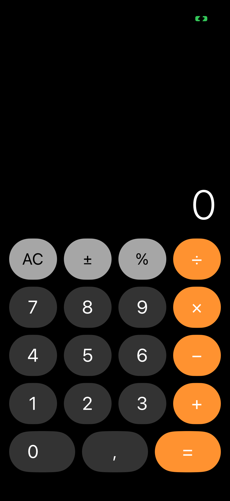

# Глава 14. Calculator — UIStackView grid, state machine, haptics

{width=45%}

Калькулятор — на удивление поучительный mini-app. Он практически
не работает с серверами или хранилищем, но даёт три ценных навыка:

1. **Грид из кнопок** через вложенные `UIStackView`. Адаптивный,
   без `UICollectionView`.
2. **State machine** — отделить логику вычислений от UI.
3. **Haptic feedback** на каждый тап + специальные хептики для ошибок.

В этой главе разбираем все три.

## 14.1 Архитектура — разделение Engine / VC

Главное правило калькулятора: **логика отделена от UI**.

```swift
struct CalculatorEngine {
    enum Key: Equatable {
        case digit(Int)
        case dot
        case binary(BinaryOp)
        case equals
        case clear
        case allClear
        case negate
        case percent
    }

    enum BinaryOp: String, Equatable {
        case add = "+", sub = "−", mul = "×", div = "÷"

        func apply(_ a: Double, _ b: Double) -> Double {
            switch self {
            case .add: return a + b
            case .sub: return a - b
            case .mul: return a * b
            case .div: return b == 0 ? .nan : a / b
            }
        }
    }

    private var accumulator: Double = 0
    private var currentInput: String = "0"
    private var pendingOp: BinaryOp?
    private var waitingForRight: Bool = false
    private var hasError: Bool = false

    var display: String { hasError ? "Ошибка" : currentInput }
    var activeOp: BinaryOp? { waitingForRight ? pendingOp : nil }

    mutating func input(_ key: Key) {
        // ...
    }
}
```

Engine — `struct`, потому что **value semantics** ему подходят. Каждое
действие — это переход состояния. Engine не публикует уведомления, не
работает с UIKit, не зависит от потока. Чистая логика.

UI зовёт `engine.input(.digit(5))`, потом читает `engine.display`,
рисует на экране. Цикл «событие → состояние → отрисовка» — это
**unidirectional data flow**, базовая идея TEA / Redux / SwiftUI.

> 💡 **Зачем разделять.** Без разделения логика расползается между
> ячейками кнопок и `IBAction`'ами. Через полгода нормально работающий
> калькулятор внезапно падает на `5 + 5 + = =`, и ты не понимаешь
> почему. С чистым Engine — пишешь юнит-тесты, дебажишь без
> симулятора.

## 14.2 Состояния — как «думает» калькулятор

Любой калькулятор внутри — конечный автомат. Состояния:

- **Ввод первого числа**. Тыкаешь цифры — добавляются.
- **Ожидание оператора**. Первое число введено, ждём `+ / − / × / ÷`.
- **Ожидание второго числа**. Оператор нажат, ждём цифр.
- **Ввод второго числа**. Тыкаешь цифры — добавляются.
- **Результат**. Нажал `=`, видишь ответ.
- **Ошибка**. Деление на ноль или иное непредвиденное.

Эти состояния не хранятся как `enum CurrentState`. Они **вычисляются**
из трёх флагов:

- `accumulator: Double` — левый операнд (или последний результат).
- `currentInput: String` — то, что юзер вводит сейчас.
- `pendingOp: BinaryOp?` — выбранный оператор, ждущий второго операнда.
- `waitingForRight: Bool` — флаг «оператор только что нажат, следующая
  цифра обнулит currentInput».

`waitingForRight` — ключ. Без него ввод `5 + 3` сломался бы:

```
[5]      → currentInput = "5"
[+]      → pendingOp = .add, waitingForRight = true
[3]      → currentInput.append("3") → "53"  ← НЕПРАВИЛЬНО
```

С флагом:

```
[5]      → currentInput = "5"
[+]      → pendingOp = .add, waitingForRight = true
[3]      → waitingForRight → currentInput = "3", waitingForRight = false
[=]      → result = 5 + 3 = 8
```

## 14.3 Главный метод — `input(_:)`

```swift
mutating func input(_ key: Key) {
    if hasError, key != .allClear { return }
    switch key {
    case .digit(let d): appendDigit(d)
    case .dot: appendDot()
    case .binary(let op): setBinaryOp(op)
    case .equals: evaluate()
    case .clear: clearEntry()
    case .allClear: allClear()
    case .negate: negate()
    case .percent: percent()
    }
}
```

Защита от ошибки наверху: если `hasError == true`, разрешён только
`allClear`. Остальные клавиши игнорируются — иначе пользователь
запутается, нажимая «5 + 3» поверх «Ошибка».

`switch key` — диспетчер на private методы. Каждый метод — это
один переход состояния.

### `appendDigit`:

```swift
private mutating func appendDigit(_ d: Int) {
    if waitingForRight {
        currentInput = "\(d)"
        waitingForRight = false
        return
    }
    if currentInput == "0" {
        currentInput = "\(d)"
    } else {
        if currentInput.replacingOccurrences(of: "-", with: "").count >= 12 { return }
        currentInput.append("\(d)")
    }
}
```

Три ветки:

1. `waitingForRight` — начинаем новый ввод с этой цифры.
2. `currentInput == "0"` — заменяем (чтобы не получилось «05»).
3. Иначе — добавляем в конец, но не больше 12 цифр (визуальный лимит).

`replacingOccurrences(of: "-", with: "")` — если число отрицательное,
минус не считаем в длине. «−123456789012» — 12 цифр + минус = 13
символов, но реально цифр 12.

### `setBinaryOp`:

```swift
private mutating func setBinaryOp(_ op: BinaryOp) {
    if waitingForRight {
        // Пользователь поменял оператор подряд: 5 + − → теперь −.
        pendingOp = op
        return
    }
    if let pending = pendingOp {
        let result = pending.apply(accumulator, current)
        if result.isNaN { hasError = true; return }
        accumulator = result
        currentInput = format(result)
    } else {
        accumulator = current
    }
    pendingOp = op
    waitingForRight = true
}
```

Два сценария:

- Если **только что** был нажат оператор (`waitingForRight`), и юзер
  нажал ещё один — заменяем. Это удобная фича: ошибся клавишей, нажал
  правильную, без сброса.
- Если уже введено второе число — **сразу вычисляем** промежуточный
  результат, прежде чем поставить новый оператор. `5 + 3 × 2`:
  - `5 +` → pending = +, accumulator = 5, waiting.
  - `3` → currentInput = 3.
  - `×` → вычисляем 5+3=8, теперь pending = ×, accumulator = 8, waiting.
  - `2` → currentInput = 2.
  - `=` → 8×2 = 16.

Это **left-to-right** evaluation, без приоритетов. Стандартный
калькулятор Apple так работает: `2 + 3 × 4 = 20` (а не 14). Если
хочешь приоритеты — нужен expression parser, что выходит за рамки
mini-app.

### `evaluate`:

```swift
private mutating func evaluate() {
    guard let op = pendingOp else { return }
    let result = op.apply(accumulator, current)
    if result.isNaN { hasError = true; return }
    accumulator = result
    currentInput = format(result)
    pendingOp = nil
    waitingForRight = false
}
```

Применяем `pendingOp(accumulator, current)`. Сохраняем результат
в `accumulator` (чтобы продолжить с него), показываем как
`currentInput`. `pendingOp = nil` — больше нет ожидающего оператора.

Если `result.isNaN` — это деление на ноль (мы возвращаем `.nan` в
`BinaryOp.apply` при `b == 0`). Ставим `hasError`, display покажет
«Ошибка».

## 14.4 Форматирование числа

```swift
private func format(_ value: Double) -> String {
    if value == value.rounded() {
        return String(Int(value))
    }
    let formatter = NumberFormatter()
    formatter.minimumFractionDigits = 0
    formatter.maximumFractionDigits = 8
    formatter.usesGroupingSeparator = false
    formatter.locale = Locale(identifier: "en_US_POSIX")
    return formatter.string(from: NSNumber(value: value)) ?? "\(value)"
}
```

`value == value.rounded()` — целое (нет дробной части). Показываем
без точки: `5`, не `5.0`.

Иначе — `NumberFormatter`:

- `maximumFractionDigits = 8` — до 8 знаков после точки. Дальше Double
  всё равно врёт.
- `usesGroupingSeparator = false` — без пробелов в тысячах. Калькулятор
  компактный, лишние разделители мешают.
- `locale = en_US_POSIX` — точка как десятичный разделитель, независимо
  от системной локали. Иначе на русской системе была бы запятая
  (`5,5`), но юзер набирает точку (или мы переведём наш `.` на запятую
  в `appendDot`).

> 💡 **`en_US_POSIX`** — специальная локаль для **технических** целей,
> не для отображения юзеру. Гарантирует американский формат
> (точка-разделитель, ASCII цифры) везде. Используется при сериализации.

## 14.5 UI — UIStackView grid

5 строк × 4 кнопки. Последняя строка — «0» широкая (две клетки), запятая,
«=». То есть на одну ячейку меньше, но «0» в два раза шире.

```swift
private func buildGrid() -> UIStackView {
    let rows: [[ButtonSpec]] = [
        [.gray("AC", .allClear), .gray("±", .negate), .gray("%", .percent), .orange("÷", .binary(.div))],
        [.dark("7", .digit(7)), .dark("8", .digit(8)), .dark("9", .digit(9)), .orange("×", .binary(.mul))],
        [.dark("4", .digit(4)), .dark("5", .digit(5)), .dark("6", .digit(6)), .orange("−", .binary(.sub))],
        [.dark("1", .digit(1)), .dark("2", .digit(2)), .dark("3", .digit(3)), .orange("+", .binary(.add))],
        [.dark("0", .digit(0), wide: true), .dark(",", .dot), .orange("=", .equals)],
    ]

    let vStack = UIStackView()
    vStack.axis = .vertical
    vStack.spacing = 12
    vStack.distribution = .fillEqually

    for row in rows {
        let hStack = UIStackView()
        hStack.axis = .horizontal
        hStack.spacing = 12
        hStack.distribution = .fill
        for spec in row {
            let button = makeButton(spec: spec)
            hStack.addArrangedSubview(button)
        }
        // выровнять одинаковые ширины ячеек (кроме wide-ноль)
        let normalButtons = hStack.arrangedSubviews.enumerated()
            .filter { !row[$0.offset].wide }
            .map { $0.element }
        for i in 1..<normalButtons.count {
            normalButtons[i].widthAnchor.constraint(equalTo: normalButtons[0].widthAnchor).isActive = true
        }
        vStack.addArrangedSubview(hStack)
    }
    return vStack
}
```

Структура:

- Внешний `UIStackView` вертикальный, `distribution = .fillEqually` —
  каждая строка одинаковой высоты.
- Внутренние горизонтальные с `distribution = .fill`. **Не fillEqually**,
  потому что «0» широкая. С `.fill` ширины пропорциональны
  intrinsicContentSize'у или явным constraint'ам.
- Phantom-constraint: «все обычные кнопки в строке имеют одинаковую
  ширину как первая». Это даёт «0» автоматически быть 2× размером
  (заполняет оставшееся место).

`distribution = .fillEqually` — заняли бы все 4 ячейки одинаково,
«0» бы стала как «=». Не годится.

`ButtonSpec` — структура-описание:

```swift
private struct ButtonSpec {
    let title: String
    let key: CalculatorEngine.Key
    let bg: UIColor
    let fg: UIColor
    let fontSize: CGFloat
    let weight: UIFont.Weight
    let wide: Bool

    static func gray(_ title: String, _ key: CalculatorEngine.Key) -> ButtonSpec { ... }
    static func orange(_ title: String, _ key: CalculatorEngine.Key) -> ButtonSpec { ... }
    static func dark(_ title: String, _ key: CalculatorEngine.Key, wide: Bool = false) -> ButtonSpec { ... }
}
```

Три фабрики: серая (для AC/±/%), оранжевая (для операторов и =),
тёмная (для цифр). Это удобный mini-DSL: ряд описывается компактно
`[.gray("AC", .allClear), .gray("±", .negate), ...]`.

## 14.6 Кнопки через `UIButton.Configuration`

```swift
private func makeButton(spec: ButtonSpec) -> UIButton {
    var cfg = UIButton.Configuration.filled()
    cfg.title = spec.title
    cfg.baseBackgroundColor = spec.bg
    cfg.baseForegroundColor = spec.fg
    cfg.cornerStyle = .capsule
    cfg.background.cornerRadius = 36
    cfg.contentInsets = .zero
    var attr = AttributedString(spec.title)
    attr.font = .systemFont(ofSize: spec.fontSize, weight: spec.weight)
    cfg.attributedTitle = attr

    let button = UIButton(configuration: cfg)
    button.translatesAutoresizingMaskIntoConstraints = false
    button.heightAnchor.constraint(equalToConstant: 72).isActive = true
    // ... wide handling ...
    button.addAction(UIAction { [weak self] _ in
        self?.handleTap(key: spec.key)
    }, for: .touchUpInside)
    return button
}
```

`UIButton.Configuration.filled()` (iOS 15+) — современный способ
сконфигурировать кнопку. Внутри — структура с настройками. Можно
точно контролировать `baseBackgroundColor`, `baseForegroundColor`,
`cornerStyle`, `contentInsets`, `image / title / subtitle`,
`activityIndicator` и пр.

`cornerStyle = .capsule` + `background.cornerRadius = 36` — кнопка
круглая (потому что высота 72, радиус 36 = половина).

`AttributedString` для title — единственный способ выставить точно
нужный font (Configuration по умолчанию использует системные стили).

`UIAction { [weak self] _ in ... }` — closure-based action handler,
без `@objc` методов. iOS 14+. Прямо в инициализации, без отдельной
функции с `@objc`.

> 💡 **`addAction` vs `addTarget`**. Старый `addTarget(self, action:
> #selector(...))` всё ещё работает, но `addAction` лаконичнее. И
> нет нужды в `@objc`. Используй где возможно.

## 14.7 Подсветка активного оператора

Когда юзер нажал `+` и ввёл число — `+` остаётся «висеть» в памяти. UI
показывает это инвертированным цветом: оранжевая кнопка `+`
становится **белой** с оранжевым текстом.

```swift
private func render() {
    displayLabel.text = engine.display
    for (op, button) in operatorButtons {
        let active = engine.activeOp == op
        var cfg = button.configuration
        cfg?.baseBackgroundColor = active ? .white : .systemOrange
        cfg?.baseForegroundColor = active ? .systemOrange : .white
        if let title = cfg?.title {
            var attr = AttributedString(title)
            attr.font = .systemFont(ofSize: 32, weight: .regular)
            cfg?.attributedTitle = attr
        }
        button.configuration = cfg
    }
}
```

`operatorButtons` — словарь `[BinaryOp: UIButton]`, заполняется при
создании кнопок:

```swift
if case .binary(let op) = spec.key {
    operatorButtons[op] = button
}
```

В `render()` после каждого тапа мы проходим по всем оператор-кнопкам и
обновляем цвет — активная инвертирована.

`engine.activeOp` возвращает `nil` если оператор уже применён или
вообще не выбран. Тогда **никакая** кнопка не подсвечена.

## 14.8 Haptic feedback

Два разных генератора:

```swift
private let haptic = UIImpactFeedbackGenerator(style: .medium)
private let errorHaptic = UINotificationFeedbackGenerator()

private func handleTap(key: CalculatorEngine.Key) {
    engine.input(key)
    render()
    if engine.display == "Ошибка" {
        errorHaptic.notificationOccurred(.error)
    } else {
        haptic.impactOccurred(intensity: 0.6)
    }
}
```

`UIImpactFeedbackGenerator(style: .medium)` — короткий, тактильный
«удар». На обычном тапе. `intensity: 0.6` — 60% от полной силы; на
максимум (1.0) слишком сильно для каждого тапа.

`UINotificationFeedbackGenerator` — три типа: `.success`, `.warning`,
`.error`. Каждый — последовательность импульсов. `.error` ощущается как
«двойной отказ», подходит для «Ошибка».

> 💡 **Prepare для оптимизации.** Haptic feedback engine «спит» в фоне.
> Первый вызов после длительного простоя имеет задержку 100-200мс.
> `haptic.prepare()` за пару секунд **до** ожидаемого использования
> прогревает движок. У нас в калькуляторе не критично (юзер сам тыкает),
> но для chat-приложений типа «typing indicator» — обязательно.

## 14.9 Dark mode по умолчанию

Калькулятор всегда тёмный:

```swift
override func viewDidLoad() {
    super.viewDidLoad()
    view.backgroundColor = .black
    overrideUserInterfaceStyle = .dark
}
```

`overrideUserInterfaceStyle = .dark` — этот VC и все его дочерние всегда
в dark mode, независимо от системной темы. У нас это потому что
дизайн калькулятора (apple-style) очень привязан к тёмному фону.

Можно было бы поддержать обе темы (как делает iOS Calculator), но это
больше дизайна, чем кода. Для playground'а упростили.

## 14.10 Бытовая аналогия

Engine — это **бухгалтер с тетрадью**. Знает что сейчас лежит на
левой странице (accumulator), что на правой (currentInput), какое
действие ждёт (pendingOp). Не имеет рук, ничего не показывает —
только пишет.

UI — это **табло**, которое показывает что бухгалтер записал. Юзер
тыкает кнопку — UI говорит бухгалтеру «получи цифру 5», бухгалтер
пишет, UI читает обратно «что у тебя на табло».

Это разделение позволяет:

- **Тестировать бухгалтера**: дать ему 100 операций, проверить ответ.
- **Менять UI**: можно сделать кнопки круглыми, квадратными, иконками —
  бухгалтер не заметит.
- **Менять Engine**: добавил функции (sin, cos, log) — UI просто
  получает новые кнопки.

## 14.11 Что мы пропустили

- **Memory** (M+, M-, MR, MC) — отдельный регистр.
- **Scientific** mode — sin, cos, log, π, e. Apple даёт это
  поворотом устройства в landscape.
- **History** — список предыдущих вычислений. Можно скроллить вверх.
- **Theming** — кастомные цвета, не только Apple-стиль.

Все эти добавки — поверх той же базы (Engine + UI). Каждая — 30-50
строк сверху.

> 🛠 **Упражнение.** Открой Калькулятор. Введи `7 × 8 =`. Дальше
> сразу `+ 2 =` — получишь 58. Это потому что после `=` `accumulator`
> остался 56, и `+ 2 =` использует его как левый операнд. Стандартное
> поведение калькулятора. Теперь попробуй сделать «двойной плюс»:
> `5 + + 3 =`. Получишь 8 — второй `+` просто заменил первый.

## 📋 Что мы выучили

- **Engine отдельно от UI**. `struct CalculatorEngine` — value-type,
  без UIKit-зависимостей.
- Состояние = `accumulator + currentInput + pendingOp + waitingForRight`.
  Эти четыре поля представляют все возможные шаги ввода.
- `waitingForRight: Bool` — критический флаг. После нажатия оператора
  следующая цифра обнуляет `currentInput`.
- **Left-to-right evaluation** без приоритетов: `2 + 3 × 4 = 20`,
  как в стандартном калькуляторе iOS.
- Grid из кнопок через вложенные `UIStackView`: вертикальный
  `fillEqually` + горизонтальные `fill` + phantom-constraint'ы для
  одинаковых ширин обычных кнопок.
- `UIButton.Configuration` (iOS 15+) — современная конфигурация,
  `addAction(UIAction)` вместо `addTarget(_:action:)`.
- Подсветка активного оператора — словарь `[BinaryOp: UIButton]` +
  обновление цветов в `render()` после каждого тапа.
- Haptic feedback: `UIImpactFeedbackGenerator` (мягкий тап) +
  `UINotificationFeedbackGenerator(.error)` (для ошибок).
- `overrideUserInterfaceStyle = .dark` — принудительная тёмная тема
  для этого VC.

## Apple Developer Documentation

- [UIStackView](https://developer.apple.com/documentation/uikit/uistackview) — контейнер для горизонтальных/вертикальных раскладок, основа сетки кнопок калькулятора.
- [UIButton](https://developer.apple.com/documentation/uikit/uibutton) — кнопка; `UIButton.Configuration.filled()` (iOS 15+) задаёт фон, форму и attributedTitle.
- [UIImpactFeedbackGenerator](https://developer.apple.com/documentation/uikit/uiimpactfeedbackgenerator) — тактильный «удар» с настраиваемой `intensity` для обычных тапов.
- [UISelectionFeedbackGenerator](https://developer.apple.com/documentation/uikit/uiselectionfeedbackgenerator) — тонкий «щёлк», уместен для смены выбора (например, активного оператора).
- [Decimal](https://developer.apple.com/documentation/foundation/decimal) — точная десятичная арифметика без бинарных погрешностей Double; апгрейд для серьёзного калькулятора.
- [NumberFormatter](https://developer.apple.com/documentation/foundation/numberformatter) — форматирование чисел; в главе используем для отображения результата.
- [Enumerations](https://docs.swift.org/swift-book/documentation/the-swift-programming-language/enumerations) — Swift Book про enum, на котором держится наш `Key`/`BinaryOp` state machine.

→ [Глава 15. Weather — open-meteo, pull-to-refresh, skeleton, offline](./23-weather.md)
