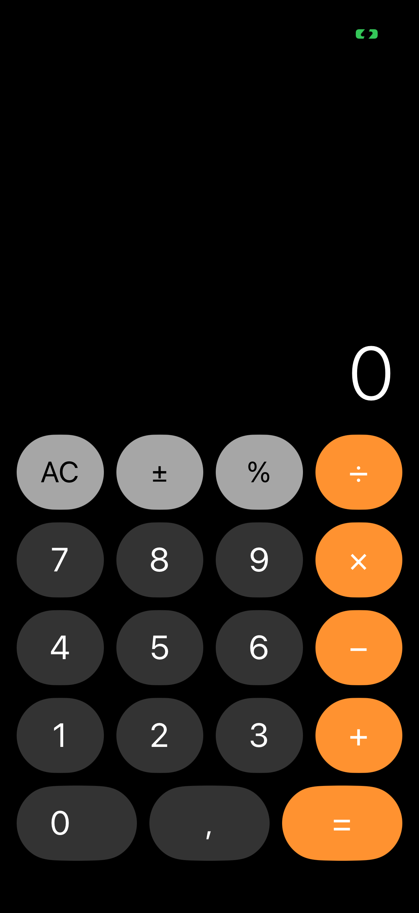

# Глава 14. Calculator — UIStackView grid, state machine, haptics

{width=45%}

Калькулятор — на удивление поучительное мини-приложение. Он не
работает ни с сервером, ни с хранилищем, зато даёт три ценных навыка:

1. **Сетка кнопок** из вложенных `UIStackView`. Подстраивается под
   размер экрана, обходится без `UICollectionView`.
2. **Конечный автомат** (*state machine*) — логика вычислений отдельно
   от интерфейса и покрыта тестами.
3. **Тактильный отклик** (*haptics* — лёгкая вибрация под пальцем) на
   каждое нажатие и отдельный — для ошибки.

А ещё калькулятор — лучший способ на своей шкуре узнать, как
компьютер считает дробные числа и почему `0.1 + 0.2` у него не равно
`0.3`. В этой главе разбираем всё это.

Что строим:

```
┌──────────────────────────┐
│                          │
│                    1 234 │ ← дисплей: сжимается, если число длинное
│  (AC) (±)  (%)  (÷)      │ ← AC превращается в C, когда есть что стирать
│  (7)  (8)  (9)  (×)      │
│  (4)  (5)  (6)  (−)      │ ← нажатый оператор подсвечивается белым
│  (1)  (2)  (3)  (+)      │
│  (   0   ) (,)  (=)      │ ← «0» — на две клетки; «,» или «.» по локали
└──────────────────────────┘
```

Проект — как в главе 12 (раздел «Перед началом»): App, Swift 6,
Default Actor Isolation = MainActor, iOS 15+, без `Main.storyboard`.
Калькулятору не нужна навигационная панель, поэтому контроллер
ставим корнем окна напрямую:

<!-- file: Calculator/SceneDelegate.swift -->
```swift
import UIKit

final class SceneDelegate: UIResponder, UIWindowSceneDelegate {
    var window: UIWindow?

    func scene(_ scene: UIScene,
               willConnectTo session: UISceneSession,
               options connectionOptions: UIScene.ConnectionOptions) {
        guard let windowScene = scene as? UIWindowScene else { return }
        let window = UIWindow(windowScene: windowScene)
        window.rootViewController = CalculatorViewController()
        window.makeKeyAndVisible()
        self.window = window
    }
}
```

## 14.1 Архитектура — движок отдельно, экран отдельно

Главное правило калькулятора: **логика отделена от интерфейса**.
Логику держит `CalculatorEngine` — структура, которая ничего не знает
про UIKit. Ей говорят «нажата клавиша 5», она меняет своё состояние
и отвечает на вопрос «что сейчас на дисплее».

<!-- file: Calculator/CalculatorEngine.swift -->
```swift
import Foundation

nonisolated struct CalculatorEngine: Sendable {

    enum Key: Equatable, Sendable {
        case digit(Int)
        case dot
        case binary(BinaryOp)
        case equals
        case clear
        case negate
        case percent
    }

    enum BinaryOp: String, Equatable, Hashable, Sendable {
        case add = "+", sub = "−", mul = "×", div = "÷"

        /// Умножение и деление «сильнее» сложения и вычитания.
        var isHighPriority: Bool { self == .mul || self == .div }

        func apply(_ a: Double, _ b: Double) -> Double {
            switch self {
            case .add: return a + b
            case .sub: return a - b
            case .mul: return a * b
            case .div: return b == 0 ? .nan : a / b
            }
        }
    }

    struct Pending: Sendable {
        let lhs: Double
        let op: BinaryOp
    }

    static let maxDigits = 12

    private var input = "0"               // текст дисплея (внутри всегда с точкой)
    private var shownResult: Double?      // точное значение, если на дисплее результат
    private var pendingLow: Pending?      // ждущее «+» или «−»
    private var pendingHigh: Pending?     // ждущее «×» или «÷»
    private var lastOp: BinaryOp?         // последний нажатый оператор
    private var repeatOperation: Pending? // для повторного «=»
    private var startsNewInput = true     // очередная цифра начнёт новое число
    private var justPressedOp = false     // оператор нажат только что
    private var hasError = false

    init() {}

    var display: String { hasError ? "Ошибка" : input }
    var isError: Bool { hasError }

    /// Оператор, который надо подсветить: нажат, а второе число ещё не начато.
    var activeOp: BinaryOp? { justPressedOp ? lastOp : nil }

    /// true — кнопка сброса «AC» (стереть всё), false — «C» (стереть число).
    var showsAllClear: Bool {
        hasError || startsNewInput || input == "0"
    }

    mutating func input(_ key: Key) {
        if hasError {
            guard key == .clear else { return }
        }
        switch key {
        case .digit(let d):   appendDigit(d)
        case .dot:            appendDot()
        case .binary(let op): setBinaryOp(op)
        case .equals:         evaluate()
        case .clear:          clear()
        case .negate:         negate()
        case .percent:        percent()
        }
    }
}
```

**Почему `struct`.** Структура — значение: её можно скопировать, и у
копии будет своё независимое состояние. Для калькулятора это удобно:
«каким был калькулятор до этого нажатия» — просто старая копия.
Каждое нажатие — метод `mutating`, который меняет состояние. Движок
не рассылает уведомлений, не трогает UIKit и не зависит от потоков.

**Почему `nonisolated`.** В проекте с Default Actor Isolation =
MainActor всё, что объявлено без пометок, привязано к главному потоку
— и эта структура тоже была бы. Движку это не нужно: он просто
считает. `nonisolated` снимает привязку, и движок можно использовать
где угодно: из теста, из фоновой задачи, из командной строки на Mac
(так мы его и проверим в 14.4). `Sendable` — «можно передавать между
потоками»; для структуры из чисел и строк это правда, и компилятор с
этим согласен.

**`Key`** — все клавиши калькулятора одним перечислением. `.digit(Int)`
— цифра с *ассоциированным значением* (какая именно), `.binary(BinaryOp)`
— один из четырёх операторов. Экран не зовёт отдельные методы
`appendDigit`, `setOperator` — он передаёт клавишу в единственный
`input(_:)`. Так у движка одна «дверь», и её легко тестировать:
«нажми вот эти клавиши, проверь дисплей».

**`BinaryOp.apply`** — сама арифметика. Деление на ноль возвращает
`.nan` (*Not a Number*, «не число» — специальное значение `Double`
для бессмысленных результатов), а движок превратит его в «Ошибка».
Почему не довериться `Double`: `5 / 0` в `Double` даёт не ошибку, а
`+∞` (бесконечность), а `0 / 0` — `nan`. Показывать пользователю «inf»
странно, поэтому все «нечисла» ловим в одном месте (14.3, метод `show`).

**`rawValue` операторов** — символы `−`, `×`, `÷`. Обрати внимание:
`−` — это типографский минус (U+2212), а не дефис `-` с клавиатуры.
Он шире и стоит по центру цифр, как в настоящих калькуляторах.

`display` — единственное, что экрану нужно показать. `activeOp` и
`showsAllClear` — подсказки для подсветки оператора и подписи кнопки
сброса (14.7).

**Цикл «событие → состояние → отрисовка».** Экран зовёт
`engine.input(.digit(5))`, потом читает `engine.display` и рисует.
Данные идут в одну сторону: нажатие меняет движок, движок определяет
экран, и никогда наоборот. Эту идею называют *однонаправленным
потоком данных* (unidirectional data flow); на ней построены Redux,
Elm и SwiftUI.

> **Зачем разделять.** Без разделения логика расползается по
> обработчикам кнопок. Через полгода калькулятор внезапно выдаёт
> ерунду на `5 + 5 = =`, и непонятно, где искать. С отдельным
> движком ты пишешь тесты, отлаживаешь без симулятора и спокойно
> меняешь интерфейс.

## 14.2 Состояния — как «думает» калькулятор

Любой калькулятор внутри — конечный автомат: у него есть конечный
набор ситуаций, и каждое нажатие переводит из одной в другую.
Ситуации:

- **Ввод первого числа.** Нажимаешь цифры — они дописываются.
- **Оператор нажат.** Ждём второго числа; очередная цифра начнёт его.
- **Ввод второго числа.**
- **Результат.** Нажал `=`, видишь ответ; очередная цифра начнёт новое
  вычисление, а оператор продолжит с результатом.
- **Ошибка.** Деление на ноль или переполнение.

Эти ситуации не хранятся одним `enum State`. Они получаются из
нескольких полей:

- `input` — текст на дисплее, например `"12.5"`. Храним **текст**, а
  не число: пока человек набирает `12.` (с точкой в конце) или
  `0.00`, это ещё не число, а заготовка, и нули после точки нельзя
  потерять.
- `shownResult` — если на дисплее результат вычисления, здесь его
  **точное** значение. Дисплей показывает 12 значащих цифр, а
  `Double` хранит около 16; для дальнейших операций берём точное.
- `pendingLow` / `pendingHigh` — отложенные операции: «левое число и
  оператор», которые ждут правого числа. Две ячейки — чтобы соблюдать
  порядок действий (14.3).
- `startsNewInput` — «очередная цифра начнёт новое число, а не
  допишется».
- `justPressedOp` — «оператор нажат только что»; нужен, чтобы
  заменить оператор, если нажали другой, и чтобы подсветить кнопку.

`startsNewInput` — ключевой флаг. Без него ввод `5 + 3` сломался бы:

```
[5]  → input = "5"
[+]  → запомнили «5 +»
[3]  → input = "5" + "3" = "53"   ← неправильно
```

С флагом:

```
[5]  → input = "5"
[+]  → запомнили «5 +», startsNewInput = true
[3]  → startsNewInput, поэтому input = "3", флаг снят
[=]  → 5 + 3 = 8
```

## 14.3 Главный метод и переходы

`input(_:)` из 14.1 — диспетчер: первой строкой он защищает от
ошибки (если на дисплее «Ошибка», работает только сброс — иначе
пользователь нажимал бы цифры поверх «Ошибки» и запутался), а дальше
передаёт клавишу своему методу. Каждый метод — один переход
состояния. Все они в расширении того же файла:

<!-- file: Calculator/CalculatorEngine.swift -->
```swift
nonisolated extension CalculatorEngine {
    private var currentValue: Double {
        shownResult ?? Double(input) ?? 0
    }

    private mutating func beginTyping(with text: String) {
        input = text
        shownResult = nil
        startsNewInput = false
        justPressedOp = false
    }

    private mutating func appendDigit(_ d: Int) {
        if startsNewInput {
            beginTyping(with: "\(d)")
            return
        }
        if input == "0" { input = "\(d)"; return }
        if input == "-0" { input = "-\(d)"; return }
        let digitCount = input.filter(\.isNumber).count
        guard digitCount < Self.maxDigits else { return }
        input.append("\(d)")
    }

    private mutating func appendDot() {
        if startsNewInput {
            beginTyping(with: "0.")
            return
        }
        guard !input.contains(".") else { return }
        input.append(".")
    }
}
```

**`nonisolated extension`.** Пометка `nonisolated` на самой
структуре **не** распространяется на её расширения: при Default Actor
Isolation = MainActor расширение без пометки снова привязано к
главному потоку. Тогда `input(_:)` (он в основном объявлении, свободный)
не смог бы вызвать `appendDigit` из расширения — компилятор скажет
«call to main actor-isolated instance method 'appendDigit' in a
synchronous nonisolated context». Поэтому каждое расширение движка
помечаем так же, как саму структуру. Первая версия этой главы на этом
и споткнулась: программа-проверка на Mac (14.4) собиралась, потому что
там нет настройки MainActor по умолчанию, а проект в Xcode — нет.

**`currentValue`** — число, с которым сейчас работаем: точный
результат, если он на дисплее, иначе набранный текст, переведённый в
`Double`. `Double("12.")` вполне понимает точку в конце и даёт 12.

**`appendDigit`** — четыре ветки:

1. `startsNewInput` — начинаем новое число с этой цифры.
2. На дисплее `"0"` — заменяем, чтобы не получилось `"05"`.
3. На дисплее `"-0"` (нажали «±» до цифр) — то же, со знаком: `"-5"`.
4. Иначе дописываем в конец, но не больше 12 цифр.

`input.filter(\.isNumber).count` — считаем только цифры: минус и
точка в лимит не входят. `"-1234567890.12"` — 14 символов, но
12 цифр, больше дописать нельзя. Лимит в 12 цифр — это примерно
столько, сколько `Double` хранит точно (о точности — в 14.4).

**`appendDot`** — точка дважды не ставится: `1..5` даст `1.5`,
`1.2.3` — `1.23` (вторая точка просто игнорируется). Если точку нажали
в начале нового числа, получаем `"0."` — так привычнее, чем `"."`.

Операторы — самое интересное. Как калькулятор iPhone, наш
соблюдает **порядок действий**: умножение и деление выполняются
раньше сложения и вычитания. `2 + 3 × 4 = 14`, а не 20.

<!-- file: Calculator/CalculatorEngine.swift -->
```swift
nonisolated extension CalculatorEngine {
    private mutating func setBinaryOp(_ op: BinaryOp) {
        var value: Double
        if justPressedOp {
            // Оператор нажат дважды подряд: забираем то, что положили
            // прошлым оператором, и переигрываем с новым.
            if let high = pendingHigh {
                value = high.lhs
                pendingHigh = nil
            } else if let low = pendingLow {
                value = low.lhs
                pendingLow = nil
            } else {
                value = currentValue
            }
        } else {
            value = currentValue
        }

        if let high = pendingHigh {
            value = high.op.apply(high.lhs, value)
            pendingHigh = nil
        }
        if op.isHighPriority {
            pendingHigh = Pending(lhs: value, op: op)
        } else {
            if let low = pendingLow {
                value = low.op.apply(low.lhs, value)
            }
            pendingLow = Pending(lhs: value, op: op)
        }
        lastOp = op
        repeatOperation = nil
        guard show(value) else { return }
        startsNewInput = true
        justPressedOp = true
    }
}
```

Идея: две «полки» для отложенных операций. На нижней (`pendingLow`)
ждут сложение и вычитание, на верхней (`pendingHigh`) — умножение и
деление. Правило одно: **верхняя полка всегда сворачивается первой**.

Пройдём `2 + 3 × 4 =` по шагам:

| Нажато | Что происходит | Нижняя полка | Верхняя | Дисплей |
|---|---|---|---|---|
| `2` | набираем | — | — | 2 |
| `+` | «+» слабый: кладём `2 +` на нижнюю | `2 +` | — | 2 |
| `3` | набираем | `2 +` | — | 3 |
| `×` | «×» сильный: кладём `3 ×` на верхнюю, нижнюю не трогаем | `2 +` | `3 ×` | 3 |
| `4` | набираем | `2 +` | `3 ×` | 4 |
| `=` | сворачиваем верхнюю: 3 × 4 = 12, потом нижнюю: 2 + 12 = 14 | — | — | 14 |

А вот `2 × 3 + 4 =`: при нажатии `+` верхняя полка (`2 ×`)
сворачивается сразу — 2 × 3 = 6, на дисплее 6 — и `6 +` уходит на
нижнюю. Итог 6 + 4 = 10.

Когда приходит слабый оператор и на нижней полке уже что-то есть,
оно тоже сворачивается: `10 − 2 − 3` считается слева направо,
(10 − 2) − 3 = 5. Этого хватает, потому что уровней приоритета всего
два. Для скобок и степеней понадобился бы настоящий разбор выражений
— это уже другая программа.

**Замена оператора.** Если оператор нажат сразу после другого
(`justPressedOp`), пользователь ошибся клавишей. Прошлый оператор
положил левое число на полку — забираем его обратно и переигрываем
с новым. `5 + × 3 =` — это `5 × 3 = 15`. Без этой ветки получилось
бы `5 + 5 × 3`, потому что «правым числом» для `+` стало бы то же 5.

**`repeatOperation = nil`** — любой новый оператор сбрасывает память
для повторного `=` (о нём ниже).

Вычисление, сброс, смена знака, процент:

<!-- file: Calculator/CalculatorEngine.swift -->
```swift
nonisolated extension CalculatorEngine {
    private mutating func evaluate() {
        let rhs = currentValue
        var value = rhs
        if pendingHigh == nil && pendingLow == nil {
            // Повторное «=»: 2 + 3 = = → 5, потом 8.
            guard let repeatOp = repeatOperation else {
                startsNewInput = true
                return
            }
            value = repeatOp.op.apply(value, repeatOp.lhs)
        } else {
            if let lastOp {
                repeatOperation = Pending(lhs: rhs, op: lastOp)
            }
            if let high = pendingHigh {
                value = high.op.apply(high.lhs, value)
            }
            if let low = pendingLow {
                value = low.op.apply(low.lhs, value)
            }
            pendingHigh = nil
            pendingLow = nil
        }
        guard show(value) else { return }
        startsNewInput = true
        justPressedOp = false
    }

    private mutating func clear() {
        if showsAllClear {
            self = CalculatorEngine()
        } else {
            input = "0"
            shownResult = nil
        }
    }

    private mutating func negate() {
        if justPressedOp || (startsNewInput && shownResult == nil) {
            beginTyping(with: "-0")
            return
        }
        if let result = shownResult {
            _ = show(-result)
            return
        }
        if input.hasPrefix("-") {
            input.removeFirst()
        } else {
            input = "-" + input
        }
    }

    private mutating func percent() {
        let value = currentValue
        let result: Double
        if let low = pendingLow, pendingHigh == nil {
            // 50 + 10 % → 10 процентов от 50 = 5
            result = low.lhs * value / 100
        } else {
            result = value / 100
        }
        guard show(result) else { return }
        startsNewInput = true
        justPressedOp = false
    }

    /// Кладёт вычисленное значение на дисплей. false — это ошибка.
    private mutating func show(_ value: Double) -> Bool {
        guard value.isFinite else {
            hasError = true
            return false
        }
        shownResult = value
        input = Self.format(value)
        return true
    }
}
```

**`evaluate`** сворачивает обе полки — сначала верхнюю, потом нижнюю.
Перед этим запоминает `repeatOperation`: последний оператор и
**правое** число. Это для **повторного `=`**, как в калькуляторе
iPhone: `2 + 3 =` даёт 5, ещё раз `=` — 8 (прибавили те же 3), ещё
раз — 11. Удобно для «прибавь ещё столько же» и сложных процентов:
`1000 × 1.1 = = =` — сумма после трёх лет роста на 10% (1331).

Если нажать `=` без всякого оператора (`9 =`), ничего не считается:
на дисплее остаётся 9, только `startsNewInput` — очередная цифра
начнёт новое число.

**После `=` очередная цифра начинает новое вычисление**, а оператор
продолжает с результатом. `7 × 8 = + 2 =` — это 56 + 2 = 58. А
`8 = 2` — на дисплее 2, а не «82».

**`show(_:)`** — единая точка, через которую результат попадает на
дисплей. `value.isFinite` — «обычное число»: не бесконечность и не
`nan`. Сюда попадают деление на ноль (`nan` из `apply`) и
переполнение: `Double` хранит числа примерно до 1,8 × 10³⁰⁸ (единица
и 308 нулей), а дальше — `+∞`. Возьми 999 999 999 999 и 25 раз подряд умножь
результат на него же (`× 999999999999 =`): на 25-м шаге число
перевалит за 10³⁰⁸, и дисплей покажет «Ошибка», а не уронит
приложение.

**`clear`** — одна кнопка, два смысла, как у калькулятора iPhone:

- **C** («Clear») — стереть только набираемое число. `12 + 34`, `C` →
  на дисплее 0, но «12 +» помнится: набери `5 =` — будет 17.
- **AC** («All Clear») — сбросить всё. `self = CalculatorEngine()` —
  у структуры можно просто заменить себя свежим экземпляром.

Подпись на кнопке зависит от `showsAllClear`: если стирать нечего (на
дисплее результат, только что нажат оператор или уже 0), кнопка
показывает «AC».

**`negate` (±)** — три случая:

1. Сразу после оператора или в самом начале — начинаем ввод
   отрицательного числа: `5 + ± 3 =` → 5 + (−3) = 2. Дисплей
   покажет `-0`, пока не нажмёшь цифру.
2. На дисплее результат — меняем знак результата.
3. Иначе — добавляем или убираем минус у набираемого текста.

**`percent` (%)** ведёт себя по-разному в зависимости от контекста —
тоже как на iPhone:

- просто `50 %` → 0,5 (50 делить на 100);
- `50 + 10 %` → 5, то есть «10 процентов от 50». Нажмёшь `=` —
  получишь 55: «50 плюс 10 процентов». Именно так считают наценку и
  скидку;
- `200 × 10 %` → 0,1, и `=` даёт 20: «200 умножить на 10 процентов».

## 14.4 Форматирование и точность Double

Остался последний кусок движка — превращение числа в текст:

<!-- file: Calculator/CalculatorEngine.swift -->
```swift
nonisolated extension CalculatorEngine {
    private static let plainFormatter: NumberFormatter = {
        let f = NumberFormatter()
        f.locale = Locale(identifier: "en_US_POSIX")
        f.numberStyle = .decimal
        f.usesGroupingSeparator = false
        f.usesSignificantDigits = true
        f.maximumSignificantDigits = maxDigits
        return f
    }()

    private static let mantissaFormatter: NumberFormatter = {
        let f = NumberFormatter()
        f.locale = Locale(identifier: "en_US_POSIX")
        f.numberStyle = .decimal
        f.usesSignificantDigits = true
        f.maximumSignificantDigits = 8
        return f
    }()

    static func format(_ value: Double) -> String {
        if value == 0 { return "0" }
        let magnitude = abs(value)
        if magnitude < 1e12 && magnitude >= 1e-8 {
            return plainFormatter.string(from: NSNumber(value: value)) ?? String(value)
        }
        // Слишком большое или слишком маленькое — пишем как 1.5e20:
        // «1,5 умножить на 10 в двадцатой степени».
        var exponent = Int(log10(magnitude).rounded(.down))
        var mantissa = value / pow(10, Double(exponent))
        var text = mantissaFormatter.string(from: NSNumber(value: mantissa)) ?? String(mantissa)
        if text == "10" || text == "-10" {
            // 9,99999999… после округления стало 10 — сдвигаем порядок.
            exponent += 1
            mantissa /= 10
            text = mantissaFormatter.string(from: NSNumber(value: mantissa)) ?? String(mantissa)
        }
        return "\(text)e\(exponent)"
    }
}
```

Чтобы понять, зачем всё это, нужно знать, как компьютер хранит
дробные числа.

**Почему `0.1 + 0.2` не равно `0.3`.** `Double` хранит число в
двоичной системе — как сумму половинок, четвертинок, восьмушек и так
далее. Одна десятая в двоичной системе — бесконечная дробь, как
1/3 = 0,3333… в десятичной. Её приходится обрезать, и в памяти
оказывается не 0,1, а
0,1000000000000000055511151231257827… Сложи две такие «почти
десятых» с «почти двумя десятыми» — ошибки сложатся:

```swift
print(0.1 + 0.2)          // 0.30000000000000004
print(0.1 + 0.2 == 0.3)   // false
```

Точность `Double` — около 15–16 значащих десятичных цифр. «Мусор»
появляется в 17-й. Если показывать не больше 12 значащих цифр,
мусор округлится и исчезнет: 0,30000000000000004 → 0,3. Отсюда
`maximumSignificantDigits = 12`.

*Значащие цифры* — все цифры числа, начиная с первой ненулевой. У
1234,5 их пять; у 0,000123 — три (1, 2, 3; нули впереди только
показывают, где запятая). Ограничивать именно значащие, а не
«цифры после запятой», правильно: у 1/3 = 0,333333333333 мы покажем
12 троек, а у 123456,789 — все цифры без потерь.

Проверь сам: `1 ÷ 3 × 3 =` даст ровно 1. Здесь повезло — ошибки
округления в `Double` взаимно погасились. А `0.1 × 3 =` в
`Double` — 0,30000000000000004, но на дисплее — 0,3.

**Когда `Double` не годится.** Для денег. Там важна каждая копейка, а
«округлим при показе» не спасает: ошибки накапливаются при
суммировании тысяч платежей, и итог в отчёте разойдётся с банковской
выпиской на тиын. Для денег есть `Decimal` — он считает в десятичной
системе, и 0,1 + 0,2 у него ровно 0,3. Подробно — в главе 31
(«дата, время, деньги»). Для калькулятора общего назначения `Double`
хватает — так же поступает большинство калькуляторов.

Теперь по строкам.

**`locale = en_US_POSIX`** — специальная «техническая» локаль:
точка как десятичный разделитель, никаких пробелов в тысячах,
латинские цифры — на любом телефоне. Движок всегда думает с
точкой. Заменять точку на запятую для русского пользователя будет
экран (14.6): это вопрос отображения, а не логики.

**`usesGroupingSeparator = false`** — без разделителей тысяч:
«1234567», а не «1,234,567». Разделители сбивали бы с толку при
дальнейшем вводе.

**Экспоненциальная запись.** Если число больше или равно 10¹²
(триллиону) или меньше 10⁻⁸, в 12 цифр оно не влезет. Тогда пишем
его как `1.5e20`: «1,5, умноженное на 10 в двадцатой степени». Как
это вычисляется, на числе 150 000 000 000 000 000 000:

1. `log10(1.5e20)` ≈ 20,176 — «10 в какой степени даёт это число».
   Округляем вниз: `exponent = 20`.
2. `mantissa = value / 10²⁰ = 1,5` — число от 1 до 10.
3. Форматируем мантиссу с 8 значащими цифрами: «1.5».
4. Склеиваем: «1.5e20».

Особый случай — `999 999 999 999 × 999 999 999 999`. Это
999 999 999 998 000 000 000 001, примерно 9,99999999998 × 10²³.
Мантисса 9,99999999998 при округлении до 8 цифр становится «10», а
«10e23» выглядит странно. Поэтому сдвигаем: порядок +1, мантисса
делится на 10 — получаем «1e24».

**Была ли проблема в простом решении.** Первая версия этой главы
форматировала так: «если число целое — `String(Int(value))`». На
`999999999999 × 999999999999` это **роняло приложение**: `Int` хранит
числа только до 9,2 × 10¹⁸, и `Int(1e24)` — фатальная ошибка «Double
value cannot be converted to Int because the result would be greater
than Int.max». Любое преобразование `Double` → `Int` без проверки
диапазона — мина.

### Проверяем движок без симулятора

Движок не зависит от UIKit — значит, его можно проверить обычной
программой на Mac, без симулятора и без Xcode-проекта. Положи рядом
с `CalculatorEngine.swift` файл `main.swift`:

```swift
import Foundation

func run(_ keys: String) -> String {
    var engine = CalculatorEngine()
    for ch in keys {
        switch ch {
        case "0"..."9": engine.input(.digit(Int(String(ch))!))
        case ".": engine.input(.dot)
        case "+": engine.input(.binary(.add))
        case "-": engine.input(.binary(.sub))
        case "*": engine.input(.binary(.mul))
        case "/": engine.input(.binary(.div))
        case "=": engine.input(.equals)
        case "C": engine.input(.clear)
        case "n": engine.input(.negate)
        case "%": engine.input(.percent)
        default: break
        }
    }
    return engine.display
}

var failed = 0

@MainActor
func check(_ keys: String, _ expected: String) {
    let got = run(keys)
    if got != expected {
        failed += 1
        print("ОШИБКА: \(keys) → \(got), ждали \(expected)")
    }
}

check("2+3*4=", "14")       // порядок действий
check("2*3+4=", "10")
check("10-2-3=", "5")
check("0.1+0.2=", "0.3")    // мусор Double не виден
check("1/3*3=", "1")
check("5/0=", "Ошибка")     // деление на ноль
check("5/0=7", "Ошибка")    // после ошибки цифры не работают
check("5/0=C2+2=", "4")     // AC возвращает к жизни
check("2+3==", "8")         // повторное «=»
check("7*8=+2=", "58")      // продолжение с результатом
check("8=2", "2")           // после «=» цифра начинает заново
check("5++3=", "8")         // замена оператора
check("2+*3=", "6")
check("5+n3=", "2")         // ± после оператора
check("2+3=n", "-5")        // ± у результата
check("1..5", "1.5")        // точка дважды
check(".5+.5=", "1")
check("1234567890123", "123456789012")   // лимит 12 цифр
check("999999999999*999999999999=", "1e24")
check("1/1000000000=", "1e-9")
check("50+10%=", "55")      // процент от первого числа
check("12+34C5=", "17")     // C стирает только число

print(failed == 0 ? "Все проверки прошли" : "Провалено: \(failed)")
```

Собери и запусти в терминале:

```
swiftc -swift-version 6 CalculatorEngine.swift main.swift -o calc-tests
./calc-tests
```

Программа напечатает «Все проверки прошли». Сломай что-нибудь в
движке — например, убери ветку `justPressedOp` в `setBinaryOp` — и
увидишь, какие проверки упали. При проверке этой главы движок прогнан
на 66 таких сценариях, включая все выше.

`main.swift` — особое имя: код верхнего уровня в нём выполняется как
программа, без функции `main`. `@MainActor` у `check` нужен из-за
Swift 6: глобальная переменная `failed` в `main.swift` принадлежит
главному потоку, и менять её может только функция, тоже привязанная к
нему. Без пометки компилятор скажет «main actor-isolated var 'failed'
can not be mutated from a nonisolated context». В настоящем проекте те же проверки
удобнее оформить тестами XCTest (File → New → Target → Unit Testing
Bundle) — там `check` превратится в `XCTAssertEqual`, а Xcode покажет
результаты зелёными и красными значками.

> **Упражнение 14.1.** Не запуская программу, предскажи, что покажет
> дисплей после каждой из последовательностей, а потом добавь их в
> `main.swift` и проверь: `2 + 3 × 4 − 5 =`, `9 = =`, `5 + =`,
> `200 × 10 % =`.

## 14.5 Интерфейс — сетка из UIStackView

5 рядов по 4 кнопки. Последний ряд — «0» на две клетки, разделитель,
«=».

<!-- file: Calculator/CalculatorViewController.swift -->
```swift
import UIKit

final class CalculatorViewController: UIViewController {

    struct ButtonSpec {
        let title: String
        let key: CalculatorEngine.Key
        let background: UIColor
        let foreground: UIColor
        let wide: Bool

        static func gray(_ title: String, _ key: CalculatorEngine.Key) -> ButtonSpec {
            ButtonSpec(title: title, key: key, background: .lightGray, foreground: .black, wide: false)
        }

        static func orange(_ title: String, _ key: CalculatorEngine.Key) -> ButtonSpec {
            ButtonSpec(title: title, key: key, background: .systemOrange, foreground: .white, wide: false)
        }

        static func dark(_ title: String, _ key: CalculatorEngine.Key, wide: Bool = false) -> ButtonSpec {
            ButtonSpec(title: title, key: key, background: .darkGray, foreground: .white, wide: wide)
        }
    }

    var engine = CalculatorEngine()

    let displayLabel = UILabel()
    var operatorButtons: [CalculatorEngine.BinaryOp: UIButton] = [:]
    var clearButton: UIButton?

    let haptic = UIImpactFeedbackGenerator(style: .medium)
    let errorHaptic = UINotificationFeedbackGenerator()

    /// Десятичный разделитель для экрана: «,» для русской локали, «.» для английской.
    let decimalSeparator = Locale.current.decimalSeparator ?? "."

    override func viewDidLoad() {
        super.viewDidLoad()
        view.backgroundColor = .black
        overrideUserInterfaceStyle = .dark
        setupLayout()
        render()
    }
}
```

`ButtonSpec` — описание одной кнопки: подпись, клавиша движка, цвета
и «широкая ли». Три фабричных метода (`gray`, `orange`, `dark`) — это
маленький язык описания: ряд пишется в одну строку, `[.gray("AC",
.clear), .gray("±", .negate), …]`, и сразу видно, как выглядит
клавиатура. Серые — служебные (AC, ±, %), оранжевые — операторы и
«=», тёмные — цифры.

`engine` — `var`: движок структура, и `engine.input(...)` меняет само
свойство контроллера.

**Разделитель по локали.** `Locale.current.decimalSeparator` — какой
разделитель дробной части принят в регионе пользователя. В России и
Казахстане это запятая: «2,5». В США и Великобритании — точка. Движок
внутри всегда считает с точкой (14.4), а на экране мы покажем то, к
чему привык человек. *Локаль* — набор региональных правил:
разделители, формат дат, первый день недели. Она задаётся в
«Настройки → Основные → Язык и регион».

Разметка — дисплей и сетка:

<!-- file: Calculator/CalculatorViewController.swift -->
```swift
extension CalculatorViewController {
    func setupLayout() {
        displayLabel.textColor = .white
        displayLabel.textAlignment = .right
        displayLabel.font = .monospacedDigitSystemFont(ofSize: 80, weight: .light)
        displayLabel.adjustsFontSizeToFitWidth = true
        displayLabel.minimumScaleFactor = 0.4
        displayLabel.accessibilityTraits.insert(.updatesFrequently)

        let grid = buildGrid()
        let stack = UIStackView(arrangedSubviews: [displayLabel, grid])
        stack.axis = .vertical
        stack.spacing = 12
        stack.translatesAutoresizingMaskIntoConstraints = false
        view.addSubview(stack)

        let margins = view.safeAreaLayoutGuide
        // Сетка хочет быть 4 × 5 квадратных клеток. Приоритет ниже обязательного:
        // в альбомной ориентации места по высоте не хватит, и тогда пусть лучше
        // кнопки сплющатся, чем Auto Layout начнёт ругаться на конфликт.
        let gridRatio = grid.heightAnchor.constraint(equalTo: grid.widthAnchor, multiplier: 5.0 / 4.0)
        gridRatio.priority = .defaultHigh
        NSLayoutConstraint.activate([
            stack.leadingAnchor.constraint(equalTo: margins.leadingAnchor, constant: 16),
            stack.trailingAnchor.constraint(equalTo: margins.trailingAnchor, constant: -16),
            stack.bottomAnchor.constraint(equalTo: margins.bottomAnchor, constant: -16),
            stack.topAnchor.constraint(greaterThanOrEqualTo: margins.topAnchor, constant: 16),
            gridRatio,
        ])
    }
}
```

**Дисплей.** Шрифт 80 точек, `.light` — тонкий, как у системного
калькулятора. `monospacedDigitSystemFont` — все цифры одной ширины:
иначе при наборе «1111» → «1118» текст дёргался бы, потому что «1» у
обычного шрифта уже «8». `adjustsFontSizeToFitWidth` +
`minimumScaleFactor = 0.4` — если число не влезает в ширину, шрифт
уменьшается, но не меньше чем до 40% (80 × 0,4 = 32 точки). 12 цифр в
32 точки на iPhone влезают.

`.updatesFrequently` — подсказка VoiceOver, что текст часто меняется:
диктор будет зачитывать его аккуратнее, не перебивая сам себя.

**Сетка квадратных клеток.** Констрейнт «высота сетки = ширина ×
5/4»: 4 колонки и 5 рядов. Пусть ширина сетки 370 точек, промежутки
по 12. Ширина клетки: (370 − 3 × 12) / 4 = 83,5 точки. Высота сетки
= 370 × 1,25 = 462,5; высота ряда: (462,5 − 4 × 12) / 5 = 82,9 —
почти квадрат (разница из-за того, что промежутков по вертикали на
один больше, чем по горизонтали). Остальное место сверху займёт
дисплей: у стека нижний край прибит, а верхний — «не выше safe
area» (`greaterThanOrEqualTo`), так что он растягивается вверх ровно
настолько, насколько нужно.

**Приоритет констрейнта.** Каждый констрейнт имеет приоритет от 1 до
1000. 1000 (`.required`) — обязательный; `.defaultHigh` = 750 —
«очень хочу, но могу уступить». В альбомной ориентации на iPhone
высота экрана ~400 точек, и сетка 4 × 5 из квадратов не влезает.
Будь констрейнт обязательным — в консоли появилось бы «Unable to
simultaneously satisfy constraints», и система сама выбрала бы, какой
выкинуть. С приоритетом 750 он уступает, кнопки становятся ниже, но
всё помещается.

Построение сетки:

<!-- file: Calculator/CalculatorViewController.swift -->
```swift
extension CalculatorViewController {
    func buildGrid() -> UIStackView {
        let rows: [[ButtonSpec]] = [
            [.gray("AC", .clear), .gray("±", .negate), .gray("%", .percent), .orange("÷", .binary(.div))],
            [.dark("7", .digit(7)), .dark("8", .digit(8)), .dark("9", .digit(9)), .orange("×", .binary(.mul))],
            [.dark("4", .digit(4)), .dark("5", .digit(5)), .dark("6", .digit(6)), .orange("−", .binary(.sub))],
            [.dark("1", .digit(1)), .dark("2", .digit(2)), .dark("3", .digit(3)), .orange("+", .binary(.add))],
            [.dark("0", .digit(0), wide: true), .dark(decimalSeparator, .dot), .orange("=", .equals)],
        ]

        let vStack = UIStackView()
        vStack.axis = .vertical
        vStack.spacing = 12
        vStack.distribution = .fillEqually

        for row in rows {
            let hStack = UIStackView()
            hStack.axis = .horizontal
            hStack.spacing = 12
            hStack.distribution = .fill

            var normalButtons: [UIButton] = []
            var wideButton: UIButton?
            for spec in row {
                let button = makeButton(spec: spec)
                hStack.addArrangedSubview(button)
                if spec.wide { wideButton = button } else { normalButtons.append(button) }
            }
            for button in normalButtons.dropFirst() {
                button.widthAnchor.constraint(equalTo: normalButtons[0].widthAnchor).isActive = true
            }
            if let wideButton, let first = normalButtons.first {
                // Широкая = две обычные + один промежуток между ними.
                wideButton.widthAnchor.constraint(
                    equalTo: first.widthAnchor, multiplier: 2, constant: hStack.spacing
                ).isActive = true
            }
            vStack.addArrangedSubview(hStack)
        }
        return vStack
    }
}
```

Устройство:

- Внешний `UIStackView` вертикальный, `distribution = .fillEqually` —
  все пять рядов одинаковой высоты.
- Внутренние горизонтальные — с `distribution = .fill`, **не**
  `.fillEqually`. С `.fillEqually` все три кнопки нижнего ряда стали
  бы одинаковыми, и «0» была бы размером с «=».
- Ширины задаём сами: все обычные кнопки ряда равны первой, а
  широкая — **две обычные плюс промежуток**.

Почему «плюс промежуток». Нижний ряд должен совпасть по сетке с
рядами выше: «0» занимает место под «1» и «2», включая щель между
ними. Если клетка 83,5 точки, а щель 12, то «0» = 2 × 83,5 + 12 =
179 точек, и её правый край точно встаёт под правый край «2».
Констрейнт `equalTo: first.widthAnchor, multiplier: 2, constant: 12`
так и читается: «ширина = ширина обычной × 2 + 12».

Стек сам делит ширину ряда между кнопками так, чтобы выполнились
все эти равенства: в верхних рядах 4 равные кнопки, в нижнем — одна
двойная и две обычные, и сетка совпадает.

## 14.6 Кнопки через `UIButton.Configuration`

<!-- file: Calculator/CalculatorViewController.swift -->
```swift
extension CalculatorViewController {
    func makeButton(spec: ButtonSpec) -> UIButton {
        var config = UIButton.Configuration.filled()
        config.baseBackgroundColor = spec.background
        config.baseForegroundColor = spec.foreground
        config.cornerStyle = .capsule
        config.contentInsets = .zero
        config.attributedTitle = Self.title(spec.title)

        let button = UIButton(configuration: config)
        button.accessibilityLabel = Self.accessibilityName(for: spec.key) ?? spec.title
        button.addAction(UIAction { [weak self] _ in
            self?.handleTap(key: spec.key)
        }, for: .touchUpInside)

        if case .binary(let op) = spec.key {
            operatorButtons[op] = button
        }
        if spec.key == .clear {
            clearButton = button
        }
        return button
    }

    static func title(_ text: String) -> AttributedString {
        var title = AttributedString(text)
        title.font = .systemFont(ofSize: 34, weight: .regular)
        return title
    }

    static func accessibilityName(for key: CalculatorEngine.Key) -> String? {
        switch key {
        case .binary(.add): return "плюс"
        case .binary(.sub): return "минус"
        case .binary(.mul): return "умножить"
        case .binary(.div): return "разделить"
        case .equals:       return "равно"
        case .negate:       return "сменить знак"
        case .percent:      return "процент"
        case .dot:          return "запятая"
        case .clear, .digit: return nil
        }
    }
}
```

**`UIButton.Configuration.filled()`** (iOS 15+) — современный способ
настроить кнопку: структура с полями `baseBackgroundColor`,
`baseForegroundColor`, `cornerStyle`, `contentInsets`,
`image`/`title`/`subtitle`, `showsActivityIndicator` и другими.
Кнопка перерисовывается, когда ты присваиваешь ей новую
конфигурацию.

**`cornerStyle = .capsule`** — радиус скругления равен половине
меньшей стороны. У квадратной кнопки 83 × 83 получится круг, у
широкой 179 × 83 — «таблетка». Радиус не нужно считать и
пересчитывать при повороте — стиль делает это сам.

**`contentInsets = .zero`** — без внутренних отступов. По умолчанию у
`filled()` они есть, и на маленьком экране подпись могла бы не
влезть.

**`AttributedString`** (iOS 15+) — строка с атрибутами: шрифт, цвет.
Конфигурация по умолчанию берёт шрифт из системного стиля кнопки;
чтобы поставить ровно 34 точки, задаём заголовок с атрибутом `font`.
Другой способ — `titleTextAttributesTransformer`, функция, которая
меняет атрибуты заголовка; для простого случая `attributedTitle`
нагляднее.

**`addAction(UIAction { … }, for: .touchUpInside)`** (iOS 14+) —
обработчик нажатия замыканием, без `@objc`-метода и селектора.
`spec.key` захватывается в замыкание: каждая кнопка помнит свою
клавишу. `[weak self]` — кнопка принадлежит экрану, и сильный `self`
в её замыкании замкнул бы круг ссылок.

> **`addAction` и `addTarget`.** Старый `addTarget(self, action:
> #selector(...), for:)` работает по-прежнему (мы использовали его в
> главе 12), но `addAction` короче и не требует `@objc`. В новом коде
> выбирай его.

**`accessibilityLabel`.** VoiceOver прочитает кнопку «÷» как
«division sign» или вообще никак — поэтому словами: «разделить».
Цифры и «AC» оставляем как есть, VoiceOver их прочитает сам.

**Словари кнопок.** Кнопки операторов складываем в
`operatorButtons` по ключу-оператору, а кнопку сброса — отдельно.
Они понадобятся для подсветки и смены подписи AC/C.

## 14.7 Подсветка активного оператора и отрисовка

Когда ты нажал `+`, калькулятор iPhone подсвечивает эту кнопку —
оранжевая становится **белой** с оранжевым символом. Так видно, что
оператор принят и ждёт второе число. Как только начнёшь набирать
цифры — подсветка гаснет.

<!-- file: Calculator/CalculatorViewController.swift -->
```swift
extension CalculatorViewController {
    func handleTap(key: CalculatorEngine.Key) {
        engine.input(key)
        render()
        if engine.isError {
            errorHaptic.notificationOccurred(.error)
        } else {
            haptic.impactOccurred(intensity: 0.6)
        }
    }

    func render() {
        let text = engine.display.replacingOccurrences(of: ".", with: decimalSeparator)
        displayLabel.text = text
        displayLabel.accessibilityLabel = text

        for (op, button) in operatorButtons {
            let active = engine.activeOp == op
            button.configuration?.baseBackgroundColor = active ? .white : .systemOrange
            button.configuration?.baseForegroundColor = active ? .systemOrange : .white
            button.accessibilityTraits = active ? [.button, .selected] : .button
        }

        let clearTitle = engine.showsAllClear ? "AC" : "C"
        clearButton?.configuration?.attributedTitle = Self.title(clearTitle)
        clearButton?.accessibilityLabel = engine.showsAllClear ? "стереть всё" : "стереть число"
    }
}
```

**`render()` после каждого нажатия** приводит весь экран в
соответствие с движком: дисплей, подсветку, подпись сброса. Экран
ничего не помнит сам — всё берёт из `engine`. Это и есть
однонаправленный поток из 14.1: нельзя «забыть» погасить подсветку,
потому что она каждый раз вычисляется заново.

**Замена разделителя.** Движок отдаёт `"2.5"`, а на русском телефоне
показываем `"2,5"`. Одна строка, и только при показе.

**`button.configuration?.baseBackgroundColor = …`** — меняем одно
поле конфигурации прямо на кнопке. Под капотом Swift берёт копию
структуры, меняет поле и присваивает обратно, а кнопка при
присваивании перерисовывается. Заголовок при этом не трогаем — он
остаётся тем же `attributedTitle`.

`engine.activeOp` — `nil`, если оператор не нажат или уже начат ввод
второго числа. Тогда ни одна кнопка не подсвечена.

`.selected` в `accessibilityTraits` — VoiceOver скажет «выбрано» у
активного оператора: незрячий пользователь тоже узнает, что `+`
ждёт второе число.

## 14.8 Тактильный отклик

Два генератора: для обычного нажатия и для ошибки (код — в
`handleTap` выше).

`UIImpactFeedbackGenerator(style: .medium)` — короткий «толчок», как
будто нажал физическую кнопку. `impactOccurred(intensity: 0.6)`
(iOS 13+) — 60% от полной силы: калькулятор нажимают часто, и полный
удар на каждую цифру утомляет.

`UINotificationFeedbackGenerator` — отклик-«сообщение», три вида:
`.success`, `.warning`, `.error`. Каждый — короткая
последовательность импульсов; `.error` ощущается как быстрое
«тук-тук-тук», его трудно спутать с обычным нажатием. Играем его,
когда на дисплее «Ошибка».

Проверять отклик можно только **на реальном устройстве** с Taptic
Engine (iPhone 7 и новее): симулятор вибрацию не передаёт, и вызовы
там ничего не делают. Если в «Настройки → Звуки, тактильные сигналы»
системные тактильные сигналы выключены, телефон тоже промолчит — это
выбор пользователя, и так и должно быть.

> **`prepare()` заранее.** Генератору нужно немного времени, чтобы
> «разбудить» вибромотор, поэтому первый отклик после простоя может
> чуть опоздать. Вызов `haptic.prepare()` незадолго до ожидаемого
> нажатия (например, когда палец коснулся кнопки — событие
> `.touchDown`) подготавливает мотор, и отклик приходит вовремя.
> Apple советует вызывать `prepare()` за секунду-две до отклика, не
> раньше: подготовленное состояние держится недолго. Подробнее —
> глава 33.

## 14.9 Всегда тёмная тема

Калькулятор всегда тёмный:

```swift
view.backgroundColor = .black
overrideUserInterfaceStyle = .dark
```

(эти две строки — в `viewDidLoad` из 14.5).

`overrideUserInterfaceStyle = .dark` — этот контроллер и всё внутри
него всегда в тёмной теме, независимо от системной настройки.
Системные динамические цвета (`.label`, `.secondarySystemBackground`
и другие) внутри будут брать тёмные варианты. Нам это важно, потому
что дизайн «под калькулятор Apple» держится на чёрном фоне: белые
цифры на светлом фоне просто исчезли бы.

Можно было бы поддержать обе темы, подобрав светлую палитру, но это
больше работа дизайнера, чем программиста. Для нашего приложения
упростили. Как устроены динамические цвета — глава 35 про темы.

> **Упражнение 14.2.** Добавь удаление последней цифры свайпом по
> дисплею — так сделано в калькуляторе iPhone: провёл пальцем по
> числу влево или вправо — стёрлась последняя цифра. Нужен новый
> `Key.backspace` в движке и `UISwipeGestureRecognizer` на дисплее.
> Проверка в `main.swift`: `123⌫` → `12`, `5⌫` → `0`, `2+3=⌫` → `5`
> (результат стирать нельзя).

## 14.10 Бытовая аналогия

Движок — это **бухгалтер с тетрадью**. На полях тетради у него две
отложенные записи (нижняя и верхняя полка), в строке — число, которое
сейчас диктуют. Рук у него нет, он ничего не показывает — только
пишет и считает.

Экран — **табло**, которое показывает то, что бухгалтер записал.
Человек нажимает кнопку — экран говорит бухгалтеру «получи цифру 5»,
бухгалтер пишет, экран читает обратно «что у тебя в строке» и
показывает.

Такое разделение позволяет:

- **Проверять бухгалтера**: дать ему сто последовательностей
  нажатий и сверить ответы — как мы сделали в 14.4.
- **Менять табло**: кнопки круглые, квадратные, с иконками — бухгалтер
  не заметит.
- **Учить бухгалтера новому**: добавил синус и логарифм — экран
  просто получает новые кнопки.

## 14.11 Что мы пропустили

- **Память** (M+, M−, MR, MC) — отдельный регистр в движке.
- **Инженерный режим** — sin, cos, log, π, скобки. В калькуляторе
  iPhone он открывается поворотом в альбомную ориентацию. Для скобок
  двух «полок» не хватит — понадобится стек операций или разбор
  выражения.
- **История** — список прошлых вычислений.
- **Копирование результата** долгим нажатием на дисплей
  (`UIPasteboard.general.string`).
- **Альбомная раскладка.** Сейчас сетка просто сплющивается. Лучше
  было бы в альбомной ориентации показывать дисплей слева, а кнопки
  справа — это делается сменой `axis` у внешнего стека по
  `traitCollection`.

Все эти добавки ложатся на ту же основу — движок плюс экран.

> **Упражнение 14.3.** Запусти калькулятор и проверь руками: `7 × 8 =`
> даёт 56, сразу `+ 2 =` — 58. `5 + + 3 =` — 8 (второй «+» заменил
> первый). `2 + 3 × 4 =` — 14. `1 ÷ 0 =` — «Ошибка», и все кнопки,
> кроме AC, перестали работать. Если на телефоне русский регион,
> кнопка разделителя — «,», и `0,1 + 0,2 =` покажет «0,3».

## Ответы к упражнениям

**Упражнение 14.1.**

- `2 + 3 × 4 − 5 =` → **9**. При нажатии `−` верхняя полка (3 × 4)
  сворачивается в 12, нижняя (2 +) — в 14, и `14 −` ложится на
  нижнюю; 14 − 5 = 9.
- `9 = =` → **9**. Оператора не было — повторять нечего.
- `5 + =` → **10**. Правого числа не набрали, поэтому правым стало
  то, что на дисплее, — 5.
- `200 × 10 % =` → **20**. `%` при ожидающем умножении даёт
  10 / 100 = 0,1, а `=` — 200 × 0,1 = 20.

**Упражнение 14.2.** В `Key` добавь `case backspace`, в `input(_:)` —
`case .backspace: backspace()`, а в расширение движка:

```swift
nonisolated extension CalculatorEngine {
    private mutating func backspace() {
        guard !startsNewInput else { return }   // результат и новое число не стираем
        input.removeLast()
        if input.isEmpty || input == "-" {
            input = "0"
        }
    }
}
```

В `run` из `main.swift` добавь `case "<": engine.input(.backspace)` и
проверки `check("123<", "12")`, `check("5<", "0")`,
`check("2+3=<", "5")`. В `accessibilityName(for:)` добавь
`case .backspace: return "удалить цифру"` — иначе `switch` не
соберётся: он должен перечислить все варианты. На экране — в
`setupLayout()`:

```swift
for direction in [UISwipeGestureRecognizer.Direction.left, .right] {
    let swipe = UISwipeGestureRecognizer(target: self, action: #selector(displaySwiped))
    swipe.direction = direction
    displayLabel.addGestureRecognizer(swipe)
}
displayLabel.isUserInteractionEnabled = true
```

и метод `@objc func displaySwiped() { handleTap(key: .backspace) }`.
`isUserInteractionEnabled = true` обязателен: у `UILabel` он по
умолчанию выключен, и жесты на надписи молча не срабатывают.

**Упражнение 14.3.** Ожидаемые результаты — в самом задании. Если
разделитель «.», а не «,», проверь регион в настройках симулятора:
«Settings → General → Language & Region».

## Что мы выучили

- **Движок отдельно от интерфейса.** `CalculatorEngine` — структура
  без UIKit, `nonisolated`, с одним входом `input(_:)`. Её можно
  проверить обычной программой на Mac.
- Состояние — текст ввода, точный результат, две полки отложенных
  операций и флаги `startsNewInput` / `justPressedOp`.
- **Порядок действий** на двух полках: `×` и `÷` сворачиваются раньше
  `+` и `−`, поэтому `2 + 3 × 4 = 14`, как в калькуляторе iPhone.
- Повторное `=` повторяет последнюю операцию; `%` после `+` берёт
  процент от первого числа.
- Деление на ноль и переполнение ловим одной проверкой `isFinite` в
  `show(_:)`. Никаких `Int(double)` без проверки диапазона.
- `Double` не хранит 0,1 точно; показываем 12 значащих цифр — мусор
  округляется. Для денег — `Decimal`.
- Сетка — вертикальный `.fillEqually` из горизонтальных `.fill`, ширина
  «0» = 2 × клетка + промежуток. Констрейнт пропорций с приоритетом
  750, чтобы не конфликтовать в альбомной ориентации.
- `UIButton.Configuration` (iOS 15+), `.capsule`, `addAction(UIAction)`.
- `render()` после каждого нажатия пересобирает экран из движка:
  подсветка оператора, AC/C, разделитель по локали.
- Тактильный отклик: `UIImpactFeedbackGenerator` на нажатие,
  `UINotificationFeedbackGenerator(.error)` на ошибку; в симуляторе
  не ощущается.
- `overrideUserInterfaceStyle = .dark` — тёмная тема только для этого
  экрана.

## Apple Developer Documentation

- [UIStackView](https://developer.apple.com/documentation/uikit/uistackview) — контейнер для горизонтальных/вертикальных раскладок, основа сетки кнопок калькулятора.
- [UIButton](https://developer.apple.com/documentation/uikit/uibutton) — кнопка; `UIButton.Configuration.filled()` (iOS 15+) задаёт фон, форму и `attributedTitle`.
- [UIImpactFeedbackGenerator](https://developer.apple.com/documentation/uikit/uiimpactfeedbackgenerator) — тактильный «толчок» с настраиваемой `intensity` для обычных нажатий.
- [UISelectionFeedbackGenerator](https://developer.apple.com/documentation/uikit/uiselectionfeedbackgenerator) — тонкий «щелчок», уместен для смены выбора (например, прокрутки барабана).
- [Decimal](https://developer.apple.com/documentation/foundation/decimal) — точная десятичная арифметика без двоичных погрешностей `Double`; выбор для денег.
- [NumberFormatter](https://developer.apple.com/documentation/foundation/numberformatter) — форматирование чисел; в главе ограничивает значащие цифры результата.
- [Enumerations](https://docs.swift.org/swift-book/documentation/the-swift-programming-language/enumerations) — Swift Book про enum, на котором держатся наши `Key` и `BinaryOp`.

→ [Глава 15. Weather — open-meteo, pull-to-refresh, skeleton, offline](./23-weather.md)
