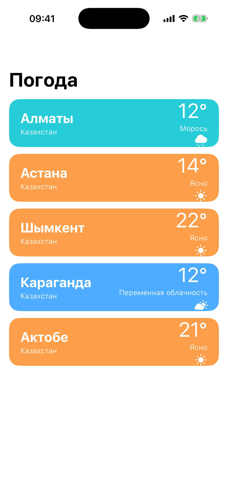

# Глава 15. Weather — open-meteo, pull-to-refresh, skeleton, offline

{width=45%}

Это «эталонный» mini-app книги — самый продакшен-готовый из всех. В
нём собрано всё то, что отличает учебный пример от настоящего
приложения:

- **Реальный API** без ключа — open-meteo.com.
- **Pull-to-refresh** через `UIRefreshControl`.
- **Skeleton-плейсхолдер** во время загрузки.
- **Offline-баннер** через `NWPathMonitor`.
- **Per-город кеш** с дедупликацией параллельных запросов.
- **Детальный экран** с почасовым и дневным прогнозом.

В этой главе разбираем все эти куски. Глава длинная, но идти можно
не подряд: сначала прочти 15.1–15.4 про модель/API, потом 15.5–15.9
про UI, потом 15.10 про offline.

## 15.1 Почему open-meteo

Когда искал бесплатный погодный API без ключа, нашёл **open-meteo.com**.
Что в нём хорошего:

- **Без регистрации**. Просто GET-запрос.
- **Без лимитов** на демо-нагрузке (до 10 000 запросов в день).
- **JSON в человеческом формате**, без идиотских вложений.
- **Все параметры опциональны** — запрашиваешь только то, что нужно.

Альтернативы:

- **OpenWeatherMap** — нужен ключ, но щедрый бесплатный план.
- **Weather API** — нужен ключ, есть бесплатный план.
- **WeatherKit** (Apple) — нативный, бесплатный с iOS 16. Но требует
  developer account и WeatherKit-подписки.

Для учебника open-meteo идеален. Никаких подписок, никаких ключей в
git, никаких квот.

## 15.2 Модели — DTO vs Domain

Сетевой слой возвращает JSON. Мы декодируем его в `OpenMeteoResponse`
— это **DTO** (data transfer object), он зеркалит JSON-структуру:

```swift
struct OpenMeteoResponse: Decodable {
    struct Current: Decodable {
        let time: String
        let temperature_2m: Double
        let apparent_temperature: Double
        let weather_code: Int
        let wind_speed_10m: Double
        let relative_humidity_2m: Double
    }
    struct Hourly: Decodable {
        let time: [String]
        let temperature_2m: [Double]
        let weather_code: [Int]
    }
    // ...

    let current: Current
    let hourly: Hourly?
    let daily: Daily?
}
```

Имена с подчёркиваниями — потому что API так возвращает (snake_case).
Не люблю `CodingKeys` ради переименования; проще оставить как есть в
DTO, а **наружу** отдавать domain-модели:

```swift
struct CityWeather: Sendable {
    let city: City
    let temperature: Double
    let apparentTemperature: Double  // ← наша camelCase
    let condition: WeatherCondition
    let windSpeed: Double
    let humidity: Double
    let updatedAt: Date
    let hourly: [HourForecast]
    let daily: [DayForecast]
}
```

DTO живёт внутри `WeatherAPI`, наружу не виден. UI работает только с
domain-моделями. Если завтра поменяется формат API — поправим DTO и
маппинг, UI не заметит.

Это **разделение слоёв**, классический паттерн. Без него API-структура
просочится в UI, и любая смена API становится переписыванием всего.

## 15.3 `WeatherCondition` — маппинг WMO кодов

Погодные коды от open-meteo — числовые, по стандарту WMO (World
Meteorological Organization). 0 = ясно, 1-3 = облачность разной
плотности, 45-48 = туман, 51-67 = разные виды дождя, 71-77 = снег,
80-86 = ливни, 95-99 = грозы.

Точных 30+ значений нам не нужно — для UI хватит 11 укрупнённых
категорий:

```swift
enum WeatherCondition: Sendable {
    case clear, mainlyClear, partlyCloudy, overcast, fog
    case drizzle, rain, heavyRain, snow, heavySnow, thunderstorm

    init(wmoCode: Int) {
        switch wmoCode {
        case 0: self = .clear
        case 1: self = .mainlyClear
        case 2: self = .partlyCloudy
        case 3: self = .overcast
        case 45, 48: self = .fog
        case 51, 53, 55, 56, 57: self = .drizzle
        case 61, 63, 80, 81: self = .rain
        case 65, 82: self = .heavyRain
        case 71, 73, 85: self = .snow
        case 75, 77, 86: self = .heavySnow
        case 95, 96, 99: self = .thunderstorm
        default: self = .overcast
        }
    }

    var label: String { /* «Ясно», «Дождь», ... */ }
    var systemImage: String { /* "sun.max.fill", "cloud.rain.fill", ... */ }
}
```

`init(wmoCode:)` — конструктор-маппер. Не угаданное значение становится
`.overcast` — безопасный fallback.

`label` и `systemImage` — для UI. Сразу за enum'ом, чтобы view получала
готовое: «нарисуй SF Symbol `cloud.rain.fill` с подписью `Дождь`».

> 💡 **Зачем domain-enum, а не Int.** Можно было бы хранить
> `weatherCode: Int` в `CityWeather` и в UI делать switch. Но тогда
> логика «какая иконка для кода 65» расползалась бы по нескольким
> местам (списочный экран, детальный, hourly). С enum'ом — одна
> точка маппинга, везде уже типизировано.

## 15.4 API client — async/await + error handling

```swift
enum WeatherAPI {
    enum Error: Swift.Error {
        case badStatus(Int)
        case decoding
        case transport(Swift.Error)
    }

    static func fetch(for city: City) async throws -> CityWeather {
        var components = URLComponents(string: "https://api.open-meteo.com/v1/forecast")!
        components.queryItems = [
            URLQueryItem(name: "latitude", value: "\(city.latitude)"),
            URLQueryItem(name: "longitude", value: "\(city.longitude)"),
            URLQueryItem(name: "timezone", value: city.timezone),
            URLQueryItem(name: "current", value: "temperature_2m,apparent_temperature,weather_code,wind_speed_10m,relative_humidity_2m"),
            URLQueryItem(name: "hourly", value: "temperature_2m,weather_code"),
            URLQueryItem(name: "daily", value: "temperature_2m_max,temperature_2m_min,weather_code,precipitation_probability_max"),
            URLQueryItem(name: "forecast_days", value: "7"),
        ]
        guard let url = components.url else { throw Error.decoding }

        let request = URLRequest(url: url, cachePolicy: .reloadIgnoringLocalCacheData, timeoutInterval: 20)
        let data: Data
        let response: URLResponse
        do {
            (data, response) = try await URLSession.shared.data(for: request)
        } catch {
            throw Error.transport(error)
        }
        guard let http = response as? HTTPURLResponse else { throw Error.decoding }
        guard 200..<300 ~= http.statusCode else { throw Error.badStatus(http.statusCode) }

        let dto: OpenMeteoResponse
        do {
            dto = try JSONDecoder().decode(OpenMeteoResponse.self, from: data)
        } catch {
            throw Error.decoding
        }

        return map(dto: dto, city: city)
    }
}
```

Шаги:

1. **URL** — собираем через `URLComponents` (нельзя руками склеивать
   строки! Параметры с пробелами и кириллицей нужно правильно
   escape'ить — `URLComponents` делает это автоматически).
2. **Request** — `cachePolicy: .reloadIgnoringLocalCacheData` отключает
   стандартный URL-cache iOS. Мы делаем **свой** кеш через
   `WeatherStore`, который более умный.
3. **Network** — `URLSession.shared.data(for:)` (нативный async).
   Если бросает — заворачиваем в `Error.transport`.
4. **Status check** — `200..<300 ~= statusCode`. Pattern matching
   через `~=` оператор работает с диапазонами.
5. **Decode** — `JSONDecoder().decode(...)`. Если падает —
   `Error.decoding`.
6. **Map** — DTO → Domain через приватную функцию.

`enum WeatherAPI` — namespace. Все методы static, инстанцировать
нечего.

> 💡 **Pattern matching `~=`** — компактная замена `(200..<300).contains(...)`.
> Работает с любым `Pattern`-совместимым типом.

## 15.5 WeatherStore — кеш и дедупликация

Сразу несколько проблем сети, которые мы решаем:

1. **Дубликаты запросов.** Если UI зовёт `fetch(for: almaty)` дважды
   подряд (например, list-VC и detail-VC одновременно), мы НЕ хотим
   делать два запроса.
2. **Свежесть данных.** Если данные пришли 30 секунд назад — повторно
   тянуть не надо, отдадим кешированное.
3. **Force-refresh.** При pull-to-refresh пользователь явно хочет
   свежие.

`WeatherStore`:

```swift
@MainActor
final class WeatherStore {
    static let shared = WeatherStore()
    private init() {}

    private var cache: [City: CityWeather] = [:]
    private var inflight: [City: Task<CityWeather, Error>] = [:]

    func cached(for city: City) -> CityWeather? { cache[city] }

    func fetch(for city: City, force: Bool = false) async throws -> CityWeather {
        if !force, let cached = cache[city], Date().timeIntervalSince(cached.updatedAt) < 60 {
            return cached
        }
        if let existing = inflight[city] { return try await existing.value }

        let task = Task<CityWeather, Error> {
            try await WeatherAPI.fetch(for: city)
        }
        inflight[city] = task
        defer { inflight.removeValue(forKey: city) }
        let weather = try await task.value
        cache[city] = weather
        return weather
    }
}
```

Логика:

1. Если **не force** и есть свежий кеш (≤ 60 сек) — отдаём его.
2. Если уже идёт запрос для этого города — **дожидаемся его** через
   `existing.value`. Не делаем второй параллельный.
3. Иначе — стартуем новый `Task`, сохраняем в `inflight`.
4. После завершения — `defer { inflight.removeValue(...) }` чистит запись,
   сохраняем результат в кеш.

`defer` гарантирует очистку даже при ошибке (`task.value` бросает).

> 💡 **Дедупликация — must have для сетевого слоя.** Без неё ты
> легко делаешь 5 запросов параллельно за один и тот же ресурс из
> разных мест экрана. С dedup — гарантия «один запрос за раз».

## 15.6 List screen — параллельные запросы

`WeatherListViewController` — таблица из городов. При загрузке —
дёргаем сразу **все** через `withTaskGroup`:

```swift
private func loadAll(force: Bool) {
    if weather.isEmpty { isLoading = true }
    tableView.reloadData()
    Task { [weak self] in
        guard let self else { return }
        await withTaskGroup(of: (City, Result<CityWeather, Error>).self) { group in
            for city in self.cities {
                group.addTask {
                    do {
                        let w = try await WeatherStore.shared.fetch(for: city, force: force)
                        return (city, .success(w))
                    } catch {
                        return (city, .failure(error))
                    }
                }
            }
            for await (city, result) in group {
                switch result {
                case .success(let w):
                    self.weather[city] = w
                    self.failedCities.remove(city)
                case .failure:
                    self.failedCities.insert(city)
                }
            }
        }
        self.isLoading = false
        self.refreshControl.endRefreshing()
        self.tableView.reloadData()
    }
}
```

`withTaskGroup` — параллельные `await`'ы. Все города стартуют
**одновременно**. Если делать sequential (`for city in cities { try
await fetch(for: city) }`) — 5 городов = 5 секунд. С group — все
5 секунд параллельно = ~1 секунда.

`Result<CityWeather, Error>` — не выбрасываем ошибку из таска, иначе
group отменит все остальные. Заворачиваем в Result, отдельно ловим
успехи и неудачи.

`failedCities: Set<City>` — список городов, для которых fetch упал.
Их ячейки покажем в «error» состоянии (иконка облака с !).

## 15.7 Ячейки — три состояния

Каждая строка имеет **три** возможных состояния:

1. **Loading** — данных ещё нет, показываем `WeatherSkeletonCell` с
   shimmer-анимацией.
2. **Loaded** — данные пришли, показываем `WeatherCityCell` с
   температурой, иконкой, цветом.
3. **Failed** — fetch не удался, та же `WeatherCityCell`, но в
   error-режиме (серая, без температуры).

В `cellForRowAt`:

```swift
func tableView(_ tableView: UITableView, cellForRowAt indexPath: IndexPath) -> UITableViewCell {
    let city = cities[indexPath.row]
    if let weather = weather[city] {
        let cell = tableView.dequeueReusableCell(withIdentifier: WeatherCityCell.reuseID, for: indexPath) as! WeatherCityCell
        cell.configure(city: city, weather: weather, failed: failedCities.contains(city))
        return cell
    }
    if failedCities.contains(city) {
        let cell = tableView.dequeueReusableCell(withIdentifier: WeatherCityCell.reuseID, for: indexPath) as! WeatherCityCell
        cell.configureFailed(city: city)
        return cell
    }
    let cell = tableView.dequeueReusableCell(withIdentifier: WeatherSkeletonCell.reuseID, for: indexPath) as! WeatherSkeletonCell
    cell.startAnimating()
    return cell
}
```

Регистрируем **две** ячейки разных классов, выбираем по состоянию.

## 15.8 Skeleton — shimmer-анимация

`SkeletonView` — `UIView` с серым фоном и градиентом, который двигается
слева направо:

```swift
final class SkeletonView: UIView {
    private let gradient = CAGradientLayer()

    override init(frame: CGRect) {
        super.init(frame: frame)
        layer.cornerRadius = 8
        clipsToBounds = true
        backgroundColor = UIColor.tertiaryLabel.withAlphaComponent(0.15)

        gradient.colors = [
            UIColor.tertiaryLabel.withAlphaComponent(0.0).cgColor,
            UIColor.tertiaryLabel.withAlphaComponent(0.45).cgColor,
            UIColor.tertiaryLabel.withAlphaComponent(0.0).cgColor,
        ]
        gradient.locations = [0.0, 0.5, 1.0]
        gradient.startPoint = CGPoint(x: 0, y: 0.5)
        gradient.endPoint = CGPoint(x: 1, y: 0.5)
        layer.addSublayer(gradient)
    }

    override func layoutSubviews() {
        super.layoutSubviews()
        gradient.frame = bounds
    }

    func startAnimating() {
        let animation = CABasicAnimation(keyPath: "transform.translation.x")
        animation.fromValue = -bounds.width
        animation.toValue = bounds.width
        animation.duration = 1.2
        animation.repeatCount = .infinity
        gradient.add(animation, forKey: "shimmer")
    }
}
```

Что делает:

- Сам view — серый прямоугольник (15% непрозрачности — едва видимый).
- Сверху — `CAGradientLayer`: прозрачный → серый-светлее → прозрачный.
  Это «отблеск», который движется.
- `CABasicAnimation(keyPath: "transform.translation.x")` —
  бесконечно сдвигает gradient слева направо.

Не путать с `UIView.animate(...)` — это **CoreAnimation**, работает с
`CALayer`. Преимущество — не требует repeat в Swift, GPU всё делает
сама.

`UIColor.tertiaryLabel.withAlphaComponent(0.15)` — авто-адаптивный для
dark/light mode. На светлой — светло-серый, на тёмной — тёмно-серый.

## 15.9 Pull-to-refresh

Стандартный `UIRefreshControl`:

```swift
private let refreshControl = UIRefreshControl()

private func setupTable() {
    tableView.refreshControl = refreshControl
    refreshControl.addTarget(self, action: #selector(pulledToRefresh), for: .valueChanged)
}

@objc private func pulledToRefresh() {
    loadAll(force: true)
}
```

`force: true` — обходим 60-секундный кеш в Store, гарантированно
дёргаем сеть. Это поведение, которого ждёт пользователь от
pull-to-refresh.

`refreshControl.endRefreshing()` — обязательно в конце. Без — индикатор
будет крутиться вечно.

## 15.10 Offline-баннер через NWPathMonitor

iOS даёт `Network.framework` для отслеживания состояния сети.
`NWPathMonitor` уведомляет, когда что-то изменилось:

```swift
@MainActor
final class ConnectivityMonitor {
    static let shared = ConnectivityMonitor()

    private let monitor = NWPathMonitor()
    private let queue = DispatchQueue(label: "ConnectivityMonitor")
    private var subscribers: [(Bool) -> Void] = []
    private(set) var isOnline: Bool = true

    private init() {
        monitor.pathUpdateHandler = { [weak self] path in
            let online = (path.status == .satisfied)
            DispatchQueue.main.async {
                guard let self else { return }
                guard online != self.isOnline else { return }
                self.isOnline = online
                self.subscribers.forEach { $0(online) }
            }
        }
        monitor.start(queue: queue)
    }

    func subscribe(_ handler: @escaping (Bool) -> Void) {
        subscribers.append(handler)
        handler(isOnline)
    }
}
```

`monitor.start(queue:)` — запуск с background queue. Callbacks могут
прилететь с любого потока, мы их перенаправляем на main через
`DispatchQueue.main.async`.

`path.status` — `.satisfied`, `.unsatisfied`, или `.requiresConnection`.
`.satisfied` = есть сеть.

`guard online != self.isOnline else { return }` — фильтруем «то же
самое». Иначе при каждом small-update от системы (например,
переключение между Wi-Fi и Cellular) подписчики получают callback,
хотя для них ничего не изменилось.

`subscribe` сразу даёт текущее значение — без этого подписчик ждал бы
**первого** изменения (которого могло и не быть, если сеть не
меняется). Это удобная привычка для observer'ов: подписался — сразу
получи текущее состояние.

Использование в `WeatherListViewController`:

```swift
ConnectivityMonitor.shared.subscribe { [weak self] online in
    self?.offlineBanner.isHidden = online
    if online { self?.loadAll(force: true) }
}
```

Когда сеть **появилась** обратно — автоматически делаем refresh.
Когда **пропала** — показываем баннер.

`OfflineBannerView` — красная плашка сверху с «Нет подключения —
показываем кеш».

## 15.11 Detail screen — параллакс и параметры

`WeatherDetailViewController` — экран с погодой для одного города.
ScrollView с пятью блоками:

1. **HeaderView** — большой блок с иконкой, температурой, описанием.
2. **HourlyStripView** — горизонтальный scroll с почасовкой на 24
   часа.
3. **MetricsView** — три карточки: ветер, влажность, ощущается.
4. **DailyView** — 7 дней прогноза, по дням.
5. **UpdatedLabel** — «обновлено 3 минуты назад» через
   `RelativeDateTimeFormatter`.

`RelativeDateTimeFormatter` (iOS 13+) — стандартный форматтер для
«N минут назад» / «через N часов»:

```swift
let formatter = RelativeDateTimeFormatter()
formatter.locale = Locale(identifier: "ru_RU")
formatter.unitsStyle = .full
updatedLabel.text = "Обновлено \(formatter.localizedString(for: weather.updatedAt, relativeTo: Date()))"
```

`unitsStyle: .full` — «5 минут назад». `.abbreviated` — «5 мин. назад».
`.short` — «5 мин назад».

Для русского форматтер сам справляется с плюралами («1 минута», «2
минуты», «5 минут»). В отличие от age gate (Глава 10), где для «лет»
своя функция, здесь Apple постарался.

## 15.12 Hourly — horizontal scroll внутри vertical

ScrollView внутри ScrollView — звучит страшно, на деле работает:

```swift
final class HourlyStripView: UIView {
    private let scrollView = UIScrollView()
    private let stack = UIStackView()

    override init(frame: CGRect) {
        super.init(frame: frame)
        backgroundColor = .secondarySystemBackground
        layer.cornerRadius = 16

        scrollView.translatesAutoresizingMaskIntoConstraints = false
        scrollView.showsHorizontalScrollIndicator = false
        addSubview(scrollView)

        stack.axis = .horizontal
        stack.spacing = 16
        stack.translatesAutoresizingMaskIntoConstraints = false
        scrollView.addSubview(stack)

        NSLayoutConstraint.activate([
            scrollView.heightAnchor.constraint(equalToConstant: 90),
            stack.heightAnchor.constraint(equalTo: scrollView.heightAnchor),
            // stack pinned to scrollView with insets
        ])
    }
}
```

`UIScrollView` с `axis = horizontal` (через высоту stack'а ≤ высоты
scrollView, ширина — больше). `showsHorizontalScrollIndicator = false`
— скрываем нижний индикатор, как в Apple Weather.

Каждая ячейка часа — `HourCell` (UIView, не UICollectionViewCell). Их
немного (24), переиспользование не нужно.

## 15.13 Бытовая аналогия

`WeatherListViewController` — это **диспетчер**, который раздаёт
поручения курьерам: «один едет в Алматы, второй в Астану, третий в
Шымкент, все одновременно». Каждый курьер возвращается с пакетом
данных, диспетчер собирает результаты.

`WeatherStore` — **архивариус** диспетчера. Запоминает, что курьер
из Алматы возвращался минуту назад с данными — больше не отправляет,
отдаёт из памяти. Если кто-то ещё спросит про Алматы — отдаст ту же
сводку.

`NWPathMonitor` — **наблюдатель** за состоянием почтовой системы.
Если связь упала — диспетчер знает и не отправляет курьеров, чтобы не
блокировать.

## 15.14 Что мы пропустили

- **Геолокация юзера**. Сейчас города зашиты в код. На реальном
  приложении — `CLLocationManager` определяет город, добавляется в
  список «текущая локация».
- **Поиск города**. Если хочешь Берлин — открыть picker, ввести
  название, добавить. Open-meteo даёт `/geocoding` endpoint для
  поиска.
- **Push при погодных предупреждениях** — «завтра шторм». Нужен
  back-end или WeatherKit с alerts.
- **Виджеты WeatherKit** на главном экране.

> 🛠 **Упражнение.** Открой Weather, увидишь сначала skeleton-shimmer,
> потом цветные карточки городов. Потяни вниз — refresh, увидишь
> анимацию обновления. Выруби Wi-Fi на маке (или используй
> `Hardware → Network → Internet Off` в симуляторе), снова потяни —
> увидишь красный баннер «Нет подключения». Включи обратно — баннер
> пропадёт, данные обновятся автоматически.

## 📋 Что мы выучили

- Разделение **DTO** (отражение JSON) и **Domain** (то, чем пользуется
  UI). Маппинг — приватная функция в API client.
- WMO-коды → enum `WeatherCondition` с `label` и `systemImage`.
  Маппинг в одном месте, UI получает готовое.
- `URLComponents` для построения URL с параметрами — никогда не
  склеивать руками.
- `URLRequest(cachePolicy: .reloadIgnoringLocalCacheData)` — отключение
  стандартного URL-cache iOS, чтобы делать свой.
- **Дедупликация** запросов через `inflight: [Key: Task<...>]` +
  `defer cleanup`.
- `withTaskGroup` для **параллельных** запросов. Внутри —
  `Result<Success, Failure>` чтобы не отменять group при первой
  ошибке.
- Skeleton — `CAGradientLayer` + `CABasicAnimation` на
  `transform.translation.x`. GPU делает всё, не нагружает CPU.
- `UIRefreshControl.endRefreshing()` — обязательно в конце.
- `NWPathMonitor` для трекинга сети. Callback с background queue —
  переводим на main.
- `RelativeDateTimeFormatter` — «N минут назад» с поддержкой плюралов
  для русского.

## Apple Developer Documentation

- [URLSession](https://developer.apple.com/documentation/foundation/urlsession) — стандартный сетевой клиент, через `URLSession.shared` тянем погоду.
- [URLSession.data(for:)](https://developer.apple.com/documentation/foundation/urlsession/3767353-data) — нативная async-обёртка над сетевым запросом, возвращает `(Data, URLResponse)`.
- [URLRequest](https://developer.apple.com/documentation/foundation/urlrequest) — параметризованный запрос с `cachePolicy` и `timeoutInterval`.
- [URLCache](https://developer.apple.com/documentation/foundation/urlcache) — системный кеш URL-запросов; мы его отключаем, потому что строим свой.
- [UIRefreshControl](https://developer.apple.com/documentation/uikit/uirefreshcontrol) — стандартный pull-to-refresh, привязывается к `tableView.refreshControl`.
- [RelativeDateTimeFormatter](https://developer.apple.com/documentation/foundation/relativedatetimeformatter) — «N минут назад» / «через N часов» с локализованными плюралами.
- [JSONDecoder](https://developer.apple.com/documentation/foundation/jsondecoder) — декодер JSON, превращает ответ open-meteo в DTO.
- [Concurrency](https://docs.swift.org/swift-book/documentation/the-swift-programming-language/concurrency) — Swift Book про async/await, `Task`, `TaskGroup`, акторы.

→ [Глава 16. Gallery — UICollectionView compositional, пагинация, photo viewer](./24-gallery.md)
