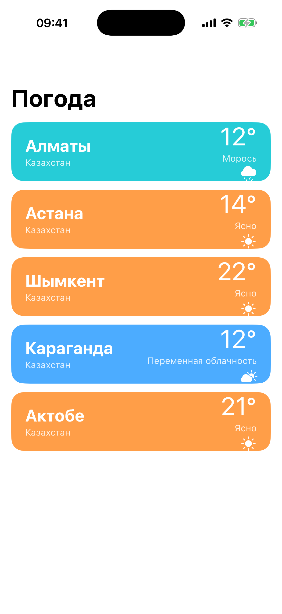

# Глава 15. Weather — open-meteo, pull-to-refresh, skeleton, offline

{width=45%}

Это самое «взрослое» мини-приложение книги. В нём собрано то, что
отличает учебный пример от приложения, которым пользуются каждый
день:

- **настоящий API** без ключа — open-meteo.com;
- **pull-to-refresh** («потяни, чтобы обновить») через `UIRefreshControl`;
- **skeleton** — серые «заготовки» строк с бегущим бликом, пока
  данные грузятся (по-английски *skeleton* — «скелет», а бегущий
  блик — *shimmer*, «мерцание»);
- **офлайн-баннер** через `NWPathMonitor` и кеш на диске: без сети
  приложение показывает последние сохранённые данные;
- **кеш с дедупликацией**: два экрана, одновременно попросившие погоду
  одного города, получат результат одного запроса;
- **детальный экран** с прогнозом по часам и по дням.

Глава длинная, но идти можно не подряд: 15.1–15.5 — данные и сеть,
15.6–15.9 — список, 15.10 — работа без сети, 15.11–15.12 — детальный
экран.

Что строим:

```
┌──────────────────────────────┐   ┌──────────────────────────────┐
│ Нет подключения — показываем │   │ ‹ Погода        Алматы       │
│      сохранённые данные      │   │            *                 │
│ Погода                       │   │           23°                │
│ ┌──────────────────────────┐ │   │          Ясно                │
│ │ *  Алматы            23° │ │   │ ┌──────────────────────────┐ │
│ │    Ясно  ↓12° ↑23°     › │ │   │ │Сейчас 15  16  17  18 … → │ │ ← почасовой,
│ │ ~  Астана            14° │ │──▶│ └──────────────────────────┘ │   прокрутка вбок
│ │ ░░░░░░░         ░░░░░    │ │   │ [Ветер] [Влажность] [Ощущ.]  │
│ │ ░░░░                     │ │   │ Сегодня    *     12° … 23°   │
│ └──────────────────────────┘ │   │ Понедельник ~    12° … 21°   │
│   ↑ skeleton, пока грузится  │   │   Обновлено 3 минуты назад   │
└──────────────────────────────┘   └──────────────────────────────┘
```

Проект — как в главе 12 (раздел «Перед началом»): App, Swift 6,
Default Actor Isolation = MainActor, Approachable Concurrency, iOS 15+,
без `Main.storyboard`. Первый экран — список в навигационном
контроллере:

<!-- file: Weather/SceneDelegate.swift -->
```swift
import UIKit

final class SceneDelegate: UIResponder, UIWindowSceneDelegate {
    var window: UIWindow?

    func scene(_ scene: UIScene,
               willConnectTo session: UISceneSession,
               options connectionOptions: UIScene.ConnectionOptions) {
        guard let windowScene = scene as? UIWindowScene else { return }
        let window = UIWindow(windowScene: windowScene)
        window.rootViewController = UINavigationController(
            rootViewController: WeatherListViewController()
        )
        window.makeKeyAndVisible()
        self.window = window
    }
}
```

## 15.1 Почему open-meteo

Для учебника нужен погодный API, с которым можно начать за минуту.
**open-meteo.com** подходит:

- **Без ключа и регистрации.** Обычный GET-запрос.
- **Бесплатно для некоммерческого использования** — с лимитами:
  меньше 10 000 запросов в сутки, 5 000 в час и 600 в минуту (так
  написано в условиях использования на open-meteo.com/en/terms).
  Учебный проект, личное приложение, образовательный контент —
  подходят. Приложение с подпиской или рекламой — уже коммерческое
  использование, для него нужен платный тариф.
- **Данные под лицензией CC BY 4.0** — это значит, что в приложении
  надо указать источник («Weather data by Open-Meteo.com»). В
  упражнении 15.3 мы добавим такую подпись.
- **Простой JSON** и параметры «запроси только то, что нужно».

Проверь сам в терминале, до всякого Swift:

```
curl "https://api.open-meteo.com/v1/forecast?latitude=43.2567&longitude=76.9286&timezone=auto&timeformat=unixtime&current=temperature_2m,weather_code"
```

Ответ (сокращён):

```
{"latitude":43.26889,"longitude":76.95067,"utc_offset_seconds":18000,
 "timezone":"Asia/Almaty","timezone_abbreviation":"GMT+5",
 "current_units":{"time":"unixtime","temperature_2m":"°C","weather_code":"wmo code"},
 "current":{"time":1790501400,"interval":900,"temperature_2m":23.3,"weather_code":0}}
```

Ключа нет — запрос прошёл. Координаты в ответе чуть отличаются от
запрошенных: модель считает погоду по сетке, и API вернул ближайшую
к Алматы точку сетки.

Альтернативы:

- **OpenWeatherMap**, **WeatherAPI.com** — нужен ключ, есть
  бесплатные тарифы с лимитами.
- **WeatherKit** от Apple — фреймворк для iOS 16+ (нам нужна iOS 15,
  поэтому мимо) и REST API. Нужна платная подписка Apple Developer
  Program; в неё входит 500 000 запросов в месяц, больше — за
  отдельную плату. Тоже требует показывать атрибуцию источника.

Для учебника open-meteo удобнее всего: никаких ключей в git, никаких
аккаунтов.

## 15.2 Модели — DTO и доменные модели

Начнём с города. Список городов зашит в код:

<!-- file: Weather/City.swift -->
```swift
import Foundation

nonisolated struct City: Hashable, Codable, Sendable {
    let name: String
    let latitude: Double
    let longitude: Double

    static let all: [City] = [
        City(name: "Алматы", latitude: 43.2567, longitude: 76.9286),
        City(name: "Астана", latitude: 51.1694, longitude: 71.4491),
        City(name: "Шымкент", latitude: 42.3417, longitude: 69.5901),
        City(name: "Караганда", latitude: 49.8047, longitude: 73.1094),
        City(name: "Актобе", latitude: 50.2839, longitude: 57.1670),
    ]
}
```

Координаты — широта и долгота центра города в градусах. `Hashable`
нужен, чтобы город был ключом словаря («погода по городу»), `Codable`
— чтобы сохранить погоду на диск вместе с городом.

**Зачем `nonisolated`.** В проекте с Default Actor Isolation =
MainActor всё без пометок привязано к главному потоку — и эта
структура тоже, вместе с её реализацией `Codable` и `Hashable`.
Для модели данных это лишнее ограничение: декодировать JSON или
сравнивать города можно из любого потока. С `nonisolated` модель
свободна. Это ловушка, на которую часто натыкаются: пока ты
декодируешь на главном потоке, всё собирается, а стоит перенести
разбор ответа в фоновую задачу или в `actor` — компилятор скажет, что
реализация `Decodable` «принадлежит главному актору» и вызвать её
отсюда нельзя. Все модели этой главы помечены `nonisolated` сразу.

Сеть возвращает JSON. Мы декодируем его в `OpenMeteoResponse` — это
**DTO** (*data transfer object*, «объект для передачи данных»): он
повторяет структуру JSON один в один.

<!-- file: Weather/OpenMeteoResponse.swift -->
```swift
import Foundation

nonisolated struct OpenMeteoResponse: Decodable, Sendable {
    struct Current: Decodable, Sendable {
        let time: TimeInterval
        let temperature_2m: Double
        let apparent_temperature: Double
        let weather_code: Int
        let wind_speed_10m: Double
        let relative_humidity_2m: Double
        let is_day: Int
    }

    struct Hourly: Decodable, Sendable {
        let time: [TimeInterval]
        let temperature_2m: [Double]
        let weather_code: [Int]
        let is_day: [Int]
    }

    struct Daily: Decodable, Sendable {
        let time: [TimeInterval]
        let temperature_2m_max: [Double]
        let temperature_2m_min: [Double]
        let weather_code: [Int]
        let precipitation_probability_max: [Int?]
    }

    let timezone: String
    let current: Current
    let hourly: Hourly
    let daily: Daily
}
```

Имена с подчёркиваниями (`temperature_2m`) — такие же, как в JSON.
Можно было переименовать их через `CodingKeys` или
`keyDecodingStrategy = .convertFromSnakeCase`, но DTO всё равно
никто, кроме маппинга, не видит — пусть остаётся зеркалом ответа,
так его проще сверять с документацией API.

Несколько деталей, которые важно заметить:

- **`time: TimeInterval`** — мы просим время в виде Unix-времени
  (`timeformat=unixtime`): число секунд, прошедших с 1 января 1970
  года, 00:00 по UTC. Это число однозначно, в каком бы часовом поясе
  ни был телефон. Строки вида `"2026-09-27T14:30"` без пояса пришлось
  бы ещё правильно разобрать.
- **`relative_humidity_2m: Double`** — в JSON влажность приходит целым
  числом (`26`), но `JSONDecoder` спокойно читает целое в `Double`.
- **`precipitation_probability_max: [Int?]`** — вероятность осадков
  может прийти как `null` для дней, на которые модель её не считает.
  Если объявить `[Int]`, один `null` уронит декодирование **всего**
  ответа. Для полей, в которых API обещает возможный `null`, лучше
  сразу опционал.
- **`timezone`** — имя часового пояса города (`"Asia/Almaty"`),
  которое API определил по координатам, потому что мы передали
  `timezone=auto`.

**Часовой пояс и UTC на числах.** В ответе `"current":{"time":1790501400}`.
Это 27 сентября 2026, 09:30 по UTC (всемирное координированное
время, «нулевой» пояс). В Алматы `utc_offset_seconds = 18000`:
18 000 секунд = 5 часов, значит, местное время — 14:30. С марта 2024
года весь Казахстан живёт в одном поясе UTC+5, поэтому и Алматы, и
Актобе вернут смещение 5 часов, хотя имена поясов разные
(`Asia/Almaty`, `Asia/Aqtobe`). `Date` в Swift хранит момент без
пояса; пояс нужен только при **показе** — «который час в этом городе».

А вот модели, которыми пользуется интерфейс:

<!-- file: Weather/CityWeather.swift -->
```swift
import Foundation

nonisolated struct HourForecast: Codable, Sendable {
    let time: Date
    let temperature: Double
    let condition: WeatherCondition
    let isDay: Bool
}

nonisolated struct DayForecast: Codable, Sendable {
    let date: Date
    let minTemperature: Double
    let maxTemperature: Double
    let condition: WeatherCondition
    let precipitationChance: Int?
}

nonisolated struct CityWeather: Codable, Sendable {
    let city: City
    let timeZoneID: String
    let temperature: Double
    let apparentTemperature: Double
    let condition: WeatherCondition
    let isDay: Bool
    let windSpeed: Double      // метры в секунду
    let humidity: Double       // проценты
    let updatedAt: Date
    let hourly: [HourForecast]
    let daily: [DayForecast]

    var timeZone: TimeZone {
        TimeZone(identifier: timeZoneID) ?? .current
    }
}

nonisolated enum TemperatureFormat {
    /// 23.4 → «23°», −0.4 → «0°» (а не «-0°»).
    static func string(_ celsius: Double) -> String {
        "\(Int(celsius.rounded()))°"
    }
}
```

**`CityWeather`** — всё, что нужно экранам про один город: текущая
погода, 24 часа, 7 дней. Имена — в привычном Swift стиле
(`apparentTemperature`), единицы — те, что покажем пользователю:
ветер в метрах в секунду, а не в километрах в час, как у API.

DTO живёт только внутри сетевого слоя. Экраны работают с
`CityWeather`. Если завтра API поменяет формат, мы поправим DTO и
маппинг, а экраны ничего не заметят. Без такого разделения
структура чужого JSON просачивается в интерфейс, и любая смена API
превращается в переписывание всего приложения.

`timeZoneID` храним строкой, а `TimeZone` вычисляем: сам `TimeZone`
не `Codable`-совместим «из коробки» так, как хочется, а строку можно
сохранить на диск. `?? .current` — запасной вариант (*fallback*), если
имя пояса вдруг окажется незнакомым.

**`TemperatureFormat.string`** — одно место, где число превращается в
«23°». `rounded()` округляет по школьному правилу: 23,4 → 23,
23,5 → 24, −2,5 → −3 (половинки — от нуля). Ловушка, которую обходит
`Int(...)`: если форматировать `Double` напрямую, −0,4 округлится в
«−0» — такое бывает, и выглядит глупо. `Int` не знает «минус нуля»,
и получается честный «0°».

## 15.3 `WeatherCondition` — коды погоды WMO

Погода приходит числом — кодом по стандарту WMO (Всемирной
метеорологической организации). Таблица кодов есть в документации
open-meteo: 0 — ясно, 1–3 — облачность разной плотности, 45 и 48 —
туман, 51–57 — морось, 61–67 — дождь, 71–77 — снег, 80–82 — ливни,
85–86 — снегопады, 95–99 — грозы.

Для интерфейса 28 кодов не нужны — хватит 11 укрупнённых вариантов:

<!-- file: Weather/WeatherCondition.swift -->
```swift
import Foundation

nonisolated enum WeatherCondition: String, Codable, Sendable {
    case clear, mainlyClear, partlyCloudy, overcast, fog
    case drizzle, rain, heavyRain, snow, heavySnow, thunderstorm

    init(wmoCode: Int) {
        switch wmoCode {
        case 0:                  self = .clear
        case 1:                  self = .mainlyClear
        case 2:                  self = .partlyCloudy
        case 3:                  self = .overcast
        case 45, 48:             self = .fog
        case 51, 53, 55, 56, 57: self = .drizzle
        case 61, 63, 66, 80, 81: self = .rain
        case 65, 67, 82:         self = .heavyRain
        case 71, 73, 77, 85:     self = .snow
        case 75, 86:             self = .heavySnow
        case 95, 96, 97, 99:     self = .thunderstorm
        default:                 self = .overcast
        }
    }

    var label: String {
        switch self {
        case .clear:        return "Ясно"
        case .mainlyClear:  return "Малооблачно"
        case .partlyCloudy: return "Переменная облачность"
        case .overcast:     return "Пасмурно"
        case .fog:          return "Туман"
        case .drizzle:      return "Морось"
        case .rain:         return "Дождь"
        case .heavyRain:    return "Ливень"
        case .snow:         return "Снег"
        case .heavySnow:    return "Сильный снег"
        case .thunderstorm: return "Гроза"
        }
    }

    func systemImage(isDay: Bool) -> String {
        switch self {
        case .clear:        return isDay ? "sun.max.fill" : "moon.stars.fill"
        case .mainlyClear:  return isDay ? "sun.min.fill" : "moon.fill"
        case .partlyCloudy: return isDay ? "cloud.sun.fill" : "cloud.moon.fill"
        case .overcast:     return "cloud.fill"
        case .fog:          return "cloud.fog.fill"
        case .drizzle:      return "cloud.drizzle.fill"
        case .rain:         return "cloud.rain.fill"
        case .heavyRain:    return "cloud.heavyrain.fill"
        case .snow:         return "cloud.snow.fill"
        case .heavySnow:    return "snowflake"
        case .thunderstorm: return "cloud.bolt.rain.fill"
        }
    }
}
```

`init(wmoCode:)` — инициализатор-переводчик. Все коды из
документации разложены по вариантам, а неизвестный (если API добавит
новый) станет `.overcast` — безопасный вариант по умолчанию, который
не соврёт сильно. `String` в качестве `rawValue` — чтобы
перечисление сохранялось на диск читаемым словом.

Два кода, которые легко разложить неправильно: 66–67 — «ледяной
дождь», его честнее показывать дождём, а не пропускать в `default`;
77 — «снежные зёрна», мелкая крупа, это обычный снег, а не сильный.

**`systemImage(isDay:)`** — имя SF Symbol с учётом времени суток:
ясной ночью солнце на иконке выглядит странно, поэтому для ночи —
луна. Признак «день или ночь» тоже приходит из API (`is_day`: 1 или 0)
— он учитывает настоящий восход и закат в этом городе.

> **Зачем перечисление, а не `Int`.** Можно было хранить `weatherCode`
> в модели и в интерфейсе писать `switch` по числам. Но тогда логика
> «какая иконка у кода 65» размножилась бы по списку, детальному
> экрану и почасовой полосе. С перечислением перевод в одном месте, и
> компилятор проверяет, что каждый вариант обработан.

## 15.4 Сетевой клиент — async/await и ошибки

<!-- file: Weather/WeatherAPI.swift -->
```swift
import Foundation

enum WeatherAPI {
    enum Error: Swift.Error {
        case badStatus(Int)
        case decoding
        case transport(Swift.Error)
    }

    static func fetch(for city: City) async throws -> CityWeather {
        var components = URLComponents(string: "https://api.open-meteo.com/v1/forecast")
        components?.queryItems = [
            URLQueryItem(name: "latitude", value: String(city.latitude)),
            URLQueryItem(name: "longitude", value: String(city.longitude)),
            URLQueryItem(name: "timezone", value: "auto"),
            URLQueryItem(name: "timeformat", value: "unixtime"),
            URLQueryItem(name: "current", value: "temperature_2m,apparent_temperature,weather_code,wind_speed_10m,relative_humidity_2m,is_day"),
            URLQueryItem(name: "hourly", value: "temperature_2m,weather_code,is_day"),
            URLQueryItem(name: "daily", value: "temperature_2m_max,temperature_2m_min,weather_code,precipitation_probability_max"),
            URLQueryItem(name: "forecast_days", value: "7"),
        ]
        guard let url = components?.url else { throw Error.decoding }

        let request = URLRequest(url: url, cachePolicy: .reloadIgnoringLocalCacheData, timeoutInterval: 20)
        let data: Data
        let response: URLResponse
        do {
            (data, response) = try await URLSession.shared.data(for: request)
        } catch {
            throw Error.transport(error)
        }
        guard let http = response as? HTTPURLResponse else { throw Error.decoding }
        guard 200..<300 ~= http.statusCode else { throw Error.badStatus(http.statusCode) }

        let dto: OpenMeteoResponse
        do {
            dto = try JSONDecoder().decode(OpenMeteoResponse.self, from: data)
        } catch {
            throw Error.decoding
        }
        return map(dto: dto, city: city, now: Date())
    }

    static func map(dto: OpenMeteoResponse, city: City, now: Date) -> CityWeather {
        let current = dto.current

        // Почасовой прогноз: 24 часа, начиная с текущего.
        let hourStart = current.time - current.time.truncatingRemainder(dividingBy: 3600)
        let firstHour = dto.hourly.time.firstIndex { $0 >= hourStart } ?? 0
        let lastHour = min(firstHour + 24, dto.hourly.time.count)
        let hourly = (firstHour..<lastHour).map { i in
            HourForecast(
                time: Date(timeIntervalSince1970: dto.hourly.time[i]),
                temperature: dto.hourly.temperature_2m[i],
                condition: WeatherCondition(wmoCode: dto.hourly.weather_code[i]),
                isDay: dto.hourly.is_day[i] == 1
            )
        }

        let daily = dto.daily.time.indices.map { i in
            DayForecast(
                date: Date(timeIntervalSince1970: dto.daily.time[i]),
                minTemperature: dto.daily.temperature_2m_min[i],
                maxTemperature: dto.daily.temperature_2m_max[i],
                condition: WeatherCondition(wmoCode: dto.daily.weather_code[i]),
                precipitationChance: dto.daily.precipitation_probability_max[i]
            )
        }

        return CityWeather(
            city: city,
            timeZoneID: dto.timezone,
            temperature: current.temperature_2m,
            apparentTemperature: current.apparent_temperature,
            condition: WeatherCondition(wmoCode: current.weather_code),
            isDay: current.is_day == 1,
            windSpeed: current.wind_speed_10m / 3.6,
            humidity: current.relative_humidity_2m,
            updatedAt: now,
            hourly: hourly,
            daily: daily
        )
    }
}
```

Шаги `fetch`:

1. **Адрес** собираем через `URLComponents`: он сам экранирует
   параметры. Запятые в `current=temperature_2m,weather_code`
   останутся запятыми — так API и ждёт.
2. **Параметры.** `timezone=auto` — пусть API сам определит пояс по
   координатам. `timeformat=unixtime` — время числами (15.2).
   `current`, `hourly`, `daily` — какие величины нужны в каждой
   части ответа. `forecast_days=7` — неделя. Весь ответ — около
   4,5 КБ (а сжатым при передаче — около 1,3 КБ), это мало.
3. **Запрос** — `cachePolicy: .reloadIgnoringLocalCacheData`
   отключает стандартный HTTP-кеш `URLSession`: мы держим **свой** кеш
   в `WeatherStore` и хотим сами решать, когда идти в сеть.
   `timeoutInterval: 20` — не ждать ответа больше 20 секунд.
4. **Сеть** — `URLSession.shared.data(for:)` (iOS 15+). Ошибку сети
   (нет интернета, таймаут) заворачиваем в `Error.transport`, чтобы
   снаружи было видно, что именно сломалось.
5. **Код ответа** — `200..<300 ~= http.statusCode`. Оператор `~=` —
   это «сопоставление с образцом»: «попадает ли код в диапазон». Та же
   проверка, что `(200..<300).contains(code)`, просто короче. Если
   передать невозможные координаты, open-meteo ответит кодом 400 и
   JSON `{"error":true,"reason":"Latitude must be in range of -90 to
   90°…"}` — мы превратим это в `Error.badStatus(400)`.
6. **Декодирование** DTO. Ошибка — `Error.decoding`.
7. **Маппинг** DTO → `CityWeather`.

`enum WeatherAPI` без вариантов — «пространство имён»: все методы
`static`, создавать экземпляр незачем.

**Где это выполняется.** `WeatherAPI` в нашем режиме изолирован на
главном потоке. Это не значит, что главный поток ждёт сеть: на
`await` функция приостанавливается и отпускает поток, интерфейс
продолжает жить. Декодирование 4,5 КБ JSON — доля миллисекунды, его
можно делать и на главном. Если бы ответы были мегабайтными,
разбор стоило бы увести с главного потока — и тут бы пригодилось, что
модели уже `nonisolated`.

**Маппинг, `map(dto:city:now:)`**, — отдельная функция, а не часть
`fetch`: её можно проверить без сети, подсунув сохранённый JSON (так
этот код и проверялся: ответ API, записанный `curl`'ом, раскладывается
в 24 часа и 7 дней). `now` передаётся параметром по той же причине —
в проверке можно подставить любое «сейчас».

**Какие 24 часа показывать.** Почасовой прогноз приходит на всю
неделю — 7 × 24 = 168 значений, начиная с полуночи сегодняшнего дня.
Нам нужны 24, начиная с текущего часа. Разберём на числах:

- текущее время `current.time = 1790501400` (14:30 по Алматы);
- `truncatingRemainder(dividingBy: 3600)` — остаток от деления на
  3600 секунд (час): 1790501400 делится на 3600 с остатком 1800, то
  есть 30 минут после начала часа;
- вычитаем остаток: 1790501400 − 1800 = 1790499600 — это 14:00;
- `firstIndex { $0 >= hourStart }` — первый час прогноза не раньше
  14:00, то есть 14:00;
- берём 24 значения с этого места: с 14:00 сегодня до 13:00 завтра.
  `min(firstHour + 24, count)` защищает от выхода за конец массива.

**Ветер.** API отдаёт скорость в километрах в час. В Казахстане
привычнее метры в секунду. Перевод: в часе 3600 секунд, в километре
1000 метров, значит, 1 км/ч = 1000 / 3600 = 1/3,6 м/с. Делим на 3,6:
18 км/ч = 5 м/с, 3,4 км/ч ≈ 0,9 м/с. (Можно было попросить API сразу
вернуть м/с параметром `wind_speed_unit=ms`, но полезно один раз
увидеть перевод своими глазами.)

> **Упражнение 15.1.** Добавь в список город Актау (широта 43.65,
> долгота 51.17). Не запуская приложение, ответь: какое имя часового
> пояса вернёт API и какое смещение от UTC? Проверь `curl`'ом.

## 15.5 WeatherStore — кеш и дедупликация

Прямые вызовы `WeatherAPI.fetch` из экранов создают три проблемы:

1. **Двойные запросы.** Если список и детальный экран одновременно
   попросят погоду Алматы, уйдут два одинаковых запроса.
2. **Лишние запросы.** Данные пришли минуту назад — идти за ними
   снова незачем: open-meteo обновляет текущую погоду раз в 15 минут
   (поле `interval: 900` в ответе — 900 секунд).
3. **Жизнь без сети.** Закрыл приложение, открыл в метро — хочется
   увидеть хоть последние данные, а не пустой экран.

`WeatherStore` решает все три:

<!-- file: Weather/WeatherStore.swift -->
```swift
import Foundation

@MainActor
final class WeatherStore {
    static let shared = WeatherStore()

    /// Сколько секунд данные считаются свежими: 10 минут.
    static let freshness: TimeInterval = 10 * 60

    private var cache: [City: CityWeather] = [:]
    private var inflight: [City: Task<CityWeather, Error>] = [:]
    private let fileURL: URL

    init(fileURL: URL? = nil) {
        let caches = FileManager.default.urls(for: .cachesDirectory, in: .userDomainMask)[0]
        self.fileURL = fileURL ?? caches.appendingPathComponent("weather-cache.json")
        loadFromDisk()
    }

    func cached(for city: City) -> CityWeather? {
        cache[city]
    }

    func fetch(for city: City, force: Bool = false) async throws -> CityWeather {
        if !force, let cached = cache[city],
           Date().timeIntervalSince(cached.updatedAt) < Self.freshness {
            return cached
        }
        if let existing = inflight[city] {
            return try await existing.value
        }

        let task = Task {
            try await WeatherAPI.fetch(for: city)
        }
        inflight[city] = task
        defer { inflight[city] = nil }

        let weather = try await task.value
        cache[city] = weather
        saveToDisk()
        return weather
    }

    private func saveToDisk() {
        do {
            let data = try JSONEncoder().encode(Array(cache.values))
            try data.write(to: fileURL, options: .atomic)
        } catch {
            assertionFailure("WeatherStore: не удалось сохранить кеш: \(error)")
        }
    }

    private func loadFromDisk() {
        guard let data = try? Data(contentsOf: fileURL),
              let saved = try? JSONDecoder().decode([CityWeather].self, from: data)
        else { return }
        for weather in saved {
            cache[weather.city] = weather
        }
    }
}
```

Логика `fetch` по шагам:

1. Если это **не** принудительное обновление (`force == false`) и в
   кеше есть данные моложе 10 минут — отдаём их без сети.
2. Если запрос этого города **уже идёт** — не начинаем второй, а
   ждём результата первого: `try await existing.value`. Сколько бы
   мест ни попросили Алматы одновременно, в сеть уйдёт один запрос.
3. Иначе создаём `Task` с запросом и запоминаем его в `inflight`
   («в полёте»).
4. Ждём результат, кладём в кеш, сохраняем кеш на диск.

**`Task` и `task.value`.** `Task { … }` запускает асинхронную работу
и возвращает «ручку» к ней. `value` — «дождаться результата» (или
ошибки). Два вызова `fetch` могут ждать `value` одной и той же задачи —
оба получат один результат.

**`defer { inflight[city] = nil }`** — код в `defer` выполнится при
выходе из функции **любым** путём: и после успеха, и если
`task.value` бросит ошибку. Без `defer` упавший запрос навсегда
остался бы в `inflight`, и все дальнейшие вызовы ждали бы его
результат — то есть получали бы ту же старую ошибку.

**Почему 10 минут.** Считаем нагрузку: 5 городов, в худшем случае
обновление каждые 10 минут — 6 раз в час × 5 = 30 запросов в час на
одного пользователя. Лимит бесплатного open-meteo — 5 000 в час с
одного адреса. Потянуть «обновить» пользователь может когда угодно —
это `force`, мимо кеша.

**Гонки здесь нет**, хотя проверка «есть ли уже задача» и запись в
`inflight` разнесены. `WeatherStore` — `@MainActor`: весь его код
выполняется на главном потоке по очереди, а между `if let existing`
и `inflight[city] = task` нет `await`, значит, никто не вклинится.
Приостановка возможна только на `await`.

**Кеш на диске.** После каждого удачного запроса весь кеш (массив
`CityWeather`) пишется JSON-файлом в **Caches** — папку песочницы для
данных, которые можно получить заново. В отличие от Documents, она
не попадает в резервную копию, и система может очистить её, когда на
телефоне кончается место. Для кеша погоды это ровно то, что нужно:
пропал — скачаем. При создании хранилище читает файл, и первый экран
может показать погоду ещё до ответа сети.

> **Дедупликация — обязательная часть сетевого слоя.** Без неё
> легко отправить пять одинаковых запросов из разных мест экрана. С
> ней — один запрос на ресурс, сколько бы желающих ни было.

## 15.6 Экран списка — параллельные запросы

`WeatherListViewController` — таблица городов:

<!-- file: Weather/WeatherListViewController.swift -->
```swift
import UIKit

final class WeatherListViewController: UIViewController {

    let cities = City.all
    var weather: [City: CityWeather] = [:]
    var failedCities: Set<City> = []
    var isLoading = false

    let tableView = UITableView(frame: .zero, style: .insetGrouped)
    let refreshControl = UIRefreshControl()
    let offlineBanner = OfflineBannerView()

    override func viewDidLoad() {
        super.viewDidLoad()
        title = "Погода"
        view.backgroundColor = .systemGroupedBackground
        setupLayout()

        // Сначала — то, что сохранилось с прошлого раза.
        for city in cities {
            weather[city] = WeatherStore.shared.cached(for: city)
        }

        ConnectivityMonitor.shared.subscribe(self) { [weak self] online in
            guard let self else { return }
            UIView.animate(withDuration: 0.25) {
                self.offlineBanner.isHidden = online
            }
            if online { self.loadAll(force: false) }
        }
    }

    func setupLayout() {
        tableView.dataSource = self
        tableView.delegate = self
        tableView.register(WeatherCityCell.self, forCellReuseIdentifier: WeatherCityCell.reuseID)
        tableView.register(WeatherSkeletonCell.self, forCellReuseIdentifier: WeatherSkeletonCell.reuseID)
        tableView.refreshControl = refreshControl
        refreshControl.addTarget(self, action: #selector(pulledToRefresh), for: .valueChanged)

        offlineBanner.isHidden = true
        let stack = UIStackView(arrangedSubviews: [offlineBanner, tableView])
        stack.axis = .vertical
        stack.translatesAutoresizingMaskIntoConstraints = false
        view.addSubview(stack)
        NSLayoutConstraint.activate([
            stack.topAnchor.constraint(equalTo: view.safeAreaLayoutGuide.topAnchor),
            stack.leadingAnchor.constraint(equalTo: view.leadingAnchor),
            stack.trailingAnchor.constraint(equalTo: view.trailingAnchor),
            stack.bottomAnchor.constraint(equalTo: view.bottomAnchor),
        ])
    }

    @objc func pulledToRefresh() {
        loadAll(force: true)
    }
}
```

Состояние экрана — три свойства: `weather` (что уже знаем),
`failedCities` (где не получилось) и `isLoading` (идёт ли загрузка).
По ним каждая строка решает, как себя показать (15.7).

В `viewDidLoad` мы **сначала** берём из хранилища то, что сохранилось
на диске с прошлого запуска. Если данные есть, пользователь сразу
видит погоду, а свежая догрузится следом.

Загрузка запускается из подписки на состояние сети (15.10): монитор
сразу сообщает текущее состояние, и если сеть есть — зовём
`loadAll(force: false)`.

**Баннер и таблица в одном вертикальном стеке.** У `UIStackView`
есть удобное свойство: скрытый (`isHidden = true`) элемент не
занимает места, остальные сдвигаются. Показываем баннер — таблица
уезжает вниз на его высоту; прячем — возвращается. Анимация
`UIView.animate` делает это плавно.

Сама загрузка:

<!-- file: Weather/WeatherListViewController+Loading.swift -->
```swift
import UIKit

extension WeatherListViewController {
    func loadAll(force: Bool) {
        guard !isLoading else {
            refreshControl.endRefreshing()
            return
        }
        isLoading = true
        failedCities.removeAll()
        tableView.reloadData()

        Task { [weak self] in
            guard let cities = self?.cities else { return }
            await withTaskGroup(of: (City, Result<CityWeather, Error>).self) { group in
                for city in cities {
                    group.addTask {
                        do {
                            let result = try await WeatherStore.shared.fetch(for: city, force: force)
                            return (city, .success(result))
                        } catch {
                            return (city, .failure(error))
                        }
                    }
                }
                for await (city, result) in group {
                    self?.apply(result, for: city)
                }
            }
            self?.isLoading = false
            self?.refreshControl.endRefreshing()
        }
    }

    func apply(_ result: Result<CityWeather, Error>, for city: City) {
        switch result {
        case .success(let value):
            weather[city] = value
            failedCities.remove(city)
        case .failure:
            // Старые данные не выбрасываем: лучше вчерашняя погода, чем пустота.
            if weather[city] == nil {
                failedCities.insert(city)
            }
        }
        if let row = cities.firstIndex(of: city) {
            tableView.reloadRows(at: [IndexPath(row: row, section: 0)], with: .fade)
        }
    }
}
```

**`withTaskGroup`** — группа параллельных задач: запускаем по задаче
на город и получаем результаты **по мере готовности**, в любом
порядке. Все пять запросов уходят в сеть одновременно. Если бы мы
ждали города по очереди (`for city in cities { try await … }`),
общее время было бы суммой: пять запросов по 0,3 секунды — полторы
секунды. Параллельно — примерно время самого медленного, около
0,3–0,5 секунды.

«Но `WeatherStore` на главном потоке — как они могут идти
параллельно?» Параллельно идёт **ожидание сети**. Каждая задача
доходит до `await` на запросе и отпускает главный поток; пока пять
запросов в пути, поток свободен. Главный поток нужен только на
короткие моменты — отправить запрос и разложить ответ.

**`Result<CityWeather, Error>`** — «либо погода, либо ошибка» одним
значением. Каждая дочерняя задача ловит свою ошибку сама и
возвращает `.failure`. Если бы ошибка вылетала из задачи наружу (в
`withThrowingTaskGroup`), первая же упавшая задача прервала бы
обработку остальных результатов. А нам нужно показать Алматы, даже
если Астана не ответила.

**`for await (city, result) in group`** — перебор результатов по мере
того, как задачи заканчиваются. Каждый результат сразу применяем:
`reloadRows` обновляет одну строку, а не всю таблицу. Строки
«проявляются» по одной, с анимацией `.fade` (плавное появление).

**`[weak self]`** и `self?.` внутри: если пользователь ушёл с экрана,
пока грузится погода, экран не будет удерживаться в памяти до
конца загрузки.

**Защита от двойной загрузки.** `guard !isLoading` — если загрузка уже
идёт (например, человек дважды подряд потянул список), вторую не
начинаем, только гасим индикатор обновления.

**Старые данные не выбрасываем.** Если обновление города не удалось,
а сохранённые данные есть — показываем их. «Ошибка» без данных хуже,
чем погода двадцатиминутной давности.

## 15.7 Ячейки — три состояния

Каждая строка бывает в одном из трёх состояний:

1. **Загрузка** — данных ещё нет, показываем `WeatherSkeletonCell` с
   бегущим бликом.
2. **Данные есть** — `WeatherCityCell` с температурой, иконкой и
   описанием.
3. **Ошибка** — та же `WeatherCityCell`, но серая, с прочерком и
   подсказкой «потяни, чтобы повторить».

Выбор — в data source:

<!-- file: Weather/WeatherListViewController+Table.swift -->
```swift
import UIKit

extension WeatherListViewController: UITableViewDataSource {
    func tableView(_ tableView: UITableView, numberOfRowsInSection section: Int) -> Int {
        cities.count
    }

    func tableView(_ tableView: UITableView, cellForRowAt indexPath: IndexPath) -> UITableViewCell {
        let city = cities[indexPath.row]
        if let weather = weather[city] {
            let cell = tableView.dequeueReusableCell(
                withIdentifier: WeatherCityCell.reuseID, for: indexPath
            ) as! WeatherCityCell
            cell.configure(with: weather)
            return cell
        }
        if failedCities.contains(city) {
            let cell = tableView.dequeueReusableCell(
                withIdentifier: WeatherCityCell.reuseID, for: indexPath
            ) as! WeatherCityCell
            cell.configureFailed(city: city)
            return cell
        }
        return tableView.dequeueReusableCell(withIdentifier: WeatherSkeletonCell.reuseID, for: indexPath)
    }
}

extension WeatherListViewController: UITableViewDelegate {
    func tableView(_ tableView: UITableView, didSelectRowAt indexPath: IndexPath) {
        tableView.deselectRow(at: indexPath, animated: true)
        guard let weather = weather[cities[indexPath.row]] else { return }
        navigationController?.pushViewController(
            WeatherDetailViewController(weather: weather), animated: true
        )
    }
}
```

Регистрируем **два** класса ячеек (в `setupLayout` выше) и выбираем по
состоянию. Переиспользование работает отдельно для каждого
идентификатора: ячейка-заготовка никогда не превратится в ячейку
города и наоборот.

По тапу открываем детальный экран, но только если данные есть —
у заготовки и у ячейки с ошибкой показывать нечего.

Ячейка-заготовка — три серых прямоугольника на месте будущих
названия, описания и температуры:

<!-- file: Weather/WeatherSkeletonCell.swift -->
```swift
import UIKit

final class WeatherSkeletonCell: UITableViewCell {
    static let reuseID = "WeatherSkeletonCell"

    override init(style: UITableViewCell.CellStyle, reuseIdentifier: String?) {
        super.init(style: style, reuseIdentifier: reuseIdentifier)
        selectionStyle = .none
        isAccessibilityElement = true
        accessibilityLabel = "Загрузка"

        let name = SkeletonView()
        let condition = SkeletonView()
        let temperature = SkeletonView()
        [name, condition, temperature].forEach {
            $0.translatesAutoresizingMaskIntoConstraints = false
            contentView.addSubview($0)
        }
        let margins = contentView.layoutMarginsGuide
        NSLayoutConstraint.activate([
            name.topAnchor.constraint(equalTo: margins.topAnchor, constant: 4),
            name.leadingAnchor.constraint(equalTo: margins.leadingAnchor),
            name.widthAnchor.constraint(equalTo: margins.widthAnchor, multiplier: 0.4),
            name.heightAnchor.constraint(equalToConstant: 20),

            condition.topAnchor.constraint(equalTo: name.bottomAnchor, constant: 10),
            condition.leadingAnchor.constraint(equalTo: margins.leadingAnchor),
            condition.widthAnchor.constraint(equalTo: margins.widthAnchor, multiplier: 0.3),
            condition.heightAnchor.constraint(equalToConstant: 14),
            condition.bottomAnchor.constraint(equalTo: margins.bottomAnchor, constant: -4),

            temperature.trailingAnchor.constraint(equalTo: margins.trailingAnchor),
            temperature.centerYAnchor.constraint(equalTo: margins.centerYAnchor),
            temperature.widthAnchor.constraint(equalToConstant: 64),
            temperature.heightAnchor.constraint(equalToConstant: 36),
        ])
    }

    required init?(coder: NSCoder) {
        fatalError("init(coder:) не используется")
    }
}
```

Ширины заданы долями: `multiplier: 0.4` — 40% ширины полей ячейки.
На iPhone шириной 402 точки поля ячейки `.insetGrouped` — около
330 точек, значит, «название» будет ~132 точки. Заготовка повторяет
**форму** настоящей строки, поэтому, когда данные придут, строка не
«прыгнет».

`accessibilityLabel = "Загрузка"` — VoiceOver не станет перечислять
три безымянных прямоугольника, а скажет одно понятное слово.

Ячейка города:

<!-- file: Weather/WeatherCityCell.swift -->
```swift
import UIKit

final class WeatherCityCell: UITableViewCell {
    static let reuseID = "WeatherCityCell"

    private let nameLabel = UILabel()
    private let conditionLabel = UILabel()
    private let temperatureLabel = UILabel()
    private let iconView = UIImageView()

    override init(style: UITableViewCell.CellStyle, reuseIdentifier: String?) {
        super.init(style: style, reuseIdentifier: reuseIdentifier)
        setupLayout()
    }

    required init?(coder: NSCoder) {
        fatalError("init(coder:) не используется")
    }

    func configure(with weather: CityWeather) {
        nameLabel.text = weather.city.name
        nameLabel.textColor = .label
        let today = weather.daily.first
        let range = today.map {
            "  ↓\(TemperatureFormat.string($0.minTemperature)) ↑\(TemperatureFormat.string($0.maxTemperature))"
        } ?? ""
        conditionLabel.text = weather.condition.label + range
        temperatureLabel.text = TemperatureFormat.string(weather.temperature)
        iconView.image = UIImage(systemName: weather.condition.systemImage(isDay: weather.isDay))
        iconView.tintColor = weather.isDay ? .systemOrange : .systemIndigo
        accessoryType = .disclosureIndicator
        selectionStyle = .default
    }

    func configureFailed(city: City) {
        nameLabel.text = city.name
        nameLabel.textColor = .secondaryLabel
        conditionLabel.text = "Нет данных. Потяни список вниз, чтобы повторить"
        temperatureLabel.text = "—"
        iconView.image = UIImage(systemName: "exclamationmark.icloud")
        iconView.tintColor = .secondaryLabel
        accessoryType = .none
        selectionStyle = .none
    }

    private func setupLayout() {
        nameLabel.font = .preferredFont(forTextStyle: .headline)
        conditionLabel.font = .preferredFont(forTextStyle: .subheadline)
        conditionLabel.textColor = .secondaryLabel
        conditionLabel.numberOfLines = 0
        temperatureLabel.font = UIFontMetrics(forTextStyle: .largeTitle)
            .scaledFont(for: .systemFont(ofSize: 34, weight: .light))
        [nameLabel, conditionLabel, temperatureLabel].forEach {
            $0.adjustsFontForContentSizeCategory = true
        }
        iconView.contentMode = .scaleAspectFit
        iconView.preferredSymbolConfiguration = UIImage.SymbolConfiguration(textStyle: .title2)

        temperatureLabel.setContentHuggingPriority(.required, for: .horizontal)
        temperatureLabel.setContentCompressionResistancePriority(.required, for: .horizontal)

        let textStack = UIStackView(arrangedSubviews: [nameLabel, conditionLabel])
        textStack.axis = .vertical
        textStack.spacing = 4

        let row = UIStackView(arrangedSubviews: [iconView, textStack, temperatureLabel])
        row.spacing = 12
        row.alignment = .center
        row.translatesAutoresizingMaskIntoConstraints = false
        contentView.addSubview(row)

        let margins = contentView.layoutMarginsGuide
        NSLayoutConstraint.activate([
            iconView.widthAnchor.constraint(equalToConstant: 36),
            row.topAnchor.constraint(equalTo: margins.topAnchor),
            row.bottomAnchor.constraint(equalTo: margins.bottomAnchor),
            row.leadingAnchor.constraint(equalTo: margins.leadingAnchor),
            row.trailingAnchor.constraint(equalTo: margins.trailingAnchor),
        ])
    }
}
```

Две настройки ячейки города, которые стоит разобрать.

**Hugging и compression resistance.** Когда в ряду несколько
элементов, Auto Layout должен решить, кого растянуть, если места
много, и кого сжать, если мало. Для этого у каждого view два
приоритета:

- *content hugging* («обнимание содержимого») — насколько view
  сопротивляется **растяжению** больше своего естественного размера;
- *compression resistance* («сопротивление сжатию») — насколько
  сопротивляется **сжатию** меньше естественного размера.

У температуры мы ставим оба на максимум (`.required`): «23°» всегда
ровно такой ширины, как текст, не шире и не уже. Растягиваться и
переносить строки будет описание слева. Без этого на узком экране
с крупным шрифтом Auto Layout мог бы обрезать температуру до «2…».

**`UIFontMetrics.scaledFont(for:)`** — свой шрифт (34 точки, тонкий),
который всё равно подстраивается под Dynamic Type: при системной
настройке «крупнее» он вырастет пропорционально стилю `.largeTitle`.
`preferredFont(forTextStyle:)` даёт только системные размеры, а
`UIFontMetrics` — любой свой, но масштабируемый.

`configure` и `configureFailed` выставляют **все** свойства, включая
цвет названия, стрелку справа и стиль выделения. Ячейка
переиспользуется: если бы `configureFailed` делал название серым, а
`configure` не возвращал бы `.label`, после ошибки и обновления
название осталось бы серым.

## 15.8 Skeleton — бегущий блик

`SkeletonView` — серый прямоугольник, по которому слева направо
пробегает светлая полоса:

<!-- file: Weather/SkeletonView.swift -->
```swift
import UIKit

final class SkeletonView: UIView {
    private let gradient = CAGradientLayer()

    override init(frame: CGRect) {
        super.init(frame: frame)
        layer.cornerRadius = 6
        clipsToBounds = true
        isAccessibilityElement = false

        gradient.startPoint = CGPoint(x: 0, y: 0.5)
        gradient.endPoint = CGPoint(x: 1, y: 0.5)
        gradient.locations = [0, 0, 0]
        layer.addSublayer(gradient)
        updateColors()
    }

    required init?(coder: NSCoder) {
        fatalError("init(coder:) не используется")
    }

    override func layoutSubviews() {
        super.layoutSubviews()
        gradient.frame = bounds
    }

    override func traitCollectionDidChange(_ previousTraitCollection: UITraitCollection?) {
        super.traitCollectionDidChange(previousTraitCollection)
        if traitCollection.hasDifferentColorAppearance(comparedTo: previousTraitCollection) {
            updateColors()
        }
    }

    override func didMoveToWindow() {
        super.didMoveToWindow()
        if window != nil {
            startAnimating()
        } else {
            gradient.removeAnimation(forKey: "shimmer")
        }
    }

    private func updateColors() {
        let base = UIColor.systemGray5.resolvedColor(with: traitCollection)
        let shine = UIColor.systemGray4.resolvedColor(with: traitCollection)
        backgroundColor = base
        gradient.colors = [base.cgColor, shine.cgColor, base.cgColor]
    }

    private func startAnimating() {
        guard !UIAccessibility.isReduceMotionEnabled else { return }
        let animation = CABasicAnimation(keyPath: "locations")
        animation.fromValue = [-1.0, -0.5, 0.0]
        animation.toValue = [1.0, 1.5, 2.0]
        animation.duration = 1.2
        animation.repeatCount = .infinity
        animation.isRemovedOnCompletion = false
        gradient.add(animation, forKey: "shimmer")
    }
}
```

Как это устроено:

- Сам view — серая подложка (`systemGray5`).
- Сверху — `CAGradientLayer`, слой-градиент из трёх цветов:
  серый → светлее → серый. Светлая середина и есть блик.
- **`locations`** — где стоит каждый из трёх цветов, в долях ширины
  слоя: 0 — левый край, 1 — правый. Анимация двигает их от
  `[-1, -0.5, 0]` к `[1, 1.5, 2]`. В начале весь градиент левее
  view (блик в точке −0,5, за левым краем), в конце — правее (блик
  на 1,5, за правым краем). Между ними блик проезжает через видимую
  часть от 0 до 1. Одна пробежка — 1,2 секунды, затем сначала,
  бесконечно (`repeatCount = .infinity`).

Анимация идёт через Core Animation — она работает со слоями
(`CALayer`), а не с view. Такую анимацию отрисовывает системный
процесс рендеринга, и нашему коду не нужно ничего делать на каждом
кадре.

Первая версия этой главы анимировала сдвиг `transform.translation.x`
от `-bounds.width` до `bounds.width` и запускала анимацию прямо в
`cellForRowAt`. В этот момент ячейка ещё не разложена, `bounds.width`
равен 0 — и анимация «от 0 до 0» не двигалась вовсе. Анимация
`locations` не зависит от размеров: доли остаются долями при любой
ширине.

Остальные детали:

- **`didMoveToWindow`** — вызывается, когда view попал в окно (стал
  видимым) или ушёл из него. Запускаем анимацию только когда view
  на экране, и снимаем, когда ушёл: невидимым заготовкам мигать незачем.
- **`isRemovedOnCompletion = false`** — по умолчанию завершённая
  анимация удаляется со слоя, и после сворачивания приложения
  бесконечный блик может остановиться. Флаг не даёт системе его
  удалить. А если экран всё же уходил из окна, `didMoveToWindow`
  запустит анимацию заново.
- **Тёмная тема.** `cgColor` — это «застывший» цвет: динамический
  `UIColor.systemGray5` при переводе в `CGColor` выбирает один
  вариант, светлый или тёмный, и дальше не меняется. Поэтому в
  `updateColors` берём цвет для текущей темы через
  `resolvedColor(with: traitCollection)`, а при смене темы
  (`traitCollectionDidChange`, *trait collection* — набор
  характеристик среды: тема, размер шрифта, класс размера экрана)
  перекрашиваем. Иначе переключишь телефон в тёмную тему — и
  заготовки останутся светло-серыми пятнами.
- **Reduce Motion.** Если в настройках универсального доступа
  включено «Уменьшение движения», бегущий блик — лишнее движение.
  Проверяем `UIAccessibility.isReduceMotionEnabled` и оставляем
  статичную серую заготовку.

`traitCollectionDidChange` в iOS 17 объявлен устаревшим в пользу
`registerForTraitChanges`, но нового API нет в iOS 15. Для приложения
с минимальной версией iOS 15 старый метод — правильный выбор, и
компилятор не предупреждает.

Подробнее о состояниях загрузки — глава 23 (cookbook «загрузка»).

> **Упражнение 15.2.** Временно добавь в начало
> `WeatherAPI.fetch(for:)` строку `print("Запрос: \(city.name)")`.
> Запусти приложение и сразу, пока строки ещё грузятся, дважды
> потяни список вниз. Сколько строк «Запрос:» будет в консоли и
> почему? А если через минуту закрыть и снова открыть приложение?

## 15.9 Pull-to-refresh

«Потяни, чтобы обновить» — стандартный `UIRefreshControl`. Он уже
подключён в `setupLayout()`:

```swift
tableView.refreshControl = refreshControl
refreshControl.addTarget(self, action: #selector(pulledToRefresh), for: .valueChanged)
```

и обработчик:

```swift
@objc func pulledToRefresh() {
    loadAll(force: true)
}
```

Свойство `refreshControl` есть у любого `UIScrollView` (и значит, у
таблицы) с iOS 10: присвоил — и при оттягивании списка вниз появится
крутящийся индикатор. Когда палец отпущен достаточно далеко,
контрол посылает событие `.valueChanged`.

`force: true` — мимо 10-минутного кеша, гарантированно в сеть. Это
то, чего пользователь ждёт от жеста «обновить».

`refreshControl.endRefreshing()` — обязательно в конце загрузки (он
стоит в `loadAll` после группы задач и в ветке `guard !isLoading`).
Без него индикатор будет крутиться вечно: контрол не знает, когда
твоя загрузка закончилась.

## 15.10 Офлайн-баннер через NWPathMonitor

Фреймворк Network даёт `NWPathMonitor` — «наблюдатель за маршрутом
в сеть». Он сообщает, когда меняется доступность сети:

<!-- file: Weather/ConnectivityMonitor.swift -->
```swift
import Foundation
import Network

@MainActor
final class ConnectivityMonitor {
    static let shared = ConnectivityMonitor()

    private let monitor = NWPathMonitor()
    private(set) var isOnline = true
    private var observers: [ObjectIdentifier: Observer] = [:]

    private struct Observer {
        weak var owner: AnyObject?
        let handler: (Bool) -> Void
    }

    private init() {
        monitor.pathUpdateHandler = { [weak self] path in
            // Этот код выполняется на фоновой очереди монитора.
            let online = path.status == .satisfied
            DispatchQueue.main.async {
                self?.update(online: online)
            }
        }
        monitor.start(queue: DispatchQueue(label: "ConnectivityMonitor"))
    }

    func subscribe(_ owner: AnyObject, handler: @escaping (Bool) -> Void) {
        observers[ObjectIdentifier(owner)] = Observer(owner: owner, handler: handler)
        handler(isOnline)
    }

    private func update(online: Bool) {
        guard online != isOnline else { return }
        isOnline = online
        observers = observers.filter { $0.value.owner != nil }
        for observer in observers.values {
            observer.handler(online)
        }
    }
}
```

**Потоки.** `monitor.start(queue:)` запускает наблюдение на своей
фоновой очереди, и `pathUpdateHandler` вызывается **на ней**. Трогать
отсюда состояние монитора (он `@MainActor`) и тем более интерфейс
нельзя. Поэтому внутри обработчика только вычисляем `online` и
перекидываем работу на главный поток через `DispatchQueue.main.async`.

В режиме Swift 6 компилятор это проверяет: тип обработчика в SDK —
`@Sendable (NWPath) -> Void`, то есть «может выполняться в любом
потоке», и прямой вызов `self?.update(online:)` из него не соберётся.
`DispatchQueue.main.async` компилятор понимает как «дальше — главный
поток», и вызов внутри разрешён. Очередь главного потока выполняет
блоки строго по порядку, так что «сеть пропала» и «сеть вернулась»
не перепутаются.

`path.status` бывает `.satisfied` (сеть есть), `.unsatisfied` (нет) и
`.requiresConnection` (сети нет, но может появиться по запросу —
например, VPN «по требованию»). Сетью считаем только `.satisfied`.

**`guard online != isOnline`** — пропускаем повторы. Монитор сообщает
о любом изменении маршрута, например при переходе с Wi-Fi на
мобильную сеть. Для нас это «было онлайн — осталось онлайн», и
подписчикам незачем об этом знать.

**`subscribe` сразу отдаёт текущее значение.** Без этого подписчик
ждал бы **первого изменения**, которого может и не случиться, если
сеть стабильна. Полезная привычка для любых наблюдателей:
подписался — сразу получи текущее состояние. Наблюдатели хранятся так
же, как в главе 12 (12.4): слабая ссылка на владельца, без `deinit`.

Одна тонкость: до первого сообщения от монитора `isOnline = true`
— это предположение. Если приложение запустили без сети, список
сначала попробует загрузиться (и получит ошибки), а через мгновение
монитор сообщит «сети нет» — появится баннер. Сохранённые данные при
этом показаны с самого начала.

Подписка в списке (из `viewDidLoad`):

```swift
ConnectivityMonitor.shared.subscribe(self) { [weak self] online in
    guard let self else { return }
    UIView.animate(withDuration: 0.25) {
        self.offlineBanner.isHidden = online
    }
    if online { self.loadAll(force: false) }
}
```

Сеть **пропала** — показываем баннер. Сеть **вернулась** — баннер
прячется, и сразу загружаем данные: без `force`, так что свежие
города останутся из кеша, а устаревшие обновятся.

Сам баннер — красная плашка с текстом:

<!-- file: Weather/OfflineBannerView.swift -->
```swift
import UIKit

final class OfflineBannerView: UIView {
    override init(frame: CGRect) {
        super.init(frame: frame)
        backgroundColor = .systemRed

        let label = UILabel()
        label.text = "Нет подключения — показываем сохранённые данные"
        label.textColor = .white
        label.font = .preferredFont(forTextStyle: .footnote)
        label.adjustsFontForContentSizeCategory = true
        label.numberOfLines = 0
        label.textAlignment = .center
        label.translatesAutoresizingMaskIntoConstraints = false
        addSubview(label)

        NSLayoutConstraint.activate([
            label.topAnchor.constraint(equalTo: topAnchor, constant: 8),
            label.bottomAnchor.constraint(equalTo: bottomAnchor, constant: -8),
            label.leadingAnchor.constraint(equalTo: layoutMarginsGuide.leadingAnchor),
            label.trailingAnchor.constraint(equalTo: layoutMarginsGuide.trailingAnchor),
        ])
    }

    required init?(coder: NSCoder) {
        fatalError("init(coder:) не используется")
    }
}
```

`numberOfLines = 0` — при крупном шрифте текст перенесётся на две
строки, а плашка вырастет по высоте, потому что метка привязана к её
верху и низу.

**NWPathMonitor не обещает, что сервер доступен.** `.satisfied`
значит «есть маршрут в сеть», а не «open-meteo ответит». Wi-Fi в
кафе с экраном входа, заблокированный домен — монитор скажет
«онлайн», а запросы упадут. Поэтому ячейки с ошибкой (15.7) нужны
всё равно, баннер — только подсказка.

## 15.11 Детальный экран — блоки и параметры

`WeatherDetailViewController` — прокручиваемый экран с пятью блоками
друг под другом:

1. **Заголовок** — большая иконка, температура, описание.
2. **Полоса по часам** — горизонтальная прокрутка на 24 часа.
3. **Три карточки** — ветер, влажность, «ощущается как».
4. **Прогноз на 7 дней.**
5. **«Обновлено 3 минуты назад».**

<!-- file: Weather/WeatherDetailViewController.swift -->
```swift
import UIKit

final class WeatherDetailViewController: UIViewController {

    let weather: CityWeather
    let updatedLabel = UILabel()
    var timer: Timer?

    init(weather: CityWeather) {
        self.weather = weather
        super.init(nibName: nil, bundle: nil)
    }

    required init?(coder: NSCoder) {
        fatalError("init(coder:) не используется")
    }

    override func viewDidLoad() {
        super.viewDidLoad()
        title = weather.city.name
        navigationItem.largeTitleDisplayMode = .never
        view.backgroundColor = .systemBackground

        let scrollView = UIScrollView()
        scrollView.alwaysBounceVertical = true
        scrollView.translatesAutoresizingMaskIntoConstraints = false
        view.addSubview(scrollView)

        let content = UIStackView(arrangedSubviews: [
            makeHeader(),
            HourlyStripView(hours: weather.hourly, timeZone: weather.timeZone),
            makeMetrics(),
            DailyForecastView(days: weather.daily, timeZone: weather.timeZone),
            updatedLabel,
        ])
        content.axis = .vertical
        content.spacing = 16
        content.translatesAutoresizingMaskIntoConstraints = false
        scrollView.addSubview(content)

        updatedLabel.font = .preferredFont(forTextStyle: .footnote)
        updatedLabel.adjustsFontForContentSizeCategory = true
        updatedLabel.textColor = .secondaryLabel
        updatedLabel.textAlignment = .center

        NSLayoutConstraint.activate([
            scrollView.topAnchor.constraint(equalTo: view.topAnchor),
            scrollView.leadingAnchor.constraint(equalTo: view.leadingAnchor),
            scrollView.trailingAnchor.constraint(equalTo: view.trailingAnchor),
            scrollView.bottomAnchor.constraint(equalTo: view.bottomAnchor),

            content.topAnchor.constraint(equalTo: scrollView.contentLayoutGuide.topAnchor, constant: 16),
            content.bottomAnchor.constraint(equalTo: scrollView.contentLayoutGuide.bottomAnchor, constant: -16),
            content.leadingAnchor.constraint(equalTo: view.layoutMarginsGuide.leadingAnchor),
            content.trailingAnchor.constraint(equalTo: view.layoutMarginsGuide.trailingAnchor),
        ])
        updateRelativeTime()
    }

    override func viewWillAppear(_ animated: Bool) {
        super.viewWillAppear(animated)
        // Раз в 30 секунд обновляем «N минут назад».
        timer = Timer.scheduledTimer(withTimeInterval: 30, repeats: true) { [weak self] _ in
            MainActor.assumeIsolated {
                self?.updateRelativeTime()
            }
        }
    }

    override func viewWillDisappear(_ animated: Bool) {
        super.viewWillDisappear(animated)
        timer?.invalidate()
        timer = nil
    }

    func updateRelativeTime() {
        let seconds = Date().timeIntervalSince(weather.updatedAt)
        if seconds < 60 {
            updatedLabel.text = "Обновлено только что"
            return
        }
        let formatter = RelativeDateTimeFormatter()
        formatter.locale = Locale(identifier: "ru_RU")
        formatter.unitsStyle = .full
        updatedLabel.text = "Обновлено " + formatter.localizedString(for: weather.updatedAt, relativeTo: Date())
    }
}
```

**Прокрутка через два layout guide.** У `UIScrollView` (iOS 11+) есть
две направляющие:

- `frameLayoutGuide` — **видимая** рамка прокрутки на экране;
- `contentLayoutGuide` — **содержимое**, которое прокручивается; его
  размер определяет, насколько далеко можно листать.

Верх и низ стека привязаны к `contentLayoutGuide`: высота содержимого
= высота стека + отступы 16 сверху и снизу. Если стек выше экрана —
появляется прокрутка. Лево и право привязаны к полям основного
`view` — так ширина содержимого жёстко задана, и горизонтальной
прокрутки не будет.

**`RelativeDateTimeFormatter`** (iOS 13+) — «N минут назад»:

- `unitsStyle = .full` → «3 минуты назад», «21 минуту назад»;
- `.short` → «3 мин. назад»;
- `.abbreviated` → «-3 мин» (в русской локали выглядит
  неожиданно — проверь, прежде чем выбрать).

Русские окончания («1 минуту», «3 минуты», «5 минут», «21 минуту»)
форматтер ставит сам — в отличие от «год / года / лет» в главе 10,
где мы писали свою функцию. Все эти варианты проверены на macOS с
локалью `ru_RU`.

Особый случай — меньше минуты. Для «только что» форматтер выдаёт
странное: на один и тот же момент — «через 0 секунд», а на 20 секунд
назад — «20 секунд назад». Поэтому до 60 секунд пишем сами:
«Обновлено только что».

**Таймер.** Надпись «3 минуты назад» через пять минут станет враньём.
Раз в 30 секунд пересчитываем её. Таймер создаём в `viewWillAppear`,
останавливаем (`invalidate`) в `viewWillDisappear`: невидимому
экрану тикать незачем, а главное — `Timer` держит своё замыкание, и
забытый таймер жил бы вечно.

`MainActor.assumeIsolated { … }` внутри таймера — подсказка
компилятору. `Timer.scheduledTimer` из главного потока срабатывает
на главном потоке, но тип его замыкания в SDK об этом не говорит, и
на вызов метода контроллера Swift 6 выдаёт предупреждение «call to
main actor-isolated instance method … in a synchronous nonisolated
context». `assumeIsolated`
говорит: «я знаю, что здесь главный поток» — и проверяет это во время
выполнения (подробнее — глава 5, раздел 5.7).

Блоки экрана:

<!-- file: Weather/WeatherDetailViewController+Blocks.swift -->
```swift
import UIKit

extension WeatherDetailViewController {
    func makeHeader() -> UIView {
        let icon = UIImageView(image: UIImage(systemName: weather.condition.systemImage(isDay: weather.isDay)))
        icon.preferredSymbolConfiguration = UIImage.SymbolConfiguration(pointSize: 64)
        icon.tintColor = weather.isDay ? .systemOrange : .systemIndigo
        icon.contentMode = .scaleAspectFit

        let temperature = UILabel()
        temperature.text = TemperatureFormat.string(weather.temperature)
        temperature.font = UIFontMetrics(forTextStyle: .largeTitle)
            .scaledFont(for: .systemFont(ofSize: 72, weight: .thin))
        temperature.adjustsFontForContentSizeCategory = true

        let condition = UILabel()
        condition.text = weather.condition.label
        condition.font = .preferredFont(forTextStyle: .title3)
        condition.adjustsFontForContentSizeCategory = true

        let stack = UIStackView(arrangedSubviews: [icon, temperature, condition])
        stack.axis = .vertical
        stack.alignment = .center
        stack.spacing = 4
        return stack
    }

    func makeMetrics() -> UIView {
        let wind = String(format: "%.0f м/с", weather.windSpeed)
        let humidity = "\(Int(weather.humidity.rounded()))%"
        let feels = TemperatureFormat.string(weather.apparentTemperature)
        let cards = [
            makeCard(symbol: "wind", title: "Ветер", value: wind),
            makeCard(symbol: "humidity", title: "Влажность", value: humidity),
            makeCard(symbol: "thermometer.medium", title: "Ощущается", value: feels),
        ]
        let row = UIStackView(arrangedSubviews: cards)
        row.distribution = .fillEqually
        row.spacing = 8
        return row
    }

    private func makeCard(symbol: String, title: String, value: String) -> UIView {
        let icon = UIImageView(image: UIImage(systemName: symbol))
        icon.tintColor = .secondaryLabel
        icon.contentMode = .scaleAspectFit

        let titleLabel = UILabel()
        titleLabel.text = title
        titleLabel.font = .preferredFont(forTextStyle: .caption1)
        titleLabel.textColor = .secondaryLabel

        let valueLabel = UILabel()
        valueLabel.text = value
        valueLabel.font = .preferredFont(forTextStyle: .title3)

        [titleLabel, valueLabel].forEach {
            $0.adjustsFontForContentSizeCategory = true
            $0.adjustsFontSizeToFitWidth = true
            $0.minimumScaleFactor = 0.7
        }

        let stack = UIStackView(arrangedSubviews: [icon, titleLabel, valueLabel])
        stack.axis = .vertical
        stack.alignment = .center
        stack.spacing = 4
        stack.isLayoutMarginsRelativeArrangement = true
        stack.directionalLayoutMargins = NSDirectionalEdgeInsets(top: 12, leading: 8, bottom: 12, trailing: 8)
        stack.backgroundColor = .secondarySystemBackground
        stack.layer.cornerRadius = 12
        stack.isAccessibilityElement = true
        stack.accessibilityLabel = "\(title): \(value)"
        return stack
    }
}
```

**Три карточки одинаковой ширины** — горизонтальный стек с
`.fillEqually`. У каждой карточки фон и скругление задаются прямо на
`UIStackView` (с iOS 14 стек умеет рисовать фон).
`isLayoutMarginsRelativeArrangement` + `directionalLayoutMargins` —
внутренние отступы стека: 12 точек сверху и снизу, 8 по бокам.

**`String(format: "%.0f м/с", …)`** — число без знаков после запятой:
0,94 → «1 м/с».

**Доступность карточки.** `isAccessibilityElement = true` на всей
карточке + `accessibilityLabel = "Ветер: 1 м/с"` — VoiceOver прочитает
карточку одной фразой, а не тремя отдельными элементами (иконка,
«Ветер», «1 м/с»).

## 15.12 Почасовая полоса — горизонтальная прокрутка внутри вертикальной

Прокрутка внутри прокрутки звучит страшно, но работает: UIKit сам
понимает, куда ведёт палец. Движение вбок достаётся внутренней
(горизонтальной) полосе, вверх-вниз — внешней.

<!-- file: Weather/HourlyStripView.swift -->
```swift
import UIKit

final class HourlyStripView: UIView {
    private let scrollView = UIScrollView()
    private let stack = UIStackView()

    init(hours: [HourForecast], timeZone: TimeZone) {
        super.init(frame: .zero)
        backgroundColor = .secondarySystemBackground
        layer.cornerRadius = 16

        scrollView.showsHorizontalScrollIndicator = false
        scrollView.translatesAutoresizingMaskIntoConstraints = false
        addSubview(scrollView)

        stack.axis = .horizontal
        stack.spacing = 20
        stack.translatesAutoresizingMaskIntoConstraints = false
        scrollView.addSubview(stack)

        let formatter = DateFormatter()
        formatter.locale = Locale(identifier: "ru_RU")
        formatter.timeZone = timeZone
        formatter.dateFormat = "HH"

        for (index, hour) in hours.enumerated() {
            let time = index == 0 ? "Сейчас" : formatter.string(from: hour.time)
            stack.addArrangedSubview(Self.makeHourCell(time: time, hour: hour))
        }

        let content = scrollView.contentLayoutGuide
        let frame = scrollView.frameLayoutGuide
        NSLayoutConstraint.activate([
            scrollView.topAnchor.constraint(equalTo: topAnchor),
            scrollView.bottomAnchor.constraint(equalTo: bottomAnchor),
            scrollView.leadingAnchor.constraint(equalTo: leadingAnchor),
            scrollView.trailingAnchor.constraint(equalTo: trailingAnchor),

            stack.topAnchor.constraint(equalTo: content.topAnchor, constant: 12),
            stack.bottomAnchor.constraint(equalTo: content.bottomAnchor, constant: -12),
            stack.leadingAnchor.constraint(equalTo: content.leadingAnchor, constant: 16),
            stack.trailingAnchor.constraint(equalTo: content.trailingAnchor, constant: -16),
            // Высота содержимого = высота видимой области минус отступы:
            // прокрутка остаётся только горизонтальной.
            stack.heightAnchor.constraint(equalTo: frame.heightAnchor, constant: -24),
        ])
    }

    required init?(coder: NSCoder) {
        fatalError("init(coder:) не используется")
    }

    private static func makeHourCell(time: String, hour: HourForecast) -> UIView {
        let timeLabel = UILabel()
        timeLabel.text = time
        timeLabel.font = .preferredFont(forTextStyle: .caption1)
        timeLabel.textColor = .secondaryLabel

        let icon = UIImageView(image: UIImage(systemName: hour.condition.systemImage(isDay: hour.isDay)))
        icon.preferredSymbolConfiguration = UIImage.SymbolConfiguration(textStyle: .title3)
        icon.tintColor = .label
        icon.contentMode = .scaleAspectFit

        let temperatureLabel = UILabel()
        temperatureLabel.text = TemperatureFormat.string(hour.temperature)
        temperatureLabel.font = .preferredFont(forTextStyle: .body)

        let cell = UIStackView(arrangedSubviews: [timeLabel, icon, temperatureLabel])
        cell.axis = .vertical
        cell.alignment = .center
        cell.spacing = 6
        cell.isAccessibilityElement = true
        cell.accessibilityLabel = "\(time): \(TemperatureFormat.string(hour.temperature)), \(hour.condition.label)"
        return cell
    }
}
```

Устройство:

- Прокрутка занимает весь блок.
- Горизонтальный стек часов привязан к `contentLayoutGuide` со всех
  сторон — его ширина (24 часа × ~50 точек) и задаёт, насколько
  далеко можно листать.
- **Высота** стека приравнена к высоте `frameLayoutGuide` минус 24
  (по 12 сверху и снизу). Так содержимое ровно по высоте видимой
  области, и вертикально полоса не прокручивается — только вбок.
- `showsHorizontalScrollIndicator = false` — без полоски-индикатора
  внизу, как в «Погоде» Apple.

Каждый час — маленький вертикальный стек, а не
`UICollectionViewCell`. Их всего 24, все создаются сразу;
переиспользование нужно, когда элементов сотни.

**Часы в поясе города.** `formatter.timeZone = timeZone` — главное в
этом блоке. Если смотреть погоду Алматы с телефона, настроенного на
Москву (UTC+3), без этой строки полоса показала бы московское время:
«12» вместо «14». Прогноз города должен показывать **местное** время
города.

Прогноз по дням:

<!-- file: Weather/DailyForecastView.swift -->
```swift
import UIKit

final class DailyForecastView: UIView {

    init(days: [DayForecast], timeZone: TimeZone) {
        super.init(frame: .zero)
        backgroundColor = .secondarySystemBackground
        layer.cornerRadius = 16

        var calendar = Calendar(identifier: .gregorian)
        calendar.timeZone = timeZone
        let formatter = DateFormatter()
        formatter.locale = Locale(identifier: "ru_RU")
        formatter.timeZone = timeZone
        formatter.setLocalizedDateFormatFromTemplate("EEEE")

        let stack = UIStackView()
        stack.axis = .vertical
        stack.spacing = 12
        stack.translatesAutoresizingMaskIntoConstraints = false
        addSubview(stack)

        for day in days {
            let name = calendar.isDate(day.date, inSameDayAs: Date())
                ? "Сегодня"
                : formatter.string(from: day.date).capitalized
            stack.addArrangedSubview(Self.makeRow(name: name, day: day))
        }

        NSLayoutConstraint.activate([
            stack.topAnchor.constraint(equalTo: topAnchor, constant: 12),
            stack.bottomAnchor.constraint(equalTo: bottomAnchor, constant: -12),
            stack.leadingAnchor.constraint(equalTo: leadingAnchor, constant: 16),
            stack.trailingAnchor.constraint(equalTo: trailingAnchor, constant: -16),
        ])
    }

    required init?(coder: NSCoder) {
        fatalError("init(coder:) не используется")
    }

    private static func makeRow(name: String, day: DayForecast) -> UIView {
        let nameLabel = UILabel()
        nameLabel.text = name
        nameLabel.font = .preferredFont(forTextStyle: .body)

        let icon = UIImageView(image: UIImage(systemName: day.condition.systemImage(isDay: true)))
        icon.tintColor = .label
        icon.contentMode = .scaleAspectFit

        let chanceLabel = UILabel()
        chanceLabel.font = .preferredFont(forTextStyle: .footnote)
        chanceLabel.textColor = .systemBlue
        if let chance = day.precipitationChance, chance >= 20 {
            chanceLabel.text = "\(chance)%"
        }

        let rangeLabel = UILabel()
        rangeLabel.text = "\(TemperatureFormat.string(day.minTemperature)) … \(TemperatureFormat.string(day.maxTemperature))"
        rangeLabel.font = .monospacedDigitSystemFont(
            ofSize: UIFont.preferredFont(forTextStyle: .body).pointSize, weight: .regular
        )
        rangeLabel.textAlignment = .right

        [nameLabel, chanceLabel].forEach { $0.adjustsFontForContentSizeCategory = true }
        nameLabel.setContentHuggingPriority(.defaultLow, for: .horizontal)
        rangeLabel.setContentHuggingPriority(.required, for: .horizontal)

        let row = UIStackView(arrangedSubviews: [nameLabel, chanceLabel, icon, rangeLabel])
        row.spacing = 8
        row.alignment = .center
        NSLayoutConstraint.activate([
            icon.widthAnchor.constraint(equalToConstant: 28),
            chanceLabel.widthAnchor.constraint(equalToConstant: 40),
        ])
        row.isAccessibilityElement = true
        var spoken = "\(name): от \(TemperatureFormat.string(day.minTemperature)) до \(TemperatureFormat.string(day.maxTemperature)), \(day.condition.label)"
        if let text = chanceLabel.text { spoken += ", вероятность осадков \(text)" }
        row.accessibilityLabel = spoken
        return row
    }
}
```

**`calendar.timeZone = timeZone`** — то же для дат: «сегодня» в
Алматы начинается в 00:00 по UTC+5. Дата дня из API
(1790449200) — это полночь 27 сентября **по Алматы**, то есть 19:00
26 сентября по UTC. Календарь в поясе UTC назвал бы этот день
«26 сентября, суббота», и вся неделя съехала бы на день.

`setLocalizedDateFormatFromTemplate("EEEE")` — полное название дня
недели по правилам локали: «понедельник». `.capitalized` делает первую
букву заглавной — в русском дни недели пишутся со строчной, но в
начале строки таблицы заглавная выглядит аккуратнее.

Вероятность осадков показываем, только если она 20% и больше: «0%» и
«8%» — шум, на который глаз зря тратит внимание.

`monospacedDigitSystemFont` для диапазона — цифры одной ширины, и
колонка «12° … 23°» ровная во всех строках.

## 15.13 Бытовая аналогия

`WeatherListViewController` — **диспетчер**, который раздаёт
поручения курьерам: «один едет в Алматы, второй в Астану, третий в
Шымкент — все одновременно». Каждый курьер возвращается со сводкой,
и диспетчер вывешивает её на доску, не дожидаясь остальных.

`WeatherStore` — **архивариус** диспетчера. Помнит, что курьер из
Алматы вернулся пять минут назад, — второй раз не посылает, отдаёт
из архива. Если двое одновременно спросят про Алматы, а курьер ещё в
пути, архивариус скажет обоим: «ждите, он уже едет». И копию архива
держит в шкафу (на диске), чтобы утром не начинать с пустых полок.

`NWPathMonitor` — **наблюдатель** за дорогами. Если дороги закрыты,
диспетчер вешает табличку «Связи нет, на доске — вчерашние сводки».
Но наблюдатель видит только дороги: открыта ли контора в Астане, он
не знает.

## 15.14 Что мы пропустили

- **Геолокация.** Сейчас города зашиты в код. В настоящем приложении
  `CLLocationManager` определяет, где пользователь, и добавляет
  «Моё местоположение» (нужно разрешение — см. главу 7).
- **Поиск города.** У open-meteo есть отдельный сервис геокодинга
  (`geocoding-api.open-meteo.com`) — поиск координат по названию.
- **Предупреждения о непогоде** и push-уведомления — нужен сервер или
  WeatherKit.
- **Виджет** на главном экране — WidgetKit, отдельный таргет.
- **Детальный экран не обновляется сам.** Он показывает данные на
  момент открытия. Можно подписать его на обновления хранилища тем же
  приёмом наблюдателей.

> **Упражнение 15.3.** Проверь приложение целиком:
>
> 1. Первый запуск: сначала строки-заготовки с бегущим бликом, потом
>    пять городов с температурой.
> 2. Потяни список вниз — индикатор покрутится и исчезнет.
> 3. Отключи интернет у Mac (в симуляторе нет своего переключателя
>    сети — он пользуется сетью Mac) и потяни снова — появится красный
>    баннер, данные останутся на месте.
> 4. Включи интернет — баннер исчезнет.
> 5. Добавь внизу детального экрана подпись «Weather data by
>    Open-Meteo.com», которую требует лицензия CC BY 4.0.

## Ответы к упражнениям

**Упражнение 15.1.** Добавь в `City.all`:

```swift
City(name: "Актау", latitude: 43.65, longitude: 51.17),
```

API вернёт `"timezone":"Asia/Aqtau"` и `"utc_offset_seconds":18000`
— 5 часов, как и у остальных городов Казахстана. Проверка:

```
curl "https://api.open-meteo.com/v1/forecast?latitude=43.65&longitude=51.17&timezone=auto&current=temperature_2m"
```

**Упражнение 15.2.** На старте — пять строк, по одной на город. Первое
оттягивание во время загрузки ничего не добавит: `loadAll` увидит
`isLoading == true` и только погасит индикатор. Второе — тоже, если
загрузка ещё идёт; если уже закончилась — ещё пять строк (`force:
true` идёт мимо кеша). Через минуту после перезапуска строк не будет
вовсе: кеш прочитан с диска, данные моложе 10 минут, и
`fetch(force: false)` отдаёт их без сети.

**Упражнение 15.3.** Пункты 1–4 — ожидаемое поведение описано в них. Если
баннер не появляется, проверь, что Mac действительно без сети
(откроется ли сайт в Safari симулятора). Для пункта 5 — в
`WeatherDetailViewController.viewDidLoad` добавь в стек `content`
ещё одну метку:

```swift
let attribution = UILabel()
attribution.text = "Weather data by Open-Meteo.com"
attribution.font = .preferredFont(forTextStyle: .caption2)
attribution.textColor = .tertiaryLabel
attribution.textAlignment = .center
content.addArrangedSubview(attribution)
```

## Что мы выучили

- **DTO** повторяет JSON, **доменная модель** — то, чем пользуется
  интерфейс. Маппинг — отдельная функция, её можно проверить без сети.
- Модели помечаем `nonisolated`, иначе в режиме MainActor по
  умолчанию их `Codable` привязан к главному потоку.
- Время — Unix-секундами (`timeformat=unixtime`), пояс — из ответа
  (`timezone=auto`). Показываем в поясе **города**:
  `formatter.timeZone`, `calendar.timeZone`.
- Опциональные поля DTO (`[Int?]`) — там, где API может прислать
  `null`, иначе один `null` роняет весь ответ.
- WMO-коды → `WeatherCondition` с подписью и иконкой (днём и ночью).
- `URLComponents` для адреса, свой код проверки статуса, ошибки
  разделены на сеть, статус и декодирование.
- `WeatherStore`: свежесть 10 минут, дедупликация через
  `inflight: [City: Task]` и `defer`, кеш на диске в Caches.
- `withTaskGroup` + `Result` — параллельные запросы, результаты по
  мере готовности, ошибка одного города не мешает остальным.
- Три состояния строки: заготовка, данные, ошибка. Старые данные при
  ошибке не выбрасываем.
- Skeleton — `CAGradientLayer` с анимацией `locations` (не зависит от
  размера), перекраска при смене темы, уважение к Reduce Motion.
- `UIRefreshControl.endRefreshing()` — обязательно в конце.
- `NWPathMonitor` зовёт обработчик на фоновой очереди — переводим на
  главный поток через `DispatchQueue.main.async`. «Онлайн» не значит
  «сервер ответит».
- `RelativeDateTimeFormatter` сам склоняет «минуту / минуты / минут»,
  но «только что» лучше написать самому; таймер — в
  `viewWillAppear`/`viewWillDisappear`.
- Прокрутка через `contentLayoutGuide` и `frameLayoutGuide`, вложенная
  горизонтальная полоса — без коллекции.

## Apple Developer Documentation

- [URLSession](https://developer.apple.com/documentation/foundation/urlsession) — стандартный сетевой клиент, через `URLSession.shared` тянем погоду.
- [URLSession.data(for:)](https://developer.apple.com/documentation/foundation/urlsession/3767353-data) — асинхронный сетевой запрос (iOS 15+), возвращает `(Data, URLResponse)`.
- [URLRequest](https://developer.apple.com/documentation/foundation/urlrequest) — запрос с `cachePolicy` и `timeoutInterval`.
- [URLCache](https://developer.apple.com/documentation/foundation/urlcache) — системный кеш HTTP-ответов; мы его обходим, потому что держим свой.
- [NWPathMonitor](https://developer.apple.com/documentation/network/nwpathmonitor) — наблюдение за доступностью сети.
- [UIRefreshControl](https://developer.apple.com/documentation/uikit/uirefreshcontrol) — стандартный pull-to-refresh, привязывается к `tableView.refreshControl`.
- [CAGradientLayer](https://developer.apple.com/documentation/quartzcore/cagradientlayer) — слой-градиент, основа бегущего блика.
- [RelativeDateTimeFormatter](https://developer.apple.com/documentation/foundation/relativedatetimeformatter) — «N минут назад» / «через N часов» с русскими окончаниями.
- [JSONDecoder](https://developer.apple.com/documentation/foundation/jsondecoder) — декодер JSON, превращает ответ open-meteo в DTO.
- [Concurrency](https://docs.swift.org/swift-book/documentation/the-swift-programming-language/concurrency) — Swift Book про async/await, `Task`, `TaskGroup`, акторы.

→ [Глава 16. Gallery — UICollectionView compositional, пагинация, photo viewer](./24-gallery.md)
