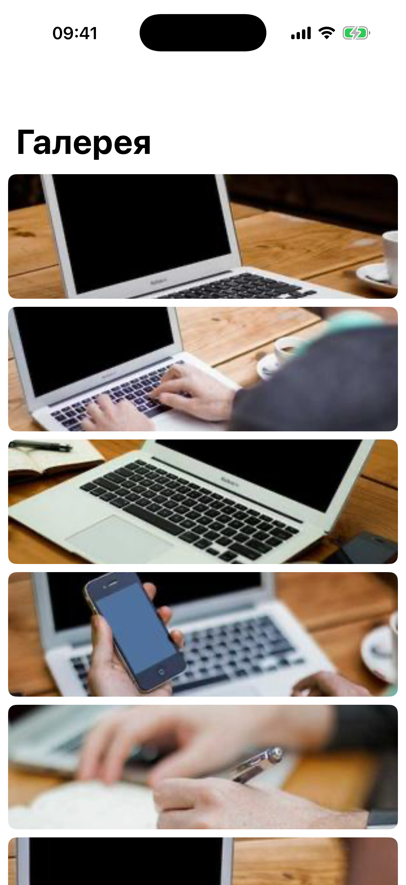

# Глава 16. Gallery — UICollectionView compositional, пагинация, photo viewer

{width=45%}

Галерея — это сетка картинок. Звучит просто, на деле — куча тонкостей:
адаптивный layout, lazy-загрузка изображений, пагинация при скролле,
кеш, полноэкранный просмотр с pinch-zoom.

В этой главе строим всё. Источник картинок — **picsum.photos**,
публичный сервис без ключа.

## 16.1 picsum.photos — какие данные

picsum.photos даёт два полезных endpoint'а:

- `https://picsum.photos/v2/list?page=1&limit=30` — JSON со списком
  фотографий (id, автор, размер, URL).
- `https://picsum.photos/id/{id}/{width}/{height}` — конкретная картинка
  любого размера (server-side resize).

Модель:

```swift
struct PicsumPhoto: Decodable, Hashable, Sendable {
    let id: String
    let author: String
    let width: Int
    let height: Int
    let download_url: String

    func thumbnailURL(width: Int) -> URL? {
        URL(string: "https://picsum.photos/id/\(id)/\(width)/\(width)")
    }
    func fullURL(maxSide: Int = 1200) -> URL? {
        URL(string: "https://picsum.photos/id/\(id)/\(maxSide)/\(maxSide)")
    }
}
```

`download_url` — оригинал (большое разрешение, тяжелое). Мы НЕ грузим
его в превью — для сетки делаем `thumbnailURL(width: 300)`, 300×300px.

`fullURL` — для полноэкранного режима, 1200×1200.

Декодер с snake_case — Swift игнорирует регистр, `download_url`
декодируется в `download_url` свойство как есть. Camelcase можно
получить через `CodingKeys` или `JSONDecoder.keyDecodingStrategy =
.convertFromSnakeCase`.

## 16.2 API — пагинация

```swift
enum GalleryAPI {
    static func fetch(page: Int, limit: Int = 30) async throws -> [PicsumPhoto] {
        var components = URLComponents(string: "https://picsum.photos/v2/list")!
        components.queryItems = [
            URLQueryItem(name: "page", value: "\(page)"),
            URLQueryItem(name: "limit", value: "\(limit)"),
        ]
        guard let url = components.url else { throw Error.decoding }
        let (data, response) = try await URLSession.shared.data(from: url)
        guard let http = response as? HTTPURLResponse, 200..<300 ~= http.statusCode else {
            throw Error.transport
        }
        return try JSONDecoder().decode([PicsumPhoto].self, from: data)
    }
}
```

Простая функция. Параметры `page` и `limit` отправляются в URL.

Реальный flow: VC грузит страницу 1. Когда юзер прокручивает почти
до конца — грузим страницу 2, потом 3, и так далее. До тех пор, пока
не вернётся пустой массив (тогда `hasMore = false`).

## 16.3 ImageCache — мемори-кеш картинок

`NSCache` — Apple-овский класс, который автоматически освобождает
содержимое при memory warning'е:

```swift
@MainActor
final class ImageCache {
    static let shared = ImageCache()
    private let cache = NSCache<NSURL, UIImage>()
    private var inflight: [URL: Task<UIImage?, Never>] = [:]

    func image(for url: URL) async -> UIImage? {
        if let cached = cache.object(forKey: url as NSURL) { return cached }
        if let existing = inflight[url] { return await existing.value }
        let task = Task<UIImage?, Never> {
            do {
                let (data, _) = try await URLSession.shared.data(from: url)
                return UIImage(data: data)
            } catch {
                return nil
            }
        }
        inflight[url] = task
        defer { inflight.removeValue(forKey: url) }
        let image = await task.value
        if let image { cache.setObject(image, forKey: url as NSURL) }
        return image
    }
}
```

Логика та же, что у `WeatherStore` (Глава 15): memory кеш +
дедупликация inflight'ов.

`NSCache<NSURL, UIImage>` — обобщённый кеш, ключ NSURL (потому что
NSCache требует NSObject-наследников; `URL` — value-type, не подходит).

`cache.object(forKey:)` — синхронный read. `cache.setObject(_:forKey:)`
— синхронный write. Thread-safe, можно из любого потока.

> 💡 **NSCache vs `[URL: UIImage]`**. Обычный dictionary держит
> все картинки в памяти до явного удаления. На большом scroll
> через 200 фото это могут быть сотни MB. NSCache **сама** освобождает
> старое при memory pressure. Для image cache — всегда NSCache.

## 16.4 Compositional Layout — адаптивная сетка

`UICollectionViewCompositionalLayout` (iOS 13+) — современный layout,
который описывается через **группы внутри секций**. Гораздо мощнее
старого `UICollectionViewFlowLayout`.

В нашей галерее — простая сетка 3 (или 4 на iPad) колонок:

```swift
private func makeLayout() -> UICollectionViewLayout {
    let inset: CGFloat = 4
    return UICollectionViewCompositionalLayout { _, environment in
        let isWide = environment.container.effectiveContentSize.width > 600
        let columns: Int = isWide ? 4 : 3
        let item = NSCollectionLayoutItem(layoutSize: .init(
            widthDimension: .fractionalWidth(1.0),
            heightDimension: .fractionalHeight(1.0)
        ))
        item.contentInsets = NSDirectionalEdgeInsets(top: inset, leading: inset, bottom: inset, trailing: inset)

        let group = NSCollectionLayoutGroup.horizontal(
            layoutSize: .init(
                widthDimension: .fractionalWidth(1.0),
                heightDimension: .fractionalWidth(1.0 / CGFloat(columns))
            ),
            subitems: [item]
        )

        let section = NSCollectionLayoutSection(group: group)
        section.contentInsets = NSDirectionalEdgeInsets(top: 0, leading: 4, bottom: 0, trailing: 4)

        let footerSize = NSCollectionLayoutSize(widthDimension: .fractionalWidth(1.0), heightDimension: .absolute(60))
        let footer = NSCollectionLayoutBoundarySupplementaryItem(
            layoutSize: footerSize,
            elementKind: UICollectionView.elementKindSectionFooter,
            alignment: .bottom
        )
        section.boundarySupplementaryItems = [footer]
        return section
    }
}
```

Что происходит:

1. **environment-based** — closure получает `environment`, проверяет
   `effectiveContentSize.width`. На iPad широкий (>600pt) — 4 колонки,
   на iPhone — 3.
2. **Item** — одна ячейка. `widthDimension: .fractionalWidth(1.0)` =
   100% от ширины группы. Поскольку в группе несколько items, они
   делят пространство.
3. **Group** — `.horizontal` с `subitems: [item]`. Указываем
   `fractionalWidth(1.0)` (вся ширина секции) и
   `fractionalWidth(1.0/columns)` для высоты (квадратные ячейки).
   Странно использовать `fractionalWidth` для высоты, но это
   работает — означает «1/columns от ширины».
4. **Section** — содержит группу. Boundary supplementary `.bottom` —
   footer-loader.

`NSDirectionalEdgeInsets` — поддерживает RTL-локали (арабский, иврит).
В отличие от `UIEdgeInsets` с `left`/`right`, тут `leading`/`trailing`.

> 💡 **Adaptive layout без `traitCollectionDidChange`**. Compositional
> layout автоматически пересчитывается при изменении размера
> environment'а. iPad rotation, split view — всё подхватится без
> костылей.

## 16.5 Пагинация — `willDisplay`

```swift
func collectionView(_ collectionView: UICollectionView, willDisplay cell: UICollectionViewCell,
                    forItemAt indexPath: IndexPath) {
    if indexPath.item >= photos.count - 6 {
        loadMore()
    }
}
```

Когда iOS собирается показать ячейку, индекс которой за `count - 6`
от конца — грузим следующую страницу. 6 ячеек до конца — запас, чтобы
загрузка успела закончиться до того, как юзер докрутит.

```swift
private func loadMore() {
    guard hasMore, !isLoadingPage else { return }
    isLoadingPage = true
    let pageToLoad = nextPage
    Task { [weak self] in
        guard let self else { return }
        do {
            let new = try await GalleryAPI.fetch(page: pageToLoad)
            self.photos.append(contentsOf: new)
            self.nextPage += 1
            if new.isEmpty { self.hasMore = false }
            // ...
            self.collectionView.reloadData()
        } catch {
            // оставляем без обновления, footer покажет ошибку
        }
        self.isLoadingPage = false
    }
}
```

Три флага:

- `hasMore: Bool` — `false`, когда API вернул пустой массив. Больше
  страниц нет.
- `isLoadingPage: Bool` — защита от двойной загрузки той же страницы.
- `nextPage: Int` — какую страницу грузить следующей.

`reloadData()` после добавления — самый простой способ. В production
лучше `performBatchUpdates` с `insertItems(at:)`, тогда сетка плавно
анимирует новые ячейки. У нас `reload` — не критично для UX,
скролл-позиция сохраняется.

## 16.6 Footer-loader

Снизу секции — `FooterLoaderView` с спиннером:

```swift
final class FooterLoaderView: UICollectionReusableView {
    static let reuseID = "FooterLoaderView"
    private let spinner = UIActivityIndicatorView(style: .medium)
    private let label = UILabel()

    func startSpinning() {
        spinner.startAnimating()
        label.text = "Загружаем ещё…"
    }
    func stop(label text: String) {
        spinner.stopAnimating()
        label.text = text
    }
}
```

В `viewForSupplementaryElementOfKind` решаем по `hasMore`:

```swift
func collectionView(_ collectionView: UICollectionView,
                    viewForSupplementaryElementOfKind kind: String,
                    at indexPath: IndexPath) -> UICollectionReusableView {
    let footer = collectionView.dequeueReusableSupplementaryView(
        ofKind: kind, withReuseIdentifier: FooterLoaderView.reuseID, for: indexPath
    ) as! FooterLoaderView
    if hasMore { footer.startSpinning() } else { footer.stop(label: "Это всё") }
    return footer
}
```

При `hasMore: true` — спиннер крутится, «Загружаем ещё...». При
`false` — «Это всё», статичный.

## 16.7 GalleryCell — асинхронная загрузка картинки

```swift
final class GalleryCell: UICollectionViewCell {
    private let imageView = UIImageView()
    private let skeleton = SkeletonView()
    private var currentURL: URL?

    func configure(with photo: PicsumPhoto) {
        imageView.image = nil
        skeleton.startAnimating()
        guard let url = photo.thumbnailURL(width: 300) else { return }
        currentURL = url
        Task { [weak self] in
            guard let self else { return }
            let image = await ImageCache.shared.image(for: url)
            if self.currentURL == url {
                self.imageView.image = image
                self.skeleton.isHidden = image != nil
                self.skeleton.stopAnimating()
            }
        }
    }
}
```

Главное — **`currentURL` check** перед установкой изображения:

```swift
if self.currentURL == url { ... }
```

Зачем? Потому что ячейки переиспользуются. Сценарий:

1. Ячейка показывает фото A, грузим картинку A.
2. Юзер скроллит — ячейка теперь показывает фото B, начинаем грузить B.
3. Картинка A заканчивает загрузку (медленнее, чем B).
4. Без check'а — мы бы записали A в imageView, пока показывается B.

Сравнение URL'ов гарантирует: ставим картинку **только** если ячейка
всё ещё ждёт **эту** конкретную картинку.

`skeleton` показывает shimmer-анимацию пока картинка грузится.
Спрятается, как только imageView заполнится.

## 16.8 PhotoViewerViewController — pinch-to-zoom

При тапе на ячейку — открываем модально полноэкранный просмотр:

```swift
final class PhotoViewerViewController: UIViewController {
    private let photo: PicsumPhoto
    private let scrollView = UIScrollView()
    private let imageView = UIImageView()
    private let spinner = UIActivityIndicatorView(style: .large)

    private func setupLayout() {
        scrollView.minimumZoomScale = 1.0
        scrollView.maximumZoomScale = 4.0
        scrollView.delegate = self
        scrollView.bouncesZoom = true
        // ...

        let doubleTap = UITapGestureRecognizer(target: self, action: #selector(doubleTapped(_:)))
        doubleTap.numberOfTapsRequired = 2
        scrollView.addGestureRecognizer(doubleTap)
    }
}

extension PhotoViewerViewController: UIScrollViewDelegate {
    func viewForZooming(in scrollView: UIScrollView) -> UIView? { imageView }
}
```

`UIScrollView` поддерживает pinch-zoom **из коробки**, если:

1. `minimumZoomScale` < `maximumZoomScale`.
2. Делегат реализует `viewForZooming(in:) -> UIView?`.
3. Возвращённый view находится **внутри** scrollView.

Двойной тап — переключатель «приблизить / отдалить»:

```swift
@objc private func doubleTapped(_ sender: UITapGestureRecognizer) {
    if scrollView.zoomScale > 1.0 {
        scrollView.setZoomScale(1.0, animated: true)
    } else {
        let point = sender.location(in: imageView)
        let size = CGSize(width: scrollView.bounds.width / 2.5,
                          height: scrollView.bounds.height / 2.5)
        let rect = CGRect(origin: CGPoint(x: point.x - size.width / 2,
                                          y: point.y - size.height / 2),
                          size: size)
        scrollView.zoom(to: rect, animated: true)
    }
}
```

Если уже зум — отдаляем. Если нет — приближаем **к точке тапа**.
Это естественнее, чем «всегда в центр» — пользователь хочет видеть
**то место**, на которое нажал.

`zoom(to: rect)` — приближение, чтобы данный прямоугольник стал
видимой областью. Размер прямоугольника определяет уровень зума.

## 16.9 Context menu — long-press

```swift
func collectionView(_ collectionView: UICollectionView,
                    contextMenuConfigurationForItemAt indexPath: IndexPath,
                    point: CGPoint) -> UIContextMenuConfiguration? {
    let photo = photos[indexPath.item]
    return UIContextMenuConfiguration(identifier: nil, previewProvider: nil) { _ in
        let openAction = UIAction(title: "Открыть", image: UIImage(systemName: "arrow.up.left.and.arrow.down.right")) { [weak self] _ in
            // ...
        }
        let infoAction = UIAction(title: "Автор: \(photo.author)", image: UIImage(systemName: "person.fill")) { _ in }
        return UIMenu(children: [openAction, infoAction])
    }
}
```

`contextMenuConfigurationForItemAt` — long-press на ячейке. iOS
показывает превью + меню. Хороший паттерн для «дополнительных
действий», которые не помещаются в основной UI.

Один из пунктов меню можно сделать неинтерактивным — «информация».
Юзер видит автора фото, но action ничего не делает (`_ in }`).

## 16.10 Бытовая аналогия

Галерея — это **бесконечная стена с открытками** в магазине сувениров.
Подходишь — видишь первые ряды. Подходишь дальше — стена растёт
(пагинация). На каждой полке (UICollectionView) — открытки разного
размера, но раскладка адаптивная: на широкой стене 4 колонки, на узкой
3.

Полки **переиспользуют рамки**. Ушёл от одной открытки, рамка
освободилась — в неё поставили другую. Если ты заказал картинку для
рамки, а она пришла слишком поздно — ставить уже не надо, рамка
другая (поэтому проверяем `currentURL == url`).

Лупа (pinch-zoom) — увеличивает выбранную открытку. Кто двигает её —
не сама открытка, а **стекло над ней** (UIScrollView).

## 16.11 Что мы пропустили

- **Save to Photos**. Реальная галерея позволяет сохранить картинку в
  Photos. Делается через `PHPhotoLibrary.shared().performChanges`.
  Требует разрешения.
- **Drag-to-dismiss** в PhotoViewer — потянуть пальцем вниз, чтобы
  закрыть. Стандартный жест для full-screen image viewer'ов.
- **Hero animation** при открытии — миниатюра «вырастает» до
  полноэкранной. `UIViewControllerAnimatedTransitioning` + matched
  geometry.
- **Lazy thumbnail size** — для разных размеров устройства запрашивать
  разный размер с picsum (на iPad больше пикселей).

> 🛠 **Упражнение.** Открой Галерею (розовая ячейка в лаунчере).
> Поскролль вниз — увидишь как «загружаем ещё…» снизу появляется,
> потом приходят новые ряды. Тапни любую — откроется полноэкранно.
> Сделай пинч (Option+drag в симуляторе) — приблизишь.
> Двойной тап — приблизит к точке тапа. Long-press на ячейке в
> сетке — увидишь меню с автором.

## 📋 Что мы выучили

- Picsum.photos — публичный image-API без ключа. `thumbnailURL(width:)`
  для превью, `fullURL` для viewer'а.
- `NSCache<NSURL, UIImage>` — auto-releasing image cache. Освобождает
  старые при memory pressure.
- Дедупликация запросов через `inflight: [URL: Task]`.
- `UICollectionViewCompositionalLayout` с environment-based
  responsive — 3 колонки на iPhone, 4 на iPad.
- **Пагинация** через `willDisplay` + проверка `indexPath.item >=
  count - 6`. Три флага: `hasMore`, `isLoadingPage`, `nextPage`.
- Footer-loader — `UICollectionReusableView` с типом
  `elementKindSectionFooter`. Показывает «Загружаем ещё...» или
  «Это всё».
- **`currentURL` check** в ячейке перед установкой изображения —
  защита от race condition при переиспользовании ячеек.
- `UIScrollView` + `viewForZooming` = pinch-to-zoom из коробки.
  Double-tap через `UITapGestureRecognizer`.
- `contextMenuConfigurationForItemAt` — long-press меню на ячейке.
- `NSDirectionalEdgeInsets` вместо `UIEdgeInsets` для RTL-совместимости.

→ [Глава 17. Music Player — AVPlayer, mini-player, haptic slider](./25-music.md)
