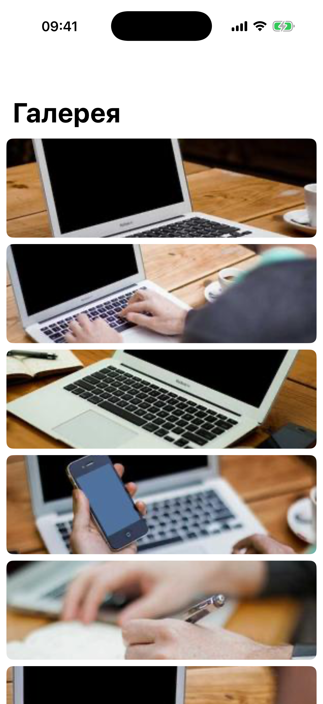

# Глава 16. Gallery — UICollectionView compositional, пагинация, photo viewer

{width=45%}

Галерея — это сетка картинок. Звучит просто, но внутри прячется много
тонкостей: сетка должна подстраиваться под ширину экрана, картинки
грузятся из сети не сразу, новые страницы подтягиваются по мере
прокрутки, всё это надо где-то держать в памяти, а по тапу фото
открывается на весь экран, и его можно растянуть двумя пальцами.

В этой главе строим всё это целиком. Источник картинок —
**picsum.photos**, публичный сервис с фотографиями, которому не нужен
ключ API.

Что получится:

```
┌───────────────────────────┐
│ Галерея                   │
├────────┬────────┬─────────┤
│  фото  │  фото  │  фото   │  ← UICollectionView, 3 колонки
├────────┼────────┼─────────┤    (на iPad — 4)
│  фото  │  фото  │  фото   │
├────────┴────────┴─────────┤
│   o  Загружаем ещё…       │  ← footer: спиннер / «Это всё» / «Повторить»
└───────────────────────────┘
        тап по фото ↓
┌───────────────────────────┐
│                       (x) │  ← PhotoViewerViewController:
│      фото целиком,        │    щипок — приблизить,
│      растягивается        │    двойной тап — приблизить к точке
└───────────────────────────┘
```

Файлы мини-приложения:

```
Apps/Gallery/
├── PicsumPhoto.swift               ← модель одной фотографии
├── GalleryAPI.swift                ← запрос страницы списка
├── ImageCache.swift                ← кеш картинок в памяти
├── GalleryCell.swift               ← ячейка сетки
├── FooterLoaderView.swift          ← нижний «загружаем ещё»
├── PhotoViewerViewController.swift ← полноэкранный просмотр
├── PhotoSaver.swift                ← сохранение в «Фото»
└── GalleryViewController.swift     ← экран с сеткой
```

> **Режим сборки.** Весь код главы проверен в тех настройках, что
> описаны во введении: Swift 6, `Default Actor Isolation = MainActor`,
> deployment target iOS 15. В этом режиме любой класс и функция без
> пометки живут на главном потоке (main actor), поэтому UIKit-код
> можно писать без `@MainActor` на каждом классе. Там, где тип должен
> работать и вне главного потока, мы явно пишем `nonisolated` — и
> объясняем почему.

## 16.1 picsum.photos — какие данные

picsum.photos даёт два полезных адреса (endpoint'а — так называют
конкретный URL, который отвечает на один вид запроса):

- `https://picsum.photos/v2/list?page=1&limit=30` — JSON со списком
  фотографий: id, автор, исходный размер, ссылка на оригинал.
- `https://picsum.photos/id/{id}/{width}/{height}` — сама картинка
  нужного размера. Сервер сам уменьшит и обрежет оригинал.

Так выглядит один элемент ответа (реальный ответ сервиса, первая
запись):

```json
{
  "id": "0",
  "author": "Alejandro Escamilla",
  "width": 5000,
  "height": 3333,
  "url": "https://unsplash.com/photos/yC-Yzbqy7PY",
  "download_url": "https://picsum.photos/id/0/5000/3333"
}
```

Модель:

```swift
import Foundation

nonisolated struct PicsumPhoto: Decodable, Hashable, Sendable {
    let id: String
    let author: String
    let width: Int
    let height: Int
    let downloadURL: String

    enum CodingKeys: String, CodingKey {
        case id, author, width, height
        case downloadURL = "download_url"
    }

    func thumbnailURL(side: Int) -> URL? {
        URL(string: "https://picsum.photos/id/\(id)/\(side)/\(side)")
    }

    func fullURL(maxSide: Int = 1200) -> URL? {
        let aspect = Double(height) / Double(max(width, 1))
        let w = width >= height ? maxSide : Int((Double(maxSide) / aspect).rounded())
        let h = width >= height ? Int((Double(maxSide) * aspect).rounded()) : maxSide
        return URL(string: "https://picsum.photos/id/\(id)/\(w)/\(h)")
    }
}
```

Разберём по частям.

**`nonisolated struct`.** В режиме «всё на main actor» структура без
пометки тоже считается привязанной к главному потоку, и её
соответствие `Decodable` и `Hashable` — тоже. Пока мы декодируем её
на главном потоке, это не мешает. Но `Hashable`-модели часто уходят в
API, которые требуют «можно пользоваться из любого потока» (например,
идентификаторы diffable data source), а декодирование иногда хочется
увести в фон. `nonisolated` снимает привязку: структура из одних
`let`-констант ни от какого потока не зависит, и это честно.
`Sendable` подтверждает то же самое для компилятора: значение можно
безопасно передавать между потоками.

**`CodingKeys`.** В JSON ключ называется `download_url` (через
подчёркивание — стиль snake_case), а в Swift принято `downloadURL`
(camelCase). Сопоставление ключей в `Codable` точное и
регистрозависимое, поэтому без подсказки декодер искал бы в JSON ключ
`downloadURL` и не нашёл бы. `enum CodingKeys` говорит: свойство
`downloadURL` читай из ключа `download_url`. Остальные ключи совпадают
с именами свойств и перечислены просто так. Другой путь —
`decoder.keyDecodingStrategy = .convertFromSnakeCase`, тогда декодер
сам превратит `download_url` в `downloadUrl`. Обрати внимание: именно
в `downloadUrl` с маленькими `rl`, а не `downloadURL`. Из-за таких
сюрпризов явные `CodingKeys` надёжнее.

`downloadURL` — оригинал, 5000×3333 пикселей и несколько мегабайт. Мы
никогда не грузим его в сетку. Для превью есть `thumbnailURL(side:)` —
квадрат нужной стороны. Какой именно стороны, посчитаем в разделе 16.7.

**`fullURL(maxSide:)`** — картинка для полноэкранного просмотра. Если
попросить у picsum квадрат 1200×1200, сервис **обрежет** фото до
квадрата, и в просмотре пропадут края. Поэтому сохраняем пропорции
оригинала. На числах для первой записи: ширина 5000, высота 3333,
значит высота составляет 3333 / 5000 ≈ 0,67 ширины (это `aspect`).
Фото горизонтальное (ширина больше высоты), поэтому длинную сторону
делаем 1200, а короткую — 1200 × 0,67 ≈ 800. Получаем 1200×800 — та
же форма, что у оригинала. Для вертикального фото наоборот: высота
1200, ширина 1200 / aspect. `max(width, 1)` защищает от деления на
ноль, если сервер вдруг пришлёт ширину 0.

## 16.2 API — пагинация

Список фото сервис отдаёт кусками — страницами. Это и есть пагинация
(pagination, «постраничная выдача»): вместо тысячи записей за раз
просим по 30, а когда пользователь докрутит до конца — ещё 30.

```swift
import Foundation

enum GalleryAPI {
    enum APIError: Error {
        case badURL
        case badStatus(Int)
    }

    static let pageSize = 30

    static func fetch(page: Int, limit: Int) async throws -> [PicsumPhoto] {
        var components = URLComponents(string: "https://picsum.photos/v2/list")
        components?.queryItems = [
            URLQueryItem(name: "page", value: String(page)),
            URLQueryItem(name: "limit", value: String(limit)),
        ]
        guard let url = components?.url else { throw APIError.badURL }

        let (data, response) = try await URLSession.shared.data(from: url)
        let status = (response as? HTTPURLResponse)?.statusCode ?? 0
        guard 200..<300 ~= status else { throw APIError.badStatus(status) }
        return try JSONDecoder().decode([PicsumPhoto].self, from: data)
    }
}
```

Что здесь происходит:

- **`URLComponents`** собирает URL из частей и сам экранирует значения
  параметров. Писать `"...?page=\(page)"` руками работает, пока в
  значении не окажется пробел или `&`.
- **`URLSession.shared.data(from:)`** — асинхронная загрузка (iOS 15+).
  Пока ответ идёт по сети, главный поток свободен: `await` не
  блокирует интерфейс, а отпускает поток и возвращается, когда данные
  пришли.
- **Статус ответа.** `200..<300 ~= status` читается как «status лежит
  в диапазоне от 200 до 299». Сервер может ответить 404 или 500 с
  HTML-страницей ошибки вместо JSON; без этой проверки мы получили бы
  непонятную ошибку декодирования.
- **`enum APIError`** — свои ошибки с понятными именами. В исходной
  версии этой главы код бросал `Error.decoding`, но такого типа нигде
  не было, и листинг не собирался.

Когда страницы кончаются? Мы проверили на живом сервисе: при
`limit=30` страницы с 1-й по 33-ю полные, на 34-й всего 3 фото, 35-я
возвращает пустой массив `[]`. Отсюда правило: **если пришло меньше,
чем просили, — это последняя страница**. Ждать пустой страницы не
нужно, это лишний запрос.

## 16.3 ImageCache — кеш картинок в памяти

Когда пользователь листает сетку вверх-вниз, одни и те же превью
появляются снова и снова. Качать их каждый раз заново — трата
трафика и батареи. Поэтому скачанные картинки держим в кеше (cache —
«заначка», быстрое хранилище того, что уже получили).

```swift
import UIKit

@MainActor
final class ImageCache {
    static let shared = ImageCache()

    private let cache = NSCache<NSURL, UIImage>()
    private var inflight: [URL: Task<UIImage?, Never>] = [:]

    private init() {
        cache.totalCostLimit = 80 * 1024 * 1024   // 80 МБ раскодированных пикселей
    }

    func cachedImage(for url: URL) -> UIImage? {
        cache.object(forKey: url as NSURL)
    }

    func image(for url: URL) async -> UIImage? {
        if let cached = cachedImage(for: url) { return cached }
        if let existing = inflight[url] { return await existing.value }

        let task = Task<UIImage?, Never> {
            guard let (data, _) = try? await URLSession.shared.data(from: url),
                  let image = UIImage(data: data) else { return nil }
            return await image.byPreparingForDisplay() ?? image
        }
        inflight[url] = task
        let image = await task.value
        inflight[url] = nil

        if let image {
            cache.setObject(image, forKey: url as NSURL, cost: image.memoryCost)
        }
        return image
    }
}

private extension UIImage {
    /// Сколько байт занимают раскодированные пиксели.
    var memoryCost: Int {
        guard let cgImage else { return 1 }
        return cgImage.bytesPerRow * cgImage.height
    }
}
```

Разберём по шагам.

**`NSCache`** — класс Apple для кешей. Внешне он похож на словарь
«ключ → значение», но умеет сам выбрасывать содержимое, когда памяти
становится мало. Обычный словарь `[URL: UIImage]` держал бы все
картинки до конца жизни приложения: пролистал 500 фото — все 500 в
памяти, и система в какой-то момент просто завершит приложение.

Ключ — `NSURL`, а не `URL`: `NSCache` пришёл из Objective-C и
принимает в качестве ключей только объекты-наследники `NSObject`.
`URL` — структура Swift, поэтому пишем `url as NSURL`: это бесплатное
преобразование в «объектный» двойник.

**`totalCostLimit` и `cost`.** Лимит можно задать двумя способами:
числом объектов (`countLimit`) или суммарной «стоимостью»
(`totalCostLimit`). Картинки бывают очень разного размера, поэтому
считаем стоимость в байтах. Раскодированная картинка в памяти — это
таблица пикселей, на каждый пиксель обычно 4 байта (красный, зелёный,
синий, прозрачность). Превью 400×400 пикселей: 400 × 400 × 4 = 640 000
байт, около 0,6 МБ. Полноэкранное фото 1200×800: 1200 × 800 × 4 ≈ 3,8
МБ. Обрати внимание: JPEG-файл на диске весит в несколько раз меньше,
но в памяти лежит именно распакованная таблица пикселей. При лимите
80 МБ в кеш поместится примерно 130 превью. `bytesPerRow × height` —
точное число байт этой таблицы (`bytesPerRow` иногда чуть больше
ширины × 4 из-за выравнивания строк). Лимит — не жёсткая граница, а
ориентир: документация Apple прямо говорит, что `NSCache` может
выбрасывать объекты и раньше, и позже.

**`byPreparingForDisplay()`** (iOS 15+). `UIImage(data:)` не
распаковывает JPEG сразу, это происходит при первом показе — на
главном потоке, в момент прокрутки. Тридцать распаковок подряд дают
заметное подёргивание сетки. `byPreparingForDisplay()` распаковывает
картинку заранее в фоне и возвращает готовую к показу копию. Если
распаковать не вышло (вернулся `nil`), отдаём исходную картинку.

**`inflight`** («в полёте») — словарь уже запущенных загрузок. Сценарий:
ячейка попросила превью A, через 50 мс пользователь прокрутил туда-
обратно, и другая ячейка просит то же A. Без `inflight` ушло бы два
одинаковых запроса. С ним второй вызов находит в словаре задачу
первого и ждёт её результат: `await existing.value`. Тот же приём
был в `WeatherStore` (глава 15).

**Почему класс на `@MainActor`.** Словарь `inflight` меняется из
разных вызовов, и без защиты два вызова могли бы менять его
одновременно. Привязка к главному потоку гарантирует, что код класса
выполняется по очереди. В нашем режиме сборки класс и так попадёт на
main actor, но явная пометка документирует намерение и оставляет код
рабочим, если кто-то соберёт его без этой настройки. Сама загрузка
при этом главный поток не держит: на `await` поток свободен.

**`Task { ... }` внутри.** Задача, созданная из кода на main actor,
тоже начинает работу на нём, но всё тяжёлое внутри — сеть и
`byPreparingForDisplay()` — асинхронное и выполняется вне главного
потока. Задача не привязана к вызывающей ячейке: если ячейка
передумает (о отмене — в разделе 16.7), загрузка всё равно
доведётся до конца и положит картинку в кеш. Для галереи это
полезно: пролистанное фото, скорее всего, понадобится при прокрутке
обратно.

**`cachedImage(for:)`** — синхронная проверка кеша. Она нужна ячейке,
чтобы показать уже скачанную картинку сразу, без мигания пустого
квадрата (подробнее в 16.7).

## 16.4 Compositional Layout — адаптивная сетка

`UICollectionView` — вид для коллекции элементов с любой раскладкой:
сетка, карусель, список. Сам он не решает, где стоит каждая ячейка;
это делает отдельный объект — layout («раскладка»).
`UICollectionViewCompositionalLayout` (iOS 13+) описывает раскладку
как матрёшку из трёх уровней:

- **item** — одна ячейка;
- **group** — ряд (или столбец) из нескольких item;
- **section** — секция, в которой группы повторяются, пока не
  кончатся элементы.

Размеры задаются относительно контейнера: `.fractionalWidth(0.5)` —
«половина ширины контейнера», `.absolute(60)` — ровно 60 точек.

Наша сетка: 3 колонки на телефоне, 4 на широком экране:

```swift
import UIKit

extension GalleryViewController {
    static func columns(forWidth width: CGFloat) -> Int {
        width > 600 ? 4 : 3
    }

    func makeLayout() -> UICollectionViewLayout {
        let inset: CGFloat = 2
        return UICollectionViewCompositionalLayout { _, environment in
            let columns = Self.columns(forWidth: environment.container.effectiveContentSize.width)

            let item = NSCollectionLayoutItem(layoutSize: NSCollectionLayoutSize(
                widthDimension: .fractionalWidth(1.0 / CGFloat(columns)),
                heightDimension: .fractionalHeight(1.0)
            ))
            item.contentInsets = NSDirectionalEdgeInsets(top: inset, leading: inset,
                                                         bottom: inset, trailing: inset)

            let group = NSCollectionLayoutGroup.horizontal(
                layoutSize: NSCollectionLayoutSize(
                    widthDimension: .fractionalWidth(1.0),
                    heightDimension: .fractionalWidth(1.0 / CGFloat(columns))
                ),
                subitems: [item]
            )

            let section = NSCollectionLayoutSection(group: group)
            section.contentInsets = NSDirectionalEdgeInsets(top: 0, leading: inset,
                                                            bottom: 0, trailing: inset)

            let footer = NSCollectionLayoutBoundarySupplementaryItem(
                layoutSize: NSCollectionLayoutSize(widthDimension: .fractionalWidth(1.0),
                                                   heightDimension: .absolute(60)),
                elementKind: UICollectionView.elementKindSectionFooter,
                alignment: .bottom
            )
            section.boundarySupplementaryItems = [footer]
            return section
        }
    }
}
```

Раскладку мы вынесли в расширение `GalleryViewController` — сам
контроллер соберём в разделе 16.11.

1. **Замыкание с `environment`.** Раскладка создаётся не один раз, а
   каждый раз, когда меняется размер контейнера: поворот телефона,
   Split View на iPad. `environment.container.effectiveContentSize` —
   текущий размер. Ширина больше 600 точек (iPad, или iPhone Pro Max
   в альбомной ориентации) — 4 колонки, иначе 3. Правило вынесено в
   `columns(forWidth:)`, потому что оно понадобится ещё раз — при
   расчёте размера превью.
2. **Item.** Ширина `.fractionalWidth(1.0 / columns)` — треть ширины
   группы при трёх колонках. Высота `.fractionalHeight(1.0)` — вся
   высота группы.
3. **Group.** Горизонтальная группа на всю ширину секции
   (`.fractionalWidth(1.0)`). Высота — `.fractionalWidth(1/columns)`:
   да, высота задана через **ширину**. Это законно и значит «высота
   ряда равна трети ширины». Раз ширина ячейки тоже треть ширины —
   ячейки получаются квадратными. `horizontal(layoutSize:subitems:)`
   кладёт item в ряд столько раз, сколько поместится: три трети — три
   ячейки.
4. **Section** повторяет группу, пока не кончатся фото, и добавляет
   снизу footer — дополнительный вид (supplementary view) для
   индикатора загрузки. Дополнительный вид — это элемент коллекции,
   который не является ячейкой с данными: заголовок, подвал, значок.

> **Частая ошибка.** Дать item ширину
> `.fractionalWidth(1.0)`, то есть 100% ширины группы. Тогда в ряд помещается
> ровно один такой item, и вместо сетки получается столбец широких
> прямоугольников. Если нужно, чтобы количество задавала группа, а не
> item, есть `NSCollectionLayoutGroup.horizontal(layoutSize:repeatingSubitem:count:)`,
> но он появился только в iOS 16. Для iOS 15 есть старый
> `horizontal(layoutSize:subitem:count:)`, который в iOS 16 объявлен
> устаревшим. Дробная ширина item работает везде одинаково.

**Отступы на числах.** У каждой ячейки `contentInsets` по 2 точки со
всех сторон, и у секции ещё 2 точки слева и справа. Между соседними
фото получается 2 + 2 = 4 точки, а от края экрана тоже 2 + 2 = 4.
Промежутки везде одинаковые. `contentInsets` отнимается от места,
которое выделено item, поэтому ячейка становится меньше, а сетка не
разъезжается.

`NSDirectionalEdgeInsets` вместо `UIEdgeInsets` — отступы `leading`/
`trailing` («от начала»/«до конца» строки) вместо `left`/`right`. Для
языков с письмом справа налево (RTL — арабский, иврит) система
зеркалит интерфейс, и `leading` сам станет правой стороной.

> **Подсказка.** Раскладку не нужно пересчитывать вручную в
> `traitCollectionDidChange` или `viewWillTransition`. Compositional
> layout сам вызовет замыкание снова при повороте или изменении
> размера окна.

> **Упражнение 16.1.** Маленькие телефоны в режиме «Увеличенный»
> (Настройки → Экран и яркость → Вид экрана) дают ширину экрана около
> 320 точек, и три колонки там получаются мелкими. Измени правило так,
> чтобы при ширине меньше 350 точек было 2 колонки, от 350 до 600 — 3,
> больше 600 — 4. Решение — в конце главы.

## 16.5 Пагинация — `willDisplay`

Как узнать, что пользователь докрутил почти до конца? Коллекция
сообщает своему делегату (delegate — объект, которому вид
«докладывает» о событиях и которого спрашивает о решениях) о каждой
ячейке, которая вот-вот появится на экране:

```swift
import UIKit

extension GalleryViewController: UICollectionViewDelegate {
    func collectionView(_ collectionView: UICollectionView, willDisplay cell: UICollectionViewCell,
                        forItemAt indexPath: IndexPath) {
        if indexPath.item >= photos.count - 6, !lastLoadFailed {
            loadMore()
        }
    }

    func collectionView(_ collectionView: UICollectionView, didSelectItemAt indexPath: IndexPath) {
        openPhoto(at: indexPath.item)
    }
}
```

Когда на экран выходит одна из шести последних ячеек, начинаем грузить
очередную страницу. Шесть ячеек — это два ряда при трёх колонках: запас,
чтобы страница успела прийти, пока пользователь докручивает. При 30
фото загрузка стартует на ячейке с номером 24 (нумерация с нуля:
30 − 6 = 24).

`!lastLoadFailed` — если прошлая загрузка упала (нет сети), не
повторяем её автоматически на каждую ячейку. Иначе без сети мы бы
долбили сервер при каждом движении пальца. Повтор — по кнопке в
footer'е (16.6).

Сама загрузка:

```swift
import UIKit

extension GalleryViewController {
    func loadMore() {
        guard hasMore, !isLoadingPage else { return }
        isLoadingPage = true
        lastLoadFailed = false
        reloadFooter()

        let pageToLoad = nextPage
        Task { [weak self] in
            do {
                let newPhotos = try await GalleryAPI.fetch(page: pageToLoad, limit: GalleryAPI.pageSize)
                self?.appendPage(newPhotos)
            } catch {
                self?.lastLoadFailed = true
            }
            self?.isLoadingPage = false
            self?.reloadFooter()
        }
    }

    func appendPage(_ newPhotos: [PicsumPhoto]) {
        let start = photos.count
        photos.append(contentsOf: newPhotos)
        nextPage += 1
        if newPhotos.count < GalleryAPI.pageSize { hasMore = false }

        let indexPaths = (start..<photos.count).map { IndexPath(item: $0, section: 0) }
        collectionView.performBatchUpdates {
            collectionView.insertItems(at: indexPaths)
        }
    }
}
```

Четыре переменных состояния:

- `hasMore` — есть ли ещё страницы. Станет `false`, когда придёт
  неполная страница (меньше 30 фото), как мы выяснили в 16.2.
- `isLoadingPage` — идёт ли сейчас загрузка. `willDisplay` вызывается
  на каждую появившуюся ячейку, и без этого флага одна прокрутка
  запустила бы шесть одинаковых запросов.
- `nextPage` — номер страницы, которую грузить дальше.
- `lastLoadFailed` — упала ли последняя попытка.

`[weak self]` в задаче — контроллер держится задачей слабо. Если
пользователь закрыл галерею, пока страница грузится, контроллер
спокойно освободится, а `self?.` превратит оставшиеся строки в «ничего
не делать».

**`insertItems` вместо `reloadData()`.** `reloadData()` выбрасывает и
заново строит все видимые ячейки: они мигают, а ячейки, которые уже
грузили превью, начинают сначала. `insertItems(at:)` внутри
`performBatchUpdates` говорит коллекции ровно то, что случилось:
«в конец добавлено 30 элементов, с номера 30 по 59». Видимые ячейки не
трогаются, новые появляются с анимацией. Правило одно: к моменту
вызова `insertItems` массив `photos` уже должен содержать новые
элементы, иначе коллекция упадёт с ошибкой «количество элементов не
сходится».

## 16.6 Footer-loader

Снизу секции — подвал (footer) с тремя состояниями: «грузим» со
спиннером, «Это всё» и «Не загрузилось» с кнопкой повтора.

```swift
import UIKit

final class FooterLoaderView: UICollectionReusableView {
    static let reuseID = "FooterLoaderView"

    enum Mode {
        case loading
        case finished
        case failed
    }

    var onRetry: (() -> Void)?

    private let spinner = UIActivityIndicatorView(style: .medium)
    private let label = UILabel()
    private let retryButton = UIButton(type: .system)

    override init(frame: CGRect) {
        super.init(frame: frame)
        label.font = .preferredFont(forTextStyle: .footnote)
        label.textColor = .secondaryLabel
        label.adjustsFontForContentSizeCategory = true
        retryButton.setTitle("Повторить", for: .normal)
        retryButton.addAction(UIAction { [weak self] _ in self?.onRetry?() }, for: .touchUpInside)

        let stack = UIStackView(arrangedSubviews: [spinner, label, retryButton])
        stack.spacing = 8
        stack.alignment = .center
        stack.translatesAutoresizingMaskIntoConstraints = false
        addSubview(stack)
        NSLayoutConstraint.activate([
            stack.centerXAnchor.constraint(equalTo: centerXAnchor),
            stack.centerYAnchor.constraint(equalTo: centerYAnchor),
        ])
    }

    required init?(coder: NSCoder) { fatalError("init(coder:) не используется") }

    func apply(_ mode: Mode) {
        switch mode {
        case .loading:
            spinner.startAnimating()
            label.text = "Загружаем ещё…"
            retryButton.isHidden = true
        case .finished:
            spinner.stopAnimating()
            label.text = "Это всё"
            retryButton.isHidden = true
        case .failed:
            spinner.stopAnimating()
            label.text = "Не загрузилось."
            retryButton.isHidden = false
        }
    }
}
```

`UICollectionReusableView` — базовый класс для всего, что коллекция
переиспользует (ячейка `UICollectionViewCell` — его наследник). Footer
тоже берётся из очереди переиспользования, поэтому `apply(_:)`
выставляет **все** свойства в каждом режиме: текст, спиннер и видимость
кнопки. Если бы режим `.finished` не прятал кнопку, footer, который
раньше показывал ошибку, остался бы с лишней кнопкой.

`UIActivityIndicatorView` по умолчанию прячется, когда не крутится
(`hidesWhenStopped = true`), поэтому в режиме «Это всё» спиннер
исчезает сам.

`label.font = .preferredFont(forTextStyle: .footnote)` вместе с
`adjustsFontForContentSizeCategory = true` — поддержка Dynamic Type:
пользователь увеличил шрифт в настройках системы, и подпись выросла
без перезапуска.

`[weak self]` в `UIAction` у кнопки: кнопка держит action, action
держит замыкание. Если замыкание сильно держит footer, а footer держит
кнопку, получается кольцо, и никто из них не освободится.

Контроллер выбирает режим и обновляет footer:

```swift
import UIKit

extension GalleryViewController {
    func footerMode() -> FooterLoaderView.Mode {
        if lastLoadFailed { return .failed }
        return hasMore ? .loading : .finished
    }

    func reloadFooter() {
        let kind = UICollectionView.elementKindSectionFooter
        for case let footer as FooterLoaderView in collectionView.visibleSupplementaryViews(ofKind: kind) {
            footer.apply(footerMode())
        }
    }
}
```

`visibleSupplementaryViews(ofKind:)` отдаёт подвалы, которые сейчас на
экране. Если footer не виден — обновлять нечего, при появлении он
получит правильный режим в `viewForSupplementaryElementOfKind`
(16.11). `for case let footer as FooterLoaderView in` — цикл только по
элементам нужного типа, без принудительного приведения `as!`.

## 16.7 GalleryCell — асинхронная загрузка картинки

Ячейка — самое тонкое место галереи из-за переиспользования. На
экране iPhone одновременно видно около 20 ячеек, а фото — тысяча.
Коллекция не создаёт тысячу ячеек: те, что уехали за край экрана,
складываются в очередь и снова выдаются через
`dequeueReusableCell(withReuseIdentifier:for:)` для других фото. Как
тарелки в кафе: помыли, поставили новое блюдо. Отсюда главное правило:
всё, что ячейка показывала для прошлого фото, при повторном
использовании надо сбросить.

```swift
import UIKit

final class GalleryCell: UICollectionViewCell {
    static let reuseID = "GalleryCell"

    private let imageView = UIImageView()
    private var currentURL: URL?
    private var loadTask: Task<Void, Never>?

    override init(frame: CGRect) {
        super.init(frame: frame)
        contentView.backgroundColor = .secondarySystemBackground
        contentView.layer.cornerRadius = 6
        contentView.clipsToBounds = true

        imageView.contentMode = .scaleAspectFill
        imageView.clipsToBounds = true
        imageView.translatesAutoresizingMaskIntoConstraints = false
        contentView.addSubview(imageView)
        NSLayoutConstraint.activate([
            imageView.topAnchor.constraint(equalTo: contentView.topAnchor),
            imageView.bottomAnchor.constraint(equalTo: contentView.bottomAnchor),
            imageView.leadingAnchor.constraint(equalTo: contentView.leadingAnchor),
            imageView.trailingAnchor.constraint(equalTo: contentView.trailingAnchor),
        ])
        isAccessibilityElement = true
        accessibilityTraits = .image
    }

    required init?(coder: NSCoder) { fatalError("init(coder:) не используется") }

    override func prepareForReuse() {
        super.prepareForReuse()
        loadTask?.cancel()
        loadTask = nil
        currentURL = nil
        imageView.image = nil
    }

    func configure(with photo: PicsumPhoto, pixelSide: Int) {
        accessibilityLabel = "Фото, автор \(photo.author)"
        guard let url = photo.thumbnailURL(side: pixelSide) else { return }
        currentURL = url

        if let cached = ImageCache.shared.cachedImage(for: url) {
            imageView.image = cached
            return
        }

        loadTask = Task { [weak self] in
            let image = await ImageCache.shared.image(for: url)
            guard let self, !Task.isCancelled, self.currentURL == url else { return }
            self.imageView.alpha = 0
            self.imageView.image = image
            UIView.animate(withDuration: 0.2) { self.imageView.alpha = 1 }
        }
    }
}
```

**Заглушка вместо картинки.** Пока превью не пришло, виден фон
`contentView` цвета `.secondarySystemBackground` — светло-серый в
светлой теме и тёмно-серый в тёмной. Это самая простая заглушка
(placeholder — «место под будущее содержимое»). Хочешь бегущий
отблеск (shimmer, «скелетон») — возьми `SkeletonView` из раздела 15.8
главы 15 и положи его под `imageView`.

**`contentMode = .scaleAspectFill`** — картинка заполняет квадрат
целиком, лишнее обрезается (`clipsToBounds`). Превью у нас и так
квадратные, но режим спасает, если сервер вернёт картинку другой
формы.

**`prepareForReuse()`** — UIKit вызывает этот метод прямо перед тем,
как отдать ячейку для другого фото. Здесь сбрасываем всё, что
относится к прошлому фото: отменяем загрузку, забываем URL, убираем
картинку. Без `imageView.image = nil` пользователь на долю секунды
видел бы в ячейке чужое фото, пока грузится новое.

**Проверка `currentURL == url`** — защита от гонки (race condition —
ситуация, когда результат зависит от того, какая из двух операций
закончится раньше). Сценарий:

1. Ячейка показывает фото A и начинает грузить картинку A.
2. Пользователь прокрутил, ячейка ушла в очередь и вернулась с фото B.
   Начинается загрузка B.
3. Картинка A приходит позже B (сеть непредсказуема).
4. Без проверки мы поставили бы A в ячейку, которая показывает B.

Сравнение URL гарантирует: картинка ставится, только если ячейка всё
ещё ждёт именно её.

**Зачем ещё и `loadTask?.cancel()`.** Отмена задачи ячейки сообщает
«результат мне больше не нужен», и `Task.isCancelled` после `await`
вернёт `true`. Проверка URL закрывает ту же дыру, отмена — второй
замок: например, если то же фото вернётся в ту же ячейку, URL совпадёт,
а старая задача всё равно не должна ничего делать. Сама загрузка в
`ImageCache` при этом **не** прерывается: ячейка ждёт через
`await task.value`, а отмена ждущей задачи не отменяет ту, которую она
ждёт. Мы сознательно так оставили: картинку могут ждать сразу две
ячейки, и отмена одной не должна сорвать загрузку для другой, а
скачанное попадёт в кеш. Если нужно рвать запросы при быстрой
прокрутке, `ImageCache` придётся считать, сколько ячеек ждёт каждую
загрузку, и отменять её, когда ждущих не осталось.

**Сначала синхронный кеш.** Если картинка уже в кеше,
`cachedImage(for:)` отдаёт её сразу, в том же проходе раскладки. Без
этой проверки даже закешированное фото показывалось бы через задачу —
на один кадр позже, и при прокрутке назад ячейки мигали бы пустым
фоном.

**Плавное появление.** `alpha = 0` и анимация до 1 за 0,2 секунды —
картинка «проявляется» вместо резкой смены. Анимация делается только
для пришедших из сети картинок; из кеша — сразу.

**Сколько пикселей просить.** Параметр `pixelSide` считает контроллер:

```swift
import UIKit

extension GalleryViewController {
    /// Сторона превью в пикселях: ширина ячейки в точках × масштаб экрана,
    /// округлённая вверх до сотни.
    var thumbnailPixelSide: Int {
        let width = collectionView.bounds.width
        let columns = CGFloat(Self.columns(forWidth: width))
        let points = width / columns
        let pixels = points * traitCollection.displayScale
        return Int((pixels / 100).rounded(.up)) * 100
    }
}
```

UIKit меряет всё в **точках** (points), а экран состоит из
**пикселей**. На экранах @2x в одной точке 2×2 пикселя, на @3x — 3×3.
`traitCollection.displayScale` — этот коэффициент для текущего экрана.
Посчитаем для iPhone 16: ширина 393 точки, три колонки — примерно 131
точка на ячейку. Экран @3x: 131 × 3 = 393 пикселя. Округляем вверх до
сотни — просим 400×400. Если попросить меньше (например, 300), картинку
растянут до 393 пикселей, и она станет мыльной; если больше — лишний
трафик и память.

Округление до сотни нужно ради кеша и сервера: у соседних устройств
(393, 390, 402 точки ширины) получится один и тот же размер 400 и один
и тот же URL. Так кеш срабатывает чаще, а сервер отдаёт уже
подготовленные размеры. На iPad с 4 колонками и экраном @2x выйдет
около 1024 / 4 × 2 = 512 пикселей, округляем до 600.

> **Упражнение 16.2.** Сделай так, чтобы превью начинали грузиться ещё до
> того, как ячейка появится на экране. У коллекции есть протокол
> `UICollectionViewDataSourcePrefetching`: метод
> `collectionView(_:prefetchItemsAt:)` сообщает номера элементов,
> которые скоро понадобятся. Подключи его к `GalleryViewController` и
> прогрей в нём `ImageCache`. Проверка: после этого при медленной
> прокрутке новые ряды появляются уже с картинками, без серых
> квадратов. Решение — в конце главы.

## 16.8 PhotoViewerViewController — pinch-to-zoom

При тапе на ячейку открываем полноэкранный просмотр. Растягивание
двумя пальцами (pinch-to-zoom, «щипок») умеет сам `UIScrollView` —
его нужно только правильно настроить.

```swift
import UIKit

final class PhotoViewerViewController: UIViewController {
    private let photo: PicsumPhoto
    private let scrollView = UIScrollView()
    private let imageView = UIImageView()
    private let spinner = UIActivityIndicatorView(style: .large)
    private var loadTask: Task<Void, Never>?

    init(photo: PicsumPhoto) {
        self.photo = photo
        super.init(nibName: nil, bundle: nil)
        modalPresentationStyle = .fullScreen
    }

    required init?(coder: NSCoder) { fatalError("init(coder:) не используется") }

    override func viewDidLoad() {
        super.viewDidLoad()
        view.backgroundColor = .black
        setupLayout()
        loadImage()
    }

    override func viewDidLayoutSubviews() {
        super.viewDidLayoutSubviews()
        // Пока фото не приближено — оно ровно в размер экрана.
        if scrollView.zoomScale == scrollView.minimumZoomScale {
            imageView.frame = scrollView.bounds
            scrollView.contentSize = scrollView.bounds.size
        }
    }

    override func viewDidDisappear(_ animated: Bool) {
        super.viewDidDisappear(animated)
        if isBeingDismissed { loadTask?.cancel() }
    }

    private func setupLayout() {
        scrollView.frame = view.bounds
        scrollView.autoresizingMask = [.flexibleWidth, .flexibleHeight]
        scrollView.minimumZoomScale = 1.0
        scrollView.maximumZoomScale = 4.0
        scrollView.bouncesZoom = true
        scrollView.showsVerticalScrollIndicator = false
        scrollView.showsHorizontalScrollIndicator = false
        scrollView.contentInsetAdjustmentBehavior = .never
        scrollView.delegate = self
        view.addSubview(scrollView)

        imageView.contentMode = .scaleAspectFit
        imageView.isAccessibilityElement = true
        imageView.accessibilityTraits = .image
        imageView.accessibilityLabel = "Фото, автор \(photo.author)"
        scrollView.addSubview(imageView)

        spinner.color = .white
        spinner.translatesAutoresizingMaskIntoConstraints = false
        view.addSubview(spinner)

        let closeButton = UIButton(type: .close)
        closeButton.overrideUserInterfaceStyle = .dark
        closeButton.accessibilityLabel = "Закрыть"
        closeButton.addAction(UIAction { [weak self] _ in self?.dismiss(animated: true) },
                              for: .touchUpInside)
        closeButton.translatesAutoresizingMaskIntoConstraints = false
        view.addSubview(closeButton)

        NSLayoutConstraint.activate([
            spinner.centerXAnchor.constraint(equalTo: view.centerXAnchor),
            spinner.centerYAnchor.constraint(equalTo: view.centerYAnchor),
            closeButton.topAnchor.constraint(equalTo: view.safeAreaLayoutGuide.topAnchor, constant: 8),
            closeButton.trailingAnchor.constraint(equalTo: view.safeAreaLayoutGuide.trailingAnchor,
                                                  constant: -16),
        ])

        let doubleTap = UITapGestureRecognizer(target: self, action: #selector(doubleTapped(_:)))
        doubleTap.numberOfTapsRequired = 2
        scrollView.addGestureRecognizer(doubleTap)
    }

    private func loadImage() {
        guard let url = photo.fullURL() else { return }
        spinner.startAnimating()
        loadTask = Task { [weak self] in
            let image = await ImageCache.shared.image(for: url)
            guard let self else { return }
            self.spinner.stopAnimating()
            self.imageView.image = image
        }
    }

    @objc private func doubleTapped(_ sender: UITapGestureRecognizer) {
        if scrollView.zoomScale > scrollView.minimumZoomScale {
            scrollView.setZoomScale(scrollView.minimumZoomScale, animated: true)
        } else {
            let point = sender.location(in: imageView)
            let zoom: CGFloat = 2.5
            let size = CGSize(width: scrollView.bounds.width / zoom,
                              height: scrollView.bounds.height / zoom)
            let rect = CGRect(x: point.x - size.width / 2,
                              y: point.y - size.height / 2,
                              width: size.width,
                              height: size.height)
            scrollView.zoom(to: rect, animated: true)
        }
    }
}

extension PhotoViewerViewController: UIScrollViewDelegate {
    func viewForZooming(in scrollView: UIScrollView) -> UIView? { imageView }
}
```

`UIScrollView` поддерживает щипок сам, если выполнены три условия:

1. `minimumZoomScale` меньше `maximumZoomScale`. У нас от 1 (обычный
   размер) до 4 (в четыре раза крупнее).
2. Делегат реализует `viewForZooming(in:)` и возвращает вид, который
   надо масштабировать.
3. Этот вид лежит **внутри** scroll view.

**Почему кадры, а не Auto Layout.** Во время зума scroll view меняет
у `imageView` преобразование масштаба (`transform`) и сам пересчитывает
`contentSize`. Если на `imageView` висят ограничения Auto Layout, они
спорят со scroll view за размер, и зум начинает дёргаться. Поэтому
`imageView` расставлен кадром (`frame`): в `viewDidLayoutSubviews`
делаем его размером с экран, но только пока зума нет. Если пользователь
приблизил фото и повернул телефон, кадр не трогаем, иначе зум
сбросится рывком. `contentMode = .scaleAspectFit` вписывает фото в
экран целиком, с чёрными полосами по краям.

`scrollView.autoresizingMask = [.flexibleWidth, .flexibleHeight]` — scroll
view растягивается вместе с `view` при повороте. Это старый механизм
«пружинок», который работает без ограничений и отлично подходит, когда
вид просто должен занимать всё окно.

`contentInsetAdjustmentBehavior = .never` — не сдвигать содержимое
под безопасную зону (safe area — часть экрана, не закрытая чёлкой,
островом и полоской «домой»). Фото должно занимать весь экран, до
краёв.

`UIButton(type: .close)` — системная круглая кнопка с крестиком.
`overrideUserInterfaceStyle = .dark` заставляет её рисоваться в тёмном
стиле: на чёрном фоне кнопка светлой темы была бы почти не видна.

**Двойной тап** переключает «приблизить / вернуть». Если уже
приближено — возвращаемся к масштабу 1. Если нет — приближаем **к
точке тапа**: пользователь хочет рассмотреть именно то место, куда
ткнул.

`zoom(to:animated:)` принимает прямоугольник в координатах
`imageView` и масштабирует так, чтобы этот прямоугольник заполнил
экран. Размер прямоугольника и задаёт силу зума: экран 393×852 точки,
делим на 2,5 — прямоугольник 157×341 точка. Чтобы 157 точек заняли
393, их нужно растянуть в 2,5 раза — это и есть итоговый масштаб.
Центр прямоугольника ставим в точку тапа: отнимаем половину ширины и
половину высоты от координат точки.

`sender.location(in: imageView)` — координаты тапа в системе
`imageView`. Масштаб scroll view применяет к `imageView` через
преобразование, поэтому координаты внутри него остаются
«нерастянутыми» — ровно такими, каких ждёт `zoom(to:)`.

**Загрузка.** Полное фото тоже идёт через `ImageCache`, так что при
повторном открытии оно появится мгновенно. `viewDidDisappear` с
проверкой `isBeingDismissed` отменяет ожидание, если просмотр закрыли
до конца загрузки.

`modalPresentationStyle = .fullScreen` задан прямо в `init`: этот
контроллер всегда открывается на весь экран, и вызывающему коду не
нужно об этом помнить.

## 16.9 Context menu — долгое нажатие

```swift
import UIKit

extension GalleryViewController {
    func collectionView(_ collectionView: UICollectionView,
                        contextMenuConfigurationForItemAt indexPath: IndexPath,
                        point: CGPoint) -> UIContextMenuConfiguration? {
        let photo = photos[indexPath.item]
        return UIContextMenuConfiguration(identifier: nil, previewProvider: nil) { [weak self] _ in
            let open = UIAction(title: "Открыть",
                                image: UIImage(systemName: "arrow.up.left.and.arrow.down.right")) { _ in
                self?.openPhoto(at: indexPath.item)
            }
            let save = UIAction(title: "Сохранить в Фото",
                                image: UIImage(systemName: "square.and.arrow.down")) { _ in
                self?.savePhoto(photo)
            }
            let author = UIAction(title: "Автор: \(photo.author)",
                                  image: UIImage(systemName: "person.fill"),
                                  attributes: .disabled) { _ in }
            return UIMenu(children: [open, save, author])
        }
    }
}
```

`contextMenuConfigurationForItemAt` (iOS 13+) — метод делегата
коллекции: на долгое нажатие по ячейке система поднимает ячейку над
размытым фоном и показывает меню. Хорошее место для дополнительных
действий, которым не хватает места в основном интерфейсе.

`previewProvider: nil` — в качестве превью система берёт саму ячейку.
Можно вернуть свой контроллер (например, фото крупнее), но для сетки
хватает ячейки.

Замыкание `actionProvider` вызывается при каждом показе меню; `[weak
self]` в нём — чтобы меню не удерживало контроллер.

Пункт «Автор» — информационный, нажимать его незачем. `attributes:
.disabled` рисует его серым и делает неактивным. Если оставить пункту
пустой обработчик без `.disabled`, он выглядит как кнопка и закрывает
меню по нажатию, ничего не сделав.

`openPhoto(at:)` и `savePhoto(_:)` — методы контроллера, их соберём в
разделах 16.10 и 16.11.

## 16.10 «Сохранить в Фото» — какое разрешение нужно в действительности

Работа с медиатекой — место, где новички часто просят лишнее. Apple
даёт разные уровни доступа, и за каждым стоит свой системный диалог.

| Что нужно приложению | Инструмент | Разрешение |
|---|---|---|
| Пользователь выбирает фото из медиатеки | `PHPickerViewController` (iOS 14+) | **Не нужно.** Выбор идёт в отдельном системном процессе, приложение получает только выбранные фото |
| Только добавить фото в медиатеку | `PHPhotoLibrary` с уровнем `.addOnly` (iOS 14+) | Ключ `NSPhotoLibraryAddUsageDescription` в Info.plist + диалог «разрешить добавлять фото» |
| Читать всю медиатеку (свою сетку, как в «Фото») | `PHPhotoLibrary` с уровнем `.readWrite` | Ключ `NSPhotoLibraryUsageDescription` + диалог с вариантами «полный доступ» / «ограниченный» |

Галерее нужно только **добавить** фото — значит, минимальный уровень
`.addOnly`. Просить полный доступ ради сохранения одной картинки —
лишний пугающий диалог, и пользователь чаще откажет. Выбор фото через
`PHPickerViewController` мы сделаем в главе 19 (аватар в профиле).

Info.plist — файл настроек приложения, который система читает до
запуска: имя, версия, разрешения и тексты к ним. Без строки
`NSPhotoLibraryAddUsageDescription` приложение при запросе доступа
**аварийно завершится**. В Xcode 26 ключ добавляется на вкладке
**Info** цели приложения, в списке он называется «Privacy - Photo
Library Additions Usage Description». Текст пиши о пользе для
пользователя, он будет в системном диалоге: «Чтобы сохранить
понравившееся фото в твою медиатеку».

```swift
import Photos
import UIKit

enum PhotoSaver {
    enum SaveError: Error {
        case notAllowed
    }

    static func save(_ image: UIImage) async throws {
        let status = await PHPhotoLibrary.requestAuthorization(for: .addOnly)
        guard status == .authorized else { throw SaveError.notAllowed }
        try await PHPhotoLibrary.shared().performChanges {
            PHAssetChangeRequest.creationRequestForAsset(from: image)
        }
    }
}
```

- `requestAuthorization(for: .addOnly)` при первом вызове показывает
  системный диалог, а при повторных сразу возвращает сохранённый ответ.
  Если пользователь раньше отказал, диалога больше не будет — только
  переход в Настройки.
- Для уровня `.addOnly` бывает только «разрешено» (`.authorized`) или
  «нет». Статус `.limited` («доступ к выбранным фото») относится к
  чтению медиатеки, поэтому здесь его не проверяем.
- `performChanges` — все изменения медиатеки делаются внутри такого
  блока: система выполняет их одной операцией. Асинхронная версия с
  `try await` доступна с iOS 15.
- `PHAssetChangeRequest.creationRequestForAsset(from:)` — «создай в
  медиатеке новый снимок из этой картинки».

Простой альтернативный путь — функция `UIImageWriteToSavedPhotosAlbum`
из UIKit. Ей тоже нужен ключ `NSPhotoLibraryAddUsageDescription`, но
результат приходит через селектор Objective-C, что с async-кодом
неудобно.

Метод контроллера, который вызывает меню:

```swift
import UIKit

extension GalleryViewController {
    func savePhoto(_ photo: PicsumPhoto) {
        guard let url = photo.fullURL() else { return }
        Task { [weak self] in
            let message: String
            if let image = await ImageCache.shared.image(for: url) {
                do {
                    try await PhotoSaver.save(image)
                    message = "Фото сохранено в медиатеку."
                } catch PhotoSaver.SaveError.notAllowed {
                    message = "Нет доступа. Разреши добавление фото: Настройки → Конфиденциальность → Фото."
                } catch {
                    message = "Не удалось сохранить: \(error.localizedDescription)"
                }
            } else {
                message = "Не удалось скачать фото."
            }
            let alert = UIAlertController(title: nil, message: message, preferredStyle: .alert)
            alert.addAction(UIAlertAction(title: "OK", style: .default))
            self?.present(alert, animated: true)
        }
    }
}
```

Сохраняем полноразмерную версию (1200 точек по длинной стороне), а не
превью: в медиатеке пользователь захочет нормальное фото. Если оно уже
открывалось в просмотре, оно в кеше и сохранится сразу.

`catch PhotoSaver.SaveError.notAllowed` — отдельная ветка для отказа:
пользователю нужно не «что-то пошло не так», а подсказка, где включить
доступ.

## 16.11 Собираем GalleryViewController

Осталось само «тело» контроллера: хранимые свойства, создание коллекции
и источник данных. Источник данных (data source) — объект, который
отвечает коллекции на вопросы «сколько элементов?» и «какую ячейку
показать под номером N?».

```swift
import UIKit

final class GalleryViewController: UIViewController {
    var photos: [PicsumPhoto] = []
    var nextPage = 1
    var hasMore = true
    var isLoadingPage = false
    var lastLoadFailed = false

    lazy var collectionView = UICollectionView(frame: .zero, collectionViewLayout: makeLayout())

    override func viewDidLoad() {
        super.viewDidLoad()
        title = "Галерея"
        view.backgroundColor = .systemBackground

        collectionView.backgroundColor = .systemBackground
        collectionView.dataSource = self
        collectionView.delegate = self
        collectionView.register(GalleryCell.self, forCellWithReuseIdentifier: GalleryCell.reuseID)
        collectionView.register(FooterLoaderView.self,
                                forSupplementaryViewOfKind: UICollectionView.elementKindSectionFooter,
                                withReuseIdentifier: FooterLoaderView.reuseID)
        collectionView.translatesAutoresizingMaskIntoConstraints = false
        view.addSubview(collectionView)
        NSLayoutConstraint.activate([
            collectionView.topAnchor.constraint(equalTo: view.topAnchor),
            collectionView.bottomAnchor.constraint(equalTo: view.bottomAnchor),
            collectionView.leadingAnchor.constraint(equalTo: view.leadingAnchor),
            collectionView.trailingAnchor.constraint(equalTo: view.trailingAnchor),
        ])

        loadMore()
    }

    func openPhoto(at index: Int) {
        present(PhotoViewerViewController(photo: photos[index]), animated: true)
    }
}

extension GalleryViewController: UICollectionViewDataSource {
    func collectionView(_ collectionView: UICollectionView, numberOfItemsInSection section: Int) -> Int {
        photos.count
    }

    func collectionView(_ collectionView: UICollectionView,
                        cellForItemAt indexPath: IndexPath) -> UICollectionViewCell {
        let cell = collectionView.dequeueReusableCell(withReuseIdentifier: GalleryCell.reuseID,
                                                      for: indexPath)
        (cell as? GalleryCell)?.configure(with: photos[indexPath.item], pixelSide: thumbnailPixelSide)
        return cell
    }

    func collectionView(_ collectionView: UICollectionView,
                        viewForSupplementaryElementOfKind kind: String,
                        at indexPath: IndexPath) -> UICollectionReusableView {
        let view = collectionView.dequeueReusableSupplementaryView(
            ofKind: kind, withReuseIdentifier: FooterLoaderView.reuseID, for: indexPath
        )
        if let footer = view as? FooterLoaderView {
            footer.apply(footerMode())
            footer.onRetry = { [weak self] in self?.loadMore() }
        }
        return view
    }
}
```

Что здесь стоит разобрать:

- **Свойства без `private`.** Раскладка, пагинация и меню живут в
  расширениях в других файлах, а `private` в Swift виден только в
  пределах файла. Поэтому состояние открыто на уровне модуля
  (`internal`, по умолчанию). Если держишь весь контроллер в одном
  файле — можешь сделать их `private`.
- **`lazy var collectionView`** — коллекция создаётся при первом
  обращении. Нужно потому, что в инициализаторе свойства вызывается
  метод `makeLayout()`, а методы `self` до окончания инициализации
  звать нельзя. `lazy` откладывает создание до `viewDidLoad`.
- **`register`** — говорим коллекции, какой класс создавать для
  идентификатора `GalleryCell.reuseID`. Дальше `dequeueReusableCell`
  либо достаёт готовую ячейку из очереди, либо создаёт новую этого
  класса.
- **`(cell as? GalleryCell)?.configure`** вместо `as! GalleryCell`.
  Принудительное приведение уронит приложение, если однажды
  перепутаешь идентификатор. Мягкое приведение в худшем случае покажет
  пустую ячейку — ошибку видно, но приложение живо.
- **Коллекция до верхнего края `view`.** Коллекция — это scroll view,
  а у scroll view по умолчанию `contentInsetAdjustmentBehavior =
  .automatic`: система сама отступит сверху под навигационную панель и
  снизу под полоску «домой». Прокрученные фото красиво уезжают под
  полупрозрачную панель.
- **`onRetry`** в footer'е — `[weak self]`: footer живёт в коллекции,
  коллекция — в контроллере; сильная ссылка из footer'а на контроллер
  замкнула бы кольцо.

## 16.12 Бытовая аналогия

Галерея — это **бесконечная стена с открытками** в сувенирной лавке.
Подходишь — видишь первые ряды. Идёшь дальше — продавец выносит ещё
коробку открыток и развешивает её (пагинация). Раскладка
подстраивается под стену: на широкой четыре колонки, на узкой три.

Рамок на стене меньше, чем открыток. Ты отошёл от рамки — в неё
вставили другую открытку (переиспользование ячейки). Если ты заказал
открытку для рамки, а её принесли, когда в рамке уже другая, — ставить
не надо (проверка `currentURL == url`).

Лупа (щипок) увеличивает выбранную открытку. Двигает открытку не она
сама, а **стекло над ней** — `UIScrollView`.

## 16.13 Что мы пропустили

- **Закрытие жестом вниз** — потянуть фото пальцем вниз, чтобы
  закрыть просмотр. Стандартный жест полноэкранных просмотрщиков,
  разобран в главе 37 (cookbook, photo viewer).
- **Анимация «из ячейки»** при открытии — миниатюра вырастает до
  полного экрана. Делается через `UIViewControllerAnimatedTransitioning`.
- **Diffable data source** — `UICollectionViewDiffableDataSource`
  сам вычисляет, что добавилось и удалилось, и анимирует изменения.
  Вместо ручного `insertItems` передаёшь ему «снимок» (snapshot) —
  полный список идентификаторов, который должен быть на экране.
- **Дисковый кеш.** `NSCache` живёт только в памяти, после перезапуска
  всё качается заново. `URLSession.shared` использует общий `URLCache`
  с небольшим объёмом; для настоящей галереи заводят свою `URLSession`
  с большим `URLCache` или пишут файлы в папку Caches.
- **Отмена сетевых загрузок** при быстрой прокрутке — подсчёт ждущих
  ячеек в `ImageCache` (см. 16.7).

> **Упражнение 16.3.** Открой Галерею (розовая ячейка в лаунчере). Проверь
> по порядку: (1) при прокрутке вниз под сеткой ненадолго появляется
> «Загружаем ещё…» и приходят новые ряды; (2) тап открывает фото
> целиком, с сохранёнными пропорциями; (3) щипок приближает (в
> симуляторе — зажми Option и тяни мышью), двойной тап приближает к
> точке тапа, второй двойной тап возвращает; (4) долгое нажатие на
> ячейку показывает меню, пункт «Автор» серый; (5) «Сохранить в Фото»
> при первом вызове показывает системный запрос с твоим текстом из
> Info.plist. Затем выключи сеть на Mac, пролистай до конца
> загруженного — footer покажет «Не загрузилось» и кнопку
> «Повторить». Включи сеть, нажми кнопку — загрузка продолжится.

## Ответы к упражнениям

**Упражнение 16.1.** Меняется только правило выбора колонок — раскладка
и расчёт размера превью подхватят его сами, потому что оба зовут
`columns(forWidth:)`:

<!-- no-check -->
```swift
static func columns(forWidth width: CGFloat) -> Int {
    switch width {
    case ..<350: return 2
    case ..<600: return 3
    default: return 4
    }
}
```

`case ..<350` — «всё, что меньше 350». Ветки проверяются по порядку,
поэтому вторая ловит ширину от 350 до 599,99. Ширина ровно 600 теперь
даёт 4 колонки, а в исходном правиле (`width > 600`) давала 3 — это
граница, поставь её там, где тебе удобнее.

**Упражнение 16.2.** Подключаем протокол предзагрузки:

```swift
import UIKit

extension GalleryViewController: UICollectionViewDataSourcePrefetching {
    func collectionView(_ collectionView: UICollectionView, prefetchItemsAt indexPaths: [IndexPath]) {
        let side = thumbnailPixelSide
        for indexPath in indexPaths where indexPath.item < photos.count {
            guard let url = photos[indexPath.item].thumbnailURL(side: side) else { continue }
            Task { _ = await ImageCache.shared.image(for: url) }
        }
    }
}
```

И одна строка в `viewDidLoad`: `collectionView.prefetchDataSource =
self`. Задача прогрева ничего не делает с результатом — ей важно, что
`ImageCache` положит картинку в кеш. Когда ячейка появится,
`cachedImage(for:)` отдаст её сразу. Если прогрев ещё идёт, ячейка
подцепится к той же загрузке через `inflight` — второго запроса не
будет. Проверка `indexPath.item < photos.count` — страховка: система
может спросить про элементы, которых уже нет.

## Что мы выучили

- picsum.photos — публичный API картинок без ключа. Превью —
  квадратные `thumbnailURL(side:)`, полное фото — `fullURL` с
  сохранением пропорций, иначе сервис обрежет его до квадрата.
- `CodingKeys` сопоставляет `download_url` из JSON со свойством
  `downloadURL`. Модель, которая уходит в другие потоки, —
  `nonisolated struct`.
- Последняя страница — та, в которой пришло меньше элементов, чем
  просили.
- `NSCache<NSURL, UIImage>` с лимитом в байтах сам освобождает память;
  картинка в памяти весит ширина × высота × 4 байта, а не размер JPEG.
- Словарь `inflight: [URL: Task]` убирает повторные запросы одной и
  той же картинки. `byPreparingForDisplay()` распаковывает JPEG заранее,
  вне главного потока.
- Compositional layout: item → group → section. Для сетки у item
  ширина `1/колонки`, высота группы через `fractionalWidth` даёт
  квадраты; правило колонок пересчитывается при повороте само.
- Пагинация: `willDisplay` + запас в 6 ячеек + флаги `hasMore`,
  `isLoadingPage`, `nextPage`, `lastLoadFailed`. Новые элементы —
  `insertItems` в `performBatchUpdates`, не `reloadData()`.
- Footer — `UICollectionReusableView` с тремя состояниями, включая
  «Повторить» после ошибки.
- Ячейка: сброс в `prepareForReuse`, проверка `currentURL == url`,
  отмена задачи, сначала синхронный кеш. Размер превью = точки ×
  `displayScale`, округлённые до сотни.
- `UIScrollView` + `viewForZooming` = щипок из коробки; `zoom(to:)` с
  прямоугольником в 2,5 раза меньше экрана приближает в 2,5 раза.
- Долгое нажатие — `contextMenuConfigurationForItemAt`;
  информационный пункт — `attributes: .disabled`.
- Сохранение в «Фото» — уровень `.addOnly` и ключ
  `NSPhotoLibraryAddUsageDescription`; выбор фото через
  `PHPickerViewController` разрешения не требует.

## Apple Developer Documentation

- [UICollectionView](https://developer.apple.com/documentation/uikit/uicollectionview) — коллекция с произвольной раскладкой; в Gallery — основной экран.
- [UICollectionViewCompositionalLayout](https://developer.apple.com/documentation/uikit/uicollectionviewcompositionallayout) — раскладка из секций, групп и элементов (iOS 13+), пересчитывается от размера контейнера.
- [NSCollectionLayoutSection](https://developer.apple.com/documentation/uikit/nscollectionlayoutsection) — секция compositional layout; в неё кладём группу и `boundarySupplementaryItems`.
- [UICollectionViewCell](https://developer.apple.com/documentation/uikit/uicollectionviewcell) — переиспользуемая ячейка; в `GalleryCell` сверяем `currentURL`.
- [UICollectionViewDiffableDataSource](https://developer.apple.com/documentation/uikit/uicollectionviewdiffabledatasource) — источник данных на снимках, ступень после ручных `insertItems`.
- [NSCache](https://developer.apple.com/documentation/foundation/nscache) — кеш, который сам освобождает память; лимиты `countLimit` и `totalCostLimit`.
- [prepareForDisplay()](https://developer.apple.com/documentation/uikit/uiimage/preparingfordisplay()) — семейство методов распаковки картинки заранее (iOS 15+), включая асинхронный `byPreparingForDisplay()`.
- [zoom(to:animated:)](https://developer.apple.com/documentation/uikit/uiscrollview/zoom(to:animated:)) — приближение scroll view к заданному прямоугольнику.
- [UIContextMenuConfiguration](https://developer.apple.com/documentation/uikit/uicontextmenuconfiguration) — меню по долгому нажатию.
- [PHPhotoLibrary](https://developer.apple.com/documentation/photokit/phphotolibrary) — доступ к медиатеке: запрос разрешения и `performChanges`.
- [PHAccessLevel.addOnly](https://developer.apple.com/documentation/photokit/phaccesslevel/addonly) — уровень «только добавлять», которого хватает для сохранения.
- [NSPhotoLibraryAddUsageDescription](https://developer.apple.com/documentation/bundleresources/information-property-list/nsphotolibraryaddusagedescription) — ключ Info.plist с текстом для запроса на добавление фото.
- [Delivering an enhanced privacy experience in your photos app](https://developer.apple.com/documentation/photokit/delivering-an-enhanced-privacy-experience-in-your-photos-app) — статья Apple о том, когда хватает `PHPicker`, а когда нужен доступ к медиатеке.
- [HIG — Collections](https://developer.apple.com/design/human-interface-guidelines/collections) — рекомендации Apple по сеткам и коллекциям.
- [HIG — Image views](https://developer.apple.com/design/human-interface-guidelines/image-views) — подача изображений: пропорции, режимы заполнения, заглушки.

→ [Глава 17. Music Player — AVPlayer, mini-player → full sheet, haptic slider](./25-music.md)
