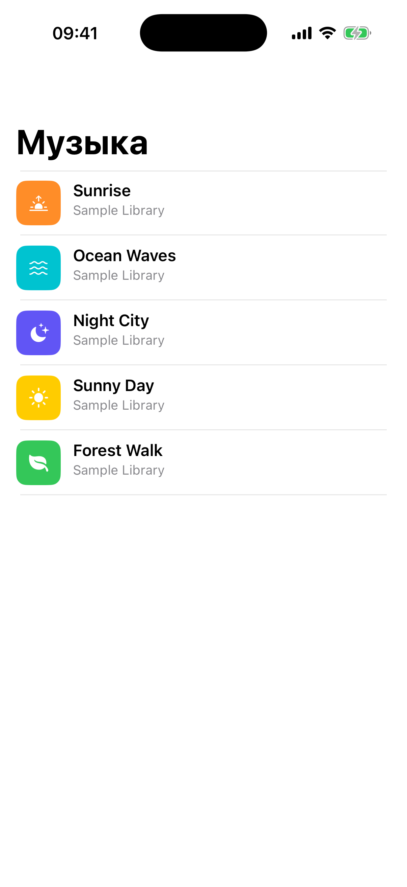

# Глава 17. Music Player — AVPlayer, mini-player → full sheet, haptic slider

{width=45%}

Музыкальный плеер собирает несколько важных тем: воспроизведение
аудио через `AVPlayer`, центральное состояние через singleton с
observer'ами, mini-player в углу экрана разворачивающийся в
полноэкранный «now playing», и кастомный slider с haptic-feedback'ом
при перетаскивании.

В этой главе разбираем всё, кроме плейлистов и поиска (это
расширение).

## 17.1 Треки — публичные mp3

Чтобы не возиться с бандлингом аудиофайлов в проект, мы используем
короткие публичные mp3 с **samplelib.com**:

```swift
struct Track: Hashable, Sendable {
    let id: String
    let title: String
    let artist: String
    let durationSeconds: TimeInterval
    let url: URL
    let coverColor: UIColor
    let symbol: String
}

enum MusicLibrary {
    static let tracks: [Track] = [
        Track(
            id: "1",
            title: "Sunrise",
            artist: "Sample Library",
            durationSeconds: 12,
            url: URL(string: "https://download.samplelib.com/mp3/sample-12s.mp3")!,
            coverColor: UIColor.systemOrange,
            symbol: "sunrise.fill"
        ),
        // ... ещё 4 трека
    ]
}
```

`coverColor` + `symbol` — вместо реальной обложки альбома. Делаем
цветной прямоугольник с SF Symbol'ом по центру. Это стандартный
fallback в реальных приложениях, когда обложки нет.

## 17.2 AVPlayer vs AVAudioPlayer

Apple предлагает два класса для воспроизведения:

- **`AVAudioPlayer`** — для **локальных** файлов. Просто, без сети.
  Не умеет стримить.
- **`AVPlayer`** — универсальный. Локальные, remote URL, video,
  audio. Чуть сложнее в использовании.

Мы берём `AVPlayer`, потому что наши mp3 — **удалённые**. Apple
рекомендует `AVAudioPlayer` для коротких локальных эффектов
(нотификации, UI sounds), а для всего остального — `AVPlayer`.

## 17.3 Singleton с state и observers

`MusicPlayer` — main-actor singleton:

```swift
@MainActor
final class MusicPlayer {
    static let shared = MusicPlayer()

    struct State {
        var current: Track?
        var isPlaying: Bool
        var progress: TimeInterval
        var duration: TimeInterval
    }

    private(set) var state = State(current: nil, isPlaying: false, progress: 0, duration: 0)

    private var player: AVPlayer?
    private var timeObserver: Any?
    private var subscribers: [(State) -> Void] = []

    private init() {
        try? AVAudioSession.sharedInstance().setCategory(.playback, mode: .default)
        try? AVAudioSession.sharedInstance().setActive(true)
    }
}
```

`AVAudioSession.setCategory(.playback)` — критически важная строка.
Без неё:

- На устройстве **в беззвучном режиме** музыка не играет.
- При свёрнутом приложении iOS останавливает воспроизведение.

`.playback` категория говорит iOS: «я музыкальный плеер, играю даже в
mute, играю в фоне, миксуюсь с другим аудио». После этой настройки
плеер ведёт себя как Apple Music или Spotify.

> 💡 **Audio Session категории**. Apple даёт 6 категорий. `.ambient`
> — для фона игр (микшируется с Apple Music), `.soloAmbient` —
> прерывает Apple Music, `.playback` — продакшен-музыкальный, `.record`
> — голосовая запись, `.playAndRecord` — VoIP. Каждая со своими
> правилами silent-режима и background'а. Для music app — почти
> всегда `.playback`.

## 17.4 Subscribers — реактивная отдача State

UI элементы (mini-player, NowPlaying, ячейки списка) хотят знать
**текущее состояние**. Реактивный паттерн:

```swift
func subscribe(_ handler: @escaping (State) -> Void) {
    subscribers.append(handler)
    handler(state)
}

private func notify() {
    subscribers.forEach { $0(state) }
}
```

Subscribe сразу даёт текущее состояние — подписчик получает initial
снимок (например, `current: nil, isPlaying: false`). Так UI правильно
рендерится при первом показе, не дожидаясь первого изменения.

`notify()` — после каждой мутации state. Простой broadcast всем
подписчикам.

> ⚠ **Нет unsubscribe**. У нас простой playground; для production
> сделай возврат токена и `unsubscribe(_:)`. Иначе при перезаходе в
> mini-app subscribers'ы накапливаются.

## 17.5 Play / Pause / Skip

```swift
func play(_ track: Track) {
    if state.current?.id != track.id {
        loadTrack(track)
    }
    player?.play()
    state.isPlaying = true
    notify()
}

func pause() {
    player?.pause()
    state.isPlaying = false
    notify()
}

func toggle() {
    guard let _ = state.current else { return }
    state.isPlaying ? pause() : (player?.play(), state.isPlaying = true).0
    notify()
}

func skipForward() {
    guard let current = state.current,
          let index = MusicLibrary.tracks.firstIndex(where: { $0.id == current.id }) else { return }
    let next = MusicLibrary.tracks[(index + 1) % MusicLibrary.tracks.count]
    play(next)
}
```

`play(_:)` — если трек изменился, перезагружаем. Если тот же —
просто играем (это case «пауза → play на том же треке»).

`toggle()` — тернарка с tuple `.0` — компактный switch между
`pause()` и «продолжить играть». Не самый чистый стиль, но
работает; в production написал бы явный if/else.

`skipForward` / `skipBackward` — циклические. С последнего трека —
на первый. С первого назад — на последний (через `(index == 0 ?
count - 1 : index - 1)`).

## 17.6 `loadTrack` — конфигурация AVPlayer

```swift
private func loadTrack(_ track: Track) {
    if let timeObserver { player?.removeTimeObserver(timeObserver) }
    let item = AVPlayerItem(url: track.url)
    let newPlayer = AVPlayer(playerItem: item)
    player = newPlayer
    state.current = track
    state.duration = track.durationSeconds
    state.progress = 0

    let interval = CMTime(seconds: 0.1, preferredTimescale: 600)
    timeObserver = newPlayer.addPeriodicTimeObserver(forInterval: interval, queue: .main) { [weak self] time in
        guard let self else { return }
        self.state.progress = CMTimeGetSeconds(time)
        self.notify()
    }
    NotificationCenter.default.addObserver(self,
                                           selector: #selector(handlePlaybackFinished),
                                           name: .AVPlayerItemDidPlayToEndTime,
                                           object: item)
}
```

Что здесь:

1. **`removeTimeObserver`** — критично! Если оставить старый observer
   при создании нового player'а, придут двойные callback'и, или
   крах при попытке найти observer'а на старом player'е.
2. **`AVPlayerItem(url:)`** — оборачиваем URL в item.
3. **`AVPlayer(playerItem:)`** — создаём player с этим item'ом.
4. **TimeObserver** — `addPeriodicTimeObserver(forInterval:queue:)`
   — даёт callback каждые `interval`. У нас 100ms (`0.1` секунды),
   `preferredTimescale: 600` — стандарт для аудио.
5. **End notification** — `AVPlayerItemDidPlayToEndTime` — когда трек
   доиграл. Мы автоматически переходим на следующий.

`CMTimeGetSeconds(time)` — конвертирует `CMTime` в `Double`. CMTime —
рациональное число `(value, timescale)`, удобно для precise audio
timing.

## 17.7 Seek — перемотка

```swift
func seek(to seconds: TimeInterval) {
    let time = CMTime(seconds: seconds, preferredTimescale: 600)
    player?.seek(to: time)
    state.progress = seconds
    notify()
}
```

Прыжок на заданную позицию. UI сразу обновляет `state.progress` (для
немедленного отклика на slider), потом TimeObserver подтвердит.

`CMTime(seconds:preferredTimescale:)` — конвертация обратно. `600` —
делится на 24, 25, 30, 60 (типичные framerate'ы), потому Apple его
рекомендует.

## 17.8 MusicLibraryViewController — список + mini-player

Главный экран — `UITableView` с треками. Внизу — mini-player, который
появляется, когда что-то играет:

```swift
override func viewDidLoad() {
    super.viewDidLoad()
    setupTable()
    setupMiniPlayer()
    MusicPlayer.shared.subscribe { [weak self] state in
        self?.miniPlayer.apply(state: state)
        self?.miniPlayer.isHidden = state.current == nil
    }
}
```

`apply(state:)` обновляет UI mini-player'а:

```swift
func apply(state: MusicPlayer.State) {
    if let track = state.current {
        coverView.backgroundColor = track.coverColor
        symbolView.image = UIImage(systemName: track.symbol)
        titleLabel.text = "\(track.title) · \(track.artist)"
        progressBar.progress = state.duration > 0 ? Float(state.progress / state.duration) : 0
        playButton.setImage(UIImage(systemName: state.isPlaying ? "pause.fill" : "play.fill"), for: .normal)
    }
}
```

Mini-player — `UIView` с обложкой, названием и кнопкой play/pause. Тап
по нему — открывает NowPlaying. Тап по play — toggle.

`isHidden = state.current == nil` — пока ничего не выбрано, mini-player
не показывается.

## 17.9 NowPlaying — sheet с детентами

```swift
private func presentNowPlaying() {
    let vc = NowPlayingViewController()
    let nav = UINavigationController(rootViewController: vc)
    nav.modalPresentationStyle = .pageSheet
    if let sheet = nav.sheetPresentationController {
        sheet.detents = [.large()]
        sheet.prefersGrabberVisible = true
    }
    present(nav, animated: true)
}
```

`detents = [.large()]` — только полноэкранный режим. Можно было бы
дать `[.medium(), .large()]` (стянуть до половины), но для now-playing
half-detent неудобен — половину экрана занимает обложка и слайдер.

`prefersGrabberVisible = true` — серая полоска сверху для понятного
«потяни вниз чтобы закрыть».

## 17.10 HapticSlider — UISlider с тактильной отдачей

```swift
final class HapticSlider: UISlider {
    private let haptic = UIImpactFeedbackGenerator(style: .light)
    private var lastTick: Float = 0

    override init(frame: CGRect) {
        super.init(frame: frame)
        addTarget(self, action: #selector(check), for: .valueChanged)
    }

    @objc private func check() {
        let bucket = (value * 20).rounded()
        if bucket != lastTick {
            haptic.impactOccurred(intensity: 0.5)
            lastTick = bucket
        }
    }
}
```

Что здесь:

- `value * 20` — делим всю шкалу [0..1] на 20 секций (по 5%).
- `.rounded()` — округляем до целого: 0, 1, 2, ..., 20.
- Если `bucket` изменился — даём тактильный «щелчок». Получается
  ощущение «крутишь регулятор с засечками».

Без `lastTick` мы бы триггерили haptic на **каждый** event valueChanged
— это может быть 60 раз в секунду при перетаскивании. Лишние
вибрации.

`intensity: 0.5` — половина силы. Полная (1.0) слишком сильно для
непрерывного перетаскивания.

> 💡 **Generator переиспользование.** Apple советует **прогревать**
> haptic engine через `prepare()` перед использованием, но в нашем
> сценарии (slider — юзер сначала тапает в него, потом тащит) первый
> haptic стоит дешевле, чем preparation lag. Если бы делали
> haptic-on-button-tap для редкого события — `prepare()` обязательно.

## 17.11 Scrubbing — слайдер играет с player'ом

В `NowPlayingViewController`:

```swift
slider.addTarget(self, action: #selector(scrubbingChanged), for: .valueChanged)
slider.addTarget(self, action: #selector(scrubbingStarted), for: .touchDown)
slider.addTarget(self, action: #selector(scrubbingEnded), for: [.touchUpInside, .touchUpOutside, .touchCancel])

@objc private func scrubbingStarted() { isUserScrubbing = true }

@objc private func scrubbingChanged() {
    let value = TimeInterval(slider.value) * MusicPlayer.shared.state.duration
    elapsedLabel.text = format(seconds: value)
}

@objc private func scrubbingEnded() {
    isUserScrubbing = false
    let value = TimeInterval(slider.value) * MusicPlayer.shared.state.duration
    MusicPlayer.shared.seek(to: value)
}
```

Три фазы:

1. **touchDown** — поставили палец на ползунок. `isUserScrubbing =
   true`. Это нужно, чтобы НЕ обновлять `slider.value` из
   subscribe'а (иначе слайдер «прыгал» бы между пользовательским и
   реальным positions).
2. **valueChanged** — таскаешь. Показываем юзеру **предполагаемое**
   время через `elapsedLabel`, **но не seek'аем** (это было бы
   тормозно).
3. **touchUp** — отпустили. `isUserScrubbing = false`, теперь делаем
   реальный `seek(to:)`.

Apply state:

```swift
private func apply(state: MusicPlayer.State) {
    if !isUserScrubbing {
        slider.value = state.duration > 0 ? Float(state.progress / state.duration) : 0
    }
    // ...
}
```

Только если **не идёт** user scrubbing — обновляем slider. Иначе
оставляем как есть, юзер контролирует.

## 17.12 Auto-next через NotificationCenter

```swift
NotificationCenter.default.addObserver(self,
                                       selector: #selector(handlePlaybackFinished),
                                       name: .AVPlayerItemDidPlayToEndTime,
                                       object: item)

@objc private func handlePlaybackFinished() {
    skipForward()
}
```

`AVPlayerItemDidPlayToEndTime` — стандартная iOS-нотификация. Зовётся,
когда трек **доиграл до конца**. Мы автоматом включаем следующий.

`object: item` важно — без этого ловили бы окончание **любого**
playerItem'а. С `object` — только нашего конкретного.

## 17.13 Бытовая аналогия

`MusicPlayer.shared` — это **диджей за пультом**. Знает, какая
пластинка крутится, на какой секунде, играет или нет. Меняет
пластинки командами (`play`, `pause`, `skipForward`).

`subscribers` — **колонки**, которые слушают пульт. У каждой колонки
есть свой плакат «сейчас играет такая-то песня», и при изменении на
пульте плакаты обновляются (mini-player, now-playing экран).

Слайдер — это **виниловый jog wheel**. Жмёшь, крутишь — пластинка
двигается. Отпустил — играет с этого места. Хептик-засечки — словно
есть физические углубления на дороге, чтобы ощущать движение.

## 17.14 Что мы пропустили

- **Lockscreen контролы** — `MPNowPlayingInfoCenter` и
  `MPRemoteCommandCenter`. Когда играет музыка, на экране блокировки
  должны быть кнопки play/pause/skip и обложка. Без этого приложение
  не выглядит «по-настоящему музыкальным».
- **AirPlay** — `AVRoutePickerView`, picker аудио-выхода. Особенно
  важно для подкастов.
- **Crossfade** между треками — постепенный fade-out предыдущего
  одновременно с fade-in следующего.
- **Equalizer** — `AVAudioUnit` с filters.
- **Visualizer** — анимация в такт музыке. Используется CADisplayLink
  + sampling из аудио.
- **Lyrics** — синхронизированные тексты песен (Apple Music Lyrics,
  LRC format).

> 🛠 **Упражнение.** Запусти Музыкальный плеер. Тапни любой трек —
> начнётся (короткий, 3-12 секунд). Снизу появится mini-player. Тапни
> по нему — откроется NowPlaying в sheet'е. Покрути слайдер пальцем
> — почувствуй хептик-щелчки каждые 5%. Отпусти — звук перейдёт на
> новую позицию. Когда трек закончится — автоматом включится
> следующий.

## 📋 Что мы выучили

- `AVPlayer` для удалённых mp3 (вместо `AVAudioPlayer` для локальных).
- `AVAudioSession.setCategory(.playback)` — обязательно для
  музыки. Иначе не играет в mute и в фоне.
- Singleton с `State struct` + subscribers — простой реактивный
  паттерн без Combine.
- `addPeriodicTimeObserver(forInterval:queue:)` — callback на каждом
  тике (у нас 100ms). При смене player'а — `removeTimeObserver`.
- `AVPlayerItemDidPlayToEndTime` нотификация для авто-перехода на
  следующий трек.
- `CMTime(seconds:preferredTimescale: 600)` — стандарт для audio
  seek.
- Mini-player: `UIView` поверх tableView, привязан к safeArea bottom.
  Скрыт когда нет current track.
- NowPlaying — `UISheetPresentationController` с `[.large()]`
  детентом.
- Scrubbing flow: `touchDown` ставит `isUserScrubbing`,
  `valueChanged` обновляет UI без seek'а, `touchUp` делает seek.
- В `apply(state:)` — НЕ перезаписываем slider.value, если идёт
  scrubbing.
- HapticSlider — `valueChanged` → проверка bucket'а → `impactOccurred`
  каждые 5% движения.

→ [Глава 18. Chat — двусторонние ячейки, keyboardLayoutGuide, typing indicator](./26-chat.md)
