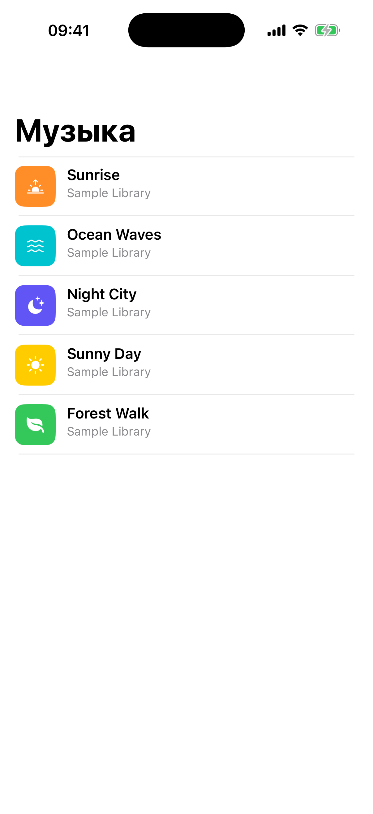

# Глава 17. Music Player — AVPlayer, mini-player → full sheet, haptic slider

{width=45%}

Музыкальный плеер собирает несколько важных тем сразу:
воспроизведение звука по сети через `AVPlayer`, аудиосессию (как
приложение договаривается с системой о звуке), одно общее состояние
плеера, на которое подписаны несколько экранов, маленький плеер внизу
списка (mini-player), который открывается в полноэкранный «Сейчас
играет», и ползунок перемотки с тактильными щелчками.

Что строим:

```
┌──────────────────────────┐        ┌──────────────────────────┐
│ Музыка                   │        │          ▬▬              │ ← «ручка» листа
│ ■ Sunrise         0:03   │        │   ┌──────────────────┐   │
│ ■ City Lights     0:06 * │        │   │ цветная обложка  │   │
│ ■ Rain            0:09   │        │   └──────────────────┘   │
│ ■ Mountains       0:12   │  тап   │        City Lights       │
│ ■ Night Drive     0:15   │ ─────▶ │      Sample Library      │
│                          │        │  ●━━━━━━━━○────────────  │ ← HapticSlider
├──────────────────────────┤        │  0:02              -0:04 │
│ ■ City Lights · …    ||  │        │     ◀◀     ||     ▶▶     │
└──────────────────────────┘        └──────────────────────────┘
   mini-player (* — играет)            NowPlayingViewController
```

Файлы:

```
Apps/Music/
├── Track.swift                       ← модель трека и библиотека
├── MusicPlayer.swift                 ← единственный плеер + состояние
├── TimeFormat.swift                  ← 75 секунд → "1:15"
├── CoverView.swift                   ← «обложка»: цвет + SF Symbol
├── MiniPlayerView.swift              ← полоска внизу списка
├── MusicLibraryViewController.swift  ← список треков
├── HapticSlider.swift                ← ползунок с щелчками
└── NowPlayingViewController.swift    ← полноэкранный плеер
```

> **Режим сборки** — как во введении: Swift 6, `Default Actor
> Isolation = MainActor`, iOS 15+. Код, который AVFoundation вызывает
> «со стороны», мы явно возвращаем на главный поток — в разделе 17.6
> видно, как и почему.

## 17.1 Треки — публичные mp3

Чтобы не класть аудиофайлы в проект, берём короткие публичные mp3 с
сервиса **samplelib.com**. У него есть файлы длиной 3, 6, 9, 12 и 15
секунд с предсказуемыми адресами (мы проверили: все пять отвечают, от
52 КБ до 307 КБ).

```swift
import UIKit

struct Track: Hashable {
    let id: String
    let title: String
    let artist: String
    let durationSeconds: TimeInterval
    let url: URL
    let coverColor: UIColor
    let symbol: String
}

enum MusicLibrary {
    static let tracks: [Track] = [
        makeTrack(id: "1", title: "Sunrise", seconds: 3, color: .systemOrange, symbol: "sunrise.fill"),
        makeTrack(id: "2", title: "City Lights", seconds: 6, color: .systemIndigo, symbol: "building.2.fill"),
        makeTrack(id: "3", title: "Rain", seconds: 9, color: .systemTeal, symbol: "cloud.rain.fill"),
        makeTrack(id: "4", title: "Mountains", seconds: 12, color: .systemGreen, symbol: "mountain.2.fill"),
        makeTrack(id: "5", title: "Night Drive", seconds: 15, color: .systemPurple, symbol: "moon.stars.fill"),
    ]

    private static func makeTrack(id: String, title: String, seconds: Int,
                                  color: UIColor, symbol: String) -> Track {
        // URL собран из проверенного шаблона без пробелов и спецсимволов,
        // поэтому `!` здесь не выстрелит.
        Track(id: id,
              title: title,
              artist: "Sample Library",
              durationSeconds: TimeInterval(seconds),
              url: URL(string: "https://download.samplelib.com/mp3/sample-\(seconds)s.mp3")!,
              coverColor: color,
              symbol: symbol)
    }
}
```

`coverColor` + `symbol` — замена настоящей обложки: цветной квадрат с
SF Symbol по центру. SF Symbols — встроенная в iOS библиотека значков,
которые берутся по имени (`UIImage(systemName: "sunrise.fill")`) и
масштабируются вместе со шрифтом. Такая «обложка» — обычный запасной
вариант (fallback) в настоящих приложениях, когда картинки нет.

`durationSeconds` — длительность, которую мы знаем заранее. Она нужна,
чтобы показать длину трека в списке ещё до загрузки. Когда плеер
прочитает настоящую длительность файла, мы подменим её (17.6).

Фабричный метод `makeTrack` убирает повтор: адрес строится из числа
секунд, и опечатка в одном из пяти URL становится невозможной. Это
единственное место главы, где стоит `!`: строка собрана из шаблона, в
котором нет символов, запрещённых в URL.

## 17.2 AVPlayer vs AVAudioPlayer

Apple даёт два класса для воспроизведения звука:

- **`AVAudioPlayer`** (фреймворк AVFAudio) играет файл, который уже
  лежит на устройстве, или данные в памяти. Потоковое воспроизведение
  по сети он не умеет: сначала скачай файл целиком.
- **`AVPlayer`** (AVFoundation) играет и локальные файлы, и адреса в
  сети, начиная воспроизведение до окончания загрузки. Он же играет
  видео и потоки HLS.

Наши mp3 лежат в сети, поэтому берём `AVPlayer`. `AVAudioPlayer`
удобен, когда файлы в приложении: у него проще интерфейс (громкость,
повтор, уровни звука). А для совсем коротких звуков интерфейса
(щелчок, «дзынь») есть ещё более лёгкий путь —
`AudioServicesPlaySystemSound`.

## 17.3 Один плеер на всё приложение и аудиосессия

`MusicPlayer` — синглтон (singleton — класс с единственным общим
экземпляром `shared`). Плеер должен быть один: если каждый экран
заведёт свой `AVPlayer`, два трека заиграют одновременно.

```swift
import AVFoundation

@MainActor
final class MusicPlayer {
    static let shared = MusicPlayer()

    struct State {
        var current: Track?
        var isPlaying = false
        var progress: TimeInterval = 0
        var duration: TimeInterval = 0
    }

    private(set) var state = State()

    private let player = AVPlayer()
    private var timeObserver: Any?
    private var endObserver: NSObjectProtocol?
    private var observers: [(State) -> Bool] = []
    private var isSessionActive = false

    private init() {
        do {
            try AVAudioSession.sharedInstance().setCategory(.playback, mode: .default)
        } catch {
            print("Не удалось настроить аудиосессию: \(error)")
        }
        let interval = CMTime(seconds: 0.25, preferredTimescale: 600)
        timeObserver = player.addPeriodicTimeObserver(forInterval: interval, queue: .main) { [weak self] time in
            MainActor.assumeIsolated {
                self?.handleTick(time)
            }
        }
    }
}
```

**`State`** — всё, что нужно экранам: какой трек, играет ли, на какой
секунде и какая длина. Экраны не лезут в `AVPlayer` сами, они получают
готовый снимок состояния. `private(set)` — читать `state` может любой,
менять — только сам плеер.

**Один `AVPlayer` на всю жизнь.** Можно создавать новый `AVPlayer` на
каждый трек и каждый раз переставлять наблюдатель времени, но проще один раз создать плеер и менять в нём трек через
`replaceCurrentItem(with:)` (17.6). Наблюдатель времени тогда тоже
ставится один раз, в `init`, и его не нужно снимать — плеер живёт,
пока живёт приложение.

**`private init()`** — никто, кроме самого класса, не создаст второй
экземпляр. Все пользуются `MusicPlayer.shared`.

### Аудиосессия

Аудиосессия (`AVAudioSession`) — посредник между приложением и
системой звука iOS. Через неё приложение сообщает, **зачем** ему звук,
а система решает, как с ним обращаться: глушить ли переключателем
«Без звука», останавливать ли при блокировке экрана, приглушать ли
музыку из другого приложения. Приложения делят один динамик, и
аудиосессия — их договор о правилах.

По умолчанию (категория `.soloAmbient`) звук приложения глушится
переключателем «Без звука» и замолкает при блокировке экрана — так
документация Apple описывает поведение по умолчанию. Для плеера это не
годится.

`setCategory(.playback)` говорит системе: «воспроизведение — главная
функция приложения». После этого:

- звук играет, даже если переключатель стоит на «Без звука»;
- при старте воспроизведения музыка других приложений
  останавливается. Чтобы играть поверх чужой музыки, нужна опция
  `.mixWithOthers`;
- **в фоне** (свёрнутое приложение, заблокированный экран) звук
  продолжит играть, **только если** у приложения включён фоновый режим
  Audio. Одной категории для этого мало — подробности в разделе 17.13.

> **Частое заблуждение** — что `.playback` сам по себе даёт игру в
> фоне. По документации Apple
> («Configuring your app for media playback») категория `.playback`
> лишь *позволяет* играть в фоне, если включён фоновый режим «Audio,
> AirPlay, and Picture in Picture». Без него звук остановится, как
> только приложение уйдёт в фон.

Категорий в `AVAudioSession` семь (так в заголовках SDK):

| Категория | Для чего | «Без звука» | Чужая музыка |
|---|---|---|---|
| `.ambient` | фоновые звуки игры, «дождь» | глушит | играет вместе |
| `.soloAmbient` | по умолчанию | глушит | останавливает |
| `.playback` | музыка, подкасты, видео | не глушит | останавливает (или `.mixWithOthers`) |
| `.record` | только запись | — | останавливает |
| `.playAndRecord` | звонки, голосовые сообщения | не глушит | останавливает |
| `.multiRoute` | вывод на несколько устройств сразу | не глушит | останавливает |
| `.audioProcessing` | устарела в iOS 10 | — | — |

Для музыкального плеера почти всегда `.playback`.

**Когда активировать сессию.** В `init` мы только задаём категорию, а
`setActive(true)` откладываем до первого нажатия «играть» (метод
`activateSessionIfNeeded` в 17.5). Apple советует именно так:
активная сессия с категорией `.playback` останавливает музыку других
приложений. Если активировать её при создании плеера, музыка
пользователя оборвётся просто от того, что он открыл наш экран, ничего
не нажав.

### Периодический наблюдатель времени

`addPeriodicTimeObserver(forInterval:queue:using:)` вызывает замыкание
каждые `interval` времени воспроизведения, а ещё когда воспроизведение
стартует, останавливается или время прыгает (перемотка). Интервал
0,25 секунды — четыре обновления в секунду: этого хватает, чтобы
полоса прогресса двигалась плавно, а счётчик «0:03» не опаздывал.

**`CMTime`** — время в AVFoundation. Это не число секунд, а дробь:
`value / timescale`. `CMTime(seconds: 0.25, preferredTimescale: 600)`
хранит 150/600 — ровно четверть секунды, без ошибок округления, как у
`Double`. Число 600 выбрано потому, что делится на 24, 25, 30 и 60 —
типичные частоты кадров видео, и любой кадр выражается в нём целым
числом. Для звука подошло бы и другое, но 600 — привычный выбор.

**`MainActor.assumeIsolated`.** Замыкание наблюдателя AVFoundation
объявляет как `@Sendable` — его разрешено вызывать из любого потока.
Компилятор не знает, что мы передали `queue: .main`, и не пускает к
`state` (он живёт на main actor). Если обратиться к `self.state` прямо
в замыкании, Swift 6 выдаст предупреждения
«main actor-isolated property 'state' can not be mutated from a
Sendable closure». `MainActor.assumeIsolated { }` говорит: «я
гарантирую, что мы уже на главном потоке, пусти». Гарантия
проверяется во время выполнения: если однажды замыкание придёт с
другого потока, приложение остановится с понятной ошибкой, а не
испортит данные молча. Такое обещание честно, потому что мы сами
передали `queue: .main`.

## 17.4 Подписчики — как экраны узнают о переменах

Mini-player, экран «Сейчас играет» и список треков хотят знать
текущее состояние. Делаем простую подписку: экран передаёт замыкание,
плеер вызывает его при каждом изменении.

```swift
import AVFoundation

extension MusicPlayer {
    /// Подписывает `owner` на изменения. Подписка живёт, пока жив `owner`:
    /// как только он освобождён из памяти, обработчик сам выпадает из списка.
    func observe<Owner: AnyObject>(_ owner: Owner, _ handler: @escaping (Owner, State) -> Void) {
        let entry: (State) -> Bool = { [weak owner] state in
            guard let owner else { return false }
            handler(owner, state)
            return true
        }
        _ = entry(state)
        observers.append(entry)
    }

    func notify() {
        observers = observers.filter { $0(state) }
    }
}
```

Этот код живёт в том же файле `MusicPlayer.swift`, что и класс, поэтому
расширение видит `private`-свойства вроде `observers`.

**Почему нужна отписка.** Представь `subscribe(_ handler:)` без
отписки. Каждый раз, когда пользователь открывает «Сейчас играет», в
массив добавлялся бы новый обработчик и не уходил никогда. Хуже
того: если обработчик держит экран сильной ссылкой, закрытый экран не
освобождается из памяти.

**Как устроено у нас.** Подписчик передаёт себя (`owner`) и
обработчик, который получает этого `owner` параметром:

<!-- no-check -->
```swift
MusicPlayer.shared.observe(self) { vc, state in
    vc.apply(state: state)
}
```

Внутри плеер держит `owner` **слабо** (`[weak owner]`). Обработчику не
нужно писать `[weak self]`: `vc` приходит параметром, а не
захватывается. Когда экран закрыт и освобождён, `owner` становится
`nil`, обёртка возвращает `false`, и `notify()` выкидывает её из списка
(`filter` оставляет только те, что вернули `true`). Отписываться
вручную не нужно — и забыть отписаться невозможно.

Почему не отписка в `deinit`? В Swift 6 `deinit` у класса на main
actor не изолирован: из него нельзя вызвать метод плеера. Изолированный
`isolated deinit` появился в Swift 6.2, но требует iOS 18.4 и новее,
а у нас iOS 15. Слабая ссылка обходит проблему целиком.

**`_ = entry(state)`** — новый подписчик сразу получает текущее
состояние. Экран открылся посреди трека — и сразу показывает правильное
название и позицию, не дожидаясь очередного тика.

## 17.5 Play / Pause / Skip

```swift
import AVFoundation

extension MusicPlayer {
    func play(_ track: Track) {
        if state.current?.id != track.id {
            load(track)
        }
        resume()
    }

    func pause() {
        player.pause()
        state.isPlaying = false
        notify()
    }

    func toggle() {
        guard state.current != nil else { return }
        if state.isPlaying { pause() } else { resume() }
    }

    func skipForward() {
        step(by: 1)
    }

    func skipBackward() {
        // Как в «Музыке»: если трек играет дольше 3 секунд — сначала в его начало.
        if state.progress > 3 {
            seek(to: 0)
        } else {
            step(by: -1)
        }
    }

    private func resume() {
        guard state.current != nil else { return }
        activateSessionIfNeeded()
        player.play()
        state.isPlaying = true
        notify()
    }

    private func activateSessionIfNeeded() {
        guard !isSessionActive else { return }
        do {
            try AVAudioSession.sharedInstance().setActive(true)
            isSessionActive = true
        } catch {
            print("Аудиосессия не активировалась: \(error)")
        }
    }

    private func step(by offset: Int) {
        let tracks = MusicLibrary.tracks
        guard let current = state.current,
              let index = tracks.firstIndex(where: { $0.id == current.id }) else { return }
        let target = (index + offset + tracks.count) % tracks.count
        play(tracks[target])
    }
}
```

- **`play(_:)`** загружает трек, только если он другой. Тап по уже
  играющему треку не начинает его сначала.
- **`toggle()`** — пауза или продолжение. Общая часть «продолжить»
  вынесена в `resume()`, чтобы `play` и `toggle` не дублировали код.
- **`skipBackward()`** ведёт себя как системная «Музыка»: первое
  нажатие «назад» после третьей секунды возвращает в начало трека, и
  только в первые три секунды переключает на предыдущий.

**`step(by:)` и остаток от деления.** Переход по кругу: с последнего
трека вперёд — на первый, с первого назад — на последний. Формула
`(index + offset + count) % count` на числах, треков 5:

- вперёд с последнего: (4 + 1 + 5) % 5 = 10 % 5 = 0 — первый трек;
- назад с первого: (0 − 1 + 5) % 5 = 4 % 5 = 4 — последний;
- вперёд со второго: (1 + 1 + 5) % 5 = 7 % 5 = 2 — третий.

Зачем прибавлять `count`? В Swift остаток от отрицательного числа
отрицательный: `-1 % 5` равно `-1`, и индекс −1 уронил бы приложение.
Прибавка пяти делает число неотрицательным, а на результат деления по
кругу не влияет.

## 17.6 `load` — смена трека

```swift
import AVFoundation

extension MusicPlayer {
    private func load(_ track: Track) {
        if let endObserver {
            NotificationCenter.default.removeObserver(endObserver)
        }
        let item = AVPlayerItem(url: track.url)
        player.replaceCurrentItem(with: item)

        state.current = track
        state.duration = track.durationSeconds
        state.progress = 0

        endObserver = NotificationCenter.default.addObserver(
            forName: AVPlayerItem.didPlayToEndTimeNotification,
            object: item,
            queue: .main
        ) { [weak self] _ in
            MainActor.assumeIsolated {
                self?.skipForward()
            }
        }
    }

    private func handleTick(_ time: CMTime) {
        guard state.current != nil else { return }
        state.progress = time.seconds
        if let itemDuration = player.currentItem?.duration.seconds,
           itemDuration.isFinite, itemDuration > 0 {
            state.duration = itemDuration
        }
        // Звонок, будильник, отключённые наушники ставят плеер на паузу
        // без нашего pause(). Сверяемся с самим плеером.
        state.isPlaying = player.timeControlStatus != .paused
        notify()
    }
}
```

1. **`AVPlayerItem(url:)`** — «что играть»: один конкретный файл со
   своим состоянием загрузки и длительностью. `AVPlayer` — «чем
   играть»: он умеет воспроизводить один item за раз.
2. **`replaceCurrentItem(with:)`** — поставить в тот же плеер другой
   трек. Старый item освобождается сам.
3. **Уведомление о конце трека.** `AVPlayerItem.didPlayToEndTimeNotification`
   приходит, когда трек доиграл. `object: item` — подписываемся только
   на **этот** item, иначе ловили бы окончание любого проигрывателя в
   приложении, например видео на соседнем экране.
4. **Снятие старого наблюдателя.** При смене трека прежнюю подписку
   убираем (`removeObserver`), и в каждый момент есть ровно одна.

**Почему наблюдатель на замыкании, а не селектор.** Привычная запись —
`addObserver(self, selector: #selector(...))`. Но документация
AVFoundation предупреждает, что уведомления плеера могут приходить на
другом потоке, а метод с `@objc` у нашего класса изолирован на main
actor. Версия с замыканием и `queue: .main` гарантирует доставку на
главную очередь, а `MainActor.assumeIsolated` объясняет это
компилятору — так же, как в 17.3.

**`handleTick`** — вызывается четыре раза в секунду:

- `time.seconds` — текущая позиция в секундах (`CMTime` → `Double`);
- `currentItem?.duration` — настоящая длина файла. Пока файл не
  начал загружаться, длина неизвестна, и `duration.seconds` равен
  `NaN` («не число»). Проверка `isFinite` отсекает это значение, а
  пока настоящей длины нет, работает наша `durationSeconds` из
  библиотеки;
- `timeControlStatus` — что плеер делает в действительности: `.playing`,
  `.paused` или `.waitingToPlayAtSpecifiedRate` (ждёт, пока догрузятся
  данные). Если позвонили по телефону, система поставит плеер на паузу
  сама, и без этой строки кнопка продолжала бы показывать «пауза», хотя
  музыка молчит. Ожидание загрузки мы считаем «играет»: пользователь
  нажал play, звук вот-вот пойдёт.

## 17.7 Seek — перемотка

```swift
import AVFoundation

extension MusicPlayer {
    func seek(to seconds: TimeInterval) {
        let time = CMTime(seconds: seconds, preferredTimescale: 600)
        player.seek(to: time, toleranceBefore: .zero, toleranceAfter: .zero)
        state.progress = seconds
        notify()
    }
}
```

`seek(to:)` без допусков разрешает плееру прыгнуть в ближайшую
удобную для декодера точку — для сжатого аудио это может быть на
долю секунды в стороне. `toleranceBefore: .zero, toleranceAfter:
.zero` — «ровно в эту точку». Точная перемотка чуть медленнее, но для
коротких mp3 разницы не заметно, а ползунок не отскакивает.

`state.progress = seconds` сразу, не дожидаясь плеера: интерфейс
показывает новую позицию мгновенно, а ближайший тик наблюдателя
подтвердит её. Если перемотка ещё не закончилась, первый тик может на
миг показать старую позицию — для нашего плеера это незаметно.

> **Упражнение 17.1.** Функция `formatPlaybackTime` (раздел 17.8)
> показывает время как «м:сс». Для подкаста на час с лишним «75:30»
> читается плохо. Напиши `formatLongPlaybackTime(_:)`, которая для
> 3725 секунд вернёт `"1:02:05"`, а для 75 секунд — по-прежнему
> `"1:15"`. Решение — в конце главы.

## 17.8 MusicLibraryViewController — список + mini-player

Сначала вспомогательные части: форматирование времени и «обложка».

```swift
import Foundation

/// 75.4 секунды → "1:15". Отрицательное и NaN показываем как "0:00".
func formatPlaybackTime(_ seconds: TimeInterval) -> String {
    guard seconds.isFinite, seconds > 0 else { return "0:00" }
    let total = Int(seconds.rounded(.down))
    return String(format: "%d:%02d", total / 60, total % 60)
}
```

75,4 секунды: отбрасываем дробную часть (`rounded(.down)`) — 75.
Минуты — целая часть от деления на 60: 75 / 60 = 1. Секунды — остаток:
75 % 60 = 15. Формат `%02d` дописывает ведущий ноль до двух цифр,
поэтому 5 секунд станут `05`, и получится `"1:05"`, а не `"1:5"`.
Проверка `isFinite` нужна из-за `NaN`, о котором шла речь в 17.6.

```swift
import UIKit

/// Цветной квадрат с SF Symbol по центру — замена настоящей обложки.
final class CoverView: UIView {
    private let symbolView = UIImageView()

    init(symbolPointSize: CGFloat) {
        super.init(frame: .zero)
        layer.cornerRadius = 8
        symbolView.tintColor = .white
        symbolView.contentMode = .scaleAspectFit
        symbolView.preferredSymbolConfiguration = UIImage.SymbolConfiguration(pointSize: symbolPointSize,
                                                                              weight: .semibold)
        symbolView.translatesAutoresizingMaskIntoConstraints = false
        addSubview(symbolView)
        NSLayoutConstraint.activate([
            symbolView.centerXAnchor.constraint(equalTo: centerXAnchor),
            symbolView.centerYAnchor.constraint(equalTo: centerYAnchor),
        ])
    }

    required init?(coder: NSCoder) { fatalError("init(coder:) не используется") }

    func apply(_ track: Track?) {
        backgroundColor = track?.coverColor ?? .systemGray4
        symbolView.image = UIImage(systemName: track?.symbol ?? "music.note")
    }
}
```

Один класс для обложки в mini-player (значок 18 pt) и на большом
экране (96 pt). `preferredSymbolConfiguration` задаёт размер и толщину
SF Symbol. `translatesAutoresizingMaskIntoConstraints = false` —
обязательная строка для любого вида, который мы расставляем
ограничениями (constraints) Auto Layout: иначе UIKit добавит свои
ограничения из старой системы «пружинок», и они конфликтуют с нашими.

Mini-player — полоска над нижним краем: обложка, название, кнопка
«играть/пауза» и тонкая полоса прогресса сверху.

```swift
import UIKit

final class MiniPlayerView: UIView {
    var onTap: (() -> Void)?

    private let coverView = CoverView(symbolPointSize: 18)
    private let titleLabel = UILabel()
    private let playButton = UIButton(type: .system)
    private let progressBar = UIProgressView(progressViewStyle: .bar)

    override init(frame: CGRect) {
        super.init(frame: frame)
        backgroundColor = .secondarySystemBackground

        titleLabel.font = .preferredFont(forTextStyle: .subheadline)
        titleLabel.adjustsFontForContentSizeCategory = true
        titleLabel.lineBreakMode = .byTruncatingTail

        playButton.addAction(UIAction { _ in MusicPlayer.shared.toggle() }, for: .touchUpInside)
        playButton.setPreferredSymbolConfiguration(UIImage.SymbolConfiguration(pointSize: 22),
                                                   forImageIn: .normal)

        let row = UIStackView(arrangedSubviews: [coverView, titleLabel, playButton])
        row.spacing = 12
        row.alignment = .center

        [row, progressBar].forEach {
            $0.translatesAutoresizingMaskIntoConstraints = false
            addSubview($0)
        }
        NSLayoutConstraint.activate([
            progressBar.topAnchor.constraint(equalTo: topAnchor),
            progressBar.leadingAnchor.constraint(equalTo: leadingAnchor),
            progressBar.trailingAnchor.constraint(equalTo: trailingAnchor),

            row.topAnchor.constraint(equalTo: progressBar.bottomAnchor, constant: 8),
            row.bottomAnchor.constraint(equalTo: bottomAnchor, constant: -8),
            row.leadingAnchor.constraint(equalTo: layoutMarginsGuide.leadingAnchor),
            row.trailingAnchor.constraint(equalTo: layoutMarginsGuide.trailingAnchor),

            coverView.widthAnchor.constraint(equalToConstant: 44),
            coverView.heightAnchor.constraint(equalToConstant: 44),
            playButton.widthAnchor.constraint(equalToConstant: 44),
            playButton.heightAnchor.constraint(equalToConstant: 44),
        ])

        addGestureRecognizer(UITapGestureRecognizer(target: self, action: #selector(tapped)))
        accessibilityHint = "Открывает полный плеер"
    }

    required init?(coder: NSCoder) { fatalError("init(coder:) не используется") }

    @objc private func tapped() { onTap?() }

    func apply(state: MusicPlayer.State) {
        guard let track = state.current else { return }
        coverView.apply(track)
        titleLabel.text = "\(track.title) · \(track.artist)"
        progressBar.progress = state.duration > 0 ? Float(state.progress / state.duration) : 0
        let symbol = state.isPlaying ? "pause.fill" : "play.fill"
        playButton.setImage(UIImage(systemName: symbol), for: .normal)
        playButton.accessibilityLabel = state.isPlaying ? "Пауза" : "Играть"
    }
}
```

- **Кнопка 44×44 точки** — минимальный размер области нажатия по
  рекомендациям Apple (HIG). Значок внутри меньше (22 pt), но пальцу
  есть куда попасть.
- **`setPreferredSymbolConfiguration(_:forImageIn:)`** — размер SF Symbol
  на кнопке. У `UIButton` это метод, а не свойство:
  присваивание `button.preferredSymbolConfigurationForImage = …` не
  скомпилируется.
- **Прогресс на числах:** трек 9 секунд, играет 4,5-я — 4,5 / 9 = 0,5,
  полоса заполнена наполовину. Деление только при `duration > 0`,
  иначе в самом начале вышло бы деление на ноль.
- **`layoutMarginsGuide`** — стандартные внутренние поля вида (layout
  margins, обычно 16 точек по бокам на iPhone). Контент не прилипает к
  краям экрана.
- **Жест на весь вид.** `UITapGestureRecognizer` на полоске открывает
  полный плеер. Нажатие на кнопку «пауза» до жеста не доходит: у
  `UIControl` своя обработка касаний, и жест родителя ей не мешает.
- **`accessibilityLabel`** у кнопки — что прочитает VoiceOver
  (экранный диктор для незрячих пользователей). Без него он прочитал
  бы имя картинки «pause.fill».

Экран списка:

```swift
import UIKit

final class MusicLibraryViewController: UIViewController {
    private let tableView = UITableView(frame: .zero, style: .plain)
    private let miniPlayer = MiniPlayerView()
    private let tracks = MusicLibrary.tracks
    private var playingTrackID: String?

    override func viewDidLoad() {
        super.viewDidLoad()
        title = "Музыка"
        view.backgroundColor = .systemBackground
        setupLayout()

        MusicPlayer.shared.observe(self) { vc, state in
            vc.miniPlayer.apply(state: state)
            vc.miniPlayer.isHidden = state.current == nil
            vc.updatePlayingMarker(state.current?.id)
        }
    }

    private func setupLayout() {
        tableView.dataSource = self
        tableView.delegate = self
        tableView.register(UITableViewCell.self, forCellReuseIdentifier: "TrackCell")

        miniPlayer.isHidden = true
        miniPlayer.onTap = { [weak self] in self?.presentNowPlaying() }

        // Стек сам «схлопывает» скрытый mini-player: таблица занимает его место.
        let stack = UIStackView(arrangedSubviews: [tableView, miniPlayer])
        stack.axis = .vertical
        stack.translatesAutoresizingMaskIntoConstraints = false
        view.addSubview(stack)
        NSLayoutConstraint.activate([
            stack.topAnchor.constraint(equalTo: view.topAnchor),
            stack.leadingAnchor.constraint(equalTo: view.leadingAnchor),
            stack.trailingAnchor.constraint(equalTo: view.trailingAnchor),
            stack.bottomAnchor.constraint(equalTo: view.safeAreaLayoutGuide.bottomAnchor),
        ])
    }

    private func updatePlayingMarker(_ id: String?) {
        guard id != playingTrackID else { return }
        let changed = [playingTrackID, id].compactMap { id in
            tracks.firstIndex { $0.id == id }.map { IndexPath(row: $0, section: 0) }
        }
        playingTrackID = id
        tableView.reloadRows(at: changed, with: .none)
    }

    private func presentNowPlaying() {
        let vc = NowPlayingViewController()
        vc.modalPresentationStyle = .pageSheet
        if let sheet = vc.sheetPresentationController {
            sheet.detents = [.large()]
            sheet.prefersGrabberVisible = true
        }
        present(vc, animated: true)
    }
}

extension MusicLibraryViewController: UITableViewDataSource, UITableViewDelegate {
    func tableView(_ tableView: UITableView, numberOfRowsInSection section: Int) -> Int {
        tracks.count
    }

    func tableView(_ tableView: UITableView, cellForRowAt indexPath: IndexPath) -> UITableViewCell {
        let cell = tableView.dequeueReusableCell(withIdentifier: "TrackCell", for: indexPath)
        let track = tracks[indexPath.row]
        var content = cell.defaultContentConfiguration()
        content.text = track.title
        content.secondaryText = "\(track.artist) · \(formatPlaybackTime(track.durationSeconds))"
        content.image = UIImage(systemName: track.symbol)
        content.imageProperties.tintColor = track.coverColor
        cell.contentConfiguration = content
        let isPlaying = track.id == playingTrackID
        cell.accessoryView = isPlaying ? UIImageView(image: UIImage(systemName: "speaker.wave.2.fill")) : nil
        cell.accessibilityValue = isPlaying ? "Сейчас играет" : nil
        return cell
    }

    func tableView(_ tableView: UITableView, didSelectRowAt indexPath: IndexPath) {
        tableView.deselectRow(at: indexPath, animated: true)
        MusicPlayer.shared.play(tracks[indexPath.row])
    }
}
```

**Вёрстка через `UIStackView`.** Таблица и mini-player лежат в
вертикальном стеке. У стека полезное свойство: скрытый
(`isHidden = true`) элемент не занимает места. Пока ничего не играет,
таблица тянется до низа. Появился трек — mini-player показывается, и
таблица сама укорачивается над ним. Если бы mini-player висел поверх
таблицы, последняя строка пряталась бы под ним.

Низ стека привязан к `safeAreaLayoutGuide.bottomAnchor` — к краю
безопасной зоны, над полоской «домой». Иначе кнопка mini-player
оказалась бы под системным жестом.

**Отметка играющего трека.** Список показывает значок динамика у
текущего трека. `updatePlayingMarker` перерисовывает только две строки
— ту, что перестала играть, и ту, что начала. Проверка `guard id !=
playingTrackID` важна: обработчик вызывается четыре раза в секунду, и
без неё мы бы перезагружали строки на каждом тике.

**Переиспользование ячеек.** В `cellForRowAt` `accessoryView`
выставляется в **обеих** ветках: значок или `nil`. Если бы мы только
ставили значок, ячейка, в которой он был, после переиспользования
показала бы динамик у чужого трека.

**`defaultContentConfiguration()`** (iOS 14+) — стандартная раскладка
ячейки: картинка, заголовок, подзаголовок. Заполняешь поля и
присваиваешь `cell.contentConfiguration`.

## 17.9 NowPlaying — лист с «ручкой»

`presentNowPlaying()` из листинга выше открывает полный плеер листом
(sheet — экран, который выезжает снизу и лежит поверх текущего):

- `modalPresentationStyle = .pageSheet` — стиль листа. На iPhone он
  почти во весь экран, сверху видно край предыдущего экрана; на iPad —
  карточка по центру.
- `sheetPresentationController` (iOS 15+) — настройки листа.
  `detents` — «фиксаторы», высоты, на которых лист может
  остановиться. `[.large()]` — только полная высота. Можно `[.medium(),
  .large()]`, и лист будет стоять на половине экрана, но для «Сейчас
  играет» половины мало: обложка и ползунок не помещаются.
- `prefersGrabberVisible = true` — серая «ручка» наверху листа,
  подсказка «потяни вниз, чтобы закрыть».

Контроллер не оборачиваем в `UINavigationController`: навигационная
панель на этом экране не нужна, поэтому показываем его напрямую.

## 17.10 HapticSlider — ползунок с тактильными щелчками

Haptics — тактильная отдача: короткие вибрации моторчика Taptic Engine,
которые ощущаются как щелчок. `UIImpactFeedbackGenerator` — генератор
«удара» заданной силы.

```swift
import UIKit

final class HapticSlider: UISlider {
    private let haptic = UIImpactFeedbackGenerator(style: .light)
    private var lastTick: Float = 0

    override init(frame: CGRect) {
        super.init(frame: frame)
        addTarget(self, action: #selector(valueDidChange), for: .valueChanged)
    }

    required init?(coder: NSCoder) { fatalError("init(coder:) не используется") }

    override func beginTracking(_ touch: UITouch, with event: UIEvent?) -> Bool {
        haptic.prepare()
        lastTick = tick(for: value)
        return super.beginTracking(touch, with: event)
    }

    private func tick(for value: Float) -> Float {
        let fraction = (value - minimumValue) / max(maximumValue - minimumValue, .ulpOfOne)
        return (fraction * 20).rounded()
    }

    @objc private func valueDidChange() {
        let current = tick(for: value)
        if current != lastTick {
            haptic.impactOccurred(intensity: 0.5)
            haptic.prepare()
            lastTick = current
        }
    }
}
```

**Засечки на числах.** Шкалу делим на 20 участков по 5%. `tick(for:)`
переводит положение ползунка в номер засечки: значение 0,37 — это 37%,
× 20 = 7,4, округляем — засечка 7. Сдвинул до 0,41: 8,2 → 8. Номер
сменился — щелчок. Для трека в 15 секунд одна засечка — это 15 × 5% =
0,75 секунды перемотки.

`fraction` пересчитывает значение в долю от 0 до 1 для любого
диапазона слайдера (не только 0…1). `max(..., .ulpOfOne)` — защита от
деления на ноль, если минимум и максимум вдруг совпадут (`.ulpOfOne` —
крошечное положительное число).

Без `lastTick` щелчок звучал бы на **каждое** событие `valueChanged`,
а при перетаскивании их приходит десятки в секунду — сплошное
жужжание вместо засечек.

**`beginTracking`** — UIKit вызывает его, когда палец лёг на ползунок.
Здесь запоминаем текущую засечку: иначе `lastTick` остался бы 0, и
первое же движение с середины шкалы дало бы лишний щелчок.

**`prepare()`** будит Taptic Engine: первый щелчок после паузы иначе
может прийти с заметной задержкой. Apple советует вызывать `prepare()`
незадолго до ожидаемого срабатывания — касание ползунка и есть такой
момент. После каждого щелчка зовём `prepare()` снова, потому что
очередной может понадобиться через долю секунды. Без `prepare()`
первый щелчок запаздывает.

`intensity: 0.5` — половина силы стиля `.light`. Полная сила при
частых щелчках утомляет.

`valueChanged` приходит только от **пальца**. Когда плеер сам двигает
`slider.value` (17.11), событие не отправляется и щелчков нет.

## 17.11 Scrubbing — перемотка ползунком

Scrubbing — перемотка «прокруткой» ползунка. Экран «Сейчас играет»
целиком:

```swift
import UIKit

final class NowPlayingViewController: UIViewController {
    private let coverView = CoverView(symbolPointSize: 96)
    private let titleLabel = UILabel()
    private let artistLabel = UILabel()
    private let slider = HapticSlider()
    private let elapsedLabel = UILabel()
    private let remainingLabel = UILabel()
    private let playButton = UIButton(type: .system)
    private var isUserScrubbing = false

    override func viewDidLoad() {
        super.viewDidLoad()
        view.backgroundColor = .systemBackground
        setupLayout()
        setupActions()
        MusicPlayer.shared.observe(self) { vc, state in
            vc.apply(state: state)
        }
    }

    private func setupLayout() {
        coverView.layer.cornerRadius = 16

        titleLabel.font = .preferredFont(forTextStyle: .title2)
        artistLabel.font = .preferredFont(forTextStyle: .body)
        artistLabel.textColor = .secondaryLabel
        for label in [titleLabel, artistLabel] {
            label.textAlignment = .center
            label.adjustsFontForContentSizeCategory = true
        }
        for label in [elapsedLabel, remainingLabel] {
            // Моноширинные цифры: "1:11" и "1:08" одной ширины, текст не дрожит.
            label.font = .monospacedDigitSystemFont(ofSize: 13, weight: .regular)
            label.textColor = .secondaryLabel
        }

        let times = UIStackView(arrangedSubviews: [elapsedLabel, UIView(), remainingLabel])

        let backButton = makeControlButton(symbol: "backward.fill", label: "Назад") {
            MusicPlayer.shared.skipBackward()
        }
        let forwardButton = makeControlButton(symbol: "forward.fill", label: "Вперёд") {
            MusicPlayer.shared.skipForward()
        }
        playButton.setPreferredSymbolConfiguration(UIImage.SymbolConfiguration(pointSize: 44),
                                                   forImageIn: .normal)
        playButton.addAction(UIAction { _ in MusicPlayer.shared.toggle() }, for: .touchUpInside)

        let controls = UIStackView(arrangedSubviews: [backButton, playButton, forwardButton])
        controls.distribution = .equalSpacing

        let stack = UIStackView(arrangedSubviews: [coverView, titleLabel, artistLabel, slider, times, controls])
        stack.axis = .vertical
        stack.spacing = 12
        stack.setCustomSpacing(24, after: coverView)
        stack.setCustomSpacing(24, after: artistLabel)
        stack.setCustomSpacing(24, after: times)
        stack.translatesAutoresizingMaskIntoConstraints = false
        view.addSubview(stack)

        NSLayoutConstraint.activate([
            stack.topAnchor.constraint(equalTo: view.safeAreaLayoutGuide.topAnchor, constant: 40),
            stack.leadingAnchor.constraint(equalTo: view.layoutMarginsGuide.leadingAnchor, constant: 16),
            stack.trailingAnchor.constraint(equalTo: view.layoutMarginsGuide.trailingAnchor, constant: -16),
            coverView.heightAnchor.constraint(equalTo: coverView.widthAnchor),
        ])
    }

    private func makeControlButton(symbol: String, label: String,
                                   action: @escaping () -> Void) -> UIButton {
        let button = UIButton(type: .system)
        button.setImage(UIImage(systemName: symbol), for: .normal)
        button.setPreferredSymbolConfiguration(UIImage.SymbolConfiguration(pointSize: 28),
                                               forImageIn: .normal)
        button.accessibilityLabel = label
        button.addAction(UIAction { _ in action() }, for: .touchUpInside)
        return button
    }

    private func setupActions() {
        slider.accessibilityLabel = "Позиция в треке"
        slider.addTarget(self, action: #selector(scrubbingStarted), for: .touchDown)
        slider.addTarget(self, action: #selector(scrubbingChanged), for: .valueChanged)
        slider.addTarget(self, action: #selector(scrubbingEnded),
                         for: [.touchUpInside, .touchUpOutside, .touchCancel])
    }

    @objc private func scrubbingStarted() {
        isUserScrubbing = true
    }

    @objc private func scrubbingChanged() {
        let duration = MusicPlayer.shared.state.duration
        let seconds = TimeInterval(slider.value) * duration
        elapsedLabel.text = formatPlaybackTime(seconds)
        remainingLabel.text = "-" + formatPlaybackTime(duration - seconds)
    }

    @objc private func scrubbingEnded() {
        isUserScrubbing = false
        let seconds = TimeInterval(slider.value) * MusicPlayer.shared.state.duration
        MusicPlayer.shared.seek(to: seconds)
    }

    private func apply(state: MusicPlayer.State) {
        coverView.apply(state.current)
        titleLabel.text = state.current?.title ?? "Ничего не играет"
        artistLabel.text = state.current?.artist
        let symbol = state.isPlaying ? "pause.circle.fill" : "play.circle.fill"
        playButton.setImage(UIImage(systemName: symbol), for: .normal)
        playButton.accessibilityLabel = state.isPlaying ? "Пауза" : "Играть"

        guard !isUserScrubbing else { return }
        slider.value = state.duration > 0 ? Float(state.progress / state.duration) : 0
        elapsedLabel.text = formatPlaybackTime(state.progress)
        remainingLabel.text = "-" + formatPlaybackTime(state.duration - state.progress)
    }
}
```

Перемотка идёт в три фазы:

1. **`touchDown`** — палец лёг на ползунок, `isUserScrubbing = true`.
   С этого момента `apply(state:)` не трогает ползунок и подписи
   времени (строка `guard !isUserScrubbing`). Иначе четыре раза в
   секунду плеер возвращал бы ползунок в текущую позицию, и он
   прыгал бы между пальцем и музыкой.
2. **`valueChanged`** — палец двигается. Показываем **будущее** время
   в подписях, но плеер не перематываем: перемотка на каждое движение
   дёргала бы звук и сеть.
3. **`touchUpInside` / `touchUpOutside` / `touchCancel`** — палец
   отпущен (над ползунком, мимо него, или касание прервал, например,
   входящий звонок). Снимаем флаг и делаем один настоящий `seek(to:)`.
   Если забыть `touchCancel`, флаг мог бы остаться `true` навсегда, и
   ползунок перестал бы двигаться.

**Время на числах.** Трек 9 секунд, ползунок на 0,6: 0,6 × 9 = 5,4
секунды. Слева «0:05», справа осталось 9 − 5,4 = 3,6 — «-0:03».

**Моноширинные цифры.** В обычном шрифте цифра «1» уже «8», и при
смене «0:11» на «0:18» подпись ширится и дёргается. `monospacedDigitSystemFont`
делает все цифры одной ширины.

**`coverView.heightAnchor == widthAnchor`** — обложка всегда
квадратная: ширину задаёт стек, высота равна ей.

`UIView()` посередине стека `times` — растягивающаяся «распорка»:
она занимает всё свободное место, прижимая подписи к краям.

> **Упражнение 17.2.** Добавь в плеер метод `jump(by:)`, который
> перематывает на заданное число секунд вперёд или назад, не выходя за
> начало и конец трека, и две кнопки «−15» и «+15» на экране
> «Сейчас играет» (SF Symbols `gobackward.15` и `goforward.15`).
> Проверка: на 12-секундном треке «+15» с 3-й секунды приводит в конец
> трека, а не за него; «−15» с 5-й секунды — в начало. Решение — в
> конце главы.

## 17.12 Автопереход и чужие паузы

Автопереход к очередному треку уже встроен в `load(_:)`: наблюдатель
`didPlayToEndTimeNotification` вызывает `skipForward()`. Трек
закончился — играет очередной, после последнего — снова первый.

Второй случай, о котором легко забыть, — пауза,
которую поставили без нас. Входящий звонок, будильник, Siri, отключённые
наушники: система останавливает воспроизведение сама, и наш
`pause()` не вызывается. Поэтому `handleTick` сверяет `isPlaying` с
`player.timeControlStatus` (17.6). Наблюдатель времени срабатывает и
при остановке воспроизведения, так что кнопка сменится на «играть»
сразу.

Возобновлять ли музыку после звонка — отдельное решение. Система
присылает `AVAudioSession.interruptionNotification` с флагом
«можно продолжить» (`.shouldResume`). Приложения-плееры обычно
продолжают, если флаг есть. Мы это пропустили, см. 17.15.

## 17.13 Фоновое воспроизведение — Background Modes

Пользователь включил трек и заблокировал экран. Чтобы звук не
оборвался, одной категории `.playback` мало (17.3). Приложению нужен
**фоновый режим** — разрешение системы продолжать работу в фоне ради
конкретной задачи.

В Xcode 26: выбери цель приложения → вкладка **Signing &
Capabilities** → кнопка **+ Capability** → **Background Modes** →
отметь **Audio, AirPlay, and Picture in Picture**. Capability
(«возможность») — функция системы, которую приложение явно
включает в настройках проекта. Xcode допишет в Info.plist ключ:

```xml
<key>UIBackgroundModes</key>
<array>
    <string>audio</string>
</array>
```

Этот режим разрешает жить в фоне, **пока играет звук**. Поставил на
паузу — через некоторое время система приостановит приложение, как
обычно. Правило App Store Review Guidelines 2.5.4 разрешает фоновые режимы
только по прямому назначению: приложение с режимом `audio` должно
действительно воспроизводить звук в фоне, иначе его могут отклонить.

Проверять фон удобнее на настоящем устройстве: включи трек, заблокируй
экран — музыка продолжает играть. Уберёшь галочку — музыка замолчит
при блокировке.

Кнопки управления на экране блокировки при этом **не появятся** сами:
для них нужны `MPNowPlayingInfoCenter` (название, обложка, позиция) и
`MPRemoteCommandCenter` (реакция на play/pause/перемотку с экрана
блокировки и наушников). Это в списке пропущенного.

## 17.14 Бытовая аналогия

`MusicPlayer.shared` — **диджей за пультом**. Он знает, какая
пластинка крутится, на какой секунде и играет ли она. Команды
`play`, `pause`, `skipForward` — кнопки пульта.

Подписчики — **табло в зале**, на которых написано «сейчас играет».
Табло подключены к пульту: пластинка сменилась — надписи обновились
везде. Сняли табло со стены (экран закрылся) — провод от него просто
перестаёт что-то значить, диджею ничего отключать не нужно (слабая
ссылка).

Аудиосессия — **договор с управляющим клуба**: «у меня главная
программа вечера, не выключайте звук, даже когда в зале просят
тишины». А фоновый режим — **пропуск**, по которому можно играть и
после закрытия зала.

Ползунок — **виниловый диск под пальцем**: взялся — музыка не мешает,
крутишь — видишь, куда попадёшь, отпустил — играет с этого места.
Щелчки — как засечки на ручке громкости старого усилителя.

## 17.15 Что мы пропустили

- **Экран блокировки и Пункт управления** — `MPNowPlayingInfoCenter` и
  `MPRemoteCommandCenter`. Без них в фоне музыка играет, но управлять ей
  с экрана блокировки нельзя.
- **Прерывания** — `AVAudioSession.interruptionNotification`:
  продолжить воспроизведение после звонка, если система разрешает.
- **Смена устройства вывода** — `AVAudioSession.routeChangeNotification`:
  выдернули наушники — принято ставить на паузу. Системный плеер так и
  делает; наш тоже встанет, но мы не подписаны на само событие.
- **AirPlay** — `AVRoutePickerView`, кнопка выбора колонки или
  телевизора.
- **Плавный переход между треками (crossfade)** — затухание одного
  трека одновременно с нарастанием другого; нужны два плеера.
- **Эквалайзер и визуализация** — `AVAudioEngine` с узлами обработки
  звука.
- **Тексты песен** с синхронизацией по времени (формат LRC).

> **Упражнение 17.3.** Запусти «Музыкальный плеер». Проверь: (1) тап по
> треку — звук пошёл, внизу появился mini-player, у строки трека значок
> динамика, таблица укоротилась над mini-player; (2) тап по mini-player
> — открылся лист с «ручкой»; (3) веди ползунок пальцем — подписи
> времени меняются, звук не прыгает, а после отпускания играет с новой
> позиции; на iPhone ощущаются щелчки (в симуляторе вибрации нет);
> (4) дождись конца трека — сам включится очередной; (5) на
> устройстве с включённым Background Mode заблокируй экран — музыка
> продолжает играть.

## Ответы к упражнениям

**Упражнение 17.1.**

```swift
import Foundation

func formatLongPlaybackTime(_ seconds: TimeInterval) -> String {
    guard seconds.isFinite, seconds > 0 else { return "0:00" }
    let total = Int(seconds.rounded(.down))
    let hours = total / 3600
    let minutes = (total % 3600) / 60
    let secs = total % 60
    if hours > 0 {
        return String(format: "%d:%02d:%02d", hours, minutes, secs)
    }
    return String(format: "%d:%02d", minutes, secs)
}
```

На 3725 секундах: часов 3725 / 3600 = 1; остаток 3725 % 3600 = 125
секунд, из них минут 125 / 60 = 2; секунд 3725 % 60 = 5. Итог
`"1:02:05"`. Для 75 секунд часов 0 — работает короткая ветка, `"1:15"`.

**Упражнение 17.2.** Метод в плеере — отдельным расширением:

```swift
import AVFoundation

extension MusicPlayer {
    func jump(by delta: TimeInterval) {
        guard state.current != nil else { return }
        let target = min(max(state.progress + delta, 0), state.duration)
        seek(to: target)
    }
}
```

`max(..., 0)` не пускает раньше начала, `min(..., duration)` — дальше
конца. 12-секундный трек, 3-я секунда, +15: 3 + 15 = 18, `min(18, 12)`
= 12 — конец трека, и сработает автопереход. 5-я секунда, −15:
5 − 15 = −10, `max(−10, 0)` = 0 — начало.

Кнопки — в `setupLayout()` экрана «Сейчас играет», рядом с остальными:

<!-- no-check -->
```swift
let backJump = makeControlButton(symbol: "gobackward.15", label: "Назад на 15 секунд") {
    MusicPlayer.shared.jump(by: -15)
}
let forwardJump = makeControlButton(symbol: "goforward.15", label: "Вперёд на 15 секунд") {
    MusicPlayer.shared.jump(by: 15)
}
let controls = UIStackView(arrangedSubviews: [backJump, backButton, playButton, forwardButton, forwardJump])
```

Замени этим объявление `controls` — кнопок станет пять, и
`.equalSpacing` сам расставит их с равными промежутками.

## Что мы выучили

- `AVPlayer` — для звука по сети, `AVAudioPlayer` — для файлов на
  устройстве.
- Один `AVPlayer` на приложение, трек меняется через
  `replaceCurrentItem(with:)`; наблюдатель времени ставится один раз.
- Аудиосессия с категорией `.playback`: звук не глушится переключателем
  «Без звука». Активируем её при первом «играть», а не при запуске.
- Игра в фоне = `.playback` **и** Background Mode «Audio, AirPlay, and
  Picture in Picture» (`UIBackgroundModes` → `audio`).
- `CMTime` — время как дробь (`150/600` = 0,25 с). Замыкания
  AVFoundation возвращаем на главный поток через `queue: .main` +
  `MainActor.assumeIsolated`.
- Подписка со слабой ссылкой на владельца: закрытый экран выпадает из
  списка сам, отписываться не нужно.
- `timeControlStatus` показывает, играет ли плеер в действительности, —
  так кнопка не врёт после звонка.
- Переход по кругу: `(index + offset + count) % count`.
- Уведомление о конце трека — `didPlayToEndTimeNotification` с
  `object: item`, старое наблюдение снимаем.
- Перемотка ползунком: `touchDown` → флаг, `valueChanged` → только
  подписи, `touchUp`/`touchCancel` → один `seek`.
- Тактильные засечки: 20 участков по 5%, щелчок при смене участка,
  `prepare()` при касании.
- Скрытый элемент `UIStackView` не занимает места — mini-player
  появляется без ручных ограничений.

## Apple Developer Documentation

- [AVPlayer](https://developer.apple.com/documentation/avfoundation/avplayer) — плеер для локальных и сетевых адресов.
- [AVPlayerItem](https://developer.apple.com/documentation/avfoundation/avplayeritem) — конкретный трек или видео, который играет `AVPlayer`.
- [AVAudioPlayer](https://developer.apple.com/documentation/avfaudio/avaudioplayer) — проигрыватель файлов и данных на устройстве.
- [AVAudioSession](https://developer.apple.com/documentation/avfaudio/avaudiosession) — аудиосессия приложения: категория, режим, активация.
- [AVAudioSession.Category.playback](https://developer.apple.com/documentation/avfaudio/avaudiosession/category-swift.struct/playback) — категория для приложений, где воспроизведение — главная функция.
- [Configuring your app for media playback](https://developer.apple.com/documentation/avfoundation/configuring-your-app-for-media-playback) — статья Apple про категорию `.playback`, активацию сессии и фоновый режим.
- [UIBackgroundModes](https://developer.apple.com/documentation/bundleresources/information-property-list/uibackgroundmodes) — ключ Info.plist с фоновыми режимами, значение `audio`.
- [addPeriodicTimeObserver(forInterval:queue:using:)](https://developer.apple.com/documentation/avfoundation/avplayer/addperiodictimeobserver(forinterval:queue:using:)) — периодический вызов по ходу воспроизведения.
- [didPlayToEndTimeNotification](https://developer.apple.com/documentation/avfoundation/avplayeritem/didplaytoendtimenotification) — уведомление об окончании трека.
- [CMTime](https://developer.apple.com/documentation/coremedia/cmtime) — время в виде дроби `value / timescale`.
- [MPNowPlayingInfoCenter](https://developer.apple.com/documentation/mediaplayer/mpnowplayinginfocenter) — информация «Сейчас играет» на экране блокировки.
- [MPRemoteCommandCenter](https://developer.apple.com/documentation/mediaplayer/mpremotecommandcenter) — команды с экрана блокировки и наушников.
- [UISlider](https://developer.apple.com/documentation/uikit/uislider) — ползунок, основа `HapticSlider`.
- [UIImpactFeedbackGenerator](https://developer.apple.com/documentation/uikit/uiimpactfeedbackgenerator) — тактильный «удар» для засечек.
- [UISheetPresentationController](https://developer.apple.com/documentation/uikit/uisheetpresentationcontroller) — лист с фиксаторами высоты (iOS 15+).
- [HIG: Playing audio](https://developer.apple.com/design/human-interface-guidelines/playing-audio) — как приложение должно вести себя со звуком: «Без звука», прерывания, фон.

→ [Глава 18. Chat — двусторонние ячейки, keyboardLayoutGuide, typing indicator](./26-chat.md)
