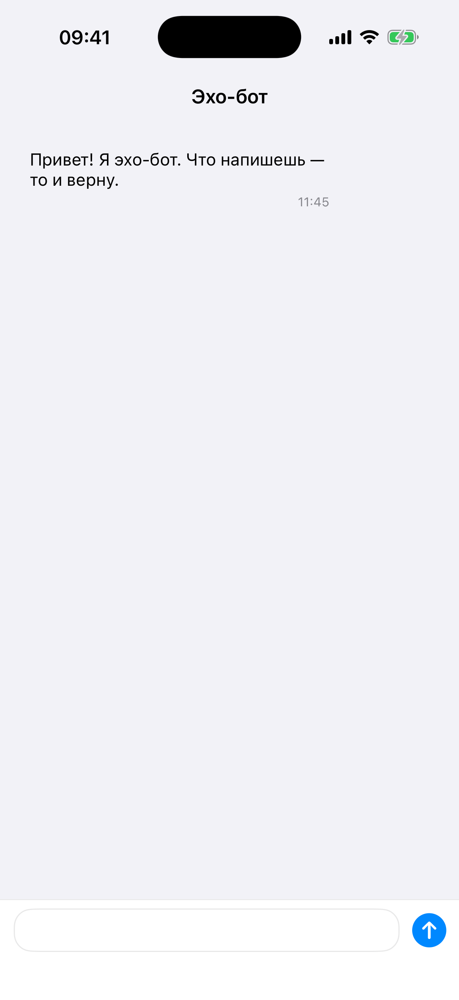

# Глава 18. Chat — двусторонние ячейки, keyboardLayoutGuide, typing indicator

{width=45%}

Чат — экран с одной из самых хитрых вёрсток в UIKit:

- Сообщения разные по высоте и направлению (моё справа, его слева).
- Сверху список сообщений, снизу composer с текстовым полем.
- Клавиатура поднимается и опускается — composer должен следовать.
- Сообщения добавляются динамически, нужно скроллить к низу.
- Статусы (отправляется → отправлено → доставлено → прочитано).
- Indicator «печатает...» от собеседника.

В этой главе всё это собираем. Собеседник — echo-бот, мы отправляем
сообщение, бот через секунду отвечает.

## 18.1 Модель сообщения

```swift
struct ChatMessage: Hashable, Sendable {
    enum Author: Sendable { case me, them }
    enum Status: Sendable { case sending, sent, delivered, read }

    let id: UUID
    let author: Author
    var text: String
    let date: Date
    var status: Status

    init(id: UUID = UUID(), author: Author, text: String, date: Date = Date(), status: Status = .sent) {
        // ...
    }
}
```

Минимально: id, кто автор, текст, дата, статус.

`Status` — четыре стадии:

- **`sending`** — оптимистично добавлено в UI, но локально ещё не
  подтверждено.
- **`sent`** — успешно ушло на сервер (или сохранилось локально).
- **`delivered`** — собеседник получил.
- **`read`** — собеседник открыл и прочитал.

В реальных мессенджерах эти статусы обозначаются «галочками»: одна
✓ — отправлено, две ✓✓ — доставлено, синие ✓✓ — прочитано. Мы так
же.

`Author.me` / `.them` — для отрисовки ячейки слева или справа.

## 18.2 ChatBot — простой echo

```swift
enum ChatBot {
    static func reply(to message: String) async -> String {
        let delay = UInt64.random(in: 800_000_000...1_800_000_000)
        try? await Task.sleep(nanoseconds: delay)
        let emojis = ["", "🙂", "👍", "🤔", "😄", "👀"]
        let suffix = emojis.randomElement() ?? ""
        return "Echo: \(message) \(suffix)"
    }
}
```

Возвращает «Echo: <твоё сообщение> + случайный смайл» с задержкой
0.8–1.8 секунды. Достаточно, чтобы продемонстрировать UX «бот печатает».

## 18.3 Optimistic UI — мгновенный показ + подтверждение

При отправке сообщения мы НЕ ждём ответа сервера, чтобы показать его
в UI:

```swift
private func handleSend(_ text: String) {
    let trimmed = text.trimmingCharacters(in: .whitespacesAndNewlines)
    guard !trimmed.isEmpty else { return }
    let optimistic = ChatMessage(author: .me, text: trimmed, status: .sending)
    messages.append(optimistic)
    let optimisticIndex = messages.count - 1
    tableView.reloadData()
    scrollToBottom()

    Task { [weak self] in
        guard let self else { return }
        try? await Task.sleep(nanoseconds: 250_000_000)
        self.messages[optimisticIndex].status = .delivered
        self.tableView.reloadRows(at: [IndexPath(row: optimisticIndex, section: 0)], with: .none)
        // ... бот печатает, бот отвечает ...
    }
}
```

Что происходит:

1. **Сразу** добавляем сообщение в `messages` со статусом `.sending`.
2. Reload, скролл к низу.
3. Через 250ms «подтверждаем» — меняем статус на `.delivered`,
   перерисовываем эту строку.

Юзер видит свой текст **мгновенно**, как только нажал send. На 250ms
позже две галочки появляются. Это даёт ощущение «всё работает».

Без optimistic UI: пользователь нажал send → 250ms «висит» (или вообще
сообщение появляется только после ответа сервера) → пользователь
думает «не работает» → жмёт ещё раз → получаем дубликат.

## 18.4 Bot typing indicator

После «доставлено» начинается ответ:

```swift
self.isBotTyping = true
self.tableView.insertRows(at: [IndexPath(row: self.messages.count, section: 0)], with: .fade)
self.scrollToBottom()

let reply = await ChatBot.reply(to: trimmed)

self.isBotTyping = false
self.tableView.deleteRows(at: [IndexPath(row: self.messages.count, section: 0)], with: .fade)
self.messages.append(ChatMessage(author: .them, text: reply, status: .read))
self.tableView.insertRows(at: [IndexPath(row: self.messages.count - 1, section: 0)], with: .fade)
self.scrollToBottom()
```

Поток:

1. **Показать typing indicator**. Добавляем фейковую «псевдо-строку»
   в конец таблицы. Возвращаем её в `cellForRowAt` как
   `TypingIndicatorCell`. Считается «после» массива messages.
2. **Ждём ответ бота**.
3. **Скрыть typing**. Удаляем строку (id `messages.count`, до append'а).
4. **Добавить ответ**. Append + insertRows на новой позиции.
5. **Скролл к низу**.

`numberOfRows` учитывает `isBotTyping`:

```swift
func tableView(_ tableView: UITableView, numberOfRowsInSection section: Int) -> Int {
    messages.count + (isBotTyping ? 1 : 0)
}

func tableView(_ tableView: UITableView, cellForRowAt indexPath: IndexPath) -> UITableViewCell {
    if isBotTyping && indexPath.row == messages.count {
        let cell = tableView.dequeueReusableCell(withIdentifier: TypingIndicatorCell.reuseID, for: indexPath) as! TypingIndicatorCell
        cell.startAnimating()
        return cell
    }
    // ... обычная ячейка ...
}
```

Без `isBotTyping` — N строк, по числу сообщений. С `isBotTyping = true`
— N+1, последняя — typing.

## 18.5 TypingIndicatorCell — три точки в bubble

Анимированные точки внутри «бабла»:

```swift
final class TypingIndicatorCell: UITableViewCell {
    private let bubble = UIView()
    private let dot1 = UIView()
    private let dot2 = UIView()
    private let dot3 = UIView()

    func startAnimating() {
        for (i, dot) in [dot1, dot2, dot3].enumerated() {
            dot.layer.removeAllAnimations()
            let animation = CABasicAnimation(keyPath: "transform.translation.y")
            animation.fromValue = 0
            animation.toValue = -5
            animation.duration = 0.5
            animation.autoreverses = true
            animation.repeatCount = .infinity
            animation.beginTime = CACurrentMediaTime() + Double(i) * 0.15
            dot.layer.add(animation, forKey: "bounce")
        }
    }
}
```

Каждая точка:

- `transform.translation.y` от 0 до -5 (пиксели вверх).
- `duration: 0.5` секунды.
- `autoreverses: true` — обратно вниз.
- `repeatCount: .infinity` — бесконечно.
- `beginTime: + i * 0.15` — каждая точка начинает с задержкой 150ms,
  получается «бегущая волна».

`CACurrentMediaTime()` — текущее время для CoreAnimation. Без него
`beginTime: 0.15` означало бы «в момент часа 0», то есть никогда.

`removeAllAnimations()` перед добавлением — на случай переиспользования
ячейки.

## 18.6 keyboardLayoutGuide — composer следует за клавиатурой

iOS 15 ввела `UIView.keyboardLayoutGuide` — system guide, который
автоматически отслеживает положение клавиатуры:

```swift
composerBottomConstraint = composer.bottomAnchor.constraint(
    equalTo: view.keyboardLayoutGuide.topAnchor
)

NSLayoutConstraint.activate([
    tableView.topAnchor.constraint(equalTo: view.topAnchor),
    tableView.leadingAnchor.constraint(equalTo: view.leadingAnchor),
    tableView.trailingAnchor.constraint(equalTo: view.trailingAnchor),
    tableView.bottomAnchor.constraint(equalTo: composer.topAnchor),

    composer.leadingAnchor.constraint(equalTo: view.leadingAnchor),
    composer.trailingAnchor.constraint(equalTo: view.trailingAnchor),
    composerBottomConstraint,
])
```

Когда клавиатура опущена — `keyboardLayoutGuide.topAnchor` равен
`safeAreaLayoutGuide.bottomAnchor`. Когда клавиатура поднята —
поднимается к её топу.

**Одна строка** в setup. Без `NotificationCenter`, без observer'ов,
без manual frame обновлений. Apple сделала это правильно.

До iOS 15 пришлось бы:

```swift
// Старый способ — НЕ нужен с iOS 15+
NotificationCenter.default.addObserver(self,
                                       selector: #selector(keyboardWillChange),
                                       name: UIResponder.keyboardWillChangeFrameNotification,
                                       object: nil)

@objc func keyboardWillChange(_ note: Notification) {
    guard let frame = note.userInfo?[UIResponder.keyboardFrameEndUserInfoKey] as? CGRect else { return }
    let inset = view.bounds.height - view.convert(frame, from: nil).origin.y
    composerBottomConstraint.constant = -max(0, inset - view.safeAreaInsets.bottom)
    UIView.animate(withDuration: 0.25) { self.view.layoutIfNeeded() }
}
```

Тонна кода для того же эффекта. И ещё нужно animation curve и
duration вытащить из notification'а, чтобы синхронизироваться с
клавиатурой.

> 💡 **Apple-style клавиатура.** Если используешь
> `keyboardLayoutGuide`, анимация подъёма синхронизирована с iOS из
> коробки. Без него — `animate(withDuration: 0.25)` всегда даёт
> разсинхрон.

## 18.7 Composer — ComposerView

```swift
final class ComposerView: UIView {
    var onSend: ((String) -> Void)?
    private let textView = UITextView()
    private let sendButton = UIButton(type: .system)
    private var heightConstraint: NSLayoutConstraint!

    override init(frame: CGRect) {
        super.init(frame: frame)
        backgroundColor = .systemBackground
        // separator поверху, textView, sendButton рядом

        textView.font = .preferredFont(forTextStyle: .body)
        textView.layer.cornerRadius = 16
        textView.layer.borderColor = UIColor.separator.cgColor
        textView.layer.borderWidth = 1
        textView.textContainerInset = UIEdgeInsets(top: 8, left: 12, bottom: 8, right: 12)
        textView.isScrollEnabled = false
        textView.delegate = self
        // ...

        sendButton.setImage(UIImage(systemName: "arrow.up.circle.fill"), for: .normal)
        sendButton.tintColor = .systemBlue
        // ...

        heightConstraint = textView.heightAnchor.constraint(equalToConstant: 38)
    }

    @objc private func sendTapped() {
        let text = textView.text ?? ""
        onSend?(text)
        textView.text = ""
        adjustHeight()
    }

    fileprivate func adjustHeight() {
        let size = textView.sizeThatFits(CGSize(width: textView.bounds.width, height: .infinity))
        heightConstraint.constant = min(max(38, size.height), 120)
    }
}

extension ComposerView: UITextViewDelegate {
    func textViewDidChange(_ textView: UITextView) { adjustHeight() }
}
```

Ключевые моменты:

- **`UITextView`** (не `UITextField`), потому что текст многострочный.
- **`isScrollEnabled = false`** — иначе сам textView показывает scroll
  при превышении высоты, мешая нашему adjustHeight.
- **`sizeThatFits`** — спрашиваем textView «сколько тебе нужно высоты
  при этой ширине». Возвращает `CGSize`.
- **`min(max(38, size.height), 120)`** — высота между 38pt (одна
  строка) и 120pt (примерно 5 строк). Дальше textView перестаёт
  расти — пускай юзер скроллит внутри (включим `isScrollEnabled = true`
  при достижении лимита, если хочется).
- **`heightConstraint.constant`** обновляется на каждое изменение
  текста.

`textContainerInset` — отступы внутри textView. Default делает текст
прилипшим к границам — некрасиво.

## 18.8 Кастомная ячейка — пузырь с разными краями

`MessageCell` рисует «бабл» — `bubble` UIView с скруглёнными углами:

```swift
final class MessageCell: UITableViewCell {
    private let bubble = UIView()
    private let messageLabel = UILabel()
    private let metaLabel = UILabel()
    private var leadingConstraint: NSLayoutConstraint!
    private var trailingConstraint: NSLayoutConstraint!

    private func setupLayout() {
        bubble.layer.cornerRadius = 16
        messageLabel.numberOfLines = 0
        // ...

        contentView.addSubview(bubble)
        bubble.addSubview(messageLabel)
        bubble.addSubview(metaLabel)

        leadingConstraint = bubble.leadingAnchor.constraint(equalTo: contentView.leadingAnchor, constant: 12)
        trailingConstraint = bubble.trailingAnchor.constraint(equalTo: contentView.trailingAnchor, constant: -12)

        NSLayoutConstraint.activate([
            bubble.topAnchor.constraint(equalTo: contentView.topAnchor, constant: 4),
            bubble.bottomAnchor.constraint(equalTo: contentView.bottomAnchor, constant: -4),
            bubble.widthAnchor.constraint(lessThanOrEqualTo: contentView.widthAnchor, multiplier: 0.75),
            // ... text constraints ...
        ])
    }

    func configure(with message: ChatMessage) {
        messageLabel.text = message.text
        let isMine = message.author == .me

        if isMine {
            bubble.backgroundColor = .systemBlue
            messageLabel.textColor = .white
            leadingConstraint.isActive = false
            trailingConstraint.isActive = true
        } else {
            bubble.backgroundColor = .secondarySystemBackground
            messageLabel.textColor = .label
            trailingConstraint.isActive = false
            leadingConstraint.isActive = true
        }
    }
}
```

Что важно:

- **`widthAnchor.lessThanOrEqual ... multiplier: 0.75`** — bubble не
  более 75% ширины контейнера. Длинные сообщения переносятся.
- **`leadingConstraint`** и **`trailingConstraint`** — оба объявлены,
  но активируется только один в зависимости от автора. «Моё» —
  trailing (прижато к правому краю), «не моё» — leading.
- Цвета: `.systemBlue` для моих, `.secondarySystemBackground` для
  чужих — стандарт для iOS Messages.

`numberOfLines = 0` на messageLabel — многострочный текст. Высота
ячейки автоматически (через `tableView.rowHeight =
UITableView.automaticDimension`).

## 18.9 Статусы — галочки в meta

```swift
let timeFormatter = DateFormatter()
timeFormatter.timeStyle = .short
let time = timeFormatter.string(from: message.date)
let statusGlyph: String
switch message.status {
case .sending: statusGlyph = " ⏳"
case .sent: statusGlyph = " ✓"
case .delivered: statusGlyph = " ✓✓"
case .read: statusGlyph = " ✓✓"
}
metaLabel.text = isMine ? "\(time)\(statusGlyph)" : time
metaLabel.textColor = isMine
    ? (message.status == .read ? .systemBlue : UIColor.white.withAlphaComponent(0.85))
    : .secondaryLabel
```

Для моих сообщений — время + статус. Для чужих — только время (не
показываем «прочитано» на чужих).

Цвет:
- Чужое — secondary (серый).
- Моё, статус ≠ read — белый полупрозрачный (на синем bubble'е).
- Моё, статус = read — `systemBlue` (выделяется — «всё, прочитано»).

В реальных мессенджерах при `read` галочки часто отдельным цветом
(синие в Telegram, или мини-аватарка в WhatsApp). У нас просто
синяя строка статуса.

## 18.10 Scroll to bottom — асинхронно

```swift
private func scrollToBottom() {
    let last = max(messages.count + (isBotTyping ? 1 : 0) - 1, 0)
    let indexPath = IndexPath(row: last, section: 0)
    DispatchQueue.main.async { [weak self] in
        self?.tableView.scrollToRow(at: indexPath, at: .bottom, animated: true)
    }
}
```

`DispatchQueue.main.async` — обязательно. Если сразу скроллить после
`insertRows` (или `reloadData`), iOS ещё не пересчитала layout, и
скролл может приехать в неверную позицию. `main.async` ставит задачу
в **следующий** runloop, когда layout уже свежий.

`scrollToRow(at:at:animated:)` — стандартный API. `at: .bottom` —
прокрутить так, чтобы строка оказалась внизу экрана.

## 18.11 Бытовая аналогия

Чат — это **переписка через дырку в двери**. Слева — то, что приходит
от соседа, справа — то, что ты отправляешь. Сосед что-то говорит —
ты слышишь шуршание (typing indicator). Когда дослал записку —
ставишь на ней галочку (status).

Composer — это **карандаш и стикер**, в которые ты пишешь. Когда
рука с карандашом поднимается (клавиатура), стикер двигается вверх
вместе с ней (`keyboardLayoutGuide`).

Список сообщений — **стопка стикеров** на столе. Новые ложатся
сверху. Когда новых много, стопка скроллится, чтобы было видно
последний (`scrollToRow`).

## 18.12 Что мы пропустили

- **Persistance** — сохранение истории. Сейчас при выходе из mini-app
  всё пропадает. В реальности — Core Data, SQLite, или JSON-файлы.
- **Real backend** — WebSocket или long-polling для получения
  сообщений в реальном времени.
- **Reply** — ответить на конкретное сообщение, с цитированием.
  Свайп вправо обычно.
- **Reactions** — эмодзи-реакции на чужие сообщения. Long-press →
  popup с эмодзи.
- **Attachments** — отправка картинки, файла, голосового сообщения.
- **Group chats** — список участников, имена авторов в сообщениях.
- **Read receipts** на стороне получателя — пометить чужое как
  «прочитано» при появлении на экране.
- **Inline editing** — edit-mode на UITableView, чтобы удалять
  несколько сообщений.

Каждая из этих фичей — отдельная микро-задача поверх той же базы
(table + composer + delegates).

> 🛠 **Упражнение.** Открой Чат (зелёная ячейка). Напиши «Привет» —
> увидишь сразу свою синюю плашку с `⏳`, потом `✓✓`. Через секунду
> внизу появятся три «прыгающие» точки (typing). Ещё через секунду —
> ответ бота слева. Свои галочки в этот момент посинеют (бот
> «прочитал»). Прокрути вверх — увидишь приветственное сообщение от
> бота (initial message).

## 📋 Что мы выучили

- Optimistic UI: добавляем сообщение со статусом `.sending`
  **мгновенно**, через 250ms подтверждаем как `.delivered`.
- Typing indicator — «фейковая» строка после последнего сообщения,
  учитывается в `numberOfRows`.
- Анимация точек — `CABasicAnimation` с
  `keyPath: transform.translation.y`, `autoreverses: true`,
  `repeatCount: .infinity`, разный `beginTime` для каждой точки.
- **`UIView.keyboardLayoutGuide`** (iOS 15+) — composer автоматически
  следует за клавиатурой одной строкой в Auto Layout. Не нужно
  `NotificationCenter`.
- Auto-grow `UITextView`: `isScrollEnabled = false` + `sizeThatFits`
  + обновление `heightConstraint.constant`.
- Двусторонние ячейки: два constraint'а (`leadingConstraint`,
  `trailingConstraint`) объявлены, но активируется только один в
  зависимости от автора.
- Лимит ширины «бабла» — `widthAnchor.lessThanOrEqual` с `multiplier:
  0.75`.
- Статусы через символы галочек: `⏳`, `✓`, `✓✓` с разными цветами в
  зависимости от состояния и автора.
- `scrollToRow(at:at:animated:)` в `DispatchQueue.main.async` —
  гарантия что layout успел пересчитаться.

## Apple Developer Documentation

- [UITableView](https://developer.apple.com/documentation/uikit/uitableview) — основа списка сообщений с динамической высотой ячеек.
- [UITableView.automaticDimension](https://developer.apple.com/documentation/uikit/uitableview/automaticdimension) — авто-расчёт высоты по констрейнтам, важно для multi-line «баблов».
- [UIView.keyboardLayoutGuide](https://developer.apple.com/documentation/uikit/uiview/3752221-keyboardlayoutguide) — system layout guide, который отслеживает клавиатуру (iOS 15+). Composer следует за ней одной строкой Auto Layout.
- [UIResponder.keyboardWillShowNotification](https://developer.apple.com/documentation/uikit/uiresponder/1621576-keyboardwillshownotification) — старый путь до iOS 15 через `NotificationCenter`. Использовать только при поддержке iOS 14 и ниже.
- [UITextView](https://developer.apple.com/documentation/uikit/uitextview) — многострочный composer с `isScrollEnabled = false` для auto-grow.
- [UITextViewDelegate.textViewDidChange(_:)](https://developer.apple.com/documentation/uikit/uitextviewdelegate/1618599-textviewdidchange) — callback на каждое изменение, дёргаем `adjustHeight()`.
- [UIScrollView.contentInsetAdjustmentBehavior](https://developer.apple.com/documentation/uikit/uiscrollview/2902261-contentinsetadjustmentbehavior) — управление авто-инсетами под safeArea; при кастомных containerах часто ставят `.never`.
- [UIContextMenuConfiguration](https://developer.apple.com/documentation/uikit/uicontextmenuconfiguration) — long-press menu с реакциями и pre-view; в Главе мы это пропустили, но это правильный API для emoji-реакций.
- [CABasicAnimation](https://developer.apple.com/documentation/quartzcore/cabasicanimation) — анимация прыгающих точек typing-indicator через `transform.translation.y`.
- [HIG: Designing for iOS — Layout](https://developer.apple.com/design/human-interface-guidelines/layout) — общие правила инсетов и safe areas для чат-вёрсток.

→ [Глава 19. Profile / Settings — insetGrouped с разными типами ячеек](./27-profile.md)
