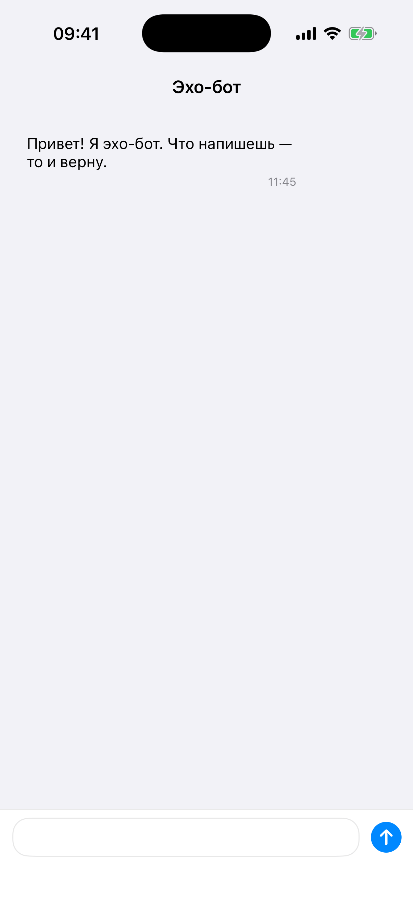

# Глава 18. Chat — двусторонние ячейки, keyboardLayoutGuide, typing indicator

{width=45%}

Чат — экран с одной из самых хитрых вёрсток в UIKit:

- сообщения разной высоты и с разных сторон: мои справа, чужие слева;
- сверху список сообщений, снизу поле ввода (composer);
- клавиатура поднимается и опускается — поле ввода должно ехать
  вместе с ней, а последние сообщения оставаться на виду;
- сообщения добавляются на лету, список надо докручивать до низа;
- статусы: отправляется → доставлено → прочитано;
- индикатор «печатает…» от собеседника.

Всё это собираем в этой главе. Собеседник — эхо-бот: ты отправляешь
сообщение, он через секунду-две отвечает.

```
┌──────────────────────────────┐
│ Чат                          │
│ ┌────────────────────┐       │
│ │Привет! Я эхо-бот.  │       │ ← MessageCell, чужое: слева, серое
│ │               12:30│       │
│ └────────────────────┘       │
│          ┌─────────────────┐ │
│          │Привет           │ │ ← MessageCell, моё: справа, синее
│          │     12:31 ✓✓    │ │    ✓✓ — доставлено / прочитано
│          └─────────────────┘ │
│ ┌──────┐                     │
│ │ • • •│                     │ ← TypingIndicatorCell
│ └──────┘                     │
├──────────────────────────────┤
│ ( Сообщение            ) (↑) │ ← ComposerView, растёт до 5 строк
├──────────────────────────────┤
│         клавиатура           │ ← composer прижат к keyboardLayoutGuide
└──────────────────────────────┘
```

Файлы:

```
Apps/Chat/
├── ChatMessage.swift          ← модель сообщения
├── ChatBot.swift              ← эхо-бот с задержкой
├── MessageCell.swift          ← «пузырь» сообщения
├── TypingIndicatorCell.swift  ← три прыгающие точки
├── ComposerView.swift         ← поле ввода + кнопка
└── ChatViewController.swift   ← экран: таблица + composer + логика
```

> **Режим сборки** — как во введении: Swift 6, `Default Actor
> Isolation = MainActor`, iOS 15+. Весь код главы живёт на главном
> потоке; фоновая работа здесь только одна — ожидание ответа бота, и
> она уходит в `Task`.

## 18.1 Модель сообщения

```swift
import Foundation

struct ChatMessage: Hashable {
    enum Author { case me, them }
    enum Status { case sending, sent, delivered, read }

    let id: UUID
    let author: Author
    var text: String
    let date: Date
    var status: Status

    init(id: UUID = UUID(), author: Author, text: String,
         date: Date = Date(), status: Status = .sent) {
        self.id = id
        self.author = author
        self.text = text
        self.date = date
        self.status = status
    }
}
```

Минимум полей: id, кто автор, текст, время и статус.

**`id: UUID`** — уникальный номер сообщения. Искать сообщение по
позиции в массиве ненадёжно: пока ждём ответа сервера, в массив могут
добавиться другие сообщения. По `id` его всегда можно найти (так и
сделаем в 18.3).

**`Author`** — чьё сообщение: `.me` рисуется справа, `.them` — слева.

**`Status`** — четыре стадии жизни моего сообщения:

- **`sending`** — показано в интерфейсе сразу, но сервер его ещё не
  подтвердил;
- **`sent`** — сервер принял (или сообщение сохранено локально);
- **`delivered`** — дошло до собеседника;
- **`read`** — собеседник открыл и прочитал.

В мессенджерах это обычно галочки: одна ✓ — отправлено, две ✓✓ —
доставлено, выделенные ✓✓ — прочитано. У нас так же (18.9).

Явный `init` со значениями по умолчанию позволяет писать коротко:
`ChatMessage(author: .me, text: "Привет")` — id, дата и статус
подставятся сами.

## 18.2 ChatBot — эхо с задержкой

```swift
import Foundation

enum ChatBot {
    static func reply(to message: String) async -> String {
        let delay = UInt64.random(in: 800_000_000...1_800_000_000)   // 0,8–1,8 с
        try? await Task.sleep(nanoseconds: delay)
        let endings = ["", " :)", " Интересно.", " Расскажи ещё!"]
        return "Эхо: \(message)\(endings.randomElement() ?? "")"
    }
}
```

Бот возвращает «Эхо: твой текст» и случайное окончание. Задержка
случайная, от 0,8 до 1,8 секунды: `Task.sleep` считает в наносекундах,
в одной секунде их миллиард (1 000 000 000), поэтому 800 000 000 — это
0,8 секунды. Подчёркивания в числе — просто разделители разрядов для
читаемости. `Task.sleep(nanoseconds:)` работает с iOS 13; вариант
`Task.sleep(for: .seconds(1))` появился только в iOS 16.

Случайная задержка нужна, чтобы увидеть индикатор «печатает» и
проверить, что ответы приходят в любом порядке и ничего не ломают.

Ответы — обычный текст, без эмодзи: в PDF-версии книги и в части
шрифтов эмодзи превращаются в квадратики.

## 18.3 Optimistic UI — показать сразу, подтвердить потом

Optimistic UI («оптимистичный интерфейс») — показываем результат
действия сразу, как будто сервер уже согласился, и тихо поправляем,
если что-то пошло не так. Пользователь нажал «отправить» — его
сообщение появляется мгновенно, с пометкой «отправляется».

```swift
import UIKit

extension ChatViewController {
    func handleSend(_ text: String) {
        let trimmed = text.trimmingCharacters(in: .whitespacesAndNewlines)
        guard !trimmed.isEmpty else { return }

        let message = ChatMessage(author: .me, text: trimmed, status: .sending)
        messages.append(message)
        tableView.insertRows(at: [IndexPath(row: messages.count - 1, section: 0)], with: .bottom)
        scrollToBottom(animated: true)

        Task { [weak self] in
            try? await Task.sleep(nanoseconds: 250_000_000)   // «сервер» подтвердил за 0,25 с
            self?.update(messageID: message.id, to: .delivered)
            self?.showTyping()
            let reply = await ChatBot.reply(to: trimmed)
            self?.receive(reply)
        }
    }

    func update(messageID: UUID, to status: ChatMessage.Status) {
        guard let row = messages.firstIndex(where: { $0.id == messageID }) else { return }
        messages[row].status = status
        tableView.reloadRows(at: [IndexPath(row: row, section: 0)], with: .none)
    }
}
```

Этот код лежит в `ChatViewController.swift`, в том же файле, что и сам
класс (он будет в 18.11). Поэтому расширение видит его `private`-
свойства: `messages`, `tableView` и другие.

По шагам:

1. **`trimmingCharacters(in: .whitespacesAndNewlines)`** — убираем
   пробелы и переносы по краям. Сообщение из одних пробелов не
   отправляем.
2. **Сразу** добавляем сообщение в массив со статусом `.sending` и
   вставляем строку в таблицу. `insertRows(... with: .bottom)` —
   строка въезжает снизу, а не появляется рывком, как при
   `reloadData()`.
3. **Через 0,25 секунды** «сервер» подтверждает, статус становится
   `.delivered`. Строку ищем по `id` (`firstIndex(where:)`), а не по
   номеру, который был при отправке.
4. Показываем «печатает…», ждём бота, добавляем ответ (18.4).

`[weak self]` в задаче — если пользователь закрыл чат, пока бот
«думает», экран освободится, а оставшиеся вызовы через `self?.` просто
не выполнятся.

**Без optimistic UI** пользователь нажал «отправить» — и четверть
секунды (а на плохой сети — несколько секунд) ничего не происходит. Он
решает, что не сработало, жмёт ещё раз — и получает дубль сообщения.

> **Частая ошибка.** Искать строку по номеру `optimisticIndex`,
> сохранённому при отправке, а после ответа бота вставлять и удалять
> строки в расчёте, что второе сообщение за это время не появится.
> Отправь два сообщения быстрее, чем за секунду, — и таблица падает с
> ошибкой «invalid number of rows». Как этого избежать — в 18.4.

## 18.4 Индикатор «бот печатает»

Индикатор — это ещё одна строка таблицы, после последнего сообщения.
Её нет в массиве `messages`, она «приклеена» к концу, пока бот готовит
хотя бы один ответ.

```swift
import UIKit

extension ChatViewController {
    func showTyping() {
        pendingReplies += 1
        guard pendingReplies == 1 else { return }   // строка «печатает» уже есть
        tableView.insertRows(at: [IndexPath(row: messages.count, section: 0)], with: .fade)
        scrollToBottom(animated: true)
    }

    func receive(_ reply: String) {
        pendingReplies -= 1
        let typingRow = messages.count   // строка «печатает» стоит сразу за последним сообщением

        let readRows = messages.indices.filter {
            messages[$0].author == .me && (messages[$0].status == .sent || messages[$0].status == .delivered)
        }
        for row in readRows { messages[row].status = .read }
        messages.append(ChatMessage(author: .them, text: reply, status: .read))

        tableView.performBatchUpdates {
            tableView.reloadRows(at: readRows.map { IndexPath(row: $0, section: 0) }, with: .none)
            tableView.insertRows(at: [IndexPath(row: typingRow, section: 0)], with: .fade)
            if !isBotTyping {
                tableView.deleteRows(at: [IndexPath(row: typingRow, section: 0)], with: .fade)
            }
        }
        scrollToBottom(animated: true)
    }
}
```

**Счётчик вместо флага.** Будь `isBotTyping` простым `Bool`, два быстрых
сообщения — два ответа в пути — пытались бы вставить и удалить одну и
ту же строку. `pendingReplies` считает, сколько ответов ещё в пути, а `isBotTyping` теперь вычисляется: «ответов в
пути больше нуля». Строка «печатает» вставляется, только когда счётчик
стал 1 (первый ответ пошёл), и удаляется, только когда стал 0
(последний пришёл).

**Сколько строк в таблице.** Таблица всегда спрашивает:

```swift
import UIKit

extension ChatViewController: UITableViewDataSource {
    func tableView(_ tableView: UITableView, numberOfRowsInSection section: Int) -> Int {
        messages.count + (isBotTyping ? 1 : 0)
    }

    func tableView(_ tableView: UITableView, cellForRowAt indexPath: IndexPath) -> UITableViewCell {
        if isBotTyping && indexPath.row == messages.count {
            let cell = tableView.dequeueReusableCell(withIdentifier: TypingIndicatorCell.reuseID,
                                                     for: indexPath)
            (cell as? TypingIndicatorCell)?.startAnimating()
            return cell
        }
        let cell = tableView.dequeueReusableCell(withIdentifier: MessageCell.reuseID, for: indexPath)
        (cell as? MessageCell)?.configure(with: messages[indexPath.row])
        return cell
    }
}
```

Сообщений N — строк N, а пока бот печатает — N + 1, и последняя
строка (номер N, считая с нуля) — индикатор.

**Главное правило `insertRows`/`deleteRows`.** После каждого изменения
таблица проверяет арифметику: «было строк + вставлено − удалено»
должно совпасть с тем, что теперь отвечает
`numberOfRowsInSection`. Не совпало — приложение падает. Проверим
`receive` на числах. До ответа: 3 сообщения + индикатор = 4 строки.

- **Ответов в пути больше не осталось** (`pendingReplies` стал 0).
  Сообщений стало 4, индикатора нет: 4 строки. В одном пакете
  (`performBatchUpdates`) удаляем старую строку 3 (индикатор) и
  вставляем новую строку 3 (ответ): 4 − 1 + 1 = 4. Сходится.
- **Ещё один ответ в пути** (`pendingReplies` стал 1). Сообщений 4 +
  индикатор = 5 строк. Вставляем ответ на место 3, индикатор сам
  съезжает на строку 4: 4 + 1 = 5. Сходится.

Внутри `performBatchUpdates` номера для удаления и перезагрузки
считаются по **старому** состоянию таблицы, а для вставки — по
**новому**. Поэтому одна и та же строка 3 и удаляется (старый
индикатор), и вставляется (новый ответ).

**Прочитано.** Когда бот отвечает, он «прочитал» мои сообщения, которые
уже дошли (`.sent` или `.delivered`). Сообщения в статусе `.sending`
не трогаем: сервер их ещё не принял, прочитать их нельзя. Их строки
перезагружаем в том же пакете — галочки поменяют цвет вместе с
появлением ответа.

> **Упражнение 18.1.** Не запуская приложение, проследи счётчик
> `pendingReplies` и число строк-индикаторов, если отправить три
> сообщения подряд с интервалом в полсекунды. Потом проверь в
> симуляторе. Ответ — в конце главы.

## 18.5 TypingIndicatorCell — три точки в «пузыре»

```swift
import UIKit

final class TypingIndicatorCell: UITableViewCell {
    static let reuseID = "TypingIndicatorCell"

    private let bubble = UIView()
    private let dots = (0..<3).map { _ in UIView() }

    override init(style: UITableViewCell.CellStyle, reuseIdentifier: String?) {
        super.init(style: style, reuseIdentifier: reuseIdentifier)
        selectionStyle = .none
        backgroundColor = .clear

        bubble.backgroundColor = .secondarySystemBackground
        bubble.layer.cornerRadius = 16
        bubble.translatesAutoresizingMaskIntoConstraints = false
        contentView.addSubview(bubble)

        let stack = UIStackView(arrangedSubviews: dots)
        stack.spacing = 5
        stack.translatesAutoresizingMaskIntoConstraints = false
        bubble.addSubview(stack)

        for dot in dots {
            dot.backgroundColor = .secondaryLabel
            dot.layer.cornerRadius = 4
            dot.widthAnchor.constraint(equalToConstant: 8).isActive = true
            dot.heightAnchor.constraint(equalToConstant: 8).isActive = true
        }

        NSLayoutConstraint.activate([
            bubble.topAnchor.constraint(equalTo: contentView.topAnchor, constant: 4),
            bubble.bottomAnchor.constraint(equalTo: contentView.bottomAnchor, constant: -4),
            bubble.leadingAnchor.constraint(equalTo: contentView.leadingAnchor, constant: 12),
            stack.topAnchor.constraint(equalTo: bubble.topAnchor, constant: 14),
            stack.bottomAnchor.constraint(equalTo: bubble.bottomAnchor, constant: -14),
            stack.leadingAnchor.constraint(equalTo: bubble.leadingAnchor, constant: 14),
            stack.trailingAnchor.constraint(equalTo: bubble.trailingAnchor, constant: -14),
        ])

        isAccessibilityElement = true
        accessibilityLabel = "Бот печатает"
    }

    required init?(coder: NSCoder) { fatalError("init(coder:) не используется") }

    func startAnimating() {
        let now = CACurrentMediaTime()
        for (index, dot) in dots.enumerated() {
            dot.layer.removeAllAnimations()
            let animation = CABasicAnimation(keyPath: "transform.translation.y")
            animation.fromValue = 0
            animation.toValue = -5
            animation.duration = 0.5
            animation.autoreverses = true
            animation.repeatCount = .infinity
            animation.beginTime = now + Double(index) * 0.15
            dot.layer.add(animation, forKey: "bounce")
        }
    }
}
```

**Точка — это квадрат 8×8 со скруглением 4.** Скругление, равное
половине стороны, превращает квадрат в круг.

**Анимация.** `CABasicAnimation` — анимация Core Animation: она
меняет одно свойство слоя (`CALayer`, «холст», на котором рисуется
вид) от одного значения к другому, и всю работу делает система, без
нашего кода на каждом кадре. Для каждой точки:

- `keyPath: "transform.translation.y"` — сдвиг по вертикали;
- от 0 до −5 точек: в UIKit ось Y направлена вниз, поэтому минус —
  это **вверх** на 5 точек;
- `duration = 0.5` — подъём за полсекунды;
- `autoreverses = true` — потом обратно вниз, ещё полсекунды: полный
  «прыжок» занимает секунду;
- `repeatCount = .infinity` — бесконечно;
- `beginTime = now + index * 0.15` — первая точка стартует сразу,
  вторая через 0,15 секунды, третья через 0,3. Получается бегущая
  волна.

`CACurrentMediaTime()` — текущее время часов Core Animation в секундах.
`beginTime` задаётся по этим часам: если написать просто `0.15`, это
будет момент «0,15 секунды после включения устройства», давно
прошедший, и сдвиг пропадёт. Время берём один раз до цикла (`now`),
чтобы у всех трёх точек была одна точка отсчёта.

`removeAllAnimations()` — ячейку могут переиспользовать, и без этой
строки на точку наложились бы две анимации.

**Доступность.** Вся ячейка — один элемент для VoiceOver с подписью
«Бот печатает». Без этого он пытался бы озвучить три пустых вида.

## 18.6 keyboardLayoutGuide — поле ввода едет за клавиатурой

Layout guide («направляющая») — невидимый прямоугольник, к которому
можно привязывать ограничения Auto Layout, как к обычному виду. Самый
известный — `safeAreaLayoutGuide`, безопасная зона экрана. В iOS 15
появился `view.keyboardLayoutGuide` — направляющая, которая совпадает
с клавиатурой: поднимается вместе с ней и опускается обратно.

Одно ограничение — и поле ввода всегда стоит над клавиатурой:

<!-- no-check -->
```swift
composer.bottomAnchor.constraint(equalTo: view.keyboardLayoutGuide.topAnchor)
```

(Полный код вёрстки — в 18.11.) Когда клавиатура спрятана, верх
направляющей совпадает с низом безопасной зоны, и поле ввода стоит
над полоской «домой». Когда клавиатура выезжает, направляющая
поднимается с той же анимацией, с той же скоростью и кривой, что и
клавиатура. Никаких уведомлений, наблюдателей и ручных расчётов.

В iOS 17 у направляющей появились настройки: `usesBottomSafeArea`
(учитывать ли безопасную зону, когда клавиатура спрятана) и
`keyboardDismissPadding`. Нам хватает поведения по умолчанию, которое
одинаково с iOS 15.

**Как делали до iOS 15.** Для сравнения — старый способ (при iOS 15+
он не нужен):

<!-- no-check -->
```swift
NotificationCenter.default.addObserver(self,
                                       selector: #selector(keyboardWillChange),
                                       name: UIResponder.keyboardWillChangeFrameNotification,
                                       object: nil)

@objc func keyboardWillChange(_ note: Notification) {
    guard let frame = note.userInfo?[UIResponder.keyboardFrameEndUserInfoKey] as? CGRect else { return }
    let overlap = view.bounds.height - view.convert(frame, from: nil).origin.y
    composerBottomConstraint.constant = -max(0, overlap - view.safeAreaInsets.bottom)
    UIView.animate(withDuration: 0.25) { self.view.layoutIfNeeded() }
}
```

Уведомление приносит кадр клавиатуры в координатах экрана, его надо
перевести в координаты своего вида, вычесть безопасную зону и
вручную анимировать. На числах: экран 852 точки в высоту, клавиатура
начинается с 516-й точки — перекрытие 852 − 516 = 336 точек; минус 34
точки безопасной зоны снизу — поднимаем поле на 302 точки. А ещё нужно
вытащить из уведомления длительность и кривую анимации клавиатуры:
с захардкоженными 0,25 секунды поле ввода чуть отстаёт от клавиатуры
или обгоняет её. `keyboardLayoutGuide` делает всё это сам.

**Интерактивное закрытие.** В 18.11 у таблицы стоит
`keyboardDismissMode = .interactive`: потяни список вниз — клавиатура
поедет за пальцем, как в «Сообщениях». Документация описывает
направляющую как «отслеживающую положение клавиатуры», поэтому поле
ввода опускается вслед за ней. Это движение управляется пальцем, а не
анимацией, и проверять его удобнее на устройстве — в упражнении 18.3.

## 18.7 ComposerView — растущее поле ввода

```swift
import UIKit

final class ComposerView: UIView {
    var onSend: ((String) -> Void)?

    private let textView = UITextView()
    private let placeholderLabel = UILabel()
    private let sendButton = UIButton(type: .system)
    private var heightConstraint: NSLayoutConstraint!

    private let minHeight: CGFloat = 38
    private let maxHeight: CGFloat = 120

    override init(frame: CGRect) {
        super.init(frame: frame)
        backgroundColor = .systemBackground

        let separator = UIView()
        separator.backgroundColor = .separator

        textView.font = .preferredFont(forTextStyle: .body)
        textView.adjustsFontForContentSizeCategory = true
        textView.backgroundColor = .secondarySystemBackground
        textView.layer.cornerRadius = 18
        textView.textContainerInset = UIEdgeInsets(top: 8, left: 8, bottom: 8, right: 8)
        textView.isScrollEnabled = false
        textView.delegate = self
        textView.accessibilityLabel = "Сообщение"

        placeholderLabel.text = "Сообщение"
        placeholderLabel.font = textView.font
        placeholderLabel.textColor = .placeholderText
        placeholderLabel.isAccessibilityElement = false

        sendButton.setImage(UIImage(systemName: "arrow.up.circle.fill"), for: .normal)
        sendButton.setPreferredSymbolConfiguration(UIImage.SymbolConfiguration(pointSize: 30),
                                                   forImageIn: .normal)
        sendButton.accessibilityLabel = "Отправить"
        sendButton.isEnabled = false
        sendButton.addAction(UIAction { [weak self] _ in self?.sendTapped() }, for: .touchUpInside)

        [separator, textView, placeholderLabel, sendButton].forEach {
            $0.translatesAutoresizingMaskIntoConstraints = false
            addSubview($0)
        }

        heightConstraint = textView.heightAnchor.constraint(equalToConstant: minHeight)

        NSLayoutConstraint.activate([
            separator.topAnchor.constraint(equalTo: topAnchor),
            separator.leadingAnchor.constraint(equalTo: leadingAnchor),
            separator.trailingAnchor.constraint(equalTo: trailingAnchor),
            separator.heightAnchor.constraint(equalToConstant: 1),

            textView.topAnchor.constraint(equalTo: topAnchor, constant: 8),
            textView.bottomAnchor.constraint(equalTo: bottomAnchor, constant: -8),
            textView.leadingAnchor.constraint(equalTo: layoutMarginsGuide.leadingAnchor),
            heightConstraint,

            placeholderLabel.leadingAnchor.constraint(equalTo: textView.leadingAnchor, constant: 13),
            placeholderLabel.centerYAnchor.constraint(equalTo: textView.centerYAnchor),

            sendButton.leadingAnchor.constraint(equalTo: textView.trailingAnchor, constant: 8),
            sendButton.trailingAnchor.constraint(equalTo: layoutMarginsGuide.trailingAnchor),
            sendButton.bottomAnchor.constraint(equalTo: textView.bottomAnchor),
            sendButton.widthAnchor.constraint(equalToConstant: 38),
            sendButton.heightAnchor.constraint(equalToConstant: 38),
        ])
    }

    required init?(coder: NSCoder) { fatalError("init(coder:) не используется") }

    private func sendTapped() {
        onSend?(textView.text)
        textView.text = ""
        textDidChange()
    }

    fileprivate func textDidChange() {
        let isEmpty = textView.text.trimmingCharacters(in: .whitespacesAndNewlines).isEmpty
        sendButton.isEnabled = !isEmpty
        placeholderLabel.isHidden = !textView.text.isEmpty

        let fitting = textView.sizeThatFits(CGSize(width: textView.bounds.width,
                                                   height: .greatestFiniteMagnitude))
        heightConstraint.constant = min(max(minHeight, fitting.height), maxHeight)
        // Дошли до потолка — включаем прокрутку внутри поля, иначе нижние строки не видно.
        textView.isScrollEnabled = fitting.height > maxHeight
    }
}

extension ComposerView: UITextViewDelegate {
    func textViewDidChange(_ textView: UITextView) {
        textDidChange()
    }
}
```

Разберём.

- **`UITextView`, а не `UITextField`.** Текстовое поле однострочное,
  а сообщение может быть длинным, с переносами строк.
- **Подсказка «Сообщение».** У `UITextView`, в отличие от
  `UITextField`, нет свойства `placeholder`. Поэтому кладём поверх
  серый `UILabel` и прячем его, как только появился текст. Цвет
  `.placeholderText` — системный цвет подсказок, сам подстраивается
  под тёмную тему.
- **`isScrollEnabled = false`** — при выключенной прокрутке
  `UITextView` «знает» свою нужную высоту, и `sizeThatFits` вернёт её.
  С прокруткой он считал бы, что ему хватит любой высоты, и мы не
  узнали бы, сколько строк в тексте.
- **`sizeThatFits`** — «какой размер тебе нужен при такой ширине?».
  Ширину передаём текущую, высоту — бесконечную
  (`.greatestFiniteMagnitude`, самое большое число `CGFloat`): «сколько
  угодно в высоту».
- **Высота на числах.** `min(max(38, нужная), 120)`: не меньше 38
  точек (одна строка шрифта body с отступами по 8 сверху и снизу) и не
  больше 120 (примерно пять строк). Нужно 20 — будет 38; нужно 80 —
  80; нужно 200 — 120.
- **Прокрутка на потолке.** Когда текст выше 120 точек, включаем
  `isScrollEnabled`, и внутри поля можно прокрутить к нижним строкам.
  Без этого шестая строка просто прячется.
- **Кнопка отправки** выключена, пока текст пустой или из одних
  пробелов. Выключенная системная кнопка сама становится серой.
- **`textContainerInset`** — отступы текста внутри поля. Без них текст
  прилипает к скруглённым краям.
- **`addAction(UIAction { [weak self] ... })`** — обработчик замыканием
  вместо `@objc`-метода (iOS 14+). `[weak self]` разрывает кольцо
  «кнопка → action → замыкание → composer → кнопка».

**Как высота передаётся наверх.** Мы меняем `heightConstraint` у
`textView`. Сам `ComposerView` высоты не задаёт: его верх и низ
привязаны к `textView` с отступами 8. Выросло поле — вырос composer,
а таблица над ним (её низ привязан к верху composer) стала ниже.
Цепочка ограничений делает всё сама.

> **Упражнение 18.2.** Ограничь длину сообщения 1000 символами: при
> попытке вставить или напечатать больше лишнее не должно попадать в
> поле. Подсказка: у `UITextViewDelegate` есть метод
> `textView(_:shouldChangeTextIn:replacementText:)`. Проверка: вставь
> в поле текст из 1500 символов — поле не изменится. Решение — в конце
> главы.

## 18.8 MessageCell — пузырь слева или справа

```swift
import UIKit

final class MessageCell: UITableViewCell {
    static let reuseID = "MessageCell"

    private static let timeFormatter: DateFormatter = {
        let formatter = DateFormatter()
        formatter.timeStyle = .short
        formatter.dateStyle = .none
        return formatter
    }()

    private let bubble = UIView()
    private let messageLabel = UILabel()
    private let metaLabel = UILabel()
    private var leadingConstraint: NSLayoutConstraint!
    private var trailingConstraint: NSLayoutConstraint!

    override init(style: UITableViewCell.CellStyle, reuseIdentifier: String?) {
        super.init(style: style, reuseIdentifier: reuseIdentifier)
        selectionStyle = .none
        backgroundColor = .clear
        setupLayout()
    }

    required init?(coder: NSCoder) { fatalError("init(coder:) не используется") }

    private func setupLayout() {
        bubble.layer.cornerRadius = 16
        messageLabel.numberOfLines = 0
        messageLabel.font = .preferredFont(forTextStyle: .body)
        messageLabel.adjustsFontForContentSizeCategory = true
        metaLabel.font = .preferredFont(forTextStyle: .caption2)
        metaLabel.adjustsFontForContentSizeCategory = true
        metaLabel.textAlignment = .right

        [bubble, messageLabel, metaLabel].forEach { $0.translatesAutoresizingMaskIntoConstraints = false }
        contentView.addSubview(bubble)
        bubble.addSubview(messageLabel)
        bubble.addSubview(metaLabel)

        leadingConstraint = bubble.leadingAnchor.constraint(equalTo: contentView.leadingAnchor, constant: 12)
        trailingConstraint = bubble.trailingAnchor.constraint(equalTo: contentView.trailingAnchor, constant: -12)

        NSLayoutConstraint.activate([
            bubble.topAnchor.constraint(equalTo: contentView.topAnchor, constant: 4),
            bubble.bottomAnchor.constraint(equalTo: contentView.bottomAnchor, constant: -4),
            bubble.widthAnchor.constraint(lessThanOrEqualTo: contentView.widthAnchor, multiplier: 0.75),

            messageLabel.topAnchor.constraint(equalTo: bubble.topAnchor, constant: 8),
            messageLabel.leadingAnchor.constraint(equalTo: bubble.leadingAnchor, constant: 12),
            messageLabel.trailingAnchor.constraint(equalTo: bubble.trailingAnchor, constant: -12),

            metaLabel.topAnchor.constraint(equalTo: messageLabel.bottomAnchor, constant: 2),
            metaLabel.leadingAnchor.constraint(greaterThanOrEqualTo: bubble.leadingAnchor, constant: 12),
            metaLabel.trailingAnchor.constraint(equalTo: bubble.trailingAnchor, constant: -12),
            metaLabel.bottomAnchor.constraint(equalTo: bubble.bottomAnchor, constant: -6),
        ])
    }

    func configure(with message: ChatMessage) {
        messageLabel.text = message.text
        let isMine = message.author == .me

        if isMine {
            bubble.backgroundColor = .systemBlue
            messageLabel.textColor = .white
            leadingConstraint.isActive = false
            trailingConstraint.isActive = true
        } else {
            bubble.backgroundColor = .secondarySystemBackground
            messageLabel.textColor = .label
            trailingConstraint.isActive = false
            leadingConstraint.isActive = true
        }

        let time = Self.timeFormatter.string(from: message.date)
        metaLabel.text = isMine ? "\(time) \(Self.glyph(for: message.status))" : time
        if isMine {
            metaLabel.textColor = message.status == .read ? .white : UIColor.white.withAlphaComponent(0.7)
        } else {
            metaLabel.textColor = .secondaryLabel
        }

        let author = isMine ? "Вы" : "Бот"
        accessibilityLabel = "\(author): \(message.text)"
        accessibilityValue = isMine ? "\(time), \(Self.spokenStatus(message.status))" : time
    }
}
```

(Методы `glyph(for:)` и `spokenStatus(_:)` — в 18.9.)

**Два ограничения, активно одно.** Пузырь должен прижиматься к правому
краю для моих сообщений и к левому — для чужих. Создаём оба
ограничения заранее (`leadingConstraint` — отступ 12 от левого края,
`trailingConstraint` — от правого), а в `configure` включаем нужное и
выключаем другое. Порядок в коде важен: **сначала выключаем** лишнее,
потом включаем нужное. Если на мгновение будут включены оба, пузырь
окажется привязан к обоим краям, и при коротком тексте Auto Layout
растянет его на всю ширину.

**Ширина не больше 75%.** `widthAnchor.constraint(lessThanOrEqualTo:
..., multiplier: 0.75)` — пузырь может быть уже, но не шире трёх
четвертей ячейки. На экране 393 точки это 295 точек; длинное сообщение
переносится на новые строки (`numberOfLines = 0` — без ограничения
строк).

**Пузырь по размеру текста.** Ширину пузыря никто не задаёт жёстко:
её определяет собственный размер текста (intrinsic content size — «сколько
места нужно содержимому»). Короткое «Ок» даёт узкий пузырь, длинный
абзац — широкий, но не шире 75%.

**Высота ячейки** складывается из ограничений: 4 сверху + 8 + высота
текста + 2 + высота времени + 6 + 4 снизу. Таблица с
`rowHeight = UITableView.automaticDimension` (18.11) сама посчитает её
для каждого сообщения.

**`DateFormatter` один на все ячейки.** Не создавай форматтер при
каждой настройке ячейки: создание `DateFormatter` —
дорогая операция (он загружает правила локали), а `configure`
вызывается при каждой прокрутке. `static let` создаётся один раз,
лениво, при первом обращении. `timeStyle = .short` учитывает локаль
устройства: «12:30» в России, «12:30 PM» в США.

**Переиспользование.** `configure` задаёт **всё**: текст, цвета,
активные ограничения, подпись и данные для VoiceOver. Ячейка, которая
была «моей», может прийти для чужого сообщения — и ни одно свойство не
останется от прошлого.

**Цвета и тёмная тема.** `.systemBlue`, `.secondarySystemBackground`,
`.label`, `.secondaryLabel` — системные динамические цвета: в тёмной
теме они сами становятся подходящими оттенками. Белый текст на
`.systemBlue` читается в обеих темах.

## 18.9 Статусы — галочки

```swift
import UIKit

extension MessageCell {
    static func glyph(for status: ChatMessage.Status) -> String {
        switch status {
        case .sending: return "…"
        case .sent: return "✓"
        case .delivered, .read: return "✓✓"
        }
    }

    static func spokenStatus(_ status: ChatMessage.Status) -> String {
        switch status {
        case .sending: return "отправляется"
        case .sent: return "отправлено"
        case .delivered: return "доставлено"
        case .read: return "прочитано"
        }
    }
}
```

Для моих сообщений под текстом — время и статус, для чужих — только
время (чужие статусы нам не интересны).

- `…` — отправляется. Эмодзи песочных часов в PDF и на части шрифтов
  превращается в квадратик, поэтому берём обычный символ многоточия.
- `✓` — отправлено, `✓✓` — доставлено и прочитано.

Доставлено и прочитано отличаются **яркостью**: пока не прочитано,
подпись полупрозрачная (70% непрозрачности — `withAlphaComponent(0.7)`),
после прочтения — чисто белая. Красить «прочитано» в `.systemBlue`
нельзя: синее на синем пузыре почти невидимо.

`spokenStatus` — то же самое словами для VoiceOver: галочки он
прочитал бы как «галочка галочка». Метод отдельный, потому что на
экране нужны значки, а в озвучке — слова.

## 18.10 Прокрутка к низу

```swift
import UIKit

extension ChatViewController {
    func scrollToBottom(animated: Bool) {
        let rows = tableView.numberOfRows(inSection: 0)
        guard rows > 0 else { return }
        let indexPath = IndexPath(row: rows - 1, section: 0)
        DispatchQueue.main.async { [weak self] in
            guard let self, indexPath.row < self.tableView.numberOfRows(inSection: 0) else { return }
            self.tableView.scrollToRow(at: indexPath, at: .bottom, animated: animated)
        }
    }
}
```

**Сколько строк — спрашиваем у таблицы.** `numberOfRows(inSection:)`
отдаёт то, что таблица знает сейчас, с учётом индикатора. Считать это
самим по `messages.count` и флагу — значит завести второй источник
правды, который легко разъезжается с первым.

**`DispatchQueue.main.async`** — прокрутка откладывается до очередного
прохода главного цикла (run loop — бесконечный цикл главного потока,
который по очереди обрабатывает касания, таймеры и перерисовку). Сразу
после `insertRows` таблица ещё не посчитала высоту новой строки, и
прокрутка могла бы не доехать до конца. Через один проход раскладка уже
свежая.

**Повторная проверка внутри.** За время ожидания строк могло стать
меньше (например, индикатор удалили). Прокрутка к несуществующей
строке — падение, поэтому перед `scrollToRow` проверяем ещё раз.

`scrollToRow(at:at:animated:)` с `.bottom` — прокрутить так, чтобы
строка встала у нижнего края видимой области.

**Клавиатура закрывает последние сообщения.** Когда клавиатура
выезжает, таблица становится ниже (её низ привязан к composer'у, а тот
— к клавиатуре), но смещение прокрутки остаётся прежним — и последние
сообщения уезжают под поле ввода. В `viewDidLayoutSubviews` (18.11)
сравниваем высоту таблицы с прошлой: стала меньше — докручиваем к
низу.

## 18.11 Собираем ChatViewController

```swift
import UIKit

final class ChatViewController: UIViewController {
    private let tableView = UITableView(frame: .zero, style: .plain)
    private let composer = ComposerView()

    private var messages: [ChatMessage] = [
        ChatMessage(author: .them, text: "Привет! Я эхо-бот. Напиши что-нибудь.", status: .read),
    ]
    /// Сколько ответов бота ещё в пути. Пока больше нуля — внизу строка «печатает».
    private var pendingReplies = 0
    private var isBotTyping: Bool { pendingReplies > 0 }
    private var lastTableHeight: CGFloat = 0

    override func viewDidLoad() {
        super.viewDidLoad()
        title = "Чат"
        view.backgroundColor = .systemBackground
        setupTable()
        setupLayout()
        composer.onSend = { [weak self] text in self?.handleSend(text) }
    }

    private func setupTable() {
        tableView.dataSource = self
        tableView.separatorStyle = .none
        tableView.allowsSelection = false
        tableView.rowHeight = UITableView.automaticDimension
        tableView.estimatedRowHeight = 60
        tableView.keyboardDismissMode = .interactive
        tableView.register(MessageCell.self, forCellReuseIdentifier: MessageCell.reuseID)
        tableView.register(TypingIndicatorCell.self, forCellReuseIdentifier: TypingIndicatorCell.reuseID)
    }

    private func setupLayout() {
        [tableView, composer].forEach {
            $0.translatesAutoresizingMaskIntoConstraints = false
            view.addSubview($0)
        }
        NSLayoutConstraint.activate([
            tableView.topAnchor.constraint(equalTo: view.topAnchor),
            tableView.leadingAnchor.constraint(equalTo: view.leadingAnchor),
            tableView.trailingAnchor.constraint(equalTo: view.trailingAnchor),
            tableView.bottomAnchor.constraint(equalTo: composer.topAnchor),

            composer.leadingAnchor.constraint(equalTo: view.leadingAnchor),
            composer.trailingAnchor.constraint(equalTo: view.trailingAnchor),
            composer.bottomAnchor.constraint(equalTo: view.keyboardLayoutGuide.topAnchor),
        ])
    }

    override func viewDidLayoutSubviews() {
        super.viewDidLayoutSubviews()
        // Клавиатура поднялась — таблица стала ниже. Держим последние сообщения на виду.
        let height = tableView.bounds.height
        if height < lastTableHeight {
            scrollToBottom(animated: false)
        }
        lastTableHeight = height
    }
}
```

Все методы из разделов 18.3, 18.4 и 18.10 — расширения этого класса в
том же файле.

- **`rowHeight = UITableView.automaticDimension`** — высота строки из
  ограничений ячейки. `estimatedRowHeight = 60` — примерная высота,
  пока строка не посчитана: по ней таблица заранее оценивает общую
  длину списка и размер полосы прокрутки.
- **`separatorStyle = .none`** — в чате линии между строками не нужны.
- **`allowsSelection = false`** — сообщения не выделяются при тапе.
- **`keyboardDismissMode = .interactive`** — клавиатура уходит за
  пальцем, когда тянешь список вниз (18.6).
- **Таблица от верхнего края `view`.** Как и у коллекции в главе 16,
  scroll view сам отступит под навигационную панель, а сообщения при
  прокрутке будут уходить под неё.
- **`composer.onSend = { [weak self] ... }`** — composer хранит
  замыкание, контроллер хранит composer. Сильный `self` замкнул бы
  кольцо, и закрытый чат остался бы в памяти.
- **`lastTableHeight`** в `viewDidLayoutSubviews` — тот приём из 18.10:
  таблица стала ниже (выехала клавиатура или выросло поле ввода) —
  докручиваем к последнему сообщению. Без анимации, потому что
  движение уже идёт вместе с клавиатурой.

## 18.12 Бытовая аналогия

Чат — это **переписка записками через окошко**. Слева кладут записки
от соседа, справа — твои. Сосед пишет — слышно шуршание карандаша
(индикатор «печатает»). Сколько бы записок ты ни сунул в окошко,
шуршание одно, и стихает, только когда сосед ответил на последнюю
(счётчик `pendingReplies`).

Поле ввода — **блокнот на подставке**, а подставка стоит на
клавиатуре. Клавиатура поднимается — блокнот едет вместе с ней
(`keyboardLayoutGuide`), и ты не двигаешь его руками.

Галочки — **штампы на записке**: «принято в окошке», «сосед взял»,
«сосед прочитал». Свою записку ты видишь сразу, ещё до штампа
(optimistic UI).

## 18.13 Что мы пропустили

- **Сохранение истории.** Сейчас при выходе из чата всё пропадает.
  В настоящем приложении — Core Data, SQLite или файлы JSON.
- **Настоящий сервер** — WebSocket для сообщений в реальном времени,
  очередь неотправленного на случай плохой сети и статус «ошибка» с
  кнопкой повтора.
- **Ответ на сообщение** с цитатой — обычно свайп вправо по пузырю.
- **Реакции** — долгое нажатие на сообщение и меню
  (`UIContextMenuConfiguration`, как в главе 16).
- **Вложения** — фото (через `PHPickerViewController`, см. главу 19),
  файлы, голосовые.
- **Группировка** — подряд идущие сообщения одного автора с меньшим
  отступом и одним «хвостиком», разделители дат.
- **Diffable data source** — таблица сама посчитает вставки и
  удаления, и ручная арифметика из 18.4 станет не нужна.

> **Упражнение 18.3.** Открой Чат (зелёная ячейка в лаунчере). Проверь:
> (1) сверху приветствие бота; (2) напиши «Привет» — сразу появится
> твой синий пузырь с «…», через четверть секунды «✓✓»
> (полупрозрачные), затем внизу прыгающие точки, затем ответ «Эхо:
> Привет» слева, и твои галочки станут ярко-белыми; (3) набери длинный
> текст — поле растёт до пяти строк, дальше внутри него появляется
> прокрутка; (4) на устройстве потяни список вниз — клавиатура уезжает за
> пальцем, а поле ввода опускается вслед за ней; (5) отправь три сообщения подряд очень
> быстро — приложение не падает, индикатор один (см. упражнение 18.1).

## Ответы к упражнениям

**Упражнение 18.1.** Время отсчитываем от первой отправки, бот отвечает
через 0,8–1,8 секунды после подтверждения:

| Момент | Событие | `pendingReplies` | Строк «печатает» |
|---|---|---|---|
| 0,00 | отправлено сообщение 1 | 0 | 0 |
| 0,25 | 1 доставлено, `showTyping` | 1 | 1 (вставлена) |
| 0,50 | отправлено 2 | 1 | 1 |
| 0,75 | 2 доставлено, `showTyping` | 2 | 1 (уже есть) |
| 1,00 | отправлено 3 | 2 | 1 |
| 1,25 | 3 доставлено, `showTyping` | 3 | 1 |
| ~1,3–2,1 | ответ на 1, `receive` | 2 | 1 (не удаляется) |
| … | ответ на 2 | 1 | 1 |
| … | ответ на 3 | 0 | 0 (удалена) |

Индикатор всегда один, исчезает с последним ответом. Ответы могут
прийти не по порядку: задержка случайная, и ответ на второе сообщение
иногда обгоняет первый. Счётчику это безразлично.

**Упражнение 18.2.** Отдельным расширением в `ComposerView.swift`:

```swift
import UIKit

extension ComposerView {
    func textView(_ textView: UITextView,
                  shouldChangeTextIn range: NSRange,
                  replacementText text: String) -> Bool {
        let current = textView.text as NSString
        let updated = current.replacingCharacters(in: range, with: text)
        return updated.count <= 1000
    }
}
```

Метод вызывается **до** изменения текста: `range` — какой кусок
заменяется, `text` — на что (при вводе одной буквы — пустой кусок и
одна буква, при вставке — выделенный фрагмент и вставляемый текст).
Строим будущий текст и разрешаем правку, только если он не длиннее 1000
символов. `NSString` нужен потому, что `range` приходит как `NSRange`
— в единицах UTF-16, как их считает `NSString`; у Swift-`String` свой
способ индексации. `updated.count` — уже Swift-строка, и считаются
видимые символы. Вставка 1500 символов целиком отклоняется, и поле
не меняется.

## Что мы выучили

- Optimistic UI: сообщение со статусом `.sending` показывается сразу,
  подтверждение меняет статус. Сообщение ищем по `id`, а не по
  сохранённому номеру строки.
- Индикатор «печатает» — лишняя строка после сообщений. Счётчик
  `pendingReplies` вместо флага не даёт двум ответам вставить и
  удалить её дважды.
- Арифметика `insertRows`/`deleteRows`: «было + вставлено − удалено =
  стало»; внутри `performBatchUpdates` удаления по старым номерам,
  вставки — по новым.
- Анимация точек — `CABasicAnimation` на `transform.translation.y`,
  `autoreverses`, бесконечный повтор, сдвиг `beginTime` от
  `CACurrentMediaTime()`.
- `view.keyboardLayoutGuide` (iOS 15+) — одно ограничение, и поле
  ввода едет за клавиатурой с её же анимацией, включая интерактивное
  закрытие.
- Растущее поле ввода: `isScrollEnabled = false` + `sizeThatFits` +
  высота между 38 и 120 точками; на потолке прокрутка включается.
- Пузырь слева или справа — два ограничения, активно одно; сначала
  выключаем, потом включаем. Ширина ≤ 75% ячейки.
- `DateFormatter` — один статический на все ячейки.
- Прочитано отличаем яркостью подписи, а VoiceOver получает статус
  словами.
- Прокрутка к низу — через `DispatchQueue.main.async`, число строк
  берём у самой таблицы; при подъёме клавиатуры докручиваем в
  `viewDidLayoutSubviews`.

## Apple Developer Documentation

- [UITableView](https://developer.apple.com/documentation/uikit/uitableview) — список сообщений с ячейками разной высоты.
- [UITableView.automaticDimension](https://developer.apple.com/documentation/uikit/uitableview/automaticdimension) — высота строки из ограничений ячейки.
- [UIView.keyboardLayoutGuide](https://developer.apple.com/documentation/uikit/uiview/keyboardlayoutguide) — направляющая, которая следует за клавиатурой (iOS 15+).
- [UIKeyboardLayoutGuide](https://developer.apple.com/documentation/uikit/uikeyboardlayoutguide) — класс этой направляющей и её настройки (`usesBottomSafeArea` и другие появились в iOS 17).
- [UIResponder.keyboardWillShowNotification](https://developer.apple.com/documentation/uikit/uiresponder/1621576-keyboardwillshownotification) — старый путь через уведомления, нужен только при поддержке iOS 14 и ниже.
- [UITextView](https://developer.apple.com/documentation/uikit/uitextview) — многострочное поле ввода.
- [UITextViewDelegate.textViewDidChange(_:)](https://developer.apple.com/documentation/uikit/uitextviewdelegate/1618599-textviewdidchange) — вызывается после каждого изменения текста.
- [UIScrollView.contentInsetAdjustmentBehavior](https://developer.apple.com/documentation/uikit/uiscrollview/2902261-contentinsetadjustmentbehavior) — как scroll view отступает под панели и безопасную зону.
- [UIContextMenuConfiguration](https://developer.apple.com/documentation/uikit/uicontextmenuconfiguration) — меню по долгому нажатию, подходит для реакций на сообщения.
- [CABasicAnimation](https://developer.apple.com/documentation/quartzcore/cabasicanimation) — анимация одного свойства слоя, на ней прыгают точки.
- [HIG: Layout](https://developer.apple.com/design/human-interface-guidelines/layout) — отступы, безопасные зоны и направляющие.

→ [Глава 19. Profile / Settings — insetGrouped с разными типами ячеек](./27-profile.md)
