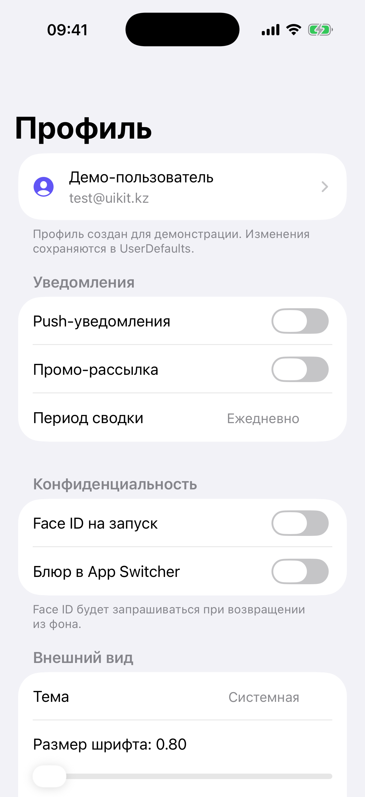

# Глава 19. Profile / Settings — insetGrouped с разными типами ячеек

{width=45%}

Экран настроек — самый «системный» из всех. iOS-приложения копируют
структуру системного «Settings.app»: `insetGrouped` UITableView с
секциями, заголовки и футеры с пояснениями, разные типы ячеек —
переключатель, ступер, слайдер, picker, кнопка, info-row.

В этой главе строим такой экран в playground'е. Реализуем все
основные типы ячеек **декларативно** — описываем секции как массив
данных, и одна `cellForRowAt` функция рендерит каждый тип.

## 19.1 Декларативный массив секций

Самое важное — отделить **описание** от **отрисовки**. Описание —
массив структур, отрисовка — общая функция:

```swift
private enum Row {
    case account(name: String, email: String)
    case toggle(title: String, key: String)
    case stepper(title: String, key: String, range: ClosedRange<Int>)
    case slider(title: String, key: String, range: ClosedRange<Float>)
    case picker(title: String, key: String, options: [String])
    case disclosure(title: String, value: String?, action: () -> Void)
    case button(title: String, isDestructive: Bool, action: () -> Void)
}

private struct Section {
    let title: String?
    let footer: String?
    let rows: [Row]
}

private var sections: [Section] = []
```

`Row` — enum с associated values. Каждый case — отдельный тип ячейки.
`Section` — заголовок + футер + массив строк.

В `viewDidLoad` или при перерисовке мы строим этот массив:

```swift
private func rebuildSections() {
    let email = AuthStorage.shared.token != nil ? "test@uikit.kz" : "—"
    sections = [
        Section(title: nil, footer: "Профиль создан для демонстрации...",
                rows: [.account(name: "Демо-пользователь", email: email)]),
        Section(title: "Уведомления", footer: nil, rows: [
            .toggle(title: "Push-уведомления", key: "settings.push"),
            .toggle(title: "Промо-рассылка", key: "settings.promo"),
            .picker(title: "Период сводки", key: "settings.digestPeriod",
                    options: ["Ежедневно", "Еженедельно", "Ежемесячно"]),
        ]),
        // ... другие секции
    ]
    tableView.reloadData()
}
```

Чтобы изменить структуру — меняй **массив**. Чтобы добавить новый
тип ячейки — добавь case в enum и handler в `cellForRowAt`.

> 💡 **Декларативность как стиль**. Это похоже на SwiftUI Form'у.
> В UIKit-стиле обычно пишут `cellForRowAt` с длинным switch по
> `indexPath.section`. Декларативный массив гораздо чище — состояние
> экрана в одном месте, не разнесено по `numberOfSections`,
> `numberOfRowsInSection`, `cellForRow`.

## 19.2 Account row — иконка + два текста

```swift
case .account(let name, let email):
    var content = cell.defaultContentConfiguration()
    content.text = name
    content.secondaryText = email
    content.image = UIImage(systemName: "person.crop.circle.fill")
    content.imageProperties.tintColor = .systemIndigo
    content.imageProperties.maximumSize = CGSize(width: 36, height: 36)
    cell.contentConfiguration = content
    cell.accessoryType = .disclosureIndicator
```

`UIListContentConfiguration` (iOS 14+) — современный способ
конфигурировать содержимое стандартной ячейки. У нас:

- `text` и `secondaryText` — два текста, второй мельче.
- `image` — иконка.
- `imageProperties.tintColor` — цвет.
- `imageProperties.maximumSize` — ограничение размера.

`accessoryType = .disclosureIndicator` — серый chevron справа,
намекающий «можно нажать, что-то откроется».

## 19.3 Toggle — UISwitch как accessoryView

```swift
case .toggle(let title, let key):
    var content = cell.defaultContentConfiguration()
    content.text = title
    cell.contentConfiguration = content
    let toggle = UISwitch()
    toggle.isOn = UserDefaults.standard.bool(forKey: key)
    toggle.addAction(UIAction { [key] action in
        let sw = action.sender as! UISwitch
        UserDefaults.standard.set(sw.isOn, forKey: key)
    }, for: .valueChanged)
    cell.accessoryView = toggle
    cell.selectionStyle = .none
```

UISwitch ставится в `cell.accessoryView`. Текст — в content
configuration.

`addAction(UIAction { ... }, for: .valueChanged)` — closure handler,
без `@objc` метода. Значение читаем из `action.sender`, а не из самого
`toggle` — иначе замыкание захватило бы контрол, который его же и держит
(контрол → action → замыкание → контрол), и каждый свитч при скролле
утекал бы. В списке захвата только `key` (не `self`).

`selectionStyle = .none` — ячейка не должна «подсвечиваться» при тапе
(только switch реагирует).

`UserDefaults.standard.bool(forKey: key)` — читаем значение.
UserDefaults — стандартное место для пользовательских настроек.

## 19.4 Stepper — для целых чисел

```swift
case .stepper(let title, let key, let range):
    let value = UserDefaults.standard.object(forKey: key) as? Int ?? range.lowerBound
    var content = cell.defaultContentConfiguration()
    content.text = title
    content.secondaryText = "\(value)"
    content.prefersSideBySideTextAndSecondaryText = true
    cell.contentConfiguration = content
    let stepper = UIStepper()
    stepper.minimumValue = Double(range.lowerBound)
    stepper.maximumValue = Double(range.upperBound)
    stepper.value = Double(value)
    stepper.addAction(UIAction { [weak self, key] action in
        let s = action.sender as! UIStepper
        let newValue = Int(s.value)
        UserDefaults.standard.set(newValue, forKey: key)
        self?.tableView.reloadRows(at: [indexPath], with: .none)
    }, for: .valueChanged)
    cell.accessoryView = stepper
    cell.selectionStyle = .none
```

`UIStepper` — две кнопки «+» и «−». Не показывает само значение,
только меняет. Значение показываем в `secondaryText`.

`prefersSideBySideTextAndSecondaryText = true` — title слева,
value справа, в одну строку.

При изменении — сохраняем в UserDefaults и **перерисовываем** строку
(чтобы обновить secondaryText):

```swift
self?.tableView.reloadRows(at: [indexPath], with: .none)
```

`with: .none` — без анимации, моментально.

## 19.5 Slider — для дробных значений

Слайдер не помещается в `accessoryView` (он широкий). Поэтому
**заменяем** content configuration на кастомный stack:

```swift
case .slider(let title, let key, let range):
    let value = UserDefaults.standard.object(forKey: key) as? Float ?? range.lowerBound
    cell.contentConfiguration = nil
    let label = UILabel()
    label.text = "\(title): \(String(format: "%.2f", value))"
    label.font = .preferredFont(forTextStyle: .body)
    label.translatesAutoresizingMaskIntoConstraints = false
    let slider = UISlider()
    slider.minimumValue = range.lowerBound
    slider.maximumValue = range.upperBound
    slider.value = value
    slider.translatesAutoresizingMaskIntoConstraints = false
    slider.addAction(UIAction { [weak self, key] _ in
        UserDefaults.standard.set(slider.value, forKey: key)
        label.text = "\(title): \(String(format: "%.2f", slider.value))"
        _ = self
    }, for: .valueChanged)
    let stack = UIStackView(arrangedSubviews: [label, slider])
    stack.axis = .vertical
    stack.spacing = 8
    stack.translatesAutoresizingMaskIntoConstraints = false
    for sub in cell.contentView.subviews { sub.removeFromSuperview() }
    cell.contentView.addSubview(stack)
    NSLayoutConstraint.activate([
        stack.topAnchor.constraint(equalTo: cell.contentView.layoutMarginsGuide.topAnchor),
        stack.bottomAnchor.constraint(equalTo: cell.contentView.layoutMarginsGuide.bottomAnchor),
        stack.leadingAnchor.constraint(equalTo: cell.contentView.layoutMarginsGuide.leadingAnchor),
        stack.trailingAnchor.constraint(equalTo: cell.contentView.layoutMarginsGuide.trailingAnchor),
    ])
    cell.selectionStyle = .none
```

Содержание:

1. **`cell.contentConfiguration = nil`** — отказываемся от стандартной
   content config.
2. **Удаляем старые subview'ы** (`for sub in ...`) — на случай
   переиспользования ячейки. Иначе при reuse появятся дубликаты.
3. **`UIStackView` вертикальный** — label сверху, slider снизу.
4. **`layoutMarginsGuide`** — стандартные отступы ячейки (16pt по
   сторонам, 12pt сверху/снизу). Auto Layout без захардкоженных
   чисел.

> ⚠ **Re-render при reuse.** Когда ячейка переиспользуется, в её
> `contentView` могут уже быть subview'ы от предыдущего использования.
> Их **обязательно** убираем перед добавлением новых. Иначе через
> 10 скроллов в ячейке будет 10 слайдеров.

`String(format: "%.2f", value)` — форматируем float до 2 знаков
после запятой. Без этого мы бы видели `0.8000000119...`.

## 19.6 Picker — UIMenu с вариантами

```swift
case .picker(let title, let key, let options):
    let selectedIndex = UserDefaults.standard.integer(forKey: key)
    var content = cell.defaultContentConfiguration()
    content.text = title
    content.secondaryText = options[safe: selectedIndex] ?? options.first
    content.prefersSideBySideTextAndSecondaryText = true
    cell.contentConfiguration = content
    let actions = options.enumerated().map { index, option in
        UIAction(title: option, state: index == selectedIndex ? .on : .off) { [weak self, key] _ in
            UserDefaults.standard.set(index, forKey: key)
            self?.tableView.reloadRows(at: [indexPath], with: .none)
        }
    }
    let menu = UIMenu(children: actions)
    let button = UIButton(type: .system)
    button.menu = menu
    button.showsMenuAsPrimaryAction = true
    button.setImage(UIImage(systemName: "chevron.up.chevron.down"), for: .normal)
    button.tintColor = .tertiaryLabel
    cell.accessoryView = button
    cell.selectionStyle = .none
```

Вместо отдельного picker'а кладём `UIButton` с прикреплённым
`UIMenu`. Тап — открывается popup со списком, выбор → обновляем
сторадж и UI.

`UIAction(title:state:)` — `state: .on` ставит галочку рядом с
выбранным элементом в menu. Юзер сразу видит «текущий выбор».

`button.menu = menu` + `showsMenuAsPrimaryAction = true` — означает
«тап по кнопке открывает меню, без нужды в long-press».

`chevron.up.chevron.down` — две стрелочки, общепринятая иконка для
«выпадающего списка».

> 💡 **Picker без модального экрана**. До iOS 14 picker делался
> через push на отдельный VC со списком, или через
> `UIPickerView` в alertController'е. С `UIMenu` гораздо короче и
> нативнее.

## 19.7 Disclosure row — навигация дальше

```swift
case .disclosure(let title, let value, _):
    var content = cell.defaultContentConfiguration()
    content.text = title
    content.secondaryText = value
    content.prefersSideBySideTextAndSecondaryText = true
    cell.contentConfiguration = content
    cell.accessoryType = .disclosureIndicator
```

Простая ячейка-«ссылка». Тап на неё открывает что-то новое (alert,
push, sheet). Опционально `value` справа (например, «О приложении —
v1.0.0»).

Action хранится в самой строке (`disclosure(...action: () -> Void)`),
вызывается в `didSelectRowAt`:

```swift
func tableView(_ tableView: UITableView, didSelectRowAt indexPath: IndexPath) {
    tableView.deselectRow(at: indexPath, animated: true)
    let row = sections[indexPath.section].rows[indexPath.row]
    switch row {
    case .disclosure(_, _, let action): action()
    case .button(_, _, let action): action()
    default: break
    }
}
```

## 19.8 Button row — destructive и обычные

```swift
case .button(let title, let isDestructive, _):
    var content = cell.defaultContentConfiguration()
    content.text = title
    content.textProperties.color = isDestructive ? .systemRed : .systemBlue
    content.textProperties.alignment = .center
    cell.contentConfiguration = content
```

Центрированный текст, синий (обычный) или красный (destructive).
Никакого accessoryType — ячейка целиком как кнопка.

`textProperties.color` — цвет лейбла внутри content config. До
content configuration это делалось через `textLabel.textColor`, но
ячейки с custom content config используют новый API.

`alignment = .center` — центровка. Apple-стиль для кнопок «Выйти из
аккаунта», «Удалить аккаунт».

## 19.9 Destructive actions — alert перед действием

«Выйти» и «Удалить аккаунт» — действия, после которых данные пропадают.
Обязательная подтверждалка:

```swift
private func logout() {
    let alert = UIAlertController(title: "Выйти?",
                                  message: "Понадобится войти заново.",
                                  preferredStyle: .actionSheet)
    alert.addAction(UIAlertAction(title: "Выйти", style: .destructive) { [weak self] _ in
        AuthStorage.shared.clear()
        self?.rebuildSections()
    })
    alert.addAction(UIAlertAction(title: "Отмена", style: .cancel))
    present(alert, animated: true)
}

private func confirmDelete() {
    let alert = UIAlertController(title: "Удалить аккаунт?",
                                  message: "Это действие необратимо. Все данные удалятся.",
                                  preferredStyle: .alert)
    alert.addAction(UIAlertAction(title: "Отмена", style: .cancel))
    alert.addAction(UIAlertAction(title: "Удалить", style: .destructive) { [weak self] _ in
        AuthStorage.shared.clear()
        self?.rebuildSections()
    })
    present(alert, animated: true)
}
```

Две стилистики:

- **`.actionSheet`** — низ экрана, две кнопки. Для лёгких decisions
  (выйти, поделиться). На iPad показывается как popover (источник
  должен быть указан, или будет краш).
- **`.alert`** — посередине, серьёзнее. Для важных decisions
  (удаление, сброс).

`UIAlertAction(style: .destructive)` — красная подпись, сигнал
«осторожно».

`UIAlertAction(style: .cancel)` — отмена. По дизайн-гайдам должна
быть **слева** или **сверху**, поэтому Apple делает её первой
автоматически.

После действия — `rebuildSections()` обновляет UI (например, email
теперь `—` после выхода).

## 19.10 Header и footer — title и пояснение

```swift
func tableView(_ tableView: UITableView, titleForHeaderInSection section: Int) -> String? {
    sections[section].title
}

func tableView(_ tableView: UITableView, titleForFooterInSection section: Int) -> String? {
    sections[section].footer
}
```

iOS сама красит и форматирует header/footer для `insetGrouped`. Header
— bold uppercase, footer — мелкий серый текст с пояснением.

Использование:

- **Header** — название группы (`Уведомления`, `Конфиденциальность`).
- **Footer** — объяснение «зачем это» («Face ID будет запрашиваться при
  возвращении из фона»).

В системных Settings.app `Footer` — стандарт. Юзер привык получать
объяснения. Не ленись их писать.

## 19.11 Бытовая аналогия

Экран настроек — это **панель управления старого hi-fi усилителя**.
Тумблеры (toggle), крутилки (stepper, slider), переключатели режимов
(picker), кнопки сброса (destructive button), подписи под каждой
секцией («Эквалайзер — для дискотек», «Microphone — для гитары»).

Декларативный массив — это **схема платы**. Сначала ты рисуешь схему
на бумаге (где какой компонент), потом припаиваешь. Если хочешь
поменять расположение крутилок — переделываешь схему, плата
автоматически адаптируется.

## 19.12 Что мы пропустили

- **`UIDatePicker` в ячейке**. Открывается при тапе на disclosure-row.
  Системные Settings.app так делают для «Time Zone» и подобного.
- **Custom controls**. Цветной picker, ринг-progress, любой нестандарт
  — кладём в `cell.contentView`.
- **Section editing** — `tableView.isEditing = true`, переставлять
  ячейки, удалять. Для «избранных» и «закладок».
- **Search** — `navigationItem.searchController` для фильтра по
  настройкам (Apple так в Settings.app).
- **Diffable data source** — `UITableViewDiffableDataSource` для
  плавных анимаций при добавлении/удалении строк. Полезно когда секции
  динамические.

> 🛠 **Упражнение.** Открой Profile (фиолетовая ячейка). Сначала
> увидишь login (auth gate из Главы 8). Войди с `test@uikit.kz`.
> Откроется экран настроек. Покрути все ячейки: переключи push,
> подкрути карточек на экране (stepper), подвинь слайдер размера
> шрифта, выбери «Тёмная» в picker'е темы. Зайди в «О приложении» —
> увидишь alert. Тапни «Удалить аккаунт» — увидишь destructive alert.

## 📋 Что мы выучили

- **Декларативный** массив `[Section]` с `enum Row` для типов ячеек.
  Одна `cellForRowAt` функция switch'ит по типу.
- **`UIListContentConfiguration`** (iOS 14+) — современная
  конфигурация содержимого стандартной ячейки. `text`,
  `secondaryText`, `image`, `imageProperties`, `textProperties`.
- **Toggle** — `UISwitch` в `cell.accessoryView`. Closure handler
  через `addAction(UIAction)`.
- **Stepper** — `UIStepper` в accessoryView. Значение в
  `secondaryText` + `prefersSideBySideTextAndSecondaryText`.
- **Slider** — не помещается в accessoryView. Отказываемся от
  `contentConfiguration`, делаем кастомный `UIStackView` в
  `contentView`. **Удаляем старые subview'ы** перед добавлением.
- **Picker** — `UIButton.menu = UIMenu`, `showsMenuAsPrimaryAction =
  true`. `UIAction(title:state: .on/.off)` для галочки рядом с
  текущим.
- **Disclosure** — `accessoryType = .disclosureIndicator` + action в
  `didSelectRowAt`.
- **Button row** — центрированный текст,
  `textProperties.color = .systemRed/.systemBlue`,
  `textProperties.alignment = .center`.
- **Destructive actions** — `UIAlertController(.actionSheet)` или
  `.alert` с `UIAlertAction(style: .destructive)`.
- **Footer** — стандарт для пояснения «зачем это» под секцией.

## Apple Developer Documentation

- [UITableView.Style.insetGrouped](https://developer.apple.com/documentation/uikit/uitableview/style/insetgrouped) — стиль настроек: скруглённые секции с отступом, как в Settings.app.
- [UITableViewCell.CellStyle.value1](https://developer.apple.com/documentation/uikit/uitableviewcell/cellstyle/value1) — классический «title слева, value справа». Сегодня предпочтительнее `UIListContentConfiguration.prefersSideBySideTextAndSecondaryText`.
- [UIListContentConfiguration](https://developer.apple.com/documentation/uikit/uilistcontentconfiguration) — современный способ конфигурировать стандартные ячейки (iOS 14+). Заменяет прямую работу с `textLabel`/`detailTextLabel`.
- [UISwitch](https://developer.apple.com/documentation/uikit/uiswitch) — toggle в `cell.accessoryView`.
- [UIStepper](https://developer.apple.com/documentation/uikit/uistepper) — две кнопки «+/−», для целых значений в ограниченном диапазоне.
- [UISlider](https://developer.apple.com/documentation/uikit/uislider) — непрерывный регулятор; не помещается в `accessoryView`, поэтому собираем кастомный `UIStackView` в `contentView`.
- [UIMenu](https://developer.apple.com/documentation/uikit/uimenu) — popup-меню с галочкой `UIAction.State.on`, заменяющее старый push-picker.
- [UIButton.showsMenuAsPrimaryAction](https://developer.apple.com/documentation/uikit/uibutton/3601219-showsmenuasprimaryaction) — превращает обычный тап по кнопке в открытие меню.
- [UIAction](https://developer.apple.com/documentation/uikit/uiaction) — closure-based обработчик, прикладывается через `addAction(_:for:)` без `@objc`.
- [UIAlertController](https://developer.apple.com/documentation/uikit/uialertcontroller) — подтверждалки для destructive-действий (выход, удаление). Стили `.alert` и `.actionSheet`.
- [UserDefaults](https://developer.apple.com/documentation/foundation/userdefaults) — стандартный сторадж пользовательских настроек.
- [LAContext](https://developer.apple.com/documentation/localauthentication/lacontext) — Face ID / Touch ID. В нашем экране пока не интегрирован; добавится в production-настройках «Заблокировать приложение биометрией».
- [LAPolicy.deviceOwnerAuthenticationWithBiometrics](https://developer.apple.com/documentation/localauthentication/lapolicy/deviceownerauthenticationwithbiometrics) — политика, проверяющая Face ID / Touch ID без fallback на passcode.
- [HIG: Toggles](https://developer.apple.com/design/human-interface-guidelines/toggles) — гайдлайн поведения switch'ей и подписи под ними.

→ [Глава 20. Custom Tab Bar — три стиля кастомного контейнера](./28-custom-tab-bar.md)
