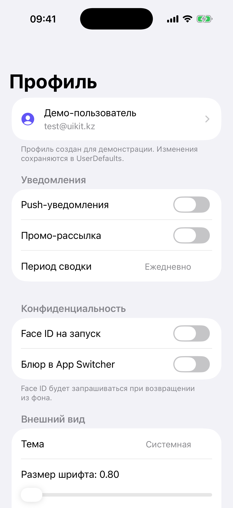

# Глава 19. Profile / Settings — insetGrouped с разными типами ячеек

{width=45%}

Экран настроек — самый «системный» из всех. Приложения повторяют
устройство системных «Настроек»: таблица в стиле `insetGrouped`
(секции-карточки со скруглёнными углами и отступом от краёв), заголовки
и пояснения под секциями, разные виды строк — переключатель, счётчик
«+/−», ползунок, выбор из списка, переход дальше, кнопка.

В этой главе строим такой экран. Все виды строк описываем
**декларативно**: экран — это массив данных «какие секции и какие в них
строки», а одна функция превращает каждую строку в ячейку.

```
┌──────────────────────────────────┐
│ Профиль                          │
│ ╭──────────────────────────────╮ │
│ │ (фото) Демо-пользователь   > │ │ ← .account: тап — выбрать фото
│ │        test@uikit.kz         │ │
│ ╰──────────────────────────────╯ │
│  Нажми на профиль, чтобы …       │ ← footer секции
│ УВЕДОМЛЕНИЯ                      │ ← header секции
│ ╭──────────────────────────────╮ │
│ │ Push-уведомления        (●○) │ │ ← .toggle
│ │ Промо-рассылка          (○●) │ │
│ │ Период сводки  Ежедневно  <> │ │ ← .picker (UIMenu)
│ ╰──────────────────────────────╯ │
│ ВНЕШНИЙ ВИД                      │
│ ╭──────────────────────────────╮ │
│ │ Тема           Системная  <> │ │
│ │ Карточек на экране  3  [−|+] │ │ ← .stepper
│ │ Масштаб шрифта: 1.00         │ │ ← .slider (своя ячейка)
│ │ ━━━━━━━━●━━━━━━━━━━━━━━━━━━  │ │
│ ╰──────────────────────────────╯ │
│ ╭──────────────────────────────╮ │
│ │ Версия               1.0   > │ │ ← .disclosure
│ ╰──────────────────────────────╯ │
│ ╭──────────────────────────────╮ │
│ │            Выйти             │ │ ← .button
│ │       Удалить аккаунт        │ │ ← .button, красная
│ ╰──────────────────────────────╯ │
└──────────────────────────────────┘
```

Файлы:

```
Apps/Profile/
├── SettingsModel.swift          ← enum строк, секция, subscript(safe:)
├── SliderCell.swift             ← отдельная ячейка для ползунка
├── AvatarStore.swift            ← аватар в файле
└── ProfileViewController.swift  ← экран, ячейки, действия, PHPicker
```

`AuthStorage` — хранилище токена из главы 8 (раздел 8.3): у него
есть `token` и `clear()`.

> **Режим сборки** — как во введении: Swift 6, `Default Actor
> Isolation = MainActor`, iOS 15+. Единственное место главы, где код
> приходит с фонового потока, — выбор фото в 19.11, там разберём, как
> вернуться на главный.

## 19.1 Декларативный массив секций

Главное — отделить **описание** экрана от **отрисовки**. Описание —
массив значений, отрисовка — одна общая функция.

```swift
import UIKit

enum SettingsRow {
    case account(name: String, email: String, avatar: UIImage?)
    case toggle(title: String, key: String)
    case stepper(title: String, key: String, range: ClosedRange<Int>)
    case slider(title: String, key: String, range: ClosedRange<Float>)
    case picker(title: String, key: String, options: [String])
    case disclosure(title: String, value: String?, action: () -> Void)
    case button(title: String, isDestructive: Bool, action: () -> Void)
}

struct SettingsSection {
    let title: String?
    let footer: String?
    let rows: [SettingsRow]
}

extension Collection {
    /// Элемент по индексу или nil, если индекс за пределами — вместо падения.
    subscript(safe index: Index) -> Element? {
        indices.contains(index) ? self[index] : nil
    }
}
```

**`SettingsRow`** — перечисление со связанными значениями (associated
values): у каждого варианта свои данные. Переключателю нужны заголовок
и ключ, под которым хранится значение; счётчику — ещё и диапазон;
кнопке — действие. Один вариант = один вид строки.

**`key`** — имя настройки в `UserDefaults`. UserDefaults — простое
хранилище «ключ → значение» для пользовательских настроек, которое
сохраняется между запусками приложения. Для токенов и паролей не
годится (он хранится в открытом виде, для них — Keychain из главы 8),
а для «включены ли push» — ровно то, что нужно.

**`action: () -> Void`** — замыкание прямо в данных. Строка сама
знает, что делать при нажатии, и контроллеру не нужен отдельный `switch`
по заголовкам.

**`subscript(safe:)`** — безопасный доступ по индексу:
`options[safe: 5]` вернёт `nil`, если элементов меньше шести. Это
не встроенный метод Swift: без этого объявления код не соберётся. Нам
он нужен в выборе из списка: в `UserDefaults`
может лежать номер варианта, которого в новой версии приложения уже
нет.

Экран строит массив секций в одном месте:

```swift
import UIKit

extension ProfileViewController {
    func rebuildSections() {
        let email = AuthStorage.shared.token != nil ? "test@uikit.kz" : "—"
        let version = Bundle.main.object(forInfoDictionaryKey: "CFBundleShortVersionString") as? String

        sections = [
            SettingsSection(
                title: nil,
                footer: "Нажми на профиль, чтобы выбрать фото. Доступ ко всей медиатеке для этого не нужен.",
                rows: [.account(name: "Демо-пользователь", email: email, avatar: AvatarStore.load())]
            ),
            SettingsSection(title: "Уведомления", footer: nil, rows: [
                .toggle(title: "Push-уведомления", key: "settings.push"),
                .toggle(title: "Промо-рассылка", key: "settings.promo"),
                .picker(title: "Период сводки", key: "settings.digestPeriod",
                        options: ["Ежедневно", "Еженедельно", "Ежемесячно"]),
            ]),
            SettingsSection(title: "Внешний вид", footer: "Тема меняется сразу, без перезапуска.", rows: [
                .picker(title: "Тема", key: ProfileViewController.themeKey,
                        options: ["Системная", "Светлая", "Тёмная"]),
                .stepper(title: "Карточек на экране", key: "settings.cardsPerScreen", range: 1...10),
                .slider(title: "Масштаб шрифта", key: "settings.fontScale", range: 0.8...1.4),
            ]),
            SettingsSection(title: "О приложении", footer: nil, rows: [
                .disclosure(title: "Версия", value: version) { [weak self] in self?.showAbout() },
            ]),
            SettingsSection(
                title: nil,
                footer: "Удаление здесь демонстрационное. Как устроено настоящее — в главе 40.",
                rows: [
                    .button(title: "Выйти", isDestructive: false) { [weak self] in self?.logout() },
                    .button(title: "Удалить аккаунт", isDestructive: true) { [weak self] in
                        self?.confirmDelete()
                    },
                ]
            ),
        ]
        tableView.reloadData()
    }
}
```

Чтобы переставить строки или добавить новую настройку, меняешь только
**массив**. Чтобы добавить новый **вид** строки, добавляешь вариант в
`SettingsRow` и его отрисовку (компилятор сам напомнит: `switch` по
перечислению без нового варианта не соберётся).

`CFBundleShortVersionString` — номер версии приложения из Info.plist
(«1.0»), тот, что видят пользователи в App Store.

**`[weak self]` в действиях.** Массив `sections` хранится в
контроллере, а замыкания внутри него ссылаются на контроллер. Сильная
ссылка замкнула бы кольцо «контроллер → массив → замыкание →
контроллер», и экран настроек никогда не освободился бы из памяти.

> **Подсказка.** Такой подход похож на `Form` в SwiftUI. В
> классическом UIKit-коде обычно пишут `switch indexPath.section` в
> каждом методе таблицы. Декларативный массив чище: всё описание
> экрана в одном месте, а `numberOfSections`, `numberOfRowsInSection` и
> `cellForRowAt` просто читают его.

## 19.2 Строка аккаунта — картинка и два текста

Отрисовку разобьём на маленькие методы, по одному на вид строки. Общий
`cellForRowAt` (19.12) только выбирает нужный.

```swift
import UIKit

extension ProfileViewController {
    func configureAccount(_ cell: UITableViewCell, name: String, email: String, avatar: UIImage?) {
        var content = cell.defaultContentConfiguration()
        content.text = name
        content.secondaryText = email
        content.image = avatar ?? UIImage(systemName: "person.crop.circle.fill")
        content.imageProperties.tintColor = .systemIndigo
        content.imageProperties.maximumSize = CGSize(width: 44, height: 44)
        content.imageProperties.reservedLayoutSize = CGSize(width: 44, height: 44)
        content.imageProperties.cornerRadius = 22
        cell.contentConfiguration = content
        cell.accessoryType = .disclosureIndicator
    }
}
```

`UIListContentConfiguration` (iOS 14+) — современный способ заполнить
стандартную ячейку. Берёшь заготовку `cell.defaultContentConfiguration()`,
заполняешь поля и присваиваешь `cell.contentConfiguration`. Раньше
писали `cell.textLabel?.text` и `cell.detailTextLabel?.text`; эти
свойства объявлены устаревшими.

- `text` и `secondaryText` — основной текст и подпись под ним, мельче и
  серее.
- `image` — выбранное фото или системный значок человечка.
- `imageProperties.tintColor` — цвет значка (на фото не действует).
- `maximumSize` 44×44 — картинка не больше этого; фото 300×300 иначе
  раздуло бы строку.
- `reservedLayoutSize` — место под картинку, даже если она меньше.
  Без него текст сдвигался бы при смене значка на фото.
- `cornerRadius = 22` — половина стороны 44, картинка становится
  кругом.

`accessoryType = .disclosureIndicator` — серая стрелка «›» справа,
знак «нажми, откроется что-то ещё».

## 19.3 Переключатель — UISwitch в accessoryView

```swift
import UIKit

extension ProfileViewController {
    func configureToggle(_ cell: UITableViewCell, title: String, key: String) {
        var content = cell.defaultContentConfiguration()
        content.text = title
        cell.contentConfiguration = content

        let toggle = UISwitch()
        toggle.isOn = UserDefaults.standard.bool(forKey: key)
        toggle.accessibilityLabel = title
        toggle.addAction(UIAction { action in
            guard let sender = action.sender as? UISwitch else { return }
            UserDefaults.standard.set(sender.isOn, forKey: key)
        }, for: .valueChanged)
        cell.accessoryView = toggle
        cell.selectionStyle = .none
    }
}
```

`accessoryView` — место справа в ячейке, куда можно положить любой
вид. Переключатель — самый частый гость.

`addAction(UIAction { ... }, for: .valueChanged)` (iOS 14+) —
обработчик замыканием, без `@objc`-метода. Значение берём из
`action.sender` — элемента, который вызвал действие, — а не из
переменной `toggle`. Если захватить `toggle` в замыкании, получится
кольцо: переключатель держит action, action держит замыкание,
замыкание держит переключатель. Каждый переключатель при прокрутке
оставался бы в памяти. В списке захвата только `key` — строка, и
`self` не нужен вовсе.

`as? UISwitch` с `guard` вместо `as! UISwitch` — если однажды
обработчик окажется не на том элементе, ничего не случится, а не
упадёт приложение.

`UserDefaults.standard.bool(forKey:)` вернёт `false`, если значение
ещё ни разу не сохраняли, — для переключателя это разумное начальное
положение.

`selectionStyle = .none` — строка не подсвечивается серым при тапе:
реагирует только сам переключатель.

## 19.4 Счётчик «+/−» — UIStepper для целых чисел

```swift
import UIKit

extension ProfileViewController {
    func configureStepper(_ cell: UITableViewCell, title: String, key: String, range: ClosedRange<Int>) {
        let value = UserDefaults.standard.object(forKey: key) as? Int ?? range.lowerBound
        var content = cell.defaultContentConfiguration()
        content.text = title
        content.secondaryText = "\(value)"
        content.prefersSideBySideTextAndSecondaryText = true
        cell.contentConfiguration = content

        let stepper = UIStepper()
        stepper.minimumValue = Double(range.lowerBound)
        stepper.maximumValue = Double(range.upperBound)
        stepper.value = Double(value)
        stepper.accessibilityLabel = title
        stepper.addAction(UIAction { [weak cell] action in
            guard let sender = action.sender as? UIStepper else { return }
            let newValue = Int(sender.value)
            UserDefaults.standard.set(newValue, forKey: key)
            // Меняем текст на месте, а не перезагружаем строку: перезагрузка
            // заменила бы степпер под пальцем, и зажатый «+» перестал бы повторяться.
            guard let cell,
                  var updated = cell.contentConfiguration as? UIListContentConfiguration else { return }
            updated.secondaryText = "\(newValue)"
            cell.contentConfiguration = updated
        }, for: .valueChanged)
        cell.accessoryView = stepper
        cell.selectionStyle = .none
    }
}
```

`UIStepper` — две кнопки «−» и «+». Само значение он не показывает,
только меняет, поэтому число выводим в `secondaryText`.

**Значение по умолчанию.** `UserDefaults.standard.integer(forKey:)`
вернул бы 0 для несохранённого ключа, а 0 вне нашего диапазона 1…10.
Поэтому читаем `object(forKey:) as? Int`: `nil` значит «ещё не
сохраняли», и тогда берём нижнюю границу диапазона.

`prefersSideBySideTextAndSecondaryText = true` — заголовок слева,
значение справа в одну строку, как «Карточек на экране 3».

**Обновление на месте.** Напрашивается после каждого нажатия звать
`tableView.reloadRows(at: [indexPath], with: .none)`. Но перезагрузка строки берёт для неё ячейку заново — и степпер под
пальцем заменяется новым. Если зажать «+», степпер обычно повторяет
нажатия (1, 2, 3, 4…), но после замены повтор обрывается на первом
шаге. Поэтому мы меняем только текст: достаём текущую конфигурацию,
правим `secondaryText` и присваиваем обратно. `[weak cell]` — степпер
живёт внутри ячейки, и сильная ссылка из его обработчика на ячейку
снова дала бы кольцо.

**Значения на числах.** `UIStepper` работает с `Double` (у него шаг
может быть дробным), поэтому границы переводим `Double(1)`,
`Double(10)`, а результат обратно `Int(sender.value)`. С шагом 1 по
умолчанию дробей не бывает, и `Int(3.0)` даёт ровно 3.

## 19.5 Ползунок — отдельная ячейка

Ползунок широкий, в `accessoryView` он не помещается. Первое, что
приходит в голову: в `cellForRowAt` удалять из `contentView` все виды и
добавлять новые стек, метку и ползунок. У этого подхода три беды:

- ячейка общая для всех видов строк, и если её переиспользовать под
  переключатель, поверх `contentConfiguration` оставались бы остатки
  ползунка — а `contentConfiguration = nil` их не убирает;
- замыкание ползунка захватывало сам ползунок — кольцо, как в 19.3;
- каждая перерисовка создавала стек и ограничения заново.

Правильный путь в UIKit — **отдельный класс ячейки со своим
идентификатором**. Ползунок создаётся один раз в `init`, а при
переиспользовании меняются только значения.

```swift
import UIKit

final class SliderCell: UITableViewCell {
    static let reuseID = "SliderCell"

    private let titleLabel = UILabel()
    private let slider = UISlider()
    private var title = ""
    private var key = ""

    override init(style: UITableViewCell.CellStyle, reuseIdentifier: String?) {
        super.init(style: style, reuseIdentifier: reuseIdentifier)
        selectionStyle = .none
        titleLabel.font = .preferredFont(forTextStyle: .body)
        titleLabel.adjustsFontForContentSizeCategory = true
        titleLabel.numberOfLines = 0
        slider.addAction(UIAction { [weak self] _ in self?.valueChanged() }, for: .valueChanged)

        let stack = UIStackView(arrangedSubviews: [titleLabel, slider])
        stack.axis = .vertical
        stack.spacing = 8
        stack.translatesAutoresizingMaskIntoConstraints = false
        contentView.addSubview(stack)
        let margins = contentView.layoutMarginsGuide
        NSLayoutConstraint.activate([
            stack.topAnchor.constraint(equalTo: margins.topAnchor),
            stack.bottomAnchor.constraint(equalTo: margins.bottomAnchor),
            stack.leadingAnchor.constraint(equalTo: margins.leadingAnchor),
            stack.trailingAnchor.constraint(equalTo: margins.trailingAnchor),
        ])
    }

    required init?(coder: NSCoder) { fatalError("init(coder:) не используется") }

    func configure(title: String, key: String, range: ClosedRange<Float>) {
        self.title = title
        self.key = key
        slider.minimumValue = range.lowerBound
        slider.maximumValue = range.upperBound
        slider.value = UserDefaults.standard.object(forKey: key) as? Float ?? range.lowerBound
        slider.accessibilityLabel = title
        updateLabel()
    }

    private func valueChanged() {
        UserDefaults.standard.set(slider.value, forKey: key)
        updateLabel()
    }

    private func updateLabel() {
        titleLabel.text = "\(title): \(String(format: "%.2f", slider.value))"
    }
}
```

- **`layoutMarginsGuide`** — стандартные внутренние поля ячейки
  (layout margins). В таблице `insetGrouped` на iPhone это около 16
  точек по бокам и 11 сверху и снизу — система подбирает их сама, и
  ползунок стоит ровно по линии текста соседних строк.
- **Стек** — метка сверху, ползунок снизу, 8 точек между ними. Высота
  ячейки складывается из ограничений сама.
- **`[weak self]`** в обработчике — ползунок принадлежит ячейке, и
  сильная ссылка из обработчика на ячейку замкнула бы кольцо.
- **`key` и `title` хранятся в ячейке** — ячейку могут переиспользовать
  для другой настройки с другим ключом, и обработчик должен писать туда,
  куда указывает последняя `configure`, а не первая.
- **`String(format: "%.2f", ...)`** — число с двумя знаками после
  точки. `Float` не умеет хранить большинство десятичных дробей точно:
  0,8 внутри хранится как 0,800000011920929, и без форматирования в
  подписи вылезали бы эти «хвосты». `%.2f` округляет до сотых: «0.80».
- **`numberOfLines = 0`** у метки — при крупном шрифте (Dynamic Type)
  подпись переносится, а не обрезается.

`UserDefaults` хранит `Float` как число, и `object(forKey:) as? Float`
вернёт его обратно; если ключа нет — нижняя граница диапазона, 0.8.

> **Осторожно.** Правило переиспользования ячеек короткое: всё, что
> ячейка может показать, должно выставляться при **каждой** настройке
> или сбрасываться в `prepareForReuse`. Добавлять виды в `contentView`
> из `cellForRowAt` — почти всегда ошибка: через десять прокруток в
> ячейке окажется десять копий.

## 19.6 Выбор из списка — UIMenu на кнопке

```swift
import UIKit

extension ProfileViewController {
    func configurePicker(_ cell: UITableViewCell, title: String, key: String,
                         options: [String], indexPath: IndexPath) {
        let selectedIndex = UserDefaults.standard.integer(forKey: key)
        var content = cell.defaultContentConfiguration()
        content.text = title
        content.secondaryText = options[safe: selectedIndex] ?? options.first
        content.prefersSideBySideTextAndSecondaryText = true
        cell.contentConfiguration = content

        let actions = options.enumerated().map { index, option in
            UIAction(title: option, state: index == selectedIndex ? .on : .off) { [weak self] _ in
                UserDefaults.standard.set(index, forKey: key)
                if key == Self.themeKey { self?.applyTheme(index: index) }
                self?.tableView.reloadRows(at: [indexPath], with: .none)
            }
        }
        let button = UIButton(type: .system)
        button.menu = UIMenu(children: actions)
        button.showsMenuAsPrimaryAction = true
        button.setImage(UIImage(systemName: "chevron.up.chevron.down"), for: .normal)
        button.tintColor = .tertiaryLabel
        button.accessibilityLabel = title
        button.accessibilityValue = options[safe: selectedIndex]
        button.sizeToFit()   // у accessoryView должен быть размер, иначе кнопку не видно
        cell.accessoryView = button
        cell.selectionStyle = .none
    }

    static let themeKey = "settings.theme"

    func applyTheme(index: Int) {
        let styles: [UIUserInterfaceStyle] = [.unspecified, .light, .dark]
        view.window?.overrideUserInterfaceStyle = styles[safe: index] ?? .unspecified
    }
}
```

Вместо отдельного экрана со списком кладём в строку кнопку с меню
`UIMenu` (iOS 14+). Тап — всплывает список вариантов, выбор сохраняется
и строка обновляется.

- **`UIAction(title:state:)`** — пункт меню. `state: .on` ставит
  галочку у текущего варианта.
- **`button.menu` + `showsMenuAsPrimaryAction = true`** — меню
  открывается обычным тапом. Без второй строки оно открывалось бы
  только долгим нажатием.
- **`chevron.up.chevron.down`** — две стрелки, привычный значок
  «выпадающего списка».
- **`sizeToFit()`** — важная строка, которую легко забыть.
  `accessoryView` ставится с тем размером, который у вида уже есть. У
  `UISwitch` и `UIStepper` размер задан с рождения, а `UIButton()` —
  прямоугольник 0×0: кнопка была бы невидимой и ненажимаемой.
  `sizeToFit()` подгоняет кнопку под картинку.
- **`reloadRows` здесь уместен** — к моменту выбора меню уже закрыто,
  и заменить кнопку «под пальцем» нельзя, в отличие от степпера (19.4).
- **`indexPath` в замыкании.** Строки нашего экрана не двигаются, так
  что номер строки не устаревает. Если бы строки добавлялись и
  удалялись, номер пришлось бы искать заново в момент выбора.
- **`integer(forKey:)`** для номера варианта: 0 для несохранённого ключа
  — это первый вариант, «Ежедневно», и такое значение по умолчанию нас
  устраивает. `[safe:]` защищает от номера, которого нет в списке.

**Тема.** Выбор в строке «Тема» сразу меняет оформление:
`overrideUserInterfaceStyle` у окна (window — корневой вид, в котором
живут все экраны приложения) заставляет всё в нём рисоваться в светлой
или тёмной теме. `.unspecified` — «как в системе». В playground окно
общее для всех мини-приложений, так что тема сменится и у лаунчера.
Выбранная тема применяется ещё и при появлении экрана (19.12) —
иначе после перезапуска она бы не восстановилась.

> **Подсказка.** До iOS 14 выбор из списка делали переходом на
> отдельный экран с таблицей вариантов или `UIPickerView`. С `UIMenu`
> короче и привычнее для пользователя — так устроены многие строки
> системных «Настроек».

> **Упражнение 19.1.** Добавь в секцию «Внешний вид» строку «Язык
> интерфейса» с вариантами «Русский», «Қазақша», «English».
> Проверка: выбери «English», закрой и снова открой профиль — в строке
> по-прежнему «English». Решение — в конце главы.

## 19.7 Строка-переход — disclosure

```swift
import UIKit

extension ProfileViewController {
    func configureDisclosure(_ cell: UITableViewCell, title: String, value: String?) {
        var content = cell.defaultContentConfiguration()
        content.text = title
        content.secondaryText = value
        content.prefersSideBySideTextAndSecondaryText = true
        cell.contentConfiguration = content
        cell.accessoryType = .disclosureIndicator
    }
}
```

Строка-ссылка: тап открывает что-то новое — алерт, соседний экран,
лист. Справа можно показать текущее значение («Версия — 1.0»).

Действие хранится в самой строке (`.disclosure(..., action:)`) и
вызывается в методе делегата `didSelectRowAt`:

```swift
import UIKit

extension ProfileViewController: UITableViewDelegate {
    func tableView(_ tableView: UITableView, didSelectRowAt indexPath: IndexPath) {
        switch sections[indexPath.section].rows[indexPath.row] {
        case .account:
            pickAvatar()
        case let .disclosure(_, _, action), let .button(_, _, action):
            action()
        default:
            break
        }
        tableView.deselectRow(at: indexPath, animated: true)
    }
}
```

`case let .disclosure(_, _, action), let .button(_, _, action):` —
один `case` на два варианта: у обоих есть `action` одного типа, и
Swift разрешает связать его в обеих ветках одним именем.

**`deselectRow` после действия.** Строка подсвечивается при тапе, и
подсветку снимаем с анимацией — пользователь видит, какую строку
нажал. Мы снимаем её **после** вызова действия: `logout()` (19.9)
берёт выделенную строку, чтобы привязать к ней всплывающее окно на
iPad.

## 19.8 Строка-кнопка — обычная и опасная

```swift
import UIKit

extension ProfileViewController {
    func configureButton(_ cell: UITableViewCell, title: String, isDestructive: Bool) {
        var content = cell.defaultContentConfiguration()
        content.text = title
        content.textProperties.color = isDestructive ? .systemRed : .systemBlue
        content.textProperties.alignment = .center
        cell.contentConfiguration = content
        cell.accessibilityTraits = .button
    }
}
```

Текст по центру, синий (обычное действие) или красный (опасное,
destructive — «разрушительное», после которого данные пропадают).
Никаких стрелок справа — вся строка работает как кнопка.

`textProperties.color` и `textProperties.alignment` — цвет и
выравнивание текста внутри конфигурации. Со старым API это были
`textLabel?.textColor` и `textLabel?.textAlignment`.

`accessibilityTraits = .button` — трейт (признак) для VoiceOver: он
скажет «Выйти, кнопка», и пользователь поймёт, что строку можно
нажать.

Центрированный цветной текст — стиль системных «Настроек» для
действий вроде «Выйти» и «Удалить аккаунт».

## 19.9 Опасные действия — подтверждение

«Выйти» и «Удалить аккаунт» — действия, после которых данные теряются.
Перед ними всегда спрашиваем подтверждение.

```swift
import UIKit

extension ProfileViewController {
    func showAbout() {
        let alert = UIAlertController(title: "UIKit Playground",
                                      message: "Демо-экран настроек из главы 19.",
                                      preferredStyle: .alert)
        alert.addAction(UIAlertAction(title: "OK", style: .default))
        present(alert, animated: true)
    }

    func logout() {
        let alert = UIAlertController(title: "Выйти?",
                                      message: "Понадобится войти заново.",
                                      preferredStyle: .actionSheet)
        alert.addAction(UIAlertAction(title: "Выйти", style: .destructive) { [weak self] _ in
            AuthStorage.shared.clear()
            self?.rebuildSections()
        })
        alert.addAction(UIAlertAction(title: "Отмена", style: .cancel))
        // На iPad action sheet показывается всплывающим окном, и ему нужна точка привязки.
        if let popover = alert.popoverPresentationController {
            if let row = tableView.indexPathForSelectedRow, let cell = tableView.cellForRow(at: row) {
                popover.sourceView = cell
                popover.sourceRect = cell.bounds
            } else {
                popover.sourceView = view
                popover.sourceRect = CGRect(x: view.bounds.midX, y: view.bounds.midY, width: 0, height: 0)
            }
        }
        present(alert, animated: true)
    }

    func confirmDelete() {
        let alert = UIAlertController(title: "Удалить аккаунт?",
                                      message: "Это действие необратимо. Все данные удалятся.",
                                      preferredStyle: .alert)
        alert.addAction(UIAlertAction(title: "Отмена", style: .cancel))
        alert.addAction(UIAlertAction(title: "Удалить", style: .destructive) { [weak self] _ in
            AuthStorage.shared.clear()
            AvatarStore.clear()
            self?.rebuildSections()
        })
        present(alert, animated: true)
    }
}
```

Два стиля `UIAlertController`:

- **`.actionSheet`** — список действий снизу экрана. Для решений
  полегче: выйти, поделиться, выбрать из вариантов.
- **`.alert`** — окно посередине, внимание сильнее. Для серьёзного:
  удалить, сбросить.

**iPad.** На iPad action sheet показывается всплывающим окном
(popover) со стрелкой, и системе нужно знать, **на что** указывать
стрелкой; без точки привязки показ на iPad падает. `popoverPresentationController` существует
только на iPad (на iPhone он `nil`), поэтому код внутри `if let`
на телефоне не выполняется. Привязываем окно к выбранной строке, а
если строки нет — к центру экрана.

**Стили кнопок.** `style: .destructive` — красный текст, сигнал
«осторожно». `style: .cancel` — отмена; система сама ставит её на
привычное место, в каком бы порядке ты ни добавлял кнопки: в `.alert`
с двумя кнопками отмена оказывается слева, в `.actionSheet` — отдельной
кнопкой внизу. Кнопка `.cancel` в одном алерте может быть только одна.

После действия `rebuildSections()` перестраивает экран: почта в строке
аккаунта станет «—», фото пропадёт.

> **Удаление аккаунта в App Store.** По правилу 5.1.1(v) App Store
> Review Guidelines приложение, где можно создать аккаунт, обязано
> давать и удалить его изнутри приложения — по-настоящему, с удалением
> данных на сервере, а не только выходом. Наша кнопка лишь стирает
> локальные данные. Как устроен настоящий процесс — в главе 40.

## 19.10 Заголовок и пояснение секции

```swift
import UIKit

extension ProfileViewController: UITableViewDataSource {
    func numberOfSections(in tableView: UITableView) -> Int {
        sections.count
    }

    func tableView(_ tableView: UITableView, numberOfRowsInSection section: Int) -> Int {
        sections[section].rows.count
    }

    func tableView(_ tableView: UITableView, titleForHeaderInSection section: Int) -> String? {
        sections[section].title
    }

    func tableView(_ tableView: UITableView, titleForFooterInSection section: Int) -> String? {
        sections[section].footer
    }
}
```

Все четыре метода только читают массив `sections` — вот где
окупается декларативность. `nil` вместо заголовка или пояснения —
секция без него.

Оформление система делает сама: заголовок — мелкий серый текст над
карточкой, пояснение (footer) — мелкий серый текст под ней, с
переносом строк.

- **Header** — название группы: «Уведомления», «Внешний вид».
- **Footer** — объяснение «зачем это»: «Тема меняется сразу, без
  перезапуска».

В системных «Настройках» пояснения под секциями встречаются на каждом
шагу, и пользователи привыкли в них заглядывать. Пиши их там, где
назначение настройки неочевидно.

## 19.11 Аватар через PHPicker — без доступа к медиатеке

Тап по строке аккаунта открывает системный выбор фото,
`PHPickerViewController` (iOS 14+). Он работает в **отдельном
процессе** системы: приложение не видит медиатеку, получает только то
фото, которое пользователь выбрал. Поэтому **разрешение на доступ к
фото не нужно** — ни системного диалога, ни ключа
`NSPhotoLibraryUsageDescription` в Info.plist. (Сравнение уровней
доступа к медиатеке — в таблице раздела 16.10 главы 16.)

```swift
import PhotosUI
import UIKit

extension ProfileViewController: PHPickerViewControllerDelegate {
    func pickAvatar() {
        var config = PHPickerConfiguration()
        config.filter = .images
        config.selectionLimit = 1
        let picker = PHPickerViewController(configuration: config)
        picker.delegate = self
        present(picker, animated: true)
    }

    func picker(_ picker: PHPickerViewController, didFinishPicking results: [PHPickerResult]) {
        picker.dismiss(animated: true)
        guard let provider = results.first?.itemProvider,
              provider.canLoadObject(ofClass: UIImage.self) else { return }

        provider.loadObject(ofClass: UIImage.self) { object, _ in
            // Сюда приходим на фоновой очереди.
            guard let image = object as? UIImage,
                  let small = image.preparingThumbnail(of: CGSize(width: 300, height: 300)) else { return }
            Task { @MainActor [weak self] in
                AvatarStore.save(small)
                self?.rebuildSections()
            }
        }
    }
}
```

- **`PHPickerConfiguration`** — настройки: `filter = .images` (только
  фото, без видео), `selectionLimit = 1` (одно фото; 0 значит «сколько
  угодно»).
- **`didFinishPicking`** вызывается и при выборе, и при отмене — тогда
  `results` пустой, и `guard` просто выходит. Закрывать picker нужно
  самому, в обоих случаях.
- **`itemProvider`** — «поставщик» выбранного файла. Картинку он
  отдаёт не сразу: оригинал может лежать в iCloud и скачиваться.
  `loadObject(ofClass: UIImage.self)` загружает и превращает в
  `UIImage`.
- **Фоновый поток.** Обработчик `loadObject` система вызывает на
  фоновой очереди — так написано в документации `NSItemProvider`, и
  замыкание помечено `@Sendable`. Трогать интерфейс и `self`
  (он на main actor) здесь нельзя. Уменьшаем фото прямо в фоне, а
  сохраняем и перерисовываем в `Task { @MainActor in ... }` — задаче,
  которая выполнится на главном потоке.
- **`preparingThumbnail(of:)`** (iOS 15+) — уменьшенная копия
  картинки. Фото с камеры — 4032×3024 пикселей: в распакованном виде
  4032 × 3024 × 4 байта ≈ 49 МБ памяти. Для аватара в 44 точки
  (132 пикселя на экране @3x) хватает 300×300 — это 300 × 300 × 4 ≈
  0,36 МБ, в 135 раз меньше. Метод сохраняет пропорции: 300×300 — это
  рамка, в которую фото вписывается, а круглая маска в строке обрежет
  лишнее.

Хранилище аватара:

```swift
import UIKit

/// Аватар живёт файлом в Application Support, а не в UserDefaults:
/// картинка на сотни килобайт замедлила бы чтение всех настроек.
enum AvatarStore {
    private static var fileURL: URL? {
        guard let dir = FileManager.default.urls(for: .applicationSupportDirectory,
                                                 in: .userDomainMask).first else { return nil }
        try? FileManager.default.createDirectory(at: dir, withIntermediateDirectories: true)
        return dir.appendingPathComponent("avatar.jpg")
    }

    static func load() -> UIImage? {
        guard let url = fileURL, let data = try? Data(contentsOf: url) else { return nil }
        return UIImage(data: data)
    }

    static func save(_ image: UIImage) {
        guard let url = fileURL, let data = image.jpegData(compressionQuality: 0.8) else { return }
        try? data.write(to: url, options: .atomic)
    }

    static func clear() {
        guard let url = fileURL else { return }
        try? FileManager.default.removeItem(at: url)
    }
}
```

- **Application Support** — папка внутри песочницы приложения (sandbox —
  отдельный каталог, куда другие приложения доступа не имеют) для
  файлов, которые нужны приложению, но не видны пользователю в
  «Файлах». В отличие от Caches, система её не чистит. Папка
  создаётся не сразу, поэтому `createDirectory(...,
  withIntermediateDirectories: true)` — «создай, если нет; если есть —
  ничего страшного».
- **Почему не UserDefaults.** Весь `UserDefaults` загружается в память
  целиком при первом обращении. Картинка в нём замедляла бы чтение
  любой настройки.
- **`jpegData(compressionQuality: 0.8)`** — сжатие JPEG с качеством 80%:
  на глаз неотличимо, файл заметно меньше.
- **`.atomic`** — запись сначала во временный файл, потом подмена. Если
  приложение упадёт посреди записи, останется старый аватар, а не
  половина нового.

> **Упражнение 19.2.** Сейчас тап по профилю сразу открывает выбор фото.
> Сделай так, чтобы при уже выбранном фото сначала появлялся action
> sheet «Выбрать другое фото / Удалить фото / Отмена», а без фото —
> сразу выбор, как раньше. Проверка: после «Удалить фото» в строке
> снова значок человечка. Решение — в конце главы.

## 19.12 Собираем ProfileViewController

```swift
import UIKit

final class ProfileViewController: UIViewController {
    let tableView = UITableView(frame: .zero, style: .insetGrouped)
    var sections: [SettingsSection] = []

    override func viewDidLoad() {
        super.viewDidLoad()
        title = "Профиль"
        tableView.dataSource = self
        tableView.delegate = self
        tableView.register(UITableViewCell.self, forCellReuseIdentifier: "Cell")
        tableView.register(SliderCell.self, forCellReuseIdentifier: SliderCell.reuseID)
        tableView.frame = view.bounds
        tableView.autoresizingMask = [.flexibleWidth, .flexibleHeight]
        view.addSubview(tableView)
        rebuildSections()
    }

    override func viewDidAppear(_ animated: Bool) {
        super.viewDidAppear(animated)
        applyTheme(index: UserDefaults.standard.integer(forKey: Self.themeKey))
    }
}

extension ProfileViewController {
    func tableView(_ tableView: UITableView, cellForRowAt indexPath: IndexPath) -> UITableViewCell {
        let row = sections[indexPath.section].rows[indexPath.row]

        if case let .slider(title, key, range) = row {
            let cell = tableView.dequeueReusableCell(withIdentifier: SliderCell.reuseID, for: indexPath)
            (cell as? SliderCell)?.configure(title: title, key: key, range: range)
            return cell
        }

        let cell = tableView.dequeueReusableCell(withIdentifier: "Cell", for: indexPath)
        // Ячейка могла прийти из-под строки другого вида — сбрасываем всё, что меняют методы ниже.
        cell.accessoryView = nil
        cell.accessoryType = .none
        cell.selectionStyle = .default
        cell.accessibilityTraits = .none

        switch row {
        case let .account(name, email, avatar):
            configureAccount(cell, name: name, email: email, avatar: avatar)
        case let .toggle(title, key):
            configureToggle(cell, title: title, key: key)
        case let .stepper(title, key, range):
            configureStepper(cell, title: title, key: key, range: range)
        case let .picker(title, key, options):
            configurePicker(cell, title: title, key: key, options: options, indexPath: indexPath)
        case let .disclosure(title, value, _):
            configureDisclosure(cell, title: title, value: value)
        case let .button(title, isDestructive, _):
            configureButton(cell, title: title, isDestructive: isDestructive)
        case .slider:
            break   // обработан выше своей ячейкой
        }
        return cell
    }
}
```

**`.insetGrouped`** (iOS 13+) — стиль таблицы настроек: каждая секция
— отдельная скруглённая карточка с отступом от краёв экрана. Фон
таблицы в этом стиле серый (`.systemGroupedBackground`), карточки —
белые, в тёмной теме наоборот — система подбирает сама.

**Два идентификатора ячеек.** `"Cell"` — обычная `UITableViewCell` для
всех видов строк, кроме ползунка; `SliderCell.reuseID` — своя ячейка.
Ячейка ползунка никогда не придёт под переключатель, и наоборот.

**Сброс перед настройкой.** Общая ячейка переходит от строки к строке:
была переключателем — стала кнопкой. Если не сбрасывать
`accessoryView`, строка «Выйти», получив ячейку из-под «Push-
уведомлений», покажет чужой переключатель. Четыре строки сброса
перед `switch` выставляют то, что каждый вид строки меняет «по
желанию»: `accessoryView`, `accessoryType`, `selectionStyle`,
`accessibilityTraits`. `contentConfiguration` сбрасывать не нужно —
каждый метод `configure…` присваивает его заново.

**Свойства без `private`.** Методы из 19.1–19.11 — расширения в других
файлах, а `private` в Swift виден только внутри одного файла. Поэтому
`tableView` и `sections` открыты на уровне модуля.

**Тема в `viewDidAppear`.** Окно (`view.window`) у экрана появляется
только когда экран на экране: в `viewDidLoad` оно ещё `nil`. Поэтому
сохранённую тему применяем в `viewDidAppear`.

**Кадр и autoresizing.** Таблица занимает весь `view`: задаём кадр
`view.bounds` и `autoresizingMask` — таблица тянется вместе с `view`
при повороте. Для «одного вида на весь экран» это короче, чем четыре
ограничения. Отступы под навигационную панель и полоску «домой»
таблица сделает сама (`contentInsetAdjustmentBehavior = .automatic`).

## 19.13 Бытовая аналогия

Экран настроек — **передняя панель старого усилителя**. Тумблеры
(переключатели), кнопки «+/−» (степпер), ползунки, переключатель
режимов (выбор из списка), красная кнопка сброса под колпачком
(опасное действие с подтверждением) и подписи под каждой группой
(footer).

Декларативный массив — **схема панели на бумаге**. Сначала рисуешь,
где какой элемент, потом по схеме собирают панель. Хочешь переставить
ручки — меняешь схему, а не перепаиваешь всё.

Переиспользование ячеек — **сменные накладки на одну и ту же
кнопку**. Перед тем как надеть новую, старую снимаешь целиком, иначе
на кнопке «Выйти» окажется остаток тумблера.

## 19.14 Что мы пропустили

- **`UIDatePicker` в строке** — выбор времени или даты. С iOS 14
  стиль `.compact` помещается прямо в `accessoryView`.
- **Нестандартные элементы** — выбор цвета (`UIColorWell`, iOS 14+),
  кольцевой прогресс — как ползунок, своей ячейкой.
- **Редактирование** — `tableView.isEditing = true`, перестановка и
  удаление строк («Избранное», «Закладки»).
- **Поиск по настройкам** — `navigationItem.searchController`, как в
  системных «Настройках».
- **Diffable data source** — `UITableViewDiffableDataSource` для
  анимаций, когда секции появляются и исчезают (например, блок «Тихие
  часы» только при включённых push).
- **Биометрия** — строка «Входить по Face ID» с `LAContext`
  (фреймворк LocalAuthentication, глава 11).

> **Упражнение 19.3.** Открой Profile (фиолетовая ячейка). Сначала
> появится вход (auth gate из главы 8), войди с `test@uikit.kz`.
> Проверь: (1) переключи «Push-уведомления», закрой и открой профиль —
> положение сохранилось; (2) зажми «+» у «Карточек на экране» — число
> растёт само и останавливается на 10; (3) двигай ползунок — подпись
> меняется с двумя знаками после точки; (4) в строке «Тема» выбери
> «Тёмная» — весь экран сразу станет тёмным; (5) тап по профилю —
> откроется выбор фото без запроса разрешения, выбранное фото появится
> кругом в строке; (6) «Выйти» — снизу список действий, «Удалить
> аккаунт» — окно посередине с красной кнопкой; (7) быстро прокрути
> таблицу вверх-вниз — ни у одной кнопки не появится чужой
> переключатель.

## Ответы к упражнениям

**Упражнение 19.1.** Одна строка в секции «Внешний вид» внутри
`rebuildSections()`:

<!-- no-check -->
```swift
.picker(title: "Язык интерфейса", key: "settings.language",
        options: ["Русский", "Қазақша", "English"]),
```

Больше ничего менять не нужно: отрисовка, меню с галочкой и
сохранение уже есть у вида строки `.picker`. Это и есть выигрыш от
декларативного массива. Выбор сохраняется в `UserDefaults` под ключом
`settings.language`, а при повторном открытии `configurePicker`
прочитает его оттуда. (Язык самого приложения это не меняет: для
этого нужна локализация строк — отдельная большая тема.)

**Упражнение 19.2.** Новый метод выбора действия:

```swift
import UIKit

extension ProfileViewController {
    func showAvatarOptions() {
        guard AvatarStore.load() != nil else {
            pickAvatar()
            return
        }
        let sheet = UIAlertController(title: nil, message: nil, preferredStyle: .actionSheet)
        sheet.addAction(UIAlertAction(title: "Выбрать другое фото", style: .default) { [weak self] _ in
            self?.pickAvatar()
        })
        sheet.addAction(UIAlertAction(title: "Удалить фото", style: .destructive) { [weak self] _ in
            AvatarStore.clear()
            self?.rebuildSections()
        })
        sheet.addAction(UIAlertAction(title: "Отмена", style: .cancel))
        if let popover = sheet.popoverPresentationController {
            popover.sourceView = tableView
            popover.sourceRect = tableView.rectForRow(at: IndexPath(row: 0, section: 0))
        }
        present(sheet, animated: true)
    }
}
```

И в `didSelectRowAt` заменить `case .account: pickAvatar()` на
`case .account: showAvatarOptions()`. Для iPad привязываем окно к
строке аккаунта: `rectForRow(at:)` даёт её прямоугольник в координатах
таблицы.

## Что мы выучили

- **Декларативный** массив `[SettingsSection]` с `enum SettingsRow`:
  экран описан данными, а методы таблицы только читают массив.
- **`UIListContentConfiguration`** (iOS 14+) — заполнение стандартной
  ячейки: `text`, `secondaryText`, `image`, `imageProperties`,
  `textProperties`.
- **Переключатель** — `UISwitch` в `accessoryView`, значение из
  `action.sender`, без захвата самого элемента.
- **Степпер** — значение меняем на месте, без `reloadRows`, иначе
  рвётся автоповтор зажатого «+».
- **Ползунок** — своя ячейка `SliderCell` со своим идентификатором;
  виды создаются один раз в `init`.
- **Выбор из списка** — `UIButton` с `UIMenu` и
  `showsMenuAsPrimaryAction`; кнопке в `accessoryView` нужен размер
  (`sizeToFit()`).
- **Общая ячейка** сбрасывает `accessoryView`, `accessoryType`,
  `selectionStyle` и трейты перед каждой настройкой.
- **Опасные действия** — подтверждение через `UIAlertController`; на
  iPad у action sheet обязательна точка привязки.
- **Удаление аккаунта** для App Store — настоящее, с сервера (правило
  5.1.1(v), глава 40).
- **`PHPickerViewController`** — выбор фото без разрешения на
  медиатеку; результат приходит на фоновой очереди, на главный
  возвращаемся через `Task { @MainActor in }`; большое фото уменьшаем
  `preparingThumbnail(of:)`.
- Картинки — файлами в Application Support, настройки — в
  `UserDefaults`.

## Apple Developer Documentation

- [UITableView.Style.insetGrouped](https://developer.apple.com/documentation/uikit/uitableview/style/insetgrouped) — стиль настроек: секции-карточки с отступом.
- [UITableViewCell.CellStyle.value1](https://developer.apple.com/documentation/uikit/uitableviewcell/cellstyle/value1) — классический «заголовок слева, значение справа»; сейчас вместо него `prefersSideBySideTextAndSecondaryText`.
- [UIListContentConfiguration](https://developer.apple.com/documentation/uikit/uilistcontentconfiguration) — конфигурация содержимого стандартной ячейки (iOS 14+).
- [UISwitch](https://developer.apple.com/documentation/uikit/uiswitch) — переключатель в `accessoryView`.
- [UIStepper](https://developer.apple.com/documentation/uikit/uistepper) — кнопки «+/−» для чисел в диапазоне.
- [UISlider](https://developer.apple.com/documentation/uikit/uislider) — ползунок, в нашем экране — в своей ячейке.
- [UIMenu](https://developer.apple.com/documentation/uikit/uimenu) — всплывающее меню с галочкой у выбранного пункта.
- [UIButton](https://developer.apple.com/documentation/uikit/uibutton) — кнопка; свойства `menu` и `showsMenuAsPrimaryAction`.
- [UIAction](https://developer.apple.com/documentation/uikit/uiaction) — обработчик-замыкание для `addAction(_:for:)` и пунктов меню.
- [UIAlertController](https://developer.apple.com/documentation/uikit/uialertcontroller) — подтверждения опасных действий, стили `.alert` и `.actionSheet`.
- [UserDefaults](https://developer.apple.com/documentation/foundation/userdefaults) — хранилище пользовательских настроек.
- [PHPickerViewController](https://developer.apple.com/documentation/photokit/phpickerviewcontroller) — системный выбор фото без доступа к медиатеке.
- [PHPickerViewControllerDelegate](https://developer.apple.com/documentation/photokit/phpickerviewcontrollerdelegate) — получение выбранных фото.
- [preparingThumbnail(of:)](https://developer.apple.com/documentation/uikit/uiimage/preparingthumbnail(of:)) — уменьшенная копия картинки (iOS 15+).
- [LAContext](https://developer.apple.com/documentation/localauthentication/lacontext) — Face ID / Touch ID, для будущей строки «Входить по Face ID».
- [LAPolicy.deviceOwnerAuthenticationWithBiometrics](https://developer.apple.com/documentation/localauthentication/lapolicy/deviceownerauthenticationwithbiometrics) — проверка только биометрией, без кода-пароля.
- [HIG: Toggles](https://developer.apple.com/design/human-interface-guidelines/toggles) — как вести себя переключателям и подписям к ним.

→ [Глава 20. Custom Tab Bar — три стиля контейнера](./28-custom-tab-bar.md)
