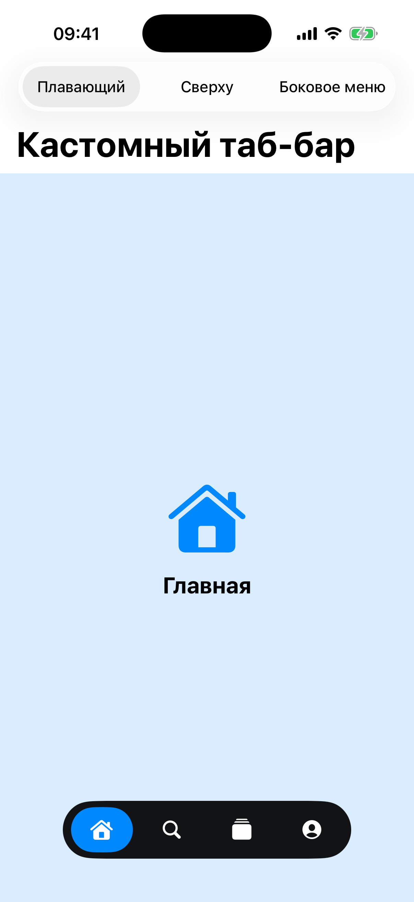

# Глава 20. Custom Tab Bar — три стиля контейнера

{width=45%}

`UITabBarController` — стандартный таб-бар iOS. Снизу пять иконок,
большие приложения берут именно его. Но у него есть ограничения:

- Внешний вид настраивается через `UITabBarAppearance` — а это набор
  fixed-параметров, не любой дизайн получится.
- Анимаций нет. Переход между табами — мгновенный.
- На iPad/большом устройстве макет одинаковый.

Иногда хочется что-то нестандартное. Floating capsule в дне экрана.
Сегментированный switcher сверху. Боковое выдвигающееся меню. Все три
— своими руками, через **container view controller'ы**.

В этой главе строим все три. Это даст понимание паттерна container —
с ним любой кастомный navigation становится тривиальным.

## 20.1 Container view controller — паттерн

Container VC — это VC, который **владеет** другими VC'ами как child'ами,
управляет их жизненным циклом, рисует своё «обрамление» (таб-бар,
тулбар, шторку).

Стандартные containers iOS:
- `UINavigationController` — стек экранов с back-кнопкой.
- `UITabBarController` — горизонтальный список табов.
- `UIPageViewController` — листающие страницы.
- `UISplitViewController` — двухколоночный layout для iPad.

Кастомный container делается так же. Три шага:

1. **Add child**: `addChild(childVC)`.
2. **Положить view**: `view.addSubview(childVC.view)` + constraints.
3. **Notify**: `childVC.didMove(toParent: self)`.

Удаление — в обратном порядке:

1. `child.willMove(toParent: nil)`.
2. `child.view.removeFromSuperview()`.
3. `child.removeFromParent()`.

Если пропустить эти вызовы — child VC не получит `viewWillAppear`,
`safeAreaInsets` могут быть кривыми, lifecycle сломается.

## 20.2 Tab model — общая для трёх стилей

Каждый таб — простая структура:

```swift
struct Tab {
    let title: String
    let icon: String
    let color: UIColor
}

static func makeTabs() -> [Tab] {
    [
        Tab(title: "Главная", icon: "house.fill", color: .systemBlue),
        Tab(title: "Поиск", icon: "magnifyingglass", color: .systemPurple),
        Tab(title: "Лента", icon: "rectangle.stack.fill", color: .systemPink),
        Tab(title: "Профиль", icon: "person.crop.circle.fill", color: .systemTeal),
    ]
}
```

`TabContentViewController` — заглушка для контента таба. Простая
страница с иконкой и подписью:

```swift
final class TabContentViewController: UIViewController {
    private let tabSpec: Tab
    init(tab: Tab) { self.tabSpec = tab; super.init(nibName: nil, bundle: nil) }

    override func viewDidLoad() {
        super.viewDidLoad()
        view.backgroundColor = tabSpec.color.withAlphaComponent(0.15)
        // ... иконка + label по центру ...
    }
}
```

> ⚠ **Имя `tabSpec`, не `tab`**. Apple добавили property `tab: UITab?`
> в `UIViewController` в новых SDK. Если назвать своё свойство `tab`,
> компилятор пытается override'нуть — получаем ошибку. Поэтому
> переименовали в `tabSpec`.

## 20.3 Style 1 — Floating capsule

Внизу экрана плавающая «таблетка» с иконками. Минимальный декор,
красиво и современно.

```swift
final class FloatingTabBarContainer: UIViewController {
    private let tabs: [Tab]
    private var selectedIndex: Int = 0
    private let contentContainer = UIView()
    private let barView = UIView()
    private var buttons: [UIButton] = []

    override func viewDidLoad() {
        super.viewDidLoad()
        contentContainer.translatesAutoresizingMaskIntoConstraints = false
        view.addSubview(contentContainer)
        // contentContainer пинится во весь экран

        setupBar()
        showTab(at: 0, animated: false)
    }
}
```

`contentContainer` — отдельный view, в который кладём content VC. Не
делаем `addSubview` прямо в `view`, иначе при добавлении barView
порядок может сломаться.

`setupBar`:

```swift
private func setupBar() {
    barView.translatesAutoresizingMaskIntoConstraints = false
    barView.backgroundColor = UIColor.label.withAlphaComponent(0.92)
    barView.layer.cornerRadius = 28
    view.addSubview(barView)
    NSLayoutConstraint.activate([
        barView.bottomAnchor.constraint(equalTo: view.safeAreaLayoutGuide.bottomAnchor, constant: -8),
        barView.heightAnchor.constraint(equalToConstant: 56),
        barView.centerXAnchor.constraint(equalTo: view.centerXAnchor),
    ])

    let stack = UIStackView()
    stack.axis = .horizontal
    stack.distribution = .fillEqually
    stack.spacing = 8
    // ... добавляем кнопки
}
```

`UIColor.label.withAlphaComponent(0.92)` — почти полностью label-цвет.
В светлой теме = тёмный, в тёмной = светлый. Adaptive.

`cornerRadius = 28` — половина высоты (56), получается capsule.

`bottomAnchor = safeAreaLayoutGuide.bottomAnchor - 8` — приподнято
над home-indicator'ом. Полная safeArea bottom — это сам индикатор.

`centerXAnchor` — горизонтально центрировано.

`distribution = .fillEqually` — все 4 кнопки одинаковой ширины.

Каждая кнопка — иконка SF Symbol:

```swift
for (index, tab) in tabs.enumerated() {
    let button = UIButton(type: .system)
    button.setImage(UIImage(systemName: tab.icon), for: .normal)
    button.tintColor = UIColor.systemBackground
    button.layer.cornerRadius = 22
    button.addAction(UIAction { [weak self] _ in
        self?.showTab(at: index, animated: true)
    }, for: .touchUpInside)
    button.widthAnchor.constraint(equalToConstant: 60).isActive = true
    stack.addArrangedSubview(button)
    buttons.append(button)
}
```

Подсветка активного — `backgroundColor = tab.color` на выбранной, прозрачный
на остальных:

```swift
private func updateSelection() {
    for (i, button) in buttons.enumerated() {
        let active = i == selectedIndex
        UIView.animate(withDuration: 0.25) {
            button.backgroundColor = active ? self.tabs[i].color : .clear
        }
    }
}
```

`UIView.animate(withDuration: 0.25)` — плавный переход между состояниями.
Без анимации цвет «прыгает».

Смена tab — заменяем child VC:

```swift
private func showTab(at index: Int, animated: Bool) {
    selectedIndex = index
    for sub in contentContainer.subviews { sub.removeFromSuperview() }
    let content = TabContentViewController(tab: tabs[index])
    addChild(content)
    content.view.translatesAutoresizingMaskIntoConstraints = false
    contentContainer.addSubview(content.view)
    NSLayoutConstraint.activate([
        content.view.topAnchor.constraint(equalTo: contentContainer.topAnchor),
        content.view.bottomAnchor.constraint(equalTo: contentContainer.bottomAnchor),
        content.view.leadingAnchor.constraint(equalTo: contentContainer.leadingAnchor),
        content.view.trailingAnchor.constraint(equalTo: contentContainer.trailingAnchor),
    ])
    content.didMove(toParent: self)
    updateSelection()
}
```

Здесь упростили — **создаём новый** VC каждый раз. В реальности
лучше кешировать VC'ы, чтобы при возврате на таб 1 не терять
скролл-позицию. Кешируется через массив `private var cachedVCs:
[UIViewController?]`.

> 💡 **Кеш или пересоздание?** Стандартный `UITabBarController` кеширует
> VC'ы (после первого посещения они остаются в памяти). Для большинства
> кейсов это правильно — юзер ожидает «вернуться туда же». Для очень
> тяжёлых VC (галерея с сотнями фото) можно отказаться от кеша.

## 20.4 Style 2 — Top Tabs

Twitter-style. Сверху сегмент-переключатель, под ним — содержимое,
которое можно листать пальцем.

Особенность: **сразу** интегрируем `UIPageViewController` как контейнер
страниц, и кнопки сверху просто синхронизируем с ним.

```swift
final class TopTabsContainer: UIViewController, UIPageViewControllerDataSource, UIPageViewControllerDelegate {
    private let tabs: [Tab]
    private var buttons: [UIButton] = []
    private var selectedIndex = 0
    private var pageVC: UIPageViewController!
    private var pages: [TabContentViewController] = []
    private let indicatorLine = UIView()
    private var indicatorConstraint: NSLayoutConstraint!

    override func viewDidLoad() {
        super.viewDidLoad()
        setupTabsBar()
        setupPager()
    }
}
```

`setupTabsBar` — горизонтальный stack из кнопок с подсвечивающейся
линией снизу:

```swift
private func setupTabsBar() {
    let bar = UIStackView()
    bar.axis = .horizontal
    bar.distribution = .fillEqually
    view.addSubview(bar)
    // ... pin bar to top ...

    for (i, tab) in tabs.enumerated() {
        let button = UIButton(type: .system)
        button.setTitle(tab.title, for: .normal)
        button.titleLabel?.font = .systemFont(ofSize: 14, weight: .semibold)
        button.tintColor = .secondaryLabel
        button.addAction(UIAction { [weak self] _ in
            self?.select(index: i, animated: true)
        }, for: .touchUpInside)
        bar.addArrangedSubview(button)
        buttons.append(button)
    }
    indicatorLine.backgroundColor = .systemBlue
    indicatorLine.layer.cornerRadius = 1.5
    view.addSubview(indicatorLine)
    let indicatorWidth = view.bounds.width / CGFloat(tabs.count)
    indicatorConstraint = indicatorLine.leadingAnchor.constraint(equalTo: view.leadingAnchor)
    NSLayoutConstraint.activate([
        indicatorConstraint,
        indicatorLine.topAnchor.constraint(equalTo: bar.bottomAnchor, constant: 4),
        indicatorLine.widthAnchor.constraint(equalToConstant: indicatorWidth),
        indicatorLine.heightAnchor.constraint(equalToConstant: 3),
    ])
}
```

`indicatorConstraint` — leading constraint линии. Будем менять его
при смене таба, линия будет ехать:

```swift
private func animateIndicator() {
    let width = view.bounds.width / CGFloat(tabs.count)
    indicatorConstraint.constant = width * CGFloat(selectedIndex)
    UIView.animate(withDuration: 0.25) { self.view.layoutIfNeeded() }
}
```

`setupPager` — `UIPageViewController` с pages:

```swift
private func setupPager() {
    pages = tabs.map { TabContentViewController(tab: $0) }
    pageVC = UIPageViewController(transitionStyle: .scroll, navigationOrientation: .horizontal)
    pageVC.dataSource = self
    pageVC.delegate = self
    addChild(pageVC)
    pageVC.view.translatesAutoresizingMaskIntoConstraints = false
    view.addSubview(pageVC.view)
    // ... pin ниже indicatorLine ...
    pageVC.didMove(toParent: self)
    pageVC.setViewControllers([pages[0]], direction: .forward, animated: false)
    updateButtonStyles()
}
```

DataSource — те же два метода, что в onboarding (Глава 6):
`viewControllerBefore` / `viewControllerAfter`. Возвращаем
соседнюю страницу из массива `pages`.

Delegate — `didFinishAnimating` для отслеживания свайпа:

```swift
func pageViewController(_ pageViewController: UIPageViewController,
                        didFinishAnimating finished: Bool,
                        previousViewControllers: [UIViewController],
                        transitionCompleted completed: Bool) {
    guard completed, let current = pageVC.viewControllers?.first as? TabContentViewController,
          let index = pages.firstIndex(of: current) else { return }
    selectedIndex = index
    animateIndicator()
    updateButtonStyles()
}
```

Когда юзер свайпнул и анимация **завершилась** (`completed: true`) —
обновляем `selectedIndex`, двигаем линию, перекрашиваем кнопки.

Так что у нас **двунаправленная синхронизация**: тап → page → индикатор,
и свайп → tab → индикатор.

## 20.5 Style 3 — Drawer (боковое меню)

Стиль iPad-приложений «mail» или Slack: главное содержимое во весь
экран, кнопка-«гамбургер» в углу, тап — выезжает шторка слева со
списком разделов.

```swift
final class DrawerContainer: UIViewController {
    private let tabs: [Tab]
    private var selectedIndex = 0
    private let drawer = UIView()
    private let content = UIView()
    private let overlay = UIView()
    private var drawerLeading: NSLayoutConstraint!
    private let drawerWidth: CGFloat = 260
    private var isOpen = false

    override func viewDidLoad() {
        super.viewDidLoad()
        setupContent()
        setupDrawer()
        setupGestures()
        showTab(at: 0)
    }
}
```

Главная техника — **constraint, который двигаем**:

```swift
drawerLeading = drawer.leadingAnchor.constraint(equalTo: view.leadingAnchor, constant: -drawerWidth)
NSLayoutConstraint.activate([
    drawerLeading,
    drawer.topAnchor.constraint(equalTo: view.topAnchor),
    drawer.bottomAnchor.constraint(equalTo: view.bottomAnchor),
    drawer.widthAnchor.constraint(equalToConstant: drawerWidth),
])
```

Изначально `constant: -drawerWidth` = -260, drawer полностью **слева
за экраном**. Когда открываем — устанавливаем `constant = 0`, drawer
едет вправо:

```swift
private func setDrawer(open: Bool) {
    isOpen = open
    drawerLeading.constant = open ? 0 : -drawerWidth
    overlay.isUserInteractionEnabled = open
    UIView.animate(withDuration: 0.3, delay: 0, usingSpringWithDamping: 0.9, initialSpringVelocity: 0) {
        self.view.layoutIfNeeded()
        self.overlay.alpha = open ? 0.4 : 0
    }
}
```

`overlay` — полупрозрачный чёрный поверх контента, появляется при
открытии drawer'а. Тап по нему — закрывает.

`usingSpringWithDamping: 0.9` — лёгкая пружина (мягкое appearance).

`view.layoutIfNeeded()` внутри animation — фактически делает анимацию
constraint change. Без этого `constant = 0` сразу применится без
анимации.

### Pan gesture

```swift
@objc private func handlePan(_ gesture: UIPanGestureRecognizer) {
    let translation = gesture.translation(in: view).x
    switch gesture.state {
    case .changed:
        let target = (isOpen ? 0 : -drawerWidth) + translation
        drawerLeading.constant = max(-drawerWidth, min(0, target))
        overlay.alpha = (drawerLeading.constant + drawerWidth) / drawerWidth * 0.4
    case .ended, .cancelled:
        let shouldOpen = drawerLeading.constant > -drawerWidth / 2
        setDrawer(open: shouldOpen)
    default: break
    }
}
```

Пользователь тянет пальцем — drawer движется за пальцем (с
ограничениями). Когда отпускает — закрепляем в полностью открытом
или закрытом положении в зависимости от того, перетащил ли он
больше половины.

`max(-drawerWidth, min(0, target))` — ограничение между «полностью
закрыт» и «полностью открыт». Если юзер тащит дальше — drawer не
едет (rubber-band тоже можно сделать, но это сложнее).

`overlay.alpha = ... * 0.4` — постепенное затемнение фона по мере
открытия drawer'а.

## 20.6 Все три в одном Demo — Segmented control

В `CustomTabBarViewController` мы даём юзеру выбрать стиль через
сегмент-control в navigation bar:

```swift
final class CustomTabBarViewController: UIViewController {
    private enum Style: Int, CaseIterable {
        case floating, topTabs, drawer
        var label: String {
            switch self {
            case .floating: return "Плавающий"
            case .topTabs: return "Сверху"
            case .drawer: return "Боковое меню"
            }
        }
    }

    private let segmented = UISegmentedControl(items: Style.allCases.map(\.label))
    private var currentContainer: UIViewController?

    override func viewDidLoad() {
        super.viewDidLoad()
        segmented.selectedSegmentIndex = 0
        segmented.addTarget(self, action: #selector(styleChanged), for: .valueChanged)
        navigationItem.titleView = segmented
        switchTo(style: .floating)
    }

    private func switchTo(style: Style) {
        if let current = currentContainer {
            current.willMove(toParent: nil)
            current.view.removeFromSuperview()
            current.removeFromParent()
        }

        let container: UIViewController
        switch style {
        case .floating: container = FloatingTabBarContainer(tabs: Self.makeTabs())
        case .topTabs: container = TopTabsContainer(tabs: Self.makeTabs())
        case .drawer: container = DrawerContainer(tabs: Self.makeTabs())
        }

        addChild(container)
        container.view.translatesAutoresizingMaskIntoConstraints = false
        view.addSubview(container.view)
        // ... pin ...
        container.didMove(toParent: self)
        currentContainer = container
    }
}
```

Контейнер сам становится child VC! Это **контейнер контейнеров**.
Полный паттерн «add child / will move to nil → remove» работает на
любом уровне вложенности.

`navigationItem.titleView = segmented` — кладём сегмент в место
заголовка nav-бара. Плотная компактная фишка для свитчей режимов.

## 20.7 Бытовая аналогия

Container VC — это **шкаф с полками**. Стандартный
UITabBarController — это IKEA-шкаф с 5 одинаковыми полками. Может
быть, ты хочешь шкаф с верхней секцией для книг, средней для
журналов и нижней — для папок. Тогда строишь свой шкаф.

Floating capsule — **подставка для пульта** в гостиной. Маленькая,
видна, лежит снизу.

Top tabs — **закладки в записной книжке**. Все на виду, листать можно
свайпом.

Drawer — **выдвижной шкафчик** под раковиной. По умолчанию закрыт,
не мешает основному виду. Тянешь за ручку — выезжает.

## 20.8 Что мы пропустили

- **State preservation** при смене таба. Сейчас новый TabContentViewController
  каждый раз — теряется состояние. Production: кешировать VC'ы.
- **Navigation в табах**. Каждый таб обычно содержит свой
  `UINavigationController`. Тапнул на ячейку в Home — пушится detail
  внутри Home, не глобально.
- **Badges на кнопках**. Красный кружок с цифрой на иконке (как в
  iMessage).
- **Long-press на таб-кнопке** — открывает quick action menu
  (например, «открыть приложение в новом окне» на iPad).
- **Accessibility** — VoiceOver должен сказать «таб 1 из 4 — Главная,
  выбран».
- **iPad large vs compact** — на iPad обычно используется
  `UISplitViewController` (двухколоночный), а на iPhone — таб-бар.
  Адаптивные приложения переключаются.

> 🛠 **Упражнение.** Открой Кастомный таб-бар (мятная ячейка).
> Переключай сегмент в навбаре — увидишь все три стиля. В
> «Плавающем» — пилюля внизу. В «Сверху» — листай свайпом слева-направо.
> В «Боковом» — нажми гамбургер слева сверху, потяни drawer пальцем.

## 📋 Что мы выучили

- Container VC паттерн — `addChild` → `view.addSubview` →
  `didMove(toParent:)`. Удаление в обратном порядке.
- Контейнеры можно вкладывать (контейнер-контейнер).
- **Floating capsule** — `UIView` поверх content, с `cornerRadius =
  height/2`, привязан к safeArea bottom с отступом.
- **Подсветка активного** — `UIView.animate` на `backgroundColor`,
  без анимации цвет «прыгает».
- **Top tabs** — `UIPageViewController` + кастомный сегмент сверху +
  movable indicator line через `constraint.constant`. Двусторонняя
  синхронизация (tap ↔ swipe).
- **Drawer** — constraint, который меняем (`-drawerWidth ↔ 0`),
  анимация через `view.layoutIfNeeded()` внутри `UIView.animate`.
- **Pan gesture** — `translation` mapping в constraint, проверка
  `> -drawerWidth/2` на отпускании для решения «открыть или закрыть».
- **Overlay** — полупрозрачный view над контентом, alpha
  пропорциональна openness, тап закрывает drawer.
- **`navigationItem.titleView = segmented`** — сегмент-control вместо
  заголовка для переключения режимов.

## Apple Developer Documentation

- [UIViewController — Implementing a Container View Controller](https://developer.apple.com/documentation/uikit/uiviewcontroller#1652844) — официальный гайд по containment'у: `addChild(_:)`, `view.addSubview(_:)`, `didMove(toParent:)`.
- [addChild(_:)](https://developer.apple.com/documentation/uikit/uiviewcontroller/1621394-addchild) — присоединение child VC; парный — `removeFromParent()`.
- [willMove(toParent:)](https://developer.apple.com/documentation/uikit/uiviewcontroller) — уведомление перед удалением child'а из родителя. Вызывается с `nil`.
- [didMove(toParent:)](https://developer.apple.com/documentation/uikit/uiviewcontroller/1621405-didmove) — финальный шаг при добавлении child'а; без него lifecycle ломается.
- [UITabBarController](https://developer.apple.com/documentation/uikit/uitabbarcontroller) — стандартный container для сравнения. Мы делаем три кастомные альтернативы.
- [UIPageViewController](https://developer.apple.com/documentation/uikit/uipageviewcontroller) — листающие страницы для top-tabs варианта; те же data source / delegate, что в onboarding.
- [UIPanGestureRecognizer](https://developer.apple.com/documentation/uikit/uipangesturerecognizer) — pan gesture для drawer'а, читаем `translation(in:)` и маппим в constraint.
- [NSLayoutConstraint](https://developer.apple.com/documentation/uikit/nslayoutconstraint) — менять `.constant` под animation block — классический способ анимировать перемещение drawer'а.
- [UISegmentedControl](https://developer.apple.com/documentation/uikit/uisegmentedcontrol) — компактный switch стилей в `navigationItem.titleView`.
- [HIG: Tab bars](https://developer.apple.com/design/human-interface-guidelines/tab-bars) — гайдлайн по количеству и поведению табов; ограничения, на которые опирается стандартный `UITabBarController`.
- [HIG: Navigation bars](https://developer.apple.com/design/human-interface-guidelines/navigation-bars) — про размещение `titleView` и обращение с заголовками при кастомных контейнерах.

→ [Глава 21. Complex Layouts — параллакс, sticky header, stretchy](./29-complex-layouts.md)
