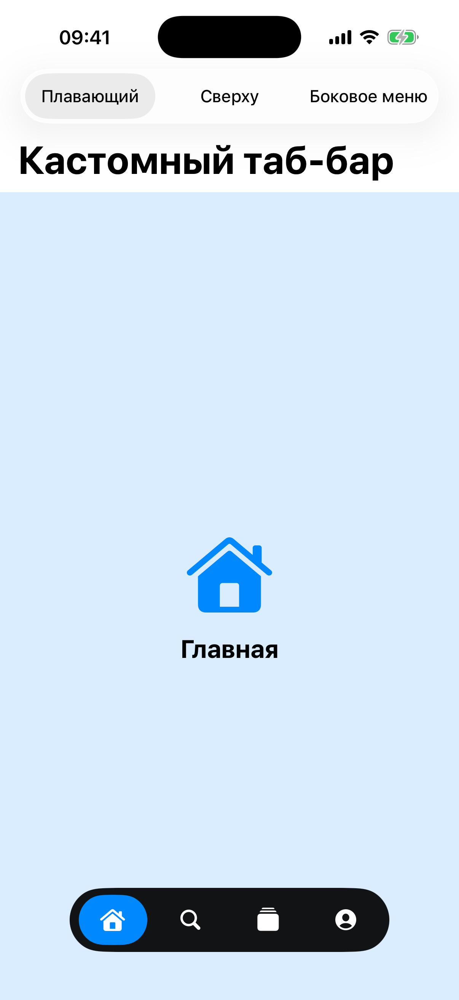

# Глава 20. Custom Tab Bar — три стиля контейнера

{width=45%}

`UITabBarController` — стандартный таб-бар iOS: полоска с иконками внизу
экрана, тап по иконке переключает раздел. На iPhone в ней помещается до
пяти вкладок, лишние уходят в раздел «Ещё». Большие приложения почти всегда
берут именно его, и правильно делают: он бесплатно даёт VoiceOver, бейджи,
поддержку iPad и новый внешний вид при каждом обновлении iOS. В iOS 26
системный таб-бар сам стал плавающей «таблеткой» в стиле Liquid Glass и
умеет сворачиваться при прокрутке (`tabBarMinimizeBehavior`, только iOS 26+),
а на iPad с iOS 18 может превращаться в боковую панель (`mode = .tabSidebar`).

Но у стандартного контроллера есть рамки:

- Внешний вид настраивается через `UITabBarAppearance` (iOS 13+) — набор
  готовых параметров: фон, цвета иконок и подписей, бейджи. Форму, положение
  и поведение панели так не поменяешь.
- Переход между вкладками по умолчанию мгновенный. Анимацию можно добавить
  через делегат `UITabBarControllerDelegate` и собственный «аниматор», но это
  отдельная работа.
- На iOS 15–17 полоса всегда внизу, одна и та же на любом экране.

Иногда нужно своё: плавающая «таблетка» внизу на старых iOS, переключатель
вкладок сверху с листанием пальцем, боковое выдвижное меню. Все три делаются
своими руками через **container view controller**.

В этой главе строим все три. Попутно разберём сам паттерн «контейнер» —
после него любая нестандартная навигация собирается из тех же трёх вызовов.

> **Режим компиляции.** Весь код главы проверен в режиме, на который книга
> рассчитана: Swift 6, `SWIFT_DEFAULT_ACTOR_ISOLATION = MainActor`
> (настройка «Default Actor Isolation» в Build Settings), deployment target
> iOS 15.0. Все классы главы — наследники UIKit и так работают на главном
> потоке, поэтому ни одного `@MainActor` вручную писать не придётся.

## 20.1 Container view controller — паттерн

Напомним основу. **View controller** (VC) — объект, который управляет одним
экраном: создаёт его view, реагирует на тапы, узнаёт о появлении и исчезновении
экрана (методы жизненного цикла `viewDidLoad`, `viewWillAppear`,
`viewDidAppear` и т.д., подробно — в главе 5).

**Container view controller** — VC, который показывает внутри себя другие VC.
Он **владеет** ими как «детьми» (child view controllers), решает, какой из них
сейчас на экране, и рисует вокруг своё «обрамление»: таб-бар, панель, шторку.

Бытовая картинка: контейнер — это рамка для фотографий со сменными вкладышами.
Рамка одна (кнопки, панель), вкладыши (экраны-дети) меняются. Главное —
вкладыш вставляется «по правилам», иначе он болтается.

Стандартные контейнеры iOS устроены именно так:

- `UINavigationController` — стек экранов с кнопкой «Назад».
- `UITabBarController` — вкладки.
- `UIPageViewController` — страницы, которые листают пальцем.
- `UISplitViewController` — две-три колонки, главным образом для iPad.

Свой контейнер делается теми же вызовами, что используют они. Добавление —
три шага:

1. `addChild(child)` — регистрируем ребёнка у родителя. Внутри UIKit сам
   вызывает `child.willMove(toParent: self)`.
2. `view.addSubview(child.view)` + constraints — кладём view ребёнка в
   иерархию и растягиваем.
3. `child.didMove(toParent: self)` — сообщаем ребёнку: «переезд закончен».
   Этот вызов UIKit за тебя **не** делает.

Удаление — в обратном порядке:

1. `child.willMove(toParent: nil)` — предупреждаем. Сам UIKit его не вызовет.
2. `child.view.removeFromSuperview()` — снимаем view.
3. `child.removeFromParent()` — разрываем связь; внутри UIKit вызывает
   `child.didMove(toParent: nil)`.

Асимметрия (при добавлении UIKit сам зовёт `willMove`, при удалении — сам
зовёт `didMove`) описана прямо в заголовочном файле `UIViewController.h`:
«addChildViewController: will call willMoveToParentViewController:self…
However, it will not call didMoveToParentViewController:». Запоминать её не
обязательно — хватит завернуть ритуал в две функции и пользоваться ими везде:

```swift
extension UIViewController {
    /// Встраивает `child` как дочерний экран и растягивает его view
    /// на весь `container` (по умолчанию — на собственный view).
    func embed(_ child: UIViewController, in container: UIView? = nil) {
        let host: UIView = container ?? view
        addChild(child)                                   // 1. регистрируем ребёнка
        child.view.translatesAutoresizingMaskIntoConstraints = false
        host.addSubview(child.view)                       // 2. кладём его view
        NSLayoutConstraint.activate([
            child.view.topAnchor.constraint(equalTo: host.topAnchor),
            child.view.bottomAnchor.constraint(equalTo: host.bottomAnchor),
            child.view.leadingAnchor.constraint(equalTo: host.leadingAnchor),
            child.view.trailingAnchor.constraint(equalTo: host.trailingAnchor),
        ])
        child.didMove(toParent: self)                     // 3. сообщаем «переезд закончен»
    }

    /// Вынимает этот экран из родителя — зеркально к `embed`.
    func unembed() {
        guard parent != nil else { return }
        willMove(toParent: nil)                           // 1. предупреждаем
        view.removeFromSuperview()                        // 2. снимаем view
        removeFromParent()                                // 3. разрываем связь
    }
}
```

Разберём неочевидные строки.

`let host: UIView = container ?? view` — если контейнер не передали, кладём
ребёнка прямо в свой `view`. У `UIViewController` свойство `view` объявлено
как `UIView!` (неявно развёрнутый опционал): при первом обращении UIKit сам
создаёт view, поэтому оно не `nil`. Явный тип `UIView` слева нужен, чтобы
`??` вернул обычный, а не опциональный view.

`translatesAutoresizingMaskIntoConstraints = false` — без этой строки UIKit
превратит старую «маску автоматического ресайза» view в свои constraints, они
столкнутся с нашими, и в консоли появится «Unable to simultaneously satisfy
constraints». Напомним: **constraint** — правило Auto Layout вида «верх A равен
верху B плюс 8 точек»; из набора таких правил система вычисляет рамки всех view.

Четыре constraints «верх-низ-лево-право равны контейнеру» — просто «растянуть
во весь контейнер».

`guard parent != nil` в `unembed()` — защита от двойного удаления: если экран
уже вынут, повторный вызов ничего не сломает.

Что будет, если ритуал пропустить? Мы проверили в симуляторе (iOS 26.5) три
варианта ребёнка в одном родителе:

| Как добавили                         | `viewWillAppear`/`viewDidAppear` | `parent` |
|--------------------------------------|----------------------------------|----------|
| `addChild` + `addSubview` + `didMove`| пришли                           | есть     |
| только `addSubview`                  | пришли, но UIKit их не гарантирует | `nil`  |
| `addChild` + `addSubview`, без `didMove` | пришли                       | есть     |

То есть первое, что ломается, — **не** жизненный цикл, а связи. У ребёнка,
которого положили «только view», `parent == nil`: у него не работают
`navigationController`, `navigationItem` родителя, наследование
`additionalSafeAreaInsets`, пересылка поворота и смены трейтов (тёмная тема,
размер шрифта). `didMove(toParent:)` — точка, где ребёнок узнаёт, что
переезд закончен; если он там что-то настраивает (например, анимацию
появления), без вызова это просто не случится. Правильный ритуал ничего не
стоит, поэтому всегда пиши его целиком.

А обратная ошибка — снять view, но забыть `removeFromParent()` — ещё
коварнее: экран пропал с глаз, но остался в `children` родителя и живёт в
памяти. Замер: после `e.view.removeFromSuperview()` у ребёнка `parent` всё
ещё есть, а `parent.children.count` не уменьшился. Меняешь таб десять раз —
десять «призраков» в памяти.

## 20.2 Tab model — общая для трёх стилей

Каждый таб — простая структура:

```swift
struct Tab {
    let title: String
    let icon: String      // имя SF Symbol
    let color: UIColor
}
```

`icon` — имя **SF Symbol**, иконки из встроенной библиотеки Apple
(`UIImage(systemName: "house.fill")`). Их тысячи, все бесплатны, все
масштабируются под размер шрифта.

`TabContentViewController` — заглушка для содержимого таба: иконка и подпись
по центру на фоне цвета таба.

```swift
final class TabContentViewController: UIViewController {
    private let tabSpec: Tab

    init(tab: Tab) {
        self.tabSpec = tab
        super.init(nibName: nil, bundle: nil)
    }

    required init?(coder: NSCoder) { fatalError("Создаём только из кода") }

    override func viewDidLoad() {
        super.viewDidLoad()
        view.backgroundColor = tabSpec.color.withAlphaComponent(0.15)

        let icon = UIImageView(image: UIImage(systemName: tabSpec.icon))
        icon.tintColor = tabSpec.color
        icon.preferredSymbolConfiguration = UIImage.SymbolConfiguration(pointSize: 64, weight: .semibold)

        let label = UILabel()
        label.text = tabSpec.title
        label.font = .preferredFont(forTextStyle: .title2)
        label.adjustsFontForContentSizeCategory = true

        let stack = UIStackView(arrangedSubviews: [icon, label])
        stack.axis = .vertical
        stack.alignment = .center
        stack.spacing = 12
        stack.translatesAutoresizingMaskIntoConstraints = false
        view.addSubview(stack)
        NSLayoutConstraint.activate([
            stack.centerXAnchor.constraint(equalTo: view.safeAreaLayoutGuide.centerXAnchor),
            stack.centerYAnchor.constraint(equalTo: view.safeAreaLayoutGuide.centerYAnchor),
        ])
    }
}
```

`withAlphaComponent(0.15)` — тот же цвет, но непрозрачный на 15%: бледная
заливка вместо кричащей.

`required init?(coder:)` с `fatalError` — этот инициализатор нужен только
для загрузки из storyboard. Мы создаём экран кодом, поэтому честно падаем,
если кто-то попробует иначе.

`.preferredFont(forTextStyle: .title2)` + `adjustsFontForContentSizeCategory`
— шрифт из системы **Dynamic Type**: пользователь в «Настройки → Экран и
яркость → Размер текста» делает текст крупнее, и подпись растёт вместе с ним,
без перезапуска экрана.

Центрируем по `safeAreaLayoutGuide`. **Safe area** — часть экрана, которую
ничто не закрывает: без «чёлки»/Dynamic Island сверху, полоски «домой» снизу
и панелей навигации. Это пригодится в 20.3: мы расширим safe area ребёнка,
чтобы плавающая панель не закрывала контент.

> **Имя `tabSpec`, а не `tab`.** В iOS 18 SDK у `UIViewController` появилось
> свойство `tab: UITab?` (только для чтения). Если в своём наследнике назвать
> свойство `tab`, Swift считает это переопределением, и сборка падает с
> ошибкой «overriding property must be as accessible as its enclosing type».
> Мы проверили это на Xcode 26.5. Отсюда и `tabSpec`.

## 20.3 Style 1 — Floating capsule

Внизу экрана — плавающая «таблетка» с иконками. Контент под ней виден
целиком, панель не прибита к краю.

Сначала каркас контейнера:

```swift
final class FloatingTabBarContainer: UIViewController {
    private let tabs: [Tab]
    private var selectedIndex = 0
    private let contentContainer = UIView()
    private let barView = UIView()
    private var buttons: [UIButton] = []
    private var cachedChildren: [Int: UIViewController] = [:]   // кеш: индекс → экран
    private var currentChild: UIViewController?

    private let barHeight: CGFloat = 56
    private let barBottomGap: CGFloat = 8

    init(tabs: [Tab]) {
        self.tabs = tabs
        super.init(nibName: nil, bundle: nil)
    }

    required init?(coder: NSCoder) { fatalError("Создаём только из кода") }

    override func viewDidLoad() {
        super.viewDidLoad()
        view.backgroundColor = .systemBackground

        contentContainer.translatesAutoresizingMaskIntoConstraints = false
        view.addSubview(contentContainer)
        NSLayoutConstraint.activate([
            contentContainer.topAnchor.constraint(equalTo: view.topAnchor),
            contentContainer.bottomAnchor.constraint(equalTo: view.bottomAnchor),
            contentContainer.leadingAnchor.constraint(equalTo: view.leadingAnchor),
            contentContainer.trailingAnchor.constraint(equalTo: view.trailingAnchor),
        ])

        setupBar()
        showTab(at: 0, animated: false)
    }
}
```

`contentContainer` — отдельный view «под содержимое». Зачем, если можно класть
детей прямо в `view`? Из-за **z-порядка** (какой view рисуется поверх
какого): subview, добавленный позже, лежит выше. Панель мы добавим один раз,
а детей будем менять много раз. Если класть их в `view`, каждый новый ребёнок
ляжет **поверх** панели и закроет её. Внутри `contentContainer` дети меняются
как угодно, а сам контейнер навсегда остаётся под панелью.

`cachedChildren` — словарь «номер таба → уже созданный экран». Зачем он,
объясним в `showTab`.

Теперь панель:

```swift
private func setupBar() {
    barView.translatesAutoresizingMaskIntoConstraints = false
    barView.backgroundColor = UIColor.label.withAlphaComponent(0.92)
    barView.layer.cornerRadius = barHeight / 2
    view.addSubview(barView)

    let stack = UIStackView()
    stack.axis = .horizontal
    stack.distribution = .fillEqually
    stack.spacing = 8
    stack.translatesAutoresizingMaskIntoConstraints = false
    barView.addSubview(stack)

    NSLayoutConstraint.activate([
        barView.bottomAnchor.constraint(equalTo: view.safeAreaLayoutGuide.bottomAnchor,
                                        constant: -barBottomGap),
        barView.heightAnchor.constraint(equalToConstant: barHeight),
        barView.centerXAnchor.constraint(equalTo: view.centerXAnchor),

        stack.topAnchor.constraint(equalTo: barView.topAnchor, constant: 6),
        stack.bottomAnchor.constraint(equalTo: barView.bottomAnchor, constant: -6),
        stack.leadingAnchor.constraint(equalTo: barView.leadingAnchor, constant: 6),
        stack.trailingAnchor.constraint(equalTo: barView.trailingAnchor, constant: -6),
    ])

    // ... кнопки — ниже
}
```

`UIColor.label.withAlphaComponent(0.92)` — `label` это системный цвет текста:
в светлой теме почти чёрный, в тёмной почти белый. Панель получается
контрастной к фону в обеих темах сама, без проверок `if dark`.

`cornerRadius = barHeight / 2` — радиус скругления равен половине высоты:
56 / 2 = 28. Когда радиус ровно половина высоты, короткие стороны
превращаются в полукруги — получается капсула.

`bottomAnchor = safeAreaLayoutGuide.bottomAnchor - 8` — низ панели на 8 точек
выше нижней границы safe area. На iPhone без кнопки «Домой» safe area
заканчивается над полоской «домой» (на iPhone 16 это 34 точки от края), так
что панель висит в 34 + 8 = 42 точках от нижнего края экрана.

Ширину панели мы не задаём — её «распирает» содержимое: стек прибит к панели
со всех сторон с отступом 6, а кнопки внутри имеют фиксированную ширину.
Посчитаем на четырёх табах:

- 4 кнопки × 60 = 240 точек;
- 3 промежутка × 8 (`spacing`) = 24;
- отступы стека слева и справа: 6 + 6 = 12.

Итого 240 + 24 + 12 = 276 точек. На экране шириной 393 точки (iPhone 16)
остаётся по (393 − 276) / 2 = 58,5 точек слева и справа — это и даёт ощущение
«плавающей» панели. Высота кнопки: 56 − 6 − 6 = 44 точки — ровно минимальный
размер тап-зоны по рекомендациям Apple (44×44).

`distribution = .fillEqually` — все кнопки одной ширины. Здесь ширина и так
задана явно, но при другом количестве табов правило подстрахует.

Кнопки:

```swift
for (index, tab) in tabs.enumerated() {
    let button = UIButton(type: .system)
    button.setImage(UIImage(systemName: tab.icon), for: .normal)
    button.tintColor = .systemBackground
    button.layer.cornerRadius = 22
    button.accessibilityLabel = tab.title
    button.addAction(UIAction { [weak self] _ in
        self?.showTab(at: index, animated: true)
    }, for: .touchUpInside)
    button.widthAnchor.constraint(equalToConstant: 60).isActive = true
    stack.addArrangedSubview(button)
    buttons.append(button)
}
```

`tintColor = .systemBackground` — иконки цвета фона: на тёмной панели
светлые, на светлой тёмные. Противоположность `label`.

`cornerRadius = 22` — половина высоты кнопки (44 / 2): подсветка выбранного
таба тоже будет капсулой 60×44.

`accessibilityLabel = tab.title` — у кнопки только картинка, без текста.
**VoiceOver** (экранный диктор для незрячих) без подписи прочитал бы
«кнопка» или имя символа. С подписью — «Главная, кнопка».

`UIAction { [weak self] _ in ... }` — обработчик тапа в виде замыкания
(iOS 14+). `[weak self]` обязателен: кнопка живёт внутри `self`, а замыкание
живёт внутри кнопки. Сильная ссылка на `self` замкнула бы круг
«контейнер → кнопка → замыкание → контейнер», и контейнер никогда бы не
освободился (retain cycle).

`index` захватывается по значению на каждой итерации цикла — каждая кнопка
помнит свой номер.

Смена таба:

```swift
private func showTab(at index: Int, animated: Bool) {
    // Повторный тап по уже открытому табу ничего не делает.
    if index == selectedIndex, currentChild != nil { return }
    selectedIndex = index

    let child: UIViewController
    if let cached = cachedChildren[index] {
        child = cached
    } else {
        child = TabContentViewController(tab: tabs[index])
        cachedChildren[index] = child
    }

    let swap = {
        self.currentChild?.unembed()
        self.embed(child, in: self.contentContainer)
        // Контент не должен уходить под плавающую панель: 56 + 8 = 64 pt.
        child.additionalSafeAreaInsets.bottom = self.barHeight + self.barBottomGap
        self.currentChild = child
    }
    if animated {
        UIView.transition(with: contentContainer, duration: 0.2,
                          options: .transitionCrossDissolve, animations: swap)
    } else {
        swap()
    }
    updateSelection(animated: animated)
}
```

Пройдём по шагам.

Первая строка отсекает повторный тап по открытому табу. Условие
`currentChild != nil` пропускает самый первый вызов из `viewDidLoad`, когда
`selectedIndex` уже 0, но на экране ещё ничего нет.

Дальше — **кеш**. Экран таба создаём один раз и кладём в `cachedChildren`.
При возврате на таб берём готовый экран: позиция прокрутки, введённый текст,
загруженные данные — всё на месте. Так же ведёт себя стандартный
`UITabBarController`: он держит экраны вкладок в памяти, пока жив сам.

Старый ребёнок вынимается **полным** ритуалом через `unembed()`. Короткий
вариант
`for sub in contentContainer.subviews { sub.removeFromSuperview() }`
снимает только view, а сами VC остаются в `children` родителя. Каждый тап
по табу добавлял бы ещё одного «призрака». Именно этот случай мы замеряли в 20.1.

`additionalSafeAreaInsets.bottom = 64` — **дополнительный отступ safe area**
(iOS 11+). Мы говорим ребёнку: «считай, что снизу у тебя ещё 64 точки занято».
64 = 56 (высота панели) + 8 (зазор). Всё, что ребёнок привязал к своей safe
area, — таблица, кнопка внизу экрана — само поднимется над панелью. Это
лучше, чем знать в каждом экране про высоту чужой панели.

`UIView.transition(with:duration:options:animations:)` с
`.transitionCrossDissolve` — плавная смена «было → стало» за 0,2 секунды:
старое содержимое растворяется, новое проявляется. Вот та самая анимация
переключения, которой нет у стандартного таб-бара.

Подсветка активной кнопки:

```swift
private func updateSelection(animated: Bool) {
    let apply = {
        for (i, button) in self.buttons.enumerated() {
            let active = i == self.selectedIndex
            button.backgroundColor = active ? self.tabs[i].color : .clear
            button.accessibilityTraits = active ? [.button, .selected] : .button
        }
    }
    if animated {
        UIView.animate(withDuration: 0.25, animations: apply)
    } else {
        apply()
    }
}
```

Выбранная кнопка получает цвет своего таба, остальные прозрачны.
`UIView.animate(withDuration: 0.25)` перекрашивает фон за четверть секунды
вместо мгновенного «прыжка». Первый показ (`animated: false`) рисуем сразу:
анимировать появление экрана не нужно.

`accessibilityTraits` — **трейты доступности**, «ярлыки» элемента для
VoiceOver. `.selected` на активной кнопке — VoiceOver скажет
«Главная, выбрано, кнопка». У стандартного таб-бара это бесплатно, у своего —
только если не забыть.

Замыкание `apply` обращается к `self` явно (`self.buttons`) — Swift требует
этого внутри замыканий, чтобы захват `self` был виден глазами. Retain cycle
тут нет: `UIView.animate` держит замыкание 0,25 секунды и отпускает.

> **Кеш или пересоздание?** Для большинства приложений кеш правильный:
> пользователь ждёт «вернуться туда же». Отказаться от него стоит для очень
> тяжёлых экранов — например, галерея с сотнями фото в памяти. Тогда при
> уходе с таба экран выбрасывают, а состояние (позицию прокрутки, фильтры)
> сохраняют отдельно.

**Упражнение 20.1.** В `FloatingTabBarContainer` закомментируй строку
`child.additionalSafeAreaInsets.bottom = ...` и замени `TabContentViewController`
на экран с таблицей (`UITableViewController` на 50 строк). Долистай до конца.
Что видишь? Верни строку и сравни. Ответ — в конце главы.

## 20.4 Style 2 — Top Tabs

Переключатель вкладок сверху, под ним страницы, которые можно листать пальцем
вбок. Так сделаны многие новостные ленты и магазины.

Хитрость: контейнером страниц берём готовый `UIPageViewController` (он уже
умеет листание), а кнопки сверху просто синхронизируем с ним. То есть наш
контейнер держит внутри себя другой контейнер.

```swift
final class TopTabsContainer: UIViewController,
                              UIPageViewControllerDataSource,
                              UIPageViewControllerDelegate {
    private let tabs: [Tab]
    private var selectedIndex = 0
    private let bar = UIStackView()
    private var buttons: [UIButton] = []
    private let indicatorLine = UIView()
    private var indicatorLeading: NSLayoutConstraint?
    private var pages: [UIViewController] = []
    private let pageVC = UIPageViewController(transitionStyle: .scroll,
                                              navigationOrientation: .horizontal)

    init(tabs: [Tab]) {
        self.tabs = tabs
        super.init(nibName: nil, bundle: nil)
    }

    required init?(coder: NSCoder) { fatalError("Создаём только из кода") }

    override func viewDidLoad() {
        super.viewDidLoad()
        view.backgroundColor = .systemBackground
        setupTabsBar()
        setupPager()
        updateSelection(animated: false)
    }
}
```

**Data source** («источник данных») и **delegate** («делегат») — два
протокола-«помощника» `UIPageViewController`. Data source отвечает на вопрос
«какая страница слева/справа от этой?», делегат получает события «листание
закончилось». Сам контроллер страниц ничего не знает о наших табах — он
спрашивает нас.

`transitionStyle: .scroll` — страницы едут вбок, как лента. Второй вариант,
`.pageCurl`, — загибающийся уголок бумажной страницы.

Полоска кнопок и бегунок-индикатор:

```swift
private func setupTabsBar() {
    bar.axis = .horizontal
    bar.distribution = .fillEqually
    bar.translatesAutoresizingMaskIntoConstraints = false
    view.addSubview(bar)

    for (i, tab) in tabs.enumerated() {
        let button = UIButton(type: .system)
        button.setTitle(tab.title, for: .normal)
        button.titleLabel?.font = .systemFont(ofSize: 14, weight: .semibold)
        button.addAction(UIAction { [weak self] _ in
            self?.select(index: i, animated: true)
        }, for: .touchUpInside)
        bar.addArrangedSubview(button)
        buttons.append(button)
    }

    indicatorLine.backgroundColor = .systemBlue
    indicatorLine.layer.cornerRadius = 1.5
    indicatorLine.translatesAutoresizingMaskIntoConstraints = false
    view.addSubview(indicatorLine)

    NSLayoutConstraint.activate([
        bar.topAnchor.constraint(equalTo: view.safeAreaLayoutGuide.topAnchor),
        bar.leadingAnchor.constraint(equalTo: view.safeAreaLayoutGuide.leadingAnchor),
        bar.trailingAnchor.constraint(equalTo: view.safeAreaLayoutGuide.trailingAnchor),
        bar.heightAnchor.constraint(equalToConstant: 44),

        indicatorLine.topAnchor.constraint(equalTo: bar.bottomAnchor),
        indicatorLine.heightAnchor.constraint(equalToConstant: 3),
        // Ширина линии = ширине одной кнопки, а кнопки равны (fillEqually).
        indicatorLine.widthAnchor.constraint(equalTo: buttons[0].widthAnchor),
    ])
}
```

Полоска прибита к **safe area** сверху: под навигационной панелью, а не под
ней. Слева и справа — тоже к safe area, чтобы в альбомной ориентации кнопки
не залезли под «чёлку».

Ширина линии — «равна ширине первой кнопки». Кнопки одинаковые
(`.fillEqually`), так что это ширина любой из них. На iPhone 16 в портрете:
393 / 4 = 98,25 точки. В альбомной ориентации ширина safe area другая, но
constraint пересчитается сам.

`cornerRadius = 1.5` при высоте 3 — опять «половина высоты»: линия с
круглыми концами.

> **Почему не `view.bounds.width / 4`.** Так и тянет посчитать ширину линии
> и её сдвиг прямо в `viewDidLoad`. Это хрупко: в `viewDidLoad`
> размер view ещё может быть не окончательным, а после поворота экрана число
> устаревает, и линия съезжает. Constraint «равна ширине кнопки» и
> «левый край равен левому краю выбранной кнопки» пересчитываются Auto Layout
> при любом изменении размера сами.

Страницы:

```swift
private func setupPager() {
    pages = tabs.map { TabContentViewController(tab: $0) }
    pageVC.dataSource = self
    pageVC.delegate = self

    addChild(pageVC)
    pageVC.view.translatesAutoresizingMaskIntoConstraints = false
    view.addSubview(pageVC.view)
    NSLayoutConstraint.activate([
        pageVC.view.topAnchor.constraint(equalTo: indicatorLine.bottomAnchor),
        pageVC.view.bottomAnchor.constraint(equalTo: view.bottomAnchor),
        pageVC.view.leadingAnchor.constraint(equalTo: view.leadingAnchor),
        pageVC.view.trailingAnchor.constraint(equalTo: view.trailingAnchor),
    ])
    pageVC.didMove(toParent: self)
    pageVC.setViewControllers([pages[0]], direction: .forward, animated: false)
}
```

Тот же ритуал «addChild → addSubview → didMove», но руками: здесь view
ребёнка прибит не ко всему контейнеру, а под индикатор, поэтому готовый
`embed` не подходит.

Все четыре страницы создаём заранее. Для четырёх лёгких экранов это нормально;
для десятка тяжёлых лучше создавать их лениво в data source.

`setViewControllers([pages[0]], ...)` — какую страницу показать первой.
Массив, потому что в режиме «разворот книги» на iPad страниц на экране две.

Тап по кнопке:

```swift
private func select(index: Int, animated: Bool) {
    guard index != selectedIndex else { return }
    let direction: UIPageViewController.NavigationDirection =
        index > selectedIndex ? .forward : .reverse
    selectedIndex = index
    pageVC.setViewControllers([pages[index]], direction: direction, animated: animated)
    updateSelection(animated: animated)
}
```

`direction` — в какую сторону ехать. С таба 1 на таб 3 — вперёд (новая
страница приезжает справа), с 3 на 1 — назад (слева). Без этого переход
«назад» выглядел бы как движение вперёд — мелочь, которую пользователь
замечает.

Перестановка индикатора и цвета кнопок:

```swift
private func updateSelection(animated: Bool) {
    // Переставляем линию под выбранную кнопку: старое правило долой, новое — в бой.
    indicatorLeading?.isActive = false
    indicatorLeading = indicatorLine.leadingAnchor.constraint(
        equalTo: buttons[selectedIndex].leadingAnchor)
    indicatorLeading?.isActive = true

    for (i, button) in buttons.enumerated() {
        let active = i == selectedIndex
        button.tintColor = active ? .label : .secondaryLabel
        button.accessibilityTraits = active ? [.button, .selected] : .button
    }

    if animated {
        UIView.animate(withDuration: 0.25) { self.view.layoutIfNeeded() }
    }
}
```

Приём «анимировать constraint». Меняем правило (было «левый край линии =
левому краю кнопки 0», стало «= левому краю кнопки 2»), а потом внутри
`UIView.animate` вызываем `layoutIfNeeded()`. Этот вызов заставляет Auto Layout
пересчитать рамки **прямо сейчас**, и раз мы внутри анимационного блока,
переход от старой рамки к новой анимируется. Без `layoutIfNeeded()` внутри
блока рамка обновилась бы на ближайшем проходе раскладки — мгновенно.

Числами: на iPhone 16 кнопки стоят с шагом 98,25 точки. Переход с таба 0 на
таб 2 — линия проезжает 2 × 98,25 = 196,5 точки за 0,25 секунды.

Data source — те же два метода, что в онбординге (глава 6):

```swift
func pageViewController(_ pageViewController: UIPageViewController,
                        viewControllerBefore viewController: UIViewController) -> UIViewController? {
    guard let i = pages.firstIndex(of: viewController), i > 0 else { return nil }
    return pages[i - 1]
}

func pageViewController(_ pageViewController: UIPageViewController,
                        viewControllerAfter viewController: UIViewController) -> UIViewController? {
    guard let i = pages.firstIndex(of: viewController), i < pages.count - 1 else { return nil }
    return pages[i + 1]
}
```

`nil` означает «дальше страниц нет»: на первой странице нельзя листнуть
влево, на последней — вправо. `firstIndex(of:)` работает, потому что
`UIViewController` наследует `NSObject`, а тот умеет сравнение на равенство
(по умолчанию — «тот же объект»).

Делегат — узнаём про листание пальцем:

```swift
func pageViewController(_ pageViewController: UIPageViewController,
                        didFinishAnimating finished: Bool,
                        previousViewControllers: [UIViewController],
                        transitionCompleted completed: Bool) {
    guard completed,
          let current = pageViewController.viewControllers?.first,
          let index = pages.firstIndex(of: current) else { return }
    selectedIndex = index
    updateSelection(animated: true)
}
```

`completed` — ключевой флаг. Пользователь мог начать листать и передумать —
страница вернулась на место. Тогда анимация закончилась (`finished == true`),
но переход **не состоялся** (`completed == false`), и двигать индикатор нельзя.

Получилась двусторонняя синхронизация: тап по кнопке → страница и индикатор;
листание пальцем → индикатор и кнопки.

## 20.5 Style 3 — Drawer (боковое меню)

Главное содержимое во весь экран, кнопка-«гамбургер» (три полоски) в углу;
тап — слева выезжает шторка со списком разделов. Такое меню встречается в
почтовых клиентах и мессенджерах для рабочих команд. Apple в HIG предпочитает
таб-бар или боковую колонку `UISplitViewController`, поэтому шторка — выбор
для особых случаев, а не для каждого приложения.

Слои снизу вверх: контент → кнопка меню → затемнение (**overlay**,
полупрозрачная чёрная «вуаль» поверх контента) → сама шторка.

```swift
final class DrawerContainer: UIViewController {
    private let tabs: [Tab]
    private var selectedIndex = -1          // -1: ещё ничего не показано
    private let contentHost = UIView()
    private let overlay = UIView()
    private let drawer = UIView()
    private let menuButton = UIButton(type: .system)
    private var itemButtons: [UIButton] = []
    private var currentChild: UIViewController?

    private var drawerLeading: NSLayoutConstraint!
    private let drawerWidth: CGFloat = 260
    private var isOpen = false
    private var panStartConstant: CGFloat = 0

    init(tabs: [Tab]) {
        self.tabs = tabs
        super.init(nibName: nil, bundle: nil)
    }

    required init?(coder: NSCoder) { fatalError("Создаём только из кода") }

    override func viewDidLoad() {
        super.viewDidLoad()
        view.backgroundColor = .systemBackground
        setupContent()
        setupDrawer()
        setupGestures()
        showTab(at: 0)
    }
}
```

`drawerLeading: NSLayoutConstraint!` — неявно развёрнутый опционал: создать
constraint можно только когда есть view, то есть в `setupDrawer()`, а не в
инициализаторе. Обращаемся к нему только после `viewDidLoad`, так что
падения не будет.

Контент, затемнение и кнопка меню:

```swift
private func setupContent() {
    for layerView in [contentHost, overlay] {
        layerView.translatesAutoresizingMaskIntoConstraints = false
        view.addSubview(layerView)
        NSLayoutConstraint.activate([
            layerView.topAnchor.constraint(equalTo: view.topAnchor),
            layerView.bottomAnchor.constraint(equalTo: view.bottomAnchor),
            layerView.leadingAnchor.constraint(equalTo: view.leadingAnchor),
            layerView.trailingAnchor.constraint(equalTo: view.trailingAnchor),
        ])
    }
    overlay.backgroundColor = .black
    overlay.alpha = 0
    overlay.isUserInteractionEnabled = false   // закрытая шторка не ловит тапы

    var config = UIButton.Configuration.filled()
    config.image = UIImage(systemName: "line.3.horizontal")
    config.cornerStyle = .capsule
    menuButton.configuration = config
    menuButton.accessibilityLabel = "Меню разделов"
    menuButton.addAction(UIAction { [weak self] _ in
        self?.setDrawer(open: true)
    }, for: .touchUpInside)
    menuButton.translatesAutoresizingMaskIntoConstraints = false
    view.insertSubview(menuButton, belowSubview: overlay)
    NSLayoutConstraint.activate([
        menuButton.topAnchor.constraint(equalTo: view.safeAreaLayoutGuide.topAnchor, constant: 8),
        menuButton.leadingAnchor.constraint(equalTo: view.safeAreaLayoutGuide.leadingAnchor, constant: 16),
        menuButton.widthAnchor.constraint(equalToConstant: 44),
        menuButton.heightAnchor.constraint(equalToConstant: 44),
    ])
}
```

Затемнение прозрачно (`alpha = 0`) и **не принимает касания**
(`isUserInteractionEnabled = false`), пока шторка закрыта. Иначе невидимый
view лежал бы поверх контента и «съедал» все тапы — классическая ошибка
«экран не реагирует, хотя всё видно».

`insertSubview(menuButton, belowSubview: overlay)` — кнопка над контентом, но
под затемнением: при открытой шторке она тоже тускнеет вместе с контентом.

`UIButton.Configuration.filled()` (iOS 15+) — готовый стиль «залитая кнопка»,
`.capsule` — скругление-капсула.

Шторка и главный приём — **constraint, который двигаем**:

```swift
private func setupDrawer() {
    drawer.backgroundColor = .secondarySystemBackground
    drawer.translatesAutoresizingMaskIntoConstraints = false
    view.addSubview(drawer)

    drawerLeading = drawer.leadingAnchor.constraint(equalTo: view.leadingAnchor,
                                                    constant: -drawerWidth)
    NSLayoutConstraint.activate([
        drawerLeading,
        drawer.topAnchor.constraint(equalTo: view.topAnchor),
        drawer.bottomAnchor.constraint(equalTo: view.bottomAnchor),
        drawer.widthAnchor.constraint(equalToConstant: drawerWidth),
    ])

    let list = UIStackView()
    list.axis = .vertical
    list.spacing = 4
    list.translatesAutoresizingMaskIntoConstraints = false
    drawer.addSubview(list)
    NSLayoutConstraint.activate([
        list.topAnchor.constraint(equalTo: drawer.safeAreaLayoutGuide.topAnchor, constant: 16),
        list.leadingAnchor.constraint(equalTo: drawer.leadingAnchor, constant: 12),
        list.trailingAnchor.constraint(equalTo: drawer.trailingAnchor, constant: -12),
    ])

    for (index, tab) in tabs.enumerated() {
        var config = UIButton.Configuration.plain()
        config.title = tab.title
        config.image = UIImage(systemName: tab.icon)
        config.imagePadding = 12
        let button = UIButton(configuration: config)
        button.contentHorizontalAlignment = .leading
        button.tintColor = tab.color
        button.addAction(UIAction { [weak self] _ in
            self?.showTab(at: index)
            self?.setDrawer(open: false)
        }, for: .touchUpInside)
        list.addArrangedSubview(button)
        itemButtons.append(button)
    }
}
```

Шторка шириной 260 точек. Её левый край = левый край экрана **минус 260**:
шторка целиком за левой границей, её правый край ровно в точке 0. Откроем —
поставим `constant = 0`, и шторка займёт полосу от 0 до 260. На iPhone 16
(393 точки) справа останется 393 − 260 = 133 точки затемнённого контента —
видно, что под шторкой «что-то есть», и в эту полосу удобно тапнуть, чтобы
закрыть.

Шторка высотой во весь экран, а список внутри прибит к её safe area — пункты
не залезут под статус-бар.

Открыть/закрыть с анимацией:

```swift
private func setDrawer(open: Bool) {
    isOpen = open
    drawerLeading.constant = open ? 0 : -drawerWidth
    overlay.isUserInteractionEnabled = open
    // VoiceOver: пока шторка открыта, читаем только её.
    drawer.accessibilityViewIsModal = open
    UIView.animate(withDuration: 0.3, delay: 0,
                   usingSpringWithDamping: 0.9, initialSpringVelocity: 0) {
        self.view.layoutIfNeeded()
        self.overlay.alpha = open ? 0.4 : 0
    }
    UIAccessibility.post(notification: .screenChanged, argument: open ? drawer : nil)
}
```

Тот же приём «поменяй constant → `layoutIfNeeded()` внутри анимации», что и
с индикатором в 20.4.

`usingSpringWithDamping: 0.9` — **пружинная** анимация. Damping
(«затухание») — насколько пружина гасит колебания: 1,0 — движение приходит в
цель плавно и без перелёта, чем меньше число, тем сильнее «перелетает и
возвращается». 0,9 — почти без перелёта, но конец движения мягче, чем у
обычной кривой. Для сравнения, 0,5 — заметный «отскок», для шторки слишком
игриво. `initialSpringVelocity: 0` — начинаем с места, без начального толчка.

`overlay.alpha = 0.4` — затемнение на 40%: контент виден, но явно «на заднем
плане».

`accessibilityViewIsModal = true` — для VoiceOver шторка становится
«модальной»: диктор не прочитает контент под ней, пока она открыта.
`UIAccessibility.post(notification: .screenChanged, argument: drawer)` —
просим VoiceOver перевести фокус на шторку.

Ещё одна мелочь для VoiceOver — стандартный жест «назад» (две пальца рисуют
букву «Z»):

```swift
override func accessibilityPerformEscape() -> Bool {
    guard isOpen else { return false }
    setDrawer(open: false)
    return true
}
```

Возвращаем `true` — «жест обработан».

### Жесты

Три жеста: провести от левого края, чтобы открыть; потянуть шторку или
затемнение влево, чтобы закрыть; тапнуть по затемнению.

```swift
private func setupGestures() {
    // Открыть: провести пальцем от левого края экрана.
    let edgePan = UIScreenEdgePanGestureRecognizer(target: self, action: #selector(handlePan(_:)))
    edgePan.edges = .left
    view.addGestureRecognizer(edgePan)

    // Закрыть: потянуть саму шторку или затемнение влево.
    drawer.addGestureRecognizer(UIPanGestureRecognizer(target: self, action: #selector(handlePan(_:))))
    overlay.addGestureRecognizer(UIPanGestureRecognizer(target: self, action: #selector(handlePan(_:))))

    // Закрыть: тап по затемнению.
    overlay.addGestureRecognizer(UITapGestureRecognizer(target: self, action: #selector(overlayTapped)))
}

@objc private func overlayTapped() {
    setDrawer(open: false)
}
```

**Pan** («панорамирование») — жест «положил палец и тянешь». 
`UIScreenEdgePanGestureRecognizer` — его вариант, который срабатывает только
если палец начал движение у самого края экрана. Мы открываем шторку именно
от края, а не любым горизонтальным свайпом: иначе жест конфликтовал бы с
листанием внутри контента (каруселями, удалением ячеек свайпом).

Все три pan-жеста ведут в один обработчик — логика «тащим шторку» одинаковая.

```swift
@objc private func handlePan(_ gesture: UIPanGestureRecognizer) {
    let translation = gesture.translation(in: view).x
    switch gesture.state {
    case .began:
        panStartConstant = drawerLeading.constant
    case .changed:
        let target = panStartConstant + translation
        drawerLeading.constant = max(-drawerWidth, min(0, target))
        overlay.alpha = (drawerLeading.constant + drawerWidth) / drawerWidth * 0.4
    case .ended, .cancelled:
        let velocity = gesture.velocity(in: view).x          // точек в секунду
        let shouldOpen: Bool
        if velocity > 500 {
            shouldOpen = true                                // резкий бросок вправо
        } else if velocity < -500 {
            shouldOpen = false                               // резкий бросок влево
        } else {
            shouldOpen = drawerLeading.constant > -drawerWidth / 2
        }
        setDrawer(open: shouldOpen)
    default:
        break
    }
}
```

`translation(in:)` — на сколько точек палец сдвинулся **с начала жеста**.
Вправо — положительное число, влево — отрицательное.

`.began` — запоминаем, где была шторка в момент касания. Дальше позиция =
«где была» + «на сколько сдвинули палец». Первая версия главы вместо этого
брала «0 или −260 в зависимости от `isOpen`»; если схватить шторку во время
анимации (она на полпути), та прыгала к краю.

`max(-drawerWidth, min(0, target))` — **зажим** значения в диапазон от −260
до 0. `min(0, …)` не пускает шторку правее полностью открытого положения,
`max(-260, …)` — левее полностью закрытого. Пример: шторка закрыта (−260),
палец уехал вправо на 100 → target = −160, в пределах, шторка на −160. Палец
уехал на 400 → target = 140, `min(0, 140)` = 0: шторка упёрлась, дальше не
едет. (Эффект «резинки», когда шторка чуть тянется за предел и возвращается,
тоже можно сделать, но это отдельная задача.)

Затемнение пропорционально открытости. Формула
`(constant + 260) / 260 * 0.4` читается так: «какая доля шторки видна» × 40%.
Числами:

- `constant = −260` (закрыта): (−260 + 260) / 260 = 0 → alpha 0;
- `constant = −130` (наполовину): 130 / 260 = 0,5 → alpha 0,5 × 0,4 = 0,2;
- `constant = 0` (открыта): 260 / 260 = 1 → alpha 0,4.

Когда палец отпустили (`.ended`), решаем, куда «докатить» шторку. Сначала
смотрим на **скорость** жеста — `velocity(in:)`, в точках в секунду.
500 точек/с — это порог «резкого броска»: с такой скоростью шторка шириной
260 точек проехала бы целиком примерно за полсекунды (260 / 500 ≈ 0,52 с).
Быстрый бросок вправо — открываем, даже если протащили всего на треть; быстро
влево — закрываем. Без учёта скорости шторка ощущается «тугой»: пользователь
смахнул, а она вернулась назад, потому что не дотянули до середины.

Если бросок медленный — решает положение: `constant > −130` (открыта больше
чем наполовину) → открываем, иначе закрываем.

`.cancelled` обрабатываем так же, как `.ended`: жест могла прервать система
(например, входящий звонок), шторка не должна застрять посередине.

Смена раздела — уже знакомый ритуал:

```swift
private func showTab(at index: Int) {
    guard index != selectedIndex else { return }
    selectedIndex = index
    currentChild?.unembed()
    let child = TabContentViewController(tab: tabs[index])
    embed(child, in: contentHost)
    currentChild = child
    for (i, button) in itemButtons.enumerated() {
        button.configuration?.baseForegroundColor = i == index ? tabs[i].color : .label
        button.accessibilityTraits = i == index ? [.button, .selected] : .button
    }
}
```

Здесь намеренно без кеша: в шторке разделы переключают реже, и на примере
видно, что экран можно и пересоздавать. `selectedIndex` стартует с −1, чтобы
самый первый `showTab(at: 0)` не отсёкся проверкой `guard`.

**Упражнение 20.2.** Поменяй в `handlePan` порог скорости с 500 на 2000 и
попробуй резко смахнуть шторку от края, протащив её всего на четверть ширины.
Что изменилось в поведении? Потом верни 500. Ответ — в конце главы.

## 20.6 Все три в одном демо — Segmented control

`CustomTabBarViewController` даёт выбрать стиль сегментированным
переключателем в навигационной панели:

```swift
final class CustomTabBarViewController: UIViewController {
    private enum Style: Int, CaseIterable {
        case floating, topTabs, drawer

        var label: String {
            switch self {
            case .floating: return "Плавающий"
            case .topTabs:  return "Сверху"
            case .drawer:   return "Боковое меню"
            }
        }
    }

    private let segmented = UISegmentedControl(items: Style.allCases.map(\.label))
    private var currentContainer: UIViewController?

    override func viewDidLoad() {
        super.viewDidLoad()
        view.backgroundColor = .systemBackground
        segmented.selectedSegmentIndex = Style.floating.rawValue
        segmented.addTarget(self, action: #selector(styleChanged), for: .valueChanged)
        navigationItem.titleView = segmented
        switchTo(style: .floating)
    }

    @objc private func styleChanged() {
        guard let style = Style(rawValue: segmented.selectedSegmentIndex) else { return }
        switchTo(style: style)
    }

    private func switchTo(style: Style) {
        currentContainer?.unembed()

        let container: UIViewController
        switch style {
        case .floating: container = FloatingTabBarContainer(tabs: Self.makeTabs())
        case .topTabs:  container = TopTabsContainer(tabs: Self.makeTabs())
        case .drawer:   container = DrawerContainer(tabs: Self.makeTabs())
        }

        embed(container)
        currentContainer = container
    }
}

extension CustomTabBarViewController {
    static func makeTabs() -> [Tab] {
        [
            Tab(title: "Главная", icon: "house.fill", color: .systemBlue),
            Tab(title: "Поиск", icon: "magnifyingglass", color: .systemPurple),
            Tab(title: "Лента", icon: "rectangle.stack.fill", color: .systemPink),
            Tab(title: "Профиль", icon: "person.crop.circle.fill", color: .systemTeal),
        ]
    }
}
```

`enum Style: Int, CaseIterable` — `Int` даёт каждому случаю номер (0, 1, 2),
который совпадает с номером сегмента. `CaseIterable` даёт `Style.allCases` —
массив всех стилей, из которого строим подписи сегментов.

`map(\.label)` — «возьми у каждого элемента свойство `label`». Запись `\.label`
— ссылка на свойство (key path), короче, чем `{ $0.label }`.

`Style(rawValue:)` возвращает опционал: номера 7 среди стилей нет. Отсюда
`guard let`.

Контейнер сам становится ребёнком! Получается **контейнер контейнеров**:
`CustomTabBarViewController` → `FloatingTabBarContainer` →
`TabContentViewController`. Ритуал «add / will move → remove» работает на
любой глубине: `embed` и `unembed` из 20.1 не знают и не хотят знать, что у
ребёнка есть свои дети.

`navigationItem.titleView = segmented` — сегмент в центре навигационной
панели вместо заголовка. Экран должен быть внутри `UINavigationController` —
в playground'е так и есть. Экран без навигационной панели сегмент просто не
покажет.

> **Как мы проверяли.** Все пять файлов главы (`Containment`, `Tab`,
> `FloatingTabBarContainer`, `TopTabsContainer`, `DrawerContainer`,
> `CustomTabBarViewController`) собраны в отдельном проекте командой
> `xcodebuild` для симулятора, iOS 15.0 deployment target, Swift 6 с
> MainActor по умолчанию — без ошибок и предупреждений.

## 20.7 Бытовая аналогия

Container VC — это **шкаф с полками**. Стандартный `UITabBarController` —
шкаф из магазина: пять одинаковых полок, собирается за минуту, стоит в каждом
доме. Если нужна верхняя секция для книг, средняя для журналов и выдвижной
ящик для папок — заказываешь шкаф под себя. Дольше, дороже, зато ровно под
твою комнату.

Floating capsule — **подставка для пульта** на диване. Маленькая, всегда под
рукой, не загораживает телевизор.

Top tabs — **закладки в записной книжке**. Все разделы видны сверху, между
соседними можно перелистывать.

Drawer — **выдвижной ящик**. По умолчанию закрыт и не мешает. Потянул за
ручку — выехал; толкнул — закрылся, даже если толкнул несильно, но резко.

## 20.8 Что мы пропустили

- **Навигация внутри табов.** Обычно каждый таб — свой
  `UINavigationController`: тап по ячейке на «Главной» открывает детальный
  экран внутри «Главной», а не поверх всего приложения. С нашими контейнерами
  это делается так: вместо `TabContentViewController` кладём
  `UINavigationController(rootViewController: …)`. В playground'е весь
  контейнер уже стоит внутри навигационного контроллера из `showMain()`
  (глава 4), поэтому внешнюю панель тогда прячут
  (`navigationController?.setNavigationBarHidden(true, animated: false)`),
  иначе над табом окажутся две панели.
- **Бейджи.** Красный кружок с числом на иконке таба — отдельный маленький
  `UILabel` поверх кнопки.
- **Меню по долгому нажатию.** У `UIButton` есть свойство `menu` (iOS 14+):
  долгое нажатие на кнопку таба покажет список действий.
- **Состояние между запусками.** Какой таб был открыт, лучше сохранять
  (например, в `UserDefaults`) и восстанавливать при старте.
- **iPad.** На большом экране вместо таб-бара чаще используют
  `UISplitViewController` с боковой колонкой. Адаптивное приложение
  переключается по **size class** — грубой оценке ширины экрана («compact» на
  iPhone в портрете, «regular» на iPad).

**Упражнение 20.3.** Открой «Custom Tab Bar» (коричневая ячейка в лаунчере).
Переключи сегмент на «Сверху», пролистай пальцем с «Главной» до «Профиля»,
потом тапни «Главная». Затем «Боковое меню»: открой шторку кнопкой, закрой
тапом по затемнению, открой свайпом от левого края. Что должно происходить —
в ответах.

## Ответы к упражнениям

**Упражнение 20.1.** Без `additionalSafeAreaInsets` последние строки таблицы
уходят под панель: долистав до конца, ты не увидишь последнюю строку
целиком — её закрывает капсула. Со строкой таблица сама добавляет снизу
64 точки отступа (она уважает safe area ребёнка), и последняя строка
останавливается над панелью. Для проверки используй экран:

```swift
final class LongListViewController: UITableViewController {
    override func viewDidLoad() {
        super.viewDidLoad()
        tableView.register(UITableViewCell.self, forCellReuseIdentifier: "row")
    }
    override func tableView(_ tableView: UITableView, numberOfRowsInSection section: Int) -> Int { 50 }
    override func tableView(_ tableView: UITableView, cellForRowAt indexPath: IndexPath) -> UITableViewCell {
        let cell = tableView.dequeueReusableCell(withIdentifier: "row", for: indexPath)
        var content = cell.defaultContentConfiguration()
        content.text = "Строка \(indexPath.row + 1)"
        cell.contentConfiguration = content
        return cell
    }
}
```

и в `showTab` создавай `LongListViewController()` вместо
`TabContentViewController(tab:)`.

**Упражнение 20.2.** С порогом 2000 точек/с «бросок» почти никогда не
срабатывает (это экран шириной 393 точки за 0,2 секунды), и решает только
положение: протащил на четверть — шторка вернётся назад, даже если смахнул
резко. Ощущение «тугой», непослушной шторки. С порогом 500 короткий резкий
свайп доводит шторку до конца — так ведут себя системные листы iOS.

**Упражнение 20.3.** В «Сверху» при листании пальцем синяя линия под кнопками
переезжает под заголовок текущей страницы, а подпись выбранной кнопки темнеет
(`.label`), остальные бледнеют. Тап по «Главная» с последней страницы
пролистывает страницы **назад** (новая приезжает слева), и линия едет влево.
В «Боковом меню» шторка выезжает слева на 260 точек, контент справа
затемняется на 40%; тап по затемнению закрывает шторку; свайп от самого
левого края тянет шторку за пальцем, и при отпускании больше чем на половину
(или резким броском) она открывается.

## Что мы выучили

- Container VC: `addChild` → `addSubview` + constraints → `didMove(toParent:)`.
  Удаление: `willMove(toParent: nil)` → `removeFromSuperview` →
  `removeFromParent`. Ритуал удобно спрятать в `embed`/`unembed`.
- Снять только view, не вызвав `removeFromParent()`, — утечка: экран остаётся
  в `children` родителя.
- Контейнеры вкладываются друг в друга на любую глубину.
- `additionalSafeAreaInsets` — способ сказать ребёнку «снизу занято 64 точки»,
  не зная ничего о его вёрстке.
- **Floating capsule** — `cornerRadius` = половина высоты, ширина складывается
  из кнопок, отступов и промежутков.
- **Top tabs** — `UIPageViewController` + кнопки + индикатор, привязанный
  constraint'ом к выбранной кнопке; двусторонняя синхронизация тап ↔ свайп;
  смотрим на `completed`, а не на `finished`.
- **Drawer** — constraint `leading` от −260 до 0, анимация через
  `layoutIfNeeded()` внутри `UIView.animate`; пружина с затуханием 0,9 — мягко
  и без отскока.
- **Pan** — позиция = «где была в начале» + `translation`, зажим `max/min`,
  решение по скорости (±500 точек/с) и по половине ширины.
- Доступность своего таб-бара — на тебе: `accessibilityLabel`, трейт
  `.selected`, `accessibilityViewIsModal`, жест «назад».

## Apple Developer Documentation

- [UIViewController — Implementing a container view controller](https://developer.apple.com/documentation/uikit/uiviewcontroller#Implementing-a-container-view-controller) — официальный раздел про containment: `addChild(_:)`, `didMove(toParent:)`.
- [Creating a custom container view controller](https://developer.apple.com/documentation/uikit/creating-a-custom-container-view-controller) — статья Apple с тем же ритуалом и примерами.
- [addChild(_:)](https://developer.apple.com/documentation/uikit/uiviewcontroller/addchild(_:)) — присоединение ребёнка; пара к нему — `removeFromParent()`.
- [willMove(toParent:)](https://developer.apple.com/documentation/uikit/uiviewcontroller/willmove(toparent:)) — уведомление перед удалением ребёнка; при удалении вызываешь его сам с `nil`.
- [didMove(toParent:)](https://developer.apple.com/documentation/uikit/uiviewcontroller/didmove(toparent:)) — финальный шаг при добавлении ребёнка.
- [additionalSafeAreaInsets](https://developer.apple.com/documentation/uikit/uiviewcontroller/additionalsafeareainsets) — дополнительный отступ safe area для ребёнка.
- [UITabBarController](https://developer.apple.com/documentation/uikit/uitabbarcontroller) — стандартный контейнер для сравнения.
- [UIPageViewController](https://developer.apple.com/documentation/uikit/uipageviewcontroller) — листающие страницы для варианта «сверху».
- [UIScreenEdgePanGestureRecognizer](https://developer.apple.com/documentation/uikit/uiscreenedgepangesturerecognizer) — жест от края экрана для открытия шторки.
- [UIPanGestureRecognizer](https://developer.apple.com/documentation/uikit/uipangesturerecognizer) — `translation(in:)` и `velocity(in:)`.
- [UISegmentedControl](https://developer.apple.com/documentation/uikit/uisegmentedcontrol) — переключатель стилей в `navigationItem.titleView`.
- [HIG: Tab bars](https://developer.apple.com/design/human-interface-guidelines/tab-bars) — сколько табов, как их подписывать, когда таб-бар уместен.
- [HIG: Navigation bars](https://developer.apple.com/design/human-interface-guidelines/navigation-bars) — что можно класть в центр навигационной панели.

→ [Глава 21. Complex Layouts — параллакс, sticky header, stretchy](./29-complex-layouts.md)
