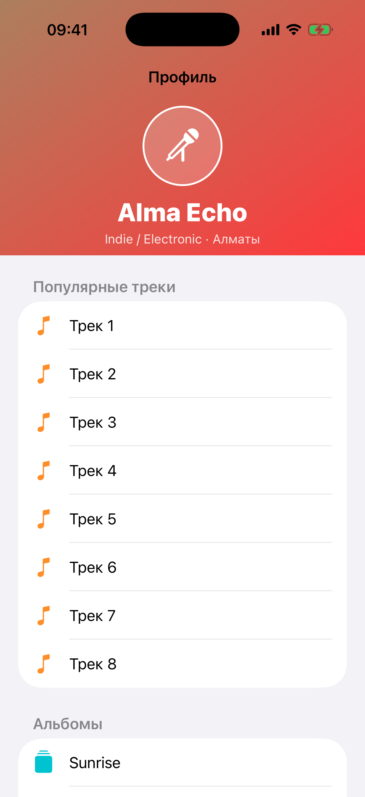

# Глава 21. Complex Layouts — параллакс, sticky header, stretchy

{width=45%}

Сложные экраны — это то, что отличает «учебный пример» от продакшен-
приложения. Сегодня без параллакса и stretchy-header'а смотрятся
плоско даже банковские приложения.

В этой главе строим экран в стиле «профиль артиста» (Apple Music
artist page): фоновый градиент сверху с аватаром и именем, список
секций под ним. При pull-down — фон растягивается, при scroll-up —
фон уезжает вместе с контентом, текст внутри двигается с **другой
скоростью** (параллакс).

Этот экран реализован в mini-app «Сложные экраны»
(`StretchyHeaderViewController`).

## 21.1 Архитектура

Главная идея: **header — это отдельный view**, не вложенный в
UITableView. Он лежит **поверх** таблицы, привязанный к окну.
TableView имеет contentInset.top, равный высоте header'а, чтобы
первая строка начиналась под ним.

```
┌─ self.view ──────────────┐
│  ┌─ headerView ────────┐ │  ← UIView, attached to view.topAnchor
│  │   градиент          │ │  ← height = 280 (динамическая)
│  │   ┌──┐              │ │
│  │   │A │              │ │  ← avatar + текст (с параллаксом)
│  │   └──┘              │ │
│  │   Alma Echo         │ │
│  └─────────────────────┘ │
│  ┌─ tableView ─────────┐ │  ← contentInset.top = 280
│  │  • Раздел 1         │ │
│  │  • Раздел 2         │ │
│  │  • ...              │ │
│  └─────────────────────┘ │
└──────────────────────────┘
```

Когда юзер скроллит таблицу, мы перехватываем `scrollViewDidScroll`
и **меняем высоту/позицию header'а** через AutoLayout constraints.

## 21.2 Сетап — два «слоя»

```swift
final class StretchyHeaderViewController: UIViewController {
    private let tableView = UITableView(frame: .zero, style: .insetGrouped)
    private let headerView = StretchyHeaderView()
    private let initialHeaderHeight: CGFloat = 280
    private var headerHeightConstraint: NSLayoutConstraint!
    private var headerTopConstraint: NSLayoutConstraint!

    override func viewDidLoad() {
        super.viewDidLoad()
        setupHeader()
        setupTable()
    }

    private func setupHeader() {
        headerView.translatesAutoresizingMaskIntoConstraints = false
        view.addSubview(headerView)
        headerHeightConstraint = headerView.heightAnchor.constraint(equalToConstant: initialHeaderHeight)
        headerTopConstraint = headerView.topAnchor.constraint(equalTo: view.topAnchor)
        NSLayoutConstraint.activate([
            headerTopConstraint,
            headerView.leadingAnchor.constraint(equalTo: view.leadingAnchor),
            headerView.trailingAnchor.constraint(equalTo: view.trailingAnchor),
            headerHeightConstraint,
        ])
    }

    private func setupTable() {
        tableView.translatesAutoresizingMaskIntoConstraints = false
        tableView.dataSource = self
        tableView.delegate = self
        tableView.contentInset = UIEdgeInsets(top: initialHeaderHeight, left: 0, bottom: 0, right: 0)
        tableView.verticalScrollIndicatorInsets = UIEdgeInsets(top: initialHeaderHeight, left: 0, bottom: 0, right: 0)
        tableView.contentInsetAdjustmentBehavior = .never
        tableView.backgroundColor = .systemGroupedBackground
        view.insertSubview(tableView, belowSubview: headerView)
        NSLayoutConstraint.activate([
            tableView.topAnchor.constraint(equalTo: view.topAnchor),
            // ... остальные anchors во весь экран ...
        ])
    }
}
```

Ключевые моменты:

**Стиль `.insetGrouped`** — без sticky-section-header'ов. Если был
`.plain`, заголовки секций «прилипали» бы к верху tableView (то есть
к `view.topAnchor`, ЗА нашим header'ом — визуально каша).

**`contentInsetAdjustmentBehavior = .never`** — отключаем
автоматическое добавление safeArea отступов. Мы сами управляем
`contentInset.top = initialHeaderHeight`.

**`view.insertSubview(tableView, belowSubview: headerView)`** —
tableView **под** header'ом по z-order. Без этого header был бы под
таблицей и невидимый.

**`headerTopConstraint`** и **`headerHeightConstraint`** — две
constraint'а, которыми будем «дышать»: менять `.constant` в scroll
handler'е.

## 21.3 ScrollViewDelegate — главная логика

```swift
func scrollViewDidScroll(_ scrollView: UIScrollView) {
    let offset = -(scrollView.contentOffset.y + scrollView.adjustedContentInset.top)
    if offset > 0 {
        // Pull-down: top остаётся на месте, шапка тянется вниз.
        headerHeightConstraint.constant = initialHeaderHeight + offset
        headerTopConstraint.constant = 0
    } else {
        // Скролл вверх: шапка плывёт вместе с контентом за верхний край.
        headerHeightConstraint.constant = initialHeaderHeight
        headerTopConstraint.constant = offset
    }
    headerView.applyParallax(offset: offset)
}
```

Это **самая важная** функция всего экрана. Давай разберём пошагово.

**`scrollView.contentOffset.y`** — позиция скролла. При
`contentInset.top = 280`:

- В **начальной** позиции (юзер видит верх): `contentOffset.y = -280`
  (минус, потому что content «отодвинут» от верха на 280pt).
- При **pull-down** (юзер тянет дальше вниз): `contentOffset.y = -280
  - extra`. Чем больше тянет, тем меньше число.
- При **скролле вверх** (видим контент ниже header'а):
  `contentOffset.y > -280`. По мере скролла растёт к 0 и дальше.

**`offset = -(contentOffset.y + adjustedContentInset.top)`**:

- Начальная: `-(-280 + 280) = 0`.
- Pull-down: `-(-280 - extra + 280) = extra` (положительный).
- Скролл-up: `-(-280 + scroll + 280) = -scroll` (отрицательный).

То есть `offset > 0` = «пользователь тянет дальше начала»,
`offset < 0` = «пользователь скроллит вглубь контента».

### Случай pull-down (offset > 0)

Header **растягивается вниз**. Верхняя кромка остаётся на месте,
высота увеличивается:

- `headerHeightConstraint.constant = initialHeaderHeight + offset`
  → высота 280 + сколько утянули.
- `headerTopConstraint.constant = 0` → верх на view.top.

Визуально: видим больше градиента сверху, аватар и текст уходят
вниз (потому что центрированы по centerY).

### Случай scroll-up (offset < 0)

Header **уезжает наверх** вместе с контентом:

- `headerHeightConstraint.constant = initialHeaderHeight` → высота
  не меняется.
- `headerTopConstraint.constant = offset` → отрицательный
  отступ от view.top.

Получается: header сидит от `-50` до `230` (если scrolled на 50pt).
Часть header'а ушла за верх экрана.

> ⚠ **Ошибки, которые легко совершить.** Я в первый раз делал
> «при scroll-up — уменьшаем height до минимума, не двигаем top».
> Получалось: header съёжился до 64pt в верхней части экрана,
> остался видимым, но `contentInset.top` не уменьшился → между
> низом header'а и первой строкой образовалась пустая зона. Так
> делать нельзя. Header должен **уехать**, не съёжиться.

## 21.4 Параллакс — текст «отстаёт» от header'а

```swift
func applyParallax(offset: CGFloat) {
    let limited = max(-150, min(150, offset))
    titleLabel.transform = CGAffineTransform(translationX: 0, y: -limited * 0.2)
    subtitleLabel.transform = CGAffineTransform(translationX: 0, y: -limited * 0.2)
}
```

Параллакс — это когда **разные элементы двигаются с разной скоростью**.
Header едет с `1.0` скоростью (вместе с scroll). Текст внутри —
едет с `0.8` скоростью (отстаёт на 20%). Создаётся эффект «глубины»
(текст как будто на 20% «ближе» к юзеру).

Что мы делаем: применяем `CGAffineTransform.translationX/Y` к
text-label'ам. Это **видимое смещение** без изменения layout'а.

`offset` — наш `offset` из scroll handler'а. Положительный при
pull-down, отрицательный при scroll-up.

`max(-150, min(150, offset))` — ограничение. При очень большом
смещении (юзер тянет на 500pt) текст не уезжает на 100pt вниз — это
выглядит безумно. Кэппим на 150pt.

`* 0.2` — параллакс-коэффициент. 0.2 = 20% скорости. Чем меньше —
тем сильнее «отставание». 0.5 — едва заметно.

Знак: при `offset > 0` (pull-down) → `-limited * 0.2 < 0` → text
двигается **вверх**. Header растягивается вниз, но текст остаётся
ближе к центру — параллакс.

> 💡 **Когда параллакс работает.** Лучше всего — когда есть **картинка**
> и **текст поверх неё**. Картинка движется быстрее (или медленнее)
> текста. Если только текст без фона — параллакс почти незаметен.

## 21.5 StretchyHeaderView — gradient + avatar + text

```swift
private final class StretchyHeaderView: UIView {
    private let gradient = CAGradientLayer()
    private let titleLabel = UILabel()
    private let subtitleLabel = UILabel()
    private let avatar = UIView()
    private let avatarSymbol = UIImageView()

    override init(frame: CGRect) {
        super.init(frame: frame)
        clipsToBounds = true
        gradient.colors = [UIColor.systemBrown.cgColor, UIColor.systemRed.cgColor]
        gradient.startPoint = CGPoint(x: 0, y: 0)
        gradient.endPoint = CGPoint(x: 1, y: 1)
        layer.insertSublayer(gradient, at: 0)
        // ... avatar, labels ...
    }

    override func layoutSubviews() {
        super.layoutSubviews()
        gradient.frame = bounds
    }
}
```

**`clipsToBounds = true`** — обязательно. Когда header растянулся
до 500pt и subview сдвинулись параллаксом, что-то может вылезти за
границы. clipping предотвращает «грязь» по краям.

**`CAGradientLayer`** — Apple-овский слой для градиентов. Параметры:
- `colors` — массив CGColor'ов, не UIColor.
- `startPoint` / `endPoint` — координаты в `[0, 1]` системе (а не
  в пикселях). `(0,0)` — top-left, `(1,1)` — bottom-right.

`layer.insertSublayer(gradient, at: 0)` — кладём градиент **под всем**
другим (avatar, labels). `at: 0` = первый sublayer, остальные сверху.

**`layoutSubviews` обновляет `gradient.frame = bounds`**. CALayer не
участвует в Auto Layout, поэтому ему **руками** надо обновлять размер
при изменении bounds. Без этого градиент остался бы 280×393 даже
когда header растянулся до 500×393.

## 21.6 Auto Layout внутри header'а

```swift
NSLayoutConstraint.activate([
    avatar.bottomAnchor.constraint(equalTo: bottomAnchor, constant: -76),
    avatar.centerXAnchor.constraint(equalTo: centerXAnchor),
    avatar.widthAnchor.constraint(equalToConstant: 88),
    avatar.heightAnchor.constraint(equalToConstant: 88),
    // ...
    titleLabel.topAnchor.constraint(equalTo: avatar.bottomAnchor, constant: 12),
    titleLabel.centerXAnchor.constraint(equalTo: centerXAnchor),

    subtitleLabel.topAnchor.constraint(equalTo: titleLabel.bottomAnchor, constant: 4),
    subtitleLabel.centerXAnchor.constraint(equalTo: centerXAnchor),
])
```

**Привязываем к `bottomAnchor`**, не к `topAnchor`. Это критично.

Когда header растягивается (height становится 380, 480, ...), top
всегда `0`. Если бы текст был привязан к top'у, он остался бы вверху,
а внизу был бы пустой растянутый градиент.

С привязкой к **bottom** — текст всегда на расстоянии 12pt от низа
header'а. Когда header вытягивается, текст уезжает вместе с низом,
как бы плавая на «pl». Растягивается верхняя часть — пустой градиент,
текст остаётся внизу.

Можно ещё ставить текст по `centerY` — тогда он будет в середине
header'а, не привязан к низу. Получится разное визуальное ощущение.

## 21.7 Sticky-section-header'ы — отказались

В `.plain` UITableView заголовки секций «прилипают» к верху таблицы
во время скролла. Это полезно для длинных списков (например, контакты:
A, B, C — буква текущей секции висит сверху).

Для нашего экрана с stretchy header'ом — sticky-headers создают
проблему: они прилипают к `tableView.top`, который у нас за header'ом.
Получалось:

```
┌─ headerView ────┐
│   градиент       │   ← edge 0pt
│                  │
│                  │
└──────────────────┘   ← edge 280pt
   "О профиле"      ← sticky! Прилеплен к view.top = за header'ом!
   • Artist · ...
   • ...
```

Стик-заголовок при первом scroll спрятался бы **под** header'ом. Не
вариант.

Поэтому стиль `.insetGrouped` — он не прилепляет заголовки, они
просто проматываются с контентом. Чисто.

## 21.8 SafeArea и navigation bar

Header идёт **от view.topAnchor**, не от safeArea. Это значит — он
залезает под navigation bar (если бы он был). У нас в
`BootCoordinator.showMain` mini-app оборачивается в
`UINavigationController` с translucent baranavigation bar.

Прозрачный nav bar **поверх** header'а — нормально. Под ним виден
градиент, размытый эффектом translucent material. Это даёт ощущение
«single piece» — header выглядит как продолжение nav bar'а.

Если бы хотели обычный nav bar **без** размытия (solid background) —
нужно либо отключить translucent (`navigationBar.isTranslucent = false`,
поставить `backgroundColor`), либо привязывать header к
`safeAreaLayoutGuide.topAnchor`, не к `view.topAnchor`. Но тогда
parallax-эффект под nav bar не работает.

## 21.9 Бытовая аналогия

Сложный экран — это **театральная сцена с задником, авансценой и
актёрами**.

- **Задник** — gradient в header'е. Один цвет, простой, фоновый.
- **Авансцена** — header целиком. Меняется в размере, но всегда виден.
- **Актёры** — текст и аватар. Двигаются по своей логике (параллакс).
- **Зрители** — UITableView с контентом. То, что юзер «слушает»,
  пока сцена их развлекает.

Декорации (header) меняются на разных актах — при pull-down,
scroll-up. Актёры (label'ы) не **прилеплены** к декорациям, они
двигаются по своей логике (параллакс).

## 21.10 Когда оно нужно

Stretchy header — это **продвинутый паттерн**. Хорошо смотрится в:

- **Profile screens** (Twitter, Instagram, Apple Music artist page).
- **Detail-экранах** (товар на маркетплейсе, рецепт, новость с
  большой картинкой).
- **Onboarding** одного экрана (большой welcome-area сверху, кнопки
  снизу).

Плохо смотрится в:

- **Списках задач/настроек** — функциональные экраны, не нужно
  украшательство.
- **Forms** (login, регистрация) — конкретная работа, шапка
  отвлекает.
- **Чатах** — composer и timeline главные, ничего сверху не нужно.

> 🛠 **Упражнение.** Открой Сложные экраны (коричневая ячейка).
> Потяни таблицу вниз — увидишь как header растягивается до огромных
> размеров, аватар уезжает с замедлением (параллакс). Отпусти —
> вернётся в норму. Поскролль вверх — header плавно уезжает за
> верхний край. На уже скролленом контенте header полностью скрыт.

## 21.11 Что мы пропустили

- **Sticky навбар-заголовок**. Когда header полностью скрыт,
  navigation bar заполняется именем «Alma Echo» (fade-in). Это
  делается через KVO на `scrollView.contentOffset` + `navigationItem
  .title = scrolled ? "Alma Echo" : nil`.
- **Картинка вместо градиента** — реальный photo header. Загрузка
  через ImageCache, blur на edges.
- **Multi-section sticky** — отдельные группы со sticky-заголовками
  типа «Popular tracks», «Albums», «Singles». Для этого нужен
  `.plain` стиль и careful обработка top inset.
- **Pin-to-top кнопка** при достаточном скролле — «↑» которая
  возвращает в начало.

## 📋 Что мы выучили

- **Header — отдельный UIView**, не tableHeaderView. Лежит поверх
  tableView, привязан к `view.topAnchor` через `headerTopConstraint`
  и `headerHeightConstraint`.
- TableView имеет `contentInset.top = initialHeaderHeight`,
  `contentInsetAdjustmentBehavior = .never` — мы сами рулим
  отступом.
- В `scrollViewDidScroll` вычисляем `offset = -(contentOffset.y +
  adjustedContentInset.top)`:
  - `offset > 0` (pull-down) → height += offset, top = 0.
  - `offset < 0` (scroll-up) → height = initialHeight, top = offset.
- `CAGradientLayer` для фона. `colors` принимает CGColor'ы.
  `gradient.frame = bounds` обновляем в `layoutSubviews`.
- **Параллакс** через `CGAffineTransform.translationX/Y` на subviews
  внутри header'а. Коэффициент 0.2 = 20% от scroll скорости.
- `clipsToBounds = true` на header'е — обязательно, иначе при
  растяжении subview'ы могут вылезти.
- Style `.insetGrouped` — без sticky-section-header'ов, которые
  ломали бы вёрстку с stretchy header'ом.
- **`bottomAnchor`** для subview'ов внутри header'а — текст и аватар
  всегда внизу, при растяжении просто появляется больше градиента
  сверху.

## Apple Developer Documentation

- [UIScrollView](https://developer.apple.com/documentation/uikit/uiscrollview) — базовый класс, через `contentOffset` и `contentInset` строится вся stretchy-логика.
- [UIScrollViewDelegate.scrollViewDidScroll(_:)](https://developer.apple.com/documentation/uikit/uiscrollviewdelegate/1619392-scrollviewdidscroll) — главный callback, в нём пересчитываем height/top header'а.
- [UIScrollView.contentOffset](https://developer.apple.com/documentation/uikit/uiscrollview/1619404-contentoffset) — текущая позиция скролла. Отрицательная — при pull-down за начальную позицию.
- [UIScrollView.adjustedContentInset](https://developer.apple.com/documentation/uikit/uiscrollview/2902259-adjustedcontentinset) — итоговый inset с учётом safeArea; используется в формуле `offset`.
- [UIScrollView.contentInsetAdjustmentBehavior](https://developer.apple.com/documentation/uikit/uiscrollview/2902261-contentinsetadjustmentbehavior) — `.never` отключает авто-инсеты, чтобы мы сами рулили top-inset'ом под header.
- [UITableView.Style.insetGrouped](https://developer.apple.com/documentation/uikit/uitableview/style/insetgrouped) — стиль без sticky-section-header'ов; они ломали бы наш header.
- [CAGradientLayer](https://developer.apple.com/documentation/quartzcore/cagradientlayer) — фон header'а. `gradient.frame = bounds` обновляем в `layoutSubviews`.
- [CGAffineTransform](https://developer.apple.com/documentation/coregraphics/cgaffinetransform) — `translationX/Y` для параллакса subview'ов внутри header'а.
- [UICollectionViewCompositionalLayout](https://developer.apple.com/documentation/uikit/uicollectionviewcompositionallayout) — современная альтернатива `UITableView` для multi-section sticky-layout'ов с supplementary item'ами.
- [NSCollectionLayoutBoundarySupplementaryItem](https://developer.apple.com/documentation/uikit/nscollectionlayoutboundarysupplementaryitem) — настоящий sticky header в compositional layout через `pinToVisibleBounds = true`.
- [HIG: Designing for iOS — Layout](https://developer.apple.com/design/human-interface-guidelines/layout) — отступы и safe areas для full-bleed header'ов под navigation bar'ом.

→ [Глава 22. Anatomy — тур по всем гейтам через modal preview](./30-anatomy.md)
