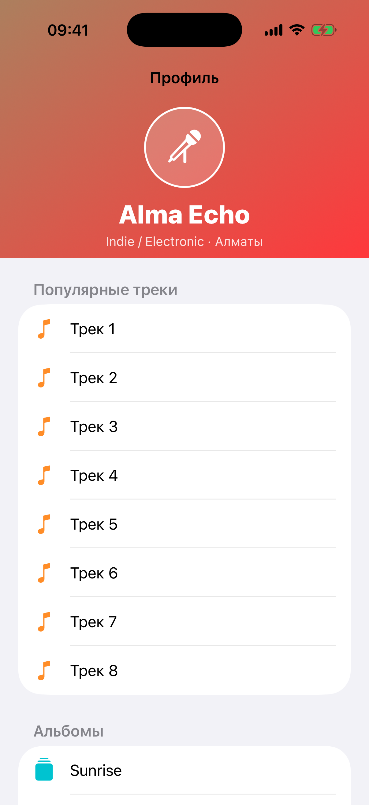

# Глава 21. Complex Layouts — параллакс, sticky header, stretchy

{width=45%}

Сложные экраны отличают учебный пример от приложения, которое приятно
держать в руках. Большая шапка, которая тянется вслед за пальцем, текст,
который движется медленнее фона, заголовки разделов, прилипающие к верху, —
всё это делается штатными средствами UIKit, без сторонних библиотек.

В этой главе строим экран в стиле «страница артиста» в музыкальном
приложении: сверху градиентная шапка с аватаром и именем, под ней список
разделов. Три эффекта:

- **Stretchy header** («тянущаяся шапка») — потянул список вниз дальше
  начала, шапка растягивается вместе с ним.
- При прокрутке вверх шапка уезжает за верхний край вместе с контентом.
- **Параллакс** — текст внутри шапки движется **с другой скоростью**, чем сама
  шапка. Разница скоростей создаёт ощущение глубины.

А в конце (21.11) — заголовки разделов, которые прилипают к верху, на
`UICollectionViewCompositionalLayout`, с расчётом всех размеров на числах.

Экран реализован в mini-app «Сложные экраны» (`StretchyHeaderViewController`).

> **Режим компиляции.** Весь код главы собран в проекте с deployment target
> iOS 15.0, Swift 6, Default Actor Isolation = MainActor. Числа в главе
> (координаты, размеры) не «на глаз»: мы запускали экран в симуляторе
> iPhone 16 на iOS 26.5 и печатали рамки view.

## 21.1 Архитектура

Сначала два понятия, на которых держится вся глава.

**`contentOffset`** — насколько содержимое scroll view прокручено. Это точка
содержимого, которая сейчас стоит в верхнем левом углу scroll view. Прокрутил
на 100 точек вниз по списку — `contentOffset.y = 100`.

**`contentInset`** — дополнительные поля вокруг содержимого, внутри которых
тоже можно прокручивать. `contentInset.top = 280` значит: «над первой строкой
есть 280 точек пустого места». Бытовая аналогия: лента конвейера, у которой
первые 280 сантиметров специально оставлены пустыми.

Идея экрана: **шапка — отдельный view**, не часть таблицы. Она лежит
**поверх** таблицы и прибита к верху экрана. Таблица получает
`contentInset.top = 280` — ровно высоту шапки, — поэтому первая строка в
начальном положении стоит сразу под шапкой.

```
┌─ self.view ──────────────┐
│  ┌─ headerView ────────┐ │  ← UIView поверх таблицы, верх = view.top
│  │   градиент          │ │  ← высота 280 (меняется)
│  │      ┌──┐           │ │
│  │      │A │           │ │  ← аватар + текст (параллакс)
│  │      └──┘           │ │
│  │    Alma Echo        │ │
│  └─────────────────────┘ │
│  ┌─ tableView ─────────┐ │  ← на весь экран, contentInset.top = 280
│  │  • Раздел 1         │ │
│  │  • Раздел 2         │ │
│  └─────────────────────┘ │
└──────────────────────────┘
```

Когда пользователь прокручивает таблицу, мы ловим `scrollViewDidScroll` и
меняем высоту и положение шапки через два constraint'а.

## 21.2 Сетап — два «слоя»

```swift
final class StretchyHeaderViewController: UIViewController {
    private let tableView = UITableView(frame: .zero, style: .insetGrouped)
    private let headerView = StretchyHeaderView()
    private let initialHeaderHeight: CGFloat = 280
    private var headerHeightConstraint: NSLayoutConstraint!
    private var headerTopConstraint: NSLayoutConstraint!

    private let sections: [(title: String, rows: [String])] = [
        ("О профиле", ["Артист · Алматы", "12 альбомов", "1,2 млн слушателей"]),
        ("Популярное", (1...8).map { "Трек \($0)" }),
        ("Альбомы", (1...6).map { "Альбом \($0)" }),
    ]

    override func viewDidLoad() {
        super.viewDidLoad()
        view.backgroundColor = .systemGroupedBackground
        setupHeader()
        setupTable()
    }

    private func setupHeader() {
        headerView.translatesAutoresizingMaskIntoConstraints = false
        view.addSubview(headerView)
        headerHeightConstraint = headerView.heightAnchor.constraint(equalToConstant: initialHeaderHeight)
        headerTopConstraint = headerView.topAnchor.constraint(equalTo: view.topAnchor)
        NSLayoutConstraint.activate([
            headerTopConstraint,
            headerView.leadingAnchor.constraint(equalTo: view.leadingAnchor),
            headerView.trailingAnchor.constraint(equalTo: view.trailingAnchor),
            headerHeightConstraint,
        ])
    }

    private func setupTable() {
        tableView.translatesAutoresizingMaskIntoConstraints = false
        tableView.register(UITableViewCell.self, forCellReuseIdentifier: "row")
        tableView.dataSource = self
        tableView.delegate = self
        tableView.contentInset.top = initialHeaderHeight
        tableView.verticalScrollIndicatorInsets.top = initialHeaderHeight
        tableView.contentInsetAdjustmentBehavior = .never
        // Отступ сам по себе прокрутку не сдвигает — ставим начальную позицию явно.
        tableView.contentOffset.y = -initialHeaderHeight
        tableView.backgroundColor = .clear
        view.insertSubview(tableView, belowSubview: headerView)
        NSLayoutConstraint.activate([
            tableView.topAnchor.constraint(equalTo: view.topAnchor),
            tableView.bottomAnchor.constraint(equalTo: view.bottomAnchor),
            tableView.leadingAnchor.constraint(equalTo: view.leadingAnchor),
            tableView.trailingAnchor.constraint(equalTo: view.trailingAnchor),
        ])
    }

    // .never выключил и нижний автоматический отступ — возвращаем его руками,
    // иначе последняя строка спрячется под полоской «домой».
    override func viewSafeAreaInsetsDidChange() {
        super.viewSafeAreaInsetsDidChange()
        tableView.contentInset.bottom = view.safeAreaInsets.bottom
        tableView.verticalScrollIndicatorInsets.bottom = view.safeAreaInsets.bottom
    }
}
```

Ключевые моменты.

**`sections`** — данные экрана: массив кортежей «заголовок раздела + строки».
Для учебного экрана кортежа хватает; в настоящем приложении здесь была бы
модель из сети.

**Стиль `.insetGrouped`** — разделы в виде скруглённых карточек с отступами
по бокам, как в «Настройках». Важнее другое: у сгруппированных стилей
заголовки разделов **не прилипают** к верху при прокрутке. Почему это нам
важно — в 21.7.

**`contentInsetAdjustmentBehavior = .never`** — по умолчанию scroll view сам
добавляет к своим отступам **safe area** (полосу под статус-баром и
навигационной панелью сверху, под полоской «домой» снизу). Итоговый отступ —
«наш + автоматический» — лежит в `adjustedContentInset`. Мы выключаем
автоматику, чтобы верхний отступ был ровно 280 и формулы ниже работали на
простых числах.

**`tableView.contentOffset.y = -initialHeaderHeight`** — неочевидная, но
обязательная строка. Отступ сам по себе прокрутку не сдвигает: таблица
создаётся с `contentOffset.y = 0`, то есть первые 280 точек содержимого
(раздел «О профиле» целиком) оказываются **под шапкой**. Мы поймали это в
симуляторе: без строки экран открывался сразу с раздела «Популярное», а
`contentOffset.y` был 0 вместо −280. Первая версия главы этой строки не
имела — и первый раздел был спрятан, пока пользователь не начинал листать.
Ставим начальную позицию явно: «видимая область начинается на 280 точек
выше содержимого».

У `.never` есть обратная сторона, которую первая версия главы не учла:
выключается и **нижний** автоматический отступ. Последние строки уходили под
полоску «домой» (34 точки на iPhone 16). Поэтому
`viewSafeAreaInsetsDidChange()` — UIKit вызывает его, когда safe area
экрана меняется (при первом показе, при повороте) — возвращает нижний отступ
руками: `contentInset.bottom = 34`.

**`verticalScrollIndicatorInsets`** (iOS 13+) — отступы полосы прокрутки.
Иначе полоса начиналась бы с самого верха, «поверх» шапки.

**`backgroundColor = .clear`** у таблицы — фон даёт `view`
(`systemGroupedBackground`), а таблица прозрачна. Так в момент растяжения
под шапкой не мелькает другой цвет.

**`view.insertSubview(tableView, belowSubview: headerView)`** — таблица
**под** шапкой по z-порядку (порядку наложения). Шапка рисуется поверх.

**`headerTopConstraint`** и **`headerHeightConstraint`** — два constraint'а,
которыми будем «дышать»: менять `.constant` при прокрутке. Неявно
развёрнутые опционалы (`!`), потому что создаются в `setupHeader()`, а не в
инициализаторе; до `viewDidLoad` к ним никто не обращается.

## 21.3 ScrollViewDelegate — главная логика

`UITableView` — наследник `UIScrollView` (цепочку мы проверили в рантайме,
см. главу 22), а протокол `UITableViewDelegate` наследует
`UIScrollViewDelegate`. Поэтому делегат таблицы получает и события прокрутки:

```swift
extension StretchyHeaderViewController: UITableViewDataSource, UITableViewDelegate {
    func numberOfSections(in tableView: UITableView) -> Int { sections.count }

    func tableView(_ tableView: UITableView, numberOfRowsInSection section: Int) -> Int {
        sections[section].rows.count
    }

    func tableView(_ tableView: UITableView, titleForHeaderInSection section: Int) -> String? {
        sections[section].title
    }

    func tableView(_ tableView: UITableView, cellForRowAt indexPath: IndexPath) -> UITableViewCell {
        let cell = tableView.dequeueReusableCell(withIdentifier: "row", for: indexPath)
        var content = cell.defaultContentConfiguration()
        content.text = sections[indexPath.section].rows[indexPath.row]
        cell.contentConfiguration = content
        return cell
    }

    func scrollViewDidScroll(_ scrollView: UIScrollView) {
        let offset = -(scrollView.contentOffset.y + scrollView.adjustedContentInset.top)
        if offset > 0 {
            // Тянут вниз: верх шапки стоит, шапка вытягивается.
            headerHeightConstraint.constant = initialHeaderHeight + offset
            headerTopConstraint.constant = 0
        } else {
            // Листают вверх: шапка целиком уезжает за верхний край.
            headerHeightConstraint.constant = initialHeaderHeight
            headerTopConstraint.constant = offset
        }
        headerView.applyParallax(offset: offset)
    }
}
```

Первые четыре метода — обычный data source таблицы: сколько разделов,
сколько строк, заголовок раздела, ячейка. Главное — `scrollViewDidScroll`.
Его вызывают на **каждом кадре** прокрутки — до 60 раз в секунду (на экранах
ProMotion — до 120), поэтому внутри только арифметика и два присваивания.

Разберём формулу на числах. У нас `contentInset.top = 280` и автоматика
выключена, значит `adjustedContentInset.top` тоже 280.

**`contentOffset.y`** при таком отступе:

- **Начальное положение** (шапка целиком, первая строка сразу под ней):
  `contentOffset.y = -280`. Минус — потому что над содержимым 280 точек
  пустого поля, и видимая область начинается «выше нуля».
- **Потянули вниз** на 100 точек дальше начала: `contentOffset.y = -380`.
- **Прокрутили вверх** на 50 точек: `contentOffset.y = -230`.

**`offset = -(contentOffset.y + 280)`**:

- Начало: −(−280 + 280) = 0.
- Потянули на 100: −(−380 + 280) = −(−100) = **100** — положительный.
- Прокрутили на 50: −(−230 + 280) = −(50) = **−50** — отрицательный.

То есть `offset` — «насколько ушли от начального положения»: плюс — тянут
вниз дальше начала, минус — листают вглубь списка. Внешний минус в формуле
нужен только для удобного знака: «тянут вниз» = положительное число.

### Тянут вниз (offset > 0)

Шапка **растягивается**. Верх стоит на месте, растёт высота:

- `headerHeightConstraint.constant = 280 + offset` → при `offset = 100`
  высота 380;
- `headerTopConstraint.constant = 0` → верх на верху экрана.

Замер в симуляторе: при `offset = 100` рамка шапки — `(0, 0, 393, 380)`,
первая строка таблицы начинается на 380 + отступ секции — ровно под шапкой.
Аватар и текст привязаны к **низу** шапки (21.6), поэтому уезжают вниз вместе
с ним, а сверху открывается больше градиента.

### Листают вверх (offset < 0)

Шапка **уезжает** наверх вместе с контентом:

- `headerHeightConstraint.constant = 280` — высота не меняется;
- `headerTopConstraint.constant = offset` → при `offset = −50` верх шапки
  на −50, то есть за верхним краем экрана.

Шапка занимает полосу от −50 до 230: верхние 50 точек ушли за край, низ
шапки (230) совпадает с началом первой строки (280 − 50 = 230). Шапка и
таблица двигаются как одно целое.

> **Ошибка, которую легко совершить.** Первая идея — при прокрутке вверх
> уменьшать высоту шапки до минимума (скажем, 64) и не двигать верх. Шапка
> съёживается и остаётся наверху, а `contentInset.top` по-прежнему 280 —
> между низом шапки и первой строкой образуется пустая полоса. Шапка должна
> **уехать**, а не съёжиться. (Сворачивающаяся шапка тоже бывает, но тогда
> одновременно меняют и `contentInset`, и это отдельный рецепт.)

## 21.4 Шапка не должна ловить касания

Шапка лежит **поверх** таблицы. Что будет, если пользователь положит палец на
градиент и потянет вниз?

Когда палец касается экрана, UIKit ищет, какому view достался тап. Процесс
называется **hit-testing** («проверка попадания»): система идёт от верхних
view к нижним и отдаёт касание самому верхнему, который лежит под пальцем и
**принимает касания**. Жест прокрутки таблицы (`UIPanGestureRecognizer`
внутри `UIScrollView`) получает только те касания, которые достались самой
таблице или её subview.

Замер в симуляторе: точка (100; 100) над таблицей, накрытой обычным `UIView`
высотой 280, — `hitTest` возвращает накрывающий `UIView`. То есть тянуть
таблицу за шапку **нельзя**: палец «застревает» на шапке, и потянуть
таблицу вниз получится, только если начинать жест ниже шапки.

Лечение — одна строка в шапке:

```swift
isUserInteractionEnabled = false
```

С ней тот же замер возвращает `UITableView`: касание проходит сквозь шапку к
таблице. Шапке касания не нужны — в ней нет кнопок. Если кнопки в шапке
появятся (например, «Подписаться»), понадобится переопределить
`hitTest(_:with:)` у шапки: возвращать кнопку, если палец на ней, и `nil`
для всего остального.

## 21.5 StretchyHeaderView — градиент, аватар, текст

```swift
final class StretchyHeaderView: UIView {
    // Слой самого view — сразу градиент. Размер он берёт от view без нашей помощи.
    override class var layerClass: AnyClass { CAGradientLayer.self }
    private var gradientLayer: CAGradientLayer { layer as! CAGradientLayer }

    private let avatar = UIView()
    private let avatarSymbol = UIImageView(image: UIImage(systemName: "music.mic"))
    private let titleLabel = UILabel()
    private let subtitleLabel = UILabel()

    override init(frame: CGRect) {
        super.init(frame: frame)
        clipsToBounds = true
        // Шапка — только картинка. Все касания проходят сквозь неё к таблице.
        isUserInteractionEnabled = false

        gradientLayer.startPoint = CGPoint(x: 0, y: 0)
        gradientLayer.endPoint = CGPoint(x: 1, y: 1)
        updateGradientColors()

        avatar.backgroundColor = UIColor.white.withAlphaComponent(0.25)
        avatar.layer.cornerRadius = 44
        avatarSymbol.tintColor = .white
        avatarSymbol.preferredSymbolConfiguration = UIImage.SymbolConfiguration(pointSize: 36, weight: .semibold)

        titleLabel.text = "Alma Echo"
        titleLabel.font = .systemFont(ofSize: 28, weight: .bold)
        titleLabel.textColor = .white
        subtitleLabel.text = "Артист · 1,2 млн слушателей"
        subtitleLabel.font = .systemFont(ofSize: 15, weight: .medium)
        subtitleLabel.textColor = UIColor.white.withAlphaComponent(0.85)

        for v in [avatar, avatarSymbol, titleLabel, subtitleLabel] {
            v.translatesAutoresizingMaskIntoConstraints = false
        }
        addSubview(avatar)
        avatar.addSubview(avatarSymbol)
        addSubview(titleLabel)
        addSubview(subtitleLabel)

        // ... constraints — в 21.6
    }

    required init?(coder: NSCoder) { fatalError("Создаём только из кода") }

    // CGColor не умеет «перекрашиваться» под тему — делаем это сами.
    override func traitCollectionDidChange(_ previousTraitCollection: UITraitCollection?) {
        super.traitCollectionDidChange(previousTraitCollection)
        if traitCollection.hasDifferentColorAppearance(comparedTo: previousTraitCollection) {
            updateGradientColors()
        }
    }

    private func updateGradientColors() {
        gradientLayer.colors = [
            UIColor.systemBrown.resolvedColor(with: traitCollection).cgColor,
            UIColor.systemRed.resolvedColor(with: traitCollection).cgColor,
        ]
    }
}
```

**`CAGradientLayer`** — слой Core Animation, который рисует градиент. У каждого
`UIView` есть свой **layer** (слой) — то, что реально рисуется на экране; view
управляет им и добавляет касания и Auto Layout.

**`override class var layerClass`** — говорим UIKit: «слой этого view —
не обычный `CALayer`, а `CAGradientLayer`». Замер: у обычного `UIView` слой
типа `CALayer`, у `StretchyHeaderView` — `CAGradientLayer`. Слой самого view
всегда совпадает с ним по размеру, поэтому при растяжении шапки градиент
растягивается сам.

Градиент можно сделать **отдельным** слоем
(`layer.insertSublayer(gradient, at: 0)`) и обновлять его размер в
`layoutSubviews`. Так делают часто, но у отдельного слоя есть подвох: любое
изменение его `frame` по умолчанию **неявно анимируется** за 0,25 секунды.
Замер: после изменения размера у такого слоя появились анимации `position` и
`bounds`, у `layerClass`-варианта — ни одной. При растяжении шапки пальцем
отдельный градиент отставал бы от краёв. `layerClass` убирает и
`layoutSubviews`, и эту проблему.

`layer as! CAGradientLayer` — принудительное приведение типа. Обычно `as!`
— повод насторожиться, но здесь класс слоя мы задали сами строкой выше, и
приведение не может не сработать.

**`clipsToBounds = true`** — всё, что выходит за рамку шапки, обрезается.
Параллакс сдвигает текст, и при сильном смещении он мог бы вылезти за шапку
на таблицу.

Параметры градиента:

- `colors` — массив `CGColor`, не `UIColor`: Core Animation работает с более
  низкоуровневыми цветами.
- `startPoint` / `endPoint` — начало и конец градиента **в долях** слоя, а не
  в точках: (0; 0) — левый верхний угол, (1; 1) — правый нижний. Градиент
  идёт по диагонали; при любом размере шапки — из угла в угол.

**Цвета и тёмная тема.** `UIColor.systemBrown` — **динамический** цвет: в
светлой и тёмной теме у него разные оттенки. А `CGColor` — «снимок» цвета
на момент вызова, он не знает о темах. Первая версия главы брала
`.cgColor` один раз в `init` — после переключения темы градиент оставался
старым. Теперь `resolvedColor(with: traitCollection)` берёт вариант цвета для
текущей темы, а `traitCollectionDidChange` перекрашивает градиент при смене.
**Trait collection** — набор характеристик окружения view: тема, размер
шрифта, size class. `hasDifferentColorAppearance` — «поменялось ли что-то, что
влияет на цвета».

(В iOS 17 `traitCollectionDidChange` помечен устаревшим в пользу
`registerForTraitChanges`. При deployment target iOS 15 компилятор не
предупреждает, и метод продолжает работать; когда поднимешь минимальную
версию до 17, перейди на новый API.)

## 21.6 Auto Layout внутри шапки

```swift
NSLayoutConstraint.activate([
    avatar.bottomAnchor.constraint(equalTo: bottomAnchor, constant: -76),
    avatar.centerXAnchor.constraint(equalTo: centerXAnchor),
    avatar.widthAnchor.constraint(equalToConstant: 88),
    avatar.heightAnchor.constraint(equalToConstant: 88),
    avatarSymbol.centerXAnchor.constraint(equalTo: avatar.centerXAnchor),
    avatarSymbol.centerYAnchor.constraint(equalTo: avatar.centerYAnchor),

    titleLabel.topAnchor.constraint(equalTo: avatar.bottomAnchor, constant: 12),
    titleLabel.centerXAnchor.constraint(equalTo: centerXAnchor),

    subtitleLabel.topAnchor.constraint(equalTo: titleLabel.bottomAnchor, constant: 4),
    subtitleLabel.centerXAnchor.constraint(equalTo: centerXAnchor),
])
```

Всё привязано к **низу** шапки, а не к верху. Посчитаем положение элементов
в шапке высотой 280:

- низ аватара — на 76 точек выше низа шапки: 280 − 76 = **204**;
- аватар 88×88, значит его верх: 204 − 88 = **116**;
  `cornerRadius = 44` (половина от 88) — круг;
- верх имени — на 12 ниже аватара: 204 + 12 = **216** (замер в симуляторе:
  `title.minY = 216`);
- подзаголовок — ещё на 4 точки ниже имени.

Имя и подзаголовок вместе занимают около 56 точек (две строки текста
28 и 15 точек плюс 4 между ними), так что под подзаголовком остаётся
примерно 8 точек до низа шапки. Отсюда и число 76: 12 + 56 + 8.

Почему низ? Когда шапка растягивается до 380, верх остаётся на 0, а низ
уезжает на 380. Если бы аватар был привязан к верху, он остался бы на 116,
а внизу открылась бы пустая полоса градиента в 100 точек — между аватаром и
первой строкой. С привязкой к низу аватар и текст едут вниз вместе с краем
шапки и всё время стоят прямо над списком, а растягивается пустой градиент
**сверху**. Замер: при растяжении на 100 точек имя переместилось с 216 на
296 — на 80, а не на 100. Недостающие 20 точек — это параллакс (21.7).

Можно центрировать содержимое по `centerY` — тогда при растяжении оно будет
держаться посередине шапки. Другой характер: «подплывает», а не «прижат к
списку».

`avatarSymbol` центрирован внутри аватара — это просто иконка SF Symbol
поверх полупрозрачного белого круга.

**Упражнение 21.1.** Поменяй привязку аватара на
`avatar.topAnchor.constraint(equalTo: topAnchor, constant: 116)` (то же
положение в покое). Потяни список вниз на пару сантиметров. Что изменилось?
Ответ — в конце главы.

## 21.7 Параллакс — текст «отстаёт» от шапки

```swift
func applyParallax(offset: CGFloat) {
    let limited = max(-150, min(150, offset))
    let shift = CGAffineTransform(translationX: 0, y: -limited * 0.2)
    titleLabel.transform = shift
    subtitleLabel.transform = shift
}
```

**Параллакс** — когда разные слои движутся с разной скоростью. Из окна поезда
близкие столбы проносятся мимо, а дальние горы едва смещаются. Мозг читает
разницу скоростей как глубину: что медленнее — то дальше.

Здесь низ шапки движется со скоростью пальца (коэффициент 1,0), а текст —
на 20% медленнее, со скоростью 0,8. Текст как будто лежит **глубже** шапки.

Как это считается. `transform` — **аффинное преобразование**: сдвиг, поворот
или масштаб, наложенный на view поверх Auto Layout. Constraints не меняются,
view просто рисуется в другом месте. `CGAffineTransform(translationX: 0, y: d)`
— сдвиг на `d` точек по вертикали (плюс — вниз, минус — вверх).

На числах:

- **Тянем вниз на 100** (`offset = 100`): низ шапки и текст (через
  constraints) уехали вниз на 100. Сдвиг текста: −100 × 0,2 = −20, то есть на
  20 вверх. Итого текст сместился на 100 − 20 = 80 — это 0,8 от пальца. Замер
  подтверждает: имя с 216 переехало на 296.
- **Листаем вверх на 50** (`offset = −50`): шапка уехала вверх на 50. Сдвиг
  текста: −(−50) × 0,2 = +10, вниз. Итого вверх на 50 − 10 = 40 — снова 0,8.

Коэффициент 0,2 — доля «отставания». Чем он **больше**, тем сильнее эффект:
при 0,5 текст движется вдвое медленнее шапки — очень заметно; при 0,05 — едва
различимо. 0,2 — ощутимо, но не укачивает. (Не путай: чем меньше
коэффициент, тем слабее эффект, а не сильнее.)

`max(-150, min(150, offset))` — зажим в диапазон ±150. Пользователь может
утянуть список на 500 точек; без зажима текст отстал бы на 500 × 0,2 =
100 точек, и сильно растянутая шапка выглядела бы странно. С зажимом
отставание не больше 150 × 0,2 = 30 точек.

Аватар в параллаксе не участвует — он едет вместе с краем шапки. Разница
скоростей аватара и имени и даёт глубину. Если сдвинуть всё одинаково,
эффект пропадёт.

> **Когда параллакс работает.** Лучше всего — на **картинке с текстом
> поверх**: фото движется медленнее, текст быстрее (или наоборот). На
> однотонном фоне без деталей разницу скоростей почти не видно — глазу не за
> что зацепиться.
>
> И уважай настройку «Уменьшение движения»: если
> `UIAccessibility.isReduceMotionEnabled == true`, параллакс лучше выключить
> (передавать в `applyParallax` ноль).

## 21.8 Sticky-заголовки разделов — почему отказались

У таблицы в стиле `.plain` заголовки разделов **прилипают** (sticky header,
«липкий заголовок»): пока раздел на экране, его заголовок висит у верхнего
края таблицы. В контактах так висит буква текущего раздела — «А», «Б».

Где именно «верхний край»? Не у нулевой точки, а **под верхним отступом**
таблицы. Мы проверили: `.plain`-таблица, `contentInset.top = 280`,
автоматика выключена. В начальном положении заголовок первого раздела стоит
на 302 точках от верха экрана: 280 отступа плюс 22 точки — верхний отступ
заголовка, который у `.plain`-таблиц появился в iOS 15
(`sectionHeaderTopPadding`). Прокручиваем на 400 точек — шапка давно уехала,
а заголовок **прилип на 280**, посреди экрана, и строки проезжают под ним.

```
┌──────────────────┐   ← верх экрана; шапка уже уехала
│  • Трек 5         │
│  • Трек 6         │
│ ─ Популярное ──── │   ← прилипший заголовок на y = 280, посреди экрана!
│  • Трек 7         │
│  • Трек 8         │
└──────────────────┘
```

Причина: прилипание считается от «видимого верха с учётом отступов», а наш
отступ в 280 точек статичный — он не знает, что шапка уехала. Со стилем
`.insetGrouped` заголовки не прилипают и просто уезжают вместе со строками
(замер: при прокрутке на 400 заголовок первого раздела уже за экраном).

Если липкие заголовки нужны и со stretchy-шапкой — придётся менять
`contentInset.top` вслед за шапкой или перейти на compositional layout
(21.11), где прилипание настраивается явно.

## 21.9 Safe area и навигационная панель

Шапка идёт **от `view.topAnchor`**, а не от safe area — то есть залезает под
статус-бар и под навигационную панель, если экран внутри
`UINavigationController` (в playground'е mini-app показывается именно так).
Градиент во весь верх и выглядит как продолжение панели.

Как выглядит сама панель, решает iOS. С iOS 15 у навигационной панели два
вида: `scrollEdgeAppearance` — когда связанный с ней scroll view прокручен в
самое начало, — по умолчанию **прозрачный**, без фона; и
`standardAppearance` — когда контент уехал под панель, — с размытым
полупрозрачным фоном. На нашем экране в начальном положении панель
прозрачная, кнопка «Назад» лежит прямо на градиенте; прокрутишь — появится
размытый фон.

Проверь контраст: кнопка «Назад» по умолчанию цвета `tintColor` (обычно
синего), а на коричнево-красном градиенте синий читается плохо. Поставь
`navigationController?.navigationBar.tintColor = .white` на время показа
экрана и верни прежний цвет при уходе.

Если нужна обычная непрозрачная панель, привяжи шапку к
`view.safeAreaLayoutGuide.topAnchor`: тогда градиент начнётся под панелью, но
и растяжение будет только в видимой области под ней.

**Упражнение 21.2.** Замени `.insetGrouped` на `.plain` и прокрути список вверх
так, чтобы шапка уехала. Где висит заголовок «О профиле»? Ответ — в конце
главы.

## 21.10 Бытовая аналогия

Сложный экран — **театральная сцена**.

- **Задник** — градиент шапки. Фон, на котором всё происходит.
- **Авансцена** — шапка целиком: меняет размер, уезжает и возвращается.
- **Актёры** — имя и подзаголовок. Двигаются по своей логике (параллакс),
  не приклеены намертво к декорациям.
- **Зрительный зал** — таблица с контентом, ради которого пользователь и
  пришёл.

А прозрачная шапка из 21.4 — это **стекло витрины**: всё видно, но руку
просунуть можно только если стекла нет.

## 21.11 Липкие заголовки на compositional layout

Если нужна сетка карточек с разделами и **липкими** заголовками, удобнее
`UICollectionView` с **compositional layout** (iOS 13+). Это способ описать
раскладку коллекции «кубиками»: **item** (одна ячейка) → **group** (строка или
столбец ячеек) → **section** (раздел из повторяющихся групп). Размеры
задаются не в точках, а **относительно** контейнера:

- `.fractionalWidth(0.5)` — половина ширины контейнера;
- `.fractionalHeight(1.0)` — вся высота контейнера;
- `.absolute(44)` — ровно 44 точки;
- `.estimated(44)` — «примерно 44»: система посчитает настоящий размер через
  Auto Layout содержимого, 44 — лишь стартовая оценка.

«Контейнер» у каждого уровня свой: для item — группа, в которой он лежит;
для группы — раздел (за вычетом отступов раздела).

```swift
static func makeLayout() -> UICollectionViewCompositionalLayout {
    // Ячейка: половина ширины группы, высота = половина ширины группы → квадрат.
    let itemSize = NSCollectionLayoutSize(widthDimension: .fractionalWidth(0.5),
                                          heightDimension: .fractionalWidth(0.5))
    let item = NSCollectionLayoutItem(layoutSize: itemSize)
    item.contentInsets = NSDirectionalEdgeInsets(top: 4, leading: 4, bottom: 4, trailing: 4)

    // Группа — строка во всю ширину секции; в неё влезает 2 ячейки.
    let groupSize = NSCollectionLayoutSize(widthDimension: .fractionalWidth(1.0),
                                           heightDimension: .fractionalWidth(0.5))
    let group = NSCollectionLayoutGroup.horizontal(layoutSize: groupSize, subitems: [item])

    let section = NSCollectionLayoutSection(group: group)
    section.contentInsets = NSDirectionalEdgeInsets(top: 8, leading: 12, bottom: 16, trailing: 12)

    // Заголовок секции: ширина во всю строку, высота — «примерно 44, уточнит Auto Layout».
    let headerSize = NSCollectionLayoutSize(widthDimension: .fractionalWidth(1.0),
                                            heightDimension: .estimated(44))
    let header = NSCollectionLayoutBoundarySupplementaryItem(
        layoutSize: headerSize,
        elementKind: UICollectionView.elementKindSectionHeader,
        alignment: .top)
    header.pinToVisibleBounds = true          // прилипает к верху, пока секция на экране
    section.boundarySupplementaryItems = [header]

    return UICollectionViewCompositionalLayout(section: section)
}
```

Посчитаем размеры на iPhone 16 (ширина коллекции 393 точки), шаг за шагом.

1. **Раздел.** `section.contentInsets` — 12 слева и 12 справа. Ширина для
   групп: 393 − 12 − 12 = **369**.
2. **Группа.** Ширина `.fractionalWidth(1.0)` — вся ширина раздела: 369.
   Высота `.fractionalWidth(0.5)` — половина **ширины** раздела:
   369 × 0,5 = **184,5**. (Да, высоту можно задать через ширину — так
   получаются квадраты и пропорции, не зависящие от экрана.)
3. **Ячейка.** Ширина `.fractionalWidth(0.5)` — половина ширины группы:
   369 × 0,5 = 184,5. Высота `.fractionalWidth(0.5)` — тоже 184,5. В группу
   шириной 369 помещается 369 / 184,5 = 2 ячейки — горизонтальная группа сама
   повторяет item, пока хватает места.
4. **Отступы ячейки.** `item.contentInsets` по 4 со всех сторон
   **уменьшают** ячейку внутри отведённого ей места: 184,5 − 4 − 4 =
   **176,5** (на экране — 176,33, см. ниже). Первая ячейка начинается на 12 (отступ раздела) + 4 (свой
   отступ) = **16** точек от левого края; между двумя ячейками 4 + 4 =
   **8** точек.

Замер в симуляторе (рамки из `layoutAttributesForItem`): первая ячейка
`x = 16, ширина 176,33, высота 176,33`, вторая — `x = 200,33`, то есть
16 + 176,33 + 8. Откуда 176,33 вместо 176,5? Раскладка выравнивает рамки по
**пиксельной сетке** экрана. У iPhone 16 экран @3x: одна точка — это
3 × 3 физических пикселя, и край view может стоять только на границе
пикселя, то есть с шагом 1/3 точки (0, 0,33, 0,67, 1…). Число 176,5 на эту
сетку не попадает (оно ровно посередине между 176,33 и 176,67), и UIKit берёт 176,33.
На экране @2x шаг 0,5 точки, там осталось бы 176,5.

**Заголовок** — `NSCollectionLayoutBoundarySupplementaryItem`: «дополнительный
view на границе раздела» (`alignment: .top` — над разделом). Ширина — вся
ширина раздела, высота `.estimated(44)`: наш `SectionHeaderView` — это
`UILabel` шрифта `.headline` с отступами 8 сверху и снизу, и система
вычисляет его настоящую высоту сама — в симуляторе вышло 36,33 точки вместо
оценочных 44. Поэтому первый ряд ячеек начинается на 36,33 + 8 (отступ
раздела) + 4 (отступ ячейки) = 48,33 — так и показал замер. С крупным
Dynamic Type заголовок вырастет, а не обрежется.

Одна тонкость из заголовочного файла UIKit: `contentInsets` у item
**игнорируются по оси, где размер `.estimated`**. Для ячеек с оценочной
высотой отступы сверху/снизу задавай расстоянием между группами
(`section.interGroupSpacing`) или внутри самой ячейки.

`pinToVisibleBounds = true` — заголовок прилипает к верху видимой области,
пока его раздел на экране; когда раздел уходит, заголовок нового раздела
«выталкивает» предыдущий. Проверили: прокрутили коллекцию на 600 точек —
заголовок второго раздела оказался на 659 = 600 + 59, то есть у верхнего
края видимой области **под** safe area (59 точек — статус-бар и Dynamic
Island на iPhone 16). У этой коллекции автоматические отступы не выключены,
и прилипание их учитывает.

Для iOS 16+ есть `NSCollectionLayoutGroup.horizontal(layoutSize:repeatingSubitem:count:)`
— «ровно N одинаковых ячеек»; старый вариант `subitem:count:` в iOS 16
объявлен устаревшим. Наш вариант с массивом `subitems: [item]` работает на
всех версиях с iOS 13.

Полный экран-пример (`StickyGridViewController` с data source и
`SectionHeaderView`) — в ответе к упражнению 21.3.

**Упражнение 21.3.** Сделай три ячейки в ряд вместо двух. Какие два числа в
`makeLayout()` поменяются и какой получится видимая ширина ячейки на
iPhone 16? Ответ — в конце главы.

## 21.12 Когда оно нужно

Stretchy header — продвинутый паттерн. Хорошо смотрится:

- на **экранах профиля** — артист, пользователь, компания;
- на **детальных экранах** — товар, рецепт, статья с большой фотографией.

Плохо смотрится:

- в **списках задач и настроек** — рабочие экраны, украшение отвлекает;
- в **формах** (вход, регистрация) — шапка съедает место под клавиатурой;
- в **чатах** — главное там лента сообщений и поле ввода.

**Упражнение 21.4.** Открой «Сложные экраны» (голубая ячейка). Положи палец
**на шапку** и потяни вниз, отпусти. Потом прокрути вверх до конца. Что
должно происходить — в ответах.

## 21.13 Что мы пропустили

- **Имя в навигационной панели.** Когда шапка полностью скрыта, в панели
  появляется «Alma Echo». Делается в том же `scrollViewDidScroll`:
  `navigationItem.title = offset < -initialHeaderHeight + 100 ? "Alma Echo" : nil`.
  Отдельное наблюдение за `contentOffset` не нужно — делегат и так вызывается
  на каждом кадре.
- **Фото вместо градиента.** `UIImageView` с `contentMode = .scaleAspectFill`
  вместо градиентного слоя и загрузка через кеш из главы 16.
- **Кнопка «Наверх»** после долгой прокрутки:
  `tableView.setContentOffset(CGPoint(x: 0, y: -initialHeaderHeight), animated: true)`.

## Ответы к упражнениям

**Упражнение 21.1.** С привязкой к верху аватар стоит на месте (116), а при
растяжении под именем появляется пустая полоса градиента между текстом и
первой строкой. С привязкой к низу аватар и текст едут вниз вслед за краем
шапки, а пустое место открывается сверху — так и задумано.

**Упражнение 21.2.** Заголовок «О профиле» прилипает на 280 точках от верха
экрана (там, где в начале кончалась шапка), а строки проезжают под ним. С
`.insetGrouped` он уезжает вместе с разделом.

**Упражнение 21.3.** Ширина ячейки — `.fractionalWidth(1.0 / 3.0)`; высоту
группы (и ячейки) для квадратов ставим тоже `1.0 / 3.0`. Место под ячейку:
369 / 3 = 123 точки, видимая ширина 123 − 4 − 4 = **115** точек, промежуток
между ячейками по-прежнему 8. Полный экран для экспериментов:

```swift
final class StickyGridViewController: UIViewController {
    private lazy var collectionView = UICollectionView(frame: .zero,
                                                       collectionViewLayout: Self.makeLayout())

    // static func makeLayout() — из раздела 21.11

    override func viewDidLoad() {
        super.viewDidLoad()
        collectionView.backgroundColor = .systemBackground
        collectionView.register(UICollectionViewCell.self, forCellWithReuseIdentifier: "cell")
        collectionView.register(SectionHeaderView.self,
                                forSupplementaryViewOfKind: UICollectionView.elementKindSectionHeader,
                                withReuseIdentifier: SectionHeaderView.reuseID)
        collectionView.dataSource = self
        collectionView.translatesAutoresizingMaskIntoConstraints = false
        view.addSubview(collectionView)
        NSLayoutConstraint.activate([
            collectionView.topAnchor.constraint(equalTo: view.topAnchor),
            collectionView.bottomAnchor.constraint(equalTo: view.bottomAnchor),
            collectionView.leadingAnchor.constraint(equalTo: view.leadingAnchor),
            collectionView.trailingAnchor.constraint(equalTo: view.trailingAnchor),
        ])
    }
}

extension StickyGridViewController: UICollectionViewDataSource {
    func numberOfSections(in collectionView: UICollectionView) -> Int { 3 }

    func collectionView(_ collectionView: UICollectionView, numberOfItemsInSection section: Int) -> Int { 6 }

    func collectionView(_ collectionView: UICollectionView,
                        cellForItemAt indexPath: IndexPath) -> UICollectionViewCell {
        let cell = collectionView.dequeueReusableCell(withReuseIdentifier: "cell", for: indexPath)
        cell.contentView.backgroundColor = .systemTeal.withAlphaComponent(0.3)
        cell.contentView.layer.cornerRadius = 12
        return cell
    }

    func collectionView(_ collectionView: UICollectionView,
                        viewForSupplementaryElementOfKind kind: String,
                        at indexPath: IndexPath) -> UICollectionReusableView {
        let header = collectionView.dequeueReusableSupplementaryView(
            ofKind: kind, withReuseIdentifier: SectionHeaderView.reuseID, for: indexPath)
        (header as? SectionHeaderView)?.label.text = ["Популярное", "Альбомы", "Синглы"][indexPath.section]
        return header
    }
}

final class SectionHeaderView: UICollectionReusableView {
    static let reuseID = "SectionHeaderView"
    let label = UILabel()

    override init(frame: CGRect) {
        super.init(frame: frame)
        backgroundColor = .systemBackground
        label.font = .preferredFont(forTextStyle: .headline)
        label.adjustsFontForContentSizeCategory = true
        label.translatesAutoresizingMaskIntoConstraints = false
        addSubview(label)
        NSLayoutConstraint.activate([
            label.topAnchor.constraint(equalTo: topAnchor, constant: 8),
            label.bottomAnchor.constraint(equalTo: bottomAnchor, constant: -8),
            label.leadingAnchor.constraint(equalTo: leadingAnchor, constant: 4),
            label.trailingAnchor.constraint(equalTo: trailingAnchor, constant: -4),
        ])
    }

    required init?(coder: NSCoder) { fatalError("Создаём только из кода") }
}
```

У заголовка непрозрачный фон (`systemBackground`) — иначе прилипший заголовок
был бы прозрачным, и ячейки просвечивали бы сквозь текст.

**Упражнение 21.4.** Палец на шапке тянет список: шапка растягивается,
градиент увеличивается сверху, аватар и имя едут вниз, имя чуть медленнее
аватара (параллакс). Отпустил — список пружинит обратно, шапка
возвращается к 280. При прокрутке вверх шапка уезжает за верхний край вместе
со списком, а заголовки разделов не прилипают.

## Что мы выучили

- **Шапка — отдельный view поверх таблицы**, а не `tableHeaderView`; у
  таблицы `contentInset.top` = высоте шапки и `contentInsetAdjustmentBehavior
  = .never`. Нижний отступ под полоску «домой» после `.never` возвращаем
  руками.
- `offset = -(contentOffset.y + adjustedContentInset.top)`: 0 в начале, плюс —
  тянут вниз, минус — листают вверх.
  - `offset > 0` → высота = 280 + offset, верх = 0.
  - `offset < 0` → высота = 280, верх = offset.
- Шапка поверх таблицы обязана пропускать касания:
  `isUserInteractionEnabled = false`, иначе тянуть за неё нельзя.
- `layerClass = CAGradientLayer` — градиент сам тянется за view, без
  неявной анимации отдельного слоя; цвета под тему — через `resolvedColor`.
- Содержимое шапки привязано к **низу** — растягивается пустой верх.
- **Параллакс** — `CGAffineTransform` со сдвигом `-offset × 0,2`: текст
  движется со скоростью 0,8; больший коэффициент — сильнее эффект.
- `.plain`-таблица прилипает заголовки под `contentInset.top` — при
  stretchy-шапке они зависают посреди экрана; `.insetGrouped` не прилипает.
- **Compositional layout**: item → group → section, размеры в долях
  контейнера; `contentInsets` item'а уменьшают его внутри места, на
  `.estimated`-оси игнорируются; `pinToVisibleBounds` — липкий заголовок.

## Apple Developer Documentation

- [UIScrollView](https://developer.apple.com/documentation/uikit/uiscrollview) — `contentOffset`, `contentInset`: основа всей stretchy-логики.
- [scrollViewDidScroll(_:)](https://developer.apple.com/documentation/uikit/uiscrollviewdelegate/scrollviewdidscroll(_:)) — вызывается на каждом кадре прокрутки.
- [contentOffset](https://developer.apple.com/documentation/uikit/uiscrollview/contentoffset) — текущая позиция прокрутки.
- [adjustedContentInset](https://developer.apple.com/documentation/uikit/uiscrollview/adjustedcontentinset) — итоговый отступ с учётом safe area.
- [contentInsetAdjustmentBehavior](https://developer.apple.com/documentation/uikit/uiscrollview/contentinsetadjustmentbehavior-swift.property) — `.never` выключает автоматические отступы.
- [UITableView.Style.insetGrouped](https://developer.apple.com/documentation/uikit/uitableview/style-swift.enum/insetgrouped) — стиль без прилипающих заголовков.
- [layerClass](https://developer.apple.com/documentation/uikit/uiview/layerclass) — свой класс слоя для view.
- [CAGradientLayer](https://developer.apple.com/documentation/quartzcore/cagradientlayer) — градиент шапки.
- [CGAffineTransform](https://developer.apple.com/documentation/corefoundation/cgaffinetransform) — сдвиг для параллакса.
- [hitTest(_:with:)](https://developer.apple.com/documentation/uikit/uiview/hittest(_:with:)) — как UIKit выбирает view для касания.
- [UICollectionViewCompositionalLayout](https://developer.apple.com/documentation/uikit/uicollectionviewcompositionallayout) — раскладка item → group → section.
- [NSCollectionLayoutDimension](https://developer.apple.com/documentation/uikit/nscollectionlayoutdimension) — `fractionalWidth`, `absolute`, `estimated`.
- [NSCollectionLayoutBoundarySupplementaryItem](https://developer.apple.com/documentation/uikit/nscollectionlayoutboundarysupplementaryitem) — заголовки разделов и `pinToVisibleBounds`.
- [HIG: Layout](https://developer.apple.com/design/human-interface-guidelines/layout) — отступы и safe area для шапок во весь экран.

→ [Глава 22. Anatomy — тур по всем гейтам через modal preview](./30-anatomy.md)
