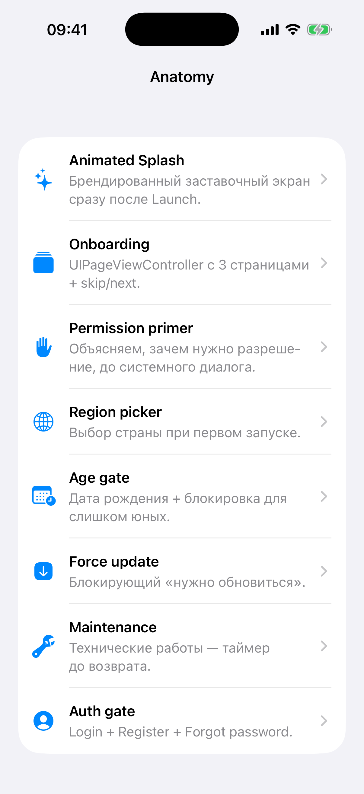

# Глава 22. Anatomy — тур по всем гейтам через modal preview

{width=45%}

Заключительный mini-app Части III. Anatomy of a real app — это
**учебный гид по гейтам**, которые мы построили в Части II. Пользователь
открывает Anatomy, видит список «гейтов запуска», тапает любой — гейт
показывается полноэкранно. Можно посмотреть, как он выглядит, нажать
кнопки, понять flow, и закрыть.

Это удобно для **демонстрации** и **отладки**. Не нужно запускать
конкретный mini-app чтобы увидеть, как выглядит, например,
permission primer для камеры. Просто открой Anatomy → тапни «Permission
primer».

В этой главе разбираем сам Anatomy VC, а также шаблон «modal preview
для отдельных view controller'ов».

## 22.1 Структура UI

```swift
final class AnatomyViewController: UIViewController {
    private struct GateEntry {
        let icon: String
        let title: String
        let subtitle: String
        let presenter: (UIViewController) -> Void
    }

    private let tableView = UITableView(frame: .zero, style: .insetGrouped)
    private lazy var entries: [GateEntry] = makeEntries()
}
```

Очень похоже на Profile (Глава 19) — декларативный массив + одна
функция отрисовки. Здесь упрощённая версия: один тип entry на все
строки.

`presenter: (UIViewController) -> Void` — closure, который **открывает**
гейт. Принимает текущий VC (чтобы knowing откуда presentовать).
Каждая entry содержит свой presenter — это и есть «как именно показать
этот гейт».

## 22.2 Entry — описание одного гейта

```swift
GateEntry(
    icon: "sparkles",
    title: "Animated Splash",
    subtitle: "Брендированный заставочный экран сразу после Launch."
) { [weak self] anchor in
    let manifest = AppRegistry.allApps.first(where: { $0.id == "todo" }) ?? AppRegistry.allApps[0]
    let splash = AnimatedSplashViewController(manifest: manifest) { [weak anchor] in
        anchor?.dismiss(animated: true)
    }
    self?.presentModal(splash)
}
```

Каждая entry:

- **`icon`** — SF Symbol для строки.
- **`title`** — название гейта.
- **`subtitle`** — короткое описание «зачем».
- **`presenter`** — closure, который создаёт VC гейта и показывает его.

Что внутри presenter'а зависит от гейта:

- Для **Animated Splash** — берём какой-то manifest (любой,
  «todo»), создаём `AnimatedSplashViewController`, в callback'е
  `onFinish` — закрываем модалку.
- Для **Onboarding** — берём manifest с пайджами (`onboarding` mini-app).
- Для **Region picker** — создаём с фейковым manifestId
  `"anatomy.demo"`, и после выбора **сбрасываем** UserDefaults (чтобы
  при следующем открытии Anatomy снова показывался picker, как новый).

```swift
GateEntry(
    icon: "globe",
    title: "Region picker",
    subtitle: "Выбор страны при первом запуске."
) { [weak self] _ in
    let picker = RegionPickerViewController(manifestId: "anatomy.demo", brandColor: .systemBlue) { [weak self] _ in
        self?.dismiss(animated: true)
        RegionStorage.shared.reset(for: "anatomy.demo")
    }
    let nav = UINavigationController(rootViewController: picker)
    self?.presentModal(nav)
}
```

Сбрасывать через `RegionStorage.reset(for: "anatomy.demo")` — потому что
гейт сохраняет выбор. Без сброса — следующий заход в Anatomy не покажет
picker (`shouldShow` вернёт false).

## 22.3 Presenter — общая функция

```swift
private func presentModal(_ vc: UIViewController) {
    vc.modalPresentationStyle = .fullScreen
    present(vc, animated: true)
}
```

Все гейты показываем **полноэкранно** (`.fullScreen`), как если бы они
были root'ом окна. Это даёт точное представление о том, как они
выглядят в реальном flow запуска.

Альтернатива — `.pageSheet` (с детентами) — сделала бы гейты «маленькими»,
неправдоподобно. Force-update и maintenance вообще предполагают
блокирующий full-screen.

## 22.4 TableView render

```swift
extension AnatomyViewController: UITableViewDataSource, UITableViewDelegate {
    func tableView(_ tableView: UITableView, numberOfRowsInSection section: Int) -> Int { entries.count }

    func tableView(_ tableView: UITableView, cellForRowAt indexPath: IndexPath) -> UITableViewCell {
        let entry = entries[indexPath.row]
        let cell = tableView.dequeueReusableCell(withIdentifier: "cell", for: indexPath)
        var content = cell.defaultContentConfiguration()
        content.text = entry.title
        content.secondaryText = entry.subtitle
        content.image = UIImage(systemName: entry.icon)
        content.imageProperties.tintColor = .systemBlue
        content.textProperties.font = .systemFont(ofSize: 16, weight: .semibold)
        content.secondaryTextProperties.color = .secondaryLabel
        cell.contentConfiguration = content
        cell.accessoryType = .disclosureIndicator
        return cell
    }

    func tableView(_ tableView: UITableView, didSelectRowAt indexPath: IndexPath) {
        tableView.deselectRow(at: indexPath, animated: true)
        entries[indexPath.row].presenter(self)
    }
}
```

Один тип ячейки — `UIListContentConfiguration` со всеми полями. Тап —
вызов presenter'а.

`textProperties.font` и `secondaryTextProperties.color` — внутри
config настраиваем шрифт и цвет (Глава 19 разбирала это).

## 22.5 Зачем закрытие тонкое — не из координатора

Обрати внимание: в `BootCoordinator` (Глава 4) при `onFinish` гейта
происходит **переход к следующему**. В Anatomy — `dismiss(animated:
true)`. Это **разные** flows:

- В реальном запуске — splash → onboarding → permission → ... → main.
- В Anatomy — splash → закрыли → вернулись в Anatomy.

Поэтому в presenter'е мы **передаём кастомный callback**:

```swift
let splash = AnimatedSplashViewController(manifest: manifest) { [weak anchor] in
    anchor?.dismiss(animated: true)
}
```

`onFinish` указывает не на «следующий гейт», а на «закрой меня». Это
работает потому что splash сам **не знает** что за onFinish — это
просто `() -> Void`. Кто его вызывает (координатор или Anatomy) —
тот решает.

> 💡 **Преимущество callback-style API**. Если бы splash сам знал
> «следующий шаг — onboarding», мы бы не смогли использовать его в
> Anatomy. С абстрактным `onFinish` — гейт переиспользуется в любом
> контексте.

## 22.6 Anatomy — образовательный, не функциональный

Этот mini-app **не используется**: я не делал Anatomy для production.
Он чисто для книги.

Реальное mobile-приложение в production обычно содержит:

- Свой основной функционал.
- Один-два экрана настроек.
- НЕ показывает «тур по UI» в продакшене.

Anatomy полезна в двух сценариях:

1. **Учебная демка** — как в нашей книге.
2. **Скрытый debug-меню** для разработчиков. В production иногда
   делают, доступным после secret-tap'а или в TestFlight-only mode.
   Программисты могут быстро посмотреть как выглядит каждый гейт без
   полного flow.

## 22.7 Скрытый debug-screen — pattern

Если бы мы хотели интегрировать что-то подобное в production, обычно
делают так:

```swift
// В каком-то VC настроек, скрытая активация:
private var versionTapCount = 0

@objc private func versionLabelTapped() {
    versionTapCount += 1
    if versionTapCount >= 7 {
        let debugVC = AnatomyViewController()
        present(UINavigationController(rootViewController: debugVC), animated: true)
        versionTapCount = 0
    }
}
```

7 тапов по версии приложения (как в iOS — 7 тапов на «build number»
включают режим разработчика). Скрыто от обычных юзеров, доступно
для команды.

Можно ещё условие `#if DEBUG`:

```swift
#if DEBUG
let anatomy = UIBarButtonItem(image: UIImage(systemName: "wrench"), ...) { ... }
navigationItem.rightBarButtonItem = anatomy
#endif
```

В release-сборке кнопки не будет вообще.

## 22.8 Бытовая аналогия

Anatomy — это **витрина с инструментами в магазине ремонта**. Каждый
инструмент (гейт) висит за стеклом, можно посмотреть, понажимать
демо-кнопки, понять, как работает. В реальной квартире (production
приложении) инструменты лежат в ящике и используются только когда
надо.

Магазин инструментов нужен для:
- **обучения** (видеть как выглядит то, что обычно срабатывает раз в
  жизни — onboarding);
- **debug** (программист быстро проверяет UI без полного flow);
- **демо** (на собеседовании или презентации показать архитектуру).

## 22.9 Бонус-идеи (что можно добавить в Anatomy)

- **Toggle'ы** для модификации манифеста. Юзер ставит галочки «splash,
  onboarding, permission location, auth» — Anatomy запускает гейт-цепь
  с этой конфигурацией. Был бы фактически полигон.
- **Скриншот-кнопка** — экспортирует screenshot текущего экрана в
  Photos (через `UIGraphicsImageRenderer`). Удобно для документации.
- **Список архитектурных компонентов** — `AppManifest`, `BootCoordinator`,
  `PlaygroundWindow` — с описанием и линком на исходник. Превращает
  Anatomy в живой документ.
- **A/B test viewer** — переключение между разными вариантами одного
  гейта.

Все эти идеи — пища для размышлений. В нашей книге Anatomy остаётся
простым «тур-гидом».

> 🛠 **Упражнение.** Открой Anatomy (серая ячейка с иконкой
> магнита-лупы). Тапни любой гейт — увидишь как он выглядит «вживую».
> Закрой (для большинства гейтов есть кнопка «Назад» или «Закрыть»).
> Попробуй все — это самый быстрый способ ознакомиться со всеми
> учебными UI-компонентами книги.

## 22.10 Что мы пропустили

Эта глава короткая, потому что код Anatomy простой и опирается на
ранее построенные гейты. Не пропустили ничего критичного — паттерн
«decl-array + presenter-closures» мы видели в Главе 19 (Profile),
паттерн «modal с full-screen» — стандарт UIKit.

## 📋 Что мы выучили

- Anatomy — **обучающий** mini-app, не функциональный. Может стать
  скрытым debug-меню в production.
- Структура та же, что в Profile: массив `[GateEntry]`, одна
  функция отрисовки.
- **`presenter: (UIViewController) -> Void`** — closure, который
  знает как открыть конкретный гейт. Принимает anchor (VC, откуда
  открывать).
- Гейт показывается **`.fullScreen`** — точное соответствие реальному
  flow запуска.
- Гейты — **переиспользуемые**: один и тот же `AnimatedSplashViewController`
  работает и в BootCoordinator (с callback'ом → следующий гейт), и в
  Anatomy (с callback'ом → dismiss). Возможно благодаря
  callback-style API.
- Для гейтов с UserDefaults storage (region, age) в Anatomy —
  **сбрасываем** после dismiss, чтобы каждый заход показывал «свежий»
  гейт.
- Debug-flow с #if DEBUG или 7-tap-secret — стандартные паттерны для
  скрытого доступа к dev-инструментам.

## Apple Developer Documentation

- [HIG: App architecture](https://developer.apple.com/design/human-interface-guidelines/patterns) — обзорный гайд: launch experience, навигация, modality. Anatomy — наглядный тур по этим элементам.
- [HIG: Launching](https://developer.apple.com/design/human-interface-guidelines/launching) — рекомендации Apple по splash/первому запуску. Полезно сверить наш `AnimatedSplashViewController` с гайдлайном.
- [HIG: Onboarding](https://developer.apple.com/design/human-interface-guidelines/onboarding) — про объём и тон onboarding'а; в Anatomy этот гейт доступен изолированно.
- [HIG: Modality](https://developer.apple.com/design/human-interface-guidelines/modality) — когда использовать `.fullScreen` vs `.pageSheet`. Anatomy всегда `.fullScreen`, чтобы гейт выглядел как root запуска.
- [UIViewController](https://developer.apple.com/documentation/uikit/uiviewcontroller) — базовый класс; `present(_:animated:completion:)` и `dismiss(animated:completion:)` управляют модальной презентацией.
- [UIApplicationDelegate](https://developer.apple.com/documentation/uikit/uiapplicationdelegate) — точка входа приложения и lifecycle на уровне процесса.
- [UISceneDelegate](https://developer.apple.com/documentation/uikit/uiscenedelegate) — современный lifecycle для multi-window iOS; в нашем playground'е сцена одна, но Anatomy показывает гейты, которые поднимаются на старте сцены.
- [UIWindow](https://developer.apple.com/documentation/uikit/uiwindow) — корневое окно; в `PlaygroundWindow` мы держим один `rootViewController`, который меняем при переходе между гейтами.
- [Swift Book — Concurrency](https://docs.swift.org/swift-book/documentation/the-swift-programming-language/concurrency/) — `async/await` и `MainActor`. Anatomy и большинство гейтов запускаются на main actor, и storage-сбросы (`RegionStorage.reset`) синхронны, потому что UI-state.
- [#if DEBUG / Active Compilation Conditions](https://developer.apple.com/documentation/swift/swift-standard-library) — официальный способ скрыть debug-меню в release-сборке.

---

🎉 **Это конец Части III.** Дальше — Часть IV, UI Cookbook. Это не
mini-приложения, а **справочник UI-паттернов**: pull-to-refresh,
skeleton, search, modals, gestures, forms, animations, haptics,
accessibility, theming. По 4-8 рецептов в каждой главе. Открываешь
когда нужен конкретный паттерн, забираешь в свой проект.

→ [Глава 23. Cookbook: загрузка — pull-to-refresh, infinite scroll, skeleton, button spinners](./40-cookbook-loading.md)
