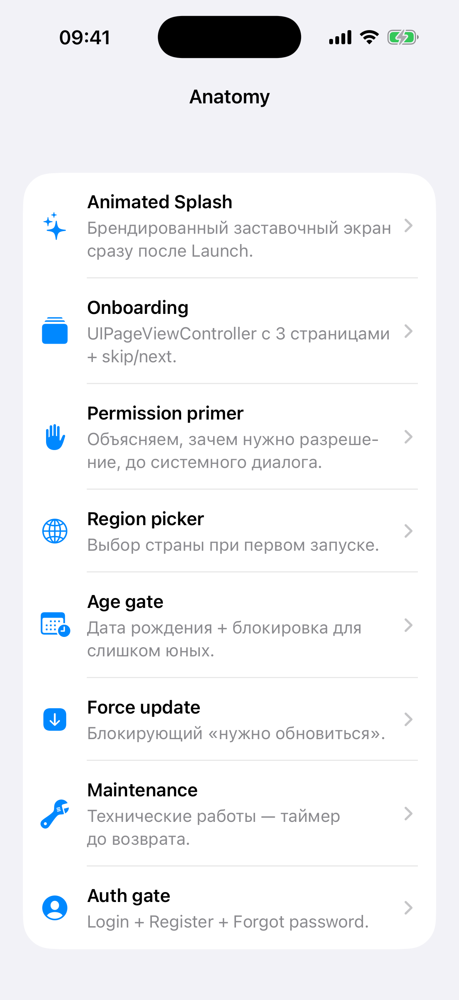

# Глава 22. Anatomy — тур по всем гейтам через modal preview

{width=45%}

Заключительный mini-app Части III. Anatomy — **учебный гид по гейтам**,
которые мы построили в Части II. Напомним: **гейт** (gate, «ворота») — экран,
который стоит на пути от запуска к основному содержимому: заставка,
онбординг, запрос разрешений, вход, выбор региона. Пользователь открывает
Anatomy, видит список гейтов, тапает любой — гейт показывается на весь экран.
Можно посмотреть, как он выглядит, понажимать кнопки и закрыть.

Это удобно для **демонстрации** и **отладки**. Чтобы увидеть, скажем, запрос
разрешения на камеру, не нужно сбрасывать приложение и проходить весь запуск
заново — открыл Anatomy, тапнул «Permission primer».

В главе разбираем сам экран Anatomy, шаблон «показать отдельный экран
модально», скрытое меню разработчика и — в конце — **анатомию самого UIKit**:
от кого наследуются классы, которыми мы пользовались всю книгу. Цепочки
наследования не по памяти: мы распечатали их в рантайме.

> **Режим компиляции.** Код главы собран в проекте с deployment target
> iOS 15.0, Swift 6, Default Actor Isolation = MainActor. Классы гейтов
> (`AnimatedSplashViewController`, `RegionPickerViewController`,
> `RegionStorage`, `AppRegistry`) — из глав 1, 2 и 10; для проверки мы
> подставляли их упрощённые заглушки с теми же инициализаторами.

## 22.1 Структура UI

```swift
final class AnatomyViewController: UIViewController {
    private struct GateEntry {
        let icon: String
        let title: String
        let subtitle: String
        let presenter: (UIViewController) -> Void
    }

    private static let cellID = "gate"
    private let tableView = UITableView(frame: .zero, style: .insetGrouped)
    private lazy var entries: [GateEntry] = makeEntries()

    override func viewDidLoad() {
        super.viewDidLoad()
        title = "Anatomy"
        tableView.register(UITableViewCell.self, forCellReuseIdentifier: Self.cellID)
        tableView.dataSource = self
        tableView.delegate = self
        tableView.translatesAutoresizingMaskIntoConstraints = false
        view.addSubview(tableView)
        NSLayoutConstraint.activate([
            tableView.topAnchor.constraint(equalTo: view.topAnchor),
            tableView.bottomAnchor.constraint(equalTo: view.bottomAnchor),
            tableView.leadingAnchor.constraint(equalTo: view.leadingAnchor),
            tableView.trailingAnchor.constraint(equalTo: view.trailingAnchor),
        ])
    }
}
```

Похоже на Profile (глава 19): декларативный массив описаний + одна функция
отрисовки. Здесь всё проще — один тип строки на весь список.

`GateEntry` — описание одной строки: иконка, заголовок, подзаголовок и
**`presenter`** — замыкание, которое умеет открыть этот гейт. Параметр
`UIViewController` — экран-«якорь», с которого показываем гейт
(в Anatomy это сам `AnatomyViewController`). Каждая строка знает,
**как именно** показать свой гейт, а таблица об этом не знает ничего.

`register(_:forCellReuseIdentifier:)` — говорим таблице, какой класс ячейки
создавать для идентификатора «gate». Без регистрации
`dequeueReusableCell(withIdentifier:for:)` в 22.4 **роняет** приложение с сообщением «unable to dequeue a cell with identifier gate».
Этот вариант метода требует регистрации — в отличие от старого
`dequeueReusableCell(withIdentifier:)` без `for:`, который возвращает
опционал.

`private lazy var entries` — `lazy` («ленивый»): массив создаётся при
первом обращении, а не в инициализаторе. Иначе `makeEntries()` — метод
экземпляра — нельзя было бы вызвать при инициализации свойства.

## 22.2 Entry — описание одного гейта

```swift
private func makeEntries() -> [GateEntry] {
    [
        GateEntry(
            icon: "sparkles",
            title: "Animated Splash",
            subtitle: "Брендированный заставочный экран сразу после Launch."
        ) { anchor in
            let manifest = AppRegistry.allApps.first { $0.id == "todo" } ?? AppRegistry.allApps[0]
            let splash = AnimatedSplashViewController(manifest: manifest) { [weak anchor] in
                anchor?.dismiss(animated: true)
            }
            Self.presentFullScreen(splash, from: anchor)
        },
        GateEntry(
            icon: "globe",
            title: "Region picker",
            subtitle: "Выбор страны при первом запуске."
        ) { anchor in
            let picker = RegionPickerViewController(manifestId: "anatomy.demo",
                                                    brandColor: .systemBlue) { [weak anchor] _ in
                anchor?.dismiss(animated: true)
                RegionStorage.shared.reset(for: "anatomy.demo")
            }
            Self.presentFullScreen(UINavigationController(rootViewController: picker), from: anchor)
        },
        // ... остальные гейты — по тому же шаблону
    ]
}
```

Что внутри `presenter` зависит от гейта:

- **Animated Splash** — берём любой манифест (здесь «todo», а если его нет —
  первый), создаём `AnimatedSplashViewController`, в callback'е
  `onFinish` закрываем модалку. **Callback** («обратный вызов») — замыкание,
  которое экран вызовет сам, когда закончит работу.
- **Region picker** — создаём с выдуманным `manifestId` `"anatomy.demo"`, а
  после выбора **сбрасываем** сохранённый регион. Выбор хранится в
  `UserDefaults` (глава 10); без сброса при новом заходе в Anatomy гейт
  решил бы «регион уже выбран» и не показался.

Обрати внимание на захваты. Замыкания-presenter'ы **не трогают `self`**:
всё нужное приходит параметром `anchor`, а показ идёт через статическую
функцию `Self.presentFullScreen`. Это не случайность. Массив `entries`
хранится внутри `AnatomyViewController`, замыкания хранятся в массиве. Если
бы замыкание захватило `self` сильно, получился бы круг
«экран → entries → замыкание → экран», и экран Anatomy никогда не
освободился бы из памяти (retain cycle). Первая версия главы спасалась
`[weak self]`; без захвата вообще — проще и надёжнее.

Внутренние замыкания (`onFinish` сплэша, выбор региона) хранятся уже в
показанном гейте, а гейт показан **с** якоря. Якорь держит гейт
(`presentedViewController`), гейт держит замыкание — поэтому внутри
`[weak anchor]`: иначе снова круг.

## 22.3 Presenter — общая функция

```swift
private static func presentFullScreen(_ vc: UIViewController, from anchor: UIViewController) {
    vc.modalPresentationStyle = .fullScreen
    anchor.present(vc, animated: true)
}
```

**Модальный показ** (`present`) — экран появляется поверх текущего и
закрывается `dismiss`. Стиль `.fullScreen` — на весь экран, без карточки
сверху, как если бы гейт был корневым экраном окна. Так видно, как он
выглядит в настоящем запуске.

По умолчанию с iOS 13 модальные экраны показываются **листом**
(`.pageSheet` / `.automatic`): карточка, из-под которой виден предыдущий
экран, и её можно смахнуть вниз. Для Anatomy это неправдоподобно:
force-update и maintenance (глава 9) по смыслу **блокируют** приложение и
смахиваться не должны.

`static` — функция не нужна экземпляру: всё, что ей требуется, приходит
параметрами. Поэтому замыкания в 22.2 вызывают её через `Self.` без захвата
`self`.

`UINavigationController(rootViewController: picker)` для региона — picker
рассчитан на навигационную панель с заголовком и кнопкой, поэтому
оборачиваем его, как в настоящем запуске.

## 22.4 TableView render

```swift
extension AnatomyViewController: UITableViewDataSource, UITableViewDelegate {
    func tableView(_ tableView: UITableView, numberOfRowsInSection section: Int) -> Int {
        entries.count
    }

    func tableView(_ tableView: UITableView, cellForRowAt indexPath: IndexPath) -> UITableViewCell {
        let entry = entries[indexPath.row]
        let cell = tableView.dequeueReusableCell(withIdentifier: Self.cellID, for: indexPath)
        var content = cell.defaultContentConfiguration()
        content.text = entry.title
        content.secondaryText = entry.subtitle
        content.image = UIImage(systemName: entry.icon)
        content.imageProperties.tintColor = .systemBlue
        content.textProperties.font = .preferredFont(forTextStyle: .headline)
        content.secondaryTextProperties.color = .secondaryLabel
        cell.contentConfiguration = content
        cell.accessoryType = .disclosureIndicator
        return cell
    }

    func tableView(_ tableView: UITableView, didSelectRowAt indexPath: IndexPath) {
        tableView.deselectRow(at: indexPath, animated: true)
        entries[indexPath.row].presenter(self)
    }
}
```

Одна ячейка на все строки — `UIListContentConfiguration` (iOS 14+,
подробно в главе 19): заголовок, подзаголовок, картинка слева.
`defaultContentConfiguration()` даёт заготовку в системном стиле, мы меняем
только нужное.

`textProperties.font = .preferredFont(forTextStyle: .headline)` — жирный
системный стиль, который растёт с настройкой размера шрифта (Dynamic Type).
Первая версия ставила `systemFont(ofSize: 16, weight: .semibold)` — такой
шрифт не увеличивается.

`accessoryType = .disclosureIndicator` — серая стрелка «›» справа: «тап
откроет что-то новое».

`deselectRow(at:animated:)` — снимаем серую подсветку строки после тапа.
Без этого, закрыв гейт, пользователь увидит выделенную строку.

`presenter(self)` — передаём себя как якорь. Здесь `self` — просто аргумент
вызова, а не захват в хранимое замыкание, так что круга нет.

## 22.5 Закрытие — не координатор, а callback

В `BootCoordinator` (глава 4) `onFinish` гейта ведёт к **очередному** гейту цепочки.
В Anatomy — к `dismiss`. Это разные сценарии:

- настоящий запуск: заставка → онбординг → разрешения → … → основной экран;
- Anatomy: заставка → закрыли → снова список Anatomy.

Поэтому в presenter'е передаём свой callback:

```swift
let splash = AnimatedSplashViewController(manifest: manifest) { [weak anchor] in
    anchor?.dismiss(animated: true)
}
```

`onFinish` означает не «перейди к очередному гейту», а «закрой меня». Это
работает, потому что заставка **не знает**, что будет дальше: для неё
`onFinish` — просто `() -> Void`. Что делать после — решает тот, кто её
создал: координатор или Anatomy.

`anchor?.dismiss(animated: true)` — вызываем `dismiss` у **показывающего**
экрана, а не у самой заставки. Оба варианта работают: если вызвать `dismiss`
у экрана, который сам ничего не показывает, UIKit перешлёт вызов тому, кто
показал его. Но «закрывает тот, кто открыл» читается однозначнее.

> **Плюс callback-API.** Если бы заставка сама знала, что после неё идёт
> онбординг, её нельзя было бы показать в Anatomy отдельно. С абстрактным
> `onFinish` гейт переиспользуется где угодно.

## 22.6 Anatomy — учебный, а не рабочий экран

В обычном приложении пользователю не нужен «тур по экранам запуска». Anatomy
полезна в двух сценариях:

1. **Учебная демонстрация** — как в нашей книге.
2. **Скрытое меню разработчика** (debug menu) — экран, где команда видит
   все гейты, переключает сервер, сбрасывает флаги. В сборке для
   App Store его прячут или вырезают совсем.

## 22.7 Скрытый debug-экран — паттерн

Два распространённых способа спрятать такой экран.

**Секретный жест.** Например, семь тапов по номеру версии на экране
«О приложении»:

```swift
final class AboutViewController: UIViewController {
    private let versionLabel = UILabel()
    private var versionTapCount = 0

    override func viewDidLoad() {
        super.viewDidLoad()
        let version = Bundle.main.object(forInfoDictionaryKey: "CFBundleShortVersionString") as? String ?? "?"
        versionLabel.text = "Версия \(version)"
        versionLabel.isUserInteractionEnabled = true      // у UILabel по умолчанию false
        versionLabel.addGestureRecognizer(
            UITapGestureRecognizer(target: self, action: #selector(versionLabelTapped)))

        #if DEBUG
        navigationItem.rightBarButtonItem = UIBarButtonItem(
            image: UIImage(systemName: "wrench.and.screwdriver"),
            primaryAction: UIAction { [weak self] _ in self?.openAnatomy() })
        #endif
    }

    @objc private func versionLabelTapped() {
        versionTapCount += 1
        if versionTapCount >= 7 {
            versionTapCount = 0
            openAnatomy()
        }
    }

    private func openAnatomy() {
        present(UINavigationController(rootViewController: AnatomyViewController()), animated: true)
    }
}
```

`CFBundleShortVersionString` — ключ **Info.plist** (файла с описанием
приложения внутри его пакета) с «маркетинговой» версией, той, что видна в
App Store: «1.4.2».

`versionLabel.isUserInteractionEnabled = true` — без этой строки жест
никогда не сработает: у `UILabel` касания по умолчанию выключены. Мы
проверили это в симуляторе: у свежего `UILabel` и `UIImageView`
`isUserInteractionEnabled == false`, у обычного `UIView` — `true`.

Семь тапов — привычка, пришедшая с Android: там семь тапов по «Номеру сборки»
в настройках включают режим разработчика. В iOS такого системного жеста нет;
число 7 просто достаточно большое, чтобы не набрать его случайно.

Секретный жест прячет экран, но **не защищает** его: кто знает жест, тот
войдёт. Не клади в такое меню ничего опасного для обычного пользователя.

**Условная компиляция.** `#if DEBUG … #endif` — код внутри попадёт только в
отладочную сборку. `DEBUG` — флаг, который шаблон проекта Xcode задаёт в
конфигурации Debug (Build Settings → Active Compilation Conditions). В сборке
Release, которая уходит в App Store, кнопки не будет **вообще** — её код даже
не компилируется.

`UIBarButtonItem(image:primaryAction:)` (iOS 14+) — кнопка панели с
действием-замыканием. Записи вида `UIBarButtonItem(image: ..., ...) { ... }`
(с замыканием в конце) не бывает — такого инициализатора нет.

**Упражнение 22.1.** Добавь в `AboutViewController` сброс счётчика тапов, если
между тапами прошло больше 2 секунд: семь тапов должны быть **подряд**.
Подсказка: запоминай `Date()` последнего тапа. Решение — в конце главы.

## 22.8 Анатомия UIKit: кто от кого наследуется

Anatomy показывает гейты, а под ними — одни и те же «кирпичи» UIKit. Полезно
один раз увидеть их родословную: многое в поведении объясняется тем, **кто
родитель**.

Цепочку предков можно не вспоминать, а спросить у рантайма Objective-C:

```swift
/// «Родословная» класса: сам класс → родитель → … → корень.
func superclassChain(of cls: AnyClass) -> String {
    var names = [NSStringFromClass(cls)]
    var current: AnyClass? = class_getSuperclass(cls)
    while let next = current {
        names.append(NSStringFromClass(next))
        current = class_getSuperclass(next)
    }
    return names.joined(separator: " → ")
}
```

`class_getSuperclass` — функция рантайма: «дай родительский класс». У корня
цепочки родителя нет — вернётся `nil`, и цикл закончится.
`NSStringFromClass` — имя класса строкой. Вызов:
`print(superclassChain(of: UITableView.self))`.

Результат в симуляторе iOS 26.5:

```
UIApplication        → UIResponder → NSObject
UIWindowScene        → UIScene → UIResponder → NSObject
UIWindow             → UIView → UIResponder → NSObject
UIViewController     → UIResponder → NSObject
UINavigationController → UIViewController → UIResponder → NSObject
UITableView          → UIScrollView → UIView → UIResponder → NSObject
UICollectionView     → UIScrollView → UIView → UIResponder → NSObject
UIButton             → UIControl → UIView → UIResponder → NSObject
UIRefreshControl     → UIControl → UIView → UIResponder → NSObject
UILabel              → UIView → UIResponder → NSObject
UIStackView          → UIView → UIResponder → NSObject
UIScreenEdgePanGestureRecognizer → UIPanGestureRecognizer → UIGestureRecognizer → NSObject
CAGradientLayer      → CALayer → NSObject
```

Что из этого следует на практике.

**`UIResponder` — общий предок** приложения, сцены, окна, экранов и всех view.
**Responder** («отвечающий») — объект, который умеет получать события:
касания, нажатия клавиш, жесты «встряхнуть», команды меню. Они выстраиваются
в **responder chain** — цепочку, по которой событие идёт снизу вверх, пока
кто-то его не обработает: view → его superview → … → view экрана → экран →
окно → сцена → приложение. Так работал shake-жест в `PlaygroundWindow`
(глава 3): окно — responder, и событие «встряхнули» доходит до него.

**First responder** («первый отвечающий») — тот, кто сейчас получает ввод
с клавиатуры: например, текстовое поле, в котором мигает курсор.
`becomeFirstResponder()` поднимает клавиатуру, `resignFirstResponder()` (или
`view.endEditing(true)` из главы 23) — убирает.

**`UIViewController` — не view.** Экран наследует `UIResponder`, а не
`UIView`: он **управляет** своим view (`view`), но сам на экране не рисуется.
Поэтому у экрана нет `frame`, а у его `view` — есть.

**`UITableView` и `UICollectionView` — это `UIScrollView`.** Отсюда в
главе 21 `contentOffset` и `contentInset` у таблицы, а в главе 23 —
`refreshControl` у любого списка: они унаследованы от scroll view.

**`UIRefreshControl` и `UIButton` — это `UIControl`.** Поэтому у обоих
одинаковое `addAction(_:for:)` и события вроде `.valueChanged` и
`.touchUpInside`.

**`UIScreenEdgePanGestureRecognizer` — это `UIPanGestureRecognizer`.**
Поэтому в главе 20 один обработчик `handlePan(_:)` принимает и жест от края,
и обычное перетаскивание: у обоих есть `translation(in:)` и `velocity(in:)`.

**`CAGradientLayer` — это `CALayer`**, а не view: у слоя нет Auto Layout и
касаний. Отсюда трюк с `layerClass` в главе 21.

**`UIWindow` — это `UIView`**, просто самый верхний. Поэтому в главе 23
overlay можно было положить прямо в окно через `addSubview`.

**Упражнение 22.2.** Распечатай цепочку для `UIAlertController`,
`UISearchBar` и `UITextField`. От кого наследуется каждый и что это значит
для их поведения? Ответ — в конце главы.

## 22.9 Бытовая аналогия

Anatomy — **витрина с инструментами в магазине**. Каждый инструмент (гейт)
висит за стеклом, его можно взять в руки и попробовать. В квартире (рабочем
приложении) инструменты лежат в ящике и достаются, только когда нужны.

Витрина нужна для **обучения** (посмотреть то, что в жизни срабатывает один
раз — онбординг), для **отладки** (разработчик проверяет экран без полного
запуска) и для **демонстрации** (показать архитектуру на собеседовании).

А раздел 22.8 — **родословная** инструментов: дрель и шуруповёрт — родня,
поэтому у них одинаковый патрон.

## 22.10 Бонус-идеи

- **Переключатели гейтов.** Галочки «заставка, онбординг, разрешение,
  вход» — и Anatomy запускает цепочку гейтов с такой конфигурацией. Получится
  настоящий полигон для `BootCoordinator`.
- **Кнопка «Снимок экрана»** — рисует текущий экран в картинку через
  `UIGraphicsImageRenderer` и сохраняет в Фото (`UIImageWriteToSavedPhotosAlbum`).
  Для сохранения в Фото нужен ключ `NSPhotoLibraryAddUsageDescription` в
  Info.plist с объяснением для пользователя, иначе приложение упадёт при
  первом сохранении.
- **Список архитектурных компонентов** — `AppManifest`, `BootCoordinator`,
  `PlaygroundWindow` с описанием: Anatomy превращается в живую документацию.
- **Варианты одного гейта** — например, два дизайна онбординга рядом для
  сравнения (A/B-тест).

## Ответы к упражнениям

**Упражнение 22.1.**

```swift
private var lastTapDate = Date.distantPast

@objc private func versionLabelTapped() {
    let now = Date()
    if now.timeIntervalSince(lastTapDate) > 2 {
        versionTapCount = 0          // слишком долгая пауза — начинаем сначала
    }
    lastTapDate = now
    versionTapCount += 1
    if versionTapCount >= 7 {
        versionTapCount = 0
        openAnatomy()
    }
}
```

`Date.distantPast` — дата «давным-давно»: первый тап всегда начинает отсчёт
с нуля. `timeIntervalSince` — разница в секундах. Семь тапов с паузами по
секунде откроют меню; пауза в три секунды после пятого тапа — сбросит
счётчик.

**Упражнение 22.2.** В симуляторе iOS 26.5:

```
UIAlertController → UIViewController → UIResponder → NSObject
UISearchBar       → UIView → UIResponder → NSObject
UITextField       → UIControl → UIView → UIResponder → NSObject
```

`UIAlertController` — полноценный экран: его показывают через `present`,
а не `addSubview`. `UISearchBar` — просто view, не контрол: у него нет
`addAction(_:for:)`, события приходят через делегат `UISearchBarDelegate`.
`UITextField` — контрол, поэтому на него можно повесить
`addAction(_, for: .editingChanged)` и узнавать о каждом изменении текста.

## Что мы выучили

- Anatomy — **учебный** mini-app; тот же приём — основа скрытого меню
  разработчика.
- Структура как в Profile: массив `[GateEntry]` + одна функция отрисовки.
  `dequeueReusableCell(withIdentifier:for:)` требует `register`.
- `presenter: (UIViewController) -> Void` получает якорь параметром — тогда
  хранимым замыканиям не нужен `self`, и retain cycle невозможен.
- Гейт показывается `.fullScreen` — как в настоящем запуске; лист
  `.pageSheet` можно смахнуть, блокирующим гейтам это не подходит.
- Гейты переиспользуются благодаря callback-API: один
  `AnimatedSplashViewController` работает и в координаторе, и в Anatomy.
- Гейтам, которые запоминают выбор в `UserDefaults`, в Anatomy делаем сброс.
- Скрытый доступ — `#if DEBUG` (кода нет в Release) или секретный жест (код
  есть, просто спрятан).
- `UIResponder` — общий предок приложения, сцены, окна, экранов и view;
  `UITableView`/`UICollectionView` — наследники `UIScrollView`, `UIButton` и
  `UIRefreshControl` — `UIControl`, экран — **не** view.

## Apple Developer Documentation

- [HIG: Patterns](https://developer.apple.com/design/human-interface-guidelines/patterns) — обзор паттернов: запуск, онбординг, модальность.
- [HIG: Launching](https://developer.apple.com/design/human-interface-guidelines/launching) — рекомендации Apple по первому запуску.
- [HIG: Onboarding](https://developer.apple.com/design/human-interface-guidelines/onboarding) — объём и тон онбординга.
- [HIG: Modality](https://developer.apple.com/design/human-interface-guidelines/modality) — когда полный экран, когда лист.
- [present(_:animated:completion:)](https://developer.apple.com/documentation/uikit/uiviewcontroller/present(_:animated:completion:)) и [dismiss(animated:completion:)](https://developer.apple.com/documentation/uikit/uiviewcontroller/dismiss(animated:completion:)) — модальный показ и закрытие.
- [UIModalPresentationStyle](https://developer.apple.com/documentation/uikit/uimodalpresentationstyle) — `.fullScreen`, `.pageSheet`, `.automatic`.
- [UIResponder](https://developer.apple.com/documentation/uikit/uiresponder) — общий предок; responder chain и first responder.
- [Using responders and the responder chain to handle events](https://developer.apple.com/documentation/uikit/using-responders-and-the-responder-chain-to-handle-events) — как событие идёт по цепочке.
- [class_getSuperclass(_:)](https://developer.apple.com/documentation/objectivec/class_getsuperclass(_:)) — функция рантайма из раздела 22.8.
- [Compiler Control Statements](https://docs.swift.org/swift-book/documentation/the-swift-programming-language/statements/#Compiler-Control-Statements) — `#if DEBUG` и условная компиляция в Swift.

---

**Это конец Части III.** Дальше — Часть IV, UI Cookbook. Это не
mini-приложения, а **справочник UI-паттернов**: pull-to-refresh, skeleton,
поиск, модалки, жесты, формы, анимации, haptics, доступность, темы. По
несколько рецептов в главе. Открываешь, когда нужен конкретный паттерн, и
забираешь в свой проект.

→ [Глава 23. Cookbook — загрузка](./40-cookbook-loading.md)
